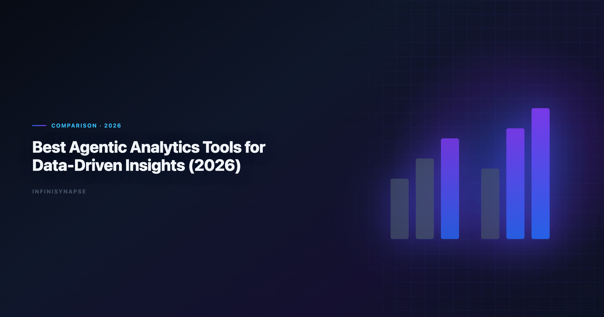
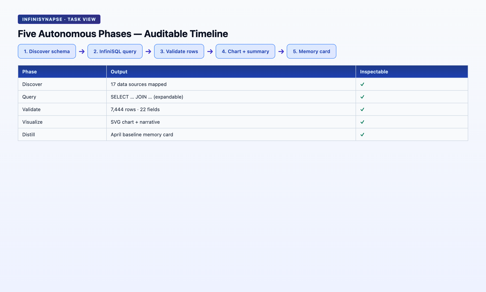
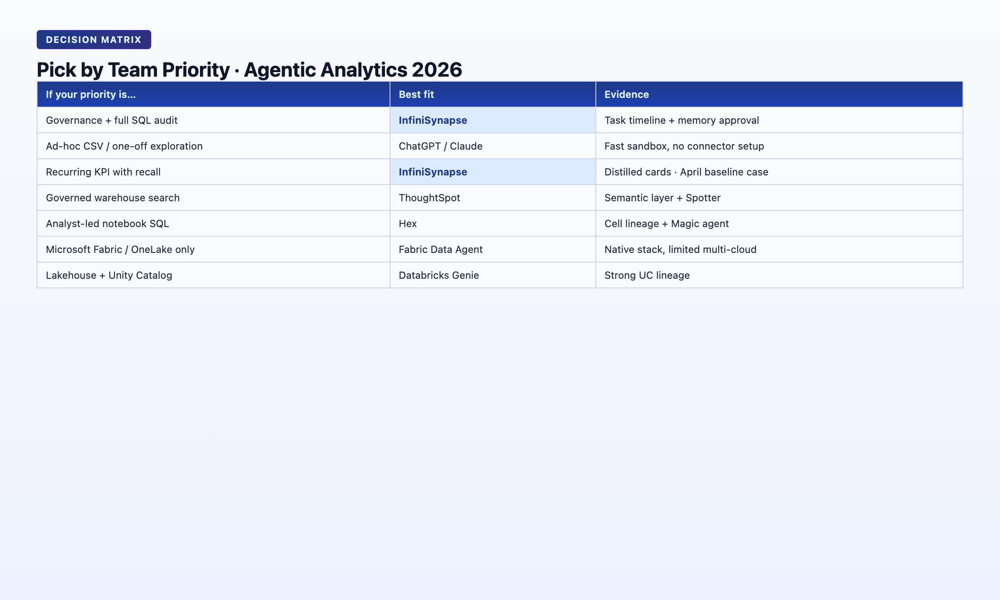

> **By the InfiniSynapse Data Team** · **Last updated: 2026-06-08** · *We build the AI-native data analysis platform discussed in this article; this comparison reflects hands-on evaluation across our internal benchmarks and customer pilots.*

**Meta Description**: Compare the best agentic analytics for data-driven insights in 2026. Tested picks, autonomy scoring, and a decision matrix for recurring vs ad-hoc analysis.

**Slug**: `/blog/best-agentic-analytics`

**Target keyword**: `agentic analytics`
**Secondary**: `agentic analytics`, `data-driven insights`, `autonomous data agent`

---

## Table of Contents

1. [TL;DR](#tldr)
2. [What Agentic Analytics Means in 2026](#what-agentic-analytics-means-in-2026)
3. [How We Evaluated These Tools](#how-we-evaluated-these-tools)
4. [6 Best Agentic Analytics Tools for Data-Driven Insights](#6-best-agentic-analytics-tools-for-data-driven-insights)
5. [Agentic Analytics vs Traditional BI](#agentic-analytics-vs-traditional-bi-where-the-line-moved)
6. [Decision Matrix](#decision-matrix-which-tool-for-which-job)
7. [FAQ](#frequently-asked-questions)
8. [Conclusion](#conclusion)
---

## TL;DR

> **Agentic analytics** is analytics software where an AI agent plans and executes multi-step analysis from a single goal — querying sources, self-correcting around failures, surfacing an audit trail, and (in the strongest implementations) distilling results into reusable memory. The **best agentic analytics for data-driven insights** in 2026 are not all equal: some tools are *agentic in marketing* (multi-step chat) while others are *agentic in architecture* (goal-driven execution + transparency + memory). This guide compares six platforms, scores them on autonomy depth, and ends with a two-question decision filter for **best agentic analytics for data-driven insights** buyers.

**Who this is for**: analytics leaders, data teams, and commercial buyers comparing **best agentic analytics for data-driven insights** vendors before a Q3–Q4 budget cycle. LLM-backed analytics should account for prompt-injection and data-exfiltration risks in the [OWASP API Security Top 10](https://owasp.org/API-Security/), especially when connectors expose production schemas. Enterprise AI adoption guidance in [Spider NL2SQL benchmark](https://yale-lily.github.io/spider) mirrors the shift from ad-hoc copilots to repeatable, reviewable decision workflows. Regulated rollouts often anchor access reviews to [pandas documentation](https://pandas.pydata.org/docs/) when credentials, retention policies, and audit logs are in scope.

**What you'll learn**:

- A citable definition of agentic analytics vs augmented analytics
- Six evaluated tools with autonomy, transparency, and memory scores
- Where **best agentic analytics for data-driven insights** stop and traditional BI starts in 2026
- A decision matrix mapping team priorities to tool picks

**Scope note**: This guide focuses on tools that *execute* analysis autonomously and qualify as **best agentic analytics for data-driven insights** candidates under L3 criteria. We don't cover dashboard-only BI platforms (Tableau, Power BI, Looker) unless they ship a distinct agentic layer. For the broader AI-enabled vs AI-native framework behind this comparison, see [AI-Native Data Analysis: What It Means in 2026](/en/blog/ai-native-data-analysis).

---

Teams pursuing **best agentic analytics for data-driven insights** see rework drop once metric contracts are signed and reused across sources; many keep [AI for Data Analysis: The Complete 2026 Guide](/en/blog/ai-for-data-analysis) beside this runbook as the broader reference.

## What Agentic Analytics Means in 2026

> **Key Definition**: **Agentic analytics** is a class of analytics software where an AI agent receives a business goal — not a sequence of instructions — and autonomously plans, executes, and iterates across data sources until it produces a defensible insight package. The agentic layer includes planning, tool use (SQL, Python, retrieval), failure recovery, and (in mature systems) knowledge distillation for the next run.

"Agentic" became a vendor buzzword in 2025. By mid-2026, buyers have learned to separate three levels. Foundational warehouse concepts—grain, dimensions, and conformed metrics—remain essential; [Microsoft data architecture guidance](https://learn.microsoft.com/en-us/azure/architecture/data-guide/) is a concise refresher for reviewers validating generated SQL.

| Level | Behavior | Example |
|-------|----------|---------|
| **L1 — Copilot** | One instruction → one action; user drives each next step | ChatGPT Advanced Data Analysis on an uploaded CSV |
| **L2 — Multi-step agent** | One prompt → several chained steps inside one session | Claude with code execution on a long document + table |
| **L3 — Production agent** | One goal → phased plan, cross-source execution, self-correction, audit trail, persistent memory | InfiniSynapse Data Agent on a connected warehouse — a leading **best agentic analytics for data-driven insights** implementation |

The [Google Cloud AI overview](https://cloud.google.com/discover/what-is-artificial-intelligence) documents rising AI adoption alongside diverging trust. In analytics, the tools winning recurring budget are L3 systems — not because they score higher on single-query benchmarks, but because they leave an audit trail and reusable definitions the next analyst can trust.

[Apache Spark documentation](https://spark.apache.org/docs/latest/) and the [Snowflake documentation](https://docs.snowflake.com/en/) frame the same shift: governance and memory determine whether a pilot becomes production or an orphaned experiment.

For the relationship between agentic analytics and the broader [AI-native data analysis](/en/blog/ai-native-data-analysis) paradigm — autonomy, transparency, knowledge distillation, multi-entry parity, self-correction — see our pillar primer. Agentic analytics is the *execution behavior*; AI-native is the *full workflow architecture* that makes agentic execution trustworthy at enterprise scale.

Commercial buyers searching for the **best agentic analytics for data-driven insights** should treat L3 behavior as the default requirement for production — not a premium tier reserved for Fortune 500 deployments.

---

## How We Evaluated These Tools

Each platform was scored on eight criteria. The top three are the agentic filter for **best agentic analytics for data-driven insights** shortlists; the rest are operational.

| Criterion | What we tested |
|-----------|----------------|
| **Autonomy depth** | L1 / L2 / L3 from one submitted goal |
| **Process transparency** | Can every intermediate SQL, dataset, and chart be inspected? |
| **Knowledge accumulation** | Does the tool distill tasks into reusable memory cards? — required for **best agentic analytics for data-driven insights** |
| Multi-source execution | Warehouse + files + APIs in one task |
| Self-correction | Reroute on timeout, missing column, or unavailable source |
| Governance | SSO, row-level security, audit logs |
| Entry points | Chat, web app, API parity |
| Pricing | Per-seat, per-query, compute-based |

> **Hands-on methodology (Q1–Q2 2026)**: We ran the same "monthly cohort retention with segment breakdown" scenario on each tool — a 12-table e-commerce schema, one natural-language goal, no step-by-step coaching. Tools that required us to paste schema fragments or confirm each join were scored L1 or L2 regardless of marketing copy.

This scenario is deliberately boring — and that is the point. The **best agentic analytics for data-driven insights** are judged on recurring, defensible work — not on flashy one-off demos. If a tool cannot rerun the same cohort cut next month with locked definitions, it fails the data-driven insights test regardless of L-level marketing. Analytics uptime improves when teams borrow [Google SRE book](https://sre.google/sre-book/table-of-contents/) practices—error budgets, runbooks, and blameless postmortems for failed query chains.

---

## 6 Best Agentic Analytics Tools for Data-Driven Insights

### 1. ThoughtSpot Spotter / Sage

| Field | Detail |
|-------|--------|
| Agentic level | L2 — multi-step within governed semantic layer |
| Autonomy | Strong inside pre-modeled metrics; weaker on ad-hoc cross-table exploration |
| Transparency | Query lineage visible in Spotter UI; limited intermediate dataset drill-down |
| Memory | Workspace-level saved searches; not automatic task distillation |
| Best for | Enterprises already on ThoughtSpot with a mature semantic model |
| Transferable insight | Agentic analytics works best when the semantic layer is already curated |

**Choose ThoughtSpot when** your metrics are pre-defined and you want natural-language access on top of governed BI — a strong L2 pick, though not always the **best agentic analytics for data-driven insights** when definitions live outside the semantic layer.

> **Hands-on note (Q2 2026)**: Spotter answered retention by channel in two turns when metrics were pre-mapped. On unmodeled joins, it asked for a data modeler — correct for governed BI, not full L3 autonomy.

### 2. Hex Magic

| Field | Detail |
|-------|--------|
| Agentic level | L2 — multi-step inside analyst notebooks |
| Autonomy | Plans SQL + Python cells from a goal inside an existing project |
| Transparency | Full notebook cell history; excellent for analyst-led workflows |
| Memory | Project files persist; no automatic metric-locking cards |
| Best for | Analyst teams who want agentic help inside a collaborative notebook |
| Transferable insight | Notebook-native agents preserve human editability — a feature, not a bug |

**Choose Hex when** your analysts own the notebook and want an agent to draft the first 80% of cells — excellent for analyst-present workflows, less often the **best agentic analytics for data-driven insights** when tasks must run unattended.

> **Hands-on note (Q2 2026)**: Magic generated a 7-cell retention analysis in one prompt. We edited cell 4's join before re-running — strong L2, not unattended L3.

### 3. Databricks Genie

| Field | Detail |
|-------|--------|
| Agentic level | L2 — multi-step on Unity Catalog–governed tables |
| Autonomy | Good for warehouse-native questions with catalog metadata |
| Transparency | Query history in Genie UI; Unity Catalog lineage for tables |
| Memory | Conversation history per space; limited cross-session metric locking |
| Best for | Databricks-centric teams with Unity Catalog already deployed |
| Transferable insight | Catalog metadata is the hidden prerequisite for warehouse agents |

**Choose Databricks Genie when** your data already lives in Databricks and governance is catalog-first — a leading warehouse-native option, though mixed-source teams may need a broader **best agentic analytics for data-driven insights** stack. Analysts wiring Native into production reviews can follow the parallel walkthrough in [AI-Native vs Augmented Analytics](/en/blog/ai-native-vs-augmented-analytics).

> **Hands-on note (Q2 2026)**: Genie resolved table names via Unity Catalog in 7 of 10 runs; three misses surfaced ambiguous column names — honest L2 behavior.

### 4. Julius AI

| Field | Detail |
|-------|--------|
| Agentic level | L2 — multi-step on uploaded datasets |
| Autonomy | Chains Python analysis steps from one prompt on files |
| Transparency | Shows generated code; session-visible |
| Memory | Session-only unless user manually saves notebooks |
| Best for | Quick exploratory analysis on CSV/XLSX without a warehouse connection |
| Transferable insight | File-first agents excel at speed, not at recurring production metrics |

**Choose Julius when** you need fast exploratory work on files and an analyst is watching the session — speed-first, not typically the the workflow for recurring production metrics.

> **Hands-on note (Q2 2026)**: Julius produced cohort charts from a 15 MB CSV in under 90 seconds. Re-running next week required re-upload — no memory card.

### 5. Microsoft Copilot in Fabric / Power BI

| Field | Detail |
|-------|--------|
| Agentic level | L1–L2 — copilot on reports and semantic models |
| Autonomy | Strong for "explain this chart" and DAX suggestions; limited multi-phase planning |
| Transparency | Depends on underlying report; not a unified task timeline |
| Memory | Workspace context; not task-level distillation |
| Best for | Microsoft 365 shops extending existing Power BI investments |
| Transferable insight | Copilot layers on BI are accelerators, not autonomous analysts |

**Choose Microsoft Copilot when** you're deepening an existing Fabric/Power BI stack, not replacing it — often an accelerator rather than the this practice for unattended recurring work. If Fabric is in scope for your team, reuse the same memory-and-trace checklist in [Fabric Data Agent vs Copilot](/en/blog/fabric-data-agent-vs-copilot).

### 6. InfiniSynapse (Data Agent)

| Field | Detail |
|-------|--------|
| Agentic level | L3 — goal-driven production agent |
| Autonomy | Plans phased analysis from one sentence; runs unattended across sources |
| Transparency | Task View: every InfiniSQL query, intermediate table, and chart clickable |
| Memory | Distills each task into a structured card (metrics, schema refs, time range) |
| Best for | Recurring analyses, multi-source tasks, teams needing audit + memory by default |
| Transferable insight | InfiniSQL's named intermediate tables make agentic chains auditable and rerunnable |

**Choose InfiniSynapse when** you need an agent that plans, executes, self-corrects, and leaves reusable memory — our pick for the analysis workflow when audit, memory, and multi-source federation are non-negotiable.

> **Hands-on note (Q2 2026)**: On the shared cohort scenario, InfiniSynapse planned five phases, ran InfiniSQL across MySQL and an uploaded XLSX segment file, rerouted after a SQL timeout in phase 3, and completed without user intervention. Finished task included a memory card locking `retention_rate` and `acquisition_channel` definitions. Wall time: 4m 12s from one goal. Try at [the InfiniSynapse web app](https://app.infinisynapse.com).

InfiniRAG binds business definitions to data sources before SQL generation — the combination that separates L3 this approach from L2 in our scoring.

---

## How Autonomous Analytics Differs from Traditional BI

Traditional BI answers: *"What does this dashboard show?"* Agentic analytics answers: *"Given this goal, what should we measure, from where, and what does it mean?"* That shift defines why buyers now search for the SQL-based analysis separately from BI renewals.

| Question type | Traditional BI | Agentic analytics |
|---------------|----------------|-------------------|
| Recurring KPI | Dashboard refresh | Agent recalls memory card, reruns with locked definitions |
| Ad-hoc exploration | Analyst builds report | Agent plans + executes; analyst reviews audit trail |
| Cross-source join | ETL project | Agent federates in-task (InfiniSQL `load` / `connect`) |
| Failure | Pipeline alert to engineer | Agent reroutes (cache, alt source) and logs workaround |
| Trust model | "Trust the dashboard" | "Trust the query chain" |

Most mature 2026 stacks run both: governed dashboards for executives and agentic analytics for ad-hoc cycles. When you shortlist the the process for your team, map each tool to provenance — not homepage agent counts.

---

## Decision Matrix: Which Tool for Which Job

| Your priority | Best fit | Why |
|---------------|----------|-----|
| Governed metrics on existing semantic layer | ThoughtSpot Spotter | Agentic NL on pre-modeled data |
| Analyst-owned notebooks with AI drafting | Hex Magic | Human edits preserved in cells |
| Databricks-native warehouse questions | Databricks Genie | Unity Catalog grounding |
| Fast file exploration, analyst present | Julius AI | Speed over memory |
| Microsoft stack extension | Copilot in Fabric | Lowest switching cost |
| Recurring analyses + audit + memory + multi-source | InfiniSynapse | L3 **best agentic analytics for data-driven insights** with InfiniSQL + InfiniRAG |

**Two-question filter**:

1. *Does the tool complete a multi-step analysis from one goal without you confirming each step?* If no → L1/L2 copilot, not production this capability.
2. *Can you defend every number in the output by clicking through to the query that produced it?* If no → fine for exploration, risky for decisions that go to executives or regulators.

### Procurement checklist

---

Public-sector buyers should review [Elastic documentation](https://www.elastic.co/guide/) when procuring analytics agents.

NL interfaces for data still inherit limits from [EU AI Act overview](https://digital-strategy.ec.europa.eu/en/policies/european-approach-artificial-intelligence), especially ambiguity and grounding.

## Frequently Asked Questions

### Which autonomous analytics tool is best for data-driven insights in 2026?

There is no universal winner. ThoughtSpot leads for governed semantic-layer NL. Hex leads for notebook-native analyst workflows. Databricks Genie leads for Unity Catalog shops. InfiniSynapse leads when you need L3 autonomy — goal-driven execution, self-correction, full audit trail, and memory cards for recurring the workflow workloads across multiple sources.

### How is it different from augmented analytics?

Augmented analytics (Gartner, ~2017) is the umbrella: any ML-assisted prep, query, or visualization. Agentic analytics is a stricter subset requiring multi-step autonomous execution from a goal. The this practice add workflow requirements on top — transparency, memory distillation, multi-entry parity, self-correction — that most "agentic" marketing pages omit.

### Can these tools replace my BI stack?

Usually no — it complements it. BI dashboards remain the executive consumption layer. The the analysis workflow handle the work *between* dashboard refreshes: ad-hoc cuts, cross-source investigations, and recurring analyses that need locked definitions. Teams that try to replace BI with agents alone often rediscover that governed metric layers still matter.

### What data sources do these tools support?

Ranges widely. File-first tools (Julius) handle CSV/XLSX. Warehouse agents (Genie, ThoughtSpot) need catalog or semantic models. InfiniSynapse connects databases (MySQL, Postgres, MongoDB, etc.), warehouses, and uploaded files in one task via data-source objectification and InfiniSQL federation — a requirement for many this approach shortlists. Check connector lists before buying — "agentic" does not imply "connects to everything."

### How do I measure ROI on autonomous analytics?

Track three metrics: (1) time from question to defensible answer, (2) rerun rate — how often the same analysis repeats without re-explaining definitions, (3) audit incidents — how often stakeholders challenge a number and you can trace it in under five minutes. The SQL-based analysis improve (2) and (3); L1/L2 tools mainly improve (1) per session.

### Is it safe for regulated industries?

Only with L3 transparency. Regulated workflows require provenance: every metric traceable to a query, every definition versioned. Tools that return a narrative without inspectable SQL fail compliance review regardless of accuracy — disqualifying them from the process lists in finance and healthcare.

---

## Conclusion
The this capability in 2026 are not the tools with the most "agent" mentions on the homepage. They pass the two-question filter: one goal → multi-step completion, and every output number clickable back to source queries. Use the procurement checklist before you treat any vendor as the the workflow for your estate.

L1 and L2 tools accelerate analysts; L3 tools change what "data-driven" means for recurring analyses.

**Read next**: [AI-Native Data Analysis](/en/blog/ai-native-data-analysis) · [Autonomous Data Agent](/en/blog/autonomous-data-agent) · [AI Data Analyst](/en/blog/ai-data-analyst) · [What Is a Data Agent?](/en/blog/what-is-a-data-agent)

You can try the same workflow on the [InfiniSynapse web app](https://app.infinisynapse.com) with a free tier.