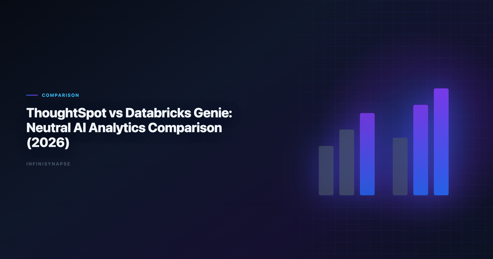
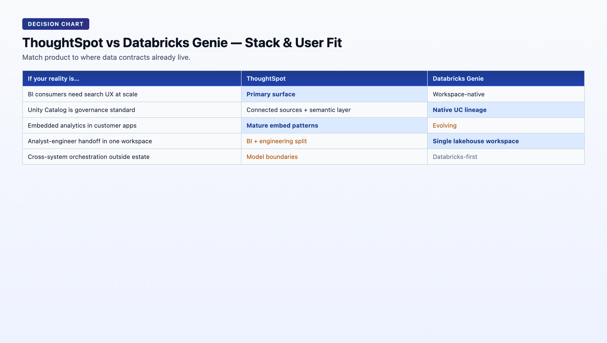

> **By the InfiniSynapse Data Team** · **Last updated: 2026-06-08** · *We evaluated these tools in production analyst workflows. *This is a neutral product comparison based on analytics workflow fit, not vendor affiliation.*

**Meta Description**: ThoughtSpot vs Databricks Genie compared for 2026 analytics teams: semantic search UX, lakehouse fit, governance, and rollout tradeoffs. Includes a quick FAQ.

**Slug**: `/blog/thoughtspot-vs-databricks-genie`

**Target keyword**: `databricks genie`
**Secondary**: `databricks genie`, `thoughtspot ai analytics`, `lakehouse semantic search`

---

## Table of Contents

1. [TL;DR](#tldr)
2. [What This Comparison Is Really About](#what-this-comparison-is-really-about)
3. [What Each Product Is Optimized For](#what-each-product-is-optimized-for)
4. [Five-Pillar Scorecard](#five-pillar-scorecard)
5. [Architecture and Workflow Differences](#architecture-and-workflow-differences)
6. [Head-to-Head Comparison Table](#head-to-head-comparison-table)
7. [Decision Matrix by Team Context](#decision-matrix-by-team-context)
8. [Buyer Fit Profiles](#buyer-fit-profiles)
9. [Implementation Risks to Watch](#implementation-risks-to-watch)
10. [Rollout Guidance: 90-Day Pilot Plan](#rollout-guidance-90-day-pilot-plan)
11. [Frequently Asked Questions](#frequently-asked-questions)
12. [Conclusion](#conclusion)
---

## TL;DR

> **ThoughtSpot** is often stronger for business-user self-service search analytics and live dashboard exploration. **Databricks Genie** is often stronger for teams centered on Databricks lakehouse governance and engineer-analyst collaboration in one platform. If your center of gravity is BI consumption, ThoughtSpot may feel faster. If your center of gravity is governed lakehouse execution, Genie often fits better.

This comparison is neutral and focuses on. Adoption benchmarks in the [CISA AI security guidance](https://www.cisa.gov/ai) track the same shift from pilot demos to governed analytics loops we see in customer rollouts. Enterprise AI adoption guidance in [Microsoft data architecture guidance](https://learn.microsoft.com/en-us/azure/architecture/data-guide/) mirrors the shift from ad-hoc copilots to repeatable, reviewable decision workflows.

- User experience for non-technical vs technical users
- Governance fit in lakehouse-centric programs
- Speed to value vs long-term platform consolidation

Every **thoughtspot vs databricks genie** evaluation we see in enterprise RFPs starts with the same mistake: comparing demo polish instead of operating-model fit. The strategic question in **thoughtspot vs databricks genie** is not which NLP answer looks smarter — it is which system matches where your data contracts, metric definitions, and governance perimeter already live.

---

> **Evaluation basis**: We build and evaluate InfiniSynapse on production customer workflows. Governance, adoption, and security context is cited inline throughout this guide—not in a standalone reference list.

## What This Comparison Is Really About

Most **thoughtspot vs databricks genie** articles treat the products as interchangeable "AI analytics" layers. For platform teams, the deeper difference is **data gravity**:

| Lens | ThoughtSpot | Databricks Genie |
|---|---|---|
| Primary home | BI/search analytics interface | Databricks workspace |
| Unit of work | Search query over curated semantic model | Natural-language question over lakehouse assets |
| Typical outcome | Dashboard insight, drill path, embedded chart | SQL/notebook-adjacent answer from governed tables |
| Governance model | BI-layer controls + source controls | Unified Databricks governance (Unity Catalog) |
| Best horizon | Broad business consumption | Databricks-native consolidation |

Neither product is universally better in **thoughtspot vs databricks genie** — each maps to a different operating model. ThoughtSpot optimizes for business-user answer discovery. Genie optimizes for lakehouse-native execution inside an engineering-led platform. Your **thoughtspot vs databricks genie** decision should follow data gravity, not demo polish.

---

## What Each Product Is Optimized For

### ThoughtSpot

ThoughtSpot is designed around search-driven analytics and interactive BI. It tends to perform well when. Regulated rollouts often anchor access reviews to [Databricks documentation](https://docs.databricks.com/en/) when credentials, retention policies, and audit logs are in scope.

- Business teams need natural-language exploration over curated models
- KPI consumption happens mainly in dashboards and embedded analytics
- The organization prioritizes fast adoption for non-engineer stakeholders
- Mixed-stack environments need a business-facing layer without migrating all data

In a **thoughtspot vs databricks genie** pilot, ThoughtSpot usually wins the first executive demo: type a KPI question, get a chart, drill down. That UX speed is real and matters for adoption.

### Genie on the lakehouse

- Data, governance, and transformation already center on Databricks
- Unity Catalog and Delta Lake are strategic standards
- Teams want one governance perimeter from data engineering to analytics
- Analyst-engineer handoff should happen inside one workspace

When teams frame **thoughtspot vs databricks genie** as a search UX contest, they miss Genie's strategic advantage: no second governance perimeter to maintain if Databricks is already the platform standard. Include governance perimeter count in your **thoughtspot vs databricks genie** scorecard.

---

## Five-Pillar Scorecard

| Pillar | ThoughtSpot | Databricks Genie | Decision impact |
|---|---|---|---|
| **Autonomy** | Medium: search-driven exploration with user-guided drill | Medium: NL interface over governed assets; less full task autonomy | Determines depth of unsupervised analysis |
| **Transparency** | Medium-High: lineage through semantic model and worksheets | High: Unity Catalog lineage and workspace audit | Compliance and engineering review speed |
| **Memory** | Medium: saved searches and pinboards; limited cross-run distillation | Medium: conversation context; growing operational memory patterns | Recurring KPI stability |
| **Multi-entry parity** | High: web, mobile, embedded analytics | Medium-High: workspace-native; embedding patterns evolving | Business-user access breadth |
| **Self-correction** | Medium: depends on semantic model quality | Medium: depends on schema stability and catalog metadata | Resilience on production data |

**Composite directional score**: ThoughtSpot leads on business-user accessibility (8.7/10 for search UX). Genie leads on lakehouse governance alignment (9.0/10 for Unity Catalog integration). In **thoughtspot vs databricks genie** reviews, transparency and multi-entry parity usually separate a successful pilot from a stalled one at month three. Revisit the **thoughtspot vs databricks genie** scorecard after semantic model or catalog cleanup. The move from dashboard-first BI to augmented workflows—described in [Kubernetes documentation](https://kubernetes.io/docs/)—frames how teams should evaluate tooling here.

---

## Architecture and Workflow Differences

| Layer | ThoughtSpot | Databricks Genie |
|---|---|---|
| Primary home | BI/search analytics interface | Databricks workspace |
| Typical user entry | Business and analytics consumers | Analysts, data engineers, technical users |
| Data gravity | Semantic models and connected data sources | Delta Lake + Unity Catalog environment |
| Governance pattern | BI-layer controls + source controls | Unified Databricks governance model |
| Workflow strength | Fast answer discovery and dashboard drill | Natural-language interaction with lakehouse data |
| Common expansion path | Embedded analytics and broader BI adoption | Deeper Databricks consolidation |
| Cross-system orchestration | Strong within connected BI models | Strong within Databricks estate; weaker outside |

The operational question in **thoughtspot vs databricks genie** is not "which demo looks better?" It is "which system matches where your data contracts already live?" Run a **thoughtspot vs databricks genie** pilot on production metadata, not sandbox tables. Operational maturity for analytics agents aligns with the [Apache Airflow documentation](https://airflow.apache.org/docs/), especially around monitoring, rollback, and ownership.

---

## Head-to-Head Comparison Table

| Dimension | ThoughtSpot | Databricks Genie | Why it matters |
|---|---|---|---|
| Business-user accessibility | High | Medium to high | Determines adoption without analyst proxy |
| Lakehouse-native governance alignment | Medium | High | Determines compliance perimeter count |
| Time to first dashboard insight | High | Medium | Determines pilot momentum |
| Databricks-native workflow synergy | Medium | High | Determines engineering handoff friction |
| Cross-department search experience | High | Medium | Determines org-wide rollout shape |
| Engineering handoff simplicity | Medium | High in Databricks-centric teams | Determines platform consolidation economics |
| Adoption in mixed-stack organizations | High | Medium | Determines fit when data is not all in Databricks |
| Semantic model dependency | High — quality depends on curated models | High — quality depends on catalog metadata | Determines NLP accuracy ceiling |
| Best-fit profile | BI search-led organizations | Databricks-first data platforms | Determines long-run ROI model |

---

## Decision Matrix by Team Context

| Team context | Better first choice | Why |
|---|---|---|
| Business teams need fast self-service search over curated KPIs | ThoughtSpot | Strong search UX and dashboard-first experience |
| Data platform is already standardized on Databricks | Databricks Genie | Governance and workflow fit with existing stack |
| Company has mixed cloud data platforms and varied BI usage | ThoughtSpot | Easier to deploy for broad consumption |
| Engineering-led analytics program consolidating on Delta | Databricks Genie | Better consolidation economics and governance |
| Executive reporting plus embedded analytics in customer apps | ThoughtSpot | Mature BI and embedding patterns |
| Lakehouse governance and technical analyst workflows are top priority | Databricks Genie | Native alignment with Databricks operating model |
| Need to minimize duplicate governance perimeters | Databricks Genie | Single Unity Catalog boundary |
| Need fastest path for non-technical VP self-service | ThoughtSpot | Search-first UX with lower training burden |

| Question | If "yes", lean toward |
|---|---|
| Is Databricks already our strategic data platform? | Databricks Genie |
| Do business users outnumber data engineers 5:1? | ThoughtSpot |
| Must we embed analytics in customer-facing products? | ThoughtSpot |
| Is Unity Catalog our source-of-truth for permissions? | Databricks Genie |
| Do we need answers from systems outside Databricks weekly? | ThoughtSpot or third layer |
| Is platform consolidation a 2026 priority? | Databricks Genie |

---

## Buyer Fit Profiles

### Strong ThoughtSpot fit

- Organizations with mature BI programs and dashboard-centric decision culture
- Business teams frustrated by analyst queue times for simple KPI questions
- Mixed-stack environments where not all data will migrate to one lakehouse
- Product teams needing embedded analytics in customer applications
- Companies prioritizing search UX over platform consolidation

### Strong Genie fit

- Data platforms already standardized on Databricks, Delta Lake, and Unity Catalog
- Engineering-led analytics programs reducing tool sprawl
- Teams where analyst-engineer collaboration happens in notebooks and SQL warehouses
- Organizations consolidating governance into a single lakehouse perimeter
- Technical users comfortable with workspace-native interfaces

### Consider a third layer (data agent)

- Recurring analysis spans many systems beyond BI models or Databricks tables
- Workflows require durable memory plus auditable multi-step automation
- Cross-source orchestration (warehouse + CRM + files + docs) is weekly, not occasional

The **thoughtspot vs databricks genie** buyer matrix is not about declaring a permanent winner. It is about matching product gravity to where your organization already invested platform effort. Document the **thoughtspot vs databricks genie** boundary if you deploy both in a layered stack.

---

## Implementation Risks to Watch

No matter which path you choose in **thoughtspot vs databricks genie**, these mistakes are common. Share this **thoughtspot vs databricks genie** risk list with platform engineering before kickoff. Production rollouts should align access and review controls with the [PostgreSQL documentation](https://www.postgresql.org/docs/), especially when recurring queries touch live schemas. LLM-backed analytics should account for prompt-injection and data-exfiltration risks in the [ISO/IEC 42001 AI management](https://www.iso.org/standard/81230.html), especially when connectors expose production schemas.

1. Overestimating NLP quality without semantic-model or catalog-metadata cleanup
2. Ignoring metric-definition ownership and governance process
3. Running tool pilots without one recurring business KPI use case
4. Treating evaluation as a UI demo instead of an operational test
5. Assuming Genie eliminates the need for ThoughtSpot (or vice versa) without measuring overlap

- One executive KPI question with stable business definition
- One ad-hoc exploration workflow by a non-technical user
- One cross-team handoff requirement (analyst to engineer or vice versa)
- One governance sign-off workflow with lineage review

| Risk | ThoughtSpot mitigation | Genie mitigation |
|---|---|---|
| Bad NLP answers | Invest in semantic model quality first | Invest in Unity Catalog metadata and table documentation |
| Low adoption | Train business users on search patterns | Train analysts on workspace-native NL workflows |
| Governance gaps | Align BI permissions with source policies | Extend Unity Catalog policies before Genie rollout |
| Pilot fails to scale | Pick KPI with existing curated model | Pick KPI with stable Delta tables and clear ownership |

---

## Rollout Guidance: 90-Day Pilot Plan

The most successful **thoughtspot vs databricks genie** implementations start with one KPI, measure operational fit, and only then decide on platform consolidation.

### Days 1–30: Baseline and semantic readiness

- Pick one executive KPI with a stable business definition and known data owners.
- Audit semantic model quality (ThoughtSpot) or Unity Catalog metadata (Genie).
- Document baseline cycle time: question to answer to stakeholder delivery.
- Do not run parallel pilots on both tools unless budget allows — focus on the better-fit candidate first.

**Exit criteria**: pilot KPI scoped; semantic/catalog readiness assessed; baseline cycle time documented.

### Days 31–60: Operational pilot

- Run the pilot KPI through the chosen tool with real users — include one non-technical stakeholder.
- Measure NLP accuracy, time to insight, and handoff friction to engineering.
- Test one ad-hoc exploration workflow outside the pilot KPI.
- Involve governance/compliance on lineage review.

**Exit criteria**: pilot KPI delivered twice with consistent definitions; reviewer signs off on lineage; adoption friction documented.

### Days 61–90: Scale or pivot

- If pilot succeeded: add one adjacent KPI and publish team routing guidance.
- If pilot stalled on semantic quality: fix models/metadata before blaming the tool.
- If recurring workflows span systems outside either platform: evaluate a data-agent third layer.
- Schedule 6-month revisit when platform consolidation roadmap changes.

**Exit criteria**: team can articulate when the chosen tool fits; expansion plan documented; pivot rationale clear if pilot failed. A successful **thoughtspot vs databricks genie** pilot produces repeatable KPI delivery, not just a polished first answer.

1. **Demo-driven decisions**: pretty first answers hide semantic debt.

2. **Skipping business users**: engineering-only pilots miss adoption reality.

3. **Ignoring coexistence**: many orgs run Databricks + ThoughtSpot successfully — plan the boundary.

4. **No second-run test**: first-run wow fades when definitions drift month two.

Schedule a six-month **thoughtspot vs databricks genie** revisit when your platform consolidation roadmap changes. The **thoughtspot vs databricks genie** checklist should include semantic model quality and Unity Catalog metadata readiness before any NLP evaluation.

---

BI comparison exercises should reference [Apache Spark documentation](https://spark.apache.org/docs/latest/) when judging visualization depth versus agentic analysis.

Warehouse connector design should follow [Wikipedia data warehouse overview](https://en.wikipedia.org/wiki/Data_warehouse) for dataset boundaries, IAM, and query validation patterns.

Snowflake deployments should reference [Apache Kafka documentation](https://kafka.apache.org/documentation/) when defining warehouses, roles, and semantic views for NL2SQL agents.

The [CISA AI security guidance](https://www.cisa.gov/ai) adds dirty-schema realism that Spider-only leaderboards under-weight in production.

## Frequently Asked Questions

### Is ThoughtSpot the same as Genie?

### Which is better for business users?

ThoughtSpot is usually better for business-user self-service search and dashboard exploration on curated datasets.

### Which is better for lakehouse-native engineering teams?

### Do we need all data in Databricks for Genie to work well?

Genie works best when critical analytics assets are governed in Databricks with stable schemas and Unity Catalog policies.

### Can ThoughtSpot and Databricks be used together?

Yes. Many organizations use Databricks as the governed data platform and ThoughtSpot as the business-facing analytics layer.

### What if neither tool fully matches our recurring workflow needs?

If recurring analysis spans many systems and requires durable memory plus auditable automation, evaluate an AI-native data-agent layer as a third option.

---

## Conclusion
- Choose **ThoughtSpot** when business search analytics and dashboard consumption are the priority.
- Choose **Databricks Genie** when lakehouse governance and Databricks-native workflows are the priority.

If your roadmap requires a third layer for cross-source autonomous execution and long-lived memory, consider **InfiniSynapse** alongside either stack rather than replacing both. Start your **thoughtspot vs databricks genie** evaluation with one recurring business question, fix semantic or catalog quality first, and measure repeatability on the second run — not just demo-day sparkle. The strongest **thoughtspot vs databricks genie** outcomes treat coexistence as a feature, not a failure.

Related reads:

| Article | URL |
|---|---|
| [Databricks Genie Alternatives](/en/blog/databricks-genie-alternatives) | /en/blog/databricks-genie-alternatives |
| [ThoughtSpot Alternatives](/en/blog/thoughtspot-alternatives) | /en/blog/thoughtspot-alternatives |
| [Best AI Tools for Data Analysis](/en/blog/best-ai-tools-for-data-analysis) | /en/blog/best-ai-tools-for-data-analysis |