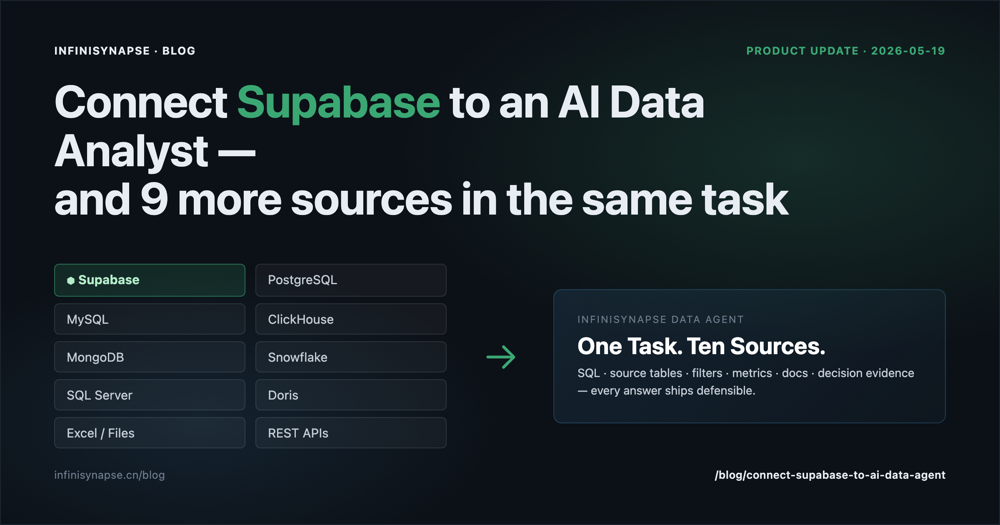

# Connect Supabase to an AI Data Analyst — and Why Every Other Database Should Join the Same Analysis

> **By the InfiniSynapse Team** · **Last updated: 2026-05-19** · *This is a product update for the InfiniSynapse Data Agent. The screenshots and queries below come from the live cloud workspace at app.infinisynapse.cn.*


*Figure: InfiniSynapse now connects natively to Supabase — and to nine other production databases in the same task.*

**Meta Description**: InfiniSynapse now connects natively to Supabase, plus MySQL, PostgreSQL, ClickHouse, MongoDB, Snowflake, SQL Server, Doris, Excel, files, and APIs — all in one analysis. Step-by-step setup + a working business-question example. (224 chars)

**Slug**: `/blog/connect-supabase-to-ai-data-agent`

**Target keyword**: `connect supabase to ai data analyst`
**Secondary**: `supabase ai analytics`, `query supabase with ai`, `ai analyst real data`

---

## Table of Contents

1. [TL;DR](#tldr)
2. [What changed today](#what-changed-today)
3. [What "AI analyst on real data" actually means](#what-ai-analyst-on-real-data-actually-means)
4. [Full connector list](#full-connector-list-may-2026)
5. [Connect Supabase in 3 minutes](#connect-supabase-in-3-minutes)
6. [A working business-question example](#a-working-business-question-example)
7. [Why "one chart" is not enough — what InfiniSynapse returns instead](#why-one-chart-is-not-enough--what-infinisynapse-returns-instead)
8. [How this compares with Code Agent + DB connector](#how-this-compares-with-code-agent--db-connector)
9. [Security & data residency](#security--data-residency)
10. [FAQ](#frequently-asked-questions)
11. [Get started](#get-started)

---

## TL;DR

> **InfiniSynapse, our AI-native Data Agent, now natively supports Supabase.** It also keeps working alongside MySQL, PostgreSQL, ClickHouse, MongoDB, Snowflake, SQL Server, Doris, Excel files, raw file storage, and APIs — *in the same analysis task*. The unlock is not a new chatbot UI. It is the workflow: **connect → ask a business question → get back not just an answer, but the SQL, source tables, filter conditions, metric definitions, supporting docs, and the decision evidence chain** — everything you would have asked a senior analyst to defend.

This article covers what changed, why it matters, how to wire Supabase up in three minutes, and what an end-to-end analysis trace actually looks like.

---

## What Changed Today

Three things shipped together:

1. **Supabase as a first-class data source.** Drop in the Postgres connection string from Supabase Studio → Database → Connection pooling, plus the project's `service_role` or a read-only role you create. InfiniSynapse treats Supabase exactly like a managed Postgres source — schema introspection, sampling, permission boundary, and associated RAG knowledge all bound to the connection object.
2. **One task, many sources.** A single InfiniSynapse task can now read from Supabase *and* a separate MySQL operational DB *and* an uploaded XLSX in the same run, with `left join` expressed at the language level. The engine pushes computation down where it can and only returns results.
3. **Decision-grade output, not just charts.** Every answer ships with the inspected SQL, source tables, filter conditions, metric definitions consulted from the bound knowledge base, attached documents, and the full step-by-step trace.

The third one is the actual product thesis. The first two are how we deliver it.

---

## What "AI Analyst on Real Data" Actually Means

> **Key Definition**: An **AI analyst on real data** is an autonomous Data Agent that connects to your live production data sources (databases, warehouses, files, APIs), takes a business question as a goal, executes verifiable queries, and returns an answer with full provenance — SQL, source tables, filters, metric definitions, supporting documents, and a reviewable execution trace. The defining contrast with a "chat-with-CSV" tool is that the analyst works on *your* schema, with *your* knowledge, under *your* permissions — not on a snapshot uploaded into a sandbox.

A lot of tools say "AI analyst." Most of them really mean *"chat with one CSV in a sandbox."* That's useful, but it is not what a working analyst actually does. A working analyst:

- Knows where to find the right table among hundreds
- Picks the right metric definition the business currently endorses
- Joins data across systems (orders in one place, customers in another)
- Defends every number with the SQL that produced it
- Says "I cannot answer this with current data" when it's true

InfiniSynapse's update today is a step further into that definition: not just one cloud-native DB, but **ten production source types in the same task**, with the analyst behavior — not the chat behavior — sitting on top.

---

## Full Connector List (May 2026)

| Category | Sources (in alphabetical order) |
|---|---|
| **Operational / OLTP** | MongoDB, MySQL, PostgreSQL, **Supabase**, SQL Server |
| **Warehouses / OLAP** | Apache Doris, ClickHouse, Snowflake |
| **Files & sheets** | Excel (`.xlsx`), CSV / TSV, JSON / NDJSON, Parquet |
| **Service & APIs** | REST endpoints (with auth headers), webhook-based pulls |
| **More via Custom Connector** | JDBC-compatible sources can be added by URL string |

Every connector becomes a **data source object** in InfiniSynapse: it carries the connection string, the discovered schema, sample data, the permission scope you granted, the associated RAG knowledge bound to it, and an execution policy (read-only by default, with optional CTE/temp-table privileges).

---

## Connect Supabase in 3 Minutes

The flow below assumes you already have a Supabase project. If not, [create one for free](https://supabase.com/dashboard/projects).

### Step 1 — Grab the connection string

In Supabase Studio → **Project Settings** → **Database** → **Connection pooling**, copy the **Transaction mode** URI. It looks like:

```
postgres://postgres.<project_ref>:<password>@aws-0-<region>.pooler.supabase.com:6543/postgres
```

Pooler URIs are recommended for analysis traffic (better connection reuse than the direct 5432 URI).

### Step 2 — Create a read-only analytics role (optional but recommended)

In Supabase Studio → **SQL Editor**:

```sql
create role analytics_readonly login password '<strong-password>';
grant connect on database postgres to analytics_readonly;
grant usage on schema public to analytics_readonly;
grant select on all tables in schema public to analytics_readonly;
alter default privileges in schema public
  grant select on tables to analytics_readonly;
```

Use the `analytics_readonly` credentials in step 3 if you want hard read-only enforcement; use the default postgres role if you want write/CTE materialization inside InfiniSynapse.

### Step 3 — Add the data source in InfiniSynapse

In [app.infinisynapse.cn](https://app.infinisynapse.cn) → **Data Sources** → **Add** → pick **Supabase** (Postgres-compatible). Paste the URI from step 1, name it (e.g. `supabase_prod`), and click **Test → Save**.

InfiniSynapse will:

1. Introspect schemas, tables, columns, types, primary keys, foreign keys
2. Sample 100 rows per table (cached locally, configurable)
3. Detect candidate metric columns (numeric + dimension columns)
4. Prompt you to bind any documents you have (data dictionary, metric specs, business rules) to this data source object via **Associated RAG**

You can now ask a business question in any task and reference this Supabase source by name.

### Step 4 — (Optional) Bind business knowledge

If you have a metric dictionary, an internal docs page describing your funnel, or a Notion/Lark export of your data definitions, drop them into the **Associated RAG** panel for `supabase_prod`. The Data Agent will consult them *before* writing SQL, and it will separate "database facts" from "business interpretation" in the final report.

---

## A Working Business-Question Example

Say your Supabase project holds `orders`, `customers`, and `products`, and you also keep a quarterly **promotion calendar** as an Excel sheet in OneDrive. A typical end-to-end question:

> *"Which product categories grew fastest in Q1 2026, controlling for promotion windows, and which 3 customers contributed most to that growth?"*

What you do:

1. Connect Supabase (one-time, done above)
2. Upload the promotion Excel to the task
3. Type the question

What InfiniSynapse does:

```sql
-- Tool call 1: scope orders to Q1 2026
select order_id, customer_id, product_id, amount, ordered_at
from supabase_prod.orders
where ordered_at >= '2026-01-01' and ordered_at < '2026-04-01'
as q1_orders;

-- Tool call 2: tag each order with category + (in/out of promotion)
select o.*, p.category, p.sku,
       coalesce(c.in_promo, false) as in_promo_window
from q1_orders o
left join supabase_prod.products p on o.product_id = p.id
left join excel.`promotion_calendar_q1_2026.xlsx` c
  on o.product_id = c.product_id
  and o.ordered_at between c.start_date and c.end_date
as q1_orders_tagged;

-- Tool call 3: category growth, control for promo
select category,
       sum(case when in_promo_window then 0 else amount end) as organic_amount,
       sum(amount) as total_amount,
       round(100.0 * sum(case when in_promo_window then 0 else amount end)
             / nullif(sum(amount), 0), 1) as organic_share_pct
from q1_orders_tagged
group by category
order by organic_amount desc
as category_growth;

-- Tool call 4: top 3 customers driving the leading category
select c.customer_id, c.email, sum(t.amount) as q1_amount
from q1_orders_tagged t
left join supabase_prod.customers c on t.customer_id = c.id
where t.category = (select category from category_growth limit 1)
group by c.customer_id, c.email
order by q1_amount desc
limit 3
as top_contributors;
```

Each tool call produces a **named intermediate table** that the next call uses. By the end of the task you have a 4-table virtual warehouse — `q1_orders`, `q1_orders_tagged`, `category_growth`, `top_contributors` — sitting in your task workspace, all reviewable, all reusable.

The Data Agent then writes a one-page report that contains:

- The headline answer ("Category X grew fastest with Y% organic share; top three contributors are A, B, C")
- A chart picked to match the answer (rank chart for categories, donut for contributors)
- An explicit **"facts from database"** vs **"interpretation from knowledge base"** section
- Any data gaps it noticed (e.g. "promotion calendar does not cover one product family — those rows are excluded from organic share")

---

## Why "One Chart" Is Not Enough — What InfiniSynapse Returns Instead

Most "AI for data" tools end at the chart. That's the part of an analyst's job that looks impressive but is the easiest to fake. The hard part — the part a real analyst gets paid for — is **defending the chart**.

Every InfiniSynapse answer ships with:

| Artifact | What it is | Why it matters |
|---|---|---|
| **SQL trace** | Every query executed, in order, with the named intermediate it produced | Anyone can rerun, debug, or audit the analysis |
| **Source tables** | Which physical tables/files were read | Permissions and data lineage are traceable |
| **Filter conditions** | Every `where` / `having` / date cutoff applied | No silent "subset of the data" surprises |
| **Metric definitions** | Which metric/funnel definition the agent used, and *where* it came from (RAG) | The number ties to a definition the business endorses |
| **Documents consulted** | The docs the agent pulled relevant chunks from before writing SQL | Reviewable interpretation, not a black box |
| **Decision evidence** | Why the agent picked this table over another, why it chose this metric | The "judgment" layer is now legible |

This is what we mean by **a trustworthy answer, not just a chart.** A chart that you cannot defend is decoration. A chart with a full trace behind it is a decision you can stand behind.

---

## How This Compares with Code Agent + DB Connector

A common alternative is: "I'll just give Claude Code / Cursor / Codex a database connector and ask it to write SQL." This works for one-off exploration. It breaks for recurring enterprise analysis on several axes:

| Dimension | Code Agent + DB connector | InfiniSynapse Data Agent |
|---|---|---|
| **Named intermediate tables** | Lives in DataFrame variables in one Python session; lost on restart | First-class workspace tables with semantic names, reusable across runs |
| **Cross-source join** | Pull data into memory, merge in pandas | Express joins in InfiniSQL, engine federates with pushdown |
| **Knowledge binding** | Re-paste docs into prompt every time | Knowledge is bound to the data source object via Associated RAG |
| **Audit trail** | Final script; intermediate state often overwritten | Full SQL trace + every intermediate result kept reviewable |
| **Failure recovery** | Throws an exception, waits for user | Reroutes (cache, alternative source) and surfaces a "data gap" note |
| **Definition of "done"** | Code runs | Answer ships with defensible evidence chain |

We wrote a separate piece on this division of labor: [Why Code Agents Cannot Solve Enterprise Data Analysis](/blog/why-code-agents-cannot-solve-enterprise-data-analysis). Short version: Code Agents are excellent at the engineering part, Data Agents own the analytical part — and InfiniSynapse ships **Command Tools** so a Code Agent can call Data Agent capabilities from inside Cursor / Claude Code / Codex when both are needed.

---

## Security & Data Residency

- **Read-only by default.** The recommended setup is the `analytics_readonly` role above. If you want CTE / temp-table materialization, grant a separate analytics schema.
- **Pooler URIs supported.** Supabase Transaction-mode pooling is the recommended connection for analytical workloads.
- **Sampling is local.** The 100-row sample per table is cached only inside your InfiniSynapse workspace and is used to ground the agent's schema understanding.
- **Pushdown by default.** Aggregations and filters are pushed down to Supabase; only the result set comes back. Cross-source joins use the smallest plan that satisfies pushdown constraints.
- **Self-hosted option.** For regulated environments (finance, customs, SOE, healthcare), InfiniSynapse Private runs entirely inside your VPC; the agent, the execution engine, and the audit log stay in your boundary.

---

## Frequently Asked Questions

**Q1. Does this work with Supabase Edge Functions or only Postgres tables?**
Today's release covers Supabase Postgres (tables, views, materialized views, schemas). Edge Functions and Storage are on the roadmap but not in this release. If you need to integrate Edge Function outputs, write them to a Postgres table and connect the table.

**Q2. Will my Supabase data leave my project?**
Only the result rows of queries you (or the agent) explicitly run leave Supabase, and only to InfiniSynapse's runtime where you're executing the task. The schema introspection and the 100-row per-table sample are cached inside your InfiniSynapse workspace. For zero-egress requirements, deploy InfiniSynapse Private inside your VPC.

**Q3. Can I connect Supabase plus my warehouse plus an Excel in the same task?**
Yes. That's the headline of this release. Add each as a data source object, then express joins in InfiniSQL. The engine handles federation and pushdown.

**Q4. Does it support RLS (Row-Level Security)?**
Yes — InfiniSynapse honors whatever the connecting Postgres role can see. If your `analytics_readonly` role is subject to RLS policies, the agent's queries are too. We recommend creating an analytics role whose RLS context matches your analyst-of-record persona.

**Q5. How is this different from Supabase's own AI Assistant in Studio?**
Supabase's in-Studio assistant is excellent for *writing* SQL during database work. InfiniSynapse is positioned one layer up: a Data Agent that *does the analysis* end-to-end across Supabase **and** your other sources, returns a defensible report, and accumulates the named intermediates into a question-shaped virtual warehouse you can revisit.

**Q6. What's the smallest possible setup to try this right now?**
Three minutes: free InfiniSynapse account → add Supabase URI → ask one real business question. The cloud workspace at [app.infinisynapse.cn](https://app.infinisynapse.cn) has a free tier that covers single-user evaluation.

---

## Get Started

| Path | Best for | How |
|---|---|---|
| **Free cloud workspace** | Individuals, small teams evaluating | Sign in at [app.infinisynapse.cn](https://app.infinisynapse.cn), add Supabase, ask a question |
| **Command Tools (CLI)** | Developers calling Data Agent from Cursor / Claude Code / Codex / WinClaw | Download single-binary CLI from [/docs/command-tools](https://infinisynapse.cn/docs/command-tools), drop into `$PATH` |
| **InfiniSynapse Private** | Regulated industries (finance, customs, SOE, healthcare) | Contact us via the [enterprise page](https://infinisynapse.cn/enterprise) for VPC-deployment trial |

If you're comparing options on a tighter budget, also read our [Best AI Tools for Data Analysis in 2026](/blog/best-ai-tools-for-data-analysis) overview — Supabase is one of the workflows tested there.

---

## Related Reading

**Direct companions in this batch (Data Agent series):**

- [Why Code Agents Cannot Solve Enterprise Data Analysis](/blog/why-code-agents-cannot-solve-enterprise-data-analysis) — the three challenges that make Data Agents a separate system from Code Agents.
- [Data Agent 是驶向新文明的第一艘飞船](/zh/blog/data-agent-new-civilization) — InfiniSynapse 创始人对下一阶段 AI 的判断（中文）.
- [Building the Data Agent Harness — MPD Roadshow recap](/zh/blog/data-agent-harness-roadshow-recap) — the full architectural deck behind InfiniSynapse, in long-form.

**Sister batch — AI-Native Data Analysis series:**

- [Best AI Tools for Data Analysis in 2026: SQL + Techniques](/blog/best-ai-tools-for-data-analysis) — the head-to-head comparison Supabase users land on when choosing between 7 tools (already linked above as a budget-tier alternative).
- [AI-Native Data Analysis: What It Means in 2026 (vs AI-Enabled)](/blog/ai-native-data-analysis) — the 5-pillar framework that defines why connecting an AI agent to your real Postgres (this article's premise) is the AI-native path, not just "ChatGPT plus a CSV export."
- [How to Clean Excel Data with AI in 2026: 5 Patterns + a 5-Minute Worked Example](/blog/ai-excel-data-cleaning) — the sibling how-to for the file-based entry point. If your team starts with Excel and grows into a Supabase connection, read both in sequence.
- [Natural Language to SQL in 2026: What's Real, What's Theatre, and the Architecture That Works](/blog/natural-language-to-sql) — the technical deep-dive most directly relevant to Supabase / Postgres users. Read this if you want to understand *why* asking a frontier LLM "translate this question to a Postgres query" plateaus at 20–40% accuracy on real schemas, and what the production-grade alternative looks like.

**External:**

- [Supabase official docs — Database Connection](https://supabase.com/docs/guides/database/connecting-to-postgres)
