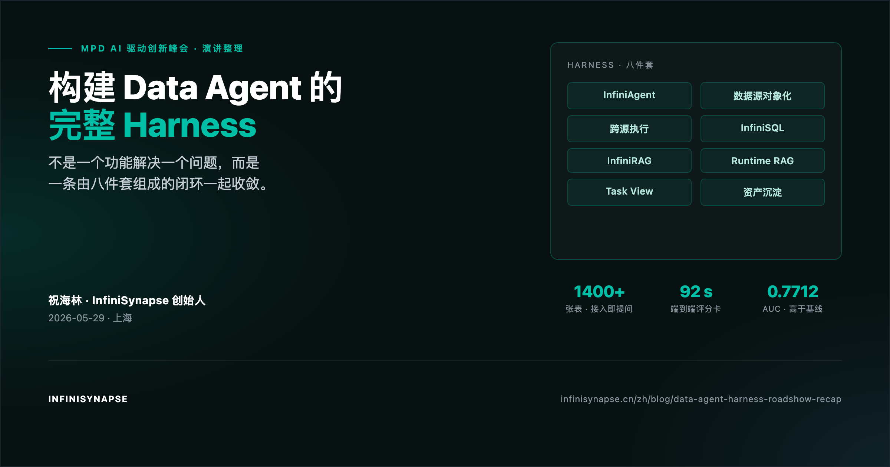

# 构建 Data Agent 的完整 Harness：InfiniSynapse 的企业级数据分析栈实践

> **演讲：祝海林 · 衡数无限科技有限公司（InfiniSynapse）** · **场合：MPD AI 驱动创新峰会 · AI 重塑数据生产与分析** · **时间：2026-05-29 14:30–15:30，上海** · **博客整理：InfiniSynapse Team · Last updated: 2026-05-19**
>
> *本文是 MPD 峰会现场演讲的完整文字整理版。所有架构图、产品截图和数字证据均来自演讲现场的原始幻灯片；可在文末下载完整 PDF。*


*图：MPD AI 驱动创新峰会演讲封面 —— "Data Agent 不是一个功能解决一个问题，而是一条闭环一起收敛"。*

**Meta Description**：MPD 峰会演讲整理：InfiniSynapse 如何用 InfiniAgent + 数据源对象化 + 跨源执行 + InfiniSQL + InfiniRAG + 可审计工作流 + 资产沉淀 + 企业私有化，构建一条真正能在企业落地的 Data Agent harness。含 1400+ 表 / 92 秒评分卡 / AUC 0.7712 的硬证据。（180 字）

**Slug**：`/zh/blog/data-agent-harness-roadshow-recap`

**Target keyword**：`Data Agent Harness 架构`
**Secondary**：`企业级 Data Agent 实践`、`InfiniSynapse 架构`、`Agentic Analytics 落地`

---

## 目录

1. [一句话观点（TL;DR）](#一句话观点)
2. [先把问题摆正：两种目标函数的分叉](#先把问题摆正两种目标函数的分叉)
3. [三个挑战为什么击穿 Code Agent 范式](#三个挑战为什么击穿-code-agent-范式)
4. [真正的 Data Agent 需要什么](#真正的-data-agent-需要什么)
5. [InfiniSynapse 八件套：一条闭环一起收敛](#infinisynapse-八件套一条闭环一起收敛)
6. [解法 01：InfiniAgent 自主探查循环](#解法-01infiniagent-自主探查循环)
7. [解法 02：数据源对象化](#解法-02数据源对象化)
8. [解法 03：跨源执行引擎](#解法-03跨源执行引擎)
9. [解法 04：InfiniSQL 与虚拟数仓](#解法-04infinisql-与虚拟数仓)
10. [解法 05：InfiniRAG 业务知识绑定](#解法-05infinirag-业务知识绑定)
11. [解法 06：Runtime RAG 先问知识再算事实](#解法-06runtime-rag-先问知识再算事实)
12. [解法 07：可审计工作流](#解法-07可审计工作流)
13. [解法 08：从回答到组织资产](#解法-08从回答到组织资产)
14. [硬证据：1400+ 表 / 92 秒 / AUC 0.7712](#硬证据1400-表--92-秒--auc-07712)
15. [企业交付边界：海关、金融、央国企的真实约束](#企业交付边界海关金融央国企的真实约束)
16. [Takeaway：Data Agent 的本质是可信答案系统](#takeawaydata-agent-的本质是可信答案系统)
17. [常见疑问 FAQ](#常见疑问-faq)
18. [下载完整幻灯片](#下载完整幻灯片)

---

## 一句话观点

> **企业数据分析不是"让 AI 写一段能跑的代码"。** Code Agent 的目标函数是"代码能运行、测试能通过"；Data Agent 的目标函数是"答案可信、口径正确、过程可复核"。一旦进入企业现场，这两条目标函数会彻底分叉。InfiniSynapse 给出的答案不是一个单点功能，而是一整条由 **InfiniAgent + 数据源对象化 + 跨源执行 + InfiniSQL + InfiniRAG + Runtime RAG + 可审计工作流 + 组织资产沉淀** 八件套组成的闭环 —— **一条 harness，整体收敛**。

---

## 先把问题摆正：两种目标函数的分叉

| 维度 | Code Agent | Data Agent |
|---|---|---|
| **目标函数** | 代码能运行、测试能通过 | 答案可信、口径正确、过程可复核 |
| **主要对象** | 代码文本、工程依赖 | 表、字段、指标、文档、看板、历史分析 |
| **反馈机制** | 编译错误、测试失败、构建失败 | 业务校验、证据链、口径一致性、不确定性表达 |
| **主要失败** | 不编译、行为错 | 找错表、信错口径、算对但解释错 |

Data Agent 的难点不是 SQL 语法，而是：**先找到该相信什么，再算出可信答案。**

详细论证见姊妹篇 [为什么 Code Agent 无法解决企业数据分析](/blog/why-code-agents-cannot-solve-enterprise-data-analysis)。本场演讲的目的，是把 InfiniSynapse 对这三个挑战的工程答案，一次摆完。

---

## 三个挑战为什么击穿 Code Agent 范式

| # | 挑战 | 一句话本质 |
|---|---|---|
| 01 | **搜索失效** | 百万级数据资产，让"关键词搜索"变得不可靠。同一个"收入"可能叫 ARR / 确认收入 / 净收入 / `rev_recognition_fact`。第一能力不是写 SQL，是找到真正相关的数据资产 |
| 02 | **Source of Truth** | 找到资产只是开始，难的是判断该信哪一个。旧文档 vs 已认证看板 vs notebook 里藏的真实逻辑，企业里最危险的错误是"代码没报错、数字也算出来了，但用的是错口径" |
| 03 | **没有确定性 Oracle** | Data Agent 没有像代码测试那样的"判题器"。Code Agent 有 unit test / type check / build / e2e；Data Agent 只有"财务季度?净收入?华东口径?数据是否完整?是否可回答?" |

> **关键观点**：数据分析里的很多错误，**不会抛异常**。代码 exit 0，图也画出来了，报告也很专业 —— 但找错表 / 信错口径 / 算对但解释错。语义错误不会像编译错误一样提醒你。它会安静地生成一个看起来很专业的错误报告。

可靠性必须来自**系统设计**：证据链、口径链、中间结果、不可回答边界。

---

## 真正的 Data Agent 需要什么

> **关键定义**：一个企业级 **Data Agent harness** 是一套能让 Agent 在真实企业现场连续完成"找资产 → 判口径 → 跑事实 → 留状态 → 可复核"五步动作的系统总成。它不是更长的 Prompt，而是一条 **从规划到证据链** 都被设计过的可信答案生产线。

InfiniSynapse 把这条生产线收敛成八个互相咬合的部件：

```
                   [InfiniAgent]
                   规划 / 探查 / 自我纠错
                          │
        ┌─────────────────┼─────────────────┐
        ▼                 ▼                 ▼
  [数据源对象化]    [InfiniRAG 绑定]    [跨源执行引擎]
        │                 │                 │
        └──────┐    ┌─────┘                 │
               ▼    ▼                       ▼
            [InfiniSQL] ──────────► [Runtime RAG]
                  │
                  ▼
         [可审计工作流 Task View]
                  │
                  ▼
        [Tables · Charts · Files · Memory]
```

下面按演讲顺序，把这八件套逐一拆开。

---

## 解法 01：InfiniAgent 自主探查循环

> **演讲原话**："关键不是'生成一段答案'，而是 Agent 能自己发现缺口、调用工具、验证口径，并在需要时拆给多个专门 Agent。"

InfiniAgent 是 Agentic 范式的具体落地，包含五个核心步骤：

| 步骤 | 动作 | 关键能力 |
|---|---|---|
| **Plan** | 锁定只读边界 | 确认权限、数据源、不可触动的禁区 |
| **Probe** | RAG + schema 探查 | 先理解表、字段、业务含义 |
| **Execute** | 工具调用与中间结论 | 每次调用产生具名结果 |
| **Verify** | 口径与生命周期验证 | 把事件、状态、生命周期对齐 |
| **Delegate** | Agent Teams 并行 | 复杂问题拆给多个专门 Agent |

这五步不是线性流水线，而是一个**循环**。任意一步发现缺口（数据不够、口径冲突、知识库缺定义），都会回到 Plan / Probe，重新探查。这正是"自主"的含义 —— Agent 不是接到 prompt 后一次性"猜"答案，而是在执行过程中**持续修正**。

现场展示了一条完整的执行长图（从上下文探查到 Agent Teams 编排），其中三个关键时刻被放大：

1. **Probe**：先理解表结构和业务含义，而不是直接写 SQL
2. **Verify**：把数据库事件与业务生命周期做对齐验证
3. **Delegate**：复杂问题在 Agent Teams 中被并行执行

---

## 解法 02：数据源对象化

> **演讲原话**："数据源不是连接串，而是 Agent 的工作上下文。"

传统的"数据库连接"是一个 URI + 用户名密码。InfiniSynapse 把它升级成一个**对象**：

```
Data Source Object
├── connection           ← URI / 凭证
├── schema               ← 自动抽取的结构
├── sample               ← 100 行采样
├── permissions          ← 权限边界
├── Associated RAG       ← 绑定的业务知识库
└── execution policy     ← 只读 / 可建临时表 / 下推策略
```

把这五项绑成一个对象后，Agent 在分析这个库时，才能知道"应该带上哪些语义"。这一步直接回应了挑战 01（搜索失效）和挑战 02（Source of Truth）—— **资产相关性 + 资产权威性，被 Agent 默认携带，不需要每次重新探查。**

---

## 解法 03：跨源执行引擎

> **演讲原话**："企业数据不在一个地方，执行引擎不能假装它在一个地方。"

企业数据现实：

```
MySQL · PostgreSQL · Oracle · ClickHouse · Excel · MongoDB · Snowflake · API
```

Code Agent 默认做法：把所有数据拉到 notebook 里 merge。这在 demo 里没问题，但在企业现场会立刻遇到 4 个问题：内存撑不住、数据出生产环境带来合规压力、无法下推、临时文件成为新泄漏面。

InfiniSQL Engine 的做法是**联邦查询 + 聚合下推 + 只回传结果**：

| 阶段 | 在哪里执行 |
|---|---|
| 过滤、聚合 | 推到源数据库 |
| 跨源 join | InfiniSQL Engine 在内存中只处理结果集 |
| 中间表物化 | 落在 session 内的具名工作空间 |

**不是把数据拖出来，而是把计算推下去。**

---

## 解法 04：InfiniSQL 与虚拟数仓

> **演讲原话**："多轮追问，会沉淀成一个面向问题的虚拟数仓。"

InfiniSQL 不是一种"更炫的 SQL 方言"，是一门**适合 Agentic 分析的工作语言**。最关键的一个语法元素是 `as <name>` —— 每次工具调用产出一张**具名中间表**：

```sql
select region, sum(amount) as revenue
from orders
group by region
as region_revenue;

select * from region_revenue
where revenue < 0
as abnormal_region;

select * from abnormal_region a
left join campaigns c on a.region = c.region
as campaign_bridge;

select * from train(campaign_bridge, target='revenue')
as scorecard_model;
```

随着工具调用次数增加，session 里会沉淀出一张张具名中间表，共同形成一个**面向当前问题的虚拟数仓**：

```
session tables
├── region_revenue          ← 按地区汇总
├── abnormal_region         ← 异常地区
├── campaign_bridge         ← 关联活动
└── scorecard_model         ← 评分卡模型
```

这个虚拟数仓不是数据团队事先建好的，也不是一个静态 schema。它是在 Agent 分析过程中**自然生长**出来的。越往后，Agent 越不需要回到原始明细表重新猜，而是站在已经被命名和抽象过的状态上继续分析。

**这和 Code Agent 不断改 Python 脚本完全不同。在 Python 里，追问越多代码越复杂；在 InfiniSQL 里，追问越多虚拟数仓越丰富、后续分析越容易。**

---

## 解法 05：InfiniRAG 业务知识绑定

> **演讲原话**："业务知识必须绑定到数据源，而不是事后塞进上下文。"

最常见的 RAG 误解：把文档切片塞进 prompt。这对企业数据分析远远不够。

数据库只能告诉 Agent **发生了什么**。知识库告诉 Agent **这件事意味着什么**。

InfiniRAG 把以下五类知识**绑定到具体数据源**：

| 知识类型 | 内容 | 例子 |
|---|---|---|
| **指标定义** | 当前业务认可的口径 | 收入 = 确认收入 - 退款（不是下单金额） |
| **库表含义** | 业务语义解释 | `metric_key=DOWNLOAD` 是下载意图还是确认安装 |
| **历史分析** | 类似问题的过往结论 | 上季度做过同主题分析，结论是 X |
| **用户偏好** | 这个用户/团队的习惯 | "我们要看图表 + 同比 + 风险提示三段式" |
| **不确定性边界** | 哪些结论必须打不确定标签 | 退款数据 T+3 才完整 |

绑定的形式：每个数据源对象都有一个 Associated RAG 字段，指向一组知识库 / 文档 / 历史分析。Agent 在使用这个数据源时，**RAG 是默认上下文**，不需要每次重新挂载。

---

## 解法 06：Runtime RAG 先问知识再算事实

知识"绑定"了还不够。运行时 Agent 必须**先问知识库，再用 SQL 验证可计算事实**。完整四步：

1. **问绑定知识库**：这个指标怎么定义？哪个口径是最新的？
2. **确认指标和禁区**：哪些字段不能直接对外发布？哪些 key 应该归入同一簇？
3. **生成 SQL 验证事实**：用 InfiniSQL 跑出可计算的数字
4. **报告中分离事实与解释**：哪些是数据库事实、哪些是业务解释、哪些来自历史经验、哪些标了不确定

最终的 RAG-enhanced Report 会显式分两栏："来自数据库的事实"与"来自知识库的业务解释"。**这就是结构化 + 非结构化的互补式绑定** —— 两者分开，Agent 只是会查数；两者绑定，Agent 才开始像分析师。

---

## 解法 07：可审计工作流

> **演讲原话**："没有确定性测试，就必须把证据链打开给人看。"

挑战 03（无 Oracle）的工程答案，是 Task View。每一个 Task 在执行过程中，都会沉淀以下六类轨道：

```
Sources → Tools → SQL → Table → Chart → Files
```

| 轨道 | 内容 |
|---|---|
| **Sources** | 用了哪些数据源（含 RAG 知识库） |
| **Tools** | 调用了哪些工具（SQL、HTTP、文件解析、绘图……） |
| **SQL** | 每一步 SQL 的完整代码 |
| **Table** | 每一步产出的具名中间表 |
| **Chart** | 每个图表的来源数据集 |
| **Files** | 上传 / 生成的文件 |

最终交付时，用户看到的是结论 + 图表 + 后续动作；点击展开任意一步，都能回到当时的 SQL、中间表、知识引用。这就是**企业能复核 Agent 的最低要求**。

Code Agent 常常给你一份最终脚本。Data Agent 必须给你一条分析证据链。

---

## 解法 08：从回答到组织资产

> **演讲原话**："一次分析不应该聊完就消失，而要变成组织可复用资产。"

一个 Task 完成后，它的产出物会自动结构化成五类资产：

| 资产 | 含义 |
|---|---|
| **Task** | 目标 + 上下文 + 决策路径 |
| **Tables** | 具名中间表（可被下一个 Task 直接 reuse） |
| **Charts** | 可复核图表（双击下钻到数据） |
| **Files** | 报告、PDF、脚本 |
| **Memory** | 下一次同类问题可被召回的结构化卡片 |

这是 InfiniSynapse 真正的飞轮：**每完成一次任务，组织的"可分析能力"就增加一点**。一年后，组织积累的不是几百份零散 PPT，而是一个结构化、可被 Agent 调用的"分析资产库"。

---

## 硬证据：1400+ 表 / 92 秒 / AUC 0.7712

架构再优雅，企业最终问的是一个问题：**这套东西在真实数据上能跑得动吗？跑得有多快？跑得有多准？**

| 证据 | 数字 | 说明 |
|---|---|---|
| **数据规模** | **1400+ 张表** | 接入即可提问，无需事先建数据字典 |
| **响应时间** | **92 秒** | 端到端生成可解释评分卡（含 RAG 探查 + 多步 SQL + 训练 + 报告） |
| **模型质量** | **AUC = 0.7712** | 高于 XGBoost 学术基线（0.7611） |

这三个数字一起证明：InfiniSynapse 不是 demo —— 它在真实企业数据规模下跑得起、跑得快、跑得准。

---

## 企业交付边界：海关、金融、央国企的真实约束

> **演讲原话**："海关、金融、央国企要的不是'能跑'，而是边界清楚。"

InfiniSynapse Private 在客户域内的部署，遵循四条硬性边界：

```
┌──────────── 客户域内 ────────────┐
│                                  │
│   业务库 · 文件 · 审计日志 · 私有模型 │
│              │                   │
│              ▼                   │
│   ┌────────────────────────┐     │
│   │  InfiniSynapse Private │     │
│   │  权限 · 执行 · 证据链  │     │
│   └────────────────────────┘     │
│                                  │
└──────────────────────────────────┘
        ▲     ▲     ▲     ▲
        │     │     │     │
   数据不出域 计算可下推 模型可替换 结果可审计
```

这四条不是营销话术，是合规、监管、审计三类约束转化成的工程要求：

| 边界 | 工程含义 |
|---|---|
| **数据不出域** | 所有原始数据停留在客户 VPC；只有结果集在 Agent 之间流转 |
| **计算可下推** | 不强行把数据搬到 InfiniSynapse 引擎，能下推就下推 |
| **模型可替换** | LLM 可换成客户私有模型（含本地推理） |
| **结果可审计** | 每一次决策完整证据链落到客户审计日志 |

---

## Takeaway：Data Agent 的本质是可信答案系统

| # | 三句话总结 |
|---|---|
| **01** | 先**找到该信什么** —— 数据源对象化 + InfiniRAG |
| **02** | 再**算出可复核事实** —— InfiniSQL + Task View |
| **03** | 最后**沉淀可复用资产** —— Tables / Charts / Files / Memory |

**InfiniSynapse 的目标：给企业一个真正能交付的 Data Agent。**

不是更长的 Prompt，不是更聪明的 SQL，而是一整条**可信答案生产线**。这是 MPD 演讲想留给每一位企业数据分析负责人的核心结论。

---

## 常见疑问 FAQ

**Q1. 这套八件套必须全部用吗？只用其中一两件可以吗？**
可以。InfiniAgent + InfiniSQL + Task View 是任何 Data Agent 场景都必备的"必装件"；InfiniRAG / Runtime RAG / 数据源对象化在需要业务知识介入时才打开；Agent Teams 并行 / Private 部署是企业大规模场景的扩展。中小团队可以从 cloud 工作空间 + 单一数据库连接开始。

**Q2. InfiniSQL 是新发明的语言吗？我们的工程师要重新学习吗？**
不需要重学。InfiniSQL 95% 是标准 SQL，新增的只有几个 Agentic 关键字（最关键的是 `as <name>` 给查询命名 + `load` / `connect` 跨源加载语法）。会写 SQL 的人 30 分钟可以上手。

**Q3. 1400+ 表 / 92 秒 / AUC 0.7712 是哪个客户的真实数据？能复现吗？**
是 InfiniSynapse 在某金融科技客户私有化部署上的端到端实测，跑的是该客户信用评分卡场景。AUC 0.7611 的 XGBoost 基线是该客户数据科学团队此前的最优模型。完整复现路径在演讲幻灯片附录中（可点击下方下载）。我们不公开客户名，但**愿意在 NDA 框架下做现场重现**。

**Q4. 海关 / 央国企的私有化部署对模型有什么要求？**
模型层完全可替换。InfiniSynapse Private 兼容主流国产大模型（通义、智谱、月之暗面、DeepSeek、文心、混元等）+ 客户自训的私有模型（含本地推理）。LLM 推理路径完全在客户域内，**不会有任何 token 流出客户网络**。

**Q5. 这一套和 Databricks Genie 是什么关系？**
Databricks Genie 是 Lakehouse 内的 Data Agent，强势场景是 Databricks 用户的 Lakehouse 内分析。InfiniSynapse 面向的是**异构企业数据现场** —— 不假设客户在 Lakehouse 内，支持 MySQL / PostgreSQL / Supabase / ClickHouse / MongoDB / Snowflake / SQL Server / Doris / Excel / 文件 / API 同 task 协同。两者解决的不是同一类问题。

**Q6. 演讲幻灯片可以下载吗？**
可以，见下一节"下载完整幻灯片"。完整 PDF 含所有架构图、产品截图和现场数字证据。

---

## 下载完整幻灯片

- **HTML 版（reveal.js 在线播放）**：[data-agent-harness-roadshow](https://infinisynapse.cn/talks/data-agent-harness-roadshow)
- **PDF 版（适合离线 / 分享）**：[data-agent-harness-roadshow.pdf](https://infinisynapse.cn/talks/data-agent-harness-roadshow.pdf)
- **演讲现场录像（计划于 2026-06-15 后释出）**：将链接更新至本节

---

## 延伸阅读

**同批次（Data Agent 系列）：**

- 论证篇：[为什么 Code Agent 无法解决企业数据分析](/blog/why-code-agents-cannot-solve-enterprise-data-analysis) — 三大挑战的完整推演.
- 观点篇：[Data Agent 是驶向新文明的第一艘飞船](/zh/blog/data-agent-new-civilization) — InfiniSynapse 创始人对下一阶段 AI 的判断.
- 产品篇：[Connect Supabase to an AI Data Analyst](/blog/connect-supabase-to-ai-data-agent) — 八件套中"数据源对象化 + 跨源执行"的最新落地.

**姊妹批次（AI-Native Data Analysis 系列，英文）：**

- [AI-Native Data Analysis: What It Means in 2026 (vs AI-Enabled)](/blog/ai-native-data-analysis) — 把八件套要解决的能力问题翻译成西方读者熟悉的 5 支柱品类语言（autonomy / transparency / distillation / multi-entry parity / self-correction）。买家先认品类、再看架构 —— 这篇是品类入口，本架构演讲是深度证据。
- [Best AI Tools for Data Analysis in 2026: SQL + Techniques](/blog/best-ai-tools-for-data-analysis) — 用上述 5 支柱框架对 7 款工具（含 ChatGPT ADA / Claude / Hex / InfiniSynapse）做头对头评测。
- [How to Clean Excel Data with AI in 2026: 5 Patterns + a 5-Minute Worked Example](/blog/ai-excel-data-cleaning) — 八件套在最小切面上的样子：一个 14:13 的 Excel 清洗任务，含可复演的 Task 链接。
- [Natural Language to SQL in 2026: What's Real, What's Theatre, and the Architecture That Works](/blog/natural-language-to-sql) — 把"八件套"中 InfiniSQL 的技术决策（命名中间体 + 累积式虚拟数仓）放在 NL2SQL 的 5 代分类法里讲清楚。面向数据工程师 / 平台架构师的英文深潜版。

**行业信号：**

- [Databricks Blog — Pushing the Frontier for Data Agents with Genie](https://www.databricks.com/blog/pushing-frontier-data-agents-genie)（2026-05-08）.
