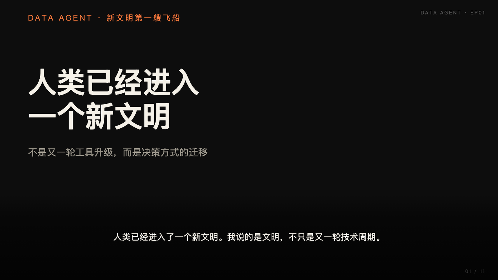

# Data Agent 是驶向新文明的第一艘飞船

> **作者：祝海林（InfiniSynapse 创始人）** · **更新时间：2026-05-19** · *本文不是产品功能介绍，是我对 Code Agent 之后下一阶段的判断；InfiniSynapse 是按这个判断在搭的飞船。*

*图：Code Agent 是新文明的造船技术，Data Agent 是真正驶向新文明的第一艘飞船。*

**Meta Description**：Code Agent 已经验证了 AI 工程能力，但还没创造直接财富。下一艘真正改变文明形态的飞船，是 Data Agent —— 它把决策从拍脑袋时代带进数据驱动时代。一篇 InfiniSynapse 创始人的判断书。（148 字）

**Slug**：`/zh/blog/data-agent-new-civilization`

**Target keyword**：`data agent 新文明` / `data agent civilization`
**Secondary**：`code agent vs data agent`、`AI 数据驱动决策`、`Agentic Analytics`

---

## 目录

1. [一句话观点（TL;DR）](#一句话观点)
2. [什么叫"新文明"？](#什么叫新文明)
3. [Code Agent 真正交付了什么](#code-agent-真正交付了什么)
4. [为什么第一艘飞船一定是 Data Agent](#为什么第一艘飞船一定是-data-agent)
5. [Data Agent 的两阶段使命](#data-agent-的两阶段使命)
6. [我们到底在造什么](#我们到底在造什么)
7. [常见疑问 FAQ](#常见疑问-faq)
8. [结语：飞船启航之前](#结语飞船启航之前)

---

## 一句话观点

> **Code Agent 是这一轮 AI 的造船技术，Data Agent 是第一艘真正能启航的飞船。** 它把人类决策从"拍脑袋时代"带入"数据驱动时代"；更重要的是，它还要为下一阶段的 AI 自主决策，提供它自己能信任的事实底座。这不是一句口号，而是 InfiniSynapse 正在花全部精力做的事。

如果你只想看一个观点：**别再问"AI 替我写代码"了，开始问"AI 能不能替我做出可被审计的业务决策"。** 这两个问题相差的不是一个功能，而是一整代基础设施。

---

## 什么叫"新文明"？

人类已经彻底进入了一个新文明。对，我说的是"文明"，不是"工具升级"，也不是"生产力革命"。

这个判断的依据不在 GPU 数量，也不在融资估值，而在一个更朴素的事实：**人类第一次拥有了非人类智能体作为协作伙伴**。当这种伙伴关系开始嵌入软件、流程、决策、组织结构，文明的形态就不再是工业文明的延长线，而是一个新坐标系下的起点。

在新坐标系下，旧文明里很多被默认正确的假设会失效：

- "好工程师 = 能写代码"
- "数据团队 = 处理报表的成本中心"
- "决策 = 拍脑袋 + 一份 PPT"
- "知识 = 谁记得住、谁掌握"

新文明里，代码会被 Agent 写，报表会被 Agent 跑，决策会被 Agent 辅助甚至代理；**人类要思考的不再是"怎么做"，而是"为什么做、做对了吗、出错了能不能复盘"。**

文明的级别取决于它愿意把多少决策权交给系统，又能为这些决策建立多深的可信底座。

---

## Code Agent 真正交付了什么

过去两年，所有人都在追 LLM。聚焦点几乎全在"会不会用、用得多熟"。但很少有人冷静评估一个问题：**Code Agent 落地之后，它给人类带来了什么？**

我的看法可能不讨喜：

- 它**没有**带来直接的财富；
- 它甚至让人类**消耗了更多的财富**（GPU、电力、模型训练、迭代成本）；
- 但它做成了一件更重要的事——**让 AI 第一次真正能完成"端到端的工程任务"**。

这就是新文明的造船技术。

| 类比 | 历史里的对应物 |
|---|---|
| 蒸汽机被发明 | 没有立刻让所有家庭富起来，但让"机器代替肌肉"成为可能 |
| 集成电路被发明 | 没有立刻让所有人变聪明，但让"机器代替神经"成为可能 |
| **Code Agent 落地** | 没有立刻让企业赚钱，但让"机器代替工程师拼装系统"成为可能 |

技术本身不创造文明。技术让某种**新的工具集**变得可造。文明跃迁，靠的是这一批新工具被真正建出来、用起来、形成规模。

Code Agent 是造船的车间。下一步，是把船真造出来。

---

## 为什么第一艘飞船一定是 Data Agent

为什么不是别的？为什么不是更好的 Copilot？不是更好的 ChatGPT？不是 AGI？

因为新文明的入场券，**不是 AI 会不会聊天，而是 AI 能不能进入决策。**

而决策的前置条件，叫做**数据**。

> **关键定义**：本文所说的 **Data Agent** 是一个自治软件系统，它把业务问题作为目标，跨企业结构化和非结构化资产定位相关数据，判断哪些来源可信，执行可验证的查询，留下可审计的过程证据，并在结论无法支撑时显式承认不可回答。它不是"会写 SQL 的 Copilot"，而是企业决策的事实接口。

人类决策的可靠性，长期被三件事限制：

1. **数据找不齐**：分析师 80% 的时间都在找数和清数；
2. **口径不一致**：两个部门看同一指标得出两个数；
3. **决策不可复盘**：决策做完，没人能说清当时基于什么数据、什么口径、什么假设。

LLM 的 Copilot 范式解决不了这三件事。它能给你写报告、做 PPT、解释概念，但它**进不了企业数据的真实现场**。

要进入现场，必须有一个能**自主寻路、判断口径、执行查询、留下证据**的系统。这就是 Data Agent。

所以一旦人类决定让 AI 进入决策，第一艘必须造的飞船，就是 Data Agent。这不是产品偏好，是逻辑必然。

---

## Data Agent 的两阶段使命

Data Agent 的真正价值，不在它今天能跑多少 SQL，而在它打开的两个时代窗口：

### 第一阶段：为人类提供快速决策依据

今天大部分企业的"数据决策"长这样：

- 业务方提需求 → 数据团队排期 → 分析师拉数 → 出 dashboard → 业务方追问 → 重新拉数 → ……

整个回路以**人**为瓶颈。Data Agent 的第一阶段使命，是把这个回路压缩到分钟级，并让每一次回答都自带证据链。

这不是简单的提速，而是**改变了组织里数据流动的拓扑**：

| 维度 | 旧拓扑（人为瓶颈） | 新拓扑（Agent 为执行体） |
|---|---|---|
| 决策延迟 | 天 / 周 | 分钟 |
| 追问成本 | 重新排期 | 同一会话内继续 |
| 证据保存 | 看个人 | 默认沉淀为可复用资产 |
| 知识复用 | 工程师手抄 | 知识库被 Agent 持续调用 |

这一阶段单看是"提效"。放在文明跃迁视角下，这一阶段是**为下一个阶段铺事实底座**。

### 第二阶段：为 AI 自己提供决策依据

这是被严重低估、却最关键的一句话：

> **AI 不能像人类一样拍脑袋做决策，它必须基于数据。**

很多人觉得"AI 自动化决策"听起来像科幻，但只要 Agent 开始接管运营、营销、风控、调度、调价这些日常运营动作，它每一步都在做决策。而它**没有人类的直觉、没有经验、没有非结构化记忆**。它唯一可信赖的输入，就是**结构化、可验证、被审计过的事实**。

也就是说，**Data Agent 不只是给人用的工具，它最终是 AI 自己用来思考世界的眼睛和手。**

没有第一阶段，就没有第二阶段。
没有第二阶段，AI 永远只是聊天框。

---

## 我们到底在造什么

回到现实层面：**InfiniSynapse 在造的，就是这艘飞船的第一版本。**

它由三个互相咬合的部件构成：

| 部件 | 角色 | 一句话定位 |
|---|---|---|
| **InfiniAgent** | 大脑 | 把问题拆解为可执行的探查—执行—验证循环，必要时调度多个子 Agent 并行 |
| **InfiniSQL** | 工作语言 | Agent 友好的分析语言：每次工具调用产出**具名中间表**，多轮追问沉淀成"面向问题的虚拟数仓" |
| **InfiniRAG** | 业务知识层 | 把指标定义、历史分析、用户偏好、不确定性边界**绑定到数据源**，让 Agent 在写 SQL 之前先咨询知识 |

它们之上是 Task View、SQL 轨迹、具名表、图表、文件、报告 —— 不是为了界面热闹，是因为**没有可审计工作流的 Agent，企业不敢用**。

如果你只想记一句话：**这是一艘以"可审计可信答案"为发动机的飞船。** 它要解决的，不是"让模型写更聪明的 SQL"，而是"让企业敢把决策权部分让渡给 Agent"。这一让渡，是新文明的真正开始。

更详细的论证，写在另一篇姊妹文章里：[为什么 Code Agent 无法解决企业数据分析](/blog/why-code-agents-cannot-solve-enterprise-data-analysis)。

---

## 常见疑问 FAQ

**Q1. 为什么说 Data Agent 是"第一艘"飞船，而不是其他类型的 Agent？**
因为决策是新文明的入场券，决策的前置条件是数据。除非你认为 AI 永远只该聊天而不该进入决策，否则一定要先有 Data Agent，才能谈下一类。其他垂直 Agent（设计、客服、销售、风控、调度）都依赖一个能可信地给出事实的底层 Agent —— 那个底层 Agent 就是 Data Agent。

**Q2. Code Agent 不重要了吗？**
不，恰恰相反。没有 Code Agent 的工程能力沉淀，今天根本造不出 Data Agent。Code Agent 是造船技术，Data Agent 是船。两者不是替代关系，是先后关系、是基础与应用关系。

**Q3. "AI 不能拍脑袋决策"是不是太绝对了？**
不是。"拍脑袋决策"对人类工作过，是因为人类有数十亿年进化沉淀的直觉、有海量非结构化记忆、有承担后果的能力。AI 三样都没有。它一旦进入决策，唯一可信赖的依据就是结构化事实加上可验证的推理过程。这恰恰是 Data Agent 的目标函数。

**Q4. 这和 BI 工具有什么本质区别？**
传统 BI 工具是**让人去看数据**；Data Agent 是**让 Agent 自己去找数据、判口径、出答案、留证据**。BI 的成功标准是"图表好看"，Data Agent 的成功标准是"答案可被业务、数据、审计、IT 复核"。两者解决的不是同一类问题。

**Q5. 现在能用吗？**
能。InfiniSynapse 已经支持 MySQL、PostgreSQL、ClickHouse、MongoDB、Snowflake、SQL Server、Doris、Supabase、Excel、文件、API 等数据源，可以在 [InfiniSynapse 云端工作空间](https://app.infinisynapse.cn)直接连库提问，或下载 Command Tools 在 Cursor / Claude Code / Codex / WinClaw 里调用 Data Agent 能力。

**Q6. 你为什么这么早就喊"文明级别"的判断？**
因为做大平台的窗口期都很短。等所有人都意识到的时候，分工已经被定型。我宁可早讲对，也不愿晚讲对。

---

## 结语：飞船启航之前

飞船真正启航之前，永远会经过一段尴尬的时间：旁人觉得这只是一堆零件、一堆造船图、一堆"为什么不直接用别的"的疑问。

但只要造船技术成立，第一艘飞船一定会被造出来。第一艘飞船一定会启航。第一艘飞船的目的地一定会决定下一艘飞船被造给谁。

我们押的方向是：**第一艘飞船的目的地，是企业数据决策；第二艘飞船的目的地，是 AI 自己的决策。**

如果这个判断对，那么我们今天做的每一行代码——InfiniAgent 的探查循环、InfiniSQL 的具名中间表、InfiniRAG 的知识绑定、Task View 的证据链——都是在给那艘飞船装上发动机和导航系统。

如果你也想看这艘船到底长什么样，欢迎在 [InfiniSynapse](https://app.infinisynapse.cn) 接一个真实数据库，问一个真实业务问题，把 Task View 拉到底翻一遍。

新文明不在远方。
它在每一次"Agent 真的搞清楚了一件事"的瞬间。

---

## 延伸阅读

**同批次（Data Agent 系列）：**

- 姊妹篇：[为什么 Code Agent 无法解决企业数据分析](/blog/why-code-agents-cannot-solve-enterprise-data-analysis) — 解释 Code Agent 在企业现场的三大失效点，以及 Data Agent 必须建立的架构层。
- 产品演讲：[构建 Data Agent 的完整 Harness](/zh/blog/data-agent-harness-roadshow-recap) — MPD 峰会现场，InfiniSynapse 八件套架构的硬证据展示。
- 产品入口：[Connect Supabase to an AI Data Analyst — Plus 9 More Sources](/blog/connect-supabase-to-ai-data-agent) (英文) — Data Agent 接入真实数据库的最直接路径。

**姊妹批次（AI-Native Data Analysis 系列，英文，覆盖海外 SEO/GEO）：**

- [AI-Native Data Analysis: What It Means in 2026 (vs AI-Enabled)](/blog/ai-native-data-analysis) — 把"新文明"的飞船叙事翻译成西方读者熟悉的"AI-native vs AI-enabled" 5 支柱框架（autonomy / transparency / distillation / multi-entry parity / self-correction），是本文观点最直接的英文化版本。
- [Best AI Tools for Data Analysis in 2026: SQL + Techniques](/blog/best-ai-tools-for-data-analysis) — 用上述 5 支柱框架把 7 款工具排了一遍，含 Q1 2026 实测笔记。
- [How to Clean Excel Data with AI in 2026: 5 Patterns + a 5-Minute Worked Example](/blog/ai-excel-data-cleaning) — "新文明"在最小切面上的样子：一个真实客户的 Excel 清洗任务，含可复演的 Task 链接。
- [Natural Language to SQL in 2026: What's Real, What's Theatre, and the Architecture That Works](/blog/natural-language-to-sql) — 把"新文明"判断在 NL2SQL 这个具体技术子域里落地：5 代分类法 + 3 失效模式 + 4-tool-call 工作示例。是面向数据工程师的技术深潜版。

**行业信号：**

- [Databricks Blog — Pushing the Frontier for Data Agents with Genie](https://www.databricks.com/blog/pushing-frontier-data-agents-genie)（2026-05-08）。
