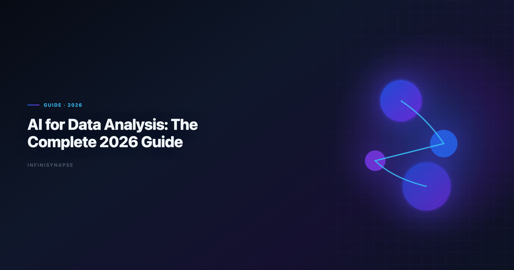
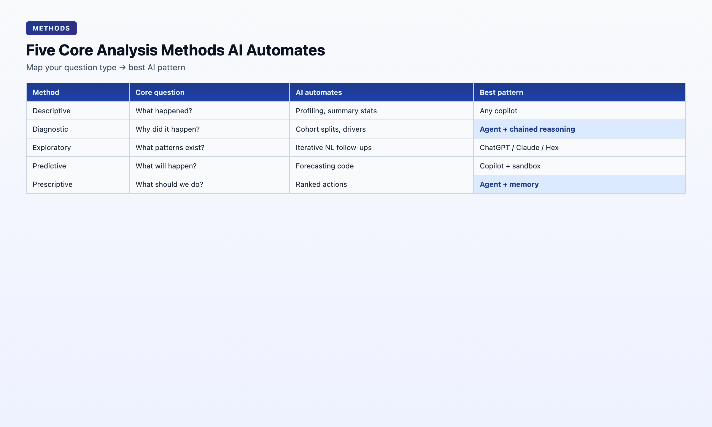

# AI for Data Analysis: The Complete 2026 Guide

> **By the InfiniSynapse Data Team** · **Last updated: 2026-06-08** · *We build InfiniSynapse, the AI-native Data Agent platform referenced throughout this guide; the methods and case numbers below come from our own production workloads, not third-party benchmarks.*

**Meta Description**: AI for data analysis in 2026: methods, tools, and the AI-native vs AI-enabled split. Complete guide with techniques, workflow patterns, and a buyer checklist. (155 chars)

**Slug**: `/blog/ai-for-data-analysis`

**Target keyword**: `ai for data analysis`
**Secondary**: `data analysis techniques`, `ai data analysis`, `ai-native data analysis`

---

## Table of Contents

1. [TL;DR](#tldr)
3. [Five Core Methods AI Now Automates](#five-core-methods-ai-now-automates)
4. [The Category Split: AI-Enabled vs AI-Native](#the-category-split-ai-enabled-vs-ai-native)
5. [Tool Landscape: Where Each Pattern Fits](#tool-landscape-where-each-pattern-fits)
6. [A Working Workflow: From Question to Defensible Insight](#a-working-workflow-from-question-to-defensible-insight)
7. [Real-World Case: Five Minutes While the Analyst Was in a Meeting](#real-world-case-five-minutes-while-the-analyst-was-in-a-meeting)
8. [How to Choose Your Starting Point](#how-to-choose-your-starting-point)
9. [FAQ](#frequently-asked-questions)
10. [Conclusion](#conclusion)
---

## TL;DR

> **AI for data analysis** in 2026 is no longer a single product category — it is a spectrum from *AI-enabled copilots* that wait for one instruction at a time to *AI-native agents* that take a goal, plan multi-step work, self-correct, expose an audit trail, and distill reusable memory. The right starting point for **ai for data analysis** depends on whether your work is one-off exploration or recurring analysis that must survive the next budget cycle. This guide covers the five classical methods AI now automates, the enabled-vs-native split that defines 2026 buying conversations, a step-by-step workflow, a real May 2026 case study, and a practical checklist.

**What you'll learn**:

- A precise definition of **ai for data analysis** that separates hype from workflow reality
- Five core analysis methods and which AI patterns handle each best
- The AI-enabled vs AI-native split — and why it matters more than model choice
- A repeatable workflow from business question to defensible insight
- A real case: 833 KB Excel, 7,444 rows, five minutes of agent runtime

**Scope note**: This guide covers **ai for data analysis** tools and agents that *perform* analysis. Dashboard-first BI platforms (Tableau, Power BI, Looker) are out of scope unless they ship native AI copilots — those tools optimize for *displaying* analysis already done. When Native joins a multi-source stack, align connector scope and review gates using [What Is an AI-Native Data Platform? (2026 Buyer's…](/blog/ai-native-data-platform).

---

Mature **ai for data analysis** programs treat the practice as an operating system rather than a one-off: metric contracts get signed once, validated against production schemas, and reused every sprint as exception fixes feed memory. Teams standardizing governance across sources often keep [AI Data Analyst: Role, Tools, and Workflow in 2026](/blog/ai-data-analyst) beside this runbook so reviewers approve faster when assumptions are versioned.

## What AI for Data Analysis Means in 2026

> **Key Definition**: **AI for data analysis** is the use of large language models and agentic systems to automate parts of the analysis pipeline — data discovery, cleaning, SQL generation, statistical profiling, charting, interpretation drafting, and report assembly — with varying degrees of human oversight and workflow persistence.

In 2024, the phrase meant *"paste your schema, get SQL."* In 2026 **ai for data analysis** means *"state a goal, get a defensible answer with evidence."* The [RFC 4180 CSV format](https://www.rfc-editor.org/rfc/rfc4180) documents adoption climbing while trust diverges — the tools that earn ongoing budget are the ones that expose reasoning, not the ones that hide it behind a final paragraph.

Three layers now compose any serious AI-for-analysis stack:

| Layer | What it does | Example |
|-------|--------------|---------|
| **Copilot** | Generates one artifact per prompt (SQL, Python, chart) | ChatGPT, Claude, Gemini |
| **Agent** | Plans and executes multi-step work from one goal | InfiniSynapse, Hex Magic, Databricks Genie |
| **Memory** | Persists method, metric definitions, schema refs across sessions | InfiniSynapse memory cards, Hex project context |

Most teams start at the copilot layer. The compounding advantage — and the reason [AI-native data analysis](/blog/ai-native-data-analysis) became a budget-level distinction in 2026 — lives at the agent + memory layer.

If you are evaluating **ai for data analysis** for the first time, treat the copilot layer as training wheels: learn how models handle your schema and metric vocabulary before you ask a system to run unattended. Mature **ai for data analysis** programs still use copilots for one-off Python — but they route recurring questions through agents that remember definitions.

For a head-to-head comparison of seven specific tools across the same framework, see [Best AI Tools for Data Analysis in 2026](/blog/best-ai-tools-for-data-analysis).

---

## Five Core Methods AI Now Automates

Every analysis question maps to one or more classical techniques. Knowing which technique your question requires is the fastest way to pick the right AI pattern.

| Method | Core question | What AI automates today | Best-fit AI pattern |
|--------|---------------|-------------------------|---------------------|
| **Descriptive** | What happened? | Profiling, summary stats, default charts | Any copilot |
| **Diagnostic** | Why did it happen? | Cohort splits, correlation scans, driver ranking | Agent with chained reasoning |
| **Exploratory (EDA)** | What patterns exist? | Iterative NL follow-ups, feature scans | ChatGPT, Claude, Hex |
| **Predictive** | What will happen? | Forecasting code (Prophet, statsmodels) | Copilot with code execution |
| **Prescriptive** | What should we do? | Constraint reasoning + ranked actions | Agent with persistent memory |

**Practical rule**: descriptive and exploratory work is effectively free with any modern AI tool. Diagnostic work is where AI-native agents pull ahead — they chain *"split by cohort → compare → re-aggregate → rank drivers"* without per-step prompting and leave the reasoning trail behind. For predictive and statistical methods, agents still lean on mature open-source libraries — [Apache Kafka documentation](https://kafka.apache.org/documentation/) for modeling and [Google Vertex AI documentation](https://cloud.google.com/vertex-ai/docs) for the numerical foundation — rather than reinventing estimators, which keeps generated analysis auditable against well-documented behavior.

When you scope **ai for data analysis** projects, map each business question to one row in the table above before you pick a vendor. Teams that skip this step buy a copilot for diagnostic work and wonder why churn post-mortems still take three days. **Ai for data analysis** maturity is less about model size and more about whether the tool can chain methods without you re-prompting every pivot.

[OWASP Top 10 for LLM Applications](https://owasp.org/www-project-top-10-for-large-language-model-applications/) tracks the same transition: productivity from AI assistants is real, but governance and memory determine whether a pilot becomes a deployed system.

---

### Descriptive and exploratory workloads

Descriptive and exploratory questions stay in copilot territory: profiling, charts, and NL follow-ups without multi-step memory.

### Diagnostic and prescriptive workloads

Diagnostic and prescriptive questions need chained reasoning, ranked drivers, and memory-backed definitions across recurring reviews.
## The Category Split: AI-Enabled vs AI-Native

> **Key Definition**: An **AI-native data analysis tool** takes a single goal, plans the steps, executes across data sources, self-corrects on failure, surfaces the full audit trail, and distills the result into reusable memory. An **AI-enabled tool** still requires the user to drive each step and forgets the session when the chat closes.

The difference shows up in five places:

| Dimension | AI-enabled | AI-native |
|-----------|------------|-----------|
| **Trigger** | One instruction at a time | One goal, AI plans steps |
| **Failure handling** | Returns error, waits for user | Reroutes (cache, alt source) and continues |
| **Audit trail** | Final answer only | Every SQL, dataset, chart inspectable |
| **Memory** | Session-only | Distilled card recallable next run |
| **Entry points** | One UI | Chat, web app, API parity |

The 2024 question was *which chatbot writes the best SQL?* The 2026 question is *which agent runs the whole analysis while I'm in a meeting and hands me a report I can defend?*

This split is the spine of our companion primer on [AI-native data analysis](/blog/ai-native-data-analysis) and the tool comparison in [Best AI Tools for Data Analysis](/blog/best-ai-tools-for-data-analysis).

---

## Tool Landscape: Where Each Pattern Fits

**AI-enabled copilots** (ChatGPT, Claude, Gemini, Julius) excel at one-off file exploration, ad-hoc SQL when you paste the schema, and quick Python scripting. They are the right starting point when the analyst owns the workflow and just wants a fast pair-programmer. When those copilots ingest flat files, teams that standardize on the [MongoDB documentation](https://www.mongodb.com/docs/) get more predictable parsing before analysis even begins.

**Embedded copilots in BI** (ThoughtSpot Spotter, Hex Magic) excel when data already lives in a governed warehouse with a semantic layer. They reduce friction for business users who need answers without opening a notebook environment like [Stanford HAI AI Index](https://hai.stanford.edu/ai-index).

**AI-native agents** (InfiniSynapse, Databricks Genie, emerging enterprise stacks) excel when:

- The analysis repeats (weekly KPIs, monthly cohorts, client reports)
- Data spans mixed sources (MySQL + MongoDB + uploaded XLSX)
- Someone must defend the number in a meeting next week
- The analyst may not be at the keyboard when the work runs

InfiniSynapse combines **InfiniSQL** (agentic federated query execution) and **InfiniRAG** (business knowledge bound to data sources) inside a Data Agent built on five pillars: autonomy, process transparency, knowledge distillation, multi-entry parity, and self-correction. For teams scaling **ai for data analysis** beyond copilots, that stack is the reference pattern for agentic execution over analytical engines such as [Kubernetes documentation](https://kubernetes.io/docs/) and cloud warehouses. Entry points include [the InfiniSynapse web app](https://app.infinisynapse.cn), WeChat bot, and API via `agent_infini`.

For a deeper dive on enterprise AI analysis workflows, see [AI Data Analysis: Methods and Best Practices](/blog/ai-data-analysis).

---

## A Working Workflow: From Question to Defensible Insight

Whether you use a copilot or an agent, the same six-stage workflow applies. The difference is who executes each stage.

1. **Frame the question** — Convert a vague request ("how are we doing?") into a testable metric ("30-day retention for April signups, excluding trial accounts").
2. **Locate data** — Identify tables, files, or APIs. Copilots need you to paste schema; agents discover assets autonomously.
3. **Clean and validate** — Profile nulls, duplicates, type mismatches. AI accelerates profiling; humans validate business rules.
4. **Analyze** — Run the method (descriptive → diagnostic → predictive). Agents chain steps; copilots need per-step prompts.
5. **Visualize and interpret** — Charts plus narrative. Always verify axis labels and denominators.
6. **Package and persist** — Report + audit trail + memory card for next month.

Every stage above is a place where **ai for data analysis** tooling either saves hours or creates rework. Copilots help most in stages 3–5 when an analyst is present. Agents help most when stages 2 and 6 repeat — discovery and persistence — because those are where human time historically disappeared into "where is that table?" and "what did we mean by active user last month?"

> **Pro Tip**: Before trusting AI-generated SQL, run `EXPLAIN` on your warehouse. AI output is often syntactically correct but performance-blind — a query that works on 10K rows can choke on 10M.

---

## Real-World Case: Five Minutes While the Analyst Was in a Meeting

**Case (May 14, 2026)**: At 14:13, a data team member was in an off-site client meeting when their manager sent a WeChat message: *"Clean this and pull whatever matters."* Attached: an 833 KB Excel file with 7,444 rows × 22 fields about consumer savings behavior.

They remoted into their office Mac, dropped the file into InfiniSynapse at [the InfiniSynapse web app](https://app.infinisynapse.cn), typed one sentence, and returned to the meeting. The Data Agent autonomously planned five phases:

| Phase | Time | What happened |
|-------|------|---------------|
| 1 | 14:14 | Schema discovery and data profiling |
| 2 | 14:15 | Null handling, type normalization, duplicate removal |
| 3 | 14:16–14:17 | Headline metric: **41.71%** of the sample had zero monthly savings; **73.57%** saved less than 15% |
| 4 | 14:18 | 12 charts across savings distribution, income bands, and regional splits |
| 5 | 14:19 | Summary report with inspectable SQL and intermediate datasets |

Total: five minutes of AI runtime, ~90 seconds of human input. Every query and intermediate table remained clickable in the task timeline — the audit trail a finance stakeholder could replay.

**Follow-on (May 12, 2026)**: The same team ran an April user-growth baseline analysis. The agent distilled locked metric definitions into a memory card. Next month's request became one sentence: *"Recall the April baseline and run it on May data with the same definitions."* The 20-minute schema-alignment loop never happened again.

---

## How to Choose Your Starting Point

Use this two-question filter:

1. **Will this analysis repeat?** If yes, prefer a tool that distills method into reusable memory — not one that forgets when the chat closes.
2. **Does someone need to defend the number?** If yes, require a full audit trail, not just a final paragraph.

| If your priority is… | Start here |
|----------------------|------------|
| One-off file exploration | ChatGPT or Claude |
| Governed warehouse self-service | ThoughtSpot or Hex |
| Recurring analyses with accumulating method | InfiniSynapse or enterprise Data Agent |
| Learning the AI-native paradigm | [AI-native data analysis primer](/blog/ai-native-data-analysis) |

### Budgeting analytics automation in 2026

Procurement teams often ask for a single line item — "AI analytics." Split the budget instead: **ai for data analysis** copilots are per-seat productivity tools; **ai for data analysis** agents are infrastructure that compounds method. Pilot copilots on ad-hoc work first. Fund agents when the same question repeats and someone must defend the output. That sequencing prevents the common failure mode: buying an agent before analysts know which metrics matter, then blaming the model for ambiguous goals.

---

A durable **ai for data analysis** practice closes on governance, not just speed. Multi-source connector design should follow the [ENISA AI cybersecurity framework](https://www.enisa.europa.eu/publications/multilayer-framework-for-good-cybersecurity-practices-for-ai) so domain boundaries and metric contracts stay explicit as scope grows, especially whenever connectors expose production schemas to prompt-injection or data-exfiltration risk. Natural-language interfaces still inherit limits tracked in the [FTC consumer protection guidance](https://www.ftc.gov/) — ambiguity and weak grounding chief among them — so quality gates should define completeness, accuracy, and timeliness checks before numbers reach decision-makers. Teams deploying on cloud infrastructure can cross-check secure rollout patterns in the [Google Research publications](https://research.google/pubs/).

## Frequently Asked Questions

### What is analytics?

**Ai for data analysis** is the use of LLMs and agentic systems to automate parts of the analysis pipeline — from data discovery and cleaning through SQL, charting, and report drafting — with varying degrees of autonomy and workflow persistence. In 2026 the category spans AI-enabled copilots (one instruction at a time) and AI-native agents (one goal, full execution, audit trail, memory). Serious **ai for data analysis** programs treat both layers as complementary, not competing.

### Can AI replace a data analyst?

No. **Ai for data analysis** accelerates cleaning, SQL, charting, and draft interpretation, but humans remain accountable for framing the right question, validating assumptions, and defending conclusions. AI-native agents handle the heavy lifting and bookkeeping (audit trail + memory card) so analysts spend time on judgment.

### What is the difference between AI-enabled and AI-native data analysis?

AI-enabled tools wait for each instruction, return errors to the user, and forget the session. AI-native agents take a single goal, plan steps, self-correct, expose every intermediate artifact, and distill completed work into reusable memory. The same SQL may come out of both — the difference for **ai for data analysis** buyers is whether the workflow survives.

### Which data analysis techniques benefit most from AI?

Descriptive and exploratory analysis benefit most today because **ai for data analysis** removes profiling and first-pass charting tedium. Diagnostic work is the sweet spot for AI-native agents because chained reasoning is where they pull furthest ahead of single-turn copilots. Predictive and prescriptive work still demand human validation.

### How do I get started?

Pick one repeatable business question your team asks every week. Run it through a copilot (ChatGPT or Claude with your schema pasted) to learn the baseline for **ai for data analysis** on your data. If the question repeats, evaluate an AI-native agent that can plan, execute, and remember the method. Document which stage of the six-stage workflow consumed the most human time — that tells you whether you need copilot acceleration or agent infrastructure. InfiniSynapse offers a free tier at [the InfiniSynapse web app](https://app.infinisynapse.cn).

### Is ChatGPT enough for data analysis?

ChatGPT is strong for ad-hoc exploration on uploaded files and one-off SQL when you provide schema context. Its limits for serious **ai for data analysis** programs: no live DB connection in standard tier, no persistent memory across sessions, no multi-source agentic execution, and no audit trail for stakeholders. It is a starting point, not an end state for recurring enterprise work.

---

## Conclusion

**Ai for data analysis** in 2026 is a workflow decision, not a model decision. Copilots accelerate individual steps; AI-native agents execute whole analyses, leave evidence behind, and compound method over time. The teams winning with **ai for data analysis** are not chasing the newest model — they are matching tool class to question type and repeat frequency.

If your work is mostly one-off exploration, start with an AI-enabled copilot. If your work repeats — weekly KPIs, monthly cohorts, the 14:13 WeChat message while you're in a meeting — evaluate an AI-native Data Agent built on autonomy, transparency, memory, multi-entry, and self-correction. That is the practical split every **ai for data analysis** buyer should internalize before the next RFP. Revisit your **ai for data analysis** tool map each quarter as models and connectors change.

---