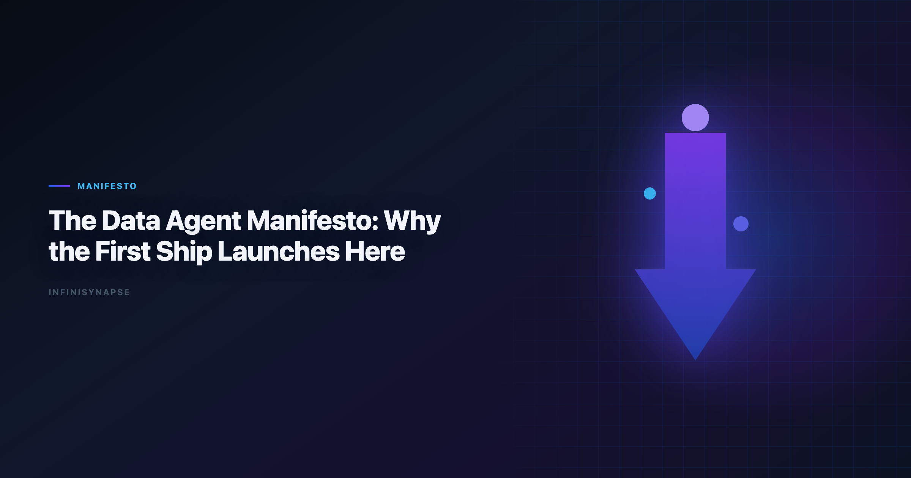
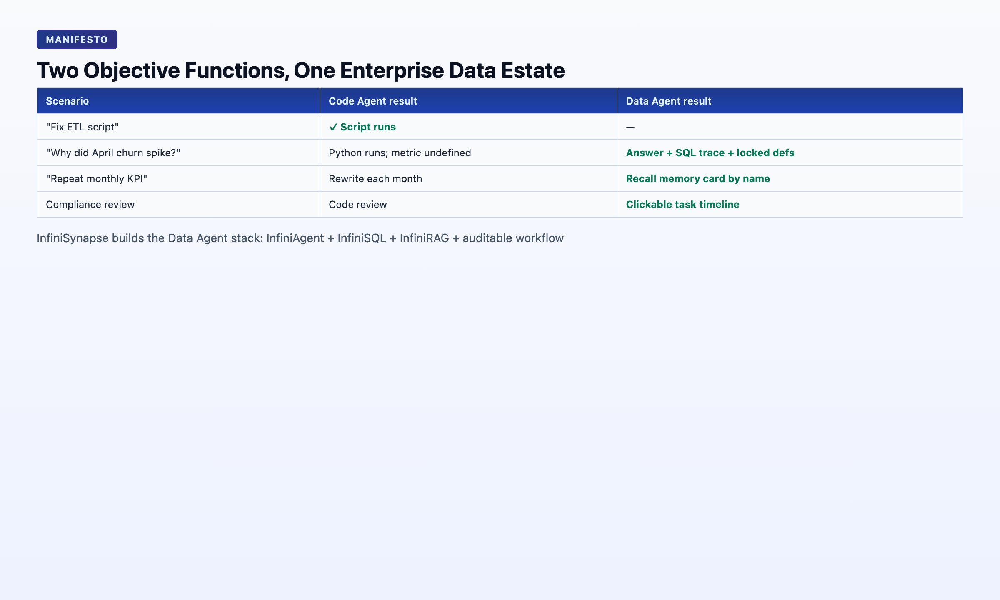

> **By the InfiniSynapse Data Team** · **Last updated: 2026-06-08** · *We build InfiniSynapse, the Data Agent platform described in this manifesto. The architectural claims below are grounded in 18+ months of production deployments — not a vendor whitepaper.*

**Meta Description**: This data agent manifesto argues the AI era's first ship is an auditable Data Agent — defensible decisions, not just running code. Includes examples and a FAQ.

**Slug**: `/blog/data-agent-manifesto`

**Target keyword**: `data agent manifesto`

---

## Table of Contents

1. [TL;DR](#tldr)
2. [The Thesis](#the-thesis)
3. [What Code Agent Delivered — and What It Did Not](#what-code-agent-delivered--and-what-it-did-not)
5. [The Five Non-Negotiables](#the-five-non-negotiables)
6. [Architecture: InfiniSQL + InfiniRAG + Auditable Workflow](#architecture-infinisql--infinirag--auditable-workflow)
7. [Evidence From Production](#evidence-from-production)
8. [The Division of Labor](#the-division-of-labor)
9. [FAQ](#frequently-asked-questions)
10. [Conclusion](#conclusion)
---

## TL;DR

> **Code Agent is shipyard technology. Data Agent is the first ship that actually launches.** Code Agents optimize for one objective: *make the code run*. Data Agents optimize for another: *produce a defensible answer inside a messy, dynamic enterprise data environment*. The entry ticket to AI-driven civilization is not whether machines can chat — it is whether machines can enter **decisions** with evidence humans can audit. This data agent manifesto states why that ship must be a Data Agent, what architectural primitives it requires, and how InfiniSynapse is building it.

This data agent manifesto is written for founders, CTOs, heads of data, and platform engineers deciding where to invest the next wave of AI budget — and whether "Code Agent + database connector" is enough. LLM-backed analytics should account for prompt-injection and data-exfiltration risks in the [Wikipedia business intelligence overview](https://en.wikipedia.org/wiki/Business_intelligence), especially when connectors expose production schemas. If this topic is in scope for your team, reuse the same memory-and-trace checklist in [AI for Data Analysis: The Complete 2026 Guide](/blog/ai-for-data-analysis).

**What you'll learn**:

- The objective-function difference between Code Agents and Data Agents
- Why Databricks, Gartner, and enterprise buyers converged on Data Agents as a separate category in 2026
- Five non-negotiable capabilities every Data Agent must ship
- How InfiniSQL, InfiniRAG, and auditable workflow compose the stack
- Real production evidence from InfiniSynapse deployments

**Scope note**: This is a vision and architecture data agent manifesto, not a product tutorial. For definitional depth, see [What Is a Data Agent?](/blog/what-is-a-data-agent). For technical proof, see [Why Code Agents Cannot Solve Enterprise Data Analysis](/blog/why-code-agents-cannot-solve-enterprise-data-analysis).

---

Governance expectations for production analytics align with the [NIST SP 800-53 security controls](https://csrc.nist.gov/pubs/sp/800/53/r5/final), which we reference when designing reviewer checkpoints. The credential, preflight, and SQL-trace pattern above also applies to Agentic—see [Best Agentic Analytics Tools for Data-Driven Insi…](/blog/best-agentic-analytics) for source-specific steps.

## The Thesis

This data agent manifesto starts from one premise: humanity has crossed into a coordinate system where non-human intelligences are collaborators in software, processes, and decisions. In that coordinate system, several industrial-age defaults stop being true:

- "A great engineer writes great code."
- "A data team is a cost center that ships dashboards."
- "A decision is a gut call plus a slide deck."

In the new coordinate system, **what humans must guarantee is not "how to do it" but "did we do it right, and can we replay it?"**

This data agent manifesto's guarantee requires a system that can autonomously navigate enterprise data, judge which sources to trust, execute verifiable queries, and leave evidence behind. That system is a **Data Agent** — an autonomous actor optimized for defensible answers, not running code.

> **Manifesto Definition**: A **Data Agent** is an autonomous software system that takes a business question as its goal, locates relevant data across structured and unstructured assets, resolves source-of-truth conflicts, executes verifiable queries, surfaces an inspectable audit trail, and explicitly flags conclusions it cannot defend. A **Code Agent** ships running code. A **Data Agent** ships defensible answers.

This data agent manifesto is not a product preference. It is a logical necessity once AI enters decisions — and every decision rests on data.

For the founder's full narrative on civilization and the first ship, see [Data Agent Is the First Spaceship to a New Civilization](/blog/data-agent-new-civilization).

---

## What Code Agent Delivered — and What It Did Not

For two years, the industry chased LLMs almost exclusively through the Code Agent lens: Claude Code, Codex, Cursor, Devin. The achievement is real — **for the first time, AI can complete an end-to-end engineering task.**

But the hard question few asked: *what did Code Agent actually deliver to humanity?*

Our read:

| Claim | Reality |
|-------|---------|
| Created direct wealth | Not yet — GPUs, training, and iteration consumed more than they returned |
| Changed engineering | Yes — machines can now assemble systems instead of engineers typing every line |
| Changed enterprise decisions | **No** — decisions still bottleneck on data discovery, definition alignment, and replay |

Code Agent is the shipyard. The core claim of this data agent manifesto is narrow: the ship has not launched.

On May 8, 2026, Databricks published [Shopify ecommerce analytics](https://www.shopify.com/enterprise/blog/ecommerce-analytics), reporting that specialized knowledge search, parallel reasoning, and multi-LLM design moved Genie from **32% to over 90%** on their internal enterprise benchmark — while a leading coding agent stayed at 32%. Treat that as directional, not universal. The direction is unambiguous: **enterprise data analysis is a separate system design problem from writing code.**

---

## Why the First Ship Is a Data Agent

Three problems have gated reliable human decisions for decades. Enterprise AI adoption guidance in [OpenTelemetry documentation](https://opentelemetry.io/docs/) mirrors the shift from ad-hoc copilots to repeatable, reviewable decision workflows.

1. **Data can't be found** — analysts spend ~80% of time hunting and cleaning.
2. **Definitions don't match** — two departments, two numbers, same metric name.
3. **Decisions can't be replayed** — no one reconstructs which data, definitions, and assumptions a call rested on.

As this data agent manifesto argues, copilots around LLMs cannot solve any of these. They write memos. They explain concepts. They **cannot enter the scene of enterprise data** — thousands of tables, conflicting metric definitions, no unit test for "is this number correct?"

| Capability | Why Code Agent fails | Why a Data Agent must exist |
|------------|---------------------|---------------------------|
| **Asset discovery at scale** | Codebases have paths, types, tests; data estates do not | Must search tables, dashboards, docs, Excel, APIs simultaneously |
| **Dynamic source of truth** | Git HEAD is authoritative; metrics are negotiated | Must judge which definition wins for *this* question |
| **Missing oracle** | Tests pass or fail; no test for "revenue is correct" | Must expose evidence chain and flag undefended conclusions |
| **Workflow persistence** | PR merges; chat sessions evaporate | Must distill method into reusable organizational memory |

The technical proof of each challenge — and why Code Agent + DB connector is a comforting illusion — is in [Why Code Agents Cannot Solve Enterprise Data Analysis](/blog/why-code-agents-cannot-solve-enterprise-data-analysis).

---

## The Five Non-Negotiables

Every production data agent this data agent manifesto evaluates — including our own — decomposes into five pillars. Ship fewer than four and you have a copilot with marketing.

### 1. Autonomy — One Goal, Many Steps

The user states a goal in one sentence. The agent plans discover → query → validate → visualize → summarize. Anti-pattern: asking "Should I now join table X?" after every step — that is copilot behavior with extra dialog.

### 2. Process Transparency — Every Artifact Inspectable

Stakeholders must click into every SQL, intermediate dataset, and chart. Final-answer-only systems fail audit — and fail the next budget cycle when trust diverges ([Wikipedia SQL overview](https://en.wikipedia.org/wiki/SQL)).

### 3. Knowledge Distillation — Memory That Compounds

At task completion, the agent compresses what mattered: summary, schema refs, locked metric definitions, time range. Next month's request recalls the card — the 20-minute alignment loop never repeats.

### 4. Multi-Entry Parity — Same Agent, Every Door

WeChat for light queries. Web app for deep tasks. API (`agent_infini`) for embedding in kanban systems, Code Agent workflows, or custom agents. The capability must not depend on which door you entered.

### 5. Self-Correction — Reroute, Don't Fail

When a live source is down, a join returns empty, or a query times out, the agent reroutes (cache, alternative source, revised plan) instead of handing an error back and waiting.

These five pillars define [AI-native data analysis](/blog/ai-native-data-analysis) — the workflow paradigm the first ship implements.

---

## Architecture: InfiniSQL + InfiniRAG + Auditable Workflow

InfiniSynapse composes three primitives:

**InfiniSQL** — Agentic federated query execution. Not "generate a bigger script." Tool calls: discover schema → pick dialect → run query → validate row count → retry with revised join. Supports MySQL, MongoDB, uploaded XLSX/CSV, and warehouse connectors — often in one task.

**InfiniRAG** — Business knowledge bound to data sources, not pasted into context. Metric definitions, data dictionaries, prior analysis notes, and org-specific rules live as infrastructure the agent retrieves per sub-question — the pattern Databricks calls "specialized knowledge search."

**Auditable workflow** — Every phase logged in a task timeline. Humans approve memory cards (DRAFT → approved) before they join the project knowledge base. This is how trust scales without an oracle that says "the number is correct."

The stack runs at [the InfiniSynapse web app](https://app.infinisynapse.cn) and via WeChat bot and API.

---

## Evidence From Production

A data agent manifesto without evidence is a slogan. Two production cases anchor ours:

**Case 1 — Lobster Moonlight (May 14, 2026)**: 833 KB Excel, 7,444 rows × 22 fields, WeChat request at 14:13 while the analyst was in a meeting. One sentence to InfiniSynapse. Five autonomous phases by 14:19. Headline: 41.71% zero savings, 73.57% under 15%. Twelve charts. Full task timeline inspectable.

**Case 2 — April Baseline Memory (May 12, 2026)**: User-growth analysis distilled into a memory card with locked definitions. May rerun: one sentence, same definitions, no re-alignment. Proof of Pillar 3 — the compounding advantage Code Agents and copilots cannot deliver.

---

## The Division of Labor

| Task | Code Agent | Analytics agent |
|------|------------|------------|
| Build ETL pipeline | ✅ Primary | ○ Orchestrate via API |
| Refactor analysis notebook | ✅ Primary | ○ |
| Answer "why did churn spike in April?" | ○ Fragile | ✅ Primary |
| Weekly KPI with locked definitions | ○ Starts from scratch | ✅ Primary |
| Multi-source join across MySQL + XLSX | ○ User wires each step | ✅ Primary |
| Defend number in finance review | ○ No audit trail | ✅ Primary |

The right architecture uses both — Code Agents build systems; goal-driven analytics actors operate inside enterprise data estates. Confusing the two wastes budget and breaks trust.

---

## What Buyers Should Ask Before Deploying

**Question 1 — Repeat test**: Submit the same recurring KPI twice, four weeks apart. If the second run re-explains schema from scratch, you are buying a copilot with agent branding, not a production **data agent**.

**Question 2 — Unattended test**: Submit one goal and leave for fifteen minutes. Return to a finished task with a phased timeline, or to a chat waiting for your next instruction. Only the former qualifies.

**Question 3 — Oracle test**: Ask finance to challenge one headline number. Can they trace it to SQL in under five minutes? Autonomous analytics systems without inspectable intermediates fail this test regardless of accuracy.

**Question 4 — Memory test**: Does completed work distill into an approved card with locked definitions? Organizational memory is the compounding advantage that separates enterprise decision agents from session-based chat.

These four questions distill the data agent manifesto into procurement tests, filtering marketing noise faster than any feature matrix. They also explain why Databricks invested in specialized knowledge search and parallel reasoning for Genie — the category is defined by enterprise data constraints, not by how fluently a model writes Python.

---

Consumer and data-use policies should align with [Redis documentation](https://redis.io/docs/latest/) when outputs inform external decisions.

Quality gates for agents should reference [Wikipedia data warehouse overview](https://en.wikipedia.org/wiki/Data_warehouse) when defining completeness, accuracy, and timeliness checks.

Snowflake deployments should reference [Microsoft data architecture guidance](https://learn.microsoft.com/en-us/azure/architecture/data-guide/) when defining warehouses, roles, and semantic views for NL2SQL agents.

BI modernization debates should reference the [W3C WCAG accessibility standard](https://www.w3.org/TR/WCAG21/) when separating display layers from analysis execution.

Analytics uptime improves when teams borrow [Amazon Redshift documentation](https://docs.aws.amazon.com/redshift/) practices—error budgets, runbooks, and blameless postmortems for failed query chains.

## Frequently Asked Questions

### What is a analytics?

A **data agent** is an autonomous system that takes a business question as its goal, locates and queries relevant enterprise data, resolves source-of-truth conflicts, executes verifiable analysis, leaves an inspectable audit trail, and flags conclusions it cannot defend. It optimizes for defensible answers, not running code.

### How is it different from a Code Agent?

A Code Agent's objective function is *make the code run*. A **data agent**'s is *produce a trustworthy answer in a messy data environment*. Code Agents excel at engineering tasks; data agents excel at enterprise analytics where asset discovery, dynamic definitions, and missing oracles break the Code Agent paradigm.

### Why does the "first ship" metaphor matter?

Code Agent proved AI can complete engineering tasks — shipyard technology. But civilization shifts when tools deploy at scale in decisions, not demos. Decisions require data. The first system that enters decisions with auditable evidence is a **data agent** — hence "the first ship launches here."

### What does a team need before adopting one?

Three things make a **data agent** rollout succeed: a small set of recurring, decision-grade questions; agreed metric definitions and source-of-truth rules; and a reviewer who reads the audit trail rather than rubber-stamping output. Without those, even a capable agent produces fast answers no one is accountable for.

---

## Conclusion

The data agent manifesto in one sentence: **stop asking whether AI will write code for you; start asking whether AI can make a business decision you can audit.**

Code Agent answered the first question. This data agent manifesto answers the second: a Data Agent must. That ship requires autonomy, transparency, memory, multi-entry, and self-correction — composed from agentic SQL, knowledge-bound RAG, and auditable workflow.

InfiniSynapse is building that ship at [the InfiniSynapse web app](https://app.infinisynapse.cn).
The technical proof lives in [Why Code Agents Cannot Solve Enterprise Data Analysis](/blog/why-code-agents-cannot-solve-enterprise-data-analysis).

This data agent manifesto ends where it began: launch the ship where decisions actually happen — in the data.

---