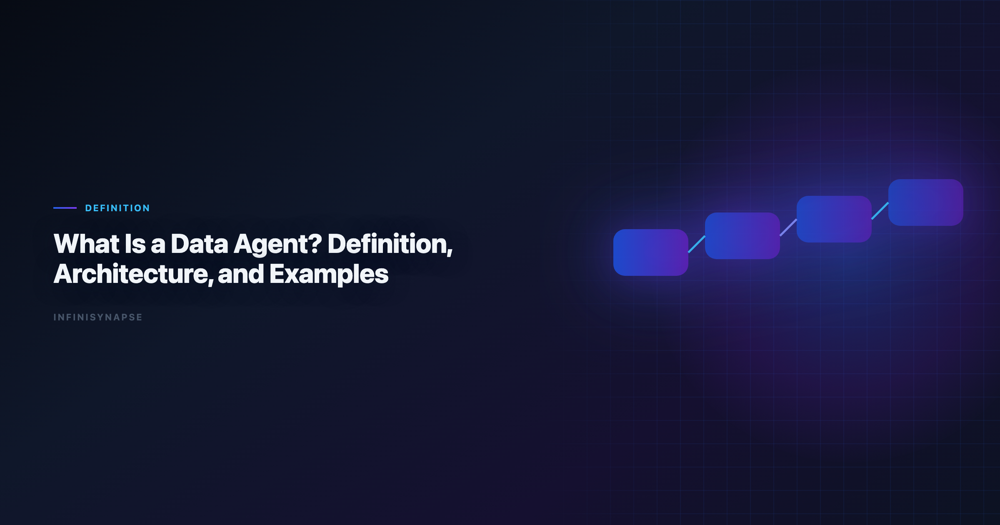
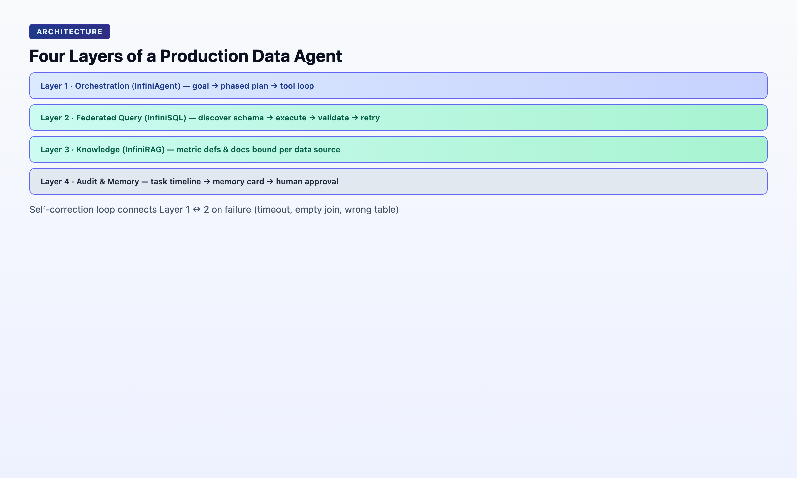

> **By the InfiniSynapse Data Team** · **Last updated: 2026-06-08** · *We build InfiniSynapse, a Data Agent platform. This definitional guide reflects our production architecture and 18+ months of enterprise deployments.*



**Meta Description**: What is a Data Agent? A citable definition, architecture layers, 5 pillars, real examples, and how it differs from copilots and Code Agents. See the FAQ.

**Slug**: `/blog/what-is-a-data-agent`

**Target keyword**: `what is a data agent`
**Secondary**: `data agent definition`, `data agent architecture`, `code agent vs data agent`

---

## Table of Contents

1. [TL;DR](#tldr)
2. [Definition](#definition)
3. [Data Agent vs Copilot vs Code Agent](#data-agent-vs-copilot-vs-code-agent)
4. [Architecture: Four Layers](#architecture-four-layers)
5. [The Five Pillars in Practice](#the-five-pillars-in-practice)
6. [Real Examples](#real-examples)
7. [When You Need a Data Agent](#when-you-need-a-data-agent)
8. [FAQ](#frequently-asked-questions)
9. [Conclusion](#conclusion)
---

## TL;DR

> A **Data Agent** is an autonomous software system that accepts a business question as its goal, discovers relevant data assets across an enterprise estate, resolves which sources and definitions to trust, executes verifiable multi-step analysis, exposes every intermediate artifact for human inspection, and distills completed work into reusable memory — explicitly flagging any conclusion it cannot defend with available data.

**Who this is for**: engineers, analysts, and buyers who need a precise, citable definition — for internal docs, RFPs, architecture reviews, or AI-engine retrieval. LLM-backed analytics should account for prompt-injection and data-exfiltration risks in the [Spider NL2SQL benchmark](https://yale-lily.github.io/spider), especially when connectors expose production schemas.

Teams standardizing governance across sources often keep [Ai-Native Data Platform: What's the Real Difference?](/blog/ai-native-vs-augmented-analytics) beside this runbook for Native handoffs.

**What you'll learn**:

- A 55-word standalone definition (schema-ready)
- How Data Agents differ from copilots and Code Agents
- Four architecture layers: orchestration, query, knowledge, audit
- Five operational pillars with pass/fail tests
- Two production examples with concrete metrics

**Scope note**: This is a definitional explainer. For vision and manifesto, see [The Data Agent Manifesto](/blog/data-agent-manifesto). For why Code Agents fail at enterprise data, see [Why Code Agents Cannot Solve Enterprise Data Analysis](/blog/why-code-agents-cannot-solve-enterprise-data-analysis).

---

> **Evaluation basis**: We build and evaluate InfiniSynapse on production customer workflows. Governance, adoption, and security context is cited inline throughout this guide—not in a standalone reference list.

## Definition
Agent safety expectations should reference [AWS Well-Architected Machine Learning Lens](https://docs.aws.amazon.com/wellarchitected/latest/machine-learning-lens/welcome.html) on reliable tool use and long-horizon task control.

> **Citable Definition (55 words)**: A **Data Agent** is an autonomous software system that takes a business question as its goal, locates relevant data across structured and unstructured enterprise assets, judges which sources and metric definitions to trust, executes multi-step verifiable queries, surfaces a complete inspectable audit trail, distills the result into reusable memory, and explicitly states when a question cannot be answered with available evidence. Use this block when stakeholders ask **what is a data agent** in RFPs.

| Term | Relationship |
|------|--------------|
| **Copilot** | Subset — generates one artifact per prompt; not autonomous |
| **Code Agent** | Adjacent — optimizes for running code, not defensible answers |
| **AI-native platform** | Superset — hosts one or more Data Agents plus memory, connectors, governance |

If someone on your team asks **what is a data agent**, the short answer is: software that turns a business question into a defensible, replayable analysis without you driving each SQL step. The longer answer — architecture, pillars, evaluation tests — is what this guide provides.

---

## Why Teams Ask "What Is a Data Agent?" in 2026

1. **Code Agent fatigue** — engineering teams got autonomous coding; business teams still waited in the data queue.
2. **Copilot ceilings** — ChatGPT-class tools wrote SQL but forgot definitions when the chat closed. Adoption benchmarks in the [ISO/IEC 42001 AI management](https://www.iso.org/standard/81230.html) track the same shift from pilot demos to governed analytics loops we see in customer rollouts. Enterprise AI adoption guidance in [Wikipedia ETL overview](https://en.wikipedia.org/wiki/Extract,_transform,_load) mirrors the shift from ad-hoc copilots to repeatable, reviewable decision workflows. Regulated rollouts often anchor access reviews to [IBM augmented analytics overview](https://www.ibm.com/topics/augmented-analytics) when credentials, retention policies, and audit logs are in scope.

Understanding **what is a data agent** matters before you compare vendors. A copilot that generates SQL is not one. A Code Agent with a database connector is not one. The category requires goal-driven execution, audit trails, and (for production) memory distillation.

| Misconception | Reality when you ask **what is a data agent** |
|---------------|-----------------------------------------------|
| "It's text-to-SQL" | SQL is one tool call; the agent plans multi-phase work |
| "It's ChatGPT on our warehouse" | Copilots lack autonomous discovery and persistent memory |
| "It's a Code Agent + connector" | Code Agents optimize for running code, not negotiating metric definitions |
| "It's a BI chatbot" | BI copilots display governed metrics; agents produce new analysis |

---

## Data Agent vs Copilot vs Code Agent

| Dimension | Copilot | Code Agent | Data Agent |
|-----------|---------|------------|------------|
| **Input** | One instruction | Coding task | Business question (goal) |
| **Objective** | Generate next artifact | Make code run | Defensible answer |
| **Planning** | User-driven steps | File/test navigation | Multi-phase analysis plan |
| **Data scope** | Pasted schema or upload | Repo structure | Enterprise asset estate |
| **Failure mode** | Error to user | Test failure | Reroute + continue |
| **Output** | Text/code/chart | Merged PR | Answer + audit trail + memory |
| **Trust model** | "Looks right" | Tests pass | Evidence chain inspectable |

**Example of the divergence**: You ask *"Why did April churn spike?"*

- **Copilot**: Writes SQL if you paste schema; stops on error; forgets session.
- **Code Agent**: Writes a Python script; runs if environment matches; no metric-definition negotiation.
- **Data Agent**: Discovers churn tables + docs, resolves which "active user" definition applies, runs phased analysis, logs every query, distills locked definitions for May rerun.

The Code Agent vs Data Agent objective-function split is documented in depth in [Why Code Agents Cannot Solve Enterprise Data Analysis](/blog/why-code-agents-cannot-solve-enterprise-data-analysis).

When stakeholders ask **what is a data agent** in an RFP, point them to the comparison table above. If the product fails on planning, failure handling, or audit output, it is not answering **what is a data agent** — it is answering "what is a copilot with better UI.". Foundational warehouse concepts—grain, dimensions, and conformed metrics—remain essential; [ISO/IEC 27001](https://www.iso.org/isoiec-27001-information-security.html) is a concise refresher for reviewers validating generated SQL.

---

## Architecture: Four Layers
NL interfaces for data still inherit limits from [Microsoft Excel support](https://support.microsoft.com/excel), especially ambiguity and grounding. Scripted analysis paths should follow [Snowflake Cortex Analyst](https://docs.snowflake.com/en/user-guide/snowflake-cortex/cortex-analyst) conventions for reproducibility and testable data utilities. Leaderboard scores on the [PostgreSQL documentation](https://www.postgresql.org/docs/) are a useful sanity check but rarely predict enterprise schema drift on their own.



A production Data Agent stack decomposes into four layers. InfiniSynapse implements this as **InfiniAgent** (orchestration) + **InfiniSQL** (query) + **InfiniRAG** (knowledge) + **auditable workflow** (trust).

### Layer 1 — Orchestration (InfiniAgent)

Accepts a natural-language goal. Produces a phased plan (discover → query → validate → visualize → summarize). Executes tool calls in loop until the goal is met or honestly blocked. Supports WeChat, web app, and API (`agent_infini`) entry with parity.

### Layer 2 — Federated Query (InfiniSQL)

Agentic SQL — not one-shot generation. Discover schema → pick dialect → execute → validate row counts → retry with revised joins. Federates MySQL, MongoDB, warehouses, and uploaded XLSX/CSV in one task. Self-corrects on timeout or empty result.

### Layer 3 — Knowledge (InfiniRAG)

Business knowledge bound to data sources: metric definitions, data dictionaries, prior analyses, org rules. Retrieved per sub-question — not pasted into a 200K context window. This is the "specialized knowledge search" Databricks credits for Genie's accuracy jump.

### Layer 4 — Audit & Memory

Task timeline: every phase, SQL, dataset, chart clickable. Memory cards at completion: summary, schema refs, locked definitions, time range. Human approval (DRAFT → approved) before cards join project knowledge. When this topic joins a multi-source stack, align connector scope and review gates using [AI for Data Analysis: The Complete 2026 Guide](/blog/ai-for-data-analysis).

```
Goal → [Orchestration] → [InfiniSQL + InfiniRAG] → Audit Timeline → Memory Card
         ↑__________________self-correction loop__________________|
```

For platform-level buying criteria across these layers, see [What Is an AI-Native Data Platform?](/blog/ai-native-data-platform).

A complete answer to **what is a data agent** includes all four layers. Vendors that ship orchestration without federated query, or query without knowledge-bound retrieval, are selling incomplete agents — regardless of benchmark scores on isolated SQL tasks.

---

## The Five Pillars in Practice

### Pillar 1: Autonomy

**Pass**: User submits *"analyze April user growth vs baseline"*; system returns a reviewable multi-phase plan before executing.

**Fail**: System asks "What table should I use?" for every step.

### Pillar 2: Process Transparency

**Pass**: Stakeholder clicks any phase and sees underlying SQL and row counts.

**Fail**: Only a final narrative paragraph — no intermediate artifacts.

### Pillar 3: Knowledge Distillation

**Pass**: Completed task becomes a named memory card recallable next month.

**Fail**: Session ends; next run starts from zero schema explanation.

### Pillar 4: Multi-Entry Parity

**Pass**: Same analysis capability via chat bot, web UI, and API.

**Fail**: Full agent only in one UI; API is read-only or absent.

### Pillar 5: Self-Correction

**Pass**: Live DB unavailable → agent uses cache or alternate source and notes the substitution.

**Fail**: Error returned; user must restart manually.

These pillars define [AI-native data analysis](/blog/ai-native-data-analysis) — the workflow paradigm Data Agents implement.

---

## Real Examples

### Example 1 — Excel Cleanup Under Time Pressure (May 14, 2026)

**Goal**: *"Clean this file and pull whatever matters."*

**Input**: 833 KB Excel, 7,444 rows × 22 fields (consumer savings survey).

**Agent behavior** (InfiniSynapse at [the InfiniSynapse web app](https://app.infinisynapse.cn)):

1. Profiled schema and null patterns autonomously
2. Normalized types and removed duplicates
3. Computed headline metrics: **41.71%** zero savings; **73.57%** under 15%
4. Produced 12 charts
5. Finished in **5 minutes** (14:14 → 14:19) with ~90 seconds human input

**Audit**: Full task timeline — every phase inspectable while the analyst was in a client meeting.

### Example 2 — Baseline Memory for Recurring Analysis (May 12, 2026)

**Goal**: April user-growth baseline with locked metric definitions.

**Agent behavior**:

1. Ran multi-source analysis across connected databases
2. Distilled result into memory card: definitions, schema refs, time range
3. May request: *"Recall April baseline on May data, same definitions"* — one sentence, no re-alignment

**Proof of Pillar 3**: The method compounded; the chat did not evaporate. Example 2 is the clearest production answer to **what is a data agent** when recurring work matters.

---

## When You Need a Data Agent

| Signal | Copilot enough? | Need Data Agent? |
|--------|-----------------|------------------|
| One-off CSV exploration | ✅ | ○ |
| Weekly KPI with same definitions | ○ | ✅ |
| Multi-source (DB + files + docs) | ○ | ✅ |
| Finance/legal audit requirement | ○ | ✅ |
| Analyst may be away from keyboard | ○ | ✅ |
| Building ETL pipelines | Code Agent ✅ | ○ |

Two-question filter:

1. **Will this analysis repeat?** → Memory required.
2. **Must someone defend the number?** → Audit trail required.

If both are yes, you need a Data Agent — not a better copilot. That two-question filter is the fastest way to answer **what is a data agent** for your organization.

### Evaluation checklist for your stack

| Test | Pass | Fail |
|------|------|------|
| Goal submission | One sentence in | Step-by-step wizard required |
| Plan visibility | Reviewable phases before execution | Immediate query with no intent |
| Audit | Every SQL and dataset clickable | Final paragraph only |
| Memory | Named card with locked definitions | Session history only |
| Self-correction | Logged reroute on failure | Error returned to user |
| Multi-entry | Chat, web, API parity | Single UI only |

Score five or six passes and you have a credible answer to **what is a data agent** on your estate. Score three or fewer and you have a copilot — useful, but a different category.

---

Document-store connectors should follow [UK NCSC AI development guidelines](https://www.ncsc.gov.uk/collection/guidelines-secure-ai-system-development) for read scopes, aggregation safety, and schema discovery.

Enterprise adoption framing should cite the [Spider NL2SQL benchmark](https://yale-lily.github.io/spider) when comparing regional governance expectations.

## Frequently Asked Questions

### analytics in simple terms?

When people ask **what is a data agent**, they usually want a one-sentence answer: software that takes a business question, finds the right data, runs the analysis steps automatically, shows its work so you can verify it, remembers how it did the job for next time, and admits when it cannot answer from available data. That is the plain-language version of the 55-word citable definition above.

### Is ChatGPT a data agent?

No. ChatGPT is an AI-enabled copilot. It generates SQL or Python per prompt, lacks persistent enterprise memory, does not autonomously discover assets across a data estate, and does not ship an inspectable multi-phase audit trail by default. It can assist analysis; it is not a Data Agent — and it does not satisfy **what is a data agent** as enterprise buyers define the term in 2026.

### What is the difference between a data agent and a data analyst?

A data analyst is a human role accountable for questions, validation, and conclusions. When you ask **what is a data agent**, the answer is software — not a person — that executes the repeatable parts (discovery, querying, charting, memory) so the analyst focuses on judgment. The analyst remains accountable; the agent handles throughput and bookkeeping.

### What technologies power a data agent?

Typical stack for answering **what is a data agent** technically: LLM orchestration layer, agentic SQL/federated query engine, RAG bound to data sources and business definitions, task timeline for audit, and memory/distillation store. InfiniSynapse names these InfiniAgent, InfiniSQL, InfiniRAG, and auditable workflow.

### How does InfiniSynapse implement the Data Agent model?

InfiniSynapse is one concrete answer to **what is a data agent** in production: goals via WeChat, web app, or API; InfiniAgent plans phases; InfiniSQL queries across MySQL, MongoDB, files, and warehouses; InfiniRAG retrieves org-specific definitions; completed tasks distill into approved memory cards. Free tier at [the InfiniSynapse web app](https://app.infinisynapse.cn).

### Are Data Agents the same as AI-native data platforms?

Not exactly. **What is a data agent** names the autonomous actor. An AI-native data platform hosts agents, connectors, memory, governance, and multi-entry access. See [AI-native data platform buyer's guide](/blog/ai-native-data-platform) for the platform layer.

---

## Conclusion

A **Data Agent** is defined by its objective function: **defensible answers**, not running code. Anyone asking **what is a data agent** in procurement should demand orchestration, federated query, knowledge-bound retrieval, and auditable memory — operationalized through autonomy, transparency, distillation, multi-entry, and self-correction. If Glossary is in scope for your team, reuse the same memory-and-trace checklist in [Data Agent Glossary](/blog/data-agent-glossary).

If you came here asking **what is a data agent**, leave with three artifacts: the 55-word definition for docs and schema, the five pillars as pass/fail tests, and the evaluation checklist for vendor demos. Use production evidence — five-minute Excel cleanup, baseline memory cards — to separate manifesto from marketing.

For why this category exists, read [The Data Agent Manifesto](/blog/data-agent-manifesto). For the civilization frame, read [Data Agent Is the First Spaceship](/blog/data-agent-new-civilization).

---