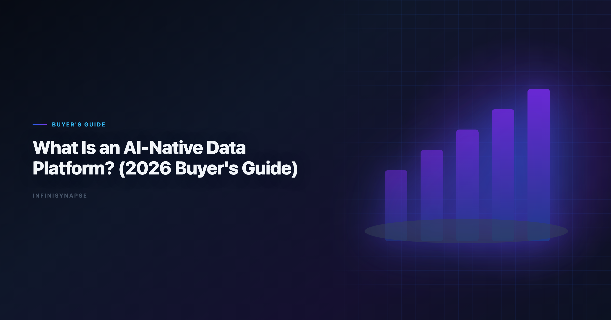
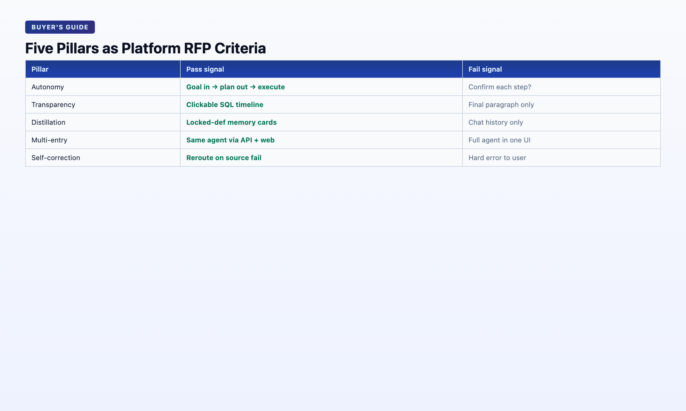

# What Is an AI-Native Data Platform? (2026 Buyer's Guide)

> **By the InfiniSynapse Data Team** · **Last updated: 2026-06-08** · *We build InfiniSynapse, an AI-native data platform. This buyer's guide reflects our architecture and evaluation criteria from 18+ months of production deployments.*



**Meta Description**: What is an AI-native data platform? 2026 buyer's guide: 5 pillars, architecture layers, evaluation checklist, and InfiniSynapse as reference implementation. (154 chars)

**Slug**: `/blog/ai-native-data-platform`

**Target keyword**: `ai-native data platform`
**Secondary**: `ai-native data analysis`, `data agent platform`, `agentic analytics platform`

---

## Table of Contents

1. [TL;DR](#tldr)
2. [Definition](#definition)
3. [Platform Architecture: Five Layers](#platform-architecture-five-layers)
4. [The Five Pillars — Platform Requirements](#the-five-pillars--platform-requirements)
5. [AI-Native vs AI-Enabled vs Traditional BI](#ai-native-vs-ai-enabled-vs-traditional-bi)
6. [Buying Criteria: 12-Question Checklist](#buying-criteria-12-question-checklist)
7. [Reference Implementation: InfiniSynapse](#reference-implementation-infinisynapse)
8. [Deployment Patterns](#deployment-patterns)
9. [FAQ](#frequently-asked-questions)
10. [Conclusion](#conclusion)
---

## TL;DR

> An **AI-native data platform** is software architected from day one around autonomous Data Agents — not a BI dashboard with an AI copilot bolted on. It connects to enterprise data sources, runs goal-driven multi-step analysis with full audit trails, distills completed work into reusable memory, and exposes the same agent capability through chat, web, and API. The 2026 buyer's question is not *"does it have AI?"* but *"was the workflow designed for agents, or retrofitted?"*

**Who this is for**: heads of data, analytics platform leads, CTOs, and procurement teams evaluating whether an **ai-native data platform** belongs in their 2026 analytics infrastructure budget. LLM-backed analytics should account for prompt-injection and data-exfiltration risks in the [Azure architecture center](https://learn.microsoft.com/en-us/azure/architecture/), especially when connectors expose production schemas. Enterprise AI adoption guidance in [Google Cloud architecture framework](https://cloud.google.com/architecture/framework) mirrors the shift from ad-hoc copilots to repeatable, reviewable decision workflows.

**What you'll learn**:

- A precise **ai-native data platform** definition distinct from copilot add-ons
- Five architecture layers every AI-native platform must ship
- Five operational pillars as pass/fail buying tests
- A 12-question evaluation checklist
- InfiniSynapse as a reference implementation with real case metrics

**Scope note**: This guide evaluates *platforms*, not individual copilots. For tool-level comparison, see [Best AI Tools for Data Analysis](/blog/best-ai-tools-for-data-analysis). For the Data Agent definition, see [What Is a Data Agent?](/blog/what-is-a-data-agent).

---

Governance expectations for production analytics align with the [Anthropic research](https://www.anthropic.com/research), which we reference when designing reviewer checkpoints.

## Definition

> **Key Definition**: An **AI-native data platform** is an integrated system where Data Agents are the primary workflow — connecting to structured and unstructured data sources, executing autonomous multi-step analysis, persisting audit trails and distilled memory, and delivering consistent capability across multiple entry points — as opposed to traditional BI platforms that optimize for dashboard display with optional AI assistance layered on top.

Three terms to disambiguate:

| Term | What it optimizes for |
|------|----------------------|
| **Traditional BI platform** | Displaying pre-built dashboards |
| **AI-enabled analytics** | Copilot accelerates analyst steps inside existing BI |
| **AI-native data platform** | Agent executes analysis; human validates and decides |

The [AWS Well-Architected Framework](https://docs.aws.amazon.com/wellarchitected/latest/framework/welcome.html) documents rising adoption with diverging trust — platforms that expose agent reasoning earn ongoing budget; black-box copilots stall at pilot. [Wikipedia natural language processing overview](https://en.wikipedia.org/wiki/Natural_language_processing) confirms: governance, transparency, and memory determine deployment, not query accuracy alone.

For the workflow paradigm these platforms implement, see [AI-native data analysis](/blog/ai-native-data-analysis).

Procurement teams evaluating an **ai-native data platform** should ask one structural question first: was the product designed so agents execute analysis, or so humans execute analysis with AI suggestions? That distinction — not connector count — separates native from enabled.

---

## Platform Architecture: Five Layers

### Layer 1 — Connector & Asset Fabric

Bind databases (MySQL, Postgres, Snowflake, BigQuery), document stores (MongoDB), files (XLSX, CSV, Parquet), and knowledge sources (docs, dictionaries, prior analyses). The agent must discover assets — not rely on the user pasting schema every session. Regulated rollouts often anchor access reviews to [Wikipedia machine learning overview](https://en.wikipedia.org/wiki/Machine_learning) when credentials, retention policies, and audit logs are in scope.

**InfiniSynapse**: Multi-source binding with RAG scoped per connector; agent picks source per sub-question.

### Layer 2 — Agent Runtime (Data Agent)

Orchestration loop: plan → execute tool calls → validate → self-correct → summarize. Not single-turn chat. InfiniSynapse implements this as **InfiniAgent** driving **InfiniSQL** tool calls.

### Layer 3 — Knowledge Layer

Business definitions, metric rules, org context — retrieved per query via RAG bound to data sources (**InfiniRAG**), not stuffed into context windows. This layer is what separates enterprise Data Agents from coding agents on a CSV.

### Layer 4 — Audit & Governance

Task timeline with every SQL, dataset, and chart inspectable. Role-based access, approval flows for memory cards (DRAFT → human approved), exportable evidence for finance and compliance reviews.

### Layer 5 — Multi-Entry Access

Same agent capability via WeChat (light queries), web app (deep tasks at [the InfiniSynapse web app](https://app.infinisynapse.cn)), and API (`agent_infini` for embedding in Code Agent workflows, kanban systems, or custom agents). Entry-point parity is a platform requirement — not a feature request.

```
[Connectors] → [Agent Runtime] ↔ [Knowledge/RAG]
                      ↓
              [Audit Timeline] → [Memory Store]
                      ↓
         [WeChat | Web App | API]
```

---

## The Five Pillars — Platform Requirements



Use these as RFP criteria. A platform failing more than one pillar is AI-enabled with marketing.

| Pillar | Platform requirement | Fail signal |
|--------|---------------------|-------------|
| **1. Autonomy** | Goal in → phased plan out → execution without per-step prompting | "Confirm each step?" dialogs |
| **2. Process transparency** | Clickable audit timeline for every task | Final answer only |
| **3. Knowledge distillation** | Memory cards with locked definitions, human approval | Session-only history |
| **4. Multi-entry parity** | Identical agent via chat, web, API | Full agent in one UI only |
| **5. Self-correction** | Reroute on source failure, empty join, timeout | Hard fail to user |

These pillars are defined in depth in [AI-native data analysis](/blog/ai-native-data-analysis) and operationalized by [Data Agents](/blog/what-is-a-data-agent) hosted on the **ai-native data platform**. Foundational warehouse concepts—grain, dimensions, and conformed metrics—remain essential; [Apache Airflow documentation](https://airflow.apache.org/docs/) is a concise refresher for reviewers validating generated SQL.

---

## AI-Native vs AI-Enabled vs Traditional BI

| Dimension | Traditional BI | AI-enabled | AI-native platform |
|-----------|----------------|------------|-------------------|
| **Primary artifact** | Dashboard | Copilot suggestion | Completed analysis + audit |
| **User mode** | Click filters | Prompt per step | Submit goal |
| **Memory** | Saved dashboards | Chat history | Distilled memory cards |
| **Failure handling** | Broken chart | Error to user | Agent reroutes |
| **Best for** | Known KPIs | Analyst acceleration | Recurring + multi-source analysis |
| **2026 budget line** | Maintenance | Pilot copilot | Agent infrastructure |

**When traditional BI wins**: Fixed executive dashboards, governed semantic layers, known metrics displayed daily.

**When AI-native wins**: Ad-hoc and recurring questions across mixed sources, analyst unavailable, audit required, method must compound month over month.

An **ai-native data platform** is not a replacement for every BI seat. It is the layer that handles work between dashboard refreshes — discovery, ad-hoc cuts, recurring KPI packages — while governed dashboards remain the executive consumption surface.

---

## Migration Path: AI-Enabled → AI-Native

Most enterprises are not greenfield. They already run ThoughtSpot, Power BI, Hex, or Databricks with copilot features enabled. Moving to an **ai-native data platform** follows a predictable sequence:

**Phase 1 — Shadow mode (2–4 weeks)**: Run the same recurring question through your existing copilot and through a candidate **ai-native data platform**. Compare audit depth and rerun time — not just answer text.

**Phase 2 — Recurring workloads (1–2 months)**: Route weekly KPIs and monthly cohorts to the native platform. Keep BI for fixed dashboards. Bind RAG to existing semantic definitions where possible to avoid duplicate metric layers.

**Phase 3 — Embedded access (ongoing)**: Enable WeChat, API, or kanban triggers so PMs and engineers request analysis without ticket queues. Multi-entry parity is a platform requirement — not a nice-to-have once adoption scales.

**Phase 4 — Governance hardening**: Formalize memory-card approval flows, exportable audit trails for finance, and role-based connector access. An **ai-native data platform** earns budget when compliance teams can replay evidence — not when analysts say the numbers "look right."

Teams that skip Phase 1 and buy on demo SQL often discover their copilot and native platform produce identical answers — but only the **ai-native data platform** remembers definitions next month.

---

## Buying Criteria: 12-Question Checklist

Score each **Yes / Partial / No**. Any **No** on questions 1–5 is a disqualifier for "AI-native."

1. Does the user submit a **goal**, not steps?
2. Does the system produce a **reviewable plan** before executing?
3. Can stakeholders inspect **every SQL and intermediate dataset**?
4. Does completed work **distill into reusable memory** with approval flow?
5. Does the agent **self-correct** when a source fails?
6. Are **MySQL + files + docs** queryable in one task?
7. Is business knowledge **retrieved per query** (RAG), not pasted?
8. Is the same agent available via **API** without feature gaps?
9. Does the platform support **human-in-the-loop approval** for memory?
10. Can tasks run **while the user is away** (async completion)?
11. Is there a **free tier or POC path** under two weeks?
12. Does the vendor publish **first-party case evidence** with inspectable metrics?

InfiniSynapse scores Yes on 1–10 and 12; Yes on 11 via [the InfiniSynapse web app](https://app.infinisynapse.cn) free registration.

Treat questions 1–5 as veto criteria for any vendor claiming to sell an **ai-native data platform**. Partial scores on 6–8 often indicate a strong warehouse agent that still struggles with files or API parity — acceptable for some teams, disqualifying for mixed-source estates.

---

## Reference Implementation: InfiniSynapse

InfiniSynapse is an **ai-native data platform** built as reference architecture for this guide — not the only option, but a concrete instance of every layer and pillar above.

| Component | Role |
|-----------|------|
| **InfiniAgent** | Orchestration and phased planning |
| **InfiniSQL** | Federated agentic query across connectors |
| **InfiniRAG** | Business knowledge bound to sources |
| **Memory cards** | Distillation with DRAFT → approved workflow |
| **Task timeline** | Full audit trail per analysis |
| **Multi-entry** | WeChat, web, `agent_infini` API |

**Production case — Lobster Moonlight (May 14, 2026)**: 833 KB Excel, 7,444 rows × 22 fields. WeChat request at 14:13. Five autonomous phases by 14:19. 41.71% zero savings headline. 12 charts. Analyst in meeting; ~90 seconds input.

**Production case — April baseline (May 12, 2026)**: User-growth analysis distilled to memory card. May rerun in one sentence — proof of platform-level compounding, not session-level convenience.

For methods and tool landscape context, see [AI for Data Analysis: The Complete 2026 Guide](/blog/ai-for-data-analysis).

---

## Deployment Patterns

**Pattern A — Analyst team primary**: Web app for deep tasks; memory cards for recurring weekly/monthly analyses; API for scheduling.

**Pattern B — Business self-service**: WeChat bot for light questions; escalation to full agent task when complexity exceeds one SQL.

**Pattern C — Embedded in engineering workflow**: `agent_infini` API called from Code Agent or internal kanban when a ticket needs data evidence before code ships.

**Pattern D — Hybrid with existing BI**: An **ai-native data platform** handles discovery, ad-hoc, and recurring analyses; Tableau/Power BI remains display layer for fixed dashboards. Avoid duplicating semantic layers — bind RAG to existing definitions where possible.

### Total cost of ownership notes

When finance asks what an **ai-native data platform** costs, include hidden savings: eliminated re-alignment meetings, faster audit response, and analyst throughput on recurring work. Line-item pricing (seats, compute, queries) matters — but ROI often appears in rerun rate and audit-incident resolution time, not in the first demo query.

---

OLTP connector hygiene should follow [NIST AI Risk Management Framework](https://www.nist.gov/itl/ai-risk-management-framework) for role design, schema grants, and explainable validation queries.

Spreadsheet-heavy preparation often mirrors [Python documentation](https://docs.python.org/3/) patterns for typing, joins, and reproducible transforms.

Semantic alignment work should reference [ISO/IEC 42001 AI management](https://www.iso.org/standard/81230.html) before agents encode business metrics.

Secure AI rollouts should reference the [Azure architecture center](https://learn.microsoft.com/en-us/azure/architecture/) when connectors expose production data.

## Frequently Asked Questions

### What is an analytics?

An **ai-native data platform** is software designed from the ground up for autonomous Data Agents — connecting to enterprise sources, running goal-driven multi-step analysis with audit trails, distilling reusable memory, and exposing agents through multiple entry points. It is not a traditional BI tool with an AI chatbot added.

### How is it different from an AI-enabled BI tool?

AI-enabled BI adds copilots to dashboard workflows — the user still drives each step and the primary artifact is a chart. An **ai-native data platform** treats the agent as the workflow: goal in, audited analysis + memory out.

### Do I still need a data warehouse?

Often yes. An **ai-native data platform** connects to your warehouse, databases, and files — it does not replace storage. It replaces the manual loop of discovery → query → chart → forget → repeat.

### What connectors should I require in an RFP?

Minimum: one relational DB, one file type (XLSX/CSV), and one knowledge source (docs or dictionary). Ideal: MySQL/Postgres + MongoDB + warehouse + file upload + RAG on business definitions. InfiniSynapse ships this set at launch.

### How do I evaluate AI-native claims in vendor demos?

Run the same recurring question twice on any candidate **ai-native data platform**. First session: full analysis. Second session: ask to rerun with new data and same definitions. If the vendor re-explains schema from scratch, it is not AI-native.

### Is InfiniSynapse an analytics or just a Data Agent?

Both. InfiniSynapse is an **ai-native data platform** hosting Data Agents (InfiniAgent + InfiniSQL + InfiniRAG + audit + memory). "Data Agent" names the actor; "AI-native platform" names the system it runs in. When this topic joins a multi-source stack, align connector scope and review gates using [AI Data Analyst: Role, Tools, and Workflow in 2026](/blog/ai-data-analyst).

---

## Conclusion

The 2026 buyer's question for analytics infrastructure: **was this platform built for agents, or did AI arrive as an add-on?**

An **ai-native data platform** connects sources, runs autonomous agents, retrieves business knowledge, logs auditable evidence, distills memory, and delivers parity across entry points. Evaluate with the five pillars and twelve-question checklist — then validate with a recurring-question demo, not a one-shot SQL trick. The migration path from AI-enabled to native is phased; skipping shadow mode is the most common procurement mistake when buying an **ai-native data platform**. Teams standardizing governance across sources often keep [AI Data Analysis](/blog/ai-data-analysis) beside this runbook for this topic handoffs.

InfiniSynapse implements this architecture at [the InfiniSynapse web app](https://app.infinisynapse.cn).
Start with [AI-native data analysis](/blog/ai-native-data-analysis) for the paradigm, [What Is a Data Agent?](/blog/what-is-a-data-agent) for the actor, and [AI for Data Analysis](/blog/ai-for-data-analysis) for the methods landscape.

---