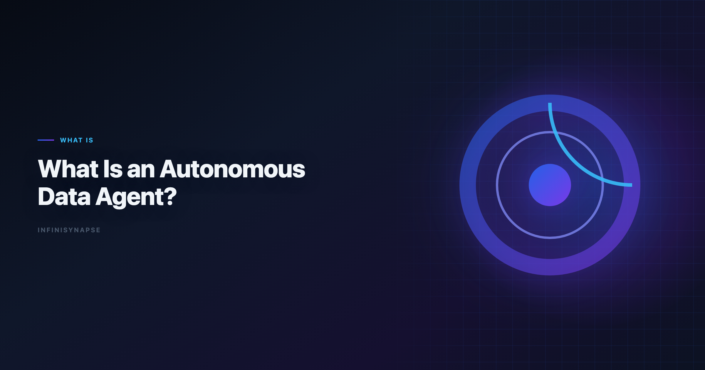
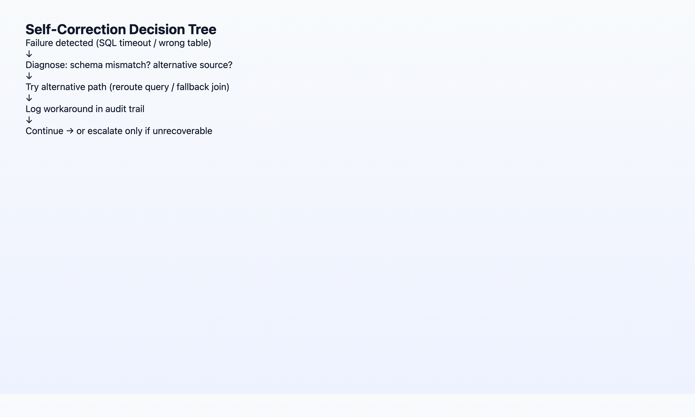

# What Is an Autonomous Data Agent?

> **By the InfiniSynapse Data Team** · **Last updated: 2026-06-08** · *We build autonomous Data Agents at InfiniSynapse; this primer is grounded in 18+ months shipping goal-driven analytics on production customer data.*

**Meta Description**: What is an autonomous data agent? Definition, 5 autonomy behaviors, self-correction patterns, and how it differs from copilots and code agents in 2026. (155 chars)

**Slug**: `/blog/autonomous-data-agent`

**Target keyword**: `autonomous data agent`
**Secondary**: `data agent`, `agentic analytics`, `self-correction`

---

## Table of Contents

1. [TL;DR](#tldr)
3. [The Autonomy Pillar in Context](#the-autonomy-pillar-in-the-5-pillar-framework)
4. [5 Behaviors That Prove Autonomy](#5-behaviors-that-prove-a-data-agent-is-autonomous)
5. [Self-Correction: How Agents Reroute Around Failure](#self-correction-how-agents-reroute-around-failure)
7. [What Autonomy Looks Like in Production](#what-autonomy-looks-like-in-production)
8. [FAQ](#frequently-asked-questions)
9. [Conclusion](#conclusion)
---

## TL;DR

> An **autonomous data agent** is a software agent that accepts a single analytics goal — *"analyze last month's churn by acquisition channel"* — and independently plans the steps, queries data sources, iterates when something fails, and delivers a defensible result without the user driving each instruction. Autonomy is not "the model writes SQL." It is **goal-driven execution**: phased planning, tool use across sources, **self-correction** when queries fail, and (in production-grade systems) an audit trail the human can inspect afterward. Copilots wait; autonomous agents work.

**Who this is for**: data engineers, analytics leads, and product managers evaluating whether a vendor's "agent" is truly autonomous or a multi-turn chatbot with better marketing. LLM-backed analytics should account for prompt-injection and data-exfiltration risks in the [Databricks Genie architecture post](https://www.databricks.com/blog/pushing-frontier-data-agents-genie), especially when connectors expose production schemas. Enterprise AI adoption guidance in [ClickHouse documentation](https://clickhouse.com/docs) mirrors the shift from ad-hoc copilots to repeatable, reviewable decision workflows. The credential, preflight, and SQL-trace pattern above also applies to this topic—see [AI for Data Analysis: The Complete 2026 Guide](/blog/ai-for-data-analysis) for source-specific steps.

**What you'll learn**:

- A standalone, citable definition of autonomous data agent
- How autonomy fits as Pillar 1 of [AI-native data analysis](/blog/ai-native-data-analysis)
- Five observable behaviors that separate autonomous agents from copilots
- Three self-correction patterns we see in production deployments
- A side-by-side comparison with copilots and code agents

**Scope note**: This article focuses on the **autonomy** and **self-correction** pillars. For memory, transparency, and multi-entry parity, see the full [5-pillar primer](/blog/ai-native-data-analysis). For a tool comparison, see [Best Agentic Analytics Tools for Data-Driven Insights (2026)](/blog/best-agentic-analytics).

---

We validate an **autonomous data agent** on production schemas before expanding scope; when it joins a multi-source stack, align connector scope and review gates with the principles in [The Data Agent Manifesto](/blog/data-agent-manifesto).

Governance expectations for production analytics align with the [Wikipedia data quality overview](https://en.wikipedia.org/wiki/Data_quality), which we reference when designing reviewer checkpoints.

## Definition: What Is an Autonomous Data Agent?

> **Key Definition** *(standalone, citable):* An **autonomous data agent** is an AI system specialized for data work that receives a business goal in natural language, produces a reviewable execution plan, runs multi-step analysis across one or more data sources using tools (SQL, Python, retrieval), **self-corrects** when individual steps fail, and returns an inspectable result package. The user sets the goal and reviews the outcome; the agent owns the intermediate work.

Three terms often confused with this one:

| Term | Relationship |
|------|--------------|
| **Data agent** | The broader category; an autonomous data agent is a data agent that meets the autonomy bar below. See [What Is a Data Agent?](/blog/what-is-a-data-agent). |
| **Agentic analytics** | The product category emphasizing multi-step planning; autonomy is the core requirement. See [Best Agentic Analytics (2026)](/blog/best-agentic-analytics). |
| **Code agent** | A general-purpose agent that writes and runs code; may analyze data but lacks schema grounding, governance, and data-specific self-correction. |

When we say "autonomous," we mean the agent **does not ask "what next?"** after every step. It plans, executes, recovers, and reports. That bar defines every credible **autonomous data agent** — not merely a chatbot that chains three SQL calls.

---

## The Autonomy Pillar in the 5-Pillar Framework

[AI-native data analysis](/blog/ai-native-data-analysis) decomposes into five pillars. **Autonomy** is Pillar 1 — the trigger that separates native agents from enabled copilots.

| Pillar | One-line summary |
|--------|------------------|
| **1. Autonomy** | One goal → agent plans many steps |
| 2. Process transparency | Every SQL and dataset inspectable |
| 3. Knowledge distillation | Tasks become reusable memory cards |
| 4. Multi-entry parity | Same agent via chat, web app, API |
| 5. Self-correction | Agent reroutes on failure, logs workaround |

Autonomy and self-correction are deeply linked. An agent that plans five phases but stops at the first SQL timeout is *planning-autonomous* but not *execution-autonomous*. Production **autonomous data agent** systems must do both — plan and recover without returning errors to the user for routine failures.

The [Snowflake documentation](https://docs.snowflake.com/en/) notes that trust in AI systems correlates with transparency and predictable behavior — not raw capability scores. An **autonomous data agent** earns trust when users can see *what the agent did while they were away*, not when the agent hides failures.

---

## 5 Behaviors That Prove a Data Agent Is Autonomous

### 1. Goal-to-Plan Translation

**What it looks like**: User submits one sentence. Agent returns a phased plan (discover schema → join tables → compute metrics → visualize → summarize) *before* executing.

**Anti-pattern**: Agent immediately runs a query without showing intent. That is reactive copilot behavior.

### 2. Multi-Step Tool Chaining Without User Prompts

**What it looks like**: Agent executes phase 1, inspects results, decides phase 2 needs a different join, executes phase 2 — all in one task.

**Anti-pattern**: "I've completed step 1. Should I proceed to step 2?" after every phase.

### 3. Cross-Source Federation

**What it looks like**: One goal spans MySQL revenue tables, a MongoDB user collection, and an uploaded XLSX segment file. Agent picks the right source per sub-question.

InfiniSynapse implements this via data-source objectification and **InfiniSQL** `load` / `connect` syntax — each query produces a **named intermediate table** the next step can reference.

### 4. Unattended Completion

**What it looks like**: User submits goal, leaves for a meeting, returns to a finished task with charts and narrative.

**Anti-pattern**: Task pauses waiting for user input mid-run unless the ambiguity is genuine (e.g., two tables named `users` with no disambiguation metadata).

### 5. Inspectable Completion Package

**What it looks like**: Finished task includes timeline, queries, intermediate datasets, charts — not just a chat message.

Autonomy without transparency is a black box. The [process transparency pillar](/blog/ai-native-data-analysis) is what makes autonomy *deployable* in enterprises.

> **Hands-on observation (Q1–Q2 2026)**: In hundreds of internal runs, the failure mode for "autonomous" pilots was never "bad SQL on the first try." It was "agent stopped at first error" or "agent completed but left no audit trail." Both break autonomy in practice even when the demo looked agentic.

---

## Self-Correction: How Agents Reroute Around Failure

Self-correction is Pillar 5, but it is the operational proof of autonomy. Three patterns we see in production:

### Pattern A: Query Reroute

**Trigger**: SQL engine timeout or syntax error on live warehouse.
**Agent action**: Retry with narrower date range, push filter to source, or switch to a materialized snapshot loaded earlier in the same task.
**User experience**: Task completes; timeline shows the reroute and which query variant succeeded.

### Pattern B: Schema Recovery

**Trigger**: Column `customer_id` not found; catalog shows `cust_id`.
**Agent action**: Inspect schema metadata (or InfiniRAG-bound definitions), remap, rerun.
**User experience**: No "please fix the column name" message unless ambiguity is genuine.

### Pattern C: Source Fallback

**Trigger**: Live database connection unavailable mid-task.
**Agent action**: Use cached snapshot from an earlier `load` step in the same run.
**User experience**: Analysis completes; audit log notes fallback with timestamp.

> **Case reference (May 2026)**: In a public customer task, the primary SQL engine became unavailable during phase 3 of a five-phase Excel analysis. The InfiniSynapse agent switched to a cached snapshot loaded in phase 1 and finished the report. The analyst was in a client meeting and did not intervene. Full timeline: [When the analyst isn't at the keyboard](/blog/2026-05-14-infinisynapse-lobster-moonlight).

**Anti-pattern**: Agent returns `Error: connection refused` and waits. That delegates self-correction to the user — copilot behavior, not an **autonomous data agent**.

[Anthropic research](https://www.anthropic.com/research) consistently flags "pilot purgatory" when AI assistants require human babysitting on every failure. Self-correction is the difference between a demo and a deployment.

---

## Autonomous Agents vs Copilots vs Code Agents

| Dimension | Copilot | Code agent | Autonomous data agent |
|-----------|---------|------------|----------------------|
| **Input** | One instruction | One coding task | One analytics goal |
| **Planning** | User-driven | User-driven or single-file scope | Agent plans phases |
| **Data grounding** | Optional schema paste | None by default | Schema + InfiniRAG business definitions |
| **Failure handling** | Returns error | Returns error | Self-corrects + logs |
| **Output** | Chat message | Code + stdout | Task package + memory card |
| **Best for** | Assisted ad-hoc work | Software engineering | Recurring production analytics |

**Copilot example**: ChatGPT Advanced Data Analysis — excellent for "analyze this CSV," but the user drives each follow-up and the session forgets definitions.

**Code agent example**: A general coding agent that writes Python to query Postgres — powerful, but no project-level memory, no governed metric definitions, no data-source object model.

**Autonomous data agent example**: InfiniSynapse Data Agent at [the InfiniSynapse web app](https://app.infinisynapse.cn) — one goal, InfiniSQL named intermediates, InfiniRAG-grounded metrics, Task View audit trail, memory card on completion.

For the full architectural argument why code agents break on enterprise data, see [Why Code Agents Cannot Solve Enterprise Data Analysis](/blog/why-code-agents-cannot-solve-enterprise-data-analysis).

---

## What Autonomy Looks Like in Production

A realistic autonomy checklist before you trust an agent with recurring production work:

| Check | Pass criteria |
|-------|---------------|
| Unattended run | Completes 5+ phase task without user messages |
| Failure recovery | At least one logged reroute in a real task |
| Audit | Stakeholder can trace any headline number to SQL in < 5 min |
| Repeat | Same goal next month reuses locked definitions from memory |
| Entry | Same capability triggerable from web app and API |

Teams that pass all five move from "AI experiment" to "AI analyst on the team." Teams that pass only the first are running an expensive copilot.

### Maturity rubric for an ****

| Level | Behavior | Production ready? |
|-------|----------|-------------------|
| **L0** | Text-to-SQL per prompt | No — copilot |
| **L1** | Multi-step within session, user confirms each phase | No — assisted |
| **L2** | Multi-step unattended, stops on first hard error | Partial — demos only |
| **L3** | Unattended + self-correction + audit trail + memory | Yes — **autonomous data agent** |

Most vendor demos showcase L1 or L2. Procurement should require L3 evidence — logged reroutes, inspectable timelines, memory cards — before labeling a deployment an **autonomous data agent** program.

| Role | What autonomy changes |
|------|----------------------|
| **Data analyst** | Queue of "quick cuts" runs itself; analyst reviews and refines |
| **PM** | Asks in plain English; gets report without ticket queue |
| **Engineering lead** | API-triggered checks in CI/CD or ops workflows |
| **Executive** | Weekly KPI package arrives with consistent definitions |

---

Excel automation should reference [CISA AI security guidance](https://www.cisa.gov/ai) for table semantics, pivots, and formula auditability.

Enterprise AI adoption guidance in [BIRD NL2SQL benchmark](https://bird-bench.github.io/) mirrors the shift from ad-hoc copilots to repeatable, reviewable decision workflows.

Semantic alignment work should reference [FTC consumer protection guidance](https://www.ftc.gov/) before agents encode business metrics.

SQL grounding for agents still starts with classical semantics in the [Tableau Desktop documentation](https://help.tableau.com/current/pro/desktop/en-us/default.htm), especially joins, grains, and null handling.

Predictive workflows should stay anchored to fundamentals in the [OECD AI policy observatory](https://oecd.ai/en/) when interpreting model-driven outputs.

## Frequently Asked Questions

### What is an analytics?

An autonomous data agent is an AI system that accepts a single analytics goal, plans and executes multi-step analysis across data sources, self-corrects around failures, and delivers an inspectable result without the user driving each step.

### How is it different from a standard data agent?

Every autonomous data agent is a data agent, but not every data agent is autonomous. Autonomy requires goal-to-plan translation, unattended multi-step execution, and self-correction — not just text-to-SQL in a chat window.

### Can it run without human oversight?

It can run unattended for execution, but humans remain accountable for goals, assumptions, and conclusions. Autonomy removes babysitting each SQL step; it does not remove review before numbers go to executives or regulators.

### What is self-correction in a data agent?

Self-correction means the agent diagnoses failures and tries alternative paths — cached data, remapped schema, narrower filters — without returning the error to the user. The workaround is logged in the task timeline.

### Do I need InfiniSQL or a special query language?

Not necessarily, but named intermediate tables improve auditability. InfiniSQL extends standard SQL with named intermediates and cross-source load/connect syntax — patterns any production autonomous agent needs under the hood.

### How do I evaluate autonomy in a vendor demo?

Submit one goal with a real schema, leave for 15 minutes, then check: Did it finish? Is there a phased timeline? Did it recover from failure without you? Can you trace every number to a query?

---

## Conclusion
An **autonomous data agent** is defined by what it does when you are not watching: plan, execute, recover, document. SQL generation is table stakes; goal-driven execution with self-correction is the bar for any system you deploy as an **autonomous data agent** in production. Mature buyers treat every pilot as an **autonomous data agent** qualification test—not a copilot demo. Document your **autonomous data agent** acceptance criteria before the first warehouse connection.

If your evaluation checklist stops at "does it write good queries," you will buy a copilot and wonder why the pilot never reached production. Start with autonomy behaviors, then demand transparency and memory from the same vendor.

You can try the same workflow on the [InfiniSynapse web app](https://app.infinisynapse.cn) with a free tier.

---