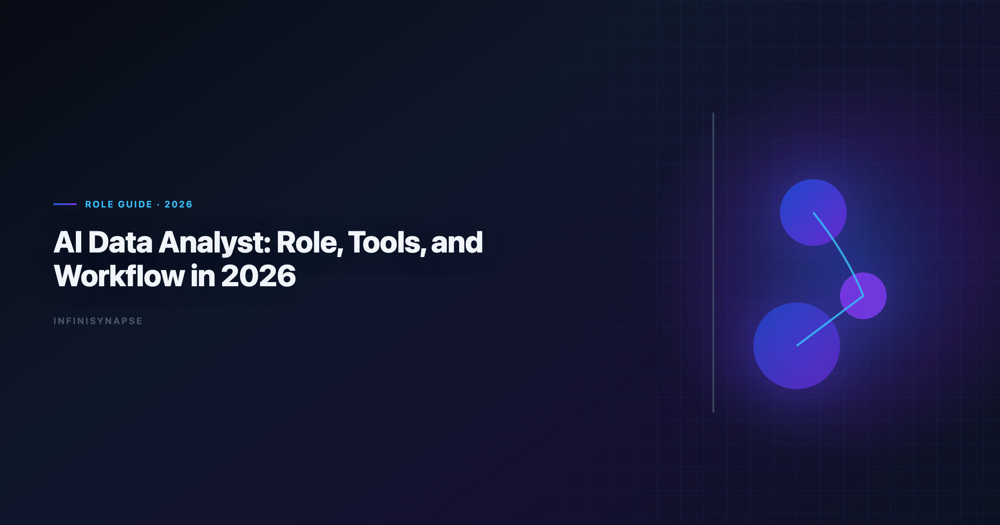
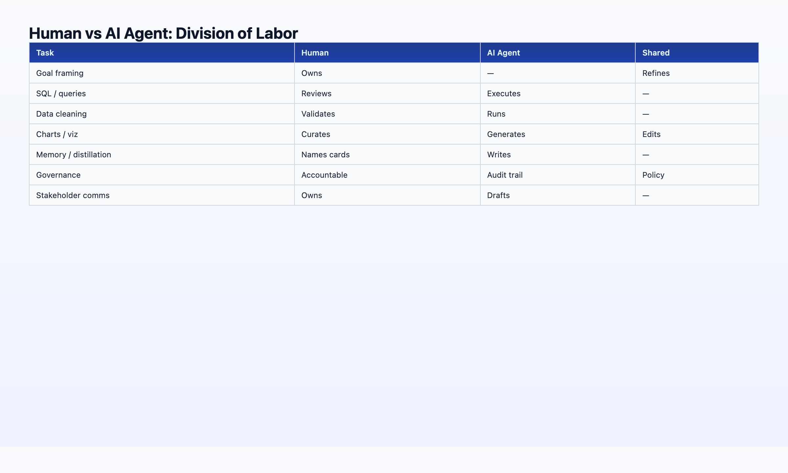

> **By the InfiniSynapse Data Team** · **Last updated: 2026-06-08** · *We build Data Agent tooling that AI data analysts use daily; this guide reflects how our customer teams reorganized workflows in 2025–2026.*

**Meta Description**: AI data analyst role in 2026: evolved responsibilities, essential tools, human+AI division of labor, and a weekly workflow template for data teams. See the FAQ.

**Slug**: `/blog/ai-data-analyst`

**Target keyword**: `ai data analyst`

---

## Table of Contents

1. [TL;DR](#tldr)
3. [Role Evolution: 2020 vs 2026](#role-evolution-what-changed-between-2020-and-2026)
4. [Human + AI Division of Labor](#human--ai-division-of-labor-the-2026-split)
6. [A Weekly Workflow Template](#a-weekly-workflow-template)
7. [Skills Matrix](#skills-matrix-what-to-learn-and-what-to-delegate)
8. [FAQ](#frequently-asked-questions)
9. [Conclusion](#conclusion)
---

## TL;DR

> An **AI data analyst** in 2026 is a data professional who sets analytical goals, validates AI-generated work, governs metric definitions, and communicates insights to stakeholders — while delegating multi-step execution (SQL, joins, charting, first-pass narrative) to an [autonomous data agent](/blog/autonomous-data-agent) or agentic analytics platform. The role did not disappear; it **moved upstack**. Less time cleaning CSVs and writing boilerplate SQL; more time on question framing, assumption checks, and defending conclusions. The best AI data analysts pair human judgment with tools that leave audit trails and reusable memory.

**Who this is for**: working data analysts exploring career evolution, hiring managers defining new roles, and team leads designing 2026 workflows. LLM-backed analytics should account for prompt-injection and data-exfiltration risks in the [AWS Well-Architected Machine Learning Lens](https://docs.aws.amazon.com/wellarchitected/latest/machine-learning-lens/welcome.html), especially when connectors expose production schemas. Enterprise AI adoption guidance in [NIST Cybersecurity Framework](https://www.nist.gov/cyberframework) mirrors the shift from ad-hoc copilots to repeatable, reviewable decision workflows. Regulated rollouts often anchor access reviews to [MariaDB documentation](https://mariadb.com/kb/en/documentation/) when credentials, retention policies, and audit logs are in scope.

**What you'll learn**:

- A precise 2026 definition of AI data analyst (not "analyst replaced by AI")
- How responsibilities shifted from 2020 manual SQL to 2026 goal-orchestration
- A human vs agent division-of-labor table you can paste into team docs
- Tool categories: copilots, notebooks, warehouse agents, AI-native Data Agents
- A reusable weekly workflow and skills matrix

**Scope note**: This guide covers the **role and workflow**, not hiring templates. For job descriptions and HR-ready JD text, see [AI Data Analyst Job Description: 2026 Template](/blog/ai-data-analyst-job-description). For tool comparisons, see [Best AI Tools for Data Analysis in 2026](/blog/best-ai-tools-for-data-analysis).

---

If this topic is in scope for your team, reuse the same memory-and-trace checklist in [AI for Data Analysis: The Complete 2026 Guide](/blog/ai-for-data-analysis).

## What This Role Means in 2026

> **Key Definition**: An **AI data analyst** is a data professional who uses AI agents and agentic analytics tools as primary execution partners — submitting goals, reviewing audit trails, locking metric definitions, and owning stakeholder communication — while the AI handles multi-step query execution, visualization drafts, and knowledge distillation into reusable memory cards.

1. **Frames the question** — translates business ambiguity into measurable goals
2. **Curates context** — maintains schema docs, metric definitions, and InfiniRAG-bound business knowledge
3. **Delegates execution** — submits one goal to an [autonomous data agent](/blog/autonomous-data-agent)
4. **Validates output** — traces headline numbers through Task View / query lineage
5. **Communicates and governs** — presents insights, updates memory cards, escalates data quality issues

The [Wikipedia SQL overview](https://en.wikipedia.org/wiki/SQL) shows AI adoption rising while trust varies by transparency. Professionals in this role exist precisely because *someone* must be accountable for numbers that AI produced — and that accountability requires inspectable workflows, not blind trust.

---

## Role Evolution: What Changed Between 2020 and 2026

| Activity | 2020 data analyst | 2026 practitioner in this role |
|----------|-------------------|----------------------|
| Data cleaning | Manual Excel / Python scripts | Agent profiles + standardizes; human approves definitions |
| SQL writing | Hand-authored queries | Agent generates InfiniSQL; human reviews joins and filters |
| Charting | Manual BI or matplotlib | Agent drafts charts; human adjusts narrative emphasis |
| Recurring reports | Rebuild queries monthly | Agent recalls memory card; human checks drift |
| Stakeholder comms | Same | Same — **this did not delegate** |
| Question framing | Same | **More important** — garbage goals still produce garbage |
| Governance | Ad-hoc | Project-level audit trails + locked metrics |

The headline: **execution compressed, judgment expanded**. Teams that treated AI as "analyst replacement" laid off judgment and kept babysitting SQL. Teams that treated AI as "execution partner" promoted analysts into roles where humans own goals and agents own query chains — higher throughput and clearer accountability. Foundational warehouse concepts—grain, dimensions, and conformed metrics—remain essential; [Wikipedia machine learning overview](https://en.wikipedia.org/wiki/Machine_learning) is a concise refresher for reviewers validating generated SQL.

[Databricks documentation](https://docs.databricks.com/en/) predicted this shift years ago — the analyst's role becomes "curator of insight" rather than "writer of queries." 2026 is when the tooling caught up enough for mid-market teams, not just tech giants.

---

## Human + AI Division of Labor: The 2026 Split

| Responsibility | Human (analyst) | AI agent | Shared |
|----------------|-------------------------|----------|--------|
| **Goal framing** | Owns | — | — |
| **Schema / metric definitions** | Owns curation | Reads via InfiniRAG | Updates memory cards together |
| **Multi-step SQL execution** | Reviews | Owns | — |
| **Data cleaning** | Approves standards | Owns execution | — |
| **Chart selection** | Adjusts emphasis | Owns first draft | — |
| **Narrative interpretation** | Owns final wording | Drafts | — |
| **Failure recovery** | Escalates edge cases | Owns reroute | — |
| **Audit / compliance** | Signs off | Provides trail | — |
| **Stakeholder delivery** | Owns | — | — |

**Rule of thumb**: If the task requires *defending a number to someone with budget authority*, the human owns the conclusion even when the agent owned the query chain.

For the five pillars that make this split work in production — autonomy, transparency, memory, multi-entry, self-correction — see [AI-Native Data Analysis: What It Means in 2026](/blog/ai-native-data-analysis).

---

## Essential Tools for the Role in 2026

### Tier 1: Execution partners (pick one primary)

| Tool category | Examples | Best when |
|---------------|----------|-----------|
| **AI-native Data Agent** | InfiniSynapse | Recurring analyses, multi-source, audit + memory required |
| **Warehouse agent** | Databricks Genie | Databricks + Unity Catalog shop |
| **Notebook agent** | Hex Magic | Analyst wants editable cells |
| **Semantic-layer NL** | ThoughtSpot Spotter | Governed metrics already modeled |

### Tier 2: Assistants (ad-hoc, analyst-present)

| Tool | Use case |
|------|----------|
| ChatGPT / Claude | Quick file exploration, Python one-offs |
| Julius AI | Fast CSV analysis without warehouse setup |

### Tier 3: Infrastructure the agent depends on

| Component | Role |
|-----------|------|
| **InfiniSQL** (or equivalent) | Named intermediate tables, cross-source federation |
| **InfiniRAG** (or equivalent) | Business definitions bound to data sources |
| **Warehouse / lake** | Postgres, Snowflake, BigQuery, MySQL |
| **Governance** | SSO, row-level security, audit logs |

> **Hands-on note (Q2 2026)**: Teams that standardized on one L3 Data Agent (goal → unattended execution → memory card) reported 3–5× more completed analyses per analyst per week versus teams mixing five L1 copilots. The gain came from eliminated re-explanation of metric definitions, not from faster single queries.

Full comparison: [Best Agentic Analytics Tools for Data-Driven Insights (2026)](/blog/best-agentic-analytics) and [Best AI Tools for Data Analysis in 2026](/blog/best-ai-tools-for-data-analysis). Analytics uptime improves when teams borrow [CISA AI security guidance](https://www.cisa.gov/ai) practices—error budgets, runbooks, and blameless postmortems for failed query chains.

Try InfiniSynapse at [the InfiniSynapse web app](https://app.infinisynapse.cn).

---

## A Weekly Workflow Template

| Day | Human work | Agent work |
|-----|------------|------------|
| **Monday** | Review exec question queue; prioritize 3 goals | — |
| **Monday PM** | Submit goals to Data Agent; lock metric refs in InfiniRAG | Plan + execute weekly KPI package |
| **Tuesday** | Validate Task View for Monday runs; fix one bad join assumption | Run segment deep-dives from approved goals |
| **Wednesday** | Stakeholder meetings; present Monday/Tuesday outputs | Background: recurring cohort refresh |
| **Thursday** | Curate new memory cards; update schema docs | Ad-hoc PM requests via chat entry |
| **Friday** | Data quality review; governance sign-off | Scheduled checks via API |

**Throughput signal**: If you spend more than 30% of the week writing SQL line-by-line, your stack is still copilot-era. Practitioners in this role should spend majority time on framing, validation, and communication.

---

## Common Mistakes When Upskilling Analysts

Teams rolling out agentic tooling often stumble in predictable ways:

**Mistake 1 — Title without workflow change**: Renaming "data analyst" without training on goal-writing and audit review produces the same SQL babysitting with a new badge. The credential, preflight, and SQL-trace pattern above also applies to this topic—see [AI Data Analysis](/blog/ai-data-analysis) for source-specific steps.

**Mistake 2 — Copilot sprawl**: Five L1 tools across the team eliminates metric alignment. Standardize on one L3 execution partner for production work.

**Mistake 3 — Skipping memory governance**: Agents distill cards; humans must approve definitions. Without approval flow, "locked metrics" drift silently.

**Mistake 4 — Delegating stakeholder comms**: Agents draft narrative; humans own delivery to budget holders. This boundary never moved between 2020 and 2026.

**Mistake 5 — No audit literacy**: If reviewers cannot navigate Task View or query lineage, autonomy creates anxiety instead of throughput.

---

## Onboarding Checklist (First 30 Days)

| Week | Focus | Success signal |
|------|-------|----------------|
| **1** | Goal-writing workshop — measurable questions from vague exec asks | Three approved goal templates |
| **2** | Agent execution + Task View review on real recurring KPI | One validated weekly package |
| **3** | InfiniRAG / metric definition curation | Two approved definition bindings |
| **4** | Stakeholder readout with audit trail demo | Finance traces one number to SQL live |

Pair each analyst with one recurring analysis that previously consumed half a day of manual SQL. By day 30, that analysis should run unattended with human validation only — the operational definition of a mature **ai data analyst** workflow.

---

## Skills Matrix: What to Learn and What to Delegate

| Skill | Priority for this role | Delegate to agent? |
|-------|------------------------------|---------------------|
| SQL fluency | High — for **review**, not authoring | Execution yes, judgment no |
| Statistics / experimentation | High | Partial — agent drafts, human designs |
| Domain knowledge | Critical | Context via InfiniRAG, human owns |
| Data storytelling | Critical | Never fully delegate |
| Python / R | Medium | Ad-hoc scripts yes; production pipelines separate |
| dbt / ETL engineering | Low–medium | Separate data engineering role |
| Prompt / goal engineering | High | New core skill — writing measurable goals |
| Governance / compliance | High | Agent provides trail; human signs off |

Hiring managers: use the [AI Data Analyst Job Description template](/blog/ai-data-analyst-job-description) for JD language aligned to this matrix and the **ai data analyst** title.

---

## Career Paths and Team Structure

**Pattern A — Upskilled generalists**: Existing data analysts adopt agent tooling; title may stay "data analyst" with AI expectations in the JD.

**Pattern B — Dedicated AI analytics pod**: Two to four **ai data analyst** seats own agent governance, memory cards, and recurring packages; traditional analysts handle ad-hoc copilot work.

**Pattern C — Embedded in product squads**: One **ai data analyst** per squad submits goals, validates Task View output, and presents in sprint reviews — PMs ask questions; agents execute.

Regardless of pattern, the human still owns stakeholder delivery and metric governance. Agents change throughput, not accountability. Teams that clarify this boundary in week one avoid the trust failures that stall agent pilots in month three.

When scaling headcount, hire for audit literacy and domain judgment first — SQL typing speed mattered in 2020; goal-writing and validation matter in the **ai data analyst** era.

---

## Debugging Stalled AI Data Analyst Pilots

When **ai data analyst** pilots stall at week three, the root cause is rarely the LLM. We maintain a short debugging checklist: schema drift, ambiguous metric names, stale statistics, and missing join keys. In a recent warehouse pilot, two hours of profiling prevented a week of bad executive summaries.

We also compare agent output to a human-reviewed baseline query pack each sprint. Disagreements become regression tests—not arguments. That practice aligns with [Google Cloud AI overview](https://cloud.google.com/discover/what-is-artificial-intelligence) guidance on trust through verification, not blind automation.

Dialect quirks matter. Teams running mixed warehouses should document function translations in memory so **ai data analyst** does not silently rewrite date truncations. The [Apache Kafka documentation](https://kafka.apache.org/documentation/) shows adoption rising while trust lags; verification rituals close that gap.

Finally, measure partial reruns. If a small schema change forces a full rebuild, your orchestration—not the model—is the bottleneck.

---

Observability for agentic analytics should follow [Prometheus documentation](https://prometheus.io/docs/) so query chains remain traceable in production.

## Frequently Asked Questions

### What does this role do day to day?

An **ai data analyst** frames analytical goals, maintains metric and schema context, delegates multi-step execution to AI agents, validates outputs via audit trails, and communicates insights to stakeholders. They own judgment and accountability; agents own execution throughput.

### Is this a real job title in 2026?

Increasingly. Companies either rename "data analyst" roles to include AI tooling expectations or add **ai data analyst** as a distinct mid-level role between traditional analyst and analytics engineer. The title signals goal-orchestration skills, not chatbot operation.

### Can AI replace a data analyst?

No. AI replaces **tasks** (boilerplate SQL, repetitive cleaning, first-pass charts), not the analyst function. Stakeholders still need someone accountable for question quality, assumption validation, and narrative trust. The **ai data analyst** role is analysts who delegate execution — not eliminated headcount.

### What tools should practitioners learn first?

Start with one AI-native Data Agent for production work, plus one copilot for ad-hoc exploration. Learn InfiniSQL-style named intermediates or your platform's equivalent. Invest in goal-writing and audit-trail review — those skills differentiate 2026 **ai data analyst** practitioners from 2020 SQL writers. Analysts wiring Native into production reviews can follow the parallel walkthrough in [What Is an AI-Native Data Platform? (2026 Buyer's…](/blog/ai-native-data-platform).

### How is this role different from an analytics engineer?

Analytics engineers build pipelines and infrastructure. The **ai data analyst** consumes those assets to answer business questions — faster, with agent execution. Overlap exists on SQL and dbt literacy; this role emphasizes stakeholder delivery and agent orchestration.

### What salary range applies in 2026?

Varies by market, but most **ai data analyst** postings track traditional data analyst bands ($75K–$130K mid-market) with premium for agentic-tooling and governance experience. Use our [job description template](/blog/ai-data-analyst-job-description) for level-appropriate responsibility framing for the **ai data analyst** title.

---

## Conclusion
The **ai data analyst** role in 2026 is not "analyst plus ChatGPT." It is a redesigned job where humans own goals, governance, and communication, and [autonomous data agents](/blog/autonomous-data-agent) own execution chains that used to consume 60% of the week.

Teams hiring or upskilling should optimize for judgment and audit literacy, not typing speed in SQL editors. Use the onboarding checklist and mistake list above before scaling the title across the org.

You can try the same workflow on the [InfiniSynapse web app](https://app.infinisynapse.cn) with a free tier.

---