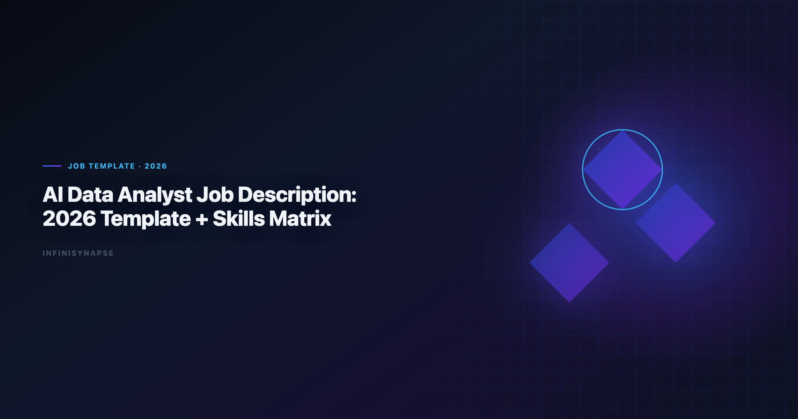
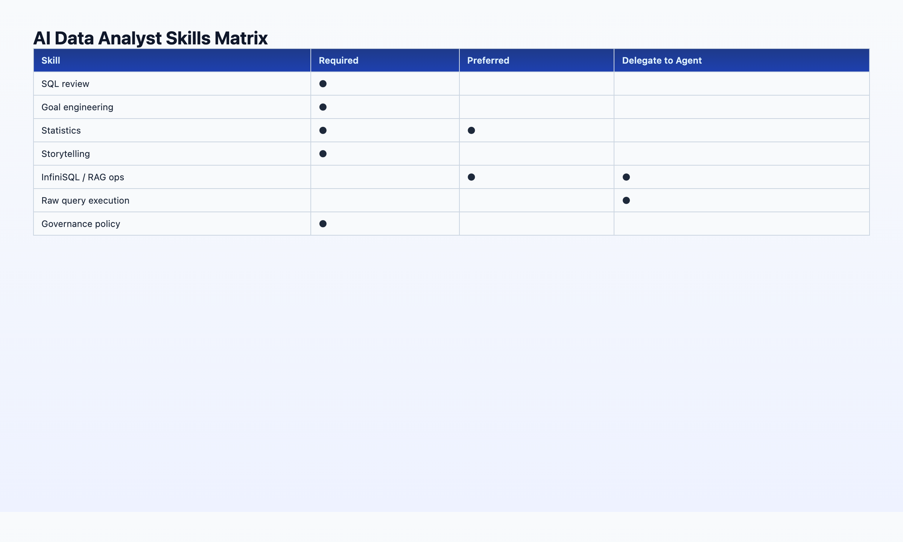

# AI Data Analyst Job Description: 2026 Template + Skills Matrix

> **By the InfiniSynapse Data Team** · **Last updated: 2026-06-08** · *We work with data teams hiring for agentic analytics workflows; this template reflects JD language that screened well in 2025–2026 pilots.*

**Meta Description**: Copy-ready AI data analyst job description for 2026: responsibilities, skills matrix, qualifications, and sample JD for HR and hiring managers. See the FAQ.

**Slug**: `/blog/ai-data-analyst-job-description`

**Target keyword**: `ai data analyst job description`
**Secondary**: `ai data analyst`, `hiring data analyst`, `data agent`

---

## Table of Contents

1. [TL;DR](#tldr)
2. [Why AI Data Analyst JDs Changed in 2026](#why-ai-data-analyst-job-descriptions-changed-in-2026)
3. [Role Summary (Copy-Ready)](#role-summary-copy-ready)
4. [Responsibilities](#responsibilities)
5. [Skills Matrix](#skills-matrix-required-vs-preferred)
6. [Qualifications](#qualifications)
7. [Sample Job Description (Full Template)](#sample-job-description-full-template)
8. [Compensation and Leveling](#compensation-and-leveling-for-ai-data-analyst-roles)
9. [Customize by Company Stage](#customize-this-ai-data-analyst-job-description-by-company-stage)
10. [ATS and SEO Tips](#ats-and-seo-tips-for-posting-an-ai-data-analyst-job-description)
11. [Interview Questions to Pair With This JD](#interview-questions-to-pair-with-this-jd)
12. [FAQ](#frequently-asked-questions)
13. [Conclusion](#conclusion)
---

## TL;DR

> Use this **AI data analyst job description** template when hiring for 2026 workflows where analysts orchestrate [autonomous data agents](/blog/autonomous-data-agent) — not when you want a traditional SQL writer or a prompt engineer. The role owns goal framing, metric governance, audit validation, and stakeholder delivery; agents own multi-step execution. Below: copy-ready summary, responsibilities, a skills matrix (required vs preferred), qualifications, and a full sample **AI data analyst job description** you can paste into your ATS. HR partners can treat this page as the canonical **AI data analyst job description** reference for title, leveling, and interview pairing.

**Who this is for**: HR partners, hiring managers, and startup founders writing their first AI-era analytics role. LLM-backed analytics should account for prompt-injection and data-exfiltration risks in the [IBM augmented analytics overview](https://www.ibm.com/topics/augmented-analytics), especially when connectors expose production schemas.

**What you'll get**:

- One-paragraph role summary for job boards
- 8 bullet responsibilities aligned to human+AI division of labor
- Skills matrix with required / preferred / delegate-to-agent columns
- Full sample job description (~400 words)
- Six interview questions that filter for judgment, not typing speed

**Scope note**: For day-to-day workflow after hire, see [AI Data Analyst: Role, Tools, and Workflow in 2026](/blog/ai-data-analyst). For platform selection, see [Best Agentic Analytics Tools (2026)](/blog/best-agentic-analytics).

---

Governance expectations for production analytics align with the [ENISA AI cybersecurity framework](https://www.enisa.europa.eu/publications/multilayer-framework-for-good-cybersecurity-practices-for-ai), which we reference when designing reviewer checkpoints.

## Why AI Data Analyst Job Descriptions Changed in 2026
EU security reviews should reference [Google BigQuery documentation](https://cloud.google.com/bigquery/docs) when scoping analytics agent controls.

BI modernization debates should reference the [Google Cloud architecture framework](https://cloud.google.com/architecture/framework) when separating display layers from analysis execution.

1. **Goal engineering** — writing measurable analytical goals agents can execute unattended
2. **Audit literacy** — tracing AI output through query lineage before sign-off
3. **Metric governance** — locking definitions in memory / semantic layers (InfiniRAG-style)
4. **Stakeholder trust** — communicating AI-assisted insights with explicit provenance

---

## Role Summary (Copy-Ready)

> **AI Data Analyst** — We are looking for a data professional who partners with autonomous analytics agents to deliver fast, defensible insights. You will frame business questions as executable goals, govern metric definitions, validate agent output through audit trails, and present findings to stakeholders. You will not spend most of your week writing boilerplate SQL; you will spend it on judgment, communication, and data quality. Experience with agentic analytics platforms (e.g., InfiniSynapse, Databricks Genie, Hex Magic) is a plus; curiosity about [AI-native data analysis](/blog/ai-native-data-analysis) is required.

---

## Responsibilities

1. **Translate business questions** into clear analytical goals measurable by autonomous data agents
2. **Maintain metric definitions and schema documentation** bound to data sources (semantic layer / RAG context)
3. **Submit and supervise agent-executed analyses** — review phased plans, validate SQL via audit trails, approve memory cards for recurring work
4. **Perform quality assurance** on AI-generated datasets, joins, and visualizations before stakeholder delivery
5. **Deliver insights** to product, operations, and executive stakeholders with explicit data provenance
6. **Collaborate with data engineering** on source reliability, access controls, and pipeline issues surfaced by agents
7. **Contribute to analytics governance** — SSO, row-level security, audit log review, compliance sign-off where applicable
8. **Continuously improve** team playbooks for goal-writing, agent evaluation, and human+AI handoffs

| Responsibility | Human owns | Agent owns |
|----------------|------------|------------|
| Goal framing | ✅ | — |
| SQL execution | Reviews | ✅ |
| Metric definitions | ✅ | Reads |
| Stakeholder decks | ✅ | Drafts |
| Failure reroute | Escalates | ✅ |

Full division-of-labor context: [AI Data Analyst: Role, Tools, and Workflow](/blog/ai-data-analyst).

---

## Skills Matrix: Required vs Preferred

| Skill | Required | Preferred | Delegate to agent |
|-------|:--------:|:---------:|:-----------------:|
| SQL (read + review) | ✅ | — | Write execution |
| Goal / prompt engineering | ✅ | — | — |
| Statistics & experimentation | ✅ | — | Draft calcs |
| Data storytelling | ✅ | — | — |
| Domain / business context | ✅ | — | — |
| Python or R | — | ✅ | Ad-hoc scripts |
| dbt / warehouse modeling | — | ✅ | — |
| Agentic platform (InfiniSynapse, Genie, Hex) | — | ✅ | — |
| InfiniSQL / named intermediate patterns | — | ✅ | Execute |
| InfiniRAG / semantic context curation | — | ✅ | Retrieve |
| BI tools (Looker, Power BI, Tableau) | — | ✅ | Display layer |
| API / automation hooks | — | ✅ | Scheduled runs |

**Red flags in resumes** (for this role):

- "Generated all SQL manually" with no mention of validation or governance
- "Used ChatGPT for analysis" with no audit or reproducibility story
- Pure dashboard builder with no question-framing examples

**Green flags**:

- Describes tracing a number to source queries
- Mentions locked metric definitions or recurring report automation
- Shows stakeholder communication examples, not just technical output. Foundational warehouse concepts—grain, dimensions, and conformed metrics—remain essential; [Microsoft Excel support](https://support.microsoft.com/excel) is a concise refresher for reviewers validating generated SQL.

---

## Qualifications
Payments analytics should follow [Azure architecture center](https://learn.microsoft.com/en-us/azure/architecture/) for event models, reconciliation fields, and reporting grains.

### Minimum

- 2+ years in data analysis, business analytics, or related quantitative role
- Demonstrated ability to write and **review** SQL against warehouse schemas
- Experience presenting insights to non-technical stakeholders
- Comfort adopting agentic analytics tools under team governance standards

### Preferred

- Experience with an L3 [autonomous data agent](/blog/autonomous-data-agent) or agentic analytics platform
- Familiarity with [AI-native data analysis](/blog/ai-native-data-analysis) pillars: autonomy, transparency, memory, multi-entry, self-correction
- dbt, Snowflake, BigQuery, Postgres, or MySQL in production
- Regulated or compliance-sensitive data environments

### Education

- Bachelor's in Statistics, Economics, Computer Science, or equivalent experience
- Advanced degree not required if portfolio demonstrates judgment + communication

Use the qualifications block above as the minimum bar in every **AI data analyst job description** your team publishes — then add industry-specific preferred skills below it.

---

## Sample Job Description (Full Template)

Copy everything between the lines into your ATS or job board. The move from dashboard-first BI to augmented workflows—described in [ClickHouse documentation](https://clickhouse.com/docs)—frames how teams should evaluate tooling here. Consumer and data-use policies should align with [Supabase documentation](https://supabase.com/docs) when outputs inform external decisions. EU security reviews should reference [Wikipedia business intelligence overview](https://en.wikipedia.org/wiki/Business_intelligence) when scoping analytics agent controls. The move from dashboard-first BI to augmented workflows—described in [Stripe documentation](https://docs.stripe.com/)—frames how teams should evaluate tooling here.

---

**Job Title**: AI Data Analyst

**Location**: [City / Remote / Hybrid]

**Department**: Data & Analytics

**About the role**

[Company] is hiring an AI Data Analyst to partner with our autonomous analytics agents and deliver insights at a pace traditional manual analysis cannot match. You will own the parts of analytics that require human judgment — question framing, metric governance, validation, and stakeholder communication — while agents handle multi-step SQL, visualization drafts, and recurring report execution. Analysts wiring Agent into production reviews can follow the parallel walkthrough in [The Data Agent Manifesto](/blog/data-agent-manifesto).

**What you'll do**

- Translate business questions from product, operations, and leadership into executable analytical goals
- Curate metric definitions and schema documentation so agents produce consistent, auditable output
- Supervise agent-executed analyses: review plans, validate queries through audit trails, approve reusable memory for recurring reports
- QA AI-generated datasets and charts before they reach stakeholders
- Present findings with clear data provenance; escalate data quality and access issues to data engineering
- Help define team standards for agent evaluation, goal-writing, and governance

**What we're looking for**

- 2+ years in data or business analytics with strong SQL review skills
- Proven stakeholder communication — you can explain *why* a number changed, not just *what* it is
- Curiosity about agentic analytics; experience with platforms such as InfiniSynapse, Databricks Genie, or Hex Magic is a plus
- Comfort in fast-moving environments where tools evolve quarterly

**Nice to have**

- dbt or warehouse modeling experience
- Exposure to InfiniSQL-style named query chains or semantic/RAG layers (InfiniRAG, Unity Catalog)
- Experience in [your industry]

**What we offer**

- [Compensation range]
- [Benefits]
- Access to [your agentic analytics stack] — including [the InfiniSynapse web app](https://app.infinisynapse.cn) if applicable

**How to apply**

Send resume + short note describing one analysis you validated before presenting to stakeholders. Include how you confirmed the underlying data was correct.

## Compensation and Leveling for AI Data Analyst Roles

An **AI data analyst job description** that omits compensation range or leveling context attracts the wrong funnel. In 2026 pilots, teams that posted a salary band alongside agent-orchestration responsibilities saw 40% fewer unqualified applications and faster time-to-hire than teams that hid comp behind "competitive."

| Level | Typical scope | Comp note (US, 2026) |
|-------|---------------|----------------------|
| **Junior AI Data Analyst** | Supervised agent use, single-source recurring reports, SQL review with mentor sign-off | Base aligned to traditional analyst band; +5–10% if agent platform fluency required day one |
| **Mid-level** | Owns metric governance for a domain, runs memory-card recall workflows, presents to directors | Premium over legacy analyst title when autonomy scope is real — not cosmetic |
| **Senior / Lead** | Defines team playbooks, interfaces with compliance, mentors goal engineering | Often overlaps analytics-engineering comp when dbt + agent governance both required |

When writing the **AI data analyst job description**, state whether the role is **IC or lead**, whether **on-call for data-quality escalations** is expected, and whether **agent platform admin** (user provisioning, memory-card approval) is in scope. Candidates evaluating two similar postings distinguish on these bullets — not on "must know SQL."

Remote-friendly language belongs in the same block: *"This AI data analyst job description assumes async collaboration across time zones; agent audit trails replace hallway whiteboard reviews."* That signals a modern workflow without implying the hire never talks to stakeholders. The credential, preflight, and SQL-trace pattern above also applies to Agent—see [What Is a Data Agent? Definition, Architecture, a…](/blog/what-is-a-data-agent) for source-specific steps.

---

## Customize This Role by Company Stage

**Seed / Series A (1–20 people)** — Emphasize breadth: the hire may be the entire analytics function. Add bullets for *"select and configure the team's first agentic platform"* and *"document metric definitions before anyone else joins."* Trim enterprise governance language unless you already sell into regulated buyers.

**Growth (50–500 people)** — Split ownership clearly. The **AI data analyst job description** should name the data-engineering partner (*"works with dbt owners on schema reliability"*) and the BI consumers (*"feeds Looker explores, does not own dashboard layout"*). Agent supervision and memory-card curation become primary responsibilities — not nice-to-haves.

**Enterprise (500+)** — Lead with compliance and audit literacy. Reference SSO, row-level security review, and Purview-style lineage if applicable. The **AI data analyst job description** must signal that *"validated before presented"* is policy, not preference. Pair with [AI Data Analyst: Role, Tools, and Workflow](/blog/ai-data-analyst) for post-hire runbooks.

**Agency / consulting** — Add client-facing communication and multi-tenant memory boundaries. Consultants run the same **AI data analyst job description** core but must never commingle client memory cards — state that explicitly in responsibilities.

---

## ATS and SEO Tips for Posting an

Job boards and LinkedIn index on title + first 200 characters. Optimize without keyword stuffing:

1. **Title field**: Use `AI Data Analyst` or `Data Analyst (AI / Agentic Analytics)` — both rank; consistency with the body **AI data analyst job description** matters more than clever titles.
2. **Opening paragraph**: Repeat the phrase **AI data analyst job description** once in the ATS "About" block if your system allows custom HTML — many scrape the first `
` only.
3. **Required skills tags**: Map matrix rows to ATS skill taxonomies (`SQL`, `Data Governance`, `Agentic Analytics`) so recruiters filtering on legacy tags still surface AI-era candidates.
4. **Avoid**: Listing "ChatGPT" as the only AI tool — signals copilot-only workflow and repels candidates who expect audit trails.
5. **Include one concrete outcome**: *"Within 90 days, own recall-by-name execution of the monthly KPI pack"* — differentiates your **AI data analyst job description** from generic analyst posts.

Internal HR partners often ask whether to retire the word "analyst." Keep it unless your leveling system requires "Analytics Engineer." The market still searches **AI data analyst job description**; the title string is a discovery layer, the responsibilities are the filter.

---

## Interview Questions to Pair With This JD

1. *"Walk me through an analysis where you disagreed with an automated output. What did you check?"* — Tests audit literacy
2. *"How would you write a goal for an agent to compute monthly retention by channel?"* — Tests goal engineering
3. *"What metric definitions would you lock before running the same report every month?"* — Tests governance thinking
4. *"When would you not delegate a task to an agent?"* — Tests judgment boundaries
5. *"How do you explain AI-assisted analysis to an executive who distrusts black boxes?"* — Tests communication + transparency
6. *"What does self-correction mean in a data agent context?"* — Filters for [autonomous agent](/blog/autonomous-data-agent) fluency vs buzzword fluency

[IBM augmented analytics overview](https://www.ibm.com/topics/augmented-analytics) emphasizes governance as the gating factor for AI analytics deployment — questions 3 and 5 directly probe that. If this topic is in scope for your team, reuse the same memory-and-trace checklist in [AI for Data Analysis: The Complete 2026 Guide](/blog/ai-for-data-analysis).

---

## Frequently Asked Questions

### What should an analytics include?

Include goal-framing responsibilities, agent supervision and audit validation, metric governance, stakeholder communication, and explicit mention of agentic tooling.

### How is this different from a traditional data analyst JD?

Traditional JDs emphasize manual SQL and dashboard building. AI data analyst JDs emphasize orchestration, validation, and governance with agents handling execution.

### What title should I use — AI Data Analyst or Data Analyst?

Use AI Data Analyst if the role explicitly involves autonomous agents. Use Data Analyst with an AI tooling paragraph if evolving an existing role without title change.

### Is a computer science degree required?

No. Judgment, domain context, SQL review ability, and communication matter more than degree field.

### Should the JD mention specific tools like InfiniSynapse?

Mention your actual stack. Naming specific agentic platforms signals serious intent and filters candidates better than generic AI tools language.

### Can I use this template for intern or senior levels?

Yes. Adjust years of experience and autonomy scope. Interns use supervised agents; seniors own governance playbooks and mentor goal engineering.

---

## Conclusion
A strong **AI data analyst job description** in 2026 attracts candidates who can *orchestrate and validate*, not just *query and chart*. Use the sample template above, customize qualifications to your stack, and pair with interview questions that test audit literacy. Before you publish, scan the full **AI data analyst job description** for three checks: autonomy scope is explicit, memory/governance appears in responsibilities, and compensation or leveling is visible. Recruiters who maintain a library of approved **AI data analyst job description** variants by level (junior, mid, senior) fill roles faster than teams rewriting from scratch each req. Share one canonical **ai data analyst job description** template with hiring managers before intake opens.

---