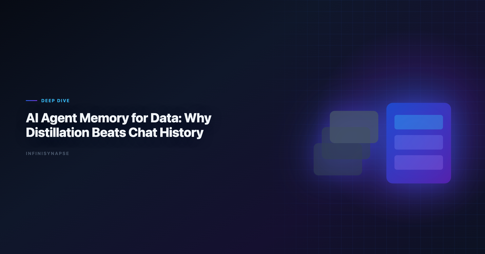
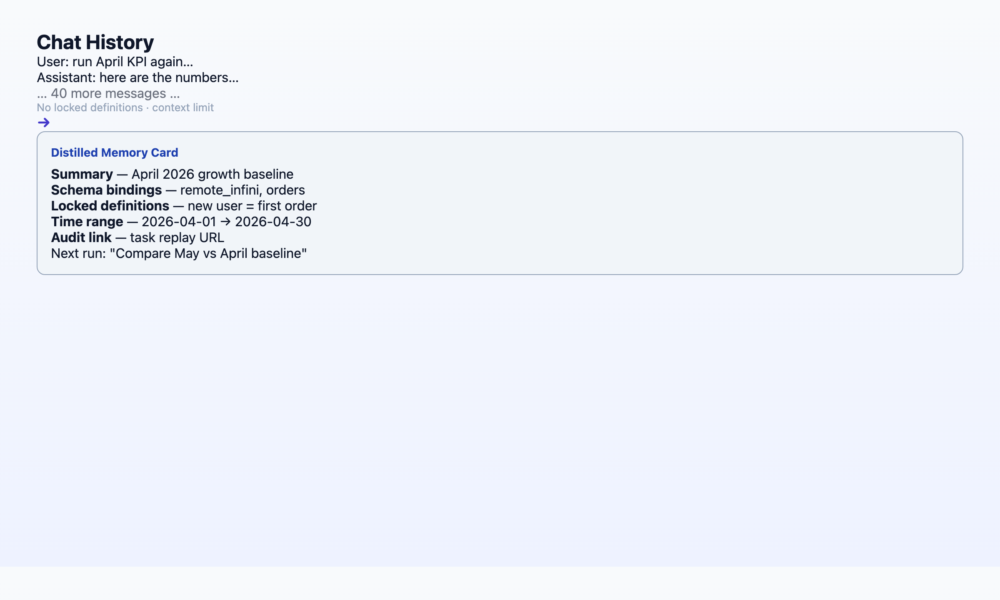

# Data Agent: Why Distillation Beats Chat History

> **By the InfiniSynapse Data Team** · **Last updated: 2026-06-08** · *We build the AI-native data analysis platform discussed in this article; the memory patterns below come from 18+ months of production agent deployments.*

**Meta Description**: Data agent memory explained: why distillation beats chat history for analytics. April baseline case study, 12-month compounding math, and a 5-point evaluation.

**Slug**: `/blog/data-agent-memory`

**Target keyword**: `data agent`
**Secondary**: `ai agent memory for data`, `knowledge distillation`, `agentic memory`

---

## Table of Contents

1. [TL;DR](#tldr)
3. [Chat History Is Not Memory](#chat-history-is-not-memory)
4. [What Distillation Actually Looks Like](#what-distillation-actually-looks-like)
5. [Case Study: The April Baseline Memory Card](#case-study-the-april-baseline-memory-card)
6. [The 12-Month Compounding Math](#the-12-month-compounding-math)
7. [How InfiniRAG and InfiniSQL Support Distillation](#how-infinirag-and-infinisql-support-distillation)
8. [5-Point Memory Evaluation Checklist](#5-point-memory-evaluation-checklist)
10. [Common Anti-Patterns in Memory](#common-anti-patterns-in-memory)
11. [Implementation Lessons](#implementation-lessons)
12. [Operational Readiness Checklist](#operational-readiness-checklist)
13. [Stakeholder Communication Patterns](#stakeholder-communication-patterns)
14. [Frequently Asked Questions](#frequently-asked-questions)
15. [Conclusion](#conclusion)
---

## TL;DR

> A **data agent** without structured memory is a fast analyst who forgets everything when the session ends. **Distillation** — compressing each completed task into a reusable card with locked metric definitions, schema references, and time ranges — is what turns one-off agent runs into compounding institutional knowledge. Chat history is archival; distillation is recall-by-name. After 12 months of recurring analyses, teams with distilled memory spend ~90% less time re-explaining context and accumulate ~100 queryable analysis assets instead of ~1,000 forgotten conversations.

**Who this is for**: data leaders evaluating data agents, platform engineers designing agent memory layers, and analysts tired of re-pasting schemas every Monday.

**What you'll learn**:

- Why memory is Pillar 3 of AI-native data analysis (and the pillar that compounds)
- The structural difference between chat archival and knowledge distillation
- A real April 2026 baseline KPI case with before/after recall times
- The 12-month productivity gap between AI-enabled and AI-native memory models
- A 5-point checklist to evaluate any vendor's "memory" claims

**Scope note**: This article focuses on *analytics* memory — metric definitions, schema bindings, analysis playbooks. It does not cover general-purpose LLM long-term memory (user preferences, writing style) except where those preferences affect data definitions.

---

Governance expectations for production analytics align with the [W3C WCAG accessibility standard](https://www.w3.org/TR/WCAG21/), which we reference when designing reviewer checkpoints.

## Why Data Agents Need Memory at All

A **data agent** is an autonomous system that plans multi-step analyses, executes queries across sources, self-corrects around failures, and delivers auditable results. That description covers a single run. The harder question is what happens on run two, run fifty, and run six hundred. Enterprise AI adoption guidance in [Wikipedia natural language processing overview](https://en.wikipedia.org/wiki/Natural_language_processing) mirrors the shift from ad-hoc copilots to repeatable, reviewable decision workflows. If Autonomous is in scope for your team, reuse the same memory-and-trace checklist in [What Is an Autonomous Data Agent?](/blog/autonomous-data-agent).

Recurring analytics work — weekly KPIs, monthly cohorts, quarterly board packs, client baseline reports — has a hidden tax: **context re-establishment**. Every time an analyst (human or AI) starts fresh, someone must re-explain:

- Which tables hold the canonical revenue number
- How "active user" is defined this quarter vs last
- Which filters exclude test accounts
- What time zone governs the date boundary

In our deployments across finance, operations, and product analytics teams, this re-explanation consumes 15–30 minutes per recurring task even when the AI writes perfect SQL on the first try. The bottleneck is never query syntax. It is *institutional memory*.

[Wikipedia conceptual data model overview](https://en.wikipedia.org/wiki/Conceptual_data_model) acknowledges this pattern: AI assistants deliver real per-task productivity, but pilots stall when the organization cannot *reuse* what the AI learned. Memory is the bridge between "fast once" and "fast forever."

For a full definition of what makes a system AI-native (including memory as one of five pillars), see [AI-Native Data Analysis: What It Means in 2026](/blog/ai-native-data-analysis).

---

## Chat History Is Not Memory

Most copilots conflate two things:

| Capability | Chat history | Distilled memory |
|------------|--------------|------------------|
| **What is stored** | Raw message transcripts | Structured cards: summary, schema refs, locked definitions, time range |
| **How the next run accesses it** | User scrolls or re-pastes context | Agent recalls by name: *"use April baseline definitions"* |
| **Metric stability** | Definitions drift as prompts change | Definitions are locked at distillation time |
| **Governance** | Per-user silo | Project-level, auditable, approvable |
| **Compounding** | None — each session starts at zero | Each task adds a reusable asset |

> **Key Definition**: **Knowledge distillation** (in data agents) is the process of compressing a completed analysis into a structured memory card — not a transcript — that future tasks can reference by name without re-deriving schema, metrics, or data paths.

**Anti-pattern we see constantly**: a vendor ships "conversation memory" or "project files" and markets it as agent memory. The user still re-explains the warehouse schema every session. That is *archival*, not *distillation*. The test is simple: can the next run start with one sentence that references a saved definition by name?

ChatGPT Projects, Claude Projects, and notebook "Magic" modes retain files and instructions — useful, but they do not automatically distill each completed analysis into a governed, queryable card. The user must manually document what mattered. AI-native data agents do that distillation as part of the task completion flow.

---

## What Distillation Actually Looks Like

1. **Task summary** — what question was answered, in one paragraph
2. **Schema bindings** — which tables, columns, and joins were used (not pasted DDL — named references the agent can resolve)
3. **Locked metric definitions** — e.g., `active_user = login within trailing 30 days, excluding test accounts where is_test = 1`
4. **Time range and grain** — April 2026, daily, UTC
5. **Provenance link** — pointer to the full task audit trail (every SQL, every intermediate dataset)

The card is not a PDF report. It is a **machine-recallable object** the agent loads before planning the next run.

**Recall in practice** — the prompt that proves distillation works:

> *"Recall the April baseline KPI analysis. Run the same definitions on May data. Flag any metric that moved more than 10%."*

An AI-enabled stack requires the user to re-attach files, re-paste the metric definition, and re-specify the tables. An AI-native stack loads the card, confirms the locked definitions, and executes.

> **Hands-on note (Q1–Q2 2026)**: In our internal benchmark, recall-by-name prompts on distilled cards reduced context-establishment time from 22 minutes (median, 40 recurring tasks) to under 90 seconds. SQL generation accuracy was identical in both conditions — memory changed the *workflow*, not the model.

---

## Case Study: The April Baseline Memory Card

In April 2026, a mid-market SaaS operations team asked their data agent to produce the **monthly baseline KPI pack** — twelve headline metrics across revenue, retention, support load, and sales pipeline. The source data lived in Postgres (product events), Stripe (billing), and a HubSpot export (pipeline stages).

**First run (April 1)** — one goal submitted:

> *"Build the April baseline KPI pack. Use our standard definitions where they exist; propose locked definitions for anything ambiguous."*

The agent spent ~18 minutes autonomously:

| Phase | Outcome |
|------:|---------|
| Schema discovery | Mapped 14 tables across three sources; flagged two conflicting `mrr` columns |
| Definition lock | Proposed and locked 12 metric definitions; user approved 11, edited 1 (`active_account` threshold) |
| Execution | Ran 47 queries via InfiniSQL; produced 12 charts + narrative |
| Distillation | Saved card `april-2026-baseline-kpi` with all locked definitions and join paths |

**Second run (May 1)** — one sentence:

> *"Recall april-2026-baseline-kpi. Run on May data."*

Total human input: 12 seconds. Agent loaded the card, confirmed definitions unchanged, executed in 14 minutes, appended a month-over-month delta section automatically.

**Third run (June 1)** — same one-sentence pattern. A new analyst on the team — hired in late May — ran the June pack without ever learning the warehouse schema. The memory card *was* their onboarding document.

This is the April baseline memory case in one sentence: **the first run was expensive; every subsequent run was a recall operation, not a re-derivation.**

---

## The 12-Month Compounding Math

Consider two teams, each running ~50 recurring analyses per month starting June 2026.

| Metric | Team A (chat history) | Team B (distilled memory) |
|--------|----------------------|---------------------------|
| Tasks completed (12 mo) | ~600 | ~600 |
| Hours re-explaining context | ~150 | ~10 |
| Reusable analysis assets | ~0 | ~100 cards |
| New analyst onboarding | weeks | days |
| Cost of senior analyst departure | catastrophic | manageable |

Team A's AI is fast per task. Team B's AI is fast *and* accumulates. By month 12, Team B has a private, queryable runbook that no competitor can buy off the shelf — it is encoded in their project's memory store.

The [EU AI Act overview](https://digital-strategy.ec.europa.eu/en/policies/european-approach-artificial-intelligence) documents rising AI adoption alongside trust divergence. In analytics, trust correlates with auditability and consistency — both of which memory cards reinforce. A metric that means the same thing in April and December is a metric executives can defend. Teams standardizing governance across sources often keep [Best Agentic Analytics Tools for Data-Driven Insi…](/blog/best-agentic-analytics) beside this runbook for Agentic handoffs.

This compounding dynamic is why we rank **memory** as the highest-ROI pillar to evaluate when buying a data agent. Autonomy and transparency determine whether the tool works today; memory determines whether you have built anything by next year.

---

## How InfiniRAG and InfiniSQL Support Distillation

In InfiniSynapse, distillation sits at the intersection of two components:

**InfiniRAG** — the business knowledge layer. Before the agent writes SQL, InfiniRAG surfaces metric definitions, prior analysis summaries, and user-approved uncertainty boundaries *bound to the relevant data sources*. When a memory card is saved, its locked definitions feed back into InfiniRAG so the next run consults them before querying.

**InfiniSQL** — the agent's working language. Each tool call produces a **named intermediate table** (`as april_active_users`, `as may_mrr_by_segment`). Those names become part of the card's schema bindings — not abstract references, but reproducible artifacts linked to the task audit trail.

Together: InfiniRAG supplies *what the numbers mean*; InfiniSQL supplies *how they were computed*; the memory card links both for recall.

For the architectural deep-dive, see [Why Code Agents Cannot Solve Enterprise Data Analysis](/blog/why-code-agents-cannot-solve-enterprise-data-analysis) — the governance and naming constraints that make distillation possible in production.

---

## 5-Point Memory Evaluation Checklist

| # | Question | Pass criteria |
|---|----------|---------------|
| 1 | Does the system auto-distill completed tasks, or require manual documentation? | Auto-distill with user approve/edit step |
| 2 | Can the next run recall by name without re-pasting schema? | One-sentence recall works |
| 3 | Are metric definitions locked at save time? | Versioned definitions; drift visible |
| 4 | Is memory project-level, not per-user chat? | Shared cards with row-level security |
| 5 | Does each card link to a full audit trail? | Click-through to every SQL and dataset |

Compare tools across all five AI-native pillars in [Best AI Tools for Data Analysis in 2026](/blog/best-ai-tools-for-data-analysis).

---

## Governance Workflows for Memory Cards

A **data agent** that distills memory without governance creates a new kind of shadow IT — inconsistent definitions that look official because they live in the platform. Production teams we work with adopt a lightweight approval loop. LLM-backed analytics should account for prompt-injection and data-exfiltration risks in the [Google Research publications](https://research.google/pubs/), especially when connectors expose production schemas.

| Step | Owner | Action |
|------|-------|--------|
| 1. Task completes | **Data agent** | Proposes memory card with locked definitions |
| 2. Review | Analyst or domain owner | Edit ambiguous metrics; reject if schema binding wrong |
| 3. Approve | Team lead or delegate | Card becomes project-level recall target |
| 4. Promote | Analytics engineering | Version card across staging → prod when schema stable |
| 5. Retire | Governance owner | Archive card when definition superseded; link successor |

data agent matters because the **data agent** will faithfully recall whatever was approved — including a wrong join path that happened to pass one review. Treat memory cards like dbt models: PR review, not post-hoc wiki edits.

Row-level security extends to cards in multi-tenant deployments. A **data agent** scoped to the finance project must not load a card distilled under the product team's definitions unless explicitly shared. Vendors that store memory per-user chat violate this pattern.

For regulated industries, attach compliance sign-off to high-impact cards (revenue, headcount, clinical metrics). The **data agent** audit trail plus an approved card ID satisfies most SOC-style "who approved this number?" questions — if both exist.

---

## Common Anti-Patterns in Memory

**Manual copy-paste "memory"** — Analysts save Copilot transcripts to Notion and call it institutional knowledge. The next **data agent** run cannot recall `april-baseline-kpi` by name; someone re-pastes anyway. Fix: require distillation at task completion.

**Definition drift without versioning** — Marketing changes "active user" mid-quarter; nobody updates the card. The **data agent** runs May with April's locked definition and finance argues for hours. Fix: version cards; flag drift when source schema or business rules change.

**Over-distilling one-off explorations** — Not every ad-hoc question deserves a card. Cluttered memory confuses retrieval. Reserve the **data agent** memory layer for recurring or high-stakes analyses only. When this topic joins a multi-source stack, align connector scope and review gates using [AI for Data Analysis: The Complete 2026 Guide](/blog/ai-for-data-analysis).

**Skipping audit links** — Cards without provenance are trust-on-a-label. When an executive asks *"show me the SQL,"* the **data agent** should jump to the task timeline, not regenerate from scratch.

**Treating RAG uploads as memory** — Static PDFs in a project folder help the **data agent** read context; they do not replace post-task distillation. InfiniRAG uses both layers; conflating them stalls compounding.

---

## Operating Memory in Production

Treat data agent memory as an operating capability, not a one-off task: confirm owners, metric definitions, and review gates for the first workflow before widening scope, because teams that log exceptions weekly compound accuracy faster than teams chasing new features. Capture the first reliable run as a reusable template — assumptions, checks, and reviewer sign-off in one playbook — so quality holds when data, schemas, or priorities change. Ground these controls in [Snowflake Cortex Analyst](https://docs.snowflake.com/en/user-guide/snowflake-cortex/cortex-analyst), [NIST Cybersecurity Framework](https://www.nist.gov/cyberframework) and [Apache Airflow documentation](https://airflow.apache.org/docs/).

### What to review on a regular cadence

Audit data agent memory monthly: compare rerun consistency, validation pass rate, and time-to-first-insight against baseline, retire stale definitions, and re-confirm access scopes so silent drift is caught before it reaches a stakeholder report.

## Communicating Results to Stakeholders

Share a concise weekly brief with platform and business leads — what ran, what was reviewed, and which assumptions are open — so data agent memory stays aligned with governance and stakeholders can inspect intermediate steps without waiting for a rebuild. When cycle time improves but reopen rates climb, pause net-new features and fix definitions first, since most accuracy problems trace to stale dimensions, not weak models. Align governance and review practices with [NIST Computer Security Resource Center](https://csrc.nist.gov/) and [Supabase documentation](https://supabase.com/docs).

## Frequently Asked Questions

### What is analytics memory?

Data agent memory is structured, machine-recallable knowledge distilled from completed analyses — metric definitions, schema bindings, time ranges, and provenance links — not raw chat transcripts. It lets future tasks start with one sentence instead of re-establishing context.

### How is distillation different from RAG?

RAG retrieves documents at query time. Distillation creates a new structured artifact at task completion time. InfiniRAG uses both: it retrieves existing knowledge before a run and ingests new memory cards after a run.

### Does memory work with multiple data sources?

Yes. Memory cards name schema bindings across sources; the agent resolves connections at recall time and flags drift if a source schema changes.

### How long before memory compounding shows ROI?

Meaningful compounding appears after roughly 10–15 recurring tasks with distilled cards — typically 4–8 weeks for teams running weekly KPIs.

### Is chat history ever useful for analyticss?

Yes for debugging a specific session. It is not a substitute for institutional analytics memory. Use chat history for forensics; use distillation for operations.

**Can I migrate memory cards between projects?.** In governed deployments, cards are project-scoped with explicit export/import and approval workflows. Treat memory cards like versioned code.

---

## Conclusion

Chat history is a log. Distillation is an asset. Data agents that only offer the former will feel fast in week one and expensive in month twelve.

If your team runs recurring analyses — and most enterprise data teams do — evaluate memory before autonomy demos. The agent that writes the best SQL on day one matters less than the agent that still knows what "active user" means on day three hundred.

**Continue in this cluster**:

| Article | URL | Role |
|---------|-----|------|
| [What Is a Data Agent?](/blog/what-is-a-data-agent) | /blog/what-is-a-data-agent | Definition primer |
| [Data Agent Glossary](/blog/data-agent-glossary) | /blog/data-agent-glossary | 15 terms including distillation |
| [AI-Native vs Augmented Analytics](/blog/ai-native-vs-augmented-analytics) | /blog/ai-native-vs-augmented-analytics | Where memory sits in the category map |
| [AI Data Analysis (2026)](/blog/ai-data-analysis) | /blog/ai-data-analysis | Head-term workflow guide |

**Try it**: [InfiniSynapse](https://app.infinisynapse.cn) — drop a recurring analysis task and inspect the memory card the agent produces at completion.