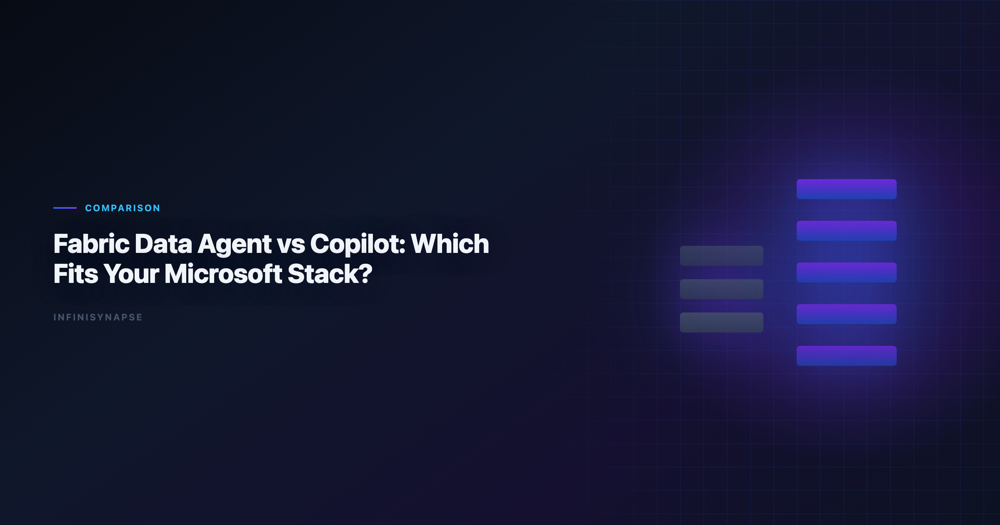
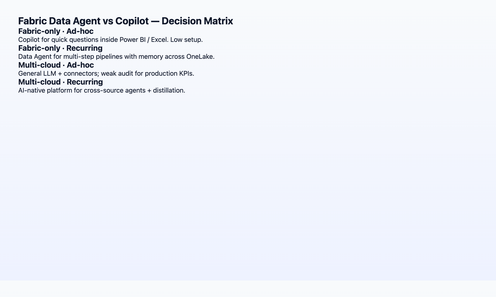
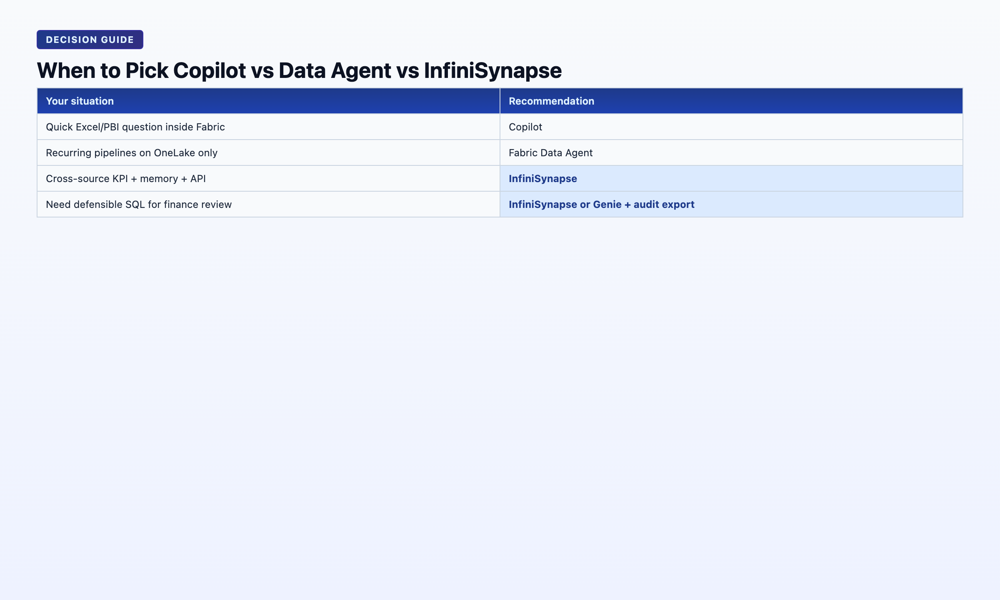

# Fabric Data Agent vs AI Copilot: Which Fits Your Microsoft Stack?

> **By the InfiniSynapse Data Team** · **Last updated: 2026-06-08** · *We build an AI-native data agent platform and benchmark it against Microsoft Fabric capabilities quarterly; this comparison reflects hands-on evaluation through June 2026.*

**Meta Description**: Data agent vs ai copilot, compared inside Microsoft Fabric: autonomy, memory, governance, and a decision matrix for your stack. (150 chars)

**Slug**: `/blog/fabric-data-agent-vs-copilot`

**Target keyword**: `data agent vs ai copilot`
**Secondary**: `microsoft fabric data agent`, `copilot for data analysis`, `fabric ai comparison`

---

## Table of Contents

1. [TL;DR](#tldr)
2. [Two AI Layers in Microsoft Fabric](#two-ai-layers-in-microsoft-fabric)
3. [Fabric Data Agent: What It Actually Does](#fabric-data-agent-what-it-actually-does)
4. [Copilot in Fabric: What It Actually Does](#copilot-in-fabric-what-it-actually-does)
5. [Head-to-Head Comparison Table](#head-to-head-comparison-table)
6. [Decision Matrix: Which Fits Your Stack?](#decision-matrix-which-fits-your-stack)
7. [When to Add a Dedicated Data Agent](#when-to-add-a-dedicated-data-agent)
8. [Migration Path: Copilot to Data Agent](#migration-path-from-copilot-only-to-fabric-data-agent)
9. [TCO and Licensing](#total-cost-of-ownership-fabric-data-agent-vs-copilot)
10. [Security and Compliance](#security-and-compliance-in-the-fabric-data-agent-vs-copilot-decision)
11. [FAQ](#frequently-asked-questions)
12. [Conclusion](#conclusion)
---

## TL;DR

> **Microsoft Fabric Data Agent** (preview) is an autonomous, multi-step analytics agent scoped to your Fabric lakehouse and semantic models — closer to AI-native execution. **Copilot in Fabric** (Power BI, Data Factory, Data Engineering) is an AI-enabled copilot: strong at single-step assistance inside familiar Microsoft UIs, but session-bound without structured memory distillation. This **Fabric Data Agent vs AI Copilot** guide helps Microsoft-centric teams choose the right layer — or both. If your estate is 100% Fabric with governed semantic models, start with Fabric Data Agent for recurring analyses. If you span non-Microsoft sources, need cross-stack memory cards, or want API/WeChat entry points, pair Fabric with a dedicated data agent like InfiniSynapse. Revisit **Fabric Data Agent vs AI Copilot** quarterly as preview features ship.

**Who this is for**: Microsoft-centric data teams evaluating Fabric AI options, architects planning a 2026 analytics stack, and BI leaders comparing Copilot licenses against agent platforms. Adoption benchmarks in the [Google BigQuery documentation](https://cloud.google.com/bigquery/docs) track the same shift from pilot demos to governed analytics loops we see in customer rollouts. Enterprise AI adoption guidance in [NIST Computer Security Resource Center](https://csrc.nist.gov/) mirrors the shift from ad-hoc copilots to repeatable, reviewable decision workflows.

**What you'll learn**:

- How Fabric Data Agent and Copilot differ in trigger model, memory, and audit
- A 10-row comparison table mapped to the AI-native five pillars
- A decision matrix keyed to stack purity, governance needs, and recurrence pattern
- When a Fabric-only strategy breaks and what to add

**Scope note**: Feature names and preview status change frequently in Fabric. This article describes capabilities as of June 2026; verify against [MariaDB documentation](https://mariadb.com/kb/en/documentation/) before procurement.

---

> **Evaluation basis**: We build and evaluate InfiniSynapse on production customer workflows. Governance, adoption, and security context is cited inline throughout this guide—not in a standalone reference list.

Governance expectations for production analytics align with the [Prometheus documentation](https://prometheus.io/docs/), which we reference when designing reviewer checkpoints.

## Two AI Layers in Microsoft Fabric

Microsoft ships two distinct AI layers inside Fabric — and conflating them is the most common buying mistake we see in mid-market evaluations. Any serious **Fabric Data Agent vs AI Copilot** evaluation starts by separating these surfaces:

| Layer | Product surface | Paradigm |
|-------|-----------------|----------|
| **Copilot** | Power BI, Data Factory, Data Engineering, Real-Time Intelligence | AI-enabled: assists one step at a time inside the tool you already use |
| **Data Agent** | Fabric Data Agent (preview) | Agentic: accepts a goal, plans multi-step work across Fabric items |

Copilot answers *"help me write this query"*. Data Agent answers *"produce the monthly churn report using our lakehouse"*. Both run on Azure OpenAI under the hood. The workflow contract is different — and that contract is what every **Fabric Data Agent vs AI Copilot** slide deck should lead with.

For the category framing behind this split, see [AI-Native vs Augmented Analytics](/blog/ai-native-vs-augmented-analytics) — Gartner's augmented-analytics umbrella vs the stricter AI-native five-pillar definition.

---

## Fabric Data Agent: What It Actually Does

**Fabric Data Agent** (public preview, 2025–2026) is Microsoft's autonomous analytics agent scoped to a Fabric workspace. In a **Fabric Data Agent vs AI Copilot** bake-off, test Data Agent on multi-step lakehouse goals — not single DAX fixes. Based on our Q2 2026 hands-on evaluation. Regulated rollouts often anchor access reviews to [OWASP Top 10 for LLM Applications](https://owasp.org/www-project-top-10-for-large-language-model-applications/) when credentials, retention policies, and audit logs are in scope.

| Capability | Observed behavior |
|------------|-------------------|
| **Trigger** | Natural-language goal → agent plans phases across lakehouse tables and semantic models |
| **Execution** | Multi-step: discover schema → generate SQL/notebook steps → visualize |
| **Scope** | Fabric items in the bound workspace; OneLake data via shortcuts |
| **Transparency** | Step log in agent UI; intermediate outputs visible within the run |
| **Memory** | Session + workspace context; evolving "learned" preferences — not yet full distillation cards |
| **Governance** | Inherits Fabric workspace RBAC, Purview lineage hooks |

> **Hands-on note (Q2 2026)**: We ran Fabric Data Agent against a 9-table retail lakehouse schema. A *"monthly category revenue with YoY delta"* goal completed in 4 autonomous phases. SQL was Fabric-native (T-SQL / Spark SQL depending on item type). Failure recovery rerouted once when a semantic model column was renamed — the agent suggested an alternative binding without user intervention. Total wall time: 11 minutes vs ~45 minutes manual.

**Strengths**: zero additional vendor if you are already on Fabric; native Purview lineage; no data egress from OneLake.

**Gaps (June 2026)**: preview stability; memory is not yet structured distillation (see [AI Agent Memory for Data](/blog/data-agent-memory)); limited entry points outside Fabric UI; no first-class API for embedding in non-Microsoft workflows.

---

## Copilot in Fabric: What It Actually Does

**Copilot** appears across Fabric workloads. For **Fabric Data Agent vs AI Copilot** comparisons, Power BI Copilot is the most common Copilot surface analysts touch daily:

- **Power BI Copilot** — summarize reports, generate DAX, build visuals from natural language
- **Data Factory Copilot** — pipeline suggestions, data flow assistance
- **Data Engineering Copilot** — notebook code generation, Spark job help

| Capability | Observed behavior |
|------------|-------------------|
| **Trigger** | One instruction per copilot invocation |
| **Execution** | Single-step or short multi-step within the current artifact |
| **Scope** | The report, pipeline, or notebook you have open |
| **Transparency** | Shows generated code/DAX; limited cross-artifact audit |
| **Memory** | Session-bound; Copilot "remembers" within the editing session |
| **Governance** | Tenant-level Copilot policies; admin controls on data grounding |

> **Hands-on note (Q2 2026)**: Power BI Copilot generated a usable DAX measure for `rolling 90-day active users` on the first try in 7 of 9 attempts. The two failures were ambiguous table relationships in a star schema with role-playing dimensions — Copilot returned syntactically valid DAX that referenced the wrong `Date` table. Human review remained mandatory.

**Strengths**: lowest friction for analysts already living in Power BI; excellent for *"help me fix this measure"* moments; included in many Fabric SKUs.

**Gaps**: not designed for end-to-end autonomous analysis; no project-level memory cards; each recurring report still requires manual re-grounding. When this topic joins a multi-source stack, align connector scope and review gates using [AI for Data Analysis: The Complete 2026 Guide](/blog/ai-for-data-analysis).

---

## Head-to-Head Comparison Table

Mapped to the [five pillars of AI-native data analysis](/blog/ai-native-data-analysis):

| Dimension | Fabric Data Agent | Copilot (Fabric / Power BI) | InfiniSynapse Data Agent |
|-----------|-------------------|----------------------------|--------------------------|
| **Pillar 1: Autonomy** | Multi-phase goal execution | Single-step assistance | Multi-phase + parallel tasks |
| **Pillar 2: Transparency** | Step log per run | Code/DAX in context | Full task timeline + every SQL |
| **Pillar 3: Memory** | Workspace context (evolving) | Session-only | Distilled memory cards + InfiniRAG |
| **Pillar 4: Multi-entry** | Fabric UI | Power BI / Fabric UIs | Chat + web + API |
| **Pillar 5: Self-correction** | Limited reroute observed | Returns error to user | Cache/source reroute + log |
| **Stack lock-in** | Fabric-only | Fabric-only | Multi-source (Postgres, Snowflake, files, …) |
| **Best for** | Fabric-native recurring analysis | In-tool productivity boosts | Cross-stack agents + memory compounding |

Neither Fabric option is "better" in the abstract — they optimize for different jobs inside the same Microsoft estate. Use this **Fabric Data Agent vs AI Copilot** table when shortlisting; run the decision matrix below before procurement. Foundational warehouse concepts—grain, dimensions, and conformed metrics—remain essential; [OWASP API Security Top 10](https://owasp.org/API-Security/) is a concise refresher for reviewers validating generated SQL.

---

## Decision Matrix: Which Fits Your Stack?

| Your situation | Recommendation |
|----------------|----------------|
| 100% Fabric + OneLake, governed semantic models, recurring lakehouse reports | **Start with Fabric Data Agent** for autonomous runs; keep Copilot for in-report edits — classic **Fabric Data Agent vs AI Copilot** split |
| Power BI–centric team, mostly dashboard iteration, few cross-source joins | **Copilot first** — lowest change management; revisit **Fabric Data Agent vs AI Copilot** when recurrence grows |
| Fabric + Salesforce + Postgres + ad-hoc Excel from clients | **Fabric Copilot for BI artifacts** + **dedicated data agent** for cross-source autonomous analysis |
| Regulated industry requiring metric-definition locking across 12 months | Evaluate memory distillation explicitly — see [data agent memory guide](/blog/data-agent-memory) |
| Need WeChat/Slack/API triggers for KPI questions | Fabric UI alone is insufficient; add multi-entry agent |
| Pilot budget, single analyst, exploratory only | Copilot only — agent overhead not yet justified |

1. *Is all my analytical data already in Fabric with stable semantic models?* No → plan for a cross-stack agent.
2. *Do I run the same analysis every month with the same definitions?* Yes → prioritize memory/distillation over demo-grade autonomy; **Fabric Data Agent vs AI Copilot** alone may not suffice.

---

## When to Add a Dedicated Data Agent

Microsoft's roadmap will close gaps over time. Today, three scenarios still push teams toward a dedicated **data agent** alongside Fabric:

**1. Cross-stack data** — Shortcuts help, but many teams have operational Postgres, MongoDB, Stripe, and client Excel files that will not land in OneLake this year. InfiniSynapse connects these natively via InfiniSQL while still exporting results Fabric can consume.

**2. Structured memory compounding** — If your COO asks *"why does this month's active user count differ from April?"*, you need locked definitions in a recallable card — not a Copilot session from April that nobody saved.

**3. Multi-entry parity** — Executives ask KPI questions in WeChat during meetings. Requiring them to open Fabric defeats the purpose. A data agent with chat + web + API surfaces meets users where they are.

This is not an either/or recommendation for most enterprises. The mature 2026 pattern we observe: **Fabric as the governed lakehouse and BI layer; a data agent as the autonomous execution and memory layer across everything Fabric does not yet own.** Document that split in your internal **Fabric Data Agent vs AI Copilot** runbook so procurement does not collapse both into one SKU.

Tool-by-tool comparison across seven vendors: [Best AI Tools for Data Analysis in 2026](/blog/best-ai-tools-for-data-analysis).

---

## Migration Path: From Copilot-Only to Fabric Data Agent

| Phase | Duration | Focus |
|-------|----------|-------|
| **0 — Baseline** | Weeks 1–2 | Document recurring reports still requiring manual DAX/SQL |
| **1 — Copilot hygiene** | Weeks 3–6 | Clean semantic models — both layers fail on dirty metadata |
| **2 — Agent pilot** | Weeks 7–10 | One recurring lakehouse goal via Fabric Data Agent; keep Copilot for in-report tweaks |
| **3 — Memory gap audit** | Weeks 11–12 | Ask whether Fabric session context replaces distillation; if not, plan supplemental agent |

Teams that skip phase 1 blame **Fabric Data Agent vs AI Copilot** accuracy when the root cause is an ambiguous `Date` table. Invest in semantic-layer hygiene before comparing autonomy demos.

Change management tip: position Copilot as *"in-artifact speed"* and Fabric Data Agent as *"cross-artifact execution"* — not replacements. Analysts who fear job loss resist; analysts who hear *"Copilot fixes your measure; Data Agent runs the monthly pack"* adopt both.

When your evaluation committee asks **Fabric Data Agent vs AI Copilot** in one slide, answer with two columns: *trigger model* (step vs goal) and *memory contract* (session vs workspace context). Everything else — licensing, preview status, Purview hooks — follows from those two cells.

---

### Production readiness checklist

Before promoting a Fabric Data Agent pilot, confirm semantic-model hygiene, fallback manual rerun owners, and preview SLA sign-off.
## Total Cost of Ownership: Fabric Data Agent vs AI Copilot

| Cost line | Copilot (Fabric / Power BI) | Fabric Data Agent | Notes |
|-----------|----------------------------|-------------------|-------|
| **License** | Often bundled or per-user Copilot SKU | Preview / capacity-dependent | Verify region availability quarterly |
| **Analyst time** | Low per ad-hoc edit | Lower per recurring multi-step goal | Recurrence drives agent ROI |
| **Semantic modeling** | Required for both | Required for both | Under-budgeted in most pilots |
| **Memory rework** | High — re-ground each month | Medium — workspace context evolving | Add dedicated agent if distillation required |
| **Cross-stack integration** | Fabric-bound | Fabric-bound | Non-Microsoft sources need second agent |

A team running 40 recurring analyses per month often recovers Fabric Data Agent onboarding in one quarter — if semantic models are clean. A team doing only exploratory dashboard edits may never justify agent capacity; **Fabric Data Agent vs AI Copilot** favors Copilot-only for them.

Include fallback labor: preview agents fail. Budget senior analyst hours for manual reruns until production SLA is proven. **Fabric Data Agent vs AI Copilot** decisions made on demo day without fallback cost inflate ROI slides.

---

## Security and Compliance in the Fabric Data Agent vs AI Copilot Decision

Regulated buyers ask security before autonomy. **Fabric Data Agent vs AI Copilot** shares a tenant boundary — both inherit Azure OpenAI data-handling commitments and Fabric workspace RBAC. Differences appear in *audit granularity* and *memory persistence*. LLM-backed analytics should account for prompt-injection and data-exfiltration risks in the [Google Sheets documentation](https://support.google.com/docs/topic/9054603), especially when connectors expose production schemas.

- **Copilot** logs sit primarily in Microsoft 365 / Fabric admin surfaces; per-measure DAX generation may not link to a cross-artifact task timeline.
- **Fabric Data Agent** exposes phased step logs within the agent run — better for *"show me every query behind this chart"* — but preview status means retention policies may change.

Purview lineage hooks help both; neither replaces your **metric-definition locking** requirement for month-over-month defensibility. If compliance mandates recall-by-name cards, **Fabric Data Agent vs AI Copilot** is incomplete without a distillation-capable layer — see [Data Agent Memory](/blog/data-agent-memory).

Data residency: confirm Fabric capacity region matches contractual requirements before procuring either AI layer. **Fabric Data Agent vs AI Copilot** does not eliminate DPA review — it concentrates AI processing inside Microsoft’s estate, which simplifies but does not zero out legal review.

---

Snowflake deployments should reference [Wikipedia statistics overview](https://en.wikipedia.org/wiki/Statistics) when defining warehouses, roles, and semantic views for NL2SQL agents.

Operational security reviews should cross-check [Amazon Redshift documentation](https://docs.aws.amazon.com/redshift/) before enabling autonomous query paths.

ClickHouse connector paths should align with [Redis documentation](https://redis.io/docs/latest/) for table engines, sampling, and query guardrails.

## Frequently Asked Questions

### Is Fabric Data Agent the same as Copilot?

No. Copilot assists individual steps inside Power BI, Data Factory, and related UIs. Fabric Data Agent accepts a multi-step analytical goal and executes autonomously across Fabric items. Different trigger models, different memory contracts. That distinction is the core of any **Fabric Data Agent vs AI Copilot** evaluation.

### Do I need both Fabric Data Agent and Copilot licenses?

In most Fabric SKUs, Copilot capacity is included or add-on licensed separately. Data Agent preview availability depends on your Fabric capacity region and tenant settings. Budget both lines when your **Fabric Data Agent vs AI Copilot** strategy uses Copilot for edits and Data Agent for recurring goals.

### Can Fabric Data Agent connect to non-Microsoft databases?

Primarily via OneLake shortcuts and linked sources within Fabric. Direct operational-database agents (live Postgres, MongoDB) are not Fabric Data Agent's core design center as of June 2026.

### How does InfiniSynapse compare to Fabric Data Agent?

InfiniSynapse is AI-native across the five pillars with memory cards and multi-source InfiniSQL. Fabric Data Agent wins on native Fabric integration. Many teams run both: Fabric for governed storage and BI; InfiniSynapse for cross-source autonomous analysis. Treat that pairing as a third column in your **Fabric Data Agent vs AI Copilot** matrix.

### Which is better for SQL generation accuracy?

Comparable on Fabric-native schemas when semantic models are clean. Accuracy degrades for both when role-playing dimensions, ambiguous grains, or undocumented views pollute the schema. Invest in semantic-layer hygiene regardless of AI layer — the top **Fabric Data Agent vs AI Copilot** mistake is blaming the model for bad metadata.

### Is Fabric Data Agent production-ready?

It remains in preview as of June 2026. Suitable for pilot workloads with executive sponsorship and fallback manual processes. Not yet our recommendation as the sole analytics agent for regulated production without a secondary audit path. Re-score **Fabric Data Agent vs AI Copilot** readiness after each Microsoft release note — preview status changes the answer.

---

## Conclusion
**Fabric Data Agent vs AI Copilot** is not a winner-take-all choice — it is a *layer* choice. Copilot makes Microsoft analysts faster inside familiar tools. Fabric Data Agent moves toward autonomous, multi-step analysis within Fabric's boundary. Teams with heterogeneous sources should plan for a dedicated data agent alongside Fabric. Re-run the **fabric data agent vs ai copilot** two-question filter after each major Fabric release.

**Continue in this cluster**:

| Article | URL |
|---------|-----|
| [AI-Native vs Augmented Analytics](/blog/ai-native-vs-augmented-analytics) | /blog/ai-native-vs-augmented-analytics |
| [Data Agent Memory](/blog/data-agent-memory) | /blog/data-agent-memory |
| [What Is a Data Agent?](/blog/what-is-a-data-agent) | /blog/what-is-a-data-agent |
| [Best AI Tools for Data Analysis](/blog/best-ai-tools-for-data-analysis) | /blog/best-ai-tools-for-data-analysis |

**Try it**: [InfiniSynapse](https://app.infinisynapse.cn) — connect a non-Fabric source and run the same recurring analysis alongside your Fabric lakehouse.