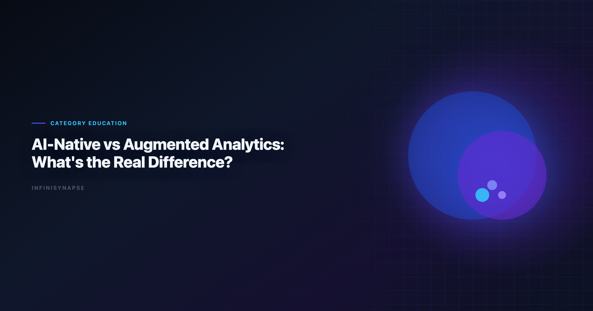
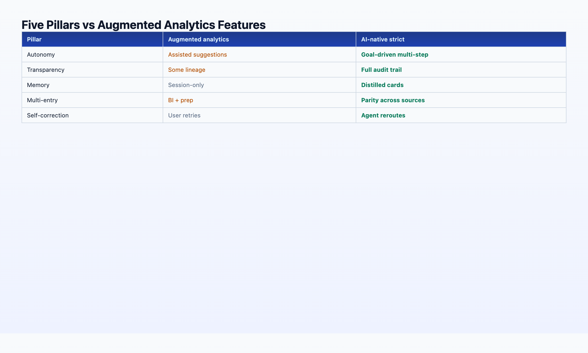

# Ai-Native Data Platform: What's the Real Difference?

> **By the InfiniSynapse Data Team** · **Last updated: 2026-06-08** · *We build an AI-native data platform; this article maps Gartner's augmented-analytics frame to the five-pillar AI-native definition we ship in production.*



**Meta Description**: AI-native vs augmented analytics explained: how an ai-native data platform differs from Gartner's augmented analytics frame, with a 5-pillar comparison.

**Slug**: `/blog/ai-native-vs-augmented-analytics`

**Target keyword**: `ai-native data platform`
**Secondary**: `augmented analytics`, `ai-native vs augmented analytics`, `agentic analytics`

---

## Table of Contents

1. [TL;DR](#tldr)
2. [What Gartner Means by Augmented Analytics](#what-gartner-means-by-augmented-analytics)
3. [What AI-Native Means in 2026](#what-ai-native-means-in-2026)
4. [The 5-Pillar Comparison Table](#the-5-pillar-comparison-table)
5. [Venn Diagram: Where the Categories Overlap](#venn-diagram-where-the-categories-overlap)
6. [Why the Distinction Matters for Buyers](#why-the-distinction-matters-for-buyers)
7. [3-Question Evaluation Test](#3-question-evaluation-test)
8. [Procurement Scorecard](#building-a-procurement-scorecard-for-an-ai-native-data-platform)
9. [Vendor Claims vs Reality](#common-vendor-claims-vs-verifiable-ai-native-data-platform-behavior)
10. [12-Month ROI Model](#12-month-roi-model-ai-native-data-platform-vs-augmented-bi)
11. [FAQ](#frequently-asked-questions)
12. [Conclusion](#conclusion)
---

## TL;DR

> **Augmented analytics** (Gartner, ~2017) is the broad umbrella: any ML-assisted data preparation, query generation, insight surfacing, or visualization. **AI-native data analysis** is a *strict subset* that additionally requires autonomy, process transparency, knowledge distillation, multi-entry parity, and self-correction — not as optional features, but as the workflow contract. An **AI-native data platform** implements all five pillars as product architecture, not roadmap slides. Most 2026 "agent" marketing sits in the augmented zone. The buyers who confuse the two categories — or who buy augmented BI expecting an **AI-native data platform** — are the ones whose pilots stall at month three.

**Who this is for**: data and analytics leaders writing 2026 AI strategy, architects comparing platform RFPs, and vendors' customers who need a vocabulary to cut through "agent" positioning. LLM-backed analytics should account for prompt-injection and data-exfiltration risks in the [Tableau Desktop documentation](https://help.tableau.com/current/pro/desktop/en-us/default.htm), especially when connectors expose production schemas. Analysts wiring Agent into production reviews can follow the parallel walkthrough in [The Data Agent Manifesto](/blog/data-agent-manifesto).

**What you'll learn**:

- Gartner's augmented-analytics definition and what it includes/excludes
- The AI-native five-pillar framework as a strict subset
- A side-by-side comparison table across 10 dimensions
- A 3-question test to classify any tool you are evaluating

**Scope note**: We use "AI-native data platform" to mean a system designed around the five-pillar workflow — not merely a BI platform with an AI copilot bolted on.

---

Governance expectations for production analytics align with the [OpenTelemetry documentation](https://opentelemetry.io/docs/), which we reference when designing reviewer checkpoints.

## What Gartner Means by Augmented Analytics

[Google Sheets documentation](https://support.google.com/docs/topic/9054603) as the use of enabling technologies such as machine learning and AI to assist with data preparation, insight generation, and insight explanation — augmenting how people explore and analyze data in BI and analytics platforms.

In practice, the augmented-analytics category (2017–2026) includes:

| Capability | Example products / features |
|------------|----------------------------|
| Auto data prep | Smart profiling, anomaly detection, suggested joins |
| NLQ / NLG | "Show me revenue by region" → chart + narrative |
| Insight surfacing | Automated trend detection, contribution analysis |
| Assisted modeling | Suggested hierarchies, clustering, forecasting |
| Copilot layers | Power BI Copilot, Tableau Pulse, ThoughtSpot Sage |

Augmented analytics **augments the human analyst**. The human still drives the session, owns the workflow, and carries institutional knowledge in their head (or in a wiki that the AI does not read automatically).

The productivity gain is real. [NIST AI Risk Management Framework](https://www.nist.gov/itl/ai-risk-management-framework) notes that organizations adopting augmented features see faster time-to-insight on exploratory work. The same research stream flags a recurring failure mode: pilots that never become production systems because governance, memory, and auditability were afterthoughts.

That failure mode is what the AI-native category addresses.

---

## What AI-Native Means in 2026

> **Key Definition**: An **AI-native data platform** is software where the user submits a *goal* — not a step — and an autonomous agent plans the analysis, executes multi-step queries across sources, self-corrects around failures, exposes the full audit trail, and distills the result into reusable structured memory. The AI is the workflow, not an attachment to a human-driven session.

AI-native is a **strict subset** of augmented analytics. Every AI-native platform uses ML/AI to assist analysis (augmented). Not every augmented platform is AI-native.

Three terms often confused:

| Term | Emphasis |
|------|----------|
| **Augmented analytics** | ML assists the human across prep, query, insight |
| **Agentic analytics** | Multi-step autonomous planning (often missing memory/audit) |
| **AI-native data platform** | Full five-pillar workflow designed around the agent |

For the full primer, see [AI-Native Data Analysis: What It Means in 2026](/blog/ai-native-data-analysis).

---

## The 5-Pillar Comparison Table

This is the core comparison buyers need. Each row maps a Gartner augmented-analytics capability to the AI-native pillar that *strictifies* it.

| # | Dimension | Augmented analytics (typical) | AI-native data platform |
|---|-----------|------------------------------|-------------------------|
| **1** | **Trigger model** | User asks one question; system responds | User states one goal; agent plans N steps |
| **2** | **Process transparency** | Final chart + short explanation | Every SQL, dataset, and tool call inspectable in task timeline |
| **3** | **Knowledge / memory** | Session context; optional "insights saved" | Distilled memory cards with locked metric definitions — [see memory guide](/blog/data-agent-memory) |
| **4** | **Entry points** | Primary BI UI | Chat + web app + API — same agent capability |
| **5** | **Failure handling** | Error returned to user | Agent reroutes (cache, alt source), logs workaround |
| **6** | **Data prep** | ML-suggested transforms; user approves | Agent profiles and cleans autonomously; audit trail preserved |
| **7** | **NLQ / SQL** | Single-turn text-to-SQL or DAX | Multi-turn InfiniSQL-style named intermediate tables across a run |
| **8** | **Insight surfacing** | System highlights anomalies in dashboards | Agent investigates anomalies as part of a goal-driven narrative |
| **9** | **Governance** | Report-level permissions | Project-level task + memory + audit governance |
| **10** | **12-month compounding** | Per-session productivity | Institutional memory — ~100 reusable cards vs ~0 |



### Pillar-by-pillar strictification

**Pillar 1 — Autonomy**: Augmented NLQ generates one query. AI-native agents generate a *plan* — discover schema, join, aggregate, chart, narrate — from one sentence.

**Pillar 2 — Process transparency**: Augmented tools show the answer. AI-native tools show the *evidence chain*. In regulated contexts, "the AI said so" fails; "here is every query that produced this number" passes.

**Pillar 3 — Knowledge distillation**: Augmented tools may save a "favorite insight." AI-native systems save a structured card the next run recalls by name — the difference between bookmarking and institutional memory.

**Pillar 4 — Multi-entry parity**: Augmented analytics lives in the BI UI. AI-native platforms meet executives in WeChat and engineers in API — same backend.

**Pillar 5 — Self-correction**: Augmented copilots return errors. AI-native agents reroute and complete — because the user's time is treated as expensive.

---

## Venn Diagram: Where the Categories Overlap

```
┌─────────────────────────────────────────────┐
│         AUGMENTED ANALYTICS (Gartner)        │
│  ┌─────────────────────────────────────┐    │
│  │   Agentic analytics (partial)        │    │
│  │  ┌───────────────────────────────┐  │    │
│  │  │  (5 pillars, full contract)    │  │    │
│  │  └───────────────────────────────┘  │    │
│  └─────────────────────────────────────┘    │
└─────────────────────────────────────────────┘
```

**Inside the AI-native circle**: InfiniSynapse, mature autonomous agents with memory + audit, some emerging Fabric Data Agent capabilities (partial on Pillar 3 as of June 2026).

**In agentic-but-not-native**: tools with multi-step planning but session memory only — impressive demos, weak compounding. Teams standardizing governance across sources often keep [AI for Data Analysis: The Complete 2026 Guide](/blog/ai-for-data-analysis) beside this runbook for this topic handoffs.

**In augmented-only**: Power BI Copilot, Tableau Pulse, traditional NLQ — high value, not AI-native.

The [Supabase documentation](https://supabase.com/docs) contextualizes why the stricter category is gaining budget share: adoption rises while trust diverges — and trust correlates with transparency and consistency, both pillars augmented analytics often underspecifies.

---

## Why the Distinction Matters for Buyers

**Budget cycle**: Augmented features are often licensed as BI add-ons — incremental cost, incremental value. AI-native platforms are a workflow replacement for recurring analysis labor — different ROI math. Enterprise AI adoption guidance in the [OECD AI policy observatory](https://oecd.ai/en/) mirrors the shift from ad-hoc copilots to repeatable, reviewable decision workflows.

**Pilot design**: Augmented pilots succeed on *"can the analyst ask questions faster?"* AI-native pilots must also answer *"does the organization accumulate reusable assets?"* If your success metric is only the first question, you will buy augmented and be surprised when month-six recurring work still requires re-explanation.

**Vendor evaluation**: When a rep says "agent," ask which pillars their product satisfies. We maintain a [data agent glossary](/blog/data-agent-glossary) with precise definitions for autonomy, distillation, and related terms.

**Stack architecture**: Many mature 2026 estates run **augmented BI for dashboards** + **AI-native agent for recurring autonomous analysis** + **governed lakehouse for storage**. Some add a dedicated **AI-native data platform** when BI copilots cannot satisfy memory and audit requirements. The categories complement; they do not compete unless you pretend one is the other.

Platform comparison for Microsoft shops: [Fabric Data Agent vs Copilot](/blog/fabric-data-agent-vs-copilot).

---

## 3-Question Evaluation Test

Apply this to any vendor claiming "AI-native" or "agentic":

| # | Question | Augmented pass | AI-native pass |
|---|----------|----------------|----------------|
| 1 | Submit one goal. Does the system plan and execute multiple steps without per-step prompting? | May generate one query | Full phased plan + execution |
| 2 | After completion, can you click into every intermediate SQL and dataset? | Usually no | Yes — task timeline |
| 3 | Next month, can you say *"recall [name], run on new data"* and skip re-explaining schema? | No | Yes — memory card |

**Scoring**: 3/3 = evaluate as AI-native. 1–2/3 = augmented or partial agentic. 0/3 = traditional BI with marketing.

Tool-level application across seven products: [Best AI Tools for Data Analysis in 2026](/blog/best-ai-tools-for-data-analysis).

---

## Building a Procurement Scorecard for an AI-Native Data Platform

RFPs that list "NLQ" and "copilot" without pillar criteria buy augmented BI and call it an **AI-native data platform**. Weight your scorecard toward workflow contract, not feature count:

| Criterion | Weight | **AI-native data platform** pass |
|-----------|:------:|----------------------------------|
| Autonomous multi-step execution | 25% | One goal → phased plan without per-step prompts |
| Task-level audit trail | 20% | Every SQL + dataset clickable |
| Distilled memory / recall-by-name | 20% | Structured cards, not chat scrollback |
| Multi-entry parity | 15% | Chat + web + API same capability |
| Self-correction with logged reroute | 10% | Completes or explains workaround |
| Governance (RBAC, card approval) | 10% | Project-scoped memory + SSO |

Require a live demo on *your* schema — not a vendor sandbox. An **AI-native data platform** that works on a clean retail demo but fails on your role-playing dimensions is augmented with extra steps.

Reference this scorecard when vendors claim "we are AI-native." Ask which rows are shipped vs roadmap. Retrofitting copilot-first BI into an **AI-native data platform** typically takes 12–24 months — evaluate today's binaries.

---

## Common Vendor Claims vs Verifiable AI-Native Data Platform Behavior

Marketing language blurs categories. Translate claims into tests:

| Claim | Ask | **AI-native data platform** truth test |
|-------|-----|----------------------------------------|
| *"We have an agent"* | Show multi-step plan on our warehouse | Single-turn SQL is not an agent |
| *"We have memory"* | Recall `[name]` next month, one sentence | Chat history fails |
| *"Full transparency"* | Open intermediate dataset #3 | Summary-only explanations fail |
| *"Enterprise-ready"* | Export task audit for compliance | Screenshot-only logs fail |
| *"Works everywhere"* | Same goal via API and chat | UI-only features fail multi-entry |

[Python documentation](https://docs.python.org/3/) covers many of these features individually — the **AI-native data platform** difference is that all five pillars are mandatory, not a la carte.

When a rep shows a impressive autonomy demo, run the 3-question test immediately after. Partial passes mean you are buying augmented analytics at agent pricing — negotiate accordingly or plan a second tool for memory compounding.

---

## 12-Month ROI Model: vs Augmented BI

Finance teams want a spreadsheet, not a Venn diagram. Simplified model for recurring analysis labor:

| Input | Augmented BI only | **AI-native data platform** |
|-------|-------------------|----------------------------|
| Recurring analyses / month | 50 | 50 |
| Context re-establishment (min/task) | 20 | 2 (recall-by-name) |
| Analyst fully loaded cost / hr | $75 | $75 |
| **Annual context tax** | ~250 hrs ≈ **$18,750** | ~25 hrs ≈ **$1,875** |
| Reusable memory assets (12 mo) | ~0 | ~100 cards |
| New-hire time-to-first-solo report | 3–6 weeks | 3–7 days |

Add platform license delta separately — an **AI-native data platform** often costs more per seat than Copilot add-ons but replaces recurring labor, not exploratory clicks. Break-even typically lands between months 4–8 when recurrence volume exceeds ~25 tasks/month.

Augmented BI still wins on dashboard iteration ROI. Most mature estates run **augmented BI for visualization** plus an **AI-native data platform for autonomous recurring work** — the categories complement when you stop conflating them.

Platform comparison for Microsoft-centric teams: [Fabric Data Agent vs Copilot](/blog/fabric-data-agent-vs-copilot).

---

Payments analytics should follow the [Google SRE book](https://sre.google/sre-book/table-of-contents/) for event models, reconciliation fields, and reporting grains.

ClickHouse connector paths should align with [Google Cloud AI overview](https://cloud.google.com/discover/what-is-artificial-intelligence) for table engines, sampling, and query guardrails.

Consumer and data-use policies should align with [Google BigQuery documentation](https://cloud.google.com/bigquery/docs) when outputs inform external decisions.

## Frequently Asked Questions

### Is augmented analytics outdated?

No. It remains the correct Gartner category for ML-assisted BI. AI-native is a refinement for buyers who need autonomous execution and compounding memory — not a replacement term for all analytics AI.

### Can a BI platform become AI-native?

In theory, yes — if the vendor rebuilds the workflow contract around five pillars. In practice, retrofitting copilot-first architectures is slow. Evaluate shipped behavior, not roadmap slides.

### How does agentic analytics differ from AI-native?

Agentic emphasizes multi-step planning. An **AI-native data platform** additionally requires transparency, distillation, multi-entry, and self-correction as first-class features. Many "agentic" products stop at planning — classify them as augmented-plus, not full **AI-native data platform**.

### Is InfiniSynapse augmented or AI-native?

AI-native. InfiniSynapse implements all five pillars via InfiniAgent (orchestration), InfiniSQL (named intermediate tables), and InfiniRAG (knowledge binding + memory distillation). Evaluate any competitor **AI-native data platform** claim with the same pillar checklist — not logo count.

### What should I buy first — augmented BI or AI-native agent?

If your team lives in dashboards and needs faster DAX/NLQ, augmented BI first. If you run recurring cross-source analyses and lose institutional knowledge when analysts leave, an **AI-native data platform** or agent first. Most enterprises need both on different timelines — budget them as separate line items.

### Does Gartner use the term "AI-native"?

Gartner's primary frame remains augmented analytics and decision intelligence. "AI-native" is an industry term (2025–2026) describing the strict five-pillar subset — useful in RFPs even if not yet a Gartner magic-quadrant label.

---

## Conclusion
**Augmented analytics** made analysts faster. An **AI-native data platform** aims to make the *organization* faster — by executing autonomously and remembering what mattered.

The real difference is not a feature checklist item. It is whether your 2026 AI investment compounds or resets every time someone closes a chat window. When your RFP says **AI-native data platform**, hold vendors to the five-pillar scorecard in this article — not to the word "agent" in a release note. Any serious **ai-native data platform** evaluation should include a repeat-run test on the same KPI definitions thirty days apart. Score every finalist **ai-native data platform** against the five pillars before you sign.

**Continue in this cluster**:

| Article | URL |
|---------|-----|
| [AI-Native Data Analysis primer](/blog/ai-native-data-analysis) | /blog/ai-native-data-analysis |
| [Data Agent Memory](/blog/data-agent-memory) | /blog/data-agent-memory |
| [Data Agent Glossary](/blog/data-agent-glossary) | /blog/data-agent-glossary |
| [AI Data Analysis (2026 guide)](/blog/ai-data-analysis) | /blog/ai-data-analysis |
| [What Is a Data Agent?](/blog/what-is-a-data-agent) | /blog/what-is-a-data-agent |

**Try it**: [InfiniSynapse](https://app.infinisynapse.cn) — run the 3-question test against a live recurring analysis task.