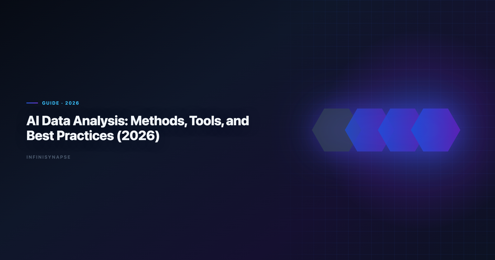
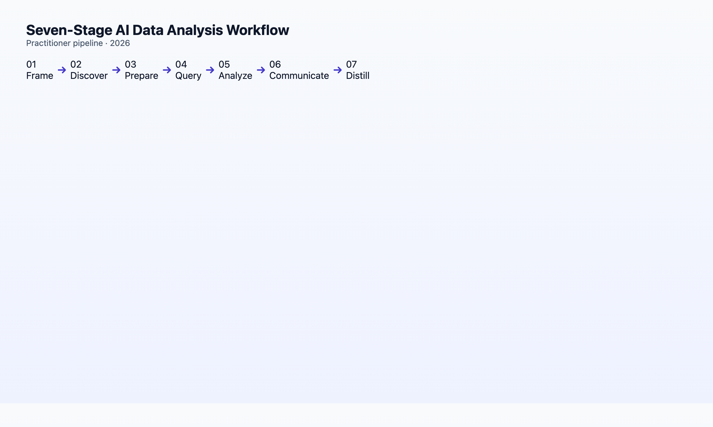

> **By the InfiniSynapse Data Team** · **Last updated: 2026-06-08** · *We build an AI-native data analysis platform; this guide synthesizes methods, tools, and workflows from 18+ months of production agent deployments and Q1–Q2 2026 benchmarks.*



**Meta Description**: AI data analysis in 2026: methods, tools, workflow stages, and best practices. From descriptive stats to AI-native agents — a practitioner's guide. (157 chars).

Analysts wiring Native into production reviews can follow the parallel walkthrough in [What Is an AI-Native Data Platform? (2026 Buyer's…](/blog/ai-native-data-platform).

**Slug**: `/blog/ai-data-analysis`

**Target keyword**: `ai data analysis`

---

## Table of Contents

1. [TL;DR](#tldr)
3. [Five Core Analysis Methods AI Automates](#five-core-analysis-methods-ai-automates)
4. [The 2026 Tool Landscape](#the-2026-tool-landscape)
5. [End-to-End Workflow: Seven Stages](#end-to-end-workflow-seven-stages)
6. [Best Practices That Survive Production](#best-practices-that-survive-production)
7. [AI-Enabled vs AI-Native: Which Workflow?](#ai-enabled-vs-ai-native-which-workflow)
8. [Industry Patterns](#industry-specific-ai-data-analysis-patterns)
9. [Measuring Success](#measuring-success-kpis-for-ai-data-analysis-programs)
10. [Common Failure Modes](#common-failure-modes-in-ai-data-analysis-pilots)
11. [FAQ](#frequently-asked-questions)
12. [Conclusion](#conclusion)
---

## TL;DR

> **AI data analysis** in 2026 spans five methods — descriptive, exploratory, diagnostic, predictive, and prescriptive — executed through two workflow paradigms: **AI-enabled** copilots (one instruction at a time) and **AI-native** agents (one goal, autonomous multi-step execution with memory). The highest-volume use cases today are descriptive and exploratory work on structured data; the highest-ROI shift is recurring diagnostic analysis where agents compound institutional knowledge over 12 months. This guide maps methods → tools → a seven-stage workflow → production best practices.

**Who this is for**: analysts, data scientists, PMs, and team leads adopting AI for analytical work — whether your first question is "can ChatGPT do this?" or "how do we deploy agents at scale?". LLM-backed analytics should account for prompt-injection and data-exfiltration risks in the [Google Cloud architecture framework](https://cloud.google.com/architecture/framework), especially when connectors expose production schemas. Regulated rollouts often anchor access reviews to [Wikipedia ETL overview](https://en.wikipedia.org/wiki/Extract,_transform,_load) when credentials, retention policies, and audit logs are in scope.

The credential, preflight, and SQL-trace pattern above also applies to this topic—see [AI Data Analyst: Role, Tools, and Workflow in 2026](/blog/ai-data-analyst) for source-specific steps.

**What you'll learn**:

- A precise 2026 definition of AI data analysis (not generic "AI for data")
- Five analysis methods and which AI tools handle each best today
- A seven-stage workflow from question framing through governance
- Seven best practices that separate pilots from production
- When to choose copilot vs data agent architecture

**Scope note**: This guide covers analysis *execution* — not dashboard design (Tableau, Power BI layout) or ML model training pipelines (MLOps). Those are adjacent disciplines.

---

## What This Discipline Means in 2026

> **Key Definition**: **AI data analysis** is the use of large language models and agentic systems to plan, execute, and interpret multi-step analytical work on structured and semi-structured data — including SQL generation, statistical computation, visualization, and narrative synthesis — with varying degrees of human oversight and automation.

Three layers matter in 2026:

| Layer | What it does | Example |
|-------|--------------|---------|
| **Copilot** | Assists one step | "Write SQL for monthly active users" |
| **Agent** | Executes a goal | "Produce the monthly KPI pack with YoY deltas" |
| **Memory** | Compounds across runs | "Recall April baseline; run on May data" |

The [Wikipedia data quality overview](https://en.wikipedia.org/wiki/Data_quality) documents rapid adoption of AI for knowledge work alongside trust gaps — in data analysis, trust tracks auditability and consistency, not raw accuracy.

For category definitions (augmented analytics vs AI-native), see [AI-Native vs Augmented Analytics](/blog/ai-native-vs-augmented-analytics).

---

## Five Core Analysis Methods AI Automates

| Method | Question type | AI maturity (2026) | Best tool category |
|--------|---------------|-------------------|-------------------|
| **Descriptive** | What happened? | High — reliable | Copilot or agent |
| **Exploratory** | What patterns exist? | High — reliable | Copilot (files) or agent (warehouse) |
| **Diagnostic** | Why did it change? | Medium-high — sweet spot for agents | AI-native agent |
| **Predictive** | What will happen? | Medium — needs human validation | Copilot + DS tools |
| **Prescriptive** | What should we do? | Low-medium — judgment-heavy | Human-led, AI-assisted |

**1. Descriptive analysis**

Summaries, distributions, period-over-period comparisons. AI removes tedium: profiling, `GROUP BY`, chart selection.

> **Hands-on note**: On a 12-table e-commerce schema, modern text-to-SQL hits correct headline metrics on the first try in ~80% of attempts in our Q2 2026 benchmark. Failures cluster around ambiguous date grains and role-playing dimensions.

### 2. Exploratory analysis

Pattern discovery without a fixed hypothesis. AI copilots excel on uploaded CSVs; agents excel when exploration must join warehouse tables the user does not know by name.

### 3. Diagnostic analysis

Root-cause and contribution analysis — *why did churn spike?* This is where **multi-step agents** pull ahead of single-turn copilots: the agent can branch hypotheses, test each, and synthesize.

### 4. Predictive analysis

Forecasting and classification. AI drafts features and baseline models; humans must validate leakage, stationarity, and business sense.

### 5. Prescriptive analysis

Optimization and decision recommendations. AI drafts scenarios; accountability stays human.

Technique-to-tool mapping with seven named products: [Best AI Tools for Data Analysis in 2026](/blog/best-ai-tools-for-data-analysis).

---

## The 2026 Tool Landscape

| Category | Paradigm | Examples | Best for |
|----------|----------|----------|----------|
| General copilots | AI-enabled | ChatGPT, Claude, Gemini | File upload, ad-hoc Python |
| Notebook AI | AI-enabled | Hex Magic, Jupyter AI | Analyst-led exploration |
| BI copilots | Augmented | Power BI Copilot, ThoughtSpot Sage | In-dashboard NLQ |
| Data agents | AI-native | InfiniSynapse, Fabric Data Agent (preview) | Recurring multi-source analysis |
| SQL specialists | Mixed | Snowflake Cortex, Databricks Genie | Warehouse-native queries |

**InfiniSynapse** sits in the data-agent row: InfiniAgent orchestrates goals, InfiniSQL produces named intermediate tables, InfiniRAG binds business knowledge and memory cards. Enterprise AI adoption guidance in [Shopify ecommerce analytics](https://www.shopify.com/enterprise/blog/ecommerce-analytics) mirrors the shift from ad-hoc copilots to repeatable, reviewable decision workflows.

Microsoft-specific comparison: [Fabric Data Agent vs Copilot](/blog/fabric-data-agent-vs-copilot).

---

## End-to-End Workflow: Seven Stages



### Stage 1: Frame the question

Convert a business ask into an analytical goal. Bad: *"look at the data."* Good: *"compare April vs May churn by cohort, same definitions as last month."*

If you have memory cards, reference them by name here — see [Data Agent Memory](/blog/data-agent-memory).

### Stage 2: Discover data sources

Inventory tables, files, APIs. Agents do this autonomously; copilots need schema pasted.

### Stage 3: Prepare and clean

Profiling, type coercion, null handling, deduplication. AI-native agents profile all columns before aggregating — the May 2026 lobster-moonlight case processed 7,444 rows × 22 fields in phase 1 of a five-minute run ([case reference](/blog/ai-native-data-analysis)).

### Stage 4: Query and compute

SQL, Python, or hybrid. Verify join cardinality and date semantics before production runs.

**Copy-ready prompt** (copilot mode):

```
Given this schema: [paste DDL or table list]
Question: [business question]
Requirements:
- Show SQL before executing
- Flag assumptions about NULL handling and date boundaries
- Suggest indexes if the query would full-scan
```

### Stage 5: Analyze and interpret

Beyond charts: contribution analysis, segment comparisons, anomaly investigation. Agents chain this; copilots need stepwise prompting.

### Stage 6: Communicate

Narrative + visuals + caveats. AI drafts; humans approve tone and defensibility.

### Stage 7: Distill and govern

Save locked metric definitions, schema bindings, and audit links — not just a PDF. This stage separates pilots from compounding production systems.

---

## Best Practices That Survive Production

| # | Practice | Why it matters |
|---|----------|----------------|
| 1 | **Lock metric definitions** before comparing periods | Prevents "April vs May" debates caused by definition drift |
| 2 | **Require audit trails** for any number that reaches executives | Trust scales with provenance |
| 3 | **Review SQL on production** — always | AI does not know your indexes or row counts |
| 4 | **Separate exploratory from recurring** workflows | Copilots for explore; agents + memory for recurring |
| 5 | **Run a 3-question AI-native test** before agent procurement | [Test details](/blog/ai-native-vs-augmented-analytics) |
| 6 | **Treat memory as infrastructure** | Cards are assets — version, review, promote like code |
| 7 | **Keep humans accountable for framing and defense** | AI accelerates execution; judgment stays human |

[Apache Spark documentation](https://spark.apache.org/docs/latest/) consistently flags governance and change management — not model accuracy — as the top barrier to production AI analytics.

---

## AI-Enabled vs AI-Native: Which Workflow?

| Signal | Choose AI-enabled copilot | Choose AI-native data agent |
|--------|---------------------------|----------------------------|
| Work pattern | One-off, exploratory | Recurring, same definitions |
| Data location | Files, ad-hoc uploads | Warehouse + multiple sources |
| User skill | Analyst drives each step | Goal submitter (PM, exec, analyst) |
| Memory need | Low | High — 12-month compounding |
| Entry points | One UI sufficient | Chat + web + API needed |

Most teams need **both**: copilots for speed on novel questions; agents for institutional recurring work.

Full five-pillar primer: [AI-Native Data Analysis: What It Means in 2026](/blog/ai-native-data-analysis).

---

## Industry-Specific Patterns

| Industry | High-volume **AI data analysis** use case | Non-negotiable control |
|----------|------------------------------------------|------------------------|
| **SaaS / product** | Weekly retention, funnel, feature adoption | Cohort definition locking |
| **E-commerce** | Merchandising, basket, promo lift | Returns/exchange handling in revenue |
| **Finance / fintech** | Portfolio risk, compliance reporting | Audit trail per published number |
| **Healthcare** | Operational throughput (not diagnosis) | PHI boundaries, de-identification |
| **Agencies** | Client baseline packs | Tenant-isolated memory cards |

In SaaS, **AI data analysis** pilots succeed when product managers submit goals directly — *"compare trial-to-paid by acquisition channel, same definition as Q1 board deck"* — and analysts review audit trails before Slack distribution. Skipping definition locking produces the same arguments as manual SQL, just faster.

Finance teams prioritize Stage 7 (distill and govern) on day one. A **AI data analysis** workflow without memory cards fails regulatory follow-up when an examiner asks why March revenue differed from February's filing.

---

## Measuring Success: KPIs for Programs

| KPI | Baseline (manual) | Target (12 mo) | Notes |
|-----|-------------------|----------------|-------|
| Time-to-deliverable (recurring reports) | Hours | −60–80% | Memory recall drives most gains |
| Definition drift incidents / quarter | Count | −90% | Locked cards |
| Executive escalations on "wrong number" | Count | Flat or down | Audit trails reduce rework |
| Analyst hours on context re-explanation | Hours/month | −85% | See [memory guide](/blog/data-agent-memory) |
| Reusable analysis assets | 0 | 50–100 cards | Compounding metric |
| New hire time-to-first solo recurring report | Weeks | Days | Onboarding proxy |

Report **AI data analysis** ROI monthly to leadership with one recurring workflow — not aggregate "AI savings." Stakeholders trust a single traced example (*"June KPI pack: 14 min agent, 12 sec human input, full audit link"*) more than platform-wide percentages.

Pair quantitative KPIs with qualitative trust surveys. The [W3C WCAG accessibility standard](https://www.w3.org/TR/WCAG21/) shows adoption rising while trust diverges — **AI data analysis** programs that publish provenance weekly close that gap faster than programs that hide the agent behind a PDF.

---

## Common Failure Modes in Pilots

**1. Pilot on exploratory work only** — Copilots win here; agents never compound. Start **AI data analysis** on a recurring report.

**2. No metric-definition ceremony** — Skipping Stage 1 framing guarantees Stage 6 arguments. **AI data analysis** without locked definitions is faster chaos.

**3. Accuracy theater** — Optimizing single-query benchmarks while ignoring audit trails. Executives reject **AI data analysis** outputs they cannot trace.

**4. Tool sprawl without workflow design** — ChatGPT for files, Power BI Copilot for dashboards, a third agent for warehouse — no memory layer connects them. Consolidate **AI data analysis** execution where distillation lives.

**5. Missing human accountability** — PMs submit goals; nobody reviews SQL before board meetings. **AI data analysis** amplifies execution; judgment stays human.

**6. Buying augmented, expecting native** — See [AI-Native vs Augmented Analytics](/blog/ai-native-vs-augmented-analytics). Month-six disappointment is a category error, not a vendor betrayal.

Recover by resetting one workflow: lock definitions, run seven stages, distill a card, recall next month. **AI data analysis** compounding is visible in week five, not week one. Mature **ai data analysis** teams publish one traced example monthly so leadership sees evidence, not slogans.

---

SLO tracking for analytics agents can borrow [AWS Well-Architected Framework](https://docs.aws.amazon.com/wellarchitected/latest/framework/welcome.html) patterns for latency, error budgets, and alert routing.

Document-store connectors should follow [UK NCSC AI development guidelines](https://www.ncsc.gov.uk/collection/guidelines-secure-ai-system-development) for read scopes, aggregation safety, and schema discovery.

Azure-centric stacks should reference the [ENISA AI cybersecurity framework](https://www.enisa.europa.eu/publications/multilayer-framework-for-good-cybersecurity-practices-for-ai) when placing analytics agents beside data services.

Operational maturity for analytics agents aligns with the [Wikipedia conceptual data model overview](https://en.wikipedia.org/wiki/Conceptual_data_model), especially around monitoring, rollback, and ownership.

## Frequently Asked Questions

### What is the best AI for data analysis in 2026?

There is no single best tool. ChatGPT and Claude lead for file exploration. Power BI Copilot leads for in-dashboard NLQ. Data agents like InfiniSynapse lead for recurring multi-source analysis with memory distillation. Match tool to workflow paradigm.

### Can AI do statistical analysis correctly?

Yes for standard descriptive and exploratory statistics on clean data. Always verify assumptions for inferential tests. Predictive modeling requires human validation.

### How do I start with analytics?

Pick one recurring monthly report, document metric definitions manually once, then pilot an agent on the same goal. Expand from one workflow, not from AI everywhere.

### Is analytics the same as data science?

### What skills do analysts need in 2026?

SQL literacy, metric-definition discipline, audit-trail review, and prompt/goal framing. Less manual chart formatting; more governance and judgment.

If this topic is in scope for your team, reuse the same memory-and-trace checklist in [AI for Data Analysis: The Complete 2026 Guide](/blog/ai-for-data-analysis).

### How does natural language to SQL fit in?

Text-to-SQL is one capability inside the workflow — typically the query stage. Multi-step planning, cleaning, interpretation, and memory distinguish agents from SQL generators.

---

## Conclusion
**AI data analysis** in 2026 is not a single tool purchase. It is a workflow design choice: copilot-accelerated sessions that reset, or agent-driven runs that compound.

Start with one recurring analysis. Lock definitions. Demand audit trails. Evaluate memory before autonomy demos. The methods and tools will keep improving; institutional knowledge is what your competitors cannot copy. Treat **AI data analysis** as a program with KPIs and governance — not a one-time Copilot license — and compounding returns show up in month three, not demo day.

**Continue in this cluster**:

| Article | URL |
|---------|-----|
| [Best AI Tools for Data Analysis](/blog/best-ai-tools-for-data-analysis) | /blog/best-ai-tools-for-data-analysis |
| [AI-Native Data Analysis primer](/blog/ai-native-data-analysis) | /blog/ai-native-data-analysis |
| [Data Agent Memory](/blog/data-agent-memory) | /blog/data-agent-memory |
| [Data Agent Glossary](/blog/data-agent-glossary) | /blog/data-agent-glossary |
| [Natural Language to SQL](/blog/natural-language-to-sql) | /blog/natural-language-to-sql |

**Try it**: [InfiniSynapse](https://app.infinisynapse.cn) — run one recurring analysis through all seven workflow stages.