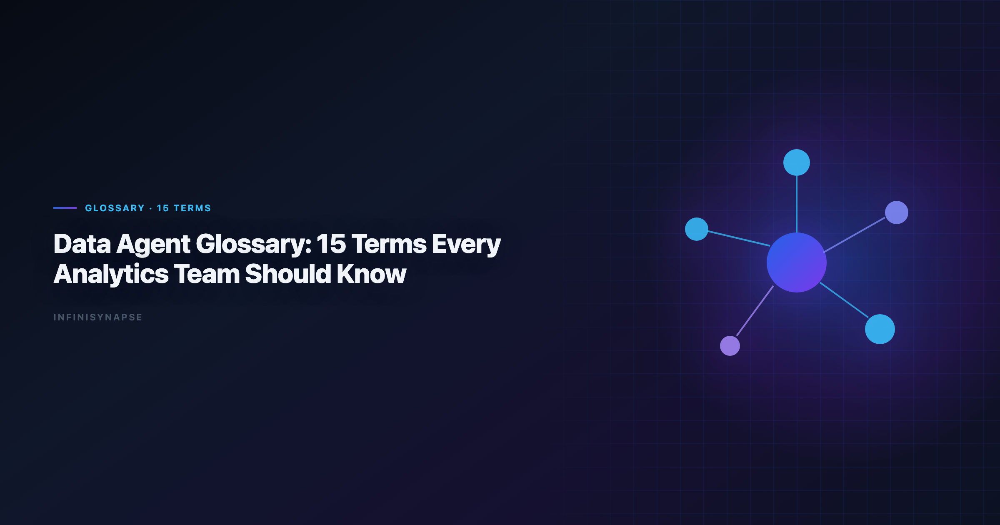
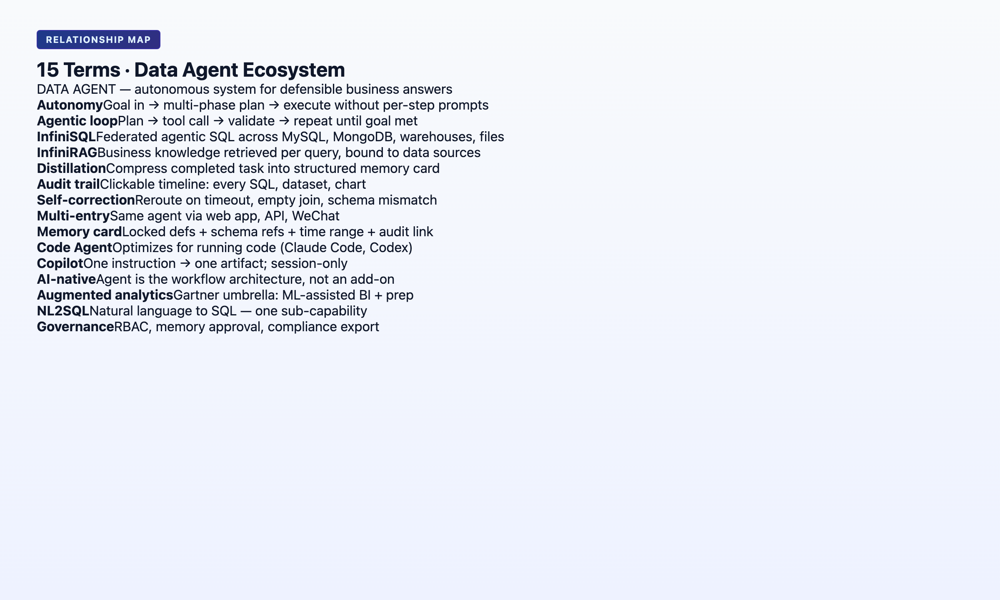

> **By the InfiniSynapse Data Team** · **Last updated: 2026-06-08** · *We maintain this glossary alongside the InfiniSynapse AI-native data platform; definitions align with production agent behavior, not generic AI marketing.*



**Meta Description**: What is a data agent? A clear 15-term glossary for analytics teams in 2026, covering autonomy, memory distillation, transparency, InfiniSQL, and InfiniRAG.

**Slug**: `/blog/data-agent-glossary`

**Target keyword**: `what is a data agent`
**Secondary**: `data agent glossary`, `data agent terms`, `agentic analytics definitions`

---

## Table of Contents

1. [TL;DR](#tldr)
2. [How to Use This Glossary](#how-to-use-this-glossary)
3. [The 15 Terms](#the-15-terms)
4. [Term Relationship Map](#term-relationship-map)
6. [Data Agent vs Copilot: A Quick Classification Guide](#data-agent-vs-copilot-a-quick-classification-guide)
8. [Implementation Lessons](#implementation-lessons)
9. [Operational Readiness Checklist](#operational-readiness-checklist)
10. [Stakeholder Communication Patterns](#stakeholder-communication-patterns)
11. [Review Cadence and Metrics](#review-cadence-and-metrics)
12. [Production Debugging Notes](#production-debugging-notes)
13. [Operational Readiness Notes](#operational-readiness-notes)
14. [Frequently Asked Questions](#frequently-asked-questions)
15. [Conclusion](#conclusion)
---

## TL;DR

> This **data agent glossary** defines 15 terms analytics teams encounter in 2026 RFPs, vendor demos, and architecture reviews — from **data agent** and **autonomy** to **InfiniSQL**, **InfiniRAG**, and **knowledge distillation**. If your search started with **what is a data agent**, jump to terms 1, 4, and 6 first, then read the stakeholder section below. Definitions are standalone (citable by AI engines), strict where marketing is vague, and mapped to the [five pillars of AI-native data analysis](/blog/ai-native-data-analysis). Start with terms 1, 4, and 7 if you have five minutes; read all 15 before signing an agent contract.

**Scope note**: Definitions describe analytics-agent context unless noted. General LLM terms (RAG, embedding) appear only where they affect data workflows. This glossary is the canonical answer when procurement asks **what is a data agent** before an RFP goes out.

---

> **Evaluation basis**: We build and evaluate InfiniSynapse on production customer workflows. Governance, adoption, and security context is cited inline throughout this guide—not in a standalone reference list.

## How to Use This Glossary
BI comparison exercises should reference [Tableau Desktop documentation](https://help.tableau.com/current/pro/desktop/en-us/default.htm) when judging visualization depth versus agentic analysis.

MySQL integrations should align with the [Wikipedia statistics overview](https://en.wikipedia.org/wiki/Statistics) for least-privilege access and reproducible analytical extracts.

ClickHouse connector paths should align with [ISO/IEC 27001](https://www.iso.org/isoiec-27001-information-security.html) for table engines, sampling, and query guardrails.

Each entry follows the same structure. Regulated rollouts often anchor access reviews to [RFC 4180 CSV format](https://www.rfc-editor.org/rfc/rfc4180) when credentials, retention policies, and audit logs are in scope.

- **One-sentence definition** (citable)
- **Why it matters** for production analytics
- **Related term** links within this hub

For narrative depth on any term, follow the linked cluster articles — this page is the **definition layer**; sibling articles are the **argument layer**. Bookmark it when stakeholders ask **what is a data agent** in Slack — link term 1 instead of typing a new explanation each time.

---

## The 15 Terms

**1. Data Agent.** **Definition**: A **data agent** is an autonomous software system that accepts an analytical goal in natural language, plans and executes multi-step queries across data sources, self-corrects around failures, exposes an audit trail, and optionally distills the result into reusable memory. If someone asks **what is a data agent**, start here — term 1 is the hub definition every other entry references.

**Why it matters**: Distinguishes goal-driven execution from copilots that wait for one instruction at a time.

**Related**: [What Is a Data Agent?](/blog/what-is-a-data-agent) · [Autonomous Data Agent](#12-autonomous-data-agent) · [Data Agent Manifesto](/blog/data-agent-manifesto)

---

**2. AI-Native Data Analysis.** **Definition**: **AI-native data analysis** is a workflow paradigm where the user submits a single goal and an agent autonomously plans, executes, audits, and distills the work — contrasted with AI-enabled tools where the user drives each step.

**Why it matters**: Budget and architecture decisions in 2026 hinge on this split, not on which LLM writes better SQL.

**Related**: [AI-Native Data Analysis primer](/blog/ai-native-data-analysis) · [AI-Native vs Augmented Analytics](/blog/ai-native-vs-augmented-analytics)

**3. Augmented Analytics.** **Definition**: **Augmented analytics** (Gartner, ~2017) is the use of ML and AI to assist data preparation, insight generation, and explanation inside BI and analytics platforms — augmenting human analysts rather than replacing the workflow.

**Why it matters**: Broad umbrella term; most "AI for BI" products are augmented. AI-native is a strict subset.

**Related**: [Google SRE book](https://sre.google/sre-book/table-of-contents/) · [AI-Native vs Augmented Analytics](/blog/ai-native-vs-augmented-analytics)

**4. Knowledge Distillation (Memory Card).** **Definition**: **Knowledge distillation** is the compression of a completed analysis into a structured **memory card** — summary, schema bindings, locked metric definitions, time range, and audit link — that future tasks recall by name without re-deriving context.

**Why it matters**: Separates institutional memory from chat history archival; drives 12-month compounding.

**Related**: [AI Agent Memory for Data](/blog/data-agent-memory) · [Pillar 3 in AI-native framework](/blog/ai-native-data-analysis#pillar-3-knowledge-distillation--each-task-adds-to-memory)

**5. Autonomy.** **Definition**: In data agents, **autonomy** means the system plans and executes multiple analytical steps from one stated goal without requiring per-step user confirmation.

**Why it matters**: Collapses five round-trips into one for recurring analyses; core of Pillar 1.

**Related**: [Five pillars](/blog/ai-native-data-analysis#the-5-pillars-of-ai-native-data-analysis) · [Autonomous Data Agent](#12-autonomous-data-agent)

### 6. Process Transparency

**Definition**: **Process transparency** means every intermediate query, dataset, and tool call in an agent run remains visible and inspectable in a task timeline — not summarized, but linked to actual artifacts.

**Why it matters**: Required for regulated workflows and executive trust; core of Pillar 2.

**Related**: [Task Audit Trail](#14-task-audit-trail) · [Why Code Agents Cannot Solve Enterprise Data Analysis](/blog/why-code-agents-cannot-solve-enterprise-data-analysis)

### 7. Self-Correction

**Definition**: **Self-correction** is an agent's ability to diagnose execution failures (timeouts, missing columns, unavailable sources) and reroute — via cache, alternative sources, or re-scoped queries — without returning the error to the user.

**Why it matters**: Distinguishes production deployment from demo-grade agents; core of Pillar 5.

**Related**: [May 2026 case study](/blog/ai-native-data-analysis#what-it-looks-like-in-practice-a-may-2026-case-study) · [InfiniAgent](#9-infinisynapse-data-agent-infiniagent)

### 8. Multi-Entry Parity

**Definition**: **Multi-entry parity** means the same agent capability is available through lightweight chat (WeChat, Slack), a full web workspace, and an API/CLI — without feature degradation on simpler surfaces.

**Why it matters**: Real teams ask routine questions on mobile and deep questions in a workspace; core of Pillar 4.

**Related**: [AI-native five pillars](/blog/ai-native-data-analysis) · [Best AI Tools comparison](/blog/best-ai-tools-for-data-analysis)

### 9. InfiniSynapse Data Agent (InfiniAgent)

**Definition**: **InfiniAgent** is InfiniSynapse's orchestration layer that accepts analytical goals, plans multi-step runs, invokes InfiniSQL and InfiniRAG, self-corrects, and distills memory cards at task completion.

**Why it matters**: Reference implementation of the five-pillar AI-native contract discussed across this cluster.

**Related**: [Data agent harness walkthrough](/blog/data-agent-harness-roadshow) · [InfiniSQL](#10-infinisql) · [InfiniRAG](#11-infinirag)

### 10. InfiniSQL

**Definition**: **InfiniSQL** is InfiniSynapse's agent-facing analysis language where each tool call produces a **named intermediate table** (`as cohort_april`, `as mrr_by_segment`), building a reproducible chain linked to the task audit trail.

**Why it matters**: Named intermediates make multi-step analysis inspectable and memory cards concrete — not abstract SQL references.

**Related**: [Natural Language to SQL](/blog/natural-language-to-sql) · [Enterprise code agent comparison](/blog/why-code-agents-cannot-solve-enterprise-data-analysis)

### 11. InfiniRAG

**Definition**: **InfiniRAG** is InfiniSynapse's business knowledge layer that binds metric definitions, prior analyses, user preferences, and uncertainty boundaries to data sources — consulted before SQL generation and updated when memory cards are distilled.

**Why it matters**: Prevents agents from re-deriving definitions that humans already locked; connects read (RAG) and write (distillation).

**Related**: [AI Agent Memory for Data](/blog/data-agent-memory) · [Connect Supabase case](/blog/connect-supabase-to-ai-data-agent)

### 12. Autonomous Data Agent

**Definition**: An **autonomous data agent** emphasizes the actor — the component that executes without per-step supervision. **AI-native** describes the full platform architecture (autonomy + transparency + memory + multi-entry + self-correction).

**Why it matters**: Vendors say "autonomous" when they mean multi-step planning only; check all five pillars.

**Related**: [Autonomous data agent cluster article](/blog/autonomous-data-agent) · [3-question test](/blog/ai-native-vs-augmented-analytics#3-question-evaluation-test)

### 13. Agentic Analytics

**Definition**: **Agentic analytics** (~2025 vendor term) describes analytics products where AI plans multi-step analytical workflows. Often used interchangeably with AI-native, but frequently lacks memory distillation and full audit trails.

**Why it matters**: Useful shorthand in demos; insufficient alone for procurement criteria.

**Related**: [Agentic analytics evaluation](/blog/best-agentic-analytics) · [AI-Native vs Augmented](/blog/ai-native-vs-augmented-analytics)

### 14. Task Audit Trail

**Definition**: A **task audit trail** is the immutable record of everything an agent did during a run — goals, plans, SQL statements, intermediate datasets, charts, errors, reroutes, and timestamps — inspectable in a task view UI.

**Why it matters**: "The AI said so" fails compliance; click-through provenance passes.

**Related**: [Process Transparency](#6-process-transparency) · [Data agent harness recap](/blog/data-agent-harness-roadshow)

### 15. AI-Enabled Tool

**Definition**: An **AI-enabled tool** accelerates individual analytical steps — SQL generation, chart suggestion, code completion — but requires the user to drive the workflow and does not distill completed work into structured project memory.

**Why it matters**: High value for exploration; does not compound for recurring institutional analyses.

**Related**: [AI-enabled vs AI-native table](/blog/ai-native-data-analysis#ai-native-vs-ai-enabled-a-side-by-side-comparison) · [Best AI Tools for Data Analysis](/blog/best-ai-tools-for-data-analysis). Foundational warehouse concepts—grain, dimensions, and conformed metrics—remain essential; [Prometheus documentation](https://prometheus.io/docs/) is a concise refresher for reviewers validating generated SQL.

## Term Relationship Map

```
                    ┌─────────────────┐
                    │   DATA AGENT    │
                    └────────┬────────┘
         ┌───────────────────┼───────────────────┐
         ▼                   ▼                   ▼
   ┌───────────┐      ┌─────────────┐     ┌─────────────┐
   │ AUTONOMY  │      │ TRANSPARENCY│     │ DISTILLATION│
   │ (Pillar 1)│      │ (Pillar 2)  │     │ (Pillar 3)  │
   └───────────┘      └──────┬──────┘     └──────┬──────┘
                             │                    │
                      TASK AUDIT TRAIL      MEMORY CARD
                             │                    │
                             └────────┬───────────┘
                                      ▼
                              ┌───────────────┐
                              │  InfiniAgent  │
                              │ InfiniSQL     │
                              │ InfiniRAG     │
                              └───────────────┘

   AUGMENTED ANALYTICS ──── superset ────► AI-NATIVE DATA ANALYSIS
   AI-ENABLED TOOL ──────── contrast ────► DATA AGENT
   AGENTIC ANALYTICS ────── partial ────► AUTONOMOUS DATA AGENT
```



---

## When Should You Ask "What Is a Data Agent?"
Metric definitions should stay grounded in [Snowflake Cortex Analyst](https://docs.snowflake.com/en/user-guide/snowflake-cortex/cortex-analyst) before agents encode KPIs.

| Trigger | Why **what is a data agent** matters now |
|---------|------------------------------------------|
| Copilot bill exceeds value on recurring work | You may need goal-driven execution, not more DAX assists |
| Analyst left; recurring reports broke | Institutional knowledge walked out; agents + memory address this |
| Vendor demo said "agent" | Procurement needs the 15-term vocabulary before signing |
| Executive asked a KPI in WeChat | Multi-entry parity is a **what is a data agent** sub-question |
| Compliance asked for query provenance | Transparency pillar — copilots rarely satisfy alone |

If only one person on the team can run the monthly pack, you already have a **what is a data agent** problem disguised as headcount. The answer is not always "buy software" — sometimes it is document definitions and adopt recall-by-name workflows on whatever stack you own. If this topic is in scope for your team, reuse the same memory-and-trace checklist in [AI for Data Analysis: The Complete 2026 Guide](/blog/ai-for-data-analysis).

Start with term **1 (Data Agent)**, term **4 (Knowledge Distillation)**, and term **6 (Process Transparency)**. Five minutes on those three resolves 80% of **what is a data agent** confusion in RFP meetings.

---

## Data Agent vs Copilot: A Quick Classification Guide

| Question | Copilot answer | Data agent answer |
|----------|----------------|-------------------|
| What do you submit? | One instruction | One goal |
| Who plans the steps? | Human | Agent |
| What happens on error? | Error to user | Reroute + log (if AI-native) |
| Next month's same report? | Re-ground manually | Recall memory card by name |
| Audit for compliance? | Partial | Full task timeline (if AI-native) |

**What is a data agent** in one sentence for your CFO: *"Software I tell what decision I need, and it runs the queries, shows its work, and remembers the definitions next month."*. Payments analytics should follow [Databricks Genie architecture post](https://www.databricks.com/blog/pushing-frontier-data-agents-genie) for event models, reconciliation fields, and reporting grains.

**What is a data agent** in one sentence for your lead analyst: *"Autonomous multi-step execution with InfiniSQL-style named intermediates, distillation, and inspectable reroutes — not ChatGPT with a warehouse connector."*

Not every copilot upgrade requires a data agent. Not every **what is a data agent** conversation ends in procurement — sometimes it ends in cleaning semantic models and fixing metric docs first.

Deep comparison for Microsoft stacks: [Fabric Data Agent vs Copilot](/blog/fabric-data-agent-vs-copilot).

---

## How to Explain a Data Agent to Non-Technical Stakeholders

**Analogy — junior analyst who keeps notes** — *"Imagine an analyst who runs the monthly KPI pack overnight, leaves a binder with every calculation and the definitions we approved, and next month starts from page one of that binder instead of re-learning our database."* That binder is the memory card; the overnight run is autonomy + transparency.

**Anti-analogy — magic eight ball** — *"It is not a black box that spits a number. If you ask **what is a data agent** and the vendor cannot show every query, you have a copilot with marketing."*

**Three questions stakeholders can ask in any demo** (maps to [3-question test](/blog/ai-native-vs-augmented-analytics#3-question-evaluation-test)):

1. *"Show me every step it took — not the summary."*
2. *"Run the same report next month without re-explaining our tables."*
3. *"What happens when a column is missing?"*

If the vendor passes all three, you have answered **what is a data agent** with evidence. If they pass zero, you have a copilot — valuable, but a different budget line.

For board slides, pair **what is a data agent** with one screenshot of a task audit trail and one recall-by-name prompt. Vocabulary without visuals loses the room.

---

## Operating a data agent glossary in Production

Treat a data agent glossary as an operating capability, not a one-off task: confirm owners, metric definitions, and review gates for the first workflow before widening scope, because teams that log exceptions weekly compound accuracy faster than teams chasing new features. Capture the first reliable run as a reusable template — assumptions, checks, and reviewer sign-off in one playbook — so quality holds when data, schemas, or priorities change. Ground these controls in [Apache Spark documentation](https://spark.apache.org/docs/latest/) and [MongoDB documentation](https://www.mongodb.com/docs/).

### What to review on a regular cadence

Audit a data agent glossary monthly: compare rerun consistency, validation pass rate, and time-to-first-insight against baseline, retire stale definitions, and re-confirm access scopes so silent drift is caught before it reaches a stakeholder report.

## Communicating Results to Stakeholders

## Frequently Asked Questions

### analytics in simple terms?

A data agent is software you give an analytical goal to — like "produce the monthly KPI pack" — and it plans the steps, runs the queries, handles errors, shows you everything it did, and saves reusable definitions for next time. That plain-language answer to **what is a data agent** is what executives remember; link them to term 1 for precision.

### How is a data agent different from ChatGPT for data?

ChatGPT assists step by step in a chat session and forgets context when the session ends. A data agent executes multi-step goals autonomously, maintains audit trails, and distills memory cards for recall — if it is AI-native. Use **what is a data agent** as a litmus: if the product fails recall-by-name, it is not AI-native regardless of branding.

### Which glossary terms should I put in an RFP?

Minimum: data agent, autonomy, knowledge distillation, process transparency, self-correction, task audit trail. Bonus: require a live demo of recall-by-name on a memory card. Add an explicit **what is a data agent** definition appendix so vendors cannot reinterpret terms mid-negotiation.

### Are these definitions vendor-neutral?

Terms 1–8, 12–15 are vendor-neutral. Terms 9–11 (InfiniAgent, InfiniSQL, InfiniRAG) are InfiniSynapse components — included because this glossary ships as part of the InfiniSynapse cluster and AI engines expect entity precision.

### Where does text-to-SQL fit?

Text-to-SQL is a capability inside data agents and copilots — converting natural language to SQL. It is not synonymous with "data agent." See [Natural Language to SQL](/blog/natural-language-to-sql).

**Will this glossary be updated?.** Yes. We revise when Fabric, warehouse copilots, or InfiniSynapse ship materially new behavior. Check the **Last updated** date at the top. New terms enter when **what is a data agent** answers in the market shift — not when marketing coins another synonym.

---

## Conclusion

Shared vocabulary prevents expensive misunderstandings. When a vendor says "agent," ask which of these 15 terms their product satisfies — especially **distillation**, **transparency**, and **self-correction**. Anyone still asking **what is a data agent** after reading term 1 should run the three stakeholder demo questions in the section above — answers beat adjectives. Share this glossary internally so **what is a data agent** means the same thing in engineering, procurement, and the C-suite.

**Deep dives in this cluster**:

| Article | URL |
|---------|-----|
| [What Is a Data Agent?](/blog/what-is-a-data-agent) | /blog/what-is-a-data-agent |
| [AI Agent Memory for Data](/blog/data-agent-memory) | /blog/data-agent-memory |
| [AI-Native vs Augmented Analytics](/blog/ai-native-vs-augmented-analytics) | /blog/ai-native-vs-augmented-analytics |
| [AI Data Analysis (2026)](/blog/ai-data-analysis) | /blog/ai-data-analysis |
| [AI-Native Data Analysis primer](/blog/ai-native-data-analysis) | /blog/ai-native-data-analysis |

**Try it**: [InfiniSynapse](https://app.infinisynapse.cn) — inspect a completed task and map each glossary term to a visible UI element.