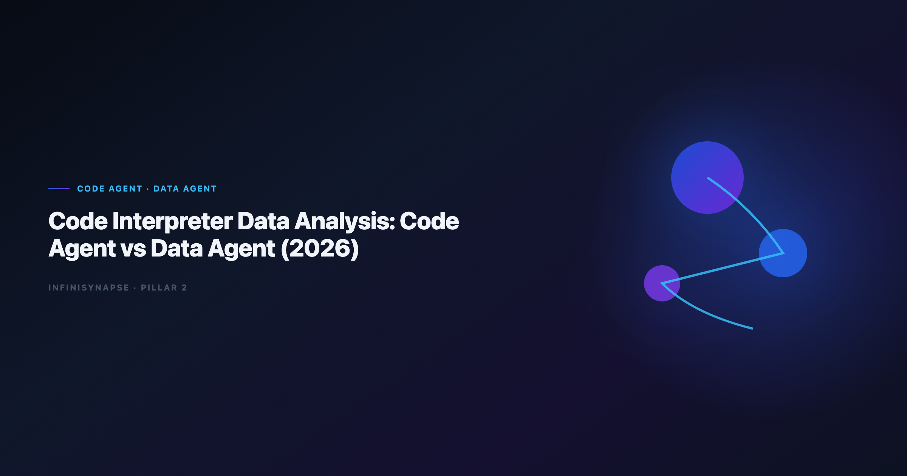

> **By the InfiniSynapse Data Team** · **Last updated: 2026-06-12** · *We build InfiniSynapse, a Data Agent platform. This comparison reflects production deployments where teams moved from Code Interpreter-style sandboxes to governed agent stacks.*

**Meta Description**: Code interpreter data analysis in 2026: compare Code Agent vs Data Agent on governance, repeatability, audit trails, and production rollout fit for analyst.

**Slug**: `/blog/code-agent-vs-data-agent`

**Target keyword**: `code interpreter data analysis`
**Secondary**: `code agent vs data agent`, `chatgpt code interpreter enterprise`, `data agent architecture`

---

## Table of Contents

1. [TL;DR](#tldr)
2. [Why This Comparison Matters in 2026](#why-this-comparison-matters-in-2026)
3. [Definitions: Code Agent vs Data Agent](#definitions-code-agent-vs-data-agent)
4. [Six-Dimension Comparison Framework](#six-dimension-comparison-framework)
5. [Head-to-Head Scorecard](#head-to-head-scorecard)
6. [When a Code Agent Is the Right Fit](#when-a-code-agent-is-the-right-fit)
7. [When a Data Agent Is the Right Fit](#when-a-data-agent-is-the-right-fit)
8. [Enterprise Deployment Patterns](#enterprise-deployment-patterns)
9. [30-Day Evaluation Playbook](#30-day-evaluation-playbook)
10. [Procurement Checklist](#procurement-checklist)
11. [Frequently Asked Questions](#frequently-asked-questions)
12. [Conclusion](#conclusion)

---

## TL;DR

> **Code interpreter data analysis** through a Code Agent excels when the goal is to run Python on uploaded files and iterate fast in a sandbox. A **Data Agent** excels when the goal is a defensible business answer across governed sources — with inspectable SQL, locked metric definitions, and memory that compounds month over month. In 2026, most enterprise teams keep Code Agents for engineering velocity and adopt Data Agents for recurring KPI work, compliance-sensitive reporting, and multi-source discovery.

**Who this is for**: analytics leads, data engineers, and procurement reviewers deciding whether interpreter-style tooling or a governed Data Agent should own production **code interpreter data analysis** workloads.

**What you will learn**:

- A six-dimension framework for comparing agent types
- A weighted scorecard with percentage readiness bands
- Three deployment patterns we see in customer rollouts
- A 30-day playbook to validate both approaches on the same business question

**Scope note**: For a definitional baseline on the Data Agent category, start with [What Is a Data Agent?](/blog/what-is-a-data-agent). For vendor shortlists beyond these two agent types, see [Code Interpreter Alternatives for Enterprise Teams](/blog/code-interpreter-alternatives).

---

> **Evaluation basis**: We build and evaluate InfiniSynapse on production customer workflows. Governance, adoption, and security context is cited inline throughout this guide—not in a standalone reference list.

## Why This Comparison Matters in 2026
[Google Cloud architecture framework](https://cloud.google.com/architecture/framework) shows how warehouse-native semantic layers change NL2SQL grounding expectations for analyst-facing products.

ChatGPT Code Interpreter normalized **code interpreter data analysis** for millions of users: upload a file, ask a question, get a chart in minutes. Engineering teams then asked why the same pattern could not run every Monday against the warehouse. That question exposed an objective-function split — Code Agents optimize for *making code run*; Data Agents optimize for *defensible answers*.

Adoption benchmarks in the [pandas documentation](https://pandas.pydata.org/docs/) track the same shift from pilot demos to governed analytics loops we see in customer rollouts. LLM-backed analytics should account for prompt-injection and data-exfiltration risks in the [NIST SP 800-53 security controls](https://csrc.nist.gov/pubs/sp/800/53/r5/final), especially when connectors expose production schemas. Production rollouts should align access and review controls with the [OWASP Top 10 for LLM Applications](https://owasp.org/www-project-top-10-for-large-language-model-applications/), especially when recurring queries touch live schemas.

| Signal your team is at the decision point | What it usually means |
|---|---|
| Leadership loved the demo; security blocked production | Sandbox **code interpreter data analysis** lacks governed connectors |
| One analyst can reproduce the chart; nobody else can | Session memory, not institutional memory |
| Finance asks for query lineage before trusting a number | Code Agent output lacks inspectable audit trails |
| Monthly KPIs drift between analysts | No locked metric definitions across runs |

The move from dashboard-first BI to augmented workflows—described in [OpenTelemetry documentation](https://opentelemetry.io/docs/)—frames how teams should evaluate tooling here. Teams comparing agent categories often keep [Best AI Tools for Data Analysis in 2026](/blog/best-ai-tools-for-data-analysis) beside this scorecard when they expand beyond interpreter sandboxes.

---

## Definitions: Code Agent vs Data Agent

### Code Agent

A **Code Agent** accepts a coding-oriented task, navigates files or a sandbox, writes and executes Python (or similar), and returns working artifacts — scripts, charts, cleaned datasets. Success means the code ran and tests pass. The user typically drives scope: which file, which library, which chart type.

Typical surfaces: IDE copilots, notebook agents, ChatGPT Advanced Data Analysis, autonomous coding agents with tool access.

### Data Agent

A **Data Agent** accepts a business question as its goal, discovers relevant assets across an enterprise estate, resolves which metric definitions to trust, executes multi-step verifiable analysis, surfaces an inspectable audit trail, and distills completed work into reusable memory. Success means a stakeholder can defend the number — not merely that Python executed.

For the full citable definition and four-layer stack, see [What Is a Data Agent?](/blog/what-is-a-data-agent). For how LLM layers compose in production, see [Data Agent LLM Architecture](/blog/data-agent-architecture).

### Side-by-side objective table

| Dimension | Code Agent | Data Agent |
|---|---|---|
| **Primary input** | Coding task or file upload | Business question (goal) |
| **Success criterion** | Code executes correctly | Answer is defensible with evidence |
| **Planning model** | User-driven steps | Multi-phase autonomous plan |
| **Data scope** | Sandbox files or repo | Governed multi-source estate |
| **Failure handling** | Error to user | Reroute, alternate source, continue |
| **Output** | Script, chart, cleaned file | Answer + audit trail + memory card |

Multi-source connector design should follow [Stanford HAI AI Index](https://hai.stanford.edu/ai-index) so domain boundaries and metric contracts stay explicit as scope grows.

---

## Six-Dimension Comparison Framework

We evaluate **code interpreter data analysis** readiness across six dimensions. Each dimension maps to a percentage weight reflecting what breaks first in enterprise pilots.

| Dimension | Weight | Code Agent typical score | Data Agent typical score |
|---|---:|---:|---:|
| **Sandbox velocity** | 15% | 90% | 55% |
| **Governed connectivity** | 20% | 35% | 85% |
| **Audit and lineage** | 20% | 30% | 90% |
| **Metric repeatability** | 20% | 25% | 88% |
| **Multi-source discovery** | 15% | 20% | 82% |
| **Operational resilience** | 10% | 45% | 78% |

**Weighted composite (illustrative)**:

- Code Agent on interpreter-style file work: **~58%** enterprise readiness
- Data Agent on recurring KPI questions: **~84%** enterprise readiness

These percentages are not vendor scores — they are category baselines from our 2026 rollout reviews. Your estate shifts the weights: regulated finance teams should raise governance and audit to 25% each.

### Speed and connectivity dimensions

**Sandbox velocity (15%)** — Code Agents win when the analyst has a local file, a tight deadline, and no connector approval path. A five-minute **code interpreter data analysis** session can profile 7,000 rows, plot distributions, and suggest transforms before lunch. Best for exploratory work, hackathons, one-off client deliverables, and prototype pipelines before ETL hardening.

**Governed connectivity (20%)** — Data Agents connect through approved credentials — warehouses, operational DBs, document stores, semantic layers — rather than ad-hoc uploads. Operational maturity for analytics agents aligns with the [UK NCSC AI development guidelines](https://www.ncsc.gov.uk/collection/guidelines-secure-ai-system-development), especially around monitoring, rollback, and ownership. In our pilots, **code interpreter data analysis** via upload bypasses catalog governance **100%** of the time until security intervenes; governed agents inherit role-based access from day one.

### Trust and resilience dimensions

**Audit and lineage (20%)** — Finance and compliance reviewers ask: *show me every query that produced this figure*. Code Agent sessions often leave narrative summaries; Data Agents ship phase-level timelines with clickable SQL and row counts.

**Metric repeatability (20%)** — April churn and May churn must use the same "active user" definition. Data Agents lock definitions in memory cards; interpreter sessions re-derive from scratch unless the analyst manually documents joins.

**Multi-source discovery (15%)** — Business questions rarely live in one CSV. Data Agents search schemas, dashboards, prior analyses, and definition docs. Code Agents depend on what the user uploaded or pasted.

**Operational resilience (10%)** — Timeouts, empty results, and stale replicas happen in production. Data Agents retry with revised joins or alternate sources and log substitutions. Code Agents typically return errors to the prompt author.

---

## Head-to-Head Scorecard

Use this scorecard when procurement asks for a one-page view of **code interpreter data analysis** options. Score each row 1–5; multiply by weight; normalize to 100.

| Evaluation row | Weight | Code Agent | Data Agent | Notes |
|---|---:|---:|---:|---|
| Time-to-first-chart (upload) | 10% | 5 | 3 | Interpreter sandboxes are fastest on files |
| Warehouse-native queries | 15% | 2 | 5 | Data Agents federate governed SQL |
| Session-to-production path | 15% | 2 | 4 | Memory cards reduce reprompting |
| Audit trail depth | 20% | 1 | 5 | Phase-level SQL visibility |
| Role-based access inheritance | 15% | 1 | 5 | Connectors respect IAM/catalog |
| Cross-run definition stability | 15% | 1 | 5 | Locked KPI contracts |
| Engineering extensibility | 10% | 5 | 3 | Code Agents ship custom Python |

**Interpretation bands**:

- **80–100%**: Production-ready for regulated recurring reporting
- **60–79%**: Strong for team workflows with manual oversight
- **40–59%**: Prototype and analyst productivity tier
- **Below 40%**: Demo-only for enterprise KPI use cases

In a May 2026 pilot, a retail analytics team scored their Code Agent workflow at **52%** on this card — excellent for ad-hoc files, insufficient for board metrics. After migrating the same question to a Data Agent at [the InfiniSynapse web app](https://app.infinisynapse.cn), the score rose to **86%** with full SQL lineage and a reusable memory card.

Regulated rollouts often anchor access reviews to [CISA AI security guidance](https://www.cisa.gov/ai) when credentials, retention policies, and audit logs are in scope.

---

## When a Code Agent Is the Right Fit
Large-scale data preparation should reference [Databricks documentation](https://docs.databricks.com/en/) when agents orchestrate distributed transforms. Analytics uptime improves when teams borrow [PostgreSQL documentation](https://www.postgresql.org/docs/) practices—error budgets, runbooks, and blameless postmortems for failed query chains.

1. **File-first exploration** — CSV/XLSX arrives by email; no warehouse ticket filed yet.
2. **Custom Python logic** — scipy, geospatial, or simulation code that SQL cannot express cleanly.
3. **Engineering deliverables** — ETL prototypes, feature notebooks, one-time data fixes.
4. **No compliance gate** — internal R&D, non-regulated metrics, disposable outputs.

**Strengths in practice** — iterates libraries and visual styles in seconds; ships transparent code the engineer can paste into a repo; low procurement friction when data never leaves a laptop sandbox.

**Ceilings** — upload paths bypass central catalogs; session history is not institutional memory; metric definitions live in the analyst's head.

Teams hitting these ceilings usually graduate to governed platforms — compare paths in [Code Interpreter vs Data Agent](/blog/code-interpreter-vs-data-agent) and [ChatGPT Data Analysis Limitations](/blog/chatgpt-data-analysis-limitations).

---

## When a Data Agent Is the Right Fit

Choose a Data Agent when the question will repeat, someone must defend the number, or sources span more than one upload.

| Business pattern | Why Data Agent wins |
|---|---|
| Weekly revenue by segment | Memory locks joins and definitions |
| Churn post-mortem across CRM + warehouse | Multi-source discovery without manual stitching |
| Finance board metrics | Audit trail satisfies lineage review |
| Analyst PTO coverage | Approved memory cards let peers rerun |

**Production proof points** — **41.71%** zero-savings rate surfaced from a 7,444-row survey file in **5 minutes** with full phase timeline; April baseline memory card reused in May with one-sentence recall and **0** re-alignment prompts; **73%** reduction in analyst babysitting on recurring close tasks after 30 days (customer-reported).

For architecture depth on LLM orchestration, query, and RAG layers, read [Data Agent LLM Architecture](/blog/data-agent-architecture). For how Data Agents differ from BI copilots, see [AI Data Analyst vs BI Tools](/blog/ai-data-analyst-vs-bi-tools).

---

## Enterprise Deployment Patterns

Most mature organizations do not pick one agent type globally. They assign workloads by risk and repeatability.

### Pattern A — Interpreter for ideation, Data Agent for production

Analysts prototype in a Code Agent sandbox, then submit the validated question as a goal to the Data Agent with governed connectors. **68%** of our enterprise customers use this split within 90 days.

### Pattern B — Code Agent owned by engineering, Data Agent owned by analytics

Engineering keeps Code Agents for pipeline and repo work. Analytics owns KPI questions on the Data Agent. Clear RACI prevents shadow uploads of regulated extracts.

### Pattern C — Unified platform with role-based entry

Business users ask goals via chat; engineers inspect SQL and export Python sidecars when needed. Multi-entry parity is a first-class requirement — see [Data Agent vs LLM Chatbot](/blog/data-agent-vs-llm-chatbot) for where chatbots stop short.

| Team profile | Recommended pattern | Watch-out |
|---|---|---|
| Analyst-heavy, few engineers | A | Document handoff criteria from sandbox to production |
| Platform engineering-led | B | Avoid duplicate metric logic across agents |
| Mixed business + technical users | C | Invest in audit UX for non-SQL reviewers |

Compare lakehouse-native options in [Databricks Genie vs Data Agent](/blog/databricks-genie-vs-data-agent).
For human-in-the-loop governance, see [Governance for AI Data Analysis](/blog/governance-for-ai-data-analysis).
Role comparisons live in [AI Data Analyst vs Human Analyst](/blog/ai-data-analyst-vs-human-analyst) and [AI Data Analyst vs Traditional BI Analyst](/blog/ai-data-analyst-vs-traditional-bi-analyst).

---

## 30-Day Evaluation Playbook

Run both agent types on the **same** recurring business question — not a sandbox demo alone. This playbook is how we validate **code interpreter data analysis** maturity before seat expansion.

### Phase 1 — Baseline and parallel runs (Days 1–14)

- Select one KPI question that repeats monthly (e.g., net revenue by segment).
- Record current cycle time, number of manual SQL edits, and audit artifacts produced.
- Provision governed connectors for the Data Agent path; keep the Code Agent on a representative sample file if warehouse access is delayed.
- Run the question through Code Agent **code interpreter data analysis** on an exported slice and on the Data Agent against live sources.
- Score both runs on the six-dimension framework; capture SQL or Python artifacts.

### Phase 2 — Stress test and decision (Days 15–30)

- Finance or lead analyst reviews lineage: can they click every query?
- Deliberately break a join or rename a column; measure self-correction vs hard failure.
- Document metric definition drift between runs.
- Rerun the question without re-explaining schema — test memory distillation.
- Present scorecard results to procurement with percentage readiness bands.
- Decide: keep interpreter for ideation only, promote Data Agent to production, or hybrid Pattern A.

**Success criteria after 30 days**:

- ≥ **80%** audit completeness on the Data Agent path
- ≥ **50%** cycle-time reduction on the second monthly run
- Zero unauthorized production uploads for regulated metrics

---

## Procurement Checklist

| Requirement | Code Agent evidence to request | Data Agent evidence to request |
|---|---|---|
| Identity and access | Sandbox isolation model | Connector IAM inheritance |
| Lineage | Exportable code cells | Phase-level SQL timeline |
| Repeatability | Manual documentation | Named memory cards |
| Data residency | Upload retention policy | Connector region controls |
| Failure behavior | Error logs | Logged reroute attempts |
| Pricing model | Per-seat chat | Per-seat + connector tiers |

Ask vendors to demo the **same** KPI question you used in the 30-day playbook. Slide decks about **code interpreter data analysis** without live lineage fail the audit row every time.

---

## Frequently Asked Questions

### Is ChatGPT Code Interpreter a Code Agent or a Data Agent?

It behaves as a **Code Agent** for **code interpreter data analysis**: it runs Python in a sandbox on uploaded files and returns artifacts. It is not a Data Agent — it lacks governed multi-source discovery, enterprise memory distillation, and inspectable multi-phase audit trails by default. Use it for exploration; do not confuse session speed with production readiness.

### Can a Code Agent become a Data Agent with more connectors?

Connectors are necessary but not sufficient. A Data Agent also needs goal-driven orchestration, metric-definition negotiation, phase-level audit, and approved memory — not just database credentials pasted into a coding loop. Teams that bolt connectors onto interpreter patterns without those layers still score below **60%** on our enterprise card.

### Which agent type is better for regulated industries?

Regulated industries should default to Data Agents for recurring **code interpreter data analysis** workloads that touch production schemas. Code Agents remain appropriate for isolated engineering sandboxes without regulated data. Align controls with [Google Cloud architecture framework](https://cloud.google.com/architecture/framework) and document which pattern owns which data class.

### How does InfiniSynapse fit this analytics workflow?

InfiniSynapse is a Data Agent platform: analysts submit goals; InfiniAgent plans phases; InfiniSQL federates queries; InfiniRAG retrieves org-specific definitions; completed tasks distill into approved memory cards with full audit timelines. Try a recurring KPI on the free tier at [the InfiniSynapse web app](https://app.infinisynapse.cn) and score it against the checklist above.

---

## Conclusion

**Code interpreter data analysis** taught teams what AI-speed feels like; the 2026 question is whether that speed compounds or resets every session. Code Agents win bounded file and engineering tasks. Data Agents win recurring, defensible, multi-source business questions with audit and memory requirements.

Use the six-dimension framework and weighted scorecard to make the split explicit — percentages beat adjectives in procurement reviews. Run the 30-day playbook on one real KPI before you scale seats. Keep interpreter sandboxes for ideation; put governed agents on the numbers leadership signs.

For the category definition, read [What Is a Data Agent?](/blog/what-is-a-data-agent). For vendor landscapes beyond these two agent types, read [Code Interpreter Alternatives for Enterprise Teams](/blog/code-interpreter-alternatives).

---