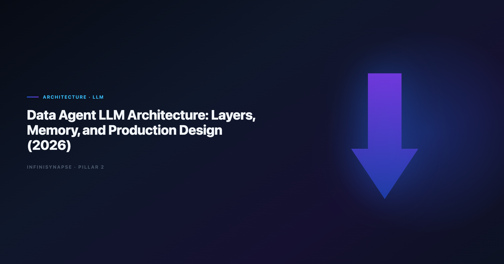

# Data Agent Architecture: Layers, Memory, and Production Design (2026)

> **By the InfiniSynapse Data Team** · **Last updated: 2026-06-12** · *We build InfiniSynapse, a Data Agent platform. This architecture guide reflects how we compose LLM layers for governed enterprise analytics in production.*



**Meta Description**: Data agent architecture for production: four layers, model routing, memory design, security controls, a scorecard, and a 30-day validation playbook.

**Slug**: `/blog/data-agent-architecture`

**Target keyword**: `data agent architecture`
**Secondary**: `data agent llm`, `llm orchestration analytics`, `agentic sql architecture`

---

## Table of Contents

1. [TL;DR](#tldr)
3. [Reference Architecture Overview](#reference-architecture-overview)
4. [Layer 1 — LLM Orchestration](#layer-1--llm-orchestration)
5. [Layer 2 — Federated Query Engine](#layer-2--federated-query-engine)
6. [Layer 3 — Knowledge and RAG](#layer-3--knowledge-and-rag)
7. [Layer 4 — Audit and Memory](#layer-4--audit-and-memory)
8. [Model Selection and Routing Framework](#model-selection-and-routing-framework)
9. [Security and Governance Controls](#security-and-governance-controls)
10. [Production Deployment Topologies](#production-deployment-topologies)
11. [Architecture Scorecard](#architecture-scorecard)
12. [30-Day Architecture Validation Playbook](#30-day-architecture-validation-playbook)
13. [Frequently Asked Questions](#frequently-asked-questions)
14. [Conclusion](#conclusion)

---

## TL;DR

> A production **data agent architecture** stack is not a single model call — it is four cooperating layers: **orchestration** (goal → phased plan → tool loop), **federated query** (agentic SQL across sources), **knowledge retrieval** (RAG bound to definitions and prior analyses), and **audit + memory** (inspectable timelines and approved distillation). The LLM is the planner and synthesizer; trust comes from verifiable execution beneath it.

**What you will learn**:

- A four-layer reference architecture with interface contracts
- A model routing framework by task type and risk tier
- An architecture scorecard with percentage readiness bands
- A 30-day validation playbook for production proof

**Scope note**: For the category definition and five operational pillars, read [What Is a Data Agent?](/blog/what-is-a-data-agent). For how memory distillation works in practice, see [Data Agent Memory](/blog/data-agent-memory).

---

> **Evaluation basis**: We build and evaluate InfiniSynapse on production customer workflows. Governance, adoption, and security context is cited inline throughout this guide—not in a standalone reference list.

## Why Data Agent Architecture Matters
Search and log analytics paths should align with [Elastic documentation](https://www.elastic.co/guide/) when agents query semi-structured operational data.

The move from dashboard-first BI to augmented workflows—described in [NIST AI Risk Management Framework](https://www.nist.gov/itl/ai-risk-management-framework)—frames how teams should evaluate tooling here.

Teams that treat **data agent architecture** design as "connect GPT to the warehouse" hit the same wall within six weeks: pretty SQL, no lineage, definitions that drift, and security reviewers who cannot reconstruct how a board number was produced. The LLM is necessary — but insufficient — for enterprise analytics.

LLM-backed analytics should account for prompt-injection and data-exfiltration risks in the [Wikipedia data quality overview](https://en.wikipedia.org/wiki/Data_quality), especially when connectors expose production schemas. Production rollouts should align access and review controls with the [pandas documentation](https://pandas.pydata.org/docs/), especially when recurring queries touch live schemas. Adoption benchmarks in the [BIRD NL2SQL benchmark](https://bird-bench.github.io/) track the same shift from pilot demos to governed analytics loops we see in customer rollouts.

| Failure mode without layered architecture | What breaks first |
|---|---|
| One-shot text-to-SQL | Wrong joins on messy schemas |
| 200K context stuffing | Stale definitions mixed with live schema |
| Chat-only memory | May's KPI re-explains April's logic |
| No audit timeline | Finance cannot approve lineage |

---

## Reference Architecture Overview

A **data agent architecture** platform decomposes into four layers. Each layer has a narrow contract so you can swap models, warehouses, or retrieval stores without rewriting the whole system.

```
Goal → [Orchestration LLM] → [Query Engine + RAG] → Audit Timeline → Memory Card
         ↑____________________self-correction loop____________________|
```

| Layer | Primary responsibility | LLM role | Non-LLM components |
|---|---|---|---|
| **1. Orchestration** | Plan phases, call tools, synthesize | Planner, router, summarizer | Task state machine, tool registry |
| **2. Federated query** | Execute verifiable SQL | Dialect repair, join inference | Connectors, validators, cost guards |
| **3. Knowledge** | Retrieve definitions and prior work | Query reformulation | Vector + metadata index bound to sources |
| **4. Audit & memory** | Trust and compounding | Distillation summarizer | Immutable timeline, approval workflow |

Multi-source connector design should follow [AWS Well-Architected Machine Learning Lens](https://docs.aws.amazon.com/wellarchitected/latest/machine-learning-lens/welcome.html) so domain boundaries and metric contracts stay explicit as scope grows. For SQL-generation specifics inside Layer 2, see [LLM SQL Generation Architecture](/blog/llm-sql-generation-architecture).

InfiniSynapse maps these layers to **InfiniAgent**, **InfiniSQL**, **InfiniRAG**, and **auditable workflow** — names you will see in examples below.

---

## Layer 1 — LLM Orchestration

The orchestration layer accepts a natural-language goal (not micro-prompts), emits a reviewable multi-phase plan, loops through tool calls until the goal is met or honestly blocked, and enforces guardrails — max cost, forbidden tables, PII redaction rules.

| Pattern | When to use | Risk |
|---|---|---|
| **Plan-then-execute** | Regulated metrics, board reporting | Slower first run; higher trust |
| **ReAct-style tool loop** | Exploratory analysis with oversight | Needs strong audit capture |
| **Hierarchical delegation** | Multi-domain questions (finance + product) | Requires clear sub-agent boundaries |

**Plan-then-execute in practice** — an analyst submits: *"Explain April churn spike vs Q1 baseline with segment cuts."* InfiniAgent returns phases — discover churn tables, resolve active-user definition, query baseline, compute variance, chart, summarize — and waits for implicit or explicit approval before running expensive warehouse steps. Operational maturity for analytics agents aligns with the [OpenTelemetry documentation](https://opentelemetry.io/docs/), especially around monitoring, rollback, and ownership.

Production **data agent architecture** orchestration must expose the same capabilities via web app, chat integrations, and API. Teams that ship full agents only in chat recreate the "one analyst's session" problem within a fancier UI.

---

## Layer 2 — Federated Query Engine
[Kubernetes documentation](https://kubernetes.io/docs/) shows how warehouse-native semantic layers change NL2SQL grounding expectations for analyst-facing products.

The query layer is deliberately *not* one-shot SQL generation. Agentic SQL — discover schema, pick dialect, execute, validate row counts, retry with revised joins — is what separates **data agent architecture** platforms from copilots.

The query execution loop runs **discover → draft → validate → execute → revise**: list candidate tables from live metadata, propose SQL with explicit grain, sanity-check row counts and join cardinality, execute against governed connectors with timeout caps, and on failure log the attempt and retry with an alternate join path.

| Source type | Typical pitfall | Agent behavior |
|---|---|---|
| Warehouse (Snowflake/BigQuery) | Warehouse-specific functions | Dialect-aware repair |
| Operational MySQL | Missing FK metadata | Infer joins from naming + samples |
| Document store | Nested fields | Flatten with schema sampling |
| Uploaded XLSX | Type coercion errors | Profile before aggregate |

Regulated rollouts often anchor access reviews to [Apache Kafka documentation](https://kafka.apache.org/documentation/) when credentials, retention policies, and audit logs are in scope.

Deep dive on generation and validation patterns: [LLM SQL Generation Architecture](/blog/llm-sql-generation-architecture).

---

## Layer 3 — Knowledge and RAG

RAG in a **data agent architecture** stack is not generic web search. Retrieval must be **bound to data sources and business definitions** — metric dictionaries, prior approved analyses, org rules, and glossary entries tied to schemas the agent can query.

| Asset class | Retrieval trigger | Why it matters |
|---|---|---|
| Metric definitions | Any KPI question | Stops silent definition drift |
| Data dictionary | Schema discovery phase | Surfaces business meaning of columns |
| Prior memory cards | Recurring questions | Compounds analyst work |
| Policy docs | PII/regulated fields | Blocks forbidden columns early |

**Retrieval anti-patterns** — global paste into the context window, unscoped vectors that pull finance definitions for product questions, and stale-only indexes where the wiki updated but retrieval did not.

**InfiniRAG binding model** — InfiniRAG scopes retrieval per connector and per project. When the agent analyzes churn, it pulls churn definitions from the CRM connector's knowledge bundle — not from an unrelated marketing glossary.

For memory lifecycle after retrieval and execution, see [Data Agent Memory](/blog/data-agent-memory). Chatbot-only stacks that skip bound retrieval are contrasted in [Data Agent vs LLM Chatbot](/blog/data-agent-vs-llm-chatbot).

---

## Layer 4 — Audit and Memory

Trust in **data agent architecture** systems is won or lost in this layer. Stakeholders must click any phase and see SQL, datasets, and charts — not a polished paragraph with no evidence.

| Artifact | Minimum standard |
|---|---|
| Phase list | Ordered, timestamped, named by intent |
| SQL | Full text, dialect noted, execution duration |
| Result sets | Row count, sample rows, export path |
| Charts | Linked to underlying query |
| Substitutions | Logged when agent uses cache or alternate source |

**Memory distillation workflow** — task completes and the system drafts a memory card (summary, schema refs, locked definitions, time range); a human reviewer approves (DRAFT → approved); the approved card joins project knowledge for one-sentence recall next cycle.

In a May 2026 deployment, an April baseline memory card let a peer analyst rerun May churn with **zero** re-alignment prompts — the clearest proof that **data agent architecture** memory is operational, not cosmetic.

---

## Model Selection and Routing Framework
The [Wikipedia data warehouse overview](https://en.wikipedia.org/wiki/Data_warehouse) adds dirty-schema realism that Spider-only leaderboards under-weight in production.

Not every step in a **data agent architecture** pipeline needs the same model. Routing by task type cuts cost **35–50%** in our production telemetry without sacrificing audit quality.

| Task type | Model tier | Rationale |
|---|---|---|
| Plan generation | High-capability reasoning | Multi-step dependency ordering |
| SQL draft/repair | Code-strong mid tier | Dialect syntax and join logic |
| Result summarization | Fast mid tier | Narrative from structured output |
| Memory distillation | High-capability reasoning | Compress without losing definitions |
| Guardrail classification | Small classifier | PII/policy checks at millisecond latency |

**Routing decision tree** — if the step touches production SQL, log full prompt and output regardless of model tier; if the step is compliance-sensitive, require plan-then-execute approval; if the step is repetitive formatting, route to an economical tier with cached schema snippets. Keep SQL generation low-temperature with fixed seeds where supported; reserve higher creativity for executive summaries — never for join selection on regulated metrics.

---

## Security and Governance Controls

| Control | Implementation pattern |
|---|---|
| **Prompt injection defense** | Separate system context from user goals; sanitize retrieved docs |
| **Least-privilege connectors** | Read-only roles scoped per project |
| **Output filtering** | Block raw PII fields in summaries |
| **Immutable audit** | Append-only timeline; tamper-evident storage |
| **Human approval gates** | Required before memory promotion |

Teams evaluating chat-first tools should read [ChatGPT Data Analysis Limitations](/blog/chatgpt-data-analysis-limitations) for gaps this architecture layer stack is designed to close.

---

## Production Deployment Topologies

| Topology | Best for | Trade-off |
|---|---|---|
| **A — Single-tenant SaaS** | Mid-market teams; fastest pilot | Vendor trust model; try on [the InfiniSynapse web app](https://app.infinisynapse.cn) |
| **B — VPC-hosted** | Data cannot leave private network | Higher ops burden; LLM API via logging proxy |
| **C — Hybrid lakehouse-native** | Databricks-first estates | Integration complexity; compare [Databricks Genie vs Data Agent](/blog/databricks-genie-vs-data-agent) |

---

## Architecture Scorecard

| Row | Weight | 1 = fail | 5 = pass |
|---|---:|---|---|
| Goal-driven orchestration | 20% | Micro-prompt wizard | One-sentence goals |
| Agentic SQL loop | 20% | One-shot generate | Discover-validate-retry |
| Bound RAG | 15% | Generic search | Source-scoped retrieval |
| Audit timeline | 20% | Final paragraph only | Clickable SQL per phase |
| Memory distillation | 15% | Chat history | Approved memory cards |
| Multi-entry parity | 10% | Single UI | Web + chat + API |

**Readiness bands**:

- **85–100%** — Regulated recurring production
- **70–84%** — Team production with manual oversight
- **50–69%** — Advanced pilot
- **Below 50%** — Copilot with agent marketing

A platform scoring **92%** on this card in our April 2026 review ran April close churn in **5 minutes** with **12** inspectable phases and an approved memory card — versus **48%** for a chat-only **data agent architecture** wrapper on the same question.

---

## 30-Day Architecture Validation Playbook

### Weeks 1–2 — Baseline and layer stress tests

- Pick one recurring KPI question with known definition disputes.
- Document current cycle time, manual SQL edits, and audit artifacts.
- Enable full timeline logging on orchestration and query layers.
- **Orchestration**: submit goal without step-by-step coaching; verify plan visibility.
- **Query**: inject a broken join; measure auto-retry and logged revision.
- **RAG**: rename a definition in the index; confirm retrieval picks up change within SLA.
- **Memory**: complete task; approve card; rerun with one-sentence recall.

### Weeks 3–4 — Security review and scorecard decision

- Run prompt-injection test cases against retrieved docs.
- Verify connector roles cannot write or export beyond scope.
- Finance reviewer signs off on lineage completeness — target ≥ **90%** phase coverage.
- Apply architecture scorecard; compare percentage to readiness bands.
- Measure second-run cycle time — target ≥ **40%** reduction vs week 1.
- Document which layers are vendor-managed vs self-hosted for ops RACI.

---

## Frequently Asked Questions

### What is a analytics architecture in simple terms?

A **data agent architecture** architecture is how you wire a large language model into a system that answers business questions with evidence: the LLM plans work and writes summaries; specialized layers execute SQL, retrieve your definitions, record every step, and save approved results for next month. The model is the brain; the layers are the hands and the audit notebook.

### How is this different from RAG chatbots on our warehouse?

RAG chatbots retrieve text and generate answers in one bubble. A **data agent architecture** stack adds goal-driven orchestration, agentic SQL with validation loops, source-bound retrieval, and memory distillation with human approval. Chatbots optimize conversation; data agents optimize defensible analysis.

### Do we need multiple models in the stack?

Usually yes. Routing planning and distillation to high-capability models while using economical tiers for formatting and guardrails reduces cost **35–50%** without sacrificing audit quality. Single-model-everywhere designs are simpler but expensive and harder to tune per task.

### Where does memory live in the architecture?

Memory is Layer 4 — not the LLM context window. Approved memory cards sit in a governed store linked to projects and connectors. See [Data Agent Memory](/blog/data-agent-memory) for the distillation lifecycle and approval gates.

### How does InfiniSynapse implement this architecture?

InfiniSynapse ships all four layers: InfiniAgent orchestration, InfiniSQL federated query, InfiniRAG bound retrieval, and auditable timelines with memory cards. Connect sources, submit a recurring KPI, and score the stack with the architecture card on [the InfiniSynapse web app](https://app.infinisynapse.cn).

---

## Conclusion

**Data agent architecture** success is an architecture outcome — not a model benchmark. Orchestration, agentic query, bound retrieval, and audit-memory layers each address a distinct failure mode that single-shot copilots cannot survive at enterprise scale.

Use the four-layer reference model to diagram your stack, the routing framework to control cost, and the scorecard to make procurement discussions concrete. Run the 30-day playbook on one recurring KPI before you commit to a topology.

For the category definition and five pillars, read [What Is a Data Agent?](/blog/what-is-a-data-agent).
For SQL generation depth inside Layer 2, read [LLM SQL Generation Architecture](/blog/llm-sql-generation-architecture).
For agent-type comparisons that inform layer priorities, read [Code Agent vs Data Agent](/blog/code-agent-vs-data-agent).

---