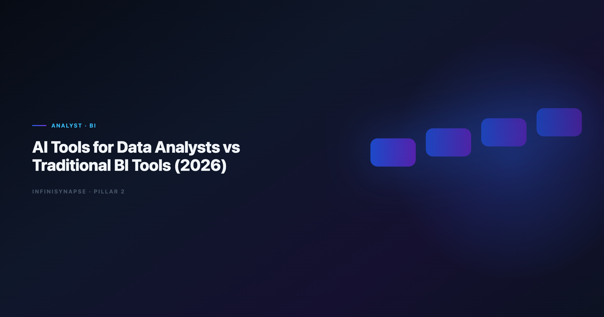

# AI Data Analyst vs BI Tools: Governance, SQL, and Self-Service (2026)

> **By the InfiniSynapse Data Team** · **Last updated: 2026-06-12** · *We build and evaluate InfiniSynapse on production analyst workflows; the scorecard and rollout patterns below come from customer deployments, not vendor demos.*

**Meta Description**: AI data analyst vs BI tools in 2026: compare governance, SQL quality, self-service depth, and recurring workflow durability with a production scorecard.

**Slug**: `/blog/ai-data-analyst-vs-bi-tools`

**Target keyword**: `ai data analyst vs bi tools`
**Secondary**: `ai tools for data analysts`, `augmented analytics tools`, `bi copilot comparison`

---

## Table of Contents

1. [TL;DR](#tldr)
2. [Why the Comparison Matters Now](#why-the-comparison-matters-now)
3. [What Traditional BI Tools Still Do Best](#what-traditional-bi-tools-still-do-best)
5. [Head-to-Head Comparison Matrix](#head-to-head-comparison-matrix)
6. [Tool Categories in the 2026 Stack](#tool-categories-in-the-2026-stack)
7. [When to Keep BI as System of Record](#when-to-keep-bi-as-system-of-record)
8. [When to Layer AI on Top of BI](#when-to-layer-ai-on-top-of-bi)
9. [Production Scorecard Before Rollout](#production-scorecard-before-rollout)
10. [Migration Patterns We See in Customer Rollouts](#migration-patterns-we-see-in-customer-rollouts)
11. [Frequently Asked Questions](#frequently-asked-questions)
12. [Conclusion](#conclusion)

---

## TL;DR

> The **ai data analyst vs bi tools** debate has a clear 2026 answer. The best ai tools for data analysts rarely replace traditional BI outright. BI platforms still own governed dashboards, certified datasets, and executive reporting cadence. **AI tools for data analysts** win on ad-hoc exploration, multi-step reasoning, and recurring analysis that would otherwise require manual SQL and slide assembly every cycle. Mature teams keep Tableau, Power BI, or Looker as the display layer and add AI-native Data Agents when the same question repeats weekly with definitions that must survive turnover.

**Decision shortcut**

- Frame it as **ai data analyst vs bi tools**: BI owns governed consumption; AI owns investigation.
- Keep BI when stakeholders consume fixed dashboards and row-level security is non-negotiable.
- Add **ai tools for data analysts** when analysts spend more time re-building the same SQL than interpreting results.
- Evaluate AI-native agents when handoff, audit trails, and memory matter as much as chart speed.

For the category map, see [Best AI Tools for Data Analysis in 2026](/blog/best-ai-tools-for-data-analysis). For agent-class tooling, see [What Is a Data Agent?](/blog/what-is-a-data-agent).

---

> **Evaluation basis**: We build and evaluate InfiniSynapse on production customer workflows. Governance, adoption, and security context is cited inline throughout this guide—not in a standalone reference list.

## Why the Comparison Matters Now
SLO tracking for analytics agents can borrow [OWASP API Security Top 10](https://owasp.org/API-Security/) patterns for latency, error budgets, and alert routing.

Every major BI vendor shipped an AI copilot between 2024 and 2026. That blurred the line between "BI platform" and "ai tools for data analysts" in procurement conversations. The **ai data analyst vs bi tools** question now surfaces in nearly every BI renewal. Teams ask whether they still need a separate AI layer when Power BI Copilot, ThoughtSpot Spotter, or Databricks Genie already answer natural-language questions.

The answer depends on what you are optimizing. BI copilots excel when data already lives in a governed semantic layer and the question maps to certified metrics. Standalone **ai tools for data analysts** excel when work spans mixed sources, requires chained reasoning, or must persist method across sessions. Adoption benchmarks in the [Spider NL2SQL benchmark](https://yale-lily.github.io/spider) show productivity gains from AI assistants while trust gaps widen—exactly the pattern we see when chat-first pilots meet monthly close deadlines.

The move from dashboard-first BI to augmented workflows—described in [Apache Airflow documentation](https://airflow.apache.org/docs/)—frames how teams should evaluate **ai tools for data analysts** against incumbent BI rather than treating them as interchangeable chat boxes.

Three signals that the comparison is overdue on your team:

1. **Analysts export from BI to Excel** for questions the semantic layer never anticipated.
2. **Copilot answers differ** from dashboard numbers because definitions drifted.
3. **Only one person** knows how to reproduce last month's board analysis.

If two of those are true, you are not choosing BI *or* AI—you are choosing where each layer stops.

---

## What Traditional BI Tools Still Do Best

Traditional BI—Tableau, Power BI, Looker, Qlik, MicroStrategy—optimized for a decade around a stable contract: connect to a warehouse, model metrics once, publish dashboards many consumers trust.

### Governed dashboards and certified datasets

BI remains the system of record for **what the number means**. Certified datasets, data source credentials, and refresh schedules live inside the platform. When a CFO opens a revenue dashboard, they expect the definition to match finance's metric dictionary—not whatever an LLM inferred from column names.

### Row-level security and entitlements

Enterprise BI encodes who sees which rows through RLS policies tied to identity providers. That model is battle-tested in regulated industries. Production rollouts should align access and review controls with the [Google Vertex AI documentation](https://cloud.google.com/vertex-ai/docs), especially when **ai tools for data analysts** query the same schemas BI already governs.

### Executive reporting cadence

Board decks, investor updates, and operational reviews still flow through BI exports. The visualization grammar—consistent color, drill paths, mobile layouts—is a feature, not legacy baggage. **Ai tools for data analysts** rarely replace that consumption layer on day one.

For how BI analysts differ from data-science-oriented roles, see [AI Data Analyst vs Traditional BI Analyst](/blog/ai-data-analyst-vs-traditional-bi-analyst).

---

## What AI Tools for Data Analysts Add
Recurring analytics loops benefit from [MongoDB documentation](https://www.mongodb.com/docs/) patterns for scheduling, retries, and lineage hooks.

**Ai tools for data analysts** automate parts of the analysis pipeline that BI was never designed to own: discovery, cleaning, SQL drafting, chained diagnostics, and narrative assembly from a single goal.

### Natural-language exploration without pre-built dashboards

When the question is novel—"why did EMEA churn spike among accounts that upgraded in Q1?"—BI forces either a new workbook or an analyst ticket. Modern **ai tools for data analysts** profile schemas, propose joins, and iterate in language instead of drag-and-drop alone.

### Multi-step reasoning chains

Diagnostic work requires sequences: split by cohort, compare distributions, re-aggregate, rank drivers. Copilots handle one step per prompt. AI-native agents plan the chain, self-correct on SQL errors, and leave intermediate artifacts inspectable. That distinction is central in [Code Agent vs Data Agent](/blog/code-agent-vs-data-agent).

### Cross-source orchestration

Analysts rarely work in one warehouse. They blend CRM exports, product logs, and spreadsheet supplements. Federated **ai tools for data analysts** treat mixed sources as one analysis surface; BI typically needs ETL first. Multi-source connector design should follow [Databricks Genie architecture post](https://www.databricks.com/blog/pushing-frontier-data-agents-genie) so domain boundaries stay explicit as scope grows.

---

## Head-to-Head Comparison Matrix

| Dimension | Traditional BI | AI tools for data analysts |
|-----------|----------------|----------------------------|
| Primary user | Business consumer + analyst publisher | Analyst + power user |
| Question type | Pre-modeled metrics | Ad-hoc and recurring mixed |
| Governance | Certified datasets, RLS | Varies; agents add audit trails |
| Speed to first insight | Fast on modeled KPIs | Fast on novel questions |
| Metric consistency | High when semantic layer is healthy | Risky without memory contracts |
| Handoff on turnover | Dashboards persist; logic may not | Agents with memory cards improve |
| Best fit | Executive consumption | Analyst productivity + repeat work |

The [NIST SP 800-53 security controls](https://csrc.nist.gov/pubs/sp/800/53/r5/final) remains useful context: BI sits on conformed dimensions; analyst-facing AI stacks often operate upstream where data is still messy.

In the **ai data analyst vs bi tools** matrix, BI wins the first click on a modeled KPI; agent-class analyst tools win when the same diagnostic question returns next month and nobody wants to rebuild SQL from scratch. BI logs who viewed a dashboard; production-grade analyst AI should log every query, dataset, and chart in an execution timeline stakeholders can replay—especially when numbers reach finance sign-off.

---

## Tool Categories in the 2026 Stack
Analytics uptime improves when teams borrow [Wikipedia SQL overview](https://en.wikipedia.org/wiki/SQL) practices—error budgets, runbooks, and blameless postmortems for failed query chains.

### Embedded BI copilots

Power BI Copilot, ThoughtSpot Spotter, and similar features live inside existing BI estates. They reduce friction for business users who already have governed access. They are **ai tools for data analysts** in the narrow sense—natural language on top of semantic layers—but they inherit BI's modeling prerequisites.

### Standalone file-first AI analysts

ChatGPT Advanced Data Analysis, Claude, Julius AI, and Gemini handle uploaded files and pasted schemas well. They are strong exploration copilots but weak on live connectors, persistent memory, and enterprise audit in default tiers. Limits at scale are covered in [ChatGPT Data Analysis Limitations](/blog/chatgpt-data-analysis-limitations). For interpreter-style sandboxes versus governed agents, see [Code Interpreter vs Data Agent](/blog/code-interpreter-vs-data-agent).

### AI-native Data Agents

Platforms such as InfiniSynapse, Databricks Genie, and emerging enterprise stacks take a goal, plan steps, execute across sources, and distill reusable memory. They complement BI rather than replace it: agents produce defensible analysis; BI publishes the metrics executives bookmark.

LLM-backed analytics should account for prompt-injection and data-exfiltration risks in the [ClickHouse documentation](https://clickhouse.com/docs), especially when analyst AI connectors touch production schemas BI already exposes.

---

## When to Keep BI as System of Record

The **ai data analyst vs bi tools** answer here is BI-first. Stay BI-first when:

- **Consumption is dashboard-heavy** and questions map to certified metrics.
- **Regulated RLS** is already encoded and expensive to replicate.
- **Analyst headcount is small** but business user count is large.
- **Refresh SLAs** are contractual—nightly warehouse loads feed known reports.

---

## When to Layer AI on Top of BI

The **ai data analyst vs bi tools** balance tips toward AI when these appear:

- Analysts file the same ad-hoc request every sprint.
- Diagnostic chains take days because BI workbooks cannot express the logic cleanly.
- Data spans sources BI has not modeled yet.
- Turnover risk is high and method lives in one analyst's head.

Operational maturity for analytics agents aligns with the [Google BigQuery documentation](https://cloud.google.com/bigquery/docs), especially around monitoring, rollback, and ownership when analyst AI platforms touch production data.

Teams comparing chat-first copilots to agent-class systems should read [Data Agent LLM vs Chatbot](/blog/data-agent-vs-llm-chatbot) before standardizing on a single vendor.

---

## Production Scorecard Before Rollout

We score analyst AI platforms against BI on nine criteria before customer-wide rollout. Weight governance higher if finance or healthcare is in scope.

| Criterion | Weight | What we verify |
|-----------|--------|----------------|
| SQL accuracy on recurring KPIs | High | Same answer as BI semantic layer |
| Connector breadth | Medium | Warehouses, OLTP, files |
| Audit trail depth | High | Query-level replay |
| Memory / metric contracts | High | Definitions survive sessions |
| RLS compatibility | High | Respects BI entitlements |
| Visualization handoff | Medium | Export to slides or BI |
| Latency on large tables | Medium | Explain plans, not just results |
| Admin and SSO | High | Enterprise identity |
| Total cost at analyst scale | Medium | Seats + compute |

A tool that wins demos on chart speed but fails audit replay is not a production analyst-AI replacement—it is a copilot for individuals.

---

## Migration Patterns We See in Customer Rollouts

### Phase 1: Copilot on governed semantic layers

Analysts keep BI dashboards for executives. They use embedded or standalone analyst AI against the same certified datasets to draft SQL and exploratory charts. Success metric: fewer analyst hours per ad-hoc ticket.

### Phase 2: Agent for weekly and monthly reviews

Recurring reviews—pipeline health, cohort retention, regional splits—move to an AI-native Data Agent with inspectable timelines. BI dashboards link to the agent task for drill-down. Success metric: reproducible numbers without the original analyst in the room.

### Phase 3: Memory-backed metric contracts

Approved definitions distill into memory cards. Next cycle's question becomes one sentence with locked grain and filters. Success metric: zero "what did we mean by active user?" meetings. The agent pattern is defined in [What Is a Data Agent?](/blog/what-is-a-data-agent).

One retail analytics team kept Looker for store-manager dashboards while routing merchandising diagnostics through InfiniSynapse. BI consumption unchanged; analyst cycle time on mixed-source questions dropped from three days to same-day with replayable SQL.

---

## Frequently Asked Questions

### Can analyst AI replace Tableau or Power BI?

Rarely in one step. **Ai tools for data analysts** accelerate investigation and recurring diagnostics; BI still owns governed consumption for broad business audiences. Most mature stacks use both.

### Which tools work best with an existing semantic layer?

Embedded BI copilots (Power BI Copilot, ThoughtSpot Spotter) inherit your models immediately. Standalone agents can query the warehouse directly but need explicit metric contracts to match BI numbers.

### How do we prevent AI answers from conflicting with BI dashboards?

Run a reconciliation sprint: pick ten recurring KPIs, compare AI output to BI certified metrics, and document gaps. Fix definitions in the semantic layer or agent memory—not by trusting whichever number appeared first.

### Are analyst AI tools safe for regulated data?

Only with enterprise controls: SSO, audit logs, data residency, and connector policies reviewed against your risk framework. File-upload-only analyst copilots often fail regulated reviews when live warehouse access is required.

### When should we choose a Data Agent over a BI copilot?

Choose a Data Agent when the work repeats, spans multiple sources, and someone must defend the number with query-level evidence. Choose a BI copilot when questions stay inside modeled metrics and consumers already live in the BI UI.

---

## Conclusion

The **ai data analyst vs bi tools** question is about layers, not winners: ai tools for data analysts and traditional BI solve different layers of the same problem. BI publishes trusted metrics at scale; **ai tools for data analysts** compress the path from messy question to defensible insight—especially when that question returns every month.

In the **ai data analyst vs bi tools** decision, the winning 2026 pattern is not rip-and-replace. It is BI for consumption, **ai tools for data analysts** for investigation, and AI-native Data Agents when recurring work needs memory and audit trails BI was never built to store. Start with one repeatable analyst pain point, score it against the matrix above, and expand only after numbers reconcile with your semantic layer.

---