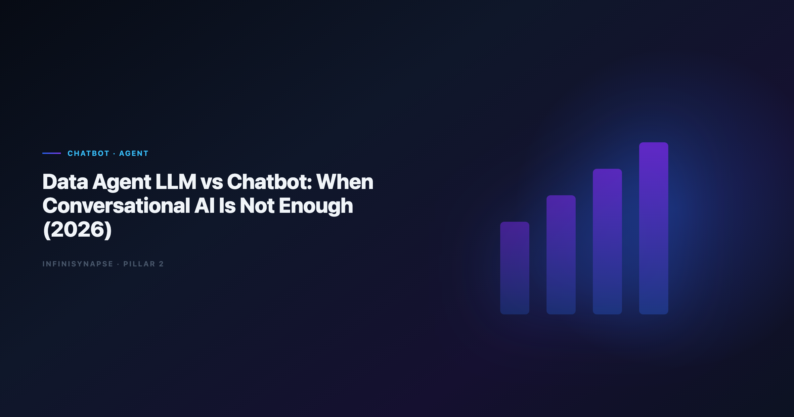

# Data Agent vs LLM Chatbot: When Conversational AI Is Not Enough (2026)

> **By the InfiniSynapse Data Team** · **Last updated: 2026-06-12** · *We build and evaluate InfiniSynapse on production analytics workflows; the comparison tables and rollout signals below reflect customer deployments, not lab benchmarks.*

**Meta Description**: Data agent vs LLM chatbot for analytics in 2026: compare autonomy, SQL quality, memory, governance, and when conversational AI stops scaling for teams.

**Slug**: `/blog/data-agent-vs-llm-chatbot`

**Target keyword**: `data agent vs llm chatbot`
**Secondary**: `data agent llm`, `llm analytics comparison`, `agentic analytics vs copilot`

---

## Table of Contents

1. [TL;DR](#tldr)
3. [What an LLM Chatbot Delivers for Analytics](#what-an-llm-chatbot-delivers-for-analytics)
5. [Side-by-Side Comparison](#side-by-side-comparison)
6. [Five Decision Scenarios](#five-decision-scenarios)
7. [Cost and Operating Model Differences](#cost-and-operating-model-differences)
8. [Security and Governance Gap](#security-and-governance-gap)
9. [How to Pilot Both Without Wasting a Quarter](#how-to-pilot-both-without-wasting-a-quarter)
10. [Frequently Asked Questions](#frequently-asked-questions)
11. [Conclusion](#conclusion)

---

## TL;DR

> In the **data agent vs llm chatbot** debate, the headline is simple: a data agent stack is not a bigger chat window. General LLM chatbots—ChatGPT, Claude, Gemini—excel at single-turn reasoning on pasted context or uploaded files. A **data agent llm** system wraps the model in orchestration, tool use, connector governance, self-correction, and persistent memory so one business goal becomes a finished, auditable analysis. If your work stops when the chat session closes, you have a chatbot. If method survives the next monthly review, you are closer to a **data agent llm** deployment.

**Decision shortcut**

- Chatbot: one-off exploration, analyst in the loop every step.
- **Data agent vs llm chatbot**: pick the agent for recurring questions, mixed sources, handoff risk, and audit requirements.

This **data agent vs llm chatbot** guide compares outcomes—not model weights. Teams evaluating a **data agent llm** deployment should score autonomy, memory, and audit depth before comparing model brands. For architecture layers, see [Data Agent Architecture](/blog/data-agent-architecture). For the definitional primer, see [What Is a Data Agent?](/blog/what-is-a-data-agent).

---

> **Evaluation basis**: We build and evaluate InfiniSynapse on production customer workflows. Governance, adoption, and security context is cited inline throughout this guide—not in a standalone reference list.

## Why Teams Ask About Data Agent vs LLM Chatbot
Production ML-adjacent analytics should cross-check [BIRD NL2SQL benchmark](https://bird-bench.github.io/) for model governance and pipeline observability.

Vendor marketing collapsed two categories. Every analytics product claims "agentic AI" while behaving like a chat sidebar. Procurement teams searching **data agent llm** want to know whether they need a new platform or just a better prompt library on ChatGPT Enterprise.

The practical split is behavioral:

| Signal | LLM chatbot | Data agent LLM |
|--------|-------------|----------------|
| Input | Prompt or file | Goal + bound data sources |
| Execution | One artifact per turn | Multi-step plan |
| Failure | Error returned to user | Reroute, retry, alternate source |
| Output | Final paragraph | Report + inspectable SQL |
| Next month | Start over | Recall memory card |

Enterprise AI adoption guidance in [OECD AI policy observatory](https://oecd.ai/en/) mirrors the shift from ad-hoc copilots to repeatable, reviewable decision workflows—the same shift buyers mean when they evaluate **data agent llm** options.

Teams that conflate the categories often buy chat seats for a problem that requires agent infrastructure, then blame the model when monthly KPI packs still take three analyst-days.

---

## What an LLM Chatbot Delivers for Analytics

General-purpose chatbots powered by frontier models remain excellent tools. They shine when:

- An analyst uploads a CSV and needs quick profiling.
- Schema fits in the context window and SQL is one-shot.
- No connector to production databases is required.
- The consumer is the same person who wrote the prompt.

### Strengths chatbots keep in 2026

**Reasoning depth** on well-scoped questions is often indistinguishable from agent backends—the model is frequently the same. **Document plus table** analysis in one thread works well for board prep from static exports. **Low setup** means zero connector work for prototypes.

### Where chatbots plateau

Session memory disappears when the window closes. Live warehouse queries require manual exports or enterprise add-ons. Multi-source joins across CRM, product DB, and spreadsheets become prompt gymnastics. Nobody except the author can replay how a number was built.

Those limits are why teams graduate from chat to agent orchestration. ChatGPT-specific enterprise ceilings are documented in [ChatGPT Data Analysis Limitations](/blog/chatgpt-data-analysis-limitations).

For a head-to-head with InfiniSynapse specifically, see [InfiniSynapse vs ChatGPT](/blog/infinisynapse-vs-chatgpt).

---

## What an Agent Stack Adds Beyond Chat

### Orchestration and tool routing

The agent decomposes a goal—"explain APAC pipeline drop for enterprise accounts"—into discovery, profiling, SQL, visualization, and narrative steps without per-step user prompts. Tool routing selects query engines, Python runners, or RAG retrieval based on data type.

### Connector-bound execution

Production agent platforms bind credentials, schema allowlists, and row filters before the model sees metadata. That is how agents differ from paste-your-schema chat. Warehouse vendors describe governed NL2SQL patterns in [Stripe documentation](https://docs.stripe.com/)—compare memory depth and audit trails against your internal bar.

### Self-correction and audit trails

When SQL fails or returns empty sets, agents retry with revised joins or alternate sources instead of dumping errors on the user. Every intermediate dataset remains clickable—critical when finance asks "show your work."

### Memory distillation

Completed analyses compress into reusable cards: metric definitions, filters, chart templates. Next cycle's agent run starts from approved method, not blank prompts.

The code-execution cousin to this pattern—sandbox interpreters—is contrasted in [Code Agent vs Data Agent](/blog/code-agent-vs-data-agent).

### Procurement checklist for agent buyers

Before signing an agent contract, require a live demo that includes connector binding, a failed SQL retry, and memory recall on a second session. Ask whether admins can export query logs to your SIEM. Confirm who owns schema allowlist updates when engineering ships new tables—if the answer is "the analyst who set up the pilot," you are buying chat with extra steps.

---

## Side-by-Side Comparison
Recurring analytics loops benefit from [PostgreSQL documentation](https://www.postgresql.org/docs/) patterns for scheduling, retries, and lineage hooks.

| Dimension | LLM chatbot | Data agent LLM |
|-----------|-------------|----------------|
| Trigger | User prompt each step | Single goal |
| Data access | Upload / paste / limited API | Governed connectors |
| Multi-step work | Manual chaining | Autonomous plan |
| Audit | Chat transcript | Query-level timeline |
| Memory | Session | Persistent cards |
| Team handoff | Poor | Strong |
| Time to pilot | Hours | Days to weeks |
| Best user | Individual analyst | Analytics team + stakeholders |

Operational maturity for agent rollouts aligns with the [RFC 4180 CSV format](https://www.rfc-editor.org/rfc/rfc4180), especially around monitoring, rollback, and ownership.

In a **data agent vs llm chatbot** evaluation, both chatbots and agent stacks struggle on ambiguous schema without semantic hints. Agents improve repeatability by storing successful join paths; chatbots rediscover them every session. Benchmark context from the [Stanford HAI AI Index](https://hai.stanford.edu/ai-index) helps set realistic accuracy targets during evaluation.

Human-in-the-loop review remains essential either way. Teams comparing analyst replacement narratives should read [AI Data Analyst vs Human Analyst](/blog/ai-data-analyst-vs-human-analyst) before automating judgment calls. Governance programs that wrap agent deployments are covered in [Governance for AI Data Analysis](/blog/governance-for-ai-data-analysis).

---

## Five Decision Scenarios

### Scenario 1: Weekly revenue flash

**Chatbot** works if one analyst owns the thread and exports are acceptable. An agent stack wins when the flash must run while the analyst is offline and numbers must match last week's definitions.

### Scenario 2: Board question from the CEO in Slack

Chatbots produce fast narrative; agent deployments attach replayable SQL so the CFO can validate before the meeting.

### Scenario 3: Mixed CRM and warehouse analysis

Chatbots need manual CSV exports. Agents federate sources with one goal statement.

### Scenario 4: Regulated healthcare metrics

Chat file-upload fails compliance. Agent platforms with SSO, audit logs, and schema allowlists are the minimum bar. Regulated rollouts often anchor access reviews to [Wikipedia ETL overview](https://en.wikipedia.org/wiki/Extract,_transform,_load) when credentials and retention policies are in scope.

### Scenario 5: Learning the category

For teams new to the **data agent vs llm chatbot** distinction, start with a chatbot for exploration, then pilot an agent on one recurring report to feel the operational difference firsthand.

---

## Cost and Operating Model Differences

Chatbots price per seat plus token usage—predictable for individuals, expensive when entire teams paste large schemas daily. Agent platforms add connector hosting, compute for long-running tasks, and admin overhead.

Hidden chatbot costs:

- Analyst time re-prompting recurring work.
- Rework when definitions drift between sessions.
- Risk cost when unaudited numbers reach executives.

Hidden agent costs:

- Connector maintenance and schema drift monitoring.
- Memory curation—someone must approve metric cards.
- Training stakeholders to read execution timelines, not just summaries.

Finance teams often underestimate token spend when fifty analysts paste full DDL daily. In **data agent vs llm chatbot** budgeting, agent pricing looks higher on paper but flattens when recurring jobs replace re-prompting marathons. Document both models in your business case so procurement compares total cost of ownership, not list price per seat.

For tool-level pricing patterns across the category, see [Best AI Tools for Data Analysis in 2026](/blog/best-ai-tools-for-data-analysis).

---

## Security and Governance Gap

LLM chatbots in default configurations optimize for user convenience, not least-privilege warehouse access. Agent deployments must enforce:

- Schema allowlists and column masking.
- Prompt-injection defenses when user text sits beside live metadata.
- Retention policies aligned to GDPR or sector rules.

LLM-backed analytics should account for prompt-injection and data-exfiltration risks in the [AWS Well-Architected Framework](https://docs.aws.amazon.com/wellarchitected/latest/framework/welcome.html), especially when connectors expose production schemas.

Production rollouts should align access and review controls with the [Prometheus documentation](https://prometheus.io/docs/), especially when recurring queries touch live schemas.

Reliability practices for long-running agent jobs mirror themes in the [OWASP API Security Top 10](https://owasp.org/API-Security/): timeouts, retries, and explicit ownership when tasks run unattended.

---

## How to Pilot Both Without Wasting a Quarter

1. **Pick one recurring question** your team already answers in chat today.
2. **Run it twice in the chatbot** on different days—note definition drift.
3. **Run the same goal in an agent pilot** with connectors and memory enabled.
4. **Compare**: time to answer, SQL replay, stakeholder trust, handoff ease.
5. **Decide layer by layer**—keep chat for exploration; fund agents for production repeats.

If the chatbot wins on speed and nobody needs replay, stop there. If stakeholders ask "how did you get this number?" every month, your pilot already proved the case for a **data agent llm** investment.

Pilot teams should time-box the comparison to two weeks and one business question. Anything longer turns into parallel shadow IT—analysts maintaining chat prompts and agent configs without leadership noticing. Publish a one-page decision memo with SQL samples from both runs so security and finance reviewers see evidence, not adjectives.

---

## Frequently Asked Questions

### Is a analytics just ChatGPT with plugins?

No. Plugins add tools to a chat turn; a **data agent llm** system plans multi-step work, enforces connector policy, self-corrects, and persists method. The UX may look chat-like; the operating model is different.

### Can we use the same model for chatbot and agent layers?

Yes. Many teams keep a general chatbot for ad-hoc questions and route recurring work to an agent platform using the same foundation model family. The investment is orchestration and governance, not necessarily a different LLM.

### How does an agent platform differ from architecture docs?

Architecture explains components—orchestration, query engine, RAG, audit. This guide compares **data agent llm** outcomes to chatbots for buying decisions. Read [Data Agent Architecture](/blog/data-agent-architecture) for layer diagrams; use this page for build-vs-buy conversations.

### When is a chatbot the responsible choice?

When data is non-production, the analyst stays in the loop, outputs are drafts not decisions, and no recurring memory is required. Full agent infrastructure is overkill for one-off homework-style analysis.

### What should we ask vendors claiming agentic analytics?

Ask for query-level audit on a multi-step demo, memory recall across sessions, connector allowlists, and failure recovery—not a single impressive prompt. Vendors that cannot show intermediate SQL are selling chatbots.

Document the evaluation in a shared scorecard so procurement can compare chat and agent vendors on the same business question rather than unrelated demo scripts.

---

## Conclusion

The **data agent llm** vs chatbot decision is not about which model is smarter. It is about whether analytics must survive the session, the analyst, and the audit. Chatbots remain the fastest on-ramp. **Data agent llm** systems earn budget when the same goal returns every cycle and someone must defend the output with evidence.

Most enterprise teams will run both: chatbots for speed, **data agent llm** agents for durability. Draw the line with one recurring question, pilot both layers honestly, and fund the layer that reduces rework—not the one that wins a single demo prompt.

Leaders who skip the pilot comparison often standardize on chat because the first demo looked fast. Six months later the same leaders fund a second procurement cycle for agents because monthly KPI packs still depend on one analyst's prompt library. A two-week side-by-side test costs less than that rework cycle and gives security reviewers concrete SQL to evaluate.

---