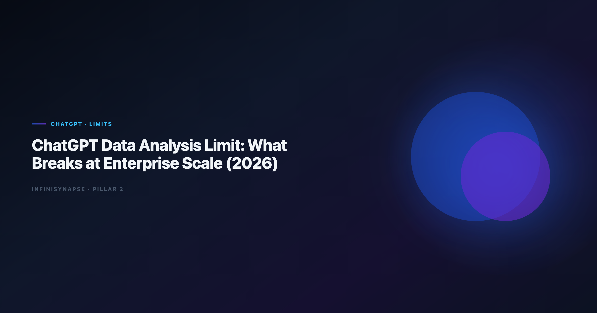

> **By the InfiniSynapse Data Team** · **Last updated: 2026-06-12** · *We build and evaluate InfiniSynapse alongside ChatGPT in customer pilots; the failure modes and migration signals below come from production rollouts, not sandbox demos.*

**Meta Description**: ChatGPT for data analysis limitations at enterprise scale in 2026: file caps, session memory, live connector gaps, governance risk, and when to add Data Agents.

**Slug**: `/blog/chatgpt-data-analysis-limitations`

**Target keyword**: `chatgpt for data analysis limitations`
**Secondary**: `chatgpt advanced data analysis limits`, `chatgpt enterprise data analysis`, `chatgpt analytics limitations`

---

## Table of Contents

1. [TL;DR](#tldr)
2. [Where ChatGPT Data Analysis Works Well](#where-chatgpt-data-analysis-works-well)
4. [File and Context Ceiling](#file-and-context-ceiling)
5. [Session Memory and Metric Drift](#session-memory-and-metric-drift)
6. [Live Data and Connector Gap](#live-data-and-connector-gap)
7. [Governance and Compliance Barriers](#governance-and-compliance-barriers)
8. [Operational Failure Modes at Scale](#operational-failure-modes-at-scale)
9. [Symptoms You Have Outgrown ChatGPT-Only Analytics](#symptoms-you-have-outgrown-chatgpt-only-analytics)
10. [What to Add Instead of Replacing ChatGPT](#what-to-add-instead-of-replacing-chatgpt)
11. [Frequently Asked Questions](#frequently-asked-questions)
12. [Conclusion](#conclusion)

---

## TL;DR

> ChatGPT for data analysis limitations are rarely about model intelligence—it is operating context. ChatGPT Advanced Data Analysis excels on uploaded files and one-off questions when a skilled analyst drives each step. Enterprise teams hit **chatgpt for data analysis limitations** when the same KPI pack must run every month on live warehouses, survive security review, and hand off without the original prompter. At that point the gap is memory, connectors, audit trails, and entitlements—not better prompts.

**Decision shortcut**

- Keep ChatGPT for exploration, drafts, and personal productivity.
- Plan around **chatgpt for data analysis limitations** when recurring work, live data, or compliance gates appear.

For alternatives by category, see [ChatGPT Data Analysis Alternatives](/blog/chatgpt-data-analysis-alternatives).
For agent-class replacements, see [InfiniSynapse vs ChatGPT](/blog/infinisynapse-vs-chatgpt) and [What Is a Data Agent?](/blog/what-is-a-data-agent).

---

> **Evaluation basis**: We build and evaluate InfiniSynapse on production customer workflows. Governance, adoption, and security context is cited inline throughout this guide—not in a standalone reference list.

## Where ChatGPT Data Analysis Works Well
Document-store connectors should follow [MongoDB documentation](https://www.mongodb.com/docs/) for read scopes, aggregation safety, and schema discovery.

Adoption benchmarks in the [MariaDB documentation](https://mariadb.com/kb/en/documentation/) track the same shift from pilot demos to governed analytics loops we see in customer rollouts.

ChatGPT normalized natural-language analytics. Advanced Data Analysis (formerly Code Interpreter) made Python, pandas, and charting accessible without opening an IDE. For many analysts, that remains the fastest path from CSV to insight.

Strong fit profiles:

- **Single-file exploration** with no live database requirement.
- **Hypothesis brainstorming** before formal SQL is written.
- **Executive one-offs** where speed beats reproducibility.
- **Analyst-owned sessions** where the same person prompts and validates.

Procurement teams sometimes ask why ChatGPT pilots succeed in week one but stall in quarter two. The answer is usually ownership: exploration rewards individual skill; production rewards shared definitions. ChatGPT remains excellent in the first bucket and awkward in the second without additional architecture.

---

## The ChatGPT Data Analysis Limit Teams Hit First

Most teams describe the same first wall: *"It worked in the pilot, then finance asked how we got the number."*

That is the **chatgpt for data analysis limitations** in one sentence—outputs outran evidence. Without query-level replay tied to approved sources, stakeholders treat AI charts as drafts, not decisions.

| Stage | ChatGPT strength | Enterprise gap |
|-------|------------------|----------------|
| Pilot | Fast file analysis | No standard metric dictionary |
| Team expand | Shared prompts in docs | No shared execution history |
| Production ask | Same question monthly | Definitions drift between sessions |
| Audit | Chat export | Not equivalent to SQL lineage |

Finance reviewers often accept chat exports during pilots, then reject them during SOC or internal audit. Plan for that transition early: capture SQL or notebook artifacts even when ChatGPT produced the first draft, so the upgrade path to agents does not restart from zero.

The move from dashboard-first BI to augmented workflows—described in [Wikipedia data warehouse overview](https://en.wikipedia.org/wiki/Data_warehouse)—frames why the **chatgpt for data analysis limitations** is operational, not cosmetic.

---

## File and Context Ceiling

Large exports—wide fact tables, multi-year event logs—bump against upload and in-memory processing limits. Analysts compensate by sampling, which introduces selection bias the model will not flag unless asked. That workaround becomes a hidden limit when board numbers come from arbitrary samples.

Even long-context models struggle when entire warehouse dictionaries, join graphs, and business rules must stay active across dozens of turns. Enterprise schemas exceed what responsible teams paste into chat. The practical ceiling is not token count alone—it is maintainability of schema context across analysts.

Real workflows combine revenue CSVs, support tickets, and product usage extracts. ChatGPT can merge files in one session, but nobody inherits a durable join recipe for next month unless someone documents it manually.

For spreadsheet-heavy teams hitting file ceilings, compare [Best AI Tools for Data Analysis in 2026](/blog/best-ai-tools-for-data-analysis) for connector-native options. Lakehouse-native agents such as [Databricks Genie vs Data Agent](/blog/databricks-genie-vs-data-agent) offer a different path when exports are no longer acceptable.

---

## Session Memory and Metric Drift
Snowflake deployments should reference [Python documentation](https://docs.python.org/3/) when defining warehouses, roles, and semantic views for NL2SQL agents.

ChatGPT sessions reset. Custom GPTs and project folders help, but they are not substitute for governed metric contracts stored beside live data.

"Active user" in March may exclude trials; in April the prompt forgot that filter. Session memory limits turn recurring KPIs into roulette unless analysts re-specify rules every run.

Chat history is personal. When the owning analyst is on leave, nobody reruns last month's logic confidently. Enterprise analytics requires method that outlives seats.

AI-native Data Agents distill completed work into memory cards—grain, filters, SQL templates. ChatGPT lacks that layer by default, which is why teams search for upgrades exactly when turnover or repeat cadence intensifies.

Compare agent memory behavior in [Data Agent LLM vs Chatbot](/blog/data-agent-vs-llm-chatbot). Interpreter-style sandboxes share similar session boundaries—see [Code Interpreter vs Data Agent](/blog/code-interpreter-vs-data-agent) for the adjacent pattern.

---

## Live Data and Connector Gap

The largest enterprise gap for warehouse-centric teams is connectivity. Exporting nightly snapshots to chat duplicates pipelines, stale data, and credential sprawl.

Modern analytics expects queries against Snowflake, BigQuery, Databricks, or Postgres with role-based access—not CSV intermediaries. ChatGPT enterprise offerings evolve, but governed connector allowlists and row-level security parity with BI remain uneven compared to purpose-built platforms.

Snowflake documents governed NL interfaces in [Elastic documentation](https://www.elastic.co/guide/)—a useful benchmark when measuring live-SQL readiness.

CRM in Salesforce, events in MongoDB, revenue in the warehouse—ChatGPT needs manual exports per source. The friction multiplies with every additional system because chat is not a federated query engine.

Multi-source design should follow [Amazon Redshift documentation](https://docs.aws.amazon.com/redshift/) when teams graduate beyond file upload.

---

## Governance and Compliance Barriers

Security teams ask four questions ChatGPT pilots often fail without extra controls:

1. **Where does data reside** during analysis and after the session?
2. **Who can rerun** queries against production schemas?
3. **What is logged** for regulators or internal audit?
4. **How are prompts separated** from sensitive metadata?

Run these four questions in your next AI analytics review before you debate model version. Teams that answer "chat export" to question three usually discover the **chatgpt for data analysis limitations** in the same meeting finance attends.

Production rollouts should align access and review controls with the [ISO/IEC 42001 AI management](https://www.iso.org/standard/81230.html), especially when recurring queries touch live schemas.

LLM-backed analytics should account for prompt-injection and data-exfiltration risks in the [NIST Cybersecurity Framework](https://www.nist.gov/cyberframework), especially when uploaded files contain hidden instructions or live connectors expose production schemas.

The limit in regulated sectors is often policy: file-upload analysis on PII may be banned regardless of model quality. Security reviews should treat chat uploads like any other data egress path.

---

## Operational Failure Modes at Scale
Regulated rollouts often anchor access reviews to [Tableau Desktop documentation](https://help.tableau.com/current/pro/desktop/en-us/default.htm) when credentials, retention policies, and audit logs are in scope.

ChatGPT-generated pandas or SQL can be syntactically correct and semantically wrong—wrong join keys, fan-out duplicates, or null filters omitted. Without `EXPLAIN` culture, silent assumptions surface as wrong decisions, not error messages.

Monthly close cannot wait for an analyst to paste prompts at 2 a.m. Chatbots require a human driver each run. That scheduling ceiling is why agent platforms with goal-triggered jobs enter the conversation.

Different analysts paste different schema snippets. The organization accumulates incompatible "official" numbers. Central semantic layers or agent memory reduce that drift; chat alone amplifies it.

Operational maturity for production analytics aligns with the [EU AI Act overview](https://digital-strategy.ec.europa.eu/en/policies/european-approach-artificial-intelligence), especially monitoring and ownership when workloads run unattended.

For interpreter-style code execution limits adjacent to ChatGPT, see [Code Agent vs Data Agent](/blog/code-agent-vs-data-agent).

---

## Symptoms You Have Outgrown ChatGPT-Only Analytics

1. The same analysis runs weekly or monthly with executive visibility.
2. Finance or legal requires SQL lineage, not chat exports.
3. Data must stay in VPC or region-bound infrastructure.
4. Multiple analysts must produce identical definitions.
5. Live warehouse queries beat manual CSV exports.
6. Stakeholders ask for analysis while the primary analyst is unavailable.

These symptoms do not mean abandoning ChatGPT—they mean adding a governed layer for production paths while keeping chat for speed. Document the trigger list in your analytics runbook so new hires know when to escalate from chat to connectors.

---

## What to Add Instead of Replacing ChatGPT

Mature stacks treat ChatGPT as the exploration tier.

### Tier 1: Keep ChatGPT for ad-hoc work

Brainstorming, one-off files, and draft SQL remain cost-effective. Document prompts in runbooks until memory exists elsewhere. Many teams maintain a "chat-safe" dataset list so analysts know which exports are approved for exploration without opening a ticket.

### Tier 2: Add BI or notebook copilots on governed data

When data already lives in a semantic layer, embedded copilots reduce export friction without leaving session limits entirely— they shift work to modeled metrics executives already trust.

### Tier 3: Deploy AI-native Data Agents for recurring goals

Agents connect to sources, plan multi-step analysis, expose timelines, and recall metric cards. That is the usual upgrade path when session-based chat blocks monthly operating reviews.

One B2B SaaS team kept ChatGPT for product managers exploring CSV exports while routing board KPI packs through InfiniSynapse with locked definitions—ChatGPT spend flat, rework down 40% on recurring metrics. Similar teams often benchmark lakehouse agents in [Databricks Genie vs Data Agent](/blog/databricks-genie-vs-data-agent) before standardizing connectors.

---

## Frequently Asked Questions

### What is the main analytics for enterprise teams?

The main **chatgpt for data analysis limitations** is durability: session-based analysis without governed connectors, persistent metric memory, or query-level audit trails that stakeholders can replay.

### Can ChatGPT Enterprise remove these limits?

Enterprise tiers improve privacy, retention, and admin controls, but they do not automatically provide federated warehouse agents, team metric memory, or unattended multi-step execution. Limits shift; they do not disappear without additional architecture.

### Is the ceiling about model quality?

Rarely. Failures at scale are usually context, governance, and repeatability—not whether the model can write pandas. Teams outgrow chat while using frontier models.

### How do Data Agents address enterprise limits?

Data Agents bind connectors, plan multi-step work, log SQL, and distill memory cards so recurring analysis survives sessions and staff changes—directly addressing the operational limits chat cannot own alone.

### Should we ban ChatGPT after outgrowing chat analytics?

No. Banning destroys exploration velocity. Route production recurring work to governed agents; keep ChatGPT for drafts, learning, and non-regulated files where session limits are acceptable.

---

## Conclusion

The **chatgpt for data analysis limitations** is the gap between impressive sessions and dependable operations. ChatGPT remains the fastest way to turn a file into a chart when one analyst owns the outcome. Enterprise scale demands connectors, memory, audit trails, and handoff—capabilities chat was not designed to own alone.

Start your upgrade path with one recurring metric executives already challenge. If ChatGPT produced it last month and nobody can reproduce it this month, you have found the right first agent use case—and a clear business case for governed analytics beyond chat.

Treat the **chatgpt for data analysis limitations** as a routing signal, not a product failure. Keep ChatGPT for exploration; add BI copilots or Data Agents when numbers must repeat, reconcile, and survive scrutiny. The teams winning in 2026 run both layers with clear boundaries—not one tool forced into every workflow.

When you document those boundaries, name owners: who may use chat on exports, who approves connector credentials, and who signs metric cards before agents rerun board packs. Clarity there prevents the common failure mode where ChatGPT remains officially sanctioned while every production number secretly depends on unaudited sessions.

---