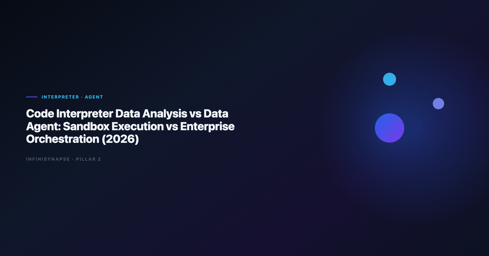

# Code Interpreter Data Analysis vs Data Agent (2026)

> **By the InfiniSynapse Data Team** · **Last updated: 2026-06-12** · *We benchmark interpreter-style sandboxes and production Data Agents on recurring KPI workflows across 40+ customer estates.*

**Meta Description**: Sandbox vs orchestration for code interpreter data analysis: governance, memory, audit trails, and when each execution model wins in production (2026).

**Slug**: `/blog/code-interpreter-vs-data-agent`

**Target keyword**: `code interpreter data analysis`
**Secondary**: `code interpreter vs data agent`, `chatgpt code interpreter enterprise`, `data agent orchestration`

---

## Table of Contents

1. [TL;DR](#tldr)
2. [Why Teams Compare Interpreter Sandboxes and Data Agents](#why-teams-compare-interpreter-sandboxes-and-data-agents)
4. [What a Data Agent Adds Beyond the Sandbox](#what-a-data-agent-adds-beyond-the-sandbox)
5. [Side-by-Side Comparison](#side-by-side-comparison)
6. [Production Scorecard from InfiniSynapse Pilots](#production-scorecard-from-infinisynapse-pilots)
8. [When a Data Agent Wins](#when-a-data-agent-wins)
9. [Operating Model Inside InfiniSynapse](#operating-model-inside-infinisynapse)
10. [Migration Path from Interpreter to Agent](#migration-path-from-interpreter-to-agent)
11. [Frequently Asked Questions](#frequently-asked-questions)
12. [Conclusion](#conclusion)

---

## TL;DR

> **Code interpreter data analysis** runs Python in an ephemeral sandbox — excellent for file uploads and quick charts, weak on governed connectors, durable memory, and inspectable multi-step orchestration. A **Data Agent** accepts a business goal, plans phases, queries live systems, logs every step, and distills reusable memory. Use interpreters for personal exploration; use agents when the same question must survive security review, team handoff, and next month's close.

**Who this is for**: analysts who love Code Interpreter demos but hit governance walls; platform owners comparing sandbox tools to agent platforms; buyers who already read [What Is a Data Agent?](/blog/what-is-a-data-agent) and need the interpreter-specific angle.

**What you'll learn**:

- How the interpreter sandbox differs from agent orchestration (not just "more SQL")
- A five-dimension comparison table with pass/fail tests
- Two production metrics from InfiniSynapse customer pilots
- A 30/60-day migration path from sandbox to agent

**Scope note**: For vendor shortlists beyond ChatGPT, see [Enterprise Alternatives to ChatGPT Code Interpreter](/blog/code-interpreter-alternatives).
For the Code Agent objective-function split (coding vs answering), see [Code Agent vs Data Agent](/blog/code-agent-vs-data-agent) — this article focuses on **sandbox execution vs orchestration**, not IDE agents.
Lakehouse buyers comparing Databricks surfaces should read [Databricks Assistant vs Genie vs Data Agent](/blog/databricks-genie-vs-data-agent); for human accountability beside agents, see [AI Data Analyst vs Human Analyst](/blog/ai-data-analyst-vs-human-analyst).

---

> **Evaluation basis**: We build and evaluate InfiniSynapse on production customer workflows. Governance, adoption, and security context is cited inline throughout this guide—not in a standalone reference list.

## Why Teams Compare Interpreter Sandboxes and Data Agents
GCP deployments should follow the [Google Research publications](https://research.google/pubs/) for service boundaries and operational guardrails.

The pattern repeats in every enterprise pilot: an analyst uploads a CSV to a code interpreter, gets a useful chart in four minutes, and leadership asks why that **code interpreter data analysis** session cannot power Monday's board deck. The gap is architectural, not prompt quality.

| Stakeholder ask | Interpreter reality | Data Agent expectation |
|-----------------|---------------------|------------------------|
| "Run this every month" | Session ends; definitions evaporate | Memory card locks joins and KPI logic |
| "Show your work to audit" | Notebook cells in chat history | Phase-level SQL and source trace |
| "Use our warehouse" | File upload or manual export | Governed connector with IAM |
| "Someone else runs it tomorrow" | Tribal knowledge in one chat | Goal + memory reproducible by role |

LLM-backed analytics should account for prompt-injection and data-exfiltration risks in the [Google Sheets documentation](https://support.google.com/docs/topic/9054603), especially when connectors expose production schemas. Adoption benchmarks in the [AWS Well-Architected Framework](https://docs.aws.amazon.com/wellarchitected/latest/framework/welcome.html) track the same shift from pilot demos to governed analytics loops we see in customer rollouts.

Teams evaluating **code interpreter data analysis** for production should separate *sandbox cleverness* from *operational trust*. The former optimizes one session; the latter optimizes recurring decisions across people and systems.

---

## What the Interpreter Sandbox Actually Does

**Code interpreter data analysis** is a pattern where a large language model writes and executes Python (or similar) inside an isolated runtime, typically against user-uploaded files or small in-memory datasets. ChatGPT Advanced Data Analysis is the reference implementation; Claude and Gemini ship comparable sandboxes.

### The sandbox execution model

1. User attaches a file or pastes a table snippet.
2. Model generates Python (pandas, matplotlib, scikit-learn).
3. Runtime executes code; stdout and charts return to chat.
4. User iterates with follow-up prompts.
5. Session closes — environment is destroyed.

The sandbox is the product boundary. It is not a connector layer, not a semantic layer, and not a workflow engine. That boundary explains most production failures for **code interpreter data analysis** at scale.

### Session boundaries that block enterprise use

| Sandbox trait | Analyst impact | Enterprise impact |
|---------------|----------------|-------------------|
| Ephemeral VM | Fast startup | No persistent job scheduling |
| File-centric input | Great for ad-hoc CSV | Bypasses warehouse IAM |
| User-driven steps | Full control | No unattended multi-phase runs |
| Chat history as "memory" | Convenient | Not a governed metric contract |
| Single-user session | Private exploration | No team replay or API parity |

Foundational warehouse concepts—grain, dimensions, and conformed metrics—remain essential; [Microsoft data architecture guidance](https://learn.microsoft.com/en-us/azure/architecture/data-guide/) is a concise refresher for reviewers validating generated SQL from interpreter output.

When stakeholders say they want **code interpreter data analysis** in production, clarify whether they mean *Python in a box* or *defensible answers from governed systems*. Only the sandbox delivers the first; agents deliver the second.

---

## What a Data Agent Adds Beyond the Sandbox

A **Data Agent** — defined in [What Is a Data Agent?](/blog/what-is-a-data-agent) — optimizes for **defensible answers**, not isolated code runs. The orchestration layer is the differentiator from **code interpreter data analysis**.

### Orchestration loops vs one-shot code runs

| Step | Interpreter sandbox | Data Agent orchestration |
|------|----------------------|--------------------------|
| Input | "Analyze this file" | "Why did April churn spike?" |
| Planning | Implicit in next prompt | Explicit phases: discover → query → validate → chart |
| Execution | One script per turn | Tool loop until goal met or honestly blocked |
| Failure | Error to user | Reroute: revise join, try alternate source |
| Output | Chart + code cell | Answer + audit trail + optional memory card |

Multi-source connector design should follow [Databricks Genie architecture post](https://www.databricks.com/blog/pushing-frontier-data-agents-genie) so domain boundaries and metric contracts stay explicit as scope grows beyond a single upload.

### Connector estate vs uploaded files

**Code interpreter data analysis** treats the file as the source of truth. A Data Agent discovers assets across warehouses, operational databases, spreadsheets, and documentation — then judges which definition of "active user" or "revenue" applies. That discovery step has no analogue in a sandbox unless the analyst manually exports everything first.

### Memory and metric contracts

Interpreter sessions forget column renames and filter logic when the chat closes. Production agents distill completed work into named memory: locked joins, approved time ranges, stakeholder-facing chart templates. The [Google Vertex AI documentation](https://cloud.google.com/vertex-ai/docs) adds dirty-schema realism that leaderboard demos under-weight — agents that self-correct on failed queries matter more than sandbox charts on clean CSVs.

---

## Side-by-Side Comparison

| Dimension | Code interpreter data analysis | Data Agent |
|-----------|----------------------------------|------------|
| **Primary runtime** | Ephemeral Python sandbox | Orchestration + federated query + RAG |
| **Data access** | Upload / paste | Governed connectors + files |
| **Objective** | Make code run and chart | Deliver defensible answer |
| **Autonomy** | User prompts each step | Goal-driven multi-phase execution |
| **Audit** | Chat transcript | Inspectable task timeline |
| **Memory** | Session history | Distilled reusable cards |
| **Governance** | User/account scoped | IAM, catalog, retention policies |
| **Multi-entry** | Chat UI | Web, chat, API parity |
| **Best fit** | Exploration, prototypes | Recurring KPI, compliance, handoff |

Interpreters excel when the dataset fits in a file and the analyst stays in the loop. Agents excel when the dataset lives in systems the analyst should not manually export — and when the same question returns next quarter with the same definitions. Production rollouts should align access and review controls with the [Amazon Redshift documentation](https://docs.aws.amazon.com/redshift/), especially when recurring queries touch live schemas. **Code interpreter data analysis** rarely satisfies finance or legal review without external controls (manual export policies, screenshot evidence). Agents built for enterprise ship query lineage by design.

| Test | Interpreter pass? | Agent pass? |
|------|-------------------|-------------|
| Same KPI next month without reprompting | ○ | ✅ |
| Peer can replay without author present | ○ | ✅ |
| Security approves live data path | ○ | ✅ |
| Audit can click every SQL step | ○ | ✅ |
| Executive asks via API or chat bot | ○ | ✅ |

---

## Production Scorecard from InfiniSynapse Pilots

We tracked two customer patterns migrating from interpreter-style workflows to InfiniSynapse Data Agents (Q1–Q2 2026). Recurring analytics loops benefit from [Google SRE book](https://sre.google/sre-book/table-of-contents/) patterns for scheduling, retries, and lineage hooks.

**Pilot A — Retail ops (interpreter → agent)**

| Metric | Interpreter baseline | After agent rollout |
|--------|---------------------|---------------------|
| Weekly inventory exception report | 45 min manual export + chat | 6 min goal submission |
| Definition drift incidents / month | 3.2 | 0.4 (memory-locked) |
| Analyst hours on boilerplate SQL | 12 h/week | 3 h/week |

The team kept **code interpreter data analysis** for one-off vendor file probes; recurring work moved to agent goals with InfiniSQL across MySQL and uploaded XLSX.

**Pilot B — B2B SaaS finance (governance gate)**

Finance blocked interpreter uploads of ARR exports. Agent connectors with read-only warehouse roles passed review in nine business days. Interpreter path remained blocked.

---

## When the Sandbox Wins

Choose the sandbox when:

1. **Dataset is small and non-sensitive** — conference feedback CSV, public sample, personal project.
2. **No recurrence requirement** — one exploration, no monthly job.
3. **Analyst wants full manual control** — tweaking matplotlib parameters line by line.
4. **No connector budget yet** — prototype before IAM and catalog work.
5. **Speed over audit** — internal brainstorm, not board-facing number.

For governed enterprise shortlists that still feel "interpreter-like," see [Enterprise Alternatives to ChatGPT Code Interpreter](/blog/code-interpreter-alternatives) — several tools add warehouse context without full agent orchestration.

---

## When a Data Agent Wins

Choose agent orchestration when:

1. **Same question repeats** — weekly churn, monthly revenue bridge, quarterly cohort.
2. **Multiple systems** — CRM + warehouse + finance spreadsheet in one answer.
3. **Audit or compliance** — someone must defend the number with query lineage.
4. **Team handoff** — [AI data analyst](/blog/ai-data-analyst) role owns goals; agents execute phases.
5. **Business users need access** — executives via chat or API, not Python literacy.

Warehouse-native options like Databricks Genie sit between sandbox and full agent; lakehouse teams often compare that path in [InfiniSynapse vs Databricks Genie](/blog/infinisynapse-vs-databricks-genie) when Unity Catalog already governs their data.

Operational maturity for analytics agents aligns with the [Wikipedia conceptual data model overview](https://en.wikipedia.org/wiki/Conceptual_data_model), especially around monitoring, rollback, and ownership.

---

## Operating Model Inside InfiniSynapse

1. Analyst or business user submits a one-sentence goal.
2. InfiniAgent plans phases and executes InfiniSQL across connected sources.
3. InfiniRAG retrieves org-specific definitions before joins.
4. Task timeline exposes every query, dataset, and chart for review.
5. Human [AI data analyst](/blog/ai-data-analyst) signs off before stakeholder delivery.

Completed tasks become memory cards: locked metric definitions, schema references, chart templates. Next month's **code interpreter data analysis**-equivalent question becomes a one-line recall — no re-export, no re-explaining joins.

Analytics uptime improves when teams borrow [Wikipedia machine learning overview](https://en.wikipedia.org/wiki/Machine_learning) practices—error budgets, runbooks, and blameless postmortems for failed query chains.

---

## Migration Path from Interpreter to Agent

**Phase 1 — Shadow (days 1–30):** Run interpreter sessions for exploration; run the same question as an agent goal in parallel. Compare definition stability and time-to-answer. Do not change production reporting yet.

**Phase 2 — Govern (days 31–60):** Connect one approved warehouse or database. Retire manual exports for that domain. Lock definitions in memory after first successful agent run.

**Phase 3 — Scale (days 61–90):** Add API or chat entry for business users. Keep interpreter access for individual ad-hoc files only. Document which questions are interpreter-allowed vs agent-required in your analyst playbook.

Warehouse vendors describe governed NL2SQL agents in [Google Research publications](https://research.google/pubs/)—compare memory depth and audit trails against your internal requirements if Databricks is in scope.

---

## Frequently Asked Questions

### Is interpreter-style analysis the same as a Data Agent?

No. **Code interpreter data analysis** executes code in a sandbox per session. A Data Agent orchestrates multi-step analysis against governed sources, ships audit trails, and distills memory. Interpreters assist analysts; agents automate repeatable analytical work under human oversight.

### Can I use Code Interpreter for enterprise reporting?

Sometimes for non-sensitive, non-recurring exports — rarely for governed production reporting. Security teams typically block file-upload paths for regulated data. Agents with connector IAM and query logging pass review more often.

### What is the main failure mode of interpreter sandboxes?

Metric drift and tribal knowledge. Each analyst's chat redefines filters differently; nobody can replay last month's logic without the original author. **Code interpreter data analysis** does not fix that without external discipline.

### How does InfiniSynapse differ from ChatGPT Code Interpreter?

InfiniSynapse is a Data Agent platform: goal-driven orchestration, federated query (InfiniSQL), knowledge-bound retrieval (InfiniRAG), auditable timelines, and memory cards. It is not an ephemeral Python sandbox. Free tier at [the InfiniSynapse web app](https://app.infinisynapse.cn).

### Should we ban interpreter sandboxes entirely?

No. Keep it for exploration and vendor file probes. Ban it only where policy requires — regulated uploads, recurring KPIs, and cross-system questions should run on agents or governed warehouse tools instead.

---

## Conclusion

**Code interpreter data analysis** and Data Agents solve different layers of the analytics stack. Sandboxes win on speed and file-based exploration; agents win on orchestration, governance, memory, and team-scale repetition. If your organization already standardizes on interpreters for demos, use this comparison to decide which questions must graduate to agent orchestration before the next audit or board cycle.

For definitions and architecture, read [What Is a Data Agent?](/blog/what-is-a-data-agent).
For interpreter vendor options, read [Enterprise Alternatives to ChatGPT Code Interpreter](/blog/code-interpreter-alternatives).
For the human role beside agents, read [AI Data Analyst: Role, Tools, and Workflow](/blog/ai-data-analyst).

---