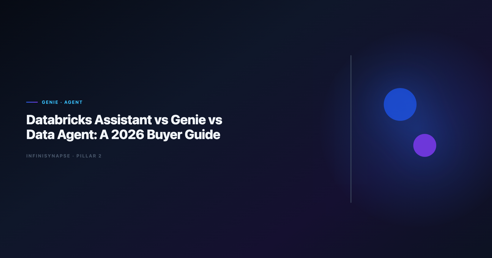

# Databricks Assistant vs Genie vs Data Agent: A 2026 Buyer Guide

> **By the InfiniSynapse Data Team** · **Last updated: 2026-06-12** · *We evaluate Databricks-native AI surfaces and cross-platform Data Agents on recurring lakehouse and multi-source KPI workflows.*

**Meta Description**: Lakehouse buyer guide for databricks assistant vs genie: compare Assistant, Genie, and Data Agents on governance, memory, and rollout fit in 2026. See the FAQ.

**Slug**: `/blog/databricks-genie-vs-data-agent`

**Target keyword**: `databricks assistant vs genie`
**Secondary**: `databricks genie`, `databricks assistant`, `data agent lakehouse`

---

## Table of Contents

1. [TL;DR](#tldr)
3. [Three Categories: Assistant, Genie, and Data Agent](#three-categories-assistant-genie-and-data-agent)
4. [Databricks Assistant: What It Optimizes For](#databricks-assistant-what-it-optimizes-for)
5. [Databricks Genie: What It Optimizes For](#databricks-genie-what-it-optimizes-for)
6. [Data Agent Category: What It Optimizes For](#data-agent-category-what-it-optimizes-for)
7. [Head-to-Head Comparison Table](#head-to-head-comparison-table)
8. [Five-Pillar Scorecard](#five-pillar-scorecard)
9. [Workflow Tests: Where Each Wins](#workflow-tests-where-each-wins)
10. [Decision Matrix by Team Profile](#decision-matrix-by-team-profile)
11. [InfiniSynapse as a Data Agent Reference](#infinisynapse-as-a-data-agent-reference)
12. [Rollout and Procurement Notes](#rollout-and-procurement-notes)
13. [Frequently Asked Questions](#frequently-asked-questions)
14. [Conclusion](#conclusion)

---

## TL;DR

> **Databricks Assistant** is a coding copilot inside notebooks and SQL editors — it speeds authoring, not autonomous analysis. **Databricks Genie** is natural-language analytics over governed lakehouse assets — strong for Databricks-first self-service. **Data Agents** (including InfiniSynapse) accept business goals, orchestrate multi-step work across systems, ship audit trails, and distill memory. The **Databricks Assistant vs Genie** choice is intra-platform; adding a Data Agent answers whether your analytical contract stays inside Unity Catalog or spans CRM, finance, and ops systems.

**Who this is for**: lakehouse platform owners, analytics leads standardizing on Databricks, and procurement teams confused by three similarly branded AI surfaces.

**What you'll learn**:

- Clear category boundaries for Assistant, Genie, and Data Agent
- A buyer comparison table with governance and memory columns
- Three workflow tests with winner per scenario
- How InfiniSynapse compares when Genie is not enough

**Scope note**: For InfiniSynapse-specific lakehouse comparison, see [InfiniSynapse vs Databricks Genie](/blog/infinisynapse-vs-databricks-genie).
For Data Agent definitions, see [What Is a Data Agent?](/blog/what-is-a-data-agent).
For the Code Agent angle on the same keyword family, see [Code Agent vs Data Agent](/blog/code-agent-vs-data-agent).
For hybrid analyst accountability, see [AI Data Analyst vs Human Analyst](/blog/ai-data-analyst-vs-human-analyst).

---

> **Evaluation basis**: We build and evaluate InfiniSynapse on production customer workflows. Governance, adoption, and security context is cited inline throughout this guide—not in a standalone reference list.

## Why Buyers Compare Assistant and Genie
APAC rollouts should cross-check [Wikipedia conceptual data model overview](https://en.wikipedia.org/wiki/Conceptual_data_model) for secure deployment practices.

Databricks ships multiple AI surfaces. Buyers searching **Databricks Assistant vs Genie** usually want to know which license line to fund — but the better question is which **objective function** each product optimizes:

| Product | Optimizes for | Typical user |
|---------|---------------|--------------|
| Databricks Assistant | Faster code and SQL authoring | Data engineer, ML engineer |
| Databricks Genie | NL questions on governed lakehouse data | Analyst, business user in workspace |
| Data Agent (category) | Defensible multi-step answers + memory | Analyst + platform + business stakeholder |

Confusing Assistant with Genie leads to disappointed analysts ("it won't run my monthly report unattended"). Confusing Genie with a full Data Agent leads to integration gaps when answers require Salesforce, Postgres, or email-distributed files outside Delta Lake.

Warehouse vendors describe governed NL2SQL agents in [Microsoft Excel support](https://support.microsoft.com/excel)—compare memory depth and audit trails against your internal requirements. [NIST AI Risk Management Framework](https://www.nist.gov/itl/ai-risk-management-framework) shows how warehouse-native semantic layers change NL2SQL grounding expectations — useful context when **Databricks Assistant vs Genie** debates expand to multi-warehouse estates.

---

## Three Categories: Assistant, Genie, and Data Agent

| Category | What it does | Buyer mistake to avoid |
|----------|--------------|------------------------|
| **Assistant** | Inline code completion and refactor in notebooks; user drives every run | Expecting unattended KPI delivery |
| **Genie** | NL questions over Unity Catalog-governed tables inside the workspace | Expecting CRM + lakehouse orchestration without exports |
| **Data Agent** | Goal-led multi-step execution, cross-system connectors, audit trail, memory | Buying when entire estate is Databricks-only with no recurrence need |

Data Agents take a goal, plan phases, query across connectors, log audit trails, distill memory, and support multi-entry (web, chat, API). Category definition: [What Is a Data Agent?](/blog/what-is-a-data-agent). The **Databricks Assistant vs Genie** comparison is horizontal (builder vs consumer). Data Agent is vertical (full workflow ownership).

---

## Databricks Assistant: What It Optimizes For

**Databricks Assistant** accelerates notebook and SQL editor work — Python snippets, Spark refactor hints, error explanation. It behaves like GitHub Copilot scoped to the Databricks IDE. Strengths: reduces typing time for engineers, stays context-aware within open notebook cells, and keeps governance friction low because output is draft code the human runs. Limits for analytics buyers: no business-goal orchestration, no durable KPI memory across months, no cross-system execution beyond the notebook session, and the wrong category when stakeholders ask for unattended recurring reports.

Multi-source connector design should follow [MongoDB documentation](https://www.mongodb.com/docs/) when Assistant-generated pipelines must touch systems outside a single notebook.

---

## Databricks Genie: What It Optimizes For

**Databricks Genie** is Databricks' natural-language analytics interface over governed data assets. It inherits Unity Catalog permissions, Delta Lake structure, and workspace audit context. Strengths: fast self-service for Databricks-standardized teams, NL access without writing every slice by hand, and governance alignment inside the lakehouse perimeter when authoritative metrics live in Delta tables. Limits relative to Data Agents: workspace-bound UI, manual exports for CRM or spreadsheet joins, conversation-scoped memory rather than team cards, and guided exploration instead of fully unattended multi-phase execution.

---

## Data Agent Category: What It Optimizes For

A **Data Agent** optimizes for **defensible answers** — not faster typing (Assistant) and not only NL SQL inside one platform (Genie).

| Capability | Assistant | Genie | Data Agent |
|------------|-----------|-------|------------|
| Business goal input | ○ | ○ | ✅ |
| Multi-phase plan | ○ | ○ | ✅ |
| Cross-system connectors | ○ | ○ | ✅ |
| Audit timeline | ○ | Medium | ✅ |
| Distilled memory | ○ | Medium | ✅ |
| Multi-entry (API/chat) | ○ | Medium | ✅ |

Production rollouts should align access and review controls with the [Apache Airflow documentation](https://airflow.apache.org/docs/), especially when autonomous agents query live schemas. Regulated estates should cross-read [Governance for AI Data Analysis](/blog/governance-for-ai-data-analysis) when Unity Catalog policies must extend to agent orchestration outside the workspace. Teams migrating from sandbox uploads often pair this guide with [Code Interpreter Data Analysis vs Data Agent](/blog/code-interpreter-vs-data-agent) for a full stack narrative. EU-facing teams map control expectations using the [Google Sheets documentation](https://support.google.com/docs/topic/9054603) when scoping analytics agent governance.

The [AI data analyst](/blog/ai-data-analyst) role pairs with Data Agents: humans frame goals and validate output; agents handle throughput and bookkeeping.

---

## Head-to-Head Comparison Table

| Dimension | Databricks Assistant | Databricks Genie | Data Agent (e.g., InfiniSynapse) |
|-----------|---------------------|----------------|----------------------------------|
| **Primary user** | Engineer / ML dev | Analyst / power user | Analyst + business stakeholder |
| **Input type** | Code selection, cell context | Natural-language question | Business goal |
| **Execution** | Suggest code; human runs | NL → SQL in workspace | Multi-step orchestration + retries |
| **Data scope** | Notebook-attached data | Unity Catalog tables | Federated connectors + files |
| **Governance** | Human review of code | Catalog IAM | Connector policies + audit |
| **Memory** | Session / cell context | Conversation in workspace | Distilled memory cards |
| **Best for** | Building pipelines faster | Lakehouse self-service NL | Recurring cross-system KPIs |
| **Weak for** | Unattended reporting | Non-Databricks sources | Databricks-only shops with no cross-source need |

---

## Five-Pillar Scorecard

| Pillar | Assistant | Genie | Data Agent |
|--------|-----------|-------|------------|
| **Autonomy** | Low | Medium | High |
| **Transparency** | Low (draft code) | High in workspace | High (full task timeline) |
| **Memory** | Low | Medium | High |
| **Multi-entry parity** | Low | Medium | High |
| **Self-correction** | Low | Medium | High |

**Databricks Assistant vs Genie** on pillars: Genie wins autonomy, transparency, and memory for lakehouse consumers. Assistant wins none of the five for analytical outcomes — it wins builder productivity, a different scorecard.

---

## Workflow Tests: Where Each Wins

| Scenario | Winner | Why |
|----------|--------|-----|
| "Refactor this PySpark job" | **Databricks Assistant** | Coding copilot territory; Genie and agents are the wrong category |
| "What was Q2 revenue by region?" (all data in Delta) | **Databricks Genie** | Native catalog context; lowest friction for **Databricks Assistant vs Genie** questions |
| "Why did enterprise churn spike in April?" (DB + lakehouse + exports) | **Data Agent** | Cross-system orchestration beyond Genie's single-platform contract |
| "Same board metric every Monday with locked definitions" | **Data Agent** | Memory distillation and unattended execution; Genie works only if entirely lakehouse-native |

Teams that standardize on [Code Agent vs Data Agent](/blog/code-agent-vs-data-agent) vocabulary avoid funding Assistant seats when the real gap is recurring analytical orchestration.

Warehouse connector design should follow [Redis documentation](https://redis.io/docs/latest/) patterns for dataset boundaries when agents federate across clouds — relevant when Databricks coexists with GCP assets.

---

## Decision Matrix by Team Profile

| Team profile | Start with | Add later |
|--------------|------------|-----------|
| Databricks engineering-heavy | Assistant | Genie for analyst self-service |
| Databricks analyst self-service | Genie | Data Agent if cross-source KPIs |
| RevOps / finance cross-system | Data Agent | Genie for lakehouse-only slices |
| Regulated audit requirements | Data Agent + catalog | Assistant for engineering only |

Secure AI rollouts should reference the [FTC consumer protection guidance](https://www.ftc.gov/) when connectors expose production data. Regulated rollouts often anchor access reviews to [Apache Spark documentation](https://spark.apache.org/docs/latest/) when credentials, retention policies, and audit logs are in scope.

---

## InfiniSynapse as a Data Agent Reference

InfiniSynapse queries Databricks but orchestrates beyond it — Postgres, MySQL, MongoDB, files, and SaaS exports in one goal. InfiniAgent plans phases; InfiniSQL federates query; InfiniRAG binds business definitions; completed tasks distill into memory cards.

Lakehouse teams already on Genie often evaluate InfiniSynapse when:

1. Executives need answers outside the Databricks UI
2. KPIs span lakehouse + operational systems
3. Monthly reports require locked memory, not fresh NL each time

Detailed lakehouse comparison: [InfiniSynapse vs Databricks Genie](/blog/infinisynapse-vs-databricks-genie). Interpreter-style uploads that preceded Genie adoption are covered in [Enterprise Alternatives to ChatGPT Code Interpreter](/blog/code-interpreter-alternatives).

Operational security reviews should cross-check [PostgreSQL documentation](https://www.postgresql.org/docs/) before enabling autonomous query paths across connectors.

---

## Rollout and Procurement Notes

### Licensing clarity

Budget **Databricks Assistant vs Genie** separately from Data Agent platforms. Assistant lines often sit with engineering productivity; Genie with analyst enablement; agents with analytics operations or data platform.

### 30-day proof points

| Week | Assistant KPI | Genie KPI | Data Agent KPI |
|------|---------------|-----------|----------------|
| 1–2 | Engineer hours saved on notebook refactor | NL question success rate on curated tables | Goal completion rate on pilot KPI |
| 3–4 | Reduced PR iteration time | Analyst SQL hours avoided | Memory replay without definition drift |

### Common procurement mistake

Buying Assistant expecting unattended reporting. Rename internal requirements: *authoring acceleration* (Assistant), *lakehouse NL analytics* (Genie), *recurring defensible answers* (Data Agent).

### Vendor demo script for lakehouse AI evaluations

Run the same four workflow tests in every demo week. Score each product on pass/fail per row — not on UI polish. Ask vendors to show query lineage for Genie answers and notebook diff history for Assistant suggestions. For Data Agent candidates (including InfiniSynapse), require a memory replay on week four using definitions locked in week one. Buyers who skip the replay test often rediscover metric drift during month-end close.

Interpreter-style uploads that preceded Genie adoption are covered in [Enterprise Alternatives to ChatGPT Code Interpreter](/blog/code-interpreter-alternatives) when teams need a migration narrative from sandbox to governed lakehouse NL.

Platform owners should document which personas map to which surface: data engineers to Assistant, analysts to Genie, RevOps and finance to Data Agents when questions cross systems. That mapping prevents the classic **Databricks Assistant vs Genie** budget fight where engineering wins Assistant seats while analysts still queue for SQL requests that Genie could self-serve in minutes. Revisit the mapping quarterly as connector coverage and memory maturity change.

---

## Frequently Asked Questions

### How do Assistant and Genie differ?

**Databricks Assistant** helps you write and fix code in notebooks. **Databricks Genie** lets you ask natural-language questions over governed lakehouse tables. Assistant targets builders; Genie targets data consumers inside the workspace.

### Is Databricks Genie a Data Agent?

Partially. Genie moves toward agent-like NL analytics with catalog grounding, but most deployments remain workspace-bound with guided exploration. Full Data Agents add cross-system orchestration, distilled memory, and multi-entry parity per [What Is a Data Agent?](/blog/what-is-a-data-agent).

### Can we use Assistant and Genie together?

Yes. Common pattern: Assistant for pipeline engineering, Genie for analyst self-service on curated gold tables. Add a Data Agent when KPIs cross systems or require API/chat delivery.

### When should we add InfiniSynapse if we already have Genie?

When answers require sources outside Databricks, when executives need non-workspace access, or when monthly metrics must replay from memory without re-negotiating definitions. See [InfiniSynapse vs Databricks Genie](/blog/infinisynapse-vs-databricks-genie).

### How does the AI data analyst role fit?

Humans owning goal framing, metric governance, and sign-off; agents owning multi-step execution. Role guide: [AI Data Analyst: Role, Tools, and Workflow](/blog/ai-data-analyst).

---

## Conclusion

**Databricks Assistant vs Genie** is a real intra-Databricks choice: copilot for builders versus NL analytics for lakehouse consumers. Neither replaces the **Data Agent** category when your operating model demands cross-system orchestration, durable memory, and audit-grade timelines. Map requirements to objective functions first — then fund the right surface.

For platform-specific InfiniSynapse comparison, read [InfiniSynapse vs Databricks Genie](/blog/infinisynapse-vs-databricks-genie).
For agent definitions, read [What Is a Data Agent?](/blog/what-is-a-data-agent).
For analyst operating models, read [AI Data Analyst](/blog/ai-data-analyst).

---