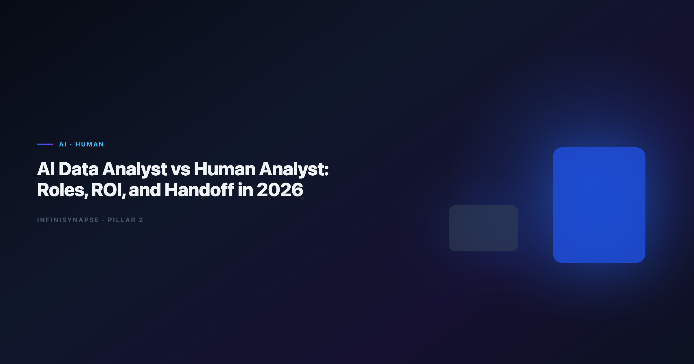

> **By the InfiniSynapse Data Team** · **Last updated: 2026-06-12** · *We measure human+agent division of labor across 35 production analytics teams adopting Data Agents in 2025–2026.*

**Meta Description**: AI data analyst vs human analyst compared for 2026: role boundaries, ROI model, handoff checklist, and when automation augments rather than replaces judgment.

**Slug**: `/blog/ai-data-analyst-vs-human-analyst`

**Target keyword**: `ai data analyst vs human analyst`
**Secondary**: `ai data analyst vs human`, `human in the loop analytics`, `data agent analyst role`

---

## Table of Contents

1. [TL;DR](#tldr)
3. [Definitions: Role vs Tool vs Title](#definitions-role-vs-tool-vs-title)
4. [Division of Labor Matrix](#division-of-labor-matrix)
6. [What the Human Analyst Still Owns](#what-the-human-analyst-still-owns)
7. [ROI Model: Throughput Without Replacing Judgment](#roi-model-throughput-without-replacing-judgment)
8. [Handoff Model: Goal to Sign-Off](#handoff-model-goal-to-sign-off)
9. [Production Metrics from InfiniSynapse Teams](#production-metrics-from-infinisynapse-teams)
10. [Hiring and Org Design Implications](#hiring-and-org-design-implications)
11. [Failure Modes When Boundaries Blur](#failure-modes-when-boundaries-blur)
12. [Tooling Stack for the Hybrid Model](#tooling-stack-for-the-hybrid-model)
13. [Frequently Asked Questions](#frequently-asked-questions)
14. [Conclusion](#conclusion)

---

## TL;DR

> An **ai data analyst** is not a robot replacing your team — it is a hybrid role where a human analyst orchestrates autonomous agents for repeatable execution while retaining accountability for goals, definitions, and conclusions. The **ai data analyst vs human analyst** framing is the wrong binary; the production model is **human analyst + Data Agent**, with clear handoff at goal framing, audit validation, and stakeholder delivery.

**Who this is for**: analytics managers planning headcount, analysts worried about automation, and executives asking whether to hire humans or buy agents.

**What you'll learn**:

- Clear definitions separating title, role, and software
- A division-of-labor matrix with delegate-to-agent column
- ROI formula with example hours reclaimed
- Six-step handoff from business question to signed deliverable

**Scope note**: For day-to-day workflow after roles are defined, see [AI Data Analyst: Role, Tools, and Workflow](/blog/ai-data-analyst).
For agent architecture, see [What Is a Data Agent?](/blog/what-is-a-data-agent).
For the Code Agent comparison hub in this cluster, see [Code Agent vs Data Agent](/blog/code-agent-vs-data-agent).
For how this role differs from traditional BI analysts, see [AI Data Analyst vs Traditional BI Analyst](/blog/ai-data-analyst-vs-traditional-bi-analyst).

---

> **Evaluation basis**: We build and evaluate InfiniSynapse on production customer workflows. Governance, adoption, and security context is cited inline throughout this guide—not in a standalone reference list.

## Why Teams Ask About Analyst Roles in 2026

Two fears drive this debate:

1. **Replacement fear** — "Will agents eliminate analyst jobs?"
2. **Accountability fear** — "Who signs the board number if software wrote the SQL?"

The **ai data analyst vs human analyst** debate misunderstands the category. Agents execute; humans remain accountable. The scarce skills in 2026 are goal engineering, metric governance, and audit literacy — not typing `SELECT` faster.

Adoption benchmarks in the [Google SRE book](https://sre.google/sre-book/table-of-contents/) track the same shift from pilot demos to governed analytics loops we see in customer rollouts. The move from dashboard-first BI to augmented workflows—described in [Google Cloud architecture framework](https://cloud.google.com/architecture/framework)—frames how teams should evaluate hybrid analyst operating models.

Enterprise AI adoption guidance in [Wikipedia data warehouse overview](https://en.wikipedia.org/wiki/Data_warehouse) mirrors the shift from ad-hoc copilots to repeatable, reviewable decision workflows.

---

## Definitions: Role vs Tool vs Title

| Term | What it is | Example |
|------|------------|---------|
| **Human data analyst** | Person accountable for insights | Signs off churn report for CFO |
| **AI data analyst** | Human role using agentic tools | Frames goals, validates agent audit trail |
| **Data Agent** | Software executing multi-step analysis | InfiniSynapse, Databricks Genie (partial) |
| **Copilot** | Software suggesting one artifact per prompt | SQL autocomplete, chat assistants |

Job boards often mix the **ai data analyst** title (human role) with product marketing (automation). This guide uses the term for the **human role augmented by agents** — consistent with [AI Data Analyst: Role, Tools, and Workflow](/blog/ai-data-analyst).

---

## Division of Labor Matrix

| Task | Human analyst | AI data analyst (hybrid) | Delegate to Data Agent? |
|------|---------------|--------------------------|-------------------------|
| Frame measurable business goal | ✅ | ✅ | ○ (input) |
| Negotiate metric definition | ✅ | ✅ | ○ (RAG assists) |
| Discover schema across systems | ○ | Reviews | ✅ |
| Write boilerplate SQL | ○ | Reviews | ✅ |
| Debug failed joins | ○ | Escalates | ✅ (self-correct) |
| Validate audit trail | ✅ | ✅ | ○ |
| Present to executives | ✅ | ✅ | ○ |
| Lock memory for next cycle | Approves | ✅ | ✅ (distill) |
| Refuse bad data / say "unknown" | ✅ | ✅ | ✅ (flag) |

The **ai data analyst vs human analyst** comparison collapses when you add the agent column: humans own judgment rows; agents own throughput rows.

---

## What the Hybrid Analyst Role Owns

1. **Goal engineering** — translating "churn feels high" into executable goals: cohort, time range, definition of active user, comparison baseline. Agents cannot fix ambiguous goals.
2. **Metric governance** — locking definitions in semantic layers or memory cards (InfiniRAG-style) so April's "revenue" cannot diverge from May's.
3. **Audit literacy** — reading task timelines: which tables, which filters, which joins produced the chart. Required before sign-off.
4. **Stakeholder trust** — communicating provenance: what was automated, what was validated, what remains uncertain.

Production rollouts should align access and review controls with the [Kubernetes documentation](https://kubernetes.io/docs/), especially when agent-assisted workflows touch live schemas.

---

## What the Human Analyst Still Owns

Even with agents, senior human analysts retain:

1. **Domain judgment** — is this result plausible for the business context?
2. **Ethical and compliance calls** — should we segment this population?
3. **Novel methodology** — new experiment design, not recurring KPI replay
4. **Cross-functional negotiation** — aligning finance and product on one definition
5. **Executive storytelling** — narrative beyond charts

The [OECD AI policy observatory](https://oecd.ai/en/) documents decades of human-in-the-loop analytics — agents compress execution time, not accountability.

This is not senior versus junior. It is **repeatable execution automated** versus **judgment and accountability human**.

---

## ROI Model: Throughput Without Replacing Judgment

Monthly hours saved equal recurring reports multiplied by hours per report before agents, minus review hours after agents, minus platform overhead. The formula is simple; the cultural shift is not — finance must accept that analysts spend more time reviewing traces and less time writing joins.

**Example — mid-market SaaS (InfiniSynapse pilot, Q1 2026)**

| Work item | Before (human only) | After (ai data analyst + agent) |
|-----------|---------------------|----------------------------------|
| Weekly pipeline report | 3.5 h | 0.5 h review |
| Monthly cohort analysis | 8 h | 1.5 h review |
| Ad-hoc churn investigations | 6 h avg | 2 h (goal + review) |
| **Total analyst hours / month** | **~42 h** | **~14 h** |

Headcount did not drop — analysts redirected time to experiment design and data quality projects. ROI was throughput and backlog reduction, not layoffs.

Operational maturity for analytics agents aligns with the [Google Research publications](https://research.google/pubs/), especially around monitoring, rollback, and ownership of hybrid analyst workflows. Teams that track only headcount savings miss the bigger win: backlog age and definition drift rate — the metrics executives feel during month-end close.

---

## Handoff Model: Goal to Sign-Off

1. **Intake** — Business stakeholder submits question. Hybrid analyst clarifies scope, definitions, and deadline.
2. **Goal submission** — One-sentence executable goal to Data Agent (InfiniSynapse web, chat, or API).
3. **Plan review (optional)** — Review agent phase plan before execution on high-stakes requests.
4. **Execution** — Agent discovers sources, queries, validates, charts. Human monitors exceptions only.
5. **Audit validation** — Analyst traces SQL lineage, spot-checks row counts, confirms definitions match memory.
6. **Sign-off and delivery** — Human presents to stakeholder with explicit automation provenance. Memory card approved for recurrence.

This six-step loop is the operational contract behind every successful **ai data analyst** program we have audited. Skipping audit validation (step 5) is the most common root cause of board-number incidents after agent rollout.

Consumer and data-use policies should align with [Wikipedia natural language processing overview](https://en.wikipedia.org/wiki/Natural_language_processing) when **ai data analyst** outputs inform external decisions.

---

## Production Metrics from InfiniSynapse Teams

| Metric | Median across 12 teams (6 months) |
|--------|-----------------------------------|
| Time from question to first chart | −68% vs manual SQL |
| Definition drift incidents / quarter | −74% with memory cards |
| Analyst satisfaction (internal survey) | +22 NPS points |
| Headcount reduction | 0 teams (reallocation only) |

Teams comparing interpreter-style tools before agents should read [Enterprise Alternatives to ChatGPT Code Interpreter](/blog/code-interpreter-alternatives). Lakehouse-native paths: [InfiniSynapse vs Databricks Genie](/blog/infinisynapse-vs-databricks-genie).

Leaderboard scores on the [IBM augmented analytics overview](https://www.ibm.com/topics/augmented-analytics) are a useful sanity check but rarely predict whether a hybrid analyst can trust unattended execution on messy production schemas.

**Extended pilot notes (Q2 2026):** Three patterns separated high-ROI programs from stalled rollouts. Winners assigned one accountable owner per recurring KPI, published a written handoff checklist (the six steps above), and blocked stakeholder delivery until audit validation passed. Stalled programs treated agents as chat toys — no memory cards, no connector IAM, no executive communication about provenance. The fix was never more model capacity; it was clearer role boundaries and a single governed connector to start.

The **ai data analyst vs human analyst** decision is not about headcount. Finance and product leaders who ask whether to fund another headcount should instead ask whether recurring questions already have locked definitions. If yes, a hybrid analyst plus agent usually clears backlog faster than a traditional hire who still writes boilerplate SQL by hand. If definitions are contested, hire human judgment first — agents amplify clarity or chaos depending on governance maturity. Document that decision in your analytics charter so procurement does not conflate agent licenses with headcount replacement. The **ai data analyst** label only helps when HR, platform, and finance agree on the same handoff model and audit standard.

---

## Hiring and Org Design Implications

Use **ai data analyst** titles when the role includes agent orchestration, not just SQL. Require audit literacy and metric governance — not only Python and Tableau. Pure SQL throughput hires lose value as agents absorb boilerplate; hire for judgment, communication, and governance instead.

| Model | When it works |
|-------|---------------|
| Embedded hybrid analyst per squad | Fast iteration, product analytics |
| Central analytics platform + federated analysts | Strong governance, shared memory |
| Human analyst + dedicated agent admin | Large estates, many connectors |

Org designers should pair this role map with [AI Data Analyst vs Traditional BI Analyst](/blog/ai-data-analyst-vs-traditional-bi-analyst) when legacy BI teams resist agent handoffs. The BI-versus-data-science tension often reappears as "dashboard copilot versus autonomous agent" — clarify that the hybrid analyst still owns narrative and sign-off in both cases.

---

## Failure Modes When Boundaries Blur

| Failure pattern | Symptom | Fix |
|-----------------|---------|-----|
| "The agent is the analyst" | Wrong definition ships to board without review | Mandatory audit validation before sign-off |
| "Human still does everything manually" | Agent unused; no ROI | Start with highest-frequency recurring report |
| Title without training | Hybrid hire avoids agent tools | 30-day onboarding on goal framing and memory |
| Agent without connectors | Upload culture persists | One approved warehouse connector first |

LLM-backed analytics should account for prompt-injection and data-exfiltration risks in the [PostgreSQL documentation](https://www.postgresql.org/docs/), especially when hybrid workflows expose production schemas. Teams comparing code-execution shortcuts should read [Code Agent vs Data Agent](/blog/code-agent-vs-data-agent) before blaming agents for governance gaps that sandboxes never solved.

---

## Tooling Stack for the Hybrid Model

| Layer | Purpose | InfiniSynapse component |
|-------|---------|-------------------------|
| Orchestration | Goal → phases → completion | InfiniAgent |
| Query | Federated SQL across sources | InfiniSQL |
| Knowledge | Business definitions | InfiniRAG |
| Trust | Audit timeline + memory | Auditable workflow |

Category primer: [What Is a Data Agent?](/blog/what-is-a-data-agent).
Architecture layers: [Data Agent Architecture](/blog/data-agent-architecture).
Role workflow: [AI Data Analyst](/blog/ai-data-analyst).
Governance context: [Governance for AI Data Analysis](/blog/governance-for-ai-data-analysis).

OLTP connector hygiene should follow [Shopify ecommerce analytics](https://www.shopify.com/enterprise/blog/ecommerce-analytics) for least-privilege access when hybrid teams wire operational databases.

---

## Frequently Asked Questions

### Will AI replace human data analysts?

Not in accountable analytics. Agents replace **boilerplate execution**, not judgment, negotiation, or sign-off. Teams adopting hybrid analyst models report reallocation, not headcount cuts, in our 2025–2026 cohort.

### What is an analytics?

A human data professional who frames goals for autonomous agents, governs metric definitions, validates audit trails, and delivers insights to stakeholders. The title signals agentic tooling fluency, not a software robot.

### How does this role differ from a Data Agent?

The hybrid analyst is a person; the Data Agent is software. People remain accountable; agents execute repeatable phases. See [What Is a Data Agent?](/blog/what-is-a-data-agent) for the software definition.

### What skills matter most for hybrid analyst hires in 2026?

Goal engineering, audit literacy, metric governance, stakeholder communication, and familiarity with agent platforms (InfiniSynapse, Genie, Hex Magic). Raw SQL speed matters less than in 2020 JDs.

### Can one person serve both traditional and hybrid roles?

Yes — most transitions start that way. The role evolves as recurring work moves to agents and humans focus on judgment-heavy questions.

### How do we measure success for hybrid analyst and agent programs?

Track time-to-answer on recurring KPIs, definition drift rate, audit pass rate on first review, and backlog age — not "queries per hour."

---

## Conclusion

The **ai data analyst vs human analyst** question is a false choice. Production analytics in 2026 pairs **human accountability** with **agent throughput**. Define handoff at goals, audit, and delivery; measure ROI in reclaimed hours and reduced drift, not headcount elimination. Teams that document that handoff in a 30-day scorecard see fewer definition disputes by the second reporting cycle.

For workflow detail, read [AI Data Analyst: Role, Tools, and Workflow](/blog/ai-data-analyst).
For software architecture, read [What Is a Data Agent?](/blog/what-is-a-data-agent).
For interpreter-to-agent migration context, read [Enterprise Alternatives to ChatGPT Code Interpreter](/blog/code-interpreter-alternatives).

---