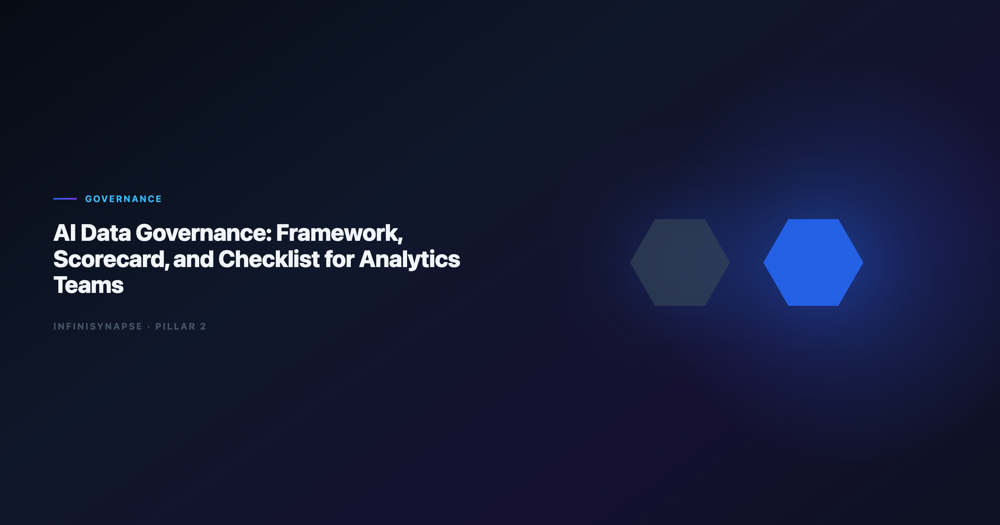

> **By the InfiniSynapse Data Team** · **Last updated: 2026-06-12** · *We build InfiniSynapse, a Data Agent platform. This governance guide reflects eighteen months of enterprise rollouts where audit, security, and analytics teams negotiated the same controls.*

**Meta Description**: AI data governance for analytics teams: NIST AI RMF mapping, ISO baselines, OWASP LLM controls, a five-layer framework, scorecard, and production checklist. (156 chars)

**Slug**: `/blog/governance-for-ai-data-analysis`

**Target keyword**: `ai data governance`
**Secondary**: `data governance for AI analytics`, `NIST AI RMF analytics`, `LLM data governance`

---

## Table of Contents

1. [TL;DR](#tldr)
2. [Why Governed Analytics Execution Matters Now](#why-governed-analytics-execution-matters-now)
3. [Definition and Scope Boundaries](#definition-and-scope-boundaries)
4. [NIST AI RMF Mapping for Analytics Teams](#nist-ai-rmf-mapping-for-analytics-teams)
5. [ISO and Security Baselines](#iso-and-security-baselines)
6. [OWASP LLM Risk Controls](#owasp-llm-risk-controls)
7. [The Five-Layer Governance Framework](#the-five-layer-governance-framework)
8. [Governance Scorecard](#governance-scorecard)
9. [Implementation Checklist](#implementation-checklist)
10. [How Data Agents Change Governance](#how-data-agents-change-governance)
11. [FAQ](#frequently-asked-questions)
12. [Conclusion](#conclusion)

---

## TL;DR

> **AI data governance** is the set of policies, controls, and review gates that ensure autonomous or semi-autonomous analytics systems access only approved data, use locked metric definitions, produce inspectable evidence chains, and retain outputs under rules your security and compliance teams can audit.

**Who this is for**: heads of data, analytics leads, and security reviewers who must approve NL2SQL copilots, warehouse assistants, or full [Data Agents](/blog/what-is-a-data-agent) before they touch production schemas.

**What you'll learn**:

- A citable definition scoped to analytics — not generic enterprise AI policy
- NIST AI RMF **Govern–Map–Measure–Manage** mapping for analytics estates
- ISO and OWASP controls that survive procurement review
- A five-layer framework with pass/fail scorecard
- A phased checklist from pilot to scale

**Scope note**: This guide covers analytics execution governance — access, definitions, audit, memory. For platform buying criteria, see [AI-Native vs Augmented Analytics](/blog/ai-native-vs-augmented-analytics). For analyst-tool comparisons, see [AI Data Analyst vs BI Tools](/blog/ai-data-analyst-vs-bi-tools).

---

> **Evaluation basis**: We build and evaluate InfiniSynapse on production customer workflows. Governance, adoption, and security context is cited inline throughout this guide—not in a standalone reference list.

## Why Governed Analytics Execution Matters Now
Lakehouse integrations should use [Databricks documentation](https://docs.databricks.com/en/) for Unity Catalog, SQL warehouses, and agent grounding patterns.

Public-sector buyers should review [NIST Computer Security Resource Center](https://csrc.nist.gov/) when procuring analytics agents.

Regulated rollouts often anchor access reviews to [NIST SP 800-53 security controls](https://csrc.nist.gov/pubs/sp/800/53/r5/final) when credentials, retention policies, and audit logs are in scope.

Analytics teams crossed a threshold in 2025–2026: copilots that wrote one SQL snippet became agents that planned multi-phase analysis across live connectors. That shift raises governance questions dashboards never triggered — not because the math changed, but because **execution became autonomous**.

### The Copilot-to-Agent Gap

A copilot generates the next artifact; a human still drives each step. A Data Agent accepts a business goal, discovers assets, executes a plan, and distills memory. Without **ai data governance**, the agent inherits every over-broad database role, every ambiguous KPI definition, and every shortcut your analysts took in a one-off notebook.

### What Audit Teams Actually Ask

In our enterprise pilots, security reviewers consistently ask four questions before sign-off:

1. **Which tables can the system reach?** Role design must be least-privilege, not "read-only on everything."
2. **Can we replay how a number was produced?** Inspectable SQL and phase logs — not a narrative paragraph.

3. **What happens when the model hallucinates a join?** Self-correction with logged reroutes beats silent failure.

4. **Where do completed analyses live?** Retention, PII redaction, and approval before memory reuse.

| Signal | Copilot-era risk | Agent-era risk |
|--------|------------------|----------------|
| Data access | User pastes subset | Connector inherits warehouse roles |
| Definitions | Session-only | Memory cards propagate wrong grain |
| Audit | Chat transcript | Multi-phase plan across sources |
| Review | Optional | Required before external decisions |

---

## Definition and Scope Boundaries

> **Citable Definition (52 words)**: **AI data governance** is the policy and control layer that governs how AI-enabled analytics systems discover data, apply metric definitions, execute queries, expose evidence for human review, and retain outputs — ensuring every automated analysis path is authorized, inspectable, and aligned with organizational data-quality and security standards.

| Term | Relationship to **ai data governance** |
|------|----------------------------------------|
| **Data governance** | Parent — ownership, catalog, quality across all systems |
| **AI governance** | Sibling — model risk, bias, lifecycle for ML products |
| **Analytics governance** | Overlap — metric contracts, semantic layers, BI access |
| **AI data governance** | Intersection — autonomous analytics on governed estates |

### Scope Boundaries

- Connector credentials and role design
- Metric definition locking and semantic alignment
- Query execution logs and phase timelines
- Human approval before memory distillation
- Retention, export, and deletion of agent outputs

| In scope | Out of scope (separate programs) |
|----------|----------------------------------|
| NL2SQL and agent query paths | General LLM chat without data connectors |
| Memory cards and distilled definitions | Foundation-model training data curation |
| Cross-source federated analysis | Enterprise-wide master data management |
| Review gates before external use | Non-analytics generative AI (marketing copy) |

When stakeholders ask whether a pilot qualifies under **ai data governance**, point them to the in-scope table. A ChatGPT session with a CSV upload is out of scope; a warehouse-connected agent with role-scoped connectors is in.

---

## NIST AI RMF Mapping for Analytics Teams

### Govern and Map

**Govern** assigns accountability before connectors go live: policy owner (head of data + security liaison), use-case register, risk tiering, and escalation when agent output conflicts with finance.

**Map** documents context — data, definitions, dependencies: inventory every connected source with grain and refresh cadence, link metric definitions to semantic layers, map inherited connector roles, and record known schema drift per domain.

### Measure and Manage

**Measure** tests whether controls work — unauthorized table probes blocked and logged, definition-drift reruns flagged, prompt-injection attempts sanitized, and review sampling on a monthly cadence.

---

## ISO and Security Baselines

ISO/IEC 23894 (AI risk management) complements NIST for organizations that certify under ISO families. Use it when procurement asks for ISO-aligned AI risk registers alongside **ai data governance** documentation — especially for agents that influence pricing, credit, or clinical operations.

---

## OWASP LLM Risk Controls
Control mapping for analytics platforms should consult the [Wikipedia business intelligence overview](https://en.wikipedia.org/wiki/Business_intelligence) for authoritative security publications.

The [ENISA AI cybersecurity framework](https://www.enisa.europa.eu/publications/multilayer-framework-for-good-cybersecurity-practices-for-ai) adds dirty-schema realism that Spider-only leaderboards under-weight in production.

### Injection, Exfiltration, and Output Integrity

When agents accept natural-language goals, attackers can embed instructions in column names, file uploads, or RAG documents. Sanitize retrieved context before plan generation, block DDL/DML unless explicitly allowlisted, and never pass raw production schema to user-editable memory. API-backed connectors should account for [Snowflake Cortex Analyst](https://docs.snowflake.com/en/user-guide/snowflake-cortex/cortex-analyst) risks when agents call live production endpoints.

An agent that "helpfully" joins PII tables for a revenue question violates governance even if the SQL executes. Enforce row-level security at the database — not prompt instructions — classify outputs before export, and require a human review gate for first runs on any new domain.

If Databricks is in scope for your team, reuse the same memory-and-trace checklist in [Databricks Assistant vs Genie vs Data Agent](/blog/databricks-genie-vs-data-agent).

Secure AI rollouts should reference the [Google Sheets documentation](https://support.google.com/docs/topic/9054603) when connectors expose production data across cloud boundaries.

---

## The Five-Layer Governance Framework

| Layer | Owner | Pass | Fail |
|-------|-------|------|------|
| **1 — Data Access** | Platform + security | Scoped credentials; quarterly recertification | Shared admin role |
| **2 — Metric Definitions** | Analytics + domain steward | Signed metric contract before autonomous runs | Agent invents KPI per session |
| **3 — Agent Execution** | Analytics engineering | Multi-phase plan + clickable SQL timeline | Black-box narrative only |
| **4 — Human Review** | Domain analyst + compliance | Sampled sign-off before external use | "The AI said so" in board decks |
| **5 — Memory and Retention** | Data platform + legal | DRAFT → approved cards; retention schedule | Perpetual chat with unredacted PII |

Foundational warehouse concepts — grain, dimensions, and conformed metrics — remain essential; [BIRD NL2SQL benchmark](https://bird-bench.github.io/) on document schemas is a useful contrast when reviewers validate relational SQL from agents.
Layer 3 is where [what is a Data Agent](/blog/what-is-a-data-agent) architecture meets governance — orchestration without audit is a liability.
Layer 2 handoffs often reference [AI-Native vs Augmented Analytics](/blog/ai-native-vs-augmented-analytics); Layer 5 comparisons belong beside [AI Data Analyst vs BI Tools](/blog/ai-data-analyst-vs-bi-tools).

---

## Governance Scorecard

Use this scorecard in architecture reviews and vendor demos. Score **1** (fail), **3** (partial), or **5** (pass) per row. **40+** = production-ready **ai data governance**; **below 28** = pilot only.

| Control area | 1 — Fail | 3 — Partial | 5 — Pass |
|--------------|----------|-------------|----------|
| Access scoping | Admin-equivalent roles | Domain-scoped, not recertified | Least-privilege + quarterly review |
| Metric contracts | None | Informal wiki | Signed, versioned, agent-bound |
| Plan transparency | Final narrative only | SQL without row counts | Full phase timeline + artifacts |
| Injection defense | None | Prompt-only rules | DB RLS + context sanitization |
| Review gate | Optional | Ad hoc | Sampled + logged sign-off |
| Memory governance | Session-only | Unapproved cards | Approved cards + retention policy |
| Incident response | No runbook | Informal | NIST-aligned playbooks |
| Cross-border data | Undefined | Policy slide | Mapped to EU/OECD expectations |

---

## Implementation Checklist

**Phase 1 — Pilot (weeks 1–4)**: Select one low-sensitivity domain; create connector role with table allowlist; draft metric contract; enable plan-preview without memory; run ten golden questions with logged SQL; map controls to NIST **Govern** and **Map**.

**Phase 2 — Production (weeks 5–12)**: Expand only after scorecard ≥ 35; enable DRAFT → approved memory cards; integrate review sampling; add OWASP LLM tests to security drills; publish internal runbook; align autonomy boundaries with [Code Agent vs Data Agent](/blog/code-agent-vs-data-agent) and [Code Interpreter vs Data Agent](/blog/code-interpreter-vs-data-agent) so sandbox execution never bypasses review gates.

**Phase 3 — Scale (quarter 2+)**: Federate connectors with unified audit; automate access recertification; track governance KPIs (review rate, rerun consistency, exception count); refresh scorecard semi-annually.

Operational maturity for analytics agents aligns with the [ISO/IEC 42001 AI management](https://www.iso.org/standard/81230.html), especially around monitoring, rollback, and ownership.

---

## How Data Agents Change Governance

1. **From query approval to plan approval** — reviewers inspect intent and phase design, not only final SQL.

2. **From dashboard ACLs to connector economics** — one mis-scoped credential affects every future question.

3. **From session amnesia to memory liability** — approved memory cards propagate definitions; bad cards compound errors.

Adoption benchmarks in the [Kubernetes documentation](https://kubernetes.io/docs/) track the same shift from pilot demos to governed analytics loops we see in customer rollouts — with the caveat that operational metrics still under-weight enterprise schema drift. The teams that succeed treat **ai data governance** as an operating system — scorecard, checklist, and named owners — not a one-time security questionnaire.

When evaluating whether an AI analyst product fits your framework, cross-check autonomy and audit pillars against [Business Intelligence vs Data Science: AI Analyst vs Traditional BI Analyst](/blog/ai-data-analyst-vs-traditional-bi-analyst) and [AI Data Analyst vs Human Analyst](/blog/ai-data-analyst-vs-human-analyst) so role boundaries stay explicit.

---

## Frequently Asked Questions

### Plain-language summary

**AI data governance** means rules and checkpoints so AI analytics tools only use approved data, follow agreed metric definitions, show their work, and store results in ways security and legal teams can audit. It is data governance adapted for systems that plan and execute analysis autonomously — not just generate one SQL statement per prompt.

### How does this differ from general AI governance?

General AI governance covers model training, bias testing, and lifecycle management for ML products. **AI data governance** focuses on analytics execution paths: connectors, queries, definitions, audit trails, and memory. You need both when agents touch production warehouses, but the controls and owners differ.

### Which standards should we cite first — NIST, ISO, or OWASP?

### Can we run agents before governance is complete?

Pilot in one low-risk domain with plan-preview and no memory — yes. Production on sensitive data with broad credentials — no. Use the governance scorecard: below 28 points, restrict to sandbox schemas and manual review on every run.

### How does InfiniSynapse implement these controls?

InfiniSynapse binds connectors to scoped credentials, surfaces multi-phase plans before execution, logs every SQL in an inspectable timeline, and requires human approval before memory cards join project knowledge. Teams map these features to the five-layer framework above during rollout at [the InfiniSynapse web app](https://app.infinisynapse.cn).

---

## Conclusion

**AI data governance** is how analytics teams earn the right to automate — not a blocker to innovation. Map controls to NIST **Govern–Map–Measure–Manage**, anchor access and retention to ISO baselines, harden execution with OWASP LLM and API guidance, and use the five-layer framework plus scorecard to separate pilot demos from production systems. Review that scorecard quarterly as connector scope expands and stakeholder expectations mature.

Leave with three artifacts: the 52-word definition for policies and RFPs, the scorecard for vendor reviews, and the phased checklist for your first domain rollout. When autonomy depth increases, revisit [what is a Data Agent](/blog/what-is-a-data-agent) and tighten Layer 3 and Layer 5 before expanding connectors.

For analyst-tool comparisons under the same controls, read [AI Data Analyst vs BI Tools](/blog/ai-data-analyst-vs-bi-tools). For the native-vs-augmented platform frame, read [AI-Native vs Augmented Analytics](/blog/ai-native-vs-augmented-analytics).

---