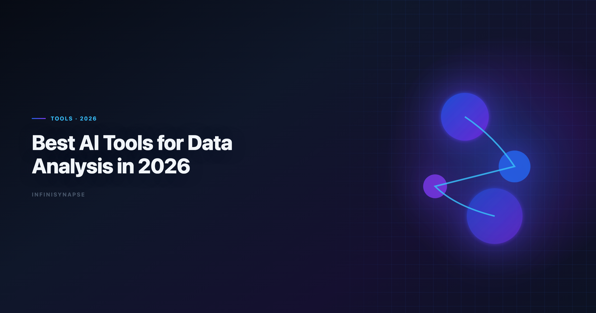

# Best AI Tools for Data Analysis in 2026

> **By the InfiniSynapse Data Team** · **Last updated: 2026-06-08** · *We build InfiniSynapse, an AI-native Data Agent platform referenced in this guide. Rankings and recommendations are based on hands-on product use and public product documentation.*

**Meta Description**: Compare the best AI tools for data analysis in 2026 across autonomy, SQL depth, visualization quality, and governance. Includes framework, rankings, and FAQ.

**Slug**: `/blog/best-ai-tools-for-data-analysis`

**Target keyword**: `best ai tools for data analysis`
**Secondary**: `ai data analysis tools`, `sql data analysis tools`, `ai-native data analysis`

---

## Table of Contents

1. [TL;DR](#tldr)
2. [What Makes an AI Data Tool "Best" in 2026](#what-makes-an-ai-data-tool-best-in-2026)
4. [Analyst Scenarios That Separate Good Tools from Great Ones](#analyst-scenarios-that-separate-good-tools-from-great-ones)
5. [AI-Enabled vs AI-Native: The Buying Split](#ai-enabled-vs-ai-native-the-buying-split)
6. [Decision Matrix for Teams](#decision-matrix-for-teams)
8. [30-Day Evaluation Playbook](#30-day-evaluation-playbook)
9. [Security and Governance Checklist](#security-and-governance-checklist)
10. [ROI Signals to Watch](#roi-signals-to-watch)
11. [Frequently Asked Questions](#frequently-asked-questions)
12. [Conclusion](#conclusion)
---

## TL;DR

> The **best ai tools for data analysis** now split into two categories: AI-enabled copilots that help with single tasks and AI-native agents that can run multi-step workflows with memory. If your team does one-off analysis, start with ChatGPT, Claude, or Gemini. If your team runs recurring KPI and stakeholder reporting, prioritize tools with workflow memory and audit trails.

**Top recommendation by use case** — match tool category to workflow pattern. Repeatable, reviewable workflows that lean on mature tooling like the [Redis documentation](https://redis.io/docs/latest/) ecosystem reward memory over one-off demos; see [AI Data Analysis Tools](/blog/ai-data-analysis-tools) for source-specific steps.

- **Ad-hoc analysis**: ChatGPT, Claude
- **Warehouse self-service**: ThoughtSpot, Databricks Genie
- **Analyst notebook workflows**: Hex
- **CSV/Excel-first quick wins**: Julius
- **Recurring, autonomous analysis**: InfiniSynapse

Choosing among the **best ai tools for data analysis** is less about brand recognition than about how your team actually works: a tool that wins a five-minute demo often loses a five-week reporting cycle if it cannot preserve metric definitions or expose query logic.

---

> **Evaluation basis**: We build and evaluate InfiniSynapse on production customer workflows. Governance, adoption, and security context is cited inline throughout this guide—not in a standalone reference list.

The value of the **best ai tools for data analysis** compounds when exception fixes feed memory each sprint; teams weighing code-execution options can align connector scope and review gates using [Enterprise Alternatives to ChatGPT Code Interpreter](/blog/code-interpreter-alternatives).

## What Makes an AI Data Tool "Best" in 2026

> **Key Definition**: A best-in-class AI data analysis tool should reduce analyst effort *and* increase decision confidence by combining accurate analysis outputs with transparent process traceability.

Most tool roundups over-index on UI polish and underweight workflow durability. In 2026, a practical evaluation framework uses six criteria:

| Criterion | Why it matters | What to check |
|---|---|---|
| **Autonomy** | Determines analyst time savings | Can it run multi-step tasks from one goal? |
| **SQL depth** | Impacts real business analysis quality | Can it generate, explain, and debug production SQL? |
| **Visualization quality** | Affects stakeholder communication | Are charts decision-ready or just quick drafts? |
| **Auditability** | Required for team trust | Can reviewers inspect queries and intermediate outputs? |
| **Memory** | Core for recurring analysis | Does it remember metric definitions across runs? |
| **Governance** | Required for enterprise use | Permissions, source controls, and data boundaries |

This framework aligns with broader AI adoption and trust trends highlighted in the [Wikipedia conceptual data model overview](https://en.wikipedia.org/wiki/Conceptual_data_model) and enterprise analytics governance concerns often discussed in [AWS Well-Architected Machine Learning Lens](https://docs.aws.amazon.com/wellarchitected/latest/machine-learning-lens/welcome.html).

When analysts compare the **best ai tools for data analysis**, they often overweight first-response quality. A stronger test is whether the tool still produces defensible output on week three of a recurring KPI workflow, when schema drift, null spikes, and stakeholder definition changes appear. Tools that only excel at cold-start exploration create hidden labor later. Teams standardizing governance across sources often keep [Best AI Tools for Excel Data Analysis in 2026](/blog/ai-excel-data-analysis-tools) beside this runbook for Excel handoffs.

---

## Top 8 Tools Compared

| Tool | Category | Best for | Key strength | Main trade-off |
|---|---|---|---|---|
| **ChatGPT (ADA)** | AI-enabled copilot | Fast file analysis | Excellent exploratory speed | Limited persistent workflow memory |
| **Claude** | AI-enabled copilot | Long-context analysis | Strong document + data synthesis | Requires prompt steering for repeatability |
| **Google Gemini** | AI-enabled copilot | Google stack teams | Smooth Sheets and BigQuery flow | Less flexible outside Google ecosystem |
| **Julius AI** | AI-enabled copilot | Non-technical analysts | Simple chart-first experience | Limited enterprise data orchestration |
| **Hex Magic** | Analyst copilot platform | SQL + notebook teams | Transparent, cell-level workflows | Human still drives orchestration |
| **ThoughtSpot Spotter** | BI copilot | Governed self-service BI | Semantic-layer safety | Setup effort and enterprise pricing |
| **Databricks Genie** | AI-enabled/agentic hybrid | Lakehouse-native analytics | Warehouse context awareness | Most value inside Databricks stack |
| **InfiniSynapse** | AI-native Data Agent | Recurring end-to-end analysis | Goal-driven execution + memory distillation | Best gains show on repeat workflows |

### 1) ChatGPT (Advanced Data Analysis)

Great for rapid exploratory analysis on uploaded files, quick profiling, and first-pass SQL drafting. ChatGPT leads many shortlists of the **best ai tools for data analysis** because setup friction is near zero. In practice, ChatGPT handles messy CSV intake well: column type inference, outlier flags, and draft charts arrive in minutes. The limitation is session memory — next week's revenue review starts from scratch unless you maintain external prompt templates. Regulated rollouts often anchor access reviews to [Google Cloud architecture framework](https://cloud.google.com/architecture/framework) when credentials, retention policies, and audit logs are in scope.
The credential, preflight, and SQL-trace pattern above also applies to Chatgpt—see [7 Alternatives to ChatGPT for Data Analysis (2026)](/blog/chatgpt-data-analysis-alternatives) for source-specific steps.
The credential, preflight, and SQL-trace pattern above also applies to Julius—see [Julius AI vs ChatGPT for Data and File Analysis](/blog/julius-ai-vs-chatgpt) for source-specific steps.

### 2) Claude

Strong at mixed qualitative + quantitative workflows. Useful when you need to reason over long reports, data docs, and tabular data in one session. Claude is especially helpful when a stakeholder sends a PDF requirements doc alongside a spreadsheet export; it can cross-reference definitions while building aggregations. Teams that need repeatable output should pair Claude with explicit schema blocks and saved validation checklists. Analysts wiring Tableau into production reviews can follow the parallel walkthrough in [Tableau Pulse Alternatives in 2026](/blog/tableau-pulse-alternatives).

### 3) Google Gemini

Best for teams already in Google Workspace and BigQuery. It reduces context switching and supports spreadsheet-native analyst habits. Gemini fits finance and operations teams that live in Sheets and want natural-language pivots without leaving the Google perimeter. Outside that stack, portability drops, so mixed-environment teams should treat Gemini as a segment tool rather than a default. When Sql joins a multi-source stack, align connector scope and review gates using [SQL Data Analysis Tools](/blog/sql-data-analysis-tools).

### 4) Julius AI

A practical entry point for business users who want AI-assisted charts without coding. Good for speed-to-visual but weaker for complex data pipelines. Julius lowers the barrier for managers who need a chart before a meeting, not a governed semantic model. It belongs in the **best ai tools for data analysis** shortlist when adoption friction matters more than warehouse depth. When Julius joins a multi-source stack, align connector scope and review gates using [Best Julius AI Alternatives for Spreadsheet Analy…](/blog/julius-ai-alternatives).

### 5) Hex Magic

Excellent for analyst-led notebook workflows where reproducibility matters. You keep full control and can inspect each transformation step. Hex shines when analytics engineers want AI assistance inside a cell-by-cell notebook that version-controls SQL and Python together. The trade-off is orchestration: the human still sequences steps, which is ideal for audit culture but slower for fully autonomous delivery.

### 6) ThoughtSpot Spotter

A strong choice for enterprise BI programs with mature semantic modeling. ThoughtSpot fits enterprise shortlists of the **best ai tools for data analysis** when semantic governance is required. ThoughtSpot reduces the risk of rogue metric definitions because Spotter queries against approved business terms. Setup cost is real — semantic layers take weeks — but teams with existing ThoughtSpot investment often see the fastest governed AI rollout. Teams standardizing governance across sources often keep [ThoughtSpot Alternatives](/blog/thoughtspot-alternatives) beside this runbook for Thoughtspot handoffs.

### 7) Databricks Genie

Well-suited for teams standardizing on lakehouse workflows. Natural-language interface is useful, especially when model governance and pipelines already live in Databricks. Genie understands warehouse context that general copilots lack, which improves join suggestions on Unity Catalog–backed tables. Value concentrates inside the Databricks ecosystem; hybrid stacks need integration planning.
If Databricks is in scope for your team, reuse the same memory-and-trace checklist in [Databricks Assistant vs Genie](/blog/databricks-genie-alternatives).
Analysts wiring Databricks into production reviews can follow the parallel walkthrough in [InfiniSynapse vs Databricks Genie](/blog/infinisynapse-vs-databricks-genie).

### 8) InfiniSynapse

Built for the "give one goal, get complete analysis" pattern. InfiniSynapse combines autonomous execution, inspectable process timeline, and reusable memory cards for recurring work. Where copilots stop at a single answer, InfiniSynapse can plan SQL pulls, run validation, draft narrative, and retain metric logic for the next cycle. It earns a place among the **best ai tools for data analysis** when recurrence and auditability outweigh demo speed.
Teams standardizing governance across sources often keep [InfiniSynapse vs Tableau AI/Pulse](/blog/infinisynapse-vs-tableau) beside this runbook for Infinisynapse handoffs.
If Infinisynapse is in scope for your team, reuse the same memory-and-trace checklist in [InfiniSynapse Review (2026)](/blog/infinisynapse-review).

For a concept-level introduction to the paradigm behind this behavior, see [AI-Native Data Analysis](/blog/ai-native-data-analysis) and [What Is a Data Agent](/blog/what-is-a-data-agent).

---

## Analyst Scenarios That Separate Good Tools from Great Ones

Real teams rarely fail because they picked a weak model. They fail because the tool fit the wrong scenario. Three patterns appear repeatedly in 2026 evaluations of the **best ai tools for data analysis**:

**Scenario A — Monday morning fire drill.** A VP asks for a breakdown of last week's signups by channel before noon. Copilots win here: upload, prompt, chart, send. Latency and flexibility matter more than memory. Analysts wiring Self into production reviews can follow the parallel walkthrough in [Hosted vs Self-Hosted Data Agents](/blog/self-hosted-ai-data-analyst).

**Scenario B — Monthly board pack.** Finance needs the same twelve metrics, with definition stability and an audit trail for the controller. AI-native or governed BI tools win because metric drift is the enemy, not typing speed.

**Scenario C — Cross-source diagnostic.** Support tickets (CSV), product usage (warehouse), and billing (API) must reconcile for a churn post-mortem. Tools with multi-step orchestration and intermediate visibility outperform single-shot SQL generators.

Run your evaluation against the scenario you repeat most, not the emergency you fear most. That discipline keeps shortlists honest when vendors all claim to be among the **best ai tools for data analysis**.

---

## AI-Enabled vs AI-Native: The Buying Split

> **Key Definition**: **AI-enabled tools** assist a user step by step; **AI-native tools** execute a full analysis workflow from a goal while preserving traceability and reusable memory.

| Dimension | AI-enabled tools | AI-native tools |
|---|---|---|
| Trigger | Prompt-by-prompt | Goal-driven workflow |
| Error handling | Returns issues to user | Attempts reroute/recovery |
| Transparency | Final output focus | Intermediate-step visibility |
| Memory | Session context | Structured cross-session memory |
| Best fit | One-off analysis | Recurring analysis systems |

This split is central to several pillar resources: [AI for Data Analysis](/blog/ai-for-data-analysis).

Buyers comparing the **best ai tools for data analysis** should label each candidate as AI-enabled or AI-native before scoring features. Category clarity prevents expensive mismatches when recurring workflows arrive in Q3. Operational maturity for analytics agents aligns with the [NIST Computer Security Resource Center](https://csrc.nist.gov/), especially around monitoring, rollback, and ownership.

---

## Decision Matrix for Teams

| Team situation | Recommended first choice | Why |
|---|---|---|
| Startup analyst doing fast ad-hoc work | ChatGPT or Claude | Lowest startup friction |
| Warehouse-first enterprise BI | ThoughtSpot or Databricks Genie | Better governance alignment |
| Analytics engineers in notebooks | Hex | Reproducible, transparent workflows |
| Business ops team on spreadsheets | Gemini or Julius | Strong spreadsheet accessibility |
| Weekly recurring KPI narratives | InfiniSynapse | Strong autonomy + memory compounding |

**Practical rule**: pick for your next 90 days of workflow, not your next 90 minutes of demo experience. The **best ai tools for data analysis** for your team should survive that 90-day test with measurable rework reduction.

---

## Common Pitfalls When Choosing Tools

**Pitfall 1 — Demo-driven procurement.** Teams picking the **best ai tools for data analysis** from demos alone miss production friction. Vendors tune demos on clean data; your exports have orphan keys and late-arriving facts. Always pilot on last month's real file.

**Pitfall 2 — Ignoring validation labor.** Fast SQL drafts that need long debugging cycles rarely beat slower tools with explicit assumptions.

**Pitfall 3 — Mixing ad-hoc and production without boundaries.** Define which workflows require audit trails before you scale seats.

**Pitfall 4 — Underinvesting in memory.** Teams that run the same weekly question across three analysts without shared context recreate work silently. Among the **best ai tools for data analysis**, memory-backed platforms compound value; copilots without templates do not.

---

## 30-Day Evaluation Playbook

Use this four-week sequence to compare finalists:

| Week | Focus | Activities |
|---|---|---|
| **Week 1** | Baseline | Document time-to-answer for three real tasks when testing the **best ai tools for data analysis** |
| **Week 2** | Ad-hoc trial | Run fire-drill scenario on each tool; score speed and clarity |
| **Week 3** | Recurrence trial | Repeat one KPI workflow; measure definition drift and rework |
| **Week 4** | Governance review | Test permissions, export behavior, and reviewer sign-off flow |

Assign one analyst as owner and one as skeptic when trialing finalists for the **best ai tools for data analysis**. Capture correctness, transparency, repeatability, and stakeholder readiness in a shared sheet. Weight repeatability double if your roadmap includes autonomous reporting.

---

## Security and Governance Checklist

1. **Data residency** — where files, queries, and embeddings are stored
2. **Retention policy** — whether uploads persist after session end
3. **Role-based access** — source-level permissions, not just app login
4. **Audit logs** — who ran which query and when
5. **SSO / SCIM** — if IT requires centralized identity
6. **Model routing** — whether sensitive data can be restricted to approved endpoints Production rollouts should align access and review controls with the [Google Cloud AI overview](https://cloud.google.com/discover/what-is-artificial-intelligence), especially when recurring queries touch live schemas. LLM-backed analytics should account for prompt-injection and data-exfiltration risks in the [Spider NL2SQL benchmark](https://yale-lily.github.io/spider), especially when connectors expose production schemas.

Warehouse-native and AI-native platforms usually align better with data perimeter policies — verify with a security review before finalizing your **best ai tools for data analysis** shortlist.

---

## ROI Signals to Watch

| Signal | What improvement looks like |
|---|---|
| **Time-to-first-chart** | Down on ad-hoc requests without quality drop |
| **Rework rate** | Fewer stakeholder corrections on metric definitions |
| **Analyst throughput** | More completed investigations per headcount |
| **Audit prep time** | Faster controller sign-off on recurring reports |
| **Copilot tax** | Less time re-prompting for the same weekly question on your **best ai tools for data analysis** stack |

If recurrence dominates and rework stays flat, you likely under-invested in memory. Upgrading to AI-native among the **best ai tools for data analysis** often pays back when the same five questions run every Monday.

---

The shift from dashboard-first BI to augmented workflows, framed by the [Stanford HAI AI Index](https://hai.stanford.edu/ai-index), should guide tool evaluation here; align data-use policies with the [Python documentation](https://docs.python.org/3/) when outputs inform external decisions, and follow [BIRD NL2SQL benchmark](https://bird-bench.github.io/) conventions for reproducible, testable analysis.

## Frequently Asked Questions

### What are the top tools in 2026?

The strongest **best ai tools for data analysis** options depend on workflow type. For ad-hoc file analysis, ChatGPT and Claude remain top choices. For governed BI, ThoughtSpot and Databricks Genie perform well. For recurring, autonomous workflows with reusable memory, AI-native platforms like InfiniSynapse are typically a better fit among **best ai tools for data analysis** buyers evaluating production rollouts.
Teams standardizing governance across sources often keep [InfiniSynapse vs Julius AI for Data Analysis (2026)](/blog/infinisynapse-vs-julius-ai) beside this runbook for Infinisynapse handoffs.
If Infinisynapse is in scope for your team, reuse the same memory-and-trace checklist in [InfiniSynapse vs ChatGPT for Data Analysis in 2026](/blog/infinisynapse-vs-chatgpt).

### Which AI tool is best for recurring analysis workflows?

Choose a tool with explicit memory and workflow traceability. Recurring analyses require consistent metric definitions, inspectable process steps, and reusable context. AI-native systems are usually stronger than prompt-only copilots for this pattern.

### Are free AI tools enough for professional analytics?

Free tiers are often enough for exploration and prototyping. Production analytics usually need stronger governance, source controls, and reproducibility than free copilots provide out of the box.

### Can AI tools connect to SQL databases directly?

Some can, especially warehouse-integrated platforms such as Databricks Genie and ThoughtSpot. General copilots often need schema context or connectors. Always verify query logic and execution plans before using outputs for high-stakes reporting.
The credential, preflight, and SQL-trace pattern above also applies to Perplexity—see [Perplexity Data Analysis Alternatives in 2026](/blog/perplexity-data-analysis-alternatives) for source-specific steps.
When Databricks joins a multi-source stack, align connector scope and review gates using [ThoughtSpot vs Databricks Genie](/blog/thoughtspot-vs-databricks-genie).

### How should teams evaluate AI data analysis tools?

Use a repeatable scorecard: autonomy, SQL quality, visualization quality, auditability, memory, and governance. Test all tools on the same real workflow, not synthetic demos. If Visualization is in scope for your team, reuse the same memory-and-trace checklist in [Best AI Data Visualization Tools in 2026](/blog/ai-data-visualization-tools).

### What's the difference between AI-enabled and AI-native analytics tools?

AI-enabled tools help analysts perform individual steps. AI-native tools take a goal, orchestrate steps autonomously, expose the process, and retain reusable memory for future runs.

---

## Conclusion

No single product wins every workflow among the **best ai tools for data analysis**: copilots dominate quick exploration while AI-native systems compound on recurring work. If your team repeatedly answers similar business questions, shortlist platforms that preserve method and context and still pass a tenth-run audit with the same definitions — not just one strong demo answer.

---