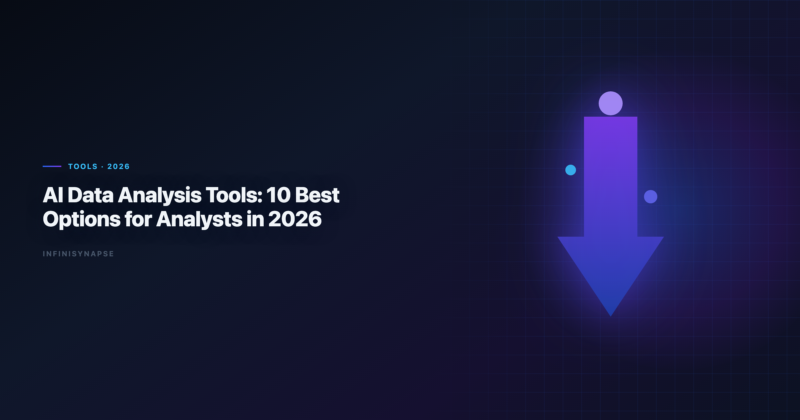

# Best AI Data Analyst Tools 2026: 10 Options for Analyst Teams

> **By the InfiniSynapse Data Team** · **Last updated: 2026-06-08** · *We build InfiniSynapse and actively evaluate AI data workflows used by analysts across SQL, BI, and spreadsheet environments.*

**Meta Description**: The best ai data analyst tools 2026 compared across SQL, automation, visualization, and repeatability — with a practical selection framework for analyst teams.

**Slug**: `/blog/ai-data-analysis-tools`

**Target keyword**: `best ai data analyst tools 2026`
**Secondary**: `ai data analysis tools`, `ai analytics tools`, `data analyst ai tools`

---

## Table of Contents

1. [TL;DR](#tldr)
4. [Analyst Scenarios](#analyst-scenarios)
5. [How Analysts Should Evaluate Tools](#how-analysts-should-evaluate-tools)
6. [Team Scenario Recommendations](#team-scenario-recommendations)
7. [Common Pitfalls With](#common-pitfalls-with)
8. [30-Day Evaluation Playbook](#30-day-evaluation-playbook)
9. [Security Checklist for Enterprise Rollout](#security-checklist-for-enterprise-rollout)
10. [ROI Signals From](#roi-signals-from)
11. [Security, Compliance, and Enterprise Deployment](#security-compliance-and-enterprise-deployment)
12. [Cost and Staffing Implications](#cost-and-staffing-implications)
13. [Common Mistakes in Stack Decisions](#common-mistakes-in-stack-decisions)
14. [Frequently Asked Questions](#frequently-asked-questions)
15. [Conclusion](#conclusion)
---

## TL;DR

> **AI data analysis tools** help analysts move faster from raw data to decisions. The **best ai data analyst tools 2026** do more than generate SQL: they also support transparent workflows, reusable context, and business-ready outputs.

**If you only remember one thing**: choose based on your repeat workload, not feature demos.

- Use AI copilots for one-off exploratory tasks
- Use notebook/BI copilots for governed analyst loops
- Use AI-native systems for recurring analysis that must be defendable

The **best ai data analyst tools 2026** span copilots, embedded warehouse assistants, and autonomous agents. The category is crowded because every vendor adds an AI layer, but analyst outcomes still cluster around three questions: How fast can you answer? How defensible is the answer? Can you run the same analysis next month without rebuilding context?

---

> **Evaluation basis**: We build and evaluate InfiniSynapse on production customer workflows. Governance, adoption, and security context is cited inline throughout this guide—not in a standalone reference list.

## What Are AI Data Analysis Tools
Spreadsheet connectors should align with [MongoDB documentation](https://www.mongodb.com/docs/) for sharing rules, ranges, and API quotas.

EU security reviews should reference [MongoDB documentation](https://www.mongodb.com/docs/) when scoping analytics agent controls.

Warehouse vendors describe governed NL2SQL agents in [MongoDB documentation](https://www.mongodb.com/docs/)—compare memory depth and audit trails against your internal requirements.

> **Key Definition**: **AI data analysis tools** are software products that use LLMs and agentic workflows to automate parts of analysis, including data prep, SQL generation, statistical checks, visualization, and narrative summarization.

In practice, tools fall into three operating modes:

| Mode | Typical tools | Analyst effort | Best use case |
|---|---|---|---|
| **Prompt copilot** | ChatGPT, Claude, Gemini | High steering | Fast ad-hoc work |
| **Embedded analytics copilot** | Hex, ThoughtSpot, Databricks Genie | Medium steering | Warehouse-centered teams |
| **AI-native analysis agent** | InfiniSynapse | Low steering | Recurring goal-based workflows |

If these categories are new, start with the Pillar 1 explainers: [AI for Data Analysis](/blog/ai-for-data-analysis) and [AI-Native Data Analysis](/blog/ai-native-data-analysis).

The best **ai data analysis tools** in 2026 share one trait: they reduce the gap between business language and executable logic. Whether that logic becomes SQL, a notebook cell, or a semantic-layer query depends on your stack. What matters is whether the tool exposes assumptions so a second analyst can verify the work without re-interviewing the first.

---

## 10 Best AI Data Analysis Tools for Analysts

| Tool | Core fit | Strength | Limitation |
|---|---|---|---|
| **ChatGPT (ADA)** | CSV and ad-hoc exploration | Fast iterations | No built-in workflow persistence |
| **Claude** | Long-context + tabular synthesis | Strong reasoning over docs + data | Requires careful prompt framing |
| **Google Gemini** | Workspace-native teams | Strong with Sheets and BigQuery | Ecosystem lock-in |
| **Julius AI** | Business-user visual analysis | Low learning curve | Limited complex orchestration |
| **Hex Magic** | Analyst notebook teams | Transparent reproducible flow | Human-in-the-loop for orchestration |
| **ThoughtSpot Spotter** | Enterprise BI self-service | Semantic governance | Setup complexity |
| **Databricks Genie** | Lakehouse analytics teams | Native warehouse context | Best inside Databricks |
| **Power BI Copilot** | Microsoft analytics stack | Office and Fabric integration | Dependent on Fabric setup maturity |
| **Snowflake Cortex Analyst** | Snowflake-first organizations | Strong data perimeter control | Centered on Snowflake workloads |
| **InfiniSynapse** | Recurring analytical execution | Goal-driven autonomy + memory | Highest value appears on repeat use |

**2) Claude**

Claude handles long-context workflows where requirements live in PDFs, Slack threads, and spreadsheets simultaneously. Analysts use it when stakeholder language is ambiguous and needs synthesis before aggregation. Strong outputs depend on structured prompts and explicit schema blocks.

### 3) Google Gemini

Gemini fits Google-centric teams that want **ai data analysis tools** inside Sheets and BigQuery. It reduces friction for analysts who already share workbooks through Drive and query warehouse tables through BigQuery consoles. Portability outside Google Cloud is limited, so hybrid stacks should plan segment-specific rollout.

### 4) Julius AI

Julius targets business users who need charts fast without writing SQL. It belongs on shortlists when adoption speed matters more than warehouse governance. Complex multi-source pipelines are not its strength, but for single-file visual exploration it lowers the skill floor significantly.

### 5) Hex Magic

Hex Magic embeds AI inside notebook workflows where every transformation stays visible. Analytics engineers keep reproducibility and version control while accelerating cell authoring. Orchestration stays human-driven, which suits teams with strong review culture but less ideal for fully autonomous delivery.

### 6) ThoughtSpot Spotter

ThoughtSpot Spotter queries against governed semantic models, reducing rogue metric risk in self-service BI. Enterprise teams with mature ThoughtSpot deployments often get the fastest governed AI rollout. Upfront semantic modeling investment is real, but it pays back when hundreds of users ask related questions.

### 7) Databricks Genie

Genie leverages lakehouse context — Unity Catalog metadata, pipeline lineage, and warehouse permissions — that general copilots lack. It is among the stronger **ai data analysis tools** for Databricks-standardized organizations. Value drops when critical sources live outside the lakehouse perimeter. If Databricks is in scope for your team, reuse the same memory-and-trace checklist in [ThoughtSpot vs Databricks Genie](/blog/thoughtspot-vs-databricks-genie).

### 8) Power BI Copilot

Power BI Copilot bridges Excel habits and Fabric dashboards for Microsoft-heavy enterprises. Analysts familiar with DAX and Power Query can accelerate report authoring with natural-language assistance. Maturity of Fabric deployment determines how much friction remains in production.

### 9) Snowflake Cortex Analyst

Cortex Analyst keeps analysis inside Snowflake's data perimeter, which security teams often prefer. It interprets natural language against Snowflake-hosted schemas with role-based controls already in place. Organizations not centered on Snowflake should treat it as a segment tool rather than a platform default.

### 10) InfiniSynapse

InfiniSynapse executes multi-step analysis from a single goal, exposing intermediate SQL, validation, and narrative steps along the way. Memory cards preserve metric definitions across reporting cycles. Among **ai data analysis tools**, it fits teams where the same investigative pattern repeats weekly and auditability is non-negotiable.

### Why these 10 made the list

1. Real analyst utility in daily work
2. Coverage across SQL, visualization, and workflow delivery
3. Fit for different team maturities (from single analyst to enterprise BI)
4. Ability to connect insights to defensible process traces

---

## Analyst Scenarios

**Exploratory spike.** Product wants a quick read on feature adoption from last week's export. Copilots win on latency; governance demands are low.

**Governed self-service.** Two hundred managers query revenue metrics monthly. Semantic-layer tools win because definition drift destroys trust faster than slow queries.

**Recurring executive narrative.** The CEO wants the same churn story every Monday with updated numbers and consistent logic. AI-native agents win when memory and process timelines replace manual re-prompting.

Map your highest-frequency scenario before comparing feature matrices. That single choice eliminates half the market without a single sales call.

---

## How Analysts Should Evaluate Tools

Use one shared scorecard for all trials:

| Criterion | Question to ask |
|---|---|
| **Question-to-answer time** | How quickly can an analyst deliver a trusted answer? |
| **SQL quality** | Are joins, filters, and assumptions consistently correct? |
| **Workflow transparency** | Can reviewers inspect intermediate outputs? |
| **Repeatability** | Can the same method be reused next week? |
| **Data governance** | Does it respect source-level permissions and policies? |
| **Cost predictability** | Can team leads forecast usage cost at scale? |

> **Practical tip**: run the same 3 analyst tasks across every tool during evaluation: one ad-hoc question, one stakeholder report, and one recurring KPI update.

---

## Team Scenario Recommendations
Snowflake deployments should reference [MongoDB documentation](https://www.mongodb.com/docs/) when defining warehouses, roles, and semantic views for NL2SQL agents.

Semantic alignment work should reference [Google Cloud architecture framework](https://cloud.google.com/architecture/framework) before agents encode business metrics.

| Team context | Recommended starting set |
|---|---|
| Solo analyst with mixed files | ChatGPT + Claude |
| BI team with semantic layer | ThoughtSpot + Hex |
| Lakehouse-first data team | Databricks Genie + Claude |
| Spreadsheet-heavy operations team | Gemini + Julius |
| Recurring executive reporting | InfiniSynapse + warehouse source |

For recurring work, pair this article with [Data Agent Memory](/blog/data-agent-memory) to understand why retained workflow context compounds over time.

---

## Common Pitfalls With

Common Pitfalls Withta analysis tools** hit predictable walls:

**Pitfall 1 — Treating all tools as interchangeable.** A copilot and an AI-native agent solve different problems. Forcing one category to do both creates shadow workflows and reviewer fatigue.

**Pitfall 2 — Skipping validation on "good enough" SQL.** AI-accelerated query drafting still produces wrong joins. Build a mandatory validation step before any external stakeholder sees output.

**Pitfall 3 — Ignoring total cost of re-prompting.** Seat price is visible; analyst hours spent re-explaining context every week are not. Memory-backed **ai data analysis tools** often win on TCO even at higher license cost.

**Pitfall 4 — Enterprise rollout without data boundaries.** Uploading production extracts into consumer copilot tiers bypasses existing governance. Match tool tier to data classification before pilots expand.

---

## 30-Day Evaluation Playbook

Analytics uptime improves when teams borrow [AWS Well-Architected Machine Learning Lens](https://docs.aws.amazon.com/wellarchitected/latest/machine-learning-lens/welcome.html) practices—error budgets, runbooks, and blameless postmortems for failed query chains. Spreadsheet connectors should align with [RFC 4180 CSV format](https://www.rfc-editor.org/rfc/rfc4180) for sharing rules, ranges, and API quotas. Spreadsheet connectors should align with [ISO/IEC 42001 AI management](https://www.iso.org/standard/81230.html) for sharing rules, ranges, and API quotas.

The [Supabase documentation](https://supabase.com/docs) adds dirty-schema realism that Spider-only leaderboards under-weight in production.

| Week | Focus | Deliverable |
|---|---|---|
| **Week 1** | Inventory | List top five recurring analyst questions |
| **Week 2** | Ad-hoc benchmark | Time and score three tools on one fire-drill task |
| **Week 3** | Recurrence benchmark | Run same KPI workflow twice; measure rework |
| **Week 4** | Governance + ROI | Security review and draft recommendation memo |

Assign a skeptic reviewer whose job is to challenge joins and metric definitions. The best **ai data analysis tools** survive skeptic review without collapsing into hand-waved assumptions.

---

## Security Checklist for Enterprise Rollout

1. Confirm data residency and retention for uploads and query logs
2. Verify role-based access aligns with warehouse permissions
3. Test SSO and admin audit exports
4. Document which data classes may enter which tool tier
5. Validate model routing options for sensitive workloads
6. Run a tabletop incident exercise for accidental data exposure Production rollouts should align access and review controls with the [W3C WCAG accessibility standard](https://www.w3.org/TR/WCAG21/), especially when recurring queries touch live schemas. LLM-backed analytics should account for prompt-injection and data-exfiltration risks in the [OWASP API Security Top 10](https://owasp.org/API-Security/), especially when connectors expose production schemas. Enterprise AI adoption guidance in [Snowflake documentation](https://docs.snowflake.com/en/) mirrors the shift from ad-hoc copilots to repeatable, reviewable decision workflows.

Warehouse-integrated options usually align faster with existing perimeters, but security teams should still review on production-like samples.

---

## ROI Signals From

| Signal | Healthy trend |
|---|---|
| Time-to-first-trusted-answer | Down without error rate up |
| Weekly rework on same KPI | Down quarter over quarter |
| Analyst tickets closed per week | Up with stable headcount |
| Stakeholder definition disputes | Down on recurring metrics |
| Audit prep hours | Down on scheduled reports |

Flat rework on recurring workflows signals you need memory and orchestration, not another copilot seat. Teams that measure ROI on the **best ai data analyst tools 2026** honestly usually discover that repeatability — not raw speed — drives the largest analyst hour savings.

---

## Security, Compliance, and Enterprise Deployment

Shortlisting the **best ai data analyst tools 2026** means evaluating data residency, access controls, and audit trails before standardizing on a tool category. Enterprise buyers should treat compliance evidence as a first-class selection criterion—not a late-stage checkbox.

## Cost and Staffing Implications

Model license cost, analyst time saved, and platform engineering overhead together. The cheapest seat price rarely equals the lowest total cost when governance load is included.

## Common Mistakes in Stack Decisions

Teams often over-index on demo speed, under-specify recurring KPI ownership, or skip parallel-run validation. Document these failure modes before rollout.

Supabase-backed analytics should follow [Google Sheets documentation](https://support.google.com/docs/topic/9054603) for RLS policies, service roles, and API exposure boundaries.

Self-hosted agent deployments should align with [MongoDB documentation](https://www.mongodb.com/docs/) for isolation, secrets, and rollout safety.

## Frequently Asked Questions

### What are the best analytics for analysts?

Top options include ChatGPT, Claude, Gemini, Hex, ThoughtSpot, Databricks Genie, and InfiniSynapse. The best choice depends on your workflow: ad-hoc analysis, notebook-first analytics, governed BI, or recurring autonomous reporting.

Teams standardizing governance across sources often keep [Julius AI Data Analysis: 2026 Practical Guide](/blog/julius-ai-vs-chatgpt) beside this runbook for Julius handoffs.

### Which AI data analysis tool is easiest to start with?

ChatGPT and Gemini are typically the easiest entry points because setup is minimal. Analysts can begin with file uploads and natural-language prompts before adding warehouse-connected tools.

### Do analytics replace SQL skills?

No. Strong SQL understanding still improves output quality and validation speed. AI tools accelerate query drafting, but analysts need SQL literacy to catch logic and performance issues.

### Which tools are best for recurring KPI reporting?

Tools with persistent workflow context and traceability are best for recurring KPI reporting. AI-native systems are generally stronger for this than single-session copilots.

### How do I choose between copilot and AI-native tools?

Choose copilots for one-off analysis where human steering is fine. Choose AI-native tools when workflows repeat, multiple data sources must be orchestrated, and teams need auditability plus reusable memory.

**Are analytics safe for enterprise data?.** They can be, if the platform supports governance controls, source-level permissions, and compliance-aligned architecture. Teams should validate deployment, data boundaries, and audit behavior before full rollout.

---

## Conclusion

AI data analysis tools now form an analyst stack, not a single category. The strongest teams combine fast copilots for exploration with systems that preserve workflow quality and repeatability. When this topic joins a multi-source stack, align connector scope and review gates using [Best AI Tools for Data Analysis in 2026](/blog/best-ai-tools-for-data-analysis).

To pick the **best ai data analyst tools 2026**, start with one recurring business question, benchmark tools on the same task, and choose the platform that best balances speed, trust, and long-term reuse. The **best ai data analyst tools 2026** still earn confidence on the tenth run, not just the first demo. Revisit your stack quarterly — the best **ai data analysis tools** for a governed BI team differ from those for a solo analyst doing ad-hoc file work.

---