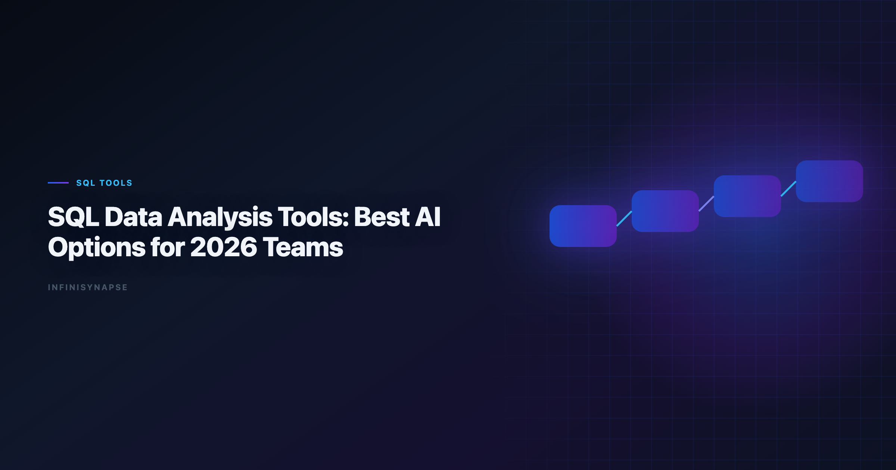

# Best AI Tools for SQL Data Analysis: 2026 Team Guide

> **By the InfiniSynapse Data Team** · **Last updated: 2026-06-08** · *We evaluated these tools in production analyst workflows. *This guide reflects hands-on SQL workflow testing across copilot, BI, and AI-native data agent products.*



**Meta Description**: The best ai tools for sql data analysis in 2026: 8+ options, SQL-specific evaluation criteria, dialect accuracy, and guidance for analyst teams. See the FAQ.

**Slug**: `/blog/sql-data-analysis-tools`

**Target keyword**: `best ai tools for sql data analysis`
**Secondary**: `sql data analysis tools`, `ai sql tools`, `text to sql tools`

---

## Table of Contents

1. [TL;DR](#tldr)
5. [SQL Evaluation Framework for Buyers](#sql-evaluation-framework-for-buyers)
6. [Reference Prompt and Validation Checklist](#reference-prompt-and-validation-checklist)
8. [30-Day Evaluation Playbook](#30-day-evaluation-playbook)
9. [Security Checklist for SQL AI Rollout](#security-checklist-for-sql-ai-rollout)
11. [Frequently Asked Questions](#frequently-asked-questions)
12. [Conclusion](#conclusion)
---

## TL;DR

> The **best ai tools for sql data analysis** are now split between prompt copilots that generate queries and workflow systems that can execute, validate, and preserve SQL logic for recurring analysis.

**Shortlist by use case**. Enterprise AI adoption guidance in [Google Vertex AI documentation](https://cloud.google.com/vertex-ai/docs) mirrors the shift from ad-hoc copilots to repeatable, reviewable decision workflows.

- **Fast query drafting**: ChatGPT, Claude
- **Governed warehouse SQL**: ThoughtSpot, Databricks Genie, Snowflake Cortex Analyst
- **Notebook-assisted SQL work**: Hex
- **Cross-source recurring analysis with memory**: InfiniSynapse

Teams evaluating the **best ai tools for sql data analysis** should look past text-to-SQL demos. Production value depends on dialect accuracy, join transparency, execution visibility, and whether SQL logic survives the next reporting cycle without manual reconstruction.

---

> **Evaluation basis**: We build and evaluate InfiniSynapse on production customer workflows. Governance, adoption, and security context is cited inline throughout this guide—not in a standalone reference list.

## What SQL Data Analysis Tools Mean in 2026

> **Key Definition**: A modern **SQL data analysis tool** is software that helps analysts translate business questions into executable SQL and trusted outputs, ideally with transparent assumptions and reusable workflow context.

In 2026, teams care less about one perfect SQL answer and more about the complete path:

| Stage | What tools should support |
|---|---|
| Question framing | Convert business language into measurable logic |
| Query generation | Produce dialect-correct SQL with clear assumptions |
| Query execution | Run and inspect against real sources |
| Validation | Check joins, filters, null behavior, and performance |
| Reuse | Save definitions for future reporting cycles |

For foundation concepts on why workflow matters beyond query generation, see [AI Data Analysis](/blog/ai-data-analysis) and [Data Agent Memory](/blog/data-agent-memory).

The strongest **sql data analysis tools** treat SQL as a living artifact, not a disposable draft. Analysts need to see why a join was chosen, which filters were applied, and how nulls were handled — especially when AI accelerates authoring speed faster than human review capacity.

---

## Top SQL Data Analysis Tools (AI-Powered)

| Tool | SQL strength | Best for | Limitation |
|---|---|---|---|
| **ChatGPT (ADA)** | Strong query drafting | Analysts doing rapid SQL iterations | Requires manual context setup |
| **Claude** | Strong with schema + docs | Complex SQL reasoning from large context | Prompt discipline needed |
| **Hex Magic** | Strong notebook SQL workflows | Analyst teams needing reproducibility | Requires analyst orchestration |
| **ThoughtSpot Spotter** | High on governed semantic SQL | Self-service BI teams | Enterprise setup overhead |
| **Databricks Genie** | Warehouse-native SQL experience | Lakehouse-centered teams | Best in Databricks ecosystem |
| **Snowflake Cortex Analyst** | Snowflake-integrated SQL interpretation | Snowflake-heavy orgs | Mostly Snowflake-specific |
| **Google Gemini (BigQuery)** | Good BigQuery generation support | Google-cloud teams | Less portable across stacks |
| **InfiniSynapse** | SQL plus autonomous multi-step execution | Recurring cross-source analysis | Highest value on repeated workflows |

### 1) ChatGPT (Advanced Data Analysis)

ChatGPT drafts SQL quickly when analysts paste schema snippets or upload sample files. It fits ad-hoc exploration where speed beats persistence. Among general-purpose **sql data analysis tools**, it is often the fastest starting point — but teams must externalize validation checklists because session memory does not preserve join logic. Regulated rollouts often anchor access reviews to [ISO/IEC 27001](https://www.iso.org/isoiec-27001-information-security.html) when credentials, retention policies, and audit logs are in scope.

### 2) Claude

Claude excels when requirements span long schema documentation, metric dictionaries, and sample queries in one context window. Analysts use it for complex diagnostic SQL where business rules hide in prose. Repeatable production use requires disciplined prompt templates and explicit assumption review.

### 3) Hex Magic

Hex Magic keeps SQL inside versioned notebook cells where each AI suggestion remains inspectable. Analytics engineers retain reproducibility while accelerating authoring. It is a strong middle ground between copilots and full autonomy when human orchestration is a feature, not a bug.

### 4) ThoughtSpot Spotter

Spotter generates SQL against governed semantic models, reducing the chance that a business user invents a new revenue definition. Enterprise BI teams with mature ThoughtSpot deployments often see the fastest governed AI SQL rollout. Semantic layer investment upfront is the price of safety at scale.

If Thoughtspot is in scope for your team, reuse the same memory-and-trace checklist in [ThoughtSpot Alternatives](/blog/thoughtspot-alternatives).

### 5) Databricks Genie

Genie understands Unity Catalog metadata and lakehouse permissions that general copilots cannot see. Natural-language SQL benefits from warehouse-native context, especially on wide fact tables with complex lineage. Value concentrates inside Databricks; hybrid stacks need integration planning.

### 6) Snowflake Cortex Analyst

Cortex Analyst keeps interpretation inside Snowflake's perimeter with role-based access already enforced. Security-conscious organizations favor **sql data analysis tools** that never export schema context to third-party endpoints. Snowflake-centric teams get tight alignment; others should treat it as segment-specific.

### 7) Google Gemini (BigQuery)

Gemini pairs naturally with BigQuery consoles and Sheets-driven analyst habits. BigQuery dialect generation is solid for Google Cloud teams. Cross-warehouse portability is limited, so multi-cloud organizations usually deploy Gemini as one layer in a broader SQL tool stack.

### 8) InfiniSynapse

InfiniSynapse plans and executes multi-step SQL workflows from a single analytical goal, surfacing intermediate queries and validation along the way. Memory cards preserve metric definitions for recurring runs. Among **sql data analysis tools**, it fits when the same investigative SQL pattern repeats weekly across multiple sources.

### AI-enabled vs AI-native SQL workflows

> **Key Definition**: In SQL workflows, **AI-enabled** means "query assistant"; **AI-native** means "analysis executor" that can plan SQL steps, recover from failures, and preserve reusable context.

| Aspect | AI-enabled SQL tools | AI-native SQL tools |
|---|---|---|
| Interaction | Query-by-query | Goal-driven workflow |
| Failure handling | User fixes and retries | Agent reroutes where possible |
| Auditability | Query output centric | Full timeline and intermediate artifacts |
| Repeatability | Prompt templates | Memory-backed reuse |

---

## Analyst Scenarios

**Scenario 1 — Ad-hoc diagnostic.** A product manager asks why activation dropped yesterday. You need fast SQL on a known schema with minimal governance overhead. Copilots win.

**Scenario 2 — Governed self-service.** Hundreds of managers query approved revenue metrics. Semantic-layer platforms win because uncontrolled SQL creates metric chaos.

**Scenario 3 — Recurring multi-step investigation.** Weekly churn analysis pulls support tickets, usage events, and billing tables with consistent logic. AI-native executors win when memory replaces manual re-prompting.

Pick the scenario you repeat most often. That choice eliminates half the market before feature comparisons begin.

---

## SQL Evaluation Framework for Buyers

Use this scorecard before signing annual contracts:

| Criterion | Practical test |
|---|---|
| **Dialect accuracy** | Test Postgres, BigQuery, Snowflake variants |
| **Join reliability** | Run 1:1, 1:N, and many-to-many queries |
| **Assumption clarity** | Confirm tool lists assumptions explicitly |
| **Execution transparency** | Verify logs and query history are inspectable |
| **Performance awareness** | Check if tool flags expensive plans |
| **Governance controls** | Validate role-based access and source boundaries |

This aligns with broader trust and governance themes highlighted in [Wikipedia business intelligence overview](https://en.wikipedia.org/wiki/Business_intelligence) and [Prometheus documentation](https://prometheus.io/docs/).

When comparing **sql data analysis tools**, run identical tasks across dialects your team actually uses. A tool strong on Postgres syntax but weak on Snowflake window functions will create hidden rework in production. Operational maturity for analytics agents aligns with the [CISA AI security guidance](https://www.cisa.gov/ai), especially around monitoring, rollback, and ownership.

---

## Reference Prompt and Validation Checklist

**Prompt template**:

```text
You are a senior analyst.

Schema:
orders(order_id, customer_id, order_date, status, total_amount)
customers(customer_id, signup_date, plan_tier, country)
order_items(order_id, sku, quantity, unit_price)

Task:
Return top 10 SKUs by revenue for paid users (plan_tier in pro, enterprise)
who signed up in the last 90 days, excluding refunded orders.
Provide SQL first, then assumptions.
```

**Validation checklist**:

1. Confirm join keys and cardinality
2. Confirm filter semantics and null behavior
3. Run `EXPLAIN` before production execution
4. Verify metric consistency with business definitions
5. Save reusable SQL logic for recurring runs

Use this checklist on every finalist in your **sql data analysis tools** evaluation. Skipping step three is how teams discover expensive full-table scans only after finance publishes the numbers.

---

## Common Pitfalls With

**Pitfall 1 — Publishing AI-first-pass SQL for executive metrics.** AI drafts fast; validation is still human work. Build mandatory review before external distribution.

**Pitfall 2 — Ignoring dialect differences.** A query that runs in BigQuery standard SQL may fail or silently diverge on Snowflake. Test on production engines, not generic examples.

**Pitfall 3 — Hiding join logic from reviewers.** If **sql data analysis tools** do not expose assumptions, second analysts cannot verify without reverse-engineering. Transparency is a feature, not documentation overhead.

**Pitfall 4 — Treating text-to-SQL as the whole product.** Query generation is one stage. Execution logs, performance flags, and reusable definitions separate the **best ai tools for sql data analysis** from demo toys.

---

## 30-Day Evaluation Playbook

| Week | Focus | Activity |
|---|---|---|
| **Week 1** | Baseline | Document current SQL authoring and review time |
| **Week 2** | Ad-hoc SQL | Run diagnostic scenario on each finalist |
| **Week 3** | Recurring SQL | Repeat KPI query twice; measure logic drift |
| **Week 4** | Governance | Security review and recommendation memo |

Assign one analyst to write SQL and one skeptic to break joins. The best **sql data analysis tools** survive adversarial review without collapsing into hand-waved assumptions.

---

## Security Checklist for SQL AI Rollout

1. Confirm query logs stay inside approved data perimeters
2. Verify role-based warehouse access is enforced, not bypassed
3. Test whether schema metadata leaves your environment
4. Document approved data classes per tool tier
5. Validate audit exports for compliance review
6. Run incident tabletop for accidental cross-tenant exposure Production rollouts should align access and review controls with the [Anthropic research](https://www.anthropic.com/research), especially when recurring queries touch live schemas. LLM-backed analytics should account for prompt-injection and data-exfiltration risks in the [Wikipedia SQL overview](https://en.wikipedia.org/wiki/SQL), especially when connectors expose production schemas.

Warehouse-integrated options usually align faster with existing controls, but security review on production-like schemas remains mandatory.

---

## ROI Signals From

| Signal | Healthy trend |
|---|---|
| SQL authoring time | Down on comparable tasks |
| Post-review rewrite rate | Down without quality drop |
| Expensive query incidents | Down after EXPLAIN adoption |
| Recurring KPI rework | Down week over week |
| Analyst investigations closed | Up with stable headcount |

Flat rework on recurring SQL workflows means you need memory and orchestration, not another text-to-SQL copilot. Finance and data leads reviewing **sql data analysis tools** ROI should weight rework reduction as heavily as query drafting speed — the hidden cost of re-prompting often exceeds license fees within two reporting cycles.

---

Quality gates for agents should reference [Wikipedia ETL overview](https://en.wikipedia.org/wiki/Extract,_transform,_load) when defining completeness, accuracy, and timeliness checks.

OLTP connector hygiene should follow [Elastic documentation](https://www.elastic.co/guide/) for role design, schema grants, and explainable validation queries.

Predictive workflows should stay anchored to fundamentals in the [Python documentation](https://docs.python.org/3/) when interpreting model-driven outputs.

API-backed connectors should account for [Google Vertex AI documentation](https://cloud.google.com/vertex-ai/docs) risks when agents call live production endpoints.

## Frequently Asked Questions

### What are the best analytics with AI in 2026?

Top tools include ChatGPT, Claude, Hex, ThoughtSpot, Databricks Genie, Snowflake Cortex Analyst, and InfiniSynapse. The best choice depends on whether your work is ad-hoc query generation or recurring governed analysis workflows.

### Which AI SQL tool is best for analysts who don't code daily?

Julius, ThoughtSpot, and Gemini can be easier for less SQL-heavy users due to natural-language interfaces and guided workflows. Still, teams should validate outputs before stakeholder use.

Teams standardizing governance across sources often keep [Best Julius AI Alternatives for Spreadsheet Analy…](/blog/julius-ai-alternatives) beside this runbook for Julius handoffs.

### Can AI-generated SQL be trusted in production?

It can be useful, but not blindly trusted. Analysts should validate joins, assumptions, null handling, and query plans before production use, especially for financial or executive reporting.

### Which tools support governed enterprise SQL workflows?

ThoughtSpot, Databricks Genie, and Snowflake Cortex Analyst are strong options for governed SQL workflows because they align with enterprise warehouse controls and semantic models.

### How do AI-native tools differ from SQL copilots?

SQL copilots help generate and refine queries with human steering. AI-native tools can execute multi-step analysis from a goal, preserve process history, and retain reusable context for future runs.

### What is the fastest way to evaluate SQL AI tools?

Run the same three SQL tasks across each tool: one aggregation, one multi-table diagnostic query, and one recurring KPI update. Score each tool on correctness, transparency, and repeatability.

---

## Conclusion

The SQL tool market is no longer about text-to-SQL alone. Teams now need platforms that combine query quality with governance, transparency, and reusable workflow logic.

Choose tools based on your operating model: ad-hoc exploration, warehouse self-service, or recurring autonomous analysis delivery. The **best ai tools for sql data analysis** earn trust on the tenth run, not just the first prompt. Revisit your shortlist each quarter — the best **sql data analysis tools** for a Snowflake-centric org differ from those for a notebook-first analytics engineering team. Document which of the **best ai tools for sql data analysis** own each recurring KPI before you scale seats.

### How to build a durable SQL tool stack

Most mature teams do not pick one winner. They pair a fast copilot for ad-hoc drafting with a governed warehouse tool for self-service and, when recurrence demands it, an AI-native executor that preserves SQL logic across cycles. This layered approach keeps **sql data analysis tools** aligned to data classification: consumer-tier copilots for sanitized samples, perimeter-aligned platforms for production schemas. Document which SQL workflows may use which tier before scaling seats — that single policy prevents the governance surprises that undo otherwise sound **sql data analysis tools** rollouts. When this topic joins a multi-source stack, align connector scope and review gates using [Best AI Tools for Data Analysis in 2026](/blog/best-ai-tools-for-data-analysis).

---