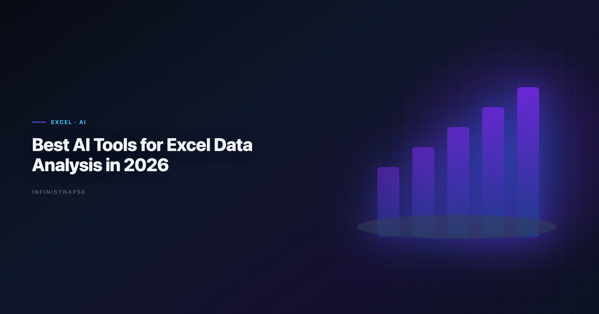

> **By the InfiniSynapse Data Team** · **Last updated: 2026-06-08** · *We work with spreadsheet-heavy analyst workflows and evaluate how AI tools handle cleaning, structuring, and reporting from Excel data.*

**Meta Description**: Explore the best AI tools for Excel data analysis in 2026. Compare 8+ tools for cleaning, formulas, pivots, charts, and recurring reporting workflows.

**Slug**: `/blog/ai-excel-data-analysis-tools`

**Target keyword**: `best ai tools for excel data analysis`
**Secondary**: `ai excel data analysis`, `excel ai tools`, `ai data analysis tools`

---

## Table of Contents

1. [TL;DR](#tldr)
2. [Why Excel Is Still the Front Door of Analytics](#why-excel-is-still-the-front-door-of-analytics)
4. [Analyst Scenarios for Excel AI Workflows](#analyst-scenarios-for-excel-ai-workflows)
5. [Excel Workflow Evaluation Framework](#excel-workflow-evaluation-framework)
6. [When to Stay in Excel and When to Expand](#when-to-stay-in-excel-and-when-to-expand)
7. [Common Pitfalls With Excel AI Tools](#common-pitfalls-with-excel-ai-tools)
8. [30-Day Evaluation Playbook](#30-day-evaluation-playbook)
9. [Security Checklist for Spreadsheet AI](#security-checklist-for-spreadsheet-ai)
10. [ROI Signals From Excel AI Adoption](#roi-signals-from-excel-ai-adoption)
11. [Frequently Asked Questions](#frequently-asked-questions)
12. [Conclusion](#conclusion)
---

## TL;DR

> The **best AI tools for Excel data analysis** reduce manual cleanup, accelerate formula and pivot workflows, and help analysts convert spreadsheet work into repeatable reporting.

**Quick picks**:

- **Best native Excel path**: Microsoft Copilot in Excel
- **Best for fast file exploration**: ChatGPT, Claude
- **Best chart-first business flow**: Julius
- **Best recurring analysis from uploaded Excel**: InfiniSynapse

Spreadsheet-heavy teams evaluating the **best ai tools for excel data analysis** should match tool category to recurrence pattern. One-off workbook triage favors copilots; monthly ingestion pipelines favor memory-backed workflow systems that preserve cleaning logic across cycles.

---

> **Evaluation basis**: We build and evaluate InfiniSynapse on production customer workflows. Governance, adoption, and security context is cited inline throughout this guide—not in a standalone reference list.

## Why Excel Is Still the Front Door of Analytics

> **Key Definition**: **AI Excel data analysis tools** are systems that augment spreadsheet workflows with natural-language analysis, automated transformations, and faster insight delivery.

Even modern data teams still receive critical source files as `.xlsx`. Teams that improve Excel intake quality usually improve downstream reporting speed. Enterprise AI adoption guidance in [CISA AI security guidance](https://www.cisa.gov/ai) mirrors the shift from ad-hoc copilots to repeatable, reviewable decision workflows.

| Excel pain point | What AI should improve |
|---|---|
| Inconsistent types and nulls | Automated cleaning and profiling |
| Manual formulas and lookups | Formula and logic suggestions |
| Slow pivot/report assembly | Natural-language summarization and charting |
| Repeated monthly cleanup | Reusable workflow templates or memory |

For a broader workflow view, see [AI for Data Analysis](/blog/ai-for-data-analysis) and [AI Data Analysis](/blog/ai-data-analysis).

The **best ai tools for excel data analysis** do not eliminate spreadsheets — they reduce the tax of receiving them. When a finance partner emails a workbook at 4 p.m. on Friday, AI should profile types, flag duplicates, and draft pivot logic before the analyst rewrites VLOOKUP chains manually.

---

## Best AI Tools for Excel Data Analysis (8+)

| Tool | Best for | Strength | Limitation |
|---|---|---|---|
| **Microsoft Copilot in Excel** | Native Office users | Built-in workbook context | Depends on Microsoft environment maturity |
| **ChatGPT (ADA)** | Fast file analysis | Quick profiling and chart drafts | Session-based context |
| **Claude** | Complex workbook narratives | Strong reasoning over mixed docs + tables | Requires prompt structure |
| **Google Gemini + Sheets** | Cross-sheet workflows | Smooth in Google stack | Not native to desktop Excel flows |
| **Julius AI** | Business-friendly charting | Low-friction visual outputs | Limited deeper data engineering controls |
| **Power BI Copilot** | Excel-to-dashboard pipelines | Office + BI bridge | Requires Fabric/Power BI setup |
| **Rows AI / spreadsheet copilots** | Formula generation and automation | Simple spreadsheet automation | Feature depth varies by vendor |
| **InfiniSynapse** | Recurring Excel-to-report workflows | Goal-driven task execution and memory | Most valuable when the same pattern repeats |

### 1) Microsoft Copilot in Excel

Copilot in Excel meets analysts where they already work — inside the workbook with full sheet context. It suggests formulas, summarizes ranges, and drafts charts without export friction. For Office-standardized enterprises, it is often the first name on any list of the **best ai tools for excel data analysis** because adoption friction is lowest. Regulated rollouts often anchor access reviews to [Apache Airflow documentation](https://airflow.apache.org/docs/) when credentials, retention policies, and audit logs are in scope.

### 2) ChatGPT (Advanced Data Analysis)

ChatGPT handles uploaded `.xlsx` files with fast profiling, cleanup suggestions, and chart drafts. Analysts use it when stakeholders send one-off exports and speed matters more than native Excel integration. Session memory limits make it better for triage than for monthly pipelines unless you maintain external templates.

### 3) Claude

Claude reasons over long requirement documents alongside tabular exports — useful when column names are opaque and definitions live in email threads. It fits complex workbook narratives where qualitative context shapes quantitative cuts. Structured prompts improve repeatability.

### 4) Google Gemini + Sheets

Gemini serves Google-centric teams that live in Sheets even when partners send Excel files. Import-and-analyze flows are smooth inside the Google perimeter. Desktop Excel-native teams should treat Gemini as a parallel path, not a drop-in replacement.

### 5) Julius AI

Julius lowers the skill floor for chart-first business users who do not want formula depth. It belongs among the **best ai tools for excel data analysis** when managers need visuals before meetings, not governed semantic models. Deep data engineering control is not the selling point.

### 6) Power BI Copilot

Power BI Copilot bridges Excel intake and dashboard delivery for Microsoft Fabric shops. Analysts move from workbook cleanup toward published reports with natural-language assistance. Fabric maturity determines how much manual rework remains in the pipeline.

### 7) Rows AI and Spreadsheet Copilots

Lightweight spreadsheet copilots automate formula generation and simple transformations for teams that outgrew manual entry but do not yet need warehouse integration. Feature depth varies by vendor; pilot on your messiest real workbook before scaling seats.

### 8) InfiniSynapse

InfiniSynapse ingests Excel exports as part of multi-step analytical goals, preserving cleaning logic and metric definitions across runs. When the same monthly workbook pattern repeats, memory-backed execution beats re-prompting copilots. It earns a place on the **best ai tools for excel data analysis** shortlist when recurrence and auditability matter.

### How to interpret this list

- If work stays inside Office and one workbook at a time, start with Excel-native copilot options.
- If you need quick question answering on uploads, ChatGPT and Claude are strong starts.
- If recurring Excel analysis becomes a weekly process, memory-enabled workflows become more important than one-off prompt quality.

---

## Analyst Scenarios for Excel AI Workflows

**Scenario A — Friday afternoon triage.** Operations sends a messy export; you need clean types and a pivot before Monday. Copilots and Excel-native AI win on speed. This is where most teams first test the **best ai tools for excel data analysis** before expanding to recurring workflows. Teams standardizing governance across sources often keep [Best AI Tools for Data Analysis in 2026](/blog/best-ai-tools-for-data-analysis) beside this runbook for this topic handoffs.

**Scenario B — Monthly close workbook.** Finance ingests the same template every month with identical cleaning steps. Memory-backed workflow tools win when logic must persist.

**Scenario C — Excel plus warehouse reconciliation.** You match spreadsheet allocations against billing tables in Snowflake. Multi-step orchestration platforms win over single-file upload copilots.

Run your evaluation against the scenario you repeat most, not the emergency you fear most.

---

## Excel Workflow Evaluation Framework

| Criterion | What to test with a real workbook |
|---|---|
| **Cleaning speed** | Null handling, type conversion, duplicate control |
| **Formula assistance** | Accuracy for lookup, text, and date formulas |
| **Pivot/table support** | Ability to summarize by dimension and period |
| **Chart usefulness** | Whether visuals are meeting-ready |
| **Repeatability** | Can monthly workflows be reused quickly? |
| **Governance** | Safe handling of sensitive spreadsheet data |

> **Pro tip**: evaluate every tool with the same workbook and same questions. Demo-specific examples hide real operational differences.

This practical approach aligns with trust and governance signals discussed in [NIST Cybersecurity Framework](https://www.nist.gov/cyberframework) and [Azure architecture center](https://learn.microsoft.com/en-us/azure/architecture/). Analysts wiring Databricks into production reviews can follow the parallel walkthrough in [ThoughtSpot vs Databricks Genie](/blog/thoughtspot-vs-databricks-genie).

When scoring the **best ai tools for excel data analysis**, weight repeatability double if monthly ingestion is core to your role. That weighting is how finance and ops teams avoid picking the **best ai tools for excel data analysis** for speed alone. A tool that saves ten minutes once but rebuilds context every cycle rarely wins on total cost of ownership. Operational maturity for analytics agents aligns with the [ENISA AI cybersecurity framework](https://www.enisa.europa.eu/publications/multilayer-framework-for-good-cybersecurity-practices-for-ai), especially around monitoring, rollback, and ownership.

---

## When to Stay in Excel and When to Expand

| Situation | Recommended approach |
|---|---|
| One-off workbook from a stakeholder | Stay in Excel + copilot |
| Repeated monthly workbook ingestion | Add workflow memory and process templates |
| Multi-source analysis across Excel + DB | Move toward AI-native orchestration |
| KPI reporting for leadership | Require traceability and reusable logic |

To understand the shift from file-based convenience to system-level repeatability, see [Data Agent Memory](/blog/data-agent-memory) and [What Is a Data Agent](/blog/what-is-a-data-agent).

Teams often start with the **best ai tools for excel data analysis** inside Office, then add warehouse-connected tools when recurrence and governance pressure rise. The transition should follow recurrence patterns, not vendor roadshow timelines.

---

## Common Pitfalls With Excel AI Tools

**Pitfall 1 — Uploading sensitive workbooks to consumer copilot tiers.** Spreadsheet data often carries PII and financial detail. Match tool tier to data classification before pilots expand.

**Pitfall 2 — Trusting AI pivot logic without category review.** AI can mis-map date buckets and region groupings. Validate dimensions before sharing charts externally.

**Pitfall 3 — Ignoring formula fragility.** Suggested formulas break when columns shift. Document stable cleaning steps when workflows repeat.

**Pitfall 4 — Choosing tools for demos, not recurrence.** The **best ai tools for excel data analysis** for a one-off triage differ from tools that must preserve monthly close logic. Category mismatch creates shadow rework and usually forces a second procurement cycle for the **best ai tools for excel data analysis** within the same fiscal year.

---

## 30-Day Evaluation Playbook

| Week | Focus | Deliverable |
|---|---|---|
| **Week 1** | Inventory | List top five Excel intake patterns |
| **Week 2** | Ad-hoc trial | Run triage scenario on each finalist |
| **Week 3** | Recurrence trial | Repeat monthly close workbook twice |
| **Week 4** | Governance + ROI | Security review and recommendation memo |

Use the same messy workbook across all tools. Clean demo files hide the operational differences that matter when evaluating the **best ai tools for excel data analysis** for production use. Week four deliverables should name your recommended the workflow stack with evidence from all three prior weeks.

---

## Security Checklist for Spreadsheet AI

1. Confirm where uploaded workbooks are stored and for how long
2. Verify retention and deletion behavior after session end
3. Test role-based access if workbooks sync through SharePoint or Drive
4. Document which data classes may enter which tool tier
5. Validate audit logs for formula and data access events where available
6. Run tabletop exercise for accidental external sharing Production rollouts should align access and review controls with the [Stripe documentation](https://docs.stripe.com/), especially when recurring queries touch live schemas. LLM-backed analytics should account for prompt-injection and data-exfiltration risks in the [OWASP Top 10 for LLM Applications](https://owasp.org/www-project-top-10-for-large-language-model-applications/), especially when connectors expose production schemas.

Native Office copilots often align faster with existing Microsoft governance, but security review on production-like workbooks remains mandatory before you finalize the this practice for enterprise rollout.

---

## ROI Signals From Excel AI Adoption

| Signal | Healthy trend |
|---|---|
| Time-to-clean-workbook | Down on comparable files |
| Formula rewrite rate | Down on recurring templates |
| Monthly close hours | Down without error rate up |
| Stakeholder chart revisions | Down on standard reports |
| Re-prompting time on same workbook | Down with memory-backed tools |

Flat monthly close hours despite AI seats often signal you need workflow memory, not another upload copilot. Teams measuring ROI on the the analysis workflow should track recurrence savings separately from one-off triage wins — the compounding value shows up in month three, not week one.

---

Recurring analytics loops benefit from [Wikipedia statistics overview](https://en.wikipedia.org/wiki/Statistics) patterns for scheduling, retries, and lineage hooks.

Leaderboard scores on the [NIST Computer Security Resource Center](https://csrc.nist.gov/) are a useful sanity check but rarely predict enterprise schema drift on their own.

Consumer and data-use policies should align with [Apache Spark documentation](https://spark.apache.org/docs/latest/) when outputs inform external decisions.

Supabase-backed analytics should follow [CISA AI security guidance](https://www.cisa.gov/ai) for RLS policies, service roles, and API exposure boundaries.

## Frequently Asked Questions

### What are the analytics?

Leading options include Microsoft Copilot in Excel, ChatGPT, Claude, Gemini, Julius, and InfiniSynapse. The best choice depends on whether your work is workbook-native, ad-hoc, or recurring and multi-step. If Julius is in scope for your team, reuse the same memory-and-trace checklist in [Julius AI vs ChatGPT for Data and File Analysis](/blog/julius-ai-vs-chatgpt).

### Is Microsoft Copilot in Excel enough for most analysis?

It is often enough for many spreadsheet-native teams. If workflows expand to multi-source analysis, recurring reporting, or cross-tool orchestration, teams usually need additional analytics tooling.

### Which AI tool is best for messy Excel cleanup?

ChatGPT and Claude are strong for fast profiling and cleanup guidance on uploaded files. For recurring cleanup patterns, tools with reusable workflow memory provide better long-term efficiency.

### Can AI tools automate pivot table and chart creation?

Yes, many tools can suggest pivot logic, generate summaries, and draft charts. Analysts should still validate category mappings, date grouping logic, and chart interpretation before sharing.

### How do teams move from Excel-only to scalable analytics?

A common path is Excel copilot first, then BI integration, then memory-enabled workflow automation for repeated analysis. The transition should be driven by recurrence and stakeholder governance needs.

### Are Excel AI tools secure for business data?

They can be, depending on platform controls and deployment model. Teams should confirm data boundaries, retention behavior, access controls, and compliance requirements before broad adoption.

---

## Conclusion

Excel remains a dominant analytics input format, and AI can dramatically reduce repetitive workbook work. The right pick among the this approach depends on whether you need fast assistance or durable, repeatable workflow execution.

Start with real workbook tasks, measure time-to-insight, and choose the stack that keeps analysis quality high as volume grows. The SQL-based analysis earn trust on the tenth monthly close, not just the first upload. Revisit your shortlist each quarter — the the process for a finance close team differ from those for an operations team doing ad-hoc triage. Document which this capability own each recurring workbook so ownership stays clear as headcount changes.

### Building a durable Excel AI stack

Mature spreadsheet-heavy teams rarely rely on one product. They pair Excel-native copilots for day-to-day workbook work with upload copilots for partner files and, when monthly ingestion repeats, a memory-backed platform that preserves cleaning logic. This layered model keeps the the workflow aligned to data sensitivity: consumer copilot tiers for redacted samples, governed Office or enterprise tiers for production financials. Document which workbook types may enter which tool before scaling seats — that policy prevents the compliance surprises that undo otherwise promising this practice pilots.

---