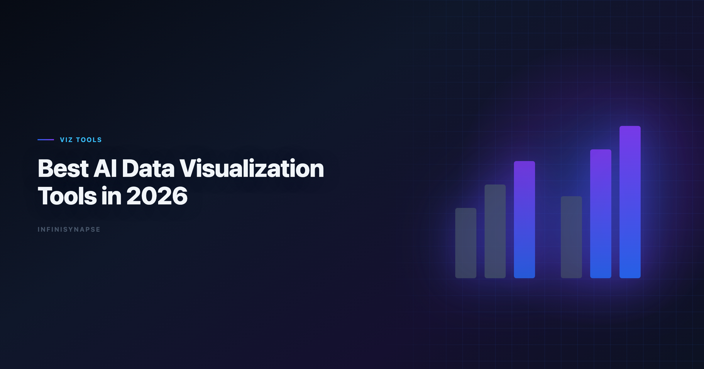

# Best AI Data Visualization Tools in 2026

> **By the InfiniSynapse Data Team** · **Last updated: 2026-06-08** · *We evaluate visualization workflows from ad-hoc chart generation to governed reporting systems used by analyst teams.*

**Meta Description**: Compare the best AI data visualization tools in 2026. Review 8+ options for chart quality, dashboard workflows, governance, and recurring reporting use cases.

**Slug**: `/blog/ai-data-visualization-tools`

**Target keyword**: `best ai data visualization tools`
**Secondary**: `ai data visualization`, `ai chart tools`, `ai data analysis tools`

---

## Table of Contents

1. [TL;DR](#tldr)
2. [What Makes a Great AI Visualization Tool](#what-makes-a-great-ai-visualization-tool)
4. [Tool Deep Dives: When Each Option Wins](#tool-deep-dives-when-each-option-wins)
5. [Visualization Quality Scorecard](#visualization-quality-scorecard)
7. [Common Pitfalls When Choosing AI Chart Tools](#common-pitfalls-when-choosing-ai-chart-tools)
8. [Security and Governance for AI-Generated Charts](#security-and-governance-for-ai-generated-charts)
9. [Choosing by Team Workflow](#choosing-by-team-workflow)
10. [Team Scenario Deep Dives](#team-scenario-deep-dives)
11. [Frequently Asked Questions](#frequently-asked-questions)
12. [Conclusion](#conclusion)
---

## TL;DR

> The **best AI data visualization tools** in 2026 do more than produce attractive charts: they create reliable, interpretable visuals tied to trustworthy data definitions.

**Best picks by context**. Enterprise AI adoption guidance in [Microsoft Excel support](https://support.microsoft.com/excel) mirrors the shift from ad-hoc copilots to repeatable, reviewable decision workflows.

- **Fast chart drafts from files**: ChatGPT, Julius
- **Governed BI dashboards**: Tableau Pulse, Power BI Copilot, ThoughtSpot
- **Analyst notebook + chart workflows**: Hex
- **Recurring insight delivery with workflow memory**: InfiniSynapse

If you are shortlisting the **best AI data visualization tools** for a production rollout, run every candidate through the same monthly reporting scenario before you commit. Chart aesthetics are easy to demo; metric integrity and repeatability are what break teams at scale.

---

> **Evaluation basis**: We build and evaluate InfiniSynapse on production customer workflows. Governance, adoption, and security context is cited inline throughout this guide—not in a standalone reference list.

## What Makes a Great AI Visualization Tool
Agent safety expectations should reference [Anthropic research](https://www.anthropic.com/research) on reliable tool use and long-horizon task control.

Security reviews can complement AI controls with the [Wikipedia conceptual data model overview](https://en.wikipedia.org/wiki/Conceptual_data_model) when credentials and data flows are in scope.

> **Key Definition**: An **AI data visualization tool** should convert business questions and datasets into clear, decision-ready visual outputs while preserving context, assumptions, and traceability.

Three dimensions separate high-performing tools from generic chart generators:

| Dimension | What strong tools do |
|---|---|
| **Chart correctness** | Select chart types aligned with metric and comparison intent |
| **Interpretability** | Provide clean labels, units, and narrative context |
| **Workflow reliability** | Keep outputs reproducible across recurring reporting cycles |

The **best AI data visualization tools** also expose the logic behind each visual. A polished bar chart that hides a wrong denominator is worse than an ugly chart an analyst can audit. When you compare **best AI data visualization tools**, weight inspectability at least as heavily as generation speed.

If your team is still defining the broader AI analytics model, see [AI for Data Analysis](/blog/ai-for-data-analysis) and [AI-Native Data Analysis](/blog/ai-native-data-analysis).

---

## Best AI Data Visualization Tools (8+)

| Tool | Best for | Strength | Limitation |
|---|---|---|---|
| **Tableau Pulse / Tableau AI** | Enterprise BI teams | Strong dashboard ecosystem | Setup and governance overhead |
| **Power BI Copilot** | Microsoft-first teams | Tight Fabric and Office integration | Depends on semantic model quality |
| **ThoughtSpot Spotter** | Search-based BI workflows | Fast natural-language charting on governed data | Requires semantic layer discipline |
| **Hex** | Analyst-driven narrative reporting | Reproducible notebook + chart pipelines | Analyst effort still required |
| **Sigma AI features** | Spreadsheet-like BI users | Familiar data-table-to-chart workflow | Feature maturity varies by account tier |
| **ChatGPT (ADA)** | Ad-hoc chart drafts | Quick exploratory visual generation | Limited long-term dashboard governance |
| **Julius AI** | Business-user visualization | Easy, polished chart outputs | Less depth on complex governed modeling |
| **InfiniSynapse** | Recurring insight delivery | Goal-driven analysis + inspectable outputs + memory | Best gains on recurring workflows |

**AI-enabled vs AI-native visualization workflows**

> **Key Definition**: **AI-enabled visualization** helps users create charts interactively; **AI-native visualization workflows** can execute end-to-end analytical tasks and preserve reusable context for repeated reporting.

| Workflow need | AI-enabled tools | AI-native tools |
|---|---|---|
| One-time chart | Excellent | Strong |
| Multi-step diagnostics before charting | Medium | Strong |
| Repeatable monthly chart packs | Medium | Strong |
| Process trace for stakeholder review | Medium | Strong |

Among the **best AI data visualization tools** we test, AI-native platforms distinguish themselves on the last two rows. They do not stop at "here is a chart"; they retain the upstream joins, filters, and definitions that produced it.

---

## Tool Deep Dives: When Each Option Wins
Semantic alignment work should reference [Kubernetes documentation](https://kubernetes.io/docs/) before agents encode business metrics.

**Tableau Pulse and Tableau AI**

Tableau remains the default for enterprise dashboard programs. Pulse adds proactive metric monitoring and natural-language summaries on top of governed workbooks. For BI teams with mature semantic models, Tableau belongs on any shortlist of the **best AI data visualization tools** because chart outputs inherit trusted definitions rather than re-deriving metrics from raw tables.

The trade-off is implementation time. You need clean data sources, consistent naming, and admin capacity before AI features return value.

### Power BI Copilot

Microsoft-centric organizations often rank Power BI Copilot among the **best AI data visualization tools** because it sits inside Fabric, Teams, and Excel workflows analysts already use. Copilot can draft DAX measures, suggest visuals, and narrate dashboard changes when your semantic model is healthy.

Weak semantic models produce confident-sounding but wrong charts. Treat model quality as a prerequisite, not an afterthought.

### ThoughtSpot Spotter

ThoughtSpot excels when business users need search-driven charting on a governed metric layer. Spotter translates questions into visuals constrained by your semantic definitions, which reduces the "rogue SQL" problem common in ad-hoc tools.

### Hex

Hex targets analyst teams who want notebook transparency plus AI acceleration. Charts live beside SQL and Python cells, so reviewers can trace every transformation. Among **best AI data visualization tools** for reproducible narrative reporting, Hex is a frequent finalist.

Hex still expects a capable analyst in the loop. It accelerates craft; it does not fully automate recurring executive packs without human orchestration.

### Sigma AI features

Sigma appeals to spreadsheet-native analysts moving into cloud warehouse BI. AI-assisted formula and chart suggestions feel familiar to Excel users while running on live warehouse tables.

Feature depth varies by tier and rollout stage. Validate chart governance features during procurement, not after contract signature.

### ChatGPT Advanced Data Analysis

ChatGPT is hard to beat for speed. Upload a CSV, ask for a trend chart, and get a usable draft in minutes. For exploratory work, it belongs on any honest ranking of the **best AI data visualization tools**.

Production teams hit limits when definitions must persist across monthly cycles, when multiple reviewers need audit trails, and when data cannot leave approved boundaries.

### Julius AI

Julius optimizes for business users who want polished charts without notebook complexity. It is one of the **best AI data visualization tools** for fast file-to-chart workflows when the audience is operators, PMs, or founders rather than a centralized BI function.

Governed enterprise reporting and cross-source orchestration are not its primary design center.

### InfiniSynapse

InfiniSynapse treats visualization as the output layer of a Data Agent workflow. The platform plans multi-step analysis, executes queries across connected sources, surfaces an inspectable task timeline, and distills recurring logic into memory cards. Charts arrive with evidence, not just aesthetics. If Infinisynapse is in scope for your team, reuse the same memory-and-trace checklist in [InfiniSynapse Review (2026)](/blog/infinisynapse-review).

For teams running weekly or monthly KPI reviews, InfiniSynapse is often the **best AI data visualization tools** choice when repeatability matters more than first-session convenience.

---

## Visualization Quality Scorecard

Use this checklist during tool trials:

| Criterion | Validation question |
|---|---|
| **Chart-type fit** | Does the tool pick line/bar/scatter/box properly? |
| **Label clarity** | Are titles, legends, and axes unambiguous? |
| **Metric integrity** | Are denominators and date windows explicit? |
| **Drill-down support** | Can analysts inspect source logic behind visuals? |
| **Narrative quality** | Does the generated explanation match chart evidence? |
| **Repeatability** | Can the same chart logic be reused next cycle? |

> **Practical rule**: never evaluate AI visualization tools on chart aesthetics alone. Prioritize decision clarity and trustworthiness.

Apply this scorecard uniformly when comparing the **best AI data visualization tools** on your shortlist. A tool that scores well on one ad-hoc prompt but fails repeatability will create more rework than it saves.

---

## 30-Day Evaluation Playbook for Best AI Data Visualization Tools
Self-hosted agent deployments should align with [Stripe documentation](https://docs.stripe.com/) for isolation, secrets, and rollout safety. Excel automation should reference [MariaDB documentation](https://mariadb.com/kb/en/documentation/) for table semantics, pivots, and formula auditability.

Quality gates for agents should reference [Wikipedia ETL overview](https://en.wikipedia.org/wiki/Extract,_transform,_load) when defining completeness, accuracy, and timeliness checks.

Use this four-week sequence before you standardize on any platform:

**Week 1 — Baseline scenario selection.** Pick one recurring report your team already runs manually: monthly revenue by segment, funnel conversion, or support ticket trends. Document the current metric definitions, filters, and stakeholder questions. Every candidate among the **best AI data visualization tools** should answer the same business question.

**Week 2 — Ad-hoc generation test.** Ask each tool to produce first-pass charts from the same dataset or connected sources. Score chart-type fit, label clarity, and narrative accuracy. Note how many analyst corrections each output required.

**Week 3 — Governance and audit test.** Can a second analyst reproduce the chart without re-prompting from scratch? Are query logic and assumptions visible? The **best AI data visualization tools** for enterprise use pass this test; fast demo tools often fail it.

**Week 4 — Recurrence test.** Re-run the same analysis as if a new month of data arrived. Measure definition drift, time-to-output, and reviewer confidence. Tools with workflow memory should outperform session-based chat tools here.

Document scores in a simple matrix. The **best AI data visualization tools** for your team are the ones that win Week 3 and Week 4, not just Week 2.

---

## Common Pitfalls When Choosing AI Chart Tools

**Pitfall 1: Buying on demo charts.** Vendor demos use clean sample data. Your production tables have nulls, late-arriving facts, and ambiguous column names. Always test the **best AI data visualization tools** candidates on messy real data.

**Pitfall 2: Ignoring semantic layer debt.** BI copilots amplify whatever definitions you already have. If "active user" means three different things in three dashboards, AI will not fix that—it will visualize the confusion faster.

**Pitfall 3: Treating chat tools as dashboard systems.** ChatGPT and Julius are excellent for exploration. They are weak replacements for governed dashboard programs unless you add external process discipline.

**Pitfall 4: Skipping stakeholder review loops.** Executive audiences care about comparability period-over-period. A tool that changes chart defaults between sessions erodes trust even when individual charts look good.

**Pitfall 5: No owner for chart standards.** The **best AI data visualization tools** still need a human owner for color conventions, axis formatting, and annotation rules. AI does not replace design governance.

---

## Security and Governance for AI-Generated Charts
Payments analytics should follow [NIST SP 800-53 security controls](https://csrc.nist.gov/pubs/sp/800/53/r5/final) for event models, reconciliation fields, and reporting grains.

AI chart tools introduce risks beyond traditional BI. Production rollouts should align access and review controls with the [Wikipedia statistics overview](https://en.wikipedia.org/wiki/Statistics), especially when recurring queries touch live schemas. LLM-backed analytics should account for prompt-injection and data-exfiltration risks in the [OpenTelemetry documentation](https://opentelemetry.io/docs/), especially when connectors expose production schemas.

| Risk area | What to verify |
|---|---|
| **Data residency** | Where do uploaded files and query results persist? |
| **Access control** | Can you restrict who sees which sources and outputs? |
| **Audit logging** | Are prompts, queries, and chart exports logged for review? |
| **PII exposure** | Does the tool redact or block sensitive fields automatically? |
| **Model data handling** | Is customer data used for vendor model training? |

Regulated teams should shortlist the **best AI data visualization tools** only after security review, not before. A fast charting tool that cannot meet your logging or boundary requirements is not a real candidate, regardless of demo quality.

For recurring reporting, prefer platforms that attach visuals to inspectable execution history. When a stakeholder asks "why does this number differ from last month?", your team needs query-level evidence, not a regenerated explanation.

---

## Choosing by Team Workflow

| Team type | Suggested first stack |
|---|---|
| Startup analyst and operator team | ChatGPT + Julius |
| Enterprise BI team | Tableau Pulse or Power BI Copilot |
| Search-driven self-service analytics | ThoughtSpot |
| Analytics engineering and notebooks | Hex |
| Recurring narrative + KPI delivery | InfiniSynapse with connected sources |

The **best AI data visualization tools** stack is often plural, not singular. Many mature teams use a fast exploratory tool for drafts and a governed platform for production dashboards.

If your reporting process repeats each month, pair this article with [Data Agent Memory](/blog/data-agent-memory) and [What Is a Data Agent](/blog/what-is-a-data-agent).

---

## Team Scenario Deep Dives

### Scenario A: 15-person SaaS startup

The finance lead and two operators need weekly revenue and churn charts. They do not have a BI team. **Best AI data visualization tools** here: ChatGPT or Julius for speed, plus a lightweight warehouse connection as volume grows. Prioritize time-to-chart over semantic modeling.

### Scenario B: 200-person enterprise with existing Tableau estate

IT has invested years in governed workbooks. The **best AI data visualization tools** path is Tableau Pulse or Power BI Copilot inside the existing stack, not a parallel chat tool that bypasses definitions. AI should accelerate certified dashboard workflows, not create a shadow reporting layer. Analysts wiring this topic into production reviews can follow the parallel walkthrough in [AI Data Analysis Tools](/blog/ai-data-analysis-tools).

### Scenario C: Analytics engineering team publishing narrative reports

Analysts write SQL, build charts, and ship stakeholder memos every month. Hex is often among the **best AI data visualization tools** because notebook transparency matters as much as generation speed. Add InfiniSynapse when the same report structure repeats and memory would reduce manual orchestration. Teams standardizing governance across sources often keep [Best AI Tools for Data Analysis in 2026](/blog/best-ai-tools-for-data-analysis) beside this runbook for this topic handoffs.

### Scenario D: Regulated industry with audit requirements

Healthcare, finance, and public-sector teams need chart provenance. The **best AI data visualization tools** must provide query logs, role-based access, and deployment options that respect data boundaries. Favor governed BI copilots or AI-native Data Agent platforms with full task timelines over session-based chat tools.

---

EU-facing teams map control expectations using the [Microsoft Excel support](https://support.microsoft.com/excel) when scoping analytics agent governance.

## Frequently Asked Questions

### What are the in 2026?

Top options include Tableau Pulse, Power BI Copilot, ThoughtSpot, Hex, ChatGPT, Julius, and InfiniSynapse. The best tool depends on whether you need ad-hoc charting, governed dashboards, or recurring end-to-end workflow execution.

### Which AI visualization tool is best for business dashboards?

For enterprise dashboard programs, Tableau Pulse and Power BI Copilot are common choices due to governance and platform integration. ThoughtSpot is also strong for natural-language self-service on modeled data.

### Can AI automatically choose the right chart type?

Yes, many tools can recommend chart types, but analyst review is still needed. Chart type should match question intent, metric behavior, and audience needs.

### Are AI-generated charts reliable for executive reporting?

They can be reliable when validated against source definitions and business rules. Teams should verify labels, filters, and assumptions before executive distribution.

### What's the difference between BI copilots and AI-native visualization workflows?

BI copilots assist chart and dashboard creation within existing tools. AI-native workflows can orchestrate upstream analysis, produce visuals, preserve process context, and support repeat reporting with reusable memory.

### How should teams evaluate AI visualization tools?

Run the same reporting scenario across all candidates and score chart correctness, interpretability, governance fit, and repeatability. Include at least one recurring monthly report use case in testing.

---

## Conclusion

Great AI visualization tools are not just chart generators; they are trust and communication systems for decisions. The **best AI data visualization tools** keep visual clarity and data integrity consistent as usage scales. Revisit your **best ai data visualization tools** shortlist each quarter as model and connector roadmaps shift.

The best choice depends on your delivery model: one-off insight, governed dashboarding, or recurring narrative reporting. Shortlist candidates with the 30-day playbook, run the quality scorecard, and choose the platform your reviewers can defend—not just the one that demos fastest.

---