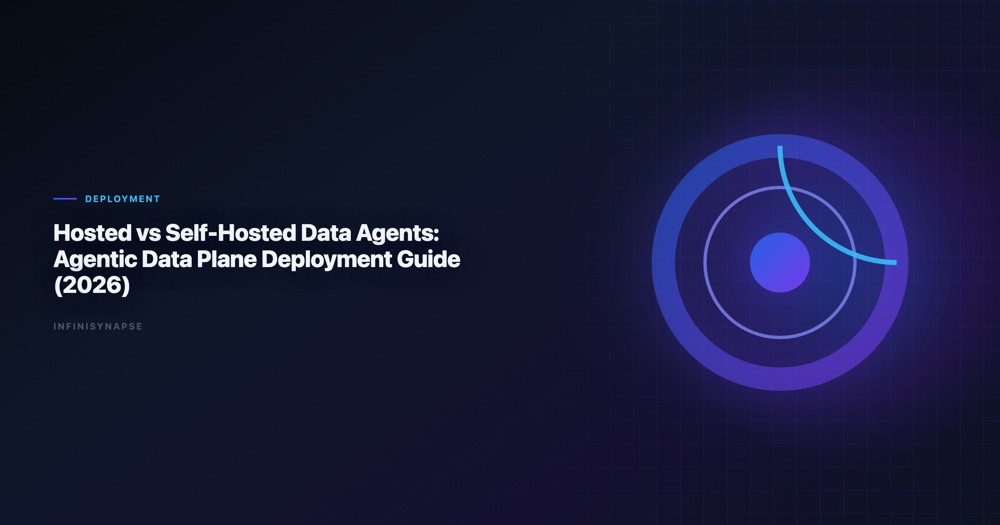

# Agentic Data Plane Hosted vs Self-Hosted Comparison (2026): Deployment Guide

> **By the InfiniSynapse Data Team** · **Last updated: 2026-06-08** · *We build deployment options for enterprise Data Agents, and this guide summarizes architecture trade-offs from real customer rollout patterns.*

**Meta Description**: Compare agentic data plane hosted vs self-hosted comparison options in 2026 with autonomy, governance, SQL depth, memory, and deployment fit for analyst teams.

**Slug**: `/blog/self-hosted-ai-data-analyst`

**Target keyword**: `agentic data plane hosted vs self-hosted comparison`
**Secondary**: `self-hosted ai data analyst`, `hosted data agent`, `enterprise data agent deployment`

---

## Table of Contents

1. [TL;DR](#tldr)
2. [Hosted vs Self-Hosted: What Changes](#hosted-vs-self-hosted-what-changes)
4. [Decision Matrix by Team Stage](#decision-matrix-by-team-stage)
7. [Evaluation Playbook for Deployment Decisions](#evaluation-playbook-for-deployment-decisions)
8. [Common Pitfalls in Hosted and Self-Hosted Rollouts](#common-pitfalls-in-hosted-and-self-hosted-rollouts)
9. [InfiniSynapse Deployment Options](#infinisynapse-deployment-options)
10. [Migration Path: Hosted to Self-Hosted](#migration-path-hosted-to-self-hosted)
11. [Operations Responsibilities: Who Runs What](#operations-responsibilities-who-runs-what)
12. [Team Scenario Deep Dives](#team-scenario-deep-dives)
13. [Frequently Asked Questions](#frequently-asked-questions)
14. [Conclusion](#conclusion)
---

## TL;DR

> The **agentic data plane hosted vs self-hosted** decision is not only about security. It is a trade-off across speed, control, operating burden, and long-term cost. Hosted usually wins in the first 3-6 months. Self-hosted wins when strict data-boundary requirements, private network access, and internal platform maturity become non-negotiable.

If you are evaluating an AI Data Analyst stack, an honest **agentic data plane hosted vs self-hosted comparison** should weigh operating burden alongside security; enterprise adoption guidance in the [Shopify ecommerce analytics](https://www.shopify.com/enterprise/blog/ecommerce-analytics) mirrors the same shift from ad-hoc copilots to repeatable, reviewable decision workflows.

- Pick **hosted** when time-to-value and low ops overhead are the priority.
- Pick **self-hosted** when regulatory boundaries or private connectivity are hard constraints.
- Use a **migration-safe architecture** so you can start hosted and move runtimes later.

For category basics, read [What Is a Data Agent](/blog/what-is-a-data-agent).
For workflow principles, see [AI for Data Analysis](/blog/ai-for-data-analysis) and [Best Agentic Analytics](/blog/best-agentic-analytics).

---

A mature **agentic data plane hosted vs self-hosted comparison** reduces rework once metric contracts are signed; teams scoping deployment models can reuse the same memory-and-trace checklist in [Best AI Tools for Data Analysis in 2026](/blog/best-ai-tools-for-data-analysis).

## Hosted vs Self-Hosted: What Changes
Ecommerce KPI definitions should reference [UK NCSC AI development guidelines](https://www.ncsc.gov.uk/collection/guidelines-secure-ai-system-development) when normalizing revenue and cohort metrics.

OLTP connector hygiene should follow [ISO/IEC 27001](https://www.iso.org/isoiec-27001-information-security.html) for role design, schema grants, and explainable validation queries.

In both models, users ask natural-language questions and receive auditable analysis outputs. The main difference is where control and runtime components execute.

| Dimension | Hosted | Self-Hosted |
|---|---|---|
| Control plane | Vendor-managed cloud | Customer-managed boundary |
| Runtime location | Vendor VPC or shared cloud | Customer VPC / on-prem |
| Data movement | Connector-dependent | Can remain fully private |
| Setup speed | Fastest | Slower initial rollout |
| Ops burden | Low | Higher (SRE, upgrades, monitoring) |
| Governance depth | Strong in enterprise tiers | Maximum, policy-owned by customer |
| Typical fit | Startups, lean teams, fast pilots | Regulated enterprises, sovereignty-heavy teams |

The **agentic data plane hosted vs self-hosted comparison** helps teams separate product capabilities from infrastructure placement. A strong Data Agent product can support both; your constraints determine which mode fits first.

---

## Agentic Data Plane Hosted vs Self-Hosted: Architecture Lens
Secure AI rollouts should reference the [pandas documentation](https://pandas.pydata.org/docs/) when connectors expose production data.

A production Data Agent stack usually includes:

1. **Orchestration layer** to plan and execute multi-step tasks
2. **Query layer** to run federated SQL and transformations
3. **Knowledge layer** to ground definitions and business context
4. **Audit and memory layer** to preserve evidence and reusable logic

The deployment question is where these layers run and which party operates them.

**Hosted agentic data plane**

In a hosted model, the vendor operates orchestration and runtime services in a managed environment. Connectors reach into your databases and warehouses over approved network paths. Data may flow across boundaries depending on connector design, but operations—patching, scaling, uptime—stay with the vendor.

Hosted is the default starting point in most **agentic data plane hosted vs self-hosted** evaluations because it minimizes platform engineering load during the pilot phase.

**Self-hosted agentic data plane**

In a self-hosted model, the runtime executes inside your VPC, private cloud, or on-premises network. Queries can run without data leaving your boundary. You own IAM integration, log retention, key management, and upgrade scheduling.

Self-hosted maximizes control when legal, contractual, or sovereignty requirements block external runtime processing.

### Hybrid patterns

Many enterprises land in hybrid: hosted control features for analyst UX, self-hosted query runtimes adjacent to sensitive systems. The **agentic data plane hosted vs self-hosted comparison** is rarely binary — you can partition workloads by data sensitivity while keeping a consistent analyst experience.

---

## Decision Matrix by Team Stage
Regulated rollouts often anchor access reviews to [Databricks documentation](https://docs.databricks.com/en/) when credentials, retention policies, and audit logs are in scope.

### Stage 1: Pilot (0-3 months)

### Stage 2: Operationalization (3-9 months)

Hybrid decisions begin. Teams often keep hosted control features while moving specific runtimes near sensitive data. Security and data engineering stakeholders join the **agentic data plane hosted vs self-hosted** conversation once usage becomes routine.

### Stage 3: Scale and Compliance (9+ months)

Self-hosted becomes attractive when:

- data must stay inside a legal or contractual boundary,
- systems rely on private network-only databases,
- audit evidence must be retained in customer-owned logging pipelines.

### A Practical Rule

If your blocker is "we need value this quarter," choose hosted first.
If your blocker is "legal will not approve external runtime access," go self-hosted now.

Revisit the **agentic data plane hosted vs self-hosted comparison** every quarter. Requirements that were flexible during pilot often harden once production workflows depend on the platform.

---

## Security Architecture for Agentic Data Plane Hosted vs Self-Hosted
Spreadsheet-heavy preparation often mirrors [Wikipedia natural language processing overview](https://en.wikipedia.org/wiki/Natural_language_processing) patterns for typing, joins, and reproducible transforms.

| Layer | Hosted questions | Self-hosted questions |
|---|---|---|
| **Identity** | SSO, RBAC, SCIM support? | Integration with internal IdP and policy engines? |
| **Network** | Private link, IP allowlists, VPC peering? | Air-gapped or private-only connector paths? |
| **Data** | Encryption at rest and in transit? | Customer-managed keys and HSM options? |
| **Audit** | Exportable query and action logs? | Log routing to SIEM on your terms? |
| **Model** | Is customer data used for training? | Can inference stay inside your boundary? |

Regulated teams often need customer-owned audit retention. Self-hosted runtimes simplify that but shift ops burden to your platform team.

---

## Cost Model:
Lakehouse integrations should use [NIST Computer Security Resource Center](https://csrc.nist.gov/) for Unity Catalog, SQL warehouses, and agent grounding patterns.

Cost comparisons fail when teams only compare license fees.

**Hosted economics** bundle infrastructure, patching, monitoring, and support into subscription pricing. Total cost is predictable at low and medium scale. You pay for speed and reduced headcount.

**Self-hosted economics** add compute, storage, networking, SRE time, and security review cycles. License fees may be lower per seat, but fully loaded cost often exceeds hosted until workload volume is stable and your platform team already exists.

| Cost component | Hosted | Self-hosted |
|---|---|---|
| License / subscription | Primary line item | May be lower per unit |
| Infrastructure | Included or usage-based | Customer bears directly |
| Engineering ops | Low | Material ongoing load |
| Security compliance | Shared vendor attestations | Customer-led audits |
| Migration / switchover | Lower initially | Higher if rushed later |

Self-hosted usually wins on cost only when you already run a mature internal platform and expect sustained high query volume. Include these line items in every **agentic data plane hosted vs self-hosted comparison**, not just license quotes. Analytics uptime improves when teams borrow [ClickHouse documentation](https://clickhouse.com/docs) practices—error budgets, runbooks, and blameless postmortems for failed query chains.

---

## 30-Day Evaluation Playbook for Deployment Decisions
NL interfaces for data still inherit limits from [FTC consumer protection guidance](https://www.ftc.gov/), especially ambiguity and grounding.

Excel automation should reference [Prometheus documentation](https://prometheus.io/docs/) for table semantics, pivots, and formula auditability.

Run this five-step playbook before you sign a deployment contract:

**Step 1 — Classify data sensitivity.** List every source the Data Agent must query. Mark which datasets cannot leave your network under any circumstance. This single exercise often determines the **agentic data plane hosted vs self-hosted** default.

**Step 2 — Map connector reachability.** Confirm whether hosted connectors can reach private databases via approved network paths. If not, self-hosted or hybrid runtimes are required from day one.

**Step 3 — Define audit evidence requirements.** Identify who must review query logs, how long logs are retained, and whether evidence must live in customer-owned systems. Hosted enterprise tiers may suffice; regulated programs often cannot.

**Step 4 — Assess SRE capacity honestly.** Self-hosted success requires owners for upgrades, incident response, and capacity planning. If that capacity does not exist, hosted is the pragmatic **agentic data plane hosted vs self-hosted** outcome even when security stakeholders prefer self-hosted.

**Step 5 — Model a migration path.** Even if you start hosted, verify that task contracts, connector abstractions, and policies can port to self-hosted later. The worst outcome is a full rebuild when compliance requirements change.

---

## Common Pitfalls in Hosted and Self-Hosted Rollouts

**Pitfall 1: Treating deployment as a one-time procurement choice.** Requirements evolve. Teams that lock into a single mode without a migration path pay twice.

**Pitfall 2: Underestimating self-hosted operations.** A self-hosted runtime is not "install and forget." Budget for on-call, upgrades, and connector maintenance.

**Pitfall 3: Assuming hosted means insecure.** Enterprise hosted tiers with private link, customer-managed keys, and exportable audit logs satisfy many regulated programs. Do not default to self-hosted without mapping actual gaps.

**Pitfall 4: Ignoring analyst workflow continuity.** The **agentic data plane hosted vs self-hosted** decision should not force analysts to relearn interfaces. Prefer platforms that preserve task workflows across deployment modes.

**Pitfall 5: Big-bang migration.** Moving every workload to self-hosted at once creates parallel outages and review bottlenecks. Phase by sensitivity class instead.

---

## InfiniSynapse Deployment Options

InfiniSynapse supports three deployment patterns for Data Agent workloads:

1. **Multi-tenant hosted SaaS** for fastest onboarding
2. **Single-tenant hosted** for stronger isolation with managed operations
3. **Self-hosted runtime** for private-network and sovereignty requirements

Across all three modes, the product model remains consistent:

- **InfiniSQL** for query planning and execution
- **InfiniRAG** for definition-grounded retrieval
- **Task timeline** for full auditability
- **Memory cards** for recurring analysis acceleration

This consistency matters for **agentic data plane hosted vs self-hosted** planning: teams can preserve analyst workflow while changing infrastructure boundaries. You validate product fit on hosted foundations, then move sensitive workloads without retraining users.

---

## Migration Path: Hosted to Self-Hosted

Most teams do not need a "big bang" migration. A phased path reduces risk:

1. **Standardize task contracts**: use the same prompts, definitions, and approval flow in both environments.
2. **Externalize policies**: keep IAM and data-access rules in policy-as-code where possible.
3. **Run dual mode for critical workflows**: compare outputs and timing before cutover.
4. **Cut over by workload class**: start with regulated use cases first.
5. **Keep rollback capability**: preserve hosted fallback during stabilization.

The wrong approach is rebuilding everything from scratch when security requirements evolve. A migration-safe **agentic data plane hosted vs self-hosted** strategy treats deployment mode as infrastructure configuration, not a new product adoption.

Document connector credentials, task templates, and approval flows in portable formats before migration begins. Teams that treat the **agentic data plane hosted vs self-hosted** transition as an infrastructure repatriation—not a workflow redesign—typically cut migration time by half compared with full rebuilds. Analysts wiring Visualization into production reviews can follow the parallel walkthrough in [Best AI Data Visualization Tools in 2026](/blog/ai-data-visualization-tools).

---

## Operations Responsibilities: Who Runs What

| Responsibility | Hosted (vendor-led) | Self-hosted (customer-led) |
|---|---|---|
| Runtime uptime and patching | Vendor SRE | Customer platform team |
| Connector credential rotation | Shared; customer approves access | Customer-owned |
| Model and dependency upgrades | Vendor schedules | Customer schedules |
| Incident root-cause analysis | Joint; vendor owns platform layer | Customer owns infrastructure layer |
| Capacity planning | Vendor scales managed runtime | Customer provisions compute |
| Audit log retention | Per contract; often vendor-stored | Customer SIEM routing |

In hosted mode, your team focuses on data governance, analyst adoption, and connector approval workflows. In self-hosted mode, you add infrastructure on-call, image management, and network troubleshooting. The **agentic data plane hosted vs self-hosted** choice is therefore a headcount decision as much as a security decision.

Hybrid deployments split the table: analyst-facing control plane may stay hosted while query runtimes sit in your VPC. Document which team owns each row before production launch. Without that clarity, incidents stall while platform and vendor teams debate responsibility.

For most growth-stage companies, hosted operations free analytics leaders to focus on output quality rather than Kubernetes upgrades. For regulated enterprises with existing platform engineering, self-hosted operations are already budgeted—the **agentic data plane hosted vs self-hosted** question becomes whether the Data Agent runtime fits your existing runbooks or requires a new operational domain.

---

## Team Scenario Deep Dives

### Scenario A: Series B startup, no platform team

Hosted multi-tenant SaaS is the clear **agentic data plane hosted vs self-hosted** winner. The team needs analyst value within weeks, not a six-month infrastructure program. Revisit self-hosted only if enterprise customers impose contractual data-boundary clauses.

### Scenario B: Global bank with on-prem legacy databases

Private-network-only sources force self-hosted or hybrid runtimes near those systems. Hosted may still work for analyst UX if query execution stays inside the bank's boundary. The **agentic data plane hosted vs self-hosted** design here is usually hybrid, not pure self-hosted.

### Scenario C: Mid-market SaaS with SOC 2 requirements

Single-tenant hosted often satisfies audit needs without customer-run infrastructure. Evaluate exportable logs, SSO, and data processing agreements before assuming self-hosted is mandatory.

### Scenario D: Analytics platform team with existing Kubernetes ops

Self-hosted becomes viable because SRE capacity already exists. Run TCO over 12 months comparing single-tenant hosted against self-hosted compute plus engineering time. The **agentic data plane hosted vs self-hosted** answer may still be hosted if vendor ops are cheaper than marginal platform load.

---
## Frequently Asked Questions

### What is the difference between hosted and self-hosted agentic data planes?

Hosted runs the control plane and runtime in vendor-managed cloud infrastructure, while self-hosted deploys the runtime inside your VPC or on-prem environment with your network boundaries, keys, and logs.

### When should a team choose self-hosted deployment?

Choose self-hosted when regulated data cannot leave your boundary, private network-only systems must be queried directly, or your governance model requires customer-owned IAM, logging, and retention controls. The credential, preflight, and SQL-trace pattern above also applies to Chatgpt—see [7 Alternatives to ChatGPT for Data Analysis (2026)](/blog/chatgpt-data-analysis-alternatives) for source-specific steps.

### Is self-hosted always cheaper than hosted?

No. Hosted is often cheaper at low and medium volume because operations are bundled. Self-hosted usually becomes cost-efficient only when workload is predictable at scale and you already have platform engineering capacity.

### Can we start hosted and migrate to self-hosted later?

Yes. A migration-safe design keeps task contracts, connector abstractions, and governance policies portable so teams can run hosted and self-hosted in parallel before final cutover.

### How does InfiniSynapse support both hosted and self-hosted options?

InfiniSynapse offers multi-tenant hosted, single-tenant hosted, and self-hosted runtime deployment while preserving the same InfiniSQL, InfiniRAG, task timeline, and memory workflow across environments.

### What should we evaluate first in a deployment decision?

Start with five criteria: data-boundary requirements, connector reachability, audit evidence requirements, SRE operating capacity, and 12-month total cost of ownership.

---

## Conclusion

For **agentic data plane hosted vs self-hosted** decisions, architecture fit beats ideology. Hosted accelerates learning and adoption. Self-hosted maximizes control when compliance and private connectivity are mandatory. Document the **agentic data plane hosted vs self-hosted** rationale in your ADR.

The best strategy for many teams is staged: prove value quickly on hosted foundations, then move sensitive workloads to self-hosted runtimes without changing analyst behavior. Run the evaluation playbook, avoid common pitfalls, and treat the **agentic data plane hosted vs self-hosted** choice as a workload-level decision—not a permanent identity.

Revisit the **agentic data plane hosted vs self-hosted** matrix quarterly as data boundaries, query volume, and platform maturity evolve. The right answer at month three is often not the right answer at month twelve. Finance and security should co-sign any **agentic data plane hosted vs self-hosted** migration before cutover.

---