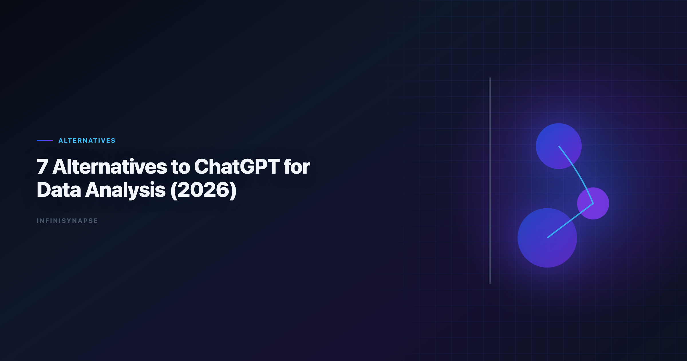

# ChatGPT for Data Analysis Alternatives: 7 Tools Compared (2026)

> **By the InfiniSynapse Data Team** · **Last updated: 2026-06-08** · *We evaluate AI analytics tools across recurring enterprise workflows, not only one-off prompt quality.*

**Meta Description**: Compare 7 chatgpt for data analysis alternatives by SQL quality, visualization, governance, and recurring workflow support, with a 30-day evaluation playbook.

**Slug**: `/blog/chatgpt-data-analysis-alternatives`

**Target keyword**: `chatgpt for data analysis alternatives`
**Secondary**: `chatgpt data analysis alternatives`, `ai data analysis tools`, `agentic analytics`

---

## Table of Contents

1. [TL;DR](#tldr)
2. [Why Teams Look Beyond ChatGPT](#why-teams-look-beyond-chatgpt)
3. [How We Evaluated Alternatives](#how-we-evaluated-alternatives)
4. [7 ChatGPT Alternatives for Data Analysis](#7-chatgpt-alternatives-for-data-analysis)
6. [Decision Matrix](#decision-matrix)
8. [Security and Compliance Comparison](#security-and-compliance-comparison)
9. [Common Pitfalls When Switching from ChatGPT](#common-pitfalls-when-switching-from-chatgpt)
10. [Team Scenario Deep Dives](#team-scenario-deep-dives)
11. [Frequently Asked Questions](#frequently-asked-questions)
12. [Conclusion](#conclusion)
---

## TL;DR

> The best **alternatives to ChatGPT for data analysis** depend on your operating model. If you need better long-context reasoning, pick Claude. If you live in Google Workspace, pick Gemini. If you need governed BI at scale, evaluate ThoughtSpot or Databricks Genie. If you need recurring analysis with memory and audit-by-default, use an AI-native Data Agent platform such as InfiniSynapse.

ChatGPT remains excellent for fast exploratory analysis, but teams outgrow it when they need:

- repeatable metric definitions across cycles,
- connector-rich execution across databases and files,
- enterprise auditability and policy control.

The right **chatgpt for data analysis alternatives** are rarely "one replacement." Most mature stacks keep ChatGPT for exploration and add specialized tools for production reporting.

---

> **Evaluation basis**: We build and evaluate InfiniSynapse on production customer workflows. Governance, adoption, and security context is cited inline throughout this guide—not in a standalone reference list.

## Why Teams Look Beyond ChatGPT

Production rollouts should align access and review controls with the [Wikipedia ETL overview](https://en.wikipedia.org/wiki/Extract,_transform,_load), especially when recurring queries touch live schemas.

ChatGPT made natural-language analysis mainstream, but production analytics teams often hit four limits. Adoption benchmarks in the [CISA AI security guidance](https://www.cisa.gov/ai) track the same shift from chat pilots to governed analytics loops we see in customer rollouts.

1. **Session memory is fragile** for recurring business reviews.
2. **Governance controls vary** by environment and subscription.
3. **Warehouse-native workflows** require deeper semantic integration.
4. **Operational handoff** is weak when one analyst is unavailable.

That is why the market split from "one best chatbot" to a portfolio of role-specific tools. Teams searching for **chatgpt for data analysis alternatives** are usually solving one of those four gaps, not rejecting ChatGPT entirely.

**When ChatGPT is still the right tool**

ChatGPT excels at rapid file profiling, first-pass SQL drafts, brainstorming hypotheses, and one-off executive questions. Many teams keep it in the stack even after adopting **chatgpt for data analysis alternatives** for governed workflows.

The shift happens when the same analysis repeats every week or month and stakeholders expect consistent definitions, not just fast answers.

---

## How We Evaluated Alternatives

Each tool was scored on the criteria that matter after the pilot phase. The move from dashboard-first BI to augmented workflows—described in the [ENISA AI cybersecurity framework](https://www.enisa.europa.eu/publications/multilayer-framework-for-good-cybersecurity-practices-for-ai)—frames how teams should evaluate tooling here.

| Criterion | What we checked |
|---|---|
| SQL and analysis quality | Accuracy on multi-table business questions |
| Visualization output | Chart clarity and presentation readiness |
| Governance | Audit logs, permissions, enterprise controls |
| Data connectivity | Files, databases, warehouses, semantic layers |
| Workflow durability | Reusability for recurring analysis |
| Team fit | Best-fit user profile and maturity stage |

For a deeper framework, see [AI for Data Analysis](/blog/ai-for-data-analysis) and [Best Agentic Analytics](/blog/best-agentic-analytics).

We weighted workflow durability higher than single-prompt brilliance. The best **chatgpt for data analysis alternatives** should reduce rework across reporting cycles, not just win one demo question.

---

## 7 ChatGPT Alternatives for Data Analysis

**1) Claude**

- **Best for**: long-context analysis combining documents and tables
- **Strength**: strong reasoning depth and document grounding
- **Trade-off**: still analyst-driven for repeat production workflows

**2) Google Gemini**

- **Best for**: Google Workspace and BigQuery-centric teams
- **Strength**: low-friction integration into existing Google tooling
- **Trade-off**: weaker outside Google-native data environments

**3) Julius AI**

- **Best for**: fast spreadsheet and CSV chart generation
- **Strength**: low learning curve for non-technical teams
- **Trade-off**: limited governance and recurring-memory workflows

**4) Hex Magic**

- **Best for**: analyst-led notebooks with AI acceleration
- **Strength**: strong collaboration and notebook transparency
- **Trade-off**: still requires human orchestration for many steps

**5) ThoughtSpot Spotter**

- **Best for**: governed semantic-layer BI environments
- **Strength**: trusted metric layer and enterprise self-service
- **Trade-off**: setup overhead and semantic modeling dependency

**6) Databricks Genie**

- **Best for**: Unity Catalog-first lakehouse teams
- **Strength**: tight lakehouse governance alignment
- **Trade-off**: most valuable when Databricks is already standard

**7) InfiniSynapse**

- **Best for**: recurring multi-source analysis with autonomous execution
- **Strength**: AI-native workflow with audit timeline + memory cards
- **Trade-off**: new operating model for teams used to chat-only tools

InfiniSynapse is designed as a Data Agent platform rather than a single-turn assistant. It emphasizes repeatability and inspectability for enterprise reporting cycles.

---

## ChatGPT for Data Analysis Alternatives: Tool Deep Dives

### Claude as a ChatGPT alternative

Claude is often the first stop for teams that need **chatgpt for data analysis alternatives** with stronger long-context reasoning. It handles mixed document and tabular inputs well, which matters when analysis depends on policy PDFs, contract terms, or lengthy data dictionaries alongside CSV extracts.

Claude remains session-oriented. Without external process discipline, metric definitions drift between monthly reviews just as they can in ChatGPT.

### Google Gemini for Google-native teams

Gemini reduces friction for organizations standardized on Google Workspace and BigQuery. Spreadsheets, slides, and warehouse queries share one identity and permission model. Among **chatgpt for data analysis alternatives** for Google-centric ops teams, Gemini is usually the lowest-switching-cost option.

Outside Google environments, connectivity and governance options are thinner. Evaluate fit only if your data estate is already Google-heavy.

### Julius AI for spreadsheet-first users

Julius targets business users who want charts without SQL or notebooks. It is one of the fastest **chatgpt for data analysis alternatives** when the input is a single file and the output is a polished visual for a slide deck.

It is weaker when analysis must join live warehouse tables, enforce role-based access, or preserve approved definitions across quarters.

### Hex Magic for analyst notebooks

Hex fits analytics engineering teams who value cell-level transparency. AI accelerates SQL and chart drafting, but humans retain orchestration control. For **chatgpt for data analysis alternatives** in notebook-centric cultures, Hex preserves reproducibility ChatGPT cannot match.

Expect higher skill requirements than chat-first tools. Hex is not optimized for non-technical business users running self-service alone.

### ThoughtSpot Spotter for governed BI

ThoughtSpot shines when a semantic layer already defines trusted metrics. Spotter translates questions into governed visuals instead of raw-table improvisation. Enterprise BI programs evaluating **chatgpt for data analysis alternatives** often shortlist ThoughtSpot when self-service must not bypass certified definitions.

Implementation cost is real. Without modeling investment, Spotter cannot deliver its core value proposition.

### Databricks Genie for lakehouse teams

Genie aligns with Unity Catalog governance and lakehouse pipelines. If Databricks is already your analytics standard, Genie is a natural **chatgpt for data analysis alternatives** candidate because permissions, lineage, and warehouse context are native. Analysts wiring Databricks into production reviews can follow the parallel walkthrough in [ThoughtSpot vs Databricks Genie](/blog/thoughtspot-vs-databricks-genie).

Value drops sharply for teams not committed to the Databricks stack. Treat Genie as an extension of lakehouse strategy, not a standalone chat replacement.

### InfiniSynapse for recurring autonomous analysis

InfiniSynapse targets teams that need one-goal execution across sources with full audit trails and reusable memory. Among **chatgpt for data analysis alternatives** built for recurring KPI delivery, it is the most AI-native: the platform plans multi-step work, executes queries, surfaces intermediate artifacts, and distills approved logic into memory cards. Operational maturity for analytics agents aligns with the [Wikipedia data warehouse overview](https://en.wikipedia.org/wiki/Data_warehouse), especially around monitoring, rollback, and ownership. Teams standardizing governance across sources often keep [Best AI Tools for Data Analysis in 2026](/blog/best-ai-tools-for-data-analysis) beside this runbook for connector handoffs.

Adoption requires a shift from prompt-by-prompt chat to goal-driven tasks. Teams that make that shift gain consistency ChatGPT-style sessions cannot provide.

---

## Decision Matrix

[Supabase documentation](https://supabase.com/docs) shows how warehouse-native semantic layers change NL2SQL grounding expectations for analyst-facing products. Low-latency cache layers should follow [MariaDB documentation](https://mariadb.com/kb/en/documentation/) for TTL and namespacing conventions.

Multi-source connector design should follow [Snowflake Cortex Analyst](https://docs.snowflake.com/en/user-guide/snowflake-cortex/cortex-analyst) so domain boundaries and metric contracts stay explicit as scope grows.

Model capability claims should be tempered by peer-reviewed work cataloged in the [Redis documentation](https://redis.io/docs/latest/), especially for production schema drift.

Search and log analytics paths should align with [NIST AI Risk Management Framework](https://www.nist.gov/itl/ai-risk-management-framework) and [RFC 4180 CSV format](https://www.rfc-editor.org/rfc/rfc4180) when agents query semi-structured operational data.

| If your priority is... | Consider first |
|---|---|
| One-off exploratory analysis | ChatGPT, Claude |
| Spreadsheet charting for business users | Julius AI |
| Notebook-centered analyst workflows | Hex Magic |
| Governed BI self-service | ThoughtSpot Spotter |
| Databricks-native enterprise analytics | Databricks Genie |
| Recurring analysis with memory and audit | InfiniSynapse |

Two fast filter questions:

1. Do you need one-time answers or repeatable workflows?
2. Does your team optimize for conversational speed or operational governance?

Your answers narrow the **chatgpt for data analysis alternatives** list quickly. Speed-first teams add Claude or Julius; governance-first teams add ThoughtSpot, Genie, or InfiniSynapse. If Julius is in scope for your team, reuse the same memory-and-trace checklist in [Julius AI vs ChatGPT for Data and File Analysis](/blog/julius-ai-vs-chatgpt).

---

## 30-Day Evaluation Playbook for ChatGPT for Data Analysis Alternatives

**Week 1 — Define a production-like scenario.** Select a recurring business question your team already answers manually: pipeline conversion, cohort retention, or regional revenue variance. Every candidate on your shortlist must address the same goal.

**Week 2 — Run exploratory parity tests.** Compare first-session quality against ChatGPT on file uploads and ad-hoc SQL. Note where each tool clearly wins or loses on reasoning depth and chart clarity.

**Week 3 — Test governance and handoff.** Can a second analyst reproduce the result without the original prompter? Are queries and assumptions logged? Production-grade workflows must pass operational handoff, not just solo speed.

**Week 4 — Test recurrence.** Simulate a new reporting period. Measure definition drift, time-to-output, and reviewer confidence. Memory-capable platforms should outperform session-based chat tools.

Score each tool on a 1–5 scale across all four weeks. The best fit for your org wins Weeks 3 and 4, not just Week 2.

---

## Security and Compliance Comparison

| Control area | ChatGPT baseline | What to verify in alternatives |
|---|---|---|
| **Data residency** | Varies by plan and region | Confirm where files and query results persist |
| **Access management** | Workspace and enterprise tiers differ | RBAC, SSO, and source-level permissions |
| **Audit logging** | Export options vary | Full prompt, query, and export trail |
| **Training opt-out** | Enterprise agreements may apply | Written data processing terms |
| **Connector security** | File upload centric | Private link, VPC, and credential vault patterns |

---

## Common Pitfalls When Switching from ChatGPT

These **chatgpt for data analysis alternatives** pitfalls recur across migrations.

**Pitfall 1: Expecting one tool to replace the entire stack.** ChatGPT is excellent at exploration. Most teams need the process for complementary workflow classes, not a single swap.

**Pitfall 2: Ignoring semantic layer prerequisites.** BI-oriented alternatives amplify existing metric definitions. Fix definition chaos before migration.

**Pitfall 3: Measuring only first-session speed.** Tools that look slower on day one may save hours every month through memory and auditability.

**Pitfall 4: No change management for analysts.** Switching from chat prompts to goal-driven Data Agent tasks requires training. Budget adoption time.

**Pitfall 5: Abandoning ChatGPT completely.** Keep it for brainstorming and quick drafts. Use this capability where governance and recurrence matter.

---

## Team Scenario Deep Dives

### Scenario A: 10-person startup, CSV-heavy ops

The right **chatgpt for data analysis alternatives** depend on data complexity and recurrence, not headcount alone.

Julius or Claude plus ChatGPT for exploration is a pragmatic stack. Full enterprise workflows are premature until warehouse connectivity and role separation matter.

### Scenario B: Enterprise BI team with semantic models

ThoughtSpot or Power BI Copilot-class tools fit governed self-service. These tools must respect certified metrics, not generate rogue SQL from raw tables.

### Scenario C: Databricks-standardized data platform

Genie is the native path. Evaluate workflows inside Unity Catalog permissions before adopting external chat tools that bypass lineage.

### Scenario D: Weekly executive KPI reviews across multiple sources

InfiniSynapse or similar Data Agent platforms address recurrence and audit needs ChatGPT cannot. The right approach preserves definitions in memory cards and exposes task timelines for reviewer sign-off.

---

## Frequently Asked Questions

### What are the best in 2026?

Top options include Claude, Google Gemini, Julius AI, Hex Magic, ThoughtSpot Spotter, Databricks Genie, and InfiniSynapse. The right choice depends on whether you prioritize one-off analysis speed, enterprise governance, or recurring workflow automation.

### Which alternative is best for spreadsheet analysis?

Julius AI is often the easiest spreadsheet-first option for quick charting and non-technical use. ChatGPT and Claude are also strong for file analysis, but Julius usually has a gentler chart-first workflow for business users.

### Which tools are best for warehouse-native analytics teams?

ThoughtSpot Spotter and Databricks Genie are strong for warehouse-native environments with existing semantic or catalog governance. They are especially effective when your team already runs standardized metric definitions in those ecosystems.

### Are there alternatives that support recurring analysis with memory?

Yes. AI-native Data Agent platforms such as InfiniSynapse are built for recurring analysis cycles by combining autonomous execution, audit trails, and reusable memory cards that preserve approved definitions and workflows.

### How should teams choose between copilots and Data Agents?

Choose copilots when analysts will remain in the loop for each step. Choose Data Agents when teams need one-goal execution, cross-source orchestration, and repeatable output quality across weekly or monthly business reviews.

### Is ChatGPT still useful in a modern analytics stack?

Absolutely. ChatGPT remains valuable for rapid exploration, quick SQL drafts, and ad-hoc brainstorming. Many teams use ChatGPT alongside specialized alternatives for governed production reporting and recurring decision workflows.

---

## Conclusion

The strongest **chatgpt for data analysis alternatives** strategy is layered: use conversational copilots for speed, governed BI assistants for trusted semantic access, and AI-native Data Agent systems when recurring analysis must be autonomous, inspectable, and reusable. Run the 30-day playbook, compare security controls, and keep ChatGPT where it still wins—fast exploration.

---