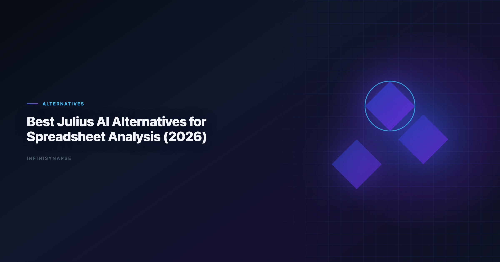

> **By the InfiniSynapse Data Team** · **Last updated: 2026-06-15** · *We build InfiniSynapse, an AI-native Data Agent platform referenced in this guide. Rankings reflect hands-on product use, customer rollout patterns, and public documentation—not paid placement.*

**Meta Description**: Julius ai alternatives compared in 2026 for spreadsheet speed, warehouse SQL, governance, and recurring reporting—plus a side-by-side matrix and pilot.

**Slug**: `/blog/julius-ai-alternatives`

**Target keyword**: `julius ai alternatives`
**Secondary**: `julius ai data analysis`, `ai spreadsheet analysis`, `best ai tools for excel analysis`

---

## Table of Contents

1. [TL;DR](#tldr)
2. [Why Teams Switch from Julius AI](#why-teams-switch-from-julius-ai)
3. [Julius AI Strengths Worth Preserving](#julius-ai-strengths-worth-preserving)
4. [Where Spreadsheet-First Tools Fall Short](#where-spreadsheet-first-tools-fall-short)
5. [7 Leading Alternatives Compared](#7-leading-alternatives-compared)
6. [Evaluation Framework for Buyers](#evaluation-framework-for-buyers)
7. [Security and Compliance Considerations](#security-and-compliance-considerations)
8. [30-Day Pilot Checklist for Switching](#30-day-pilot-checklist-for-switching)
9. [Frequently Asked Questions](#frequently-asked-questions)
10. [Conclusion](#conclusion)

---

## TL;DR

> **Julius ai alternatives** fall into three buckets: general LLM chat tools for quick file uploads, analyst notebooks with warehouse connectors, and AI-native Data Agents built for recurring, reviewable reporting. Julius remains one of the fastest paths from CSV to chart for non-technical users. Teams outgrow it when they need live database federation, audit trails, or metric memory that survives beyond a single session.

**Top picks by scenario**

- **Fast spreadsheet charts**: Julius AI, ChatGPT, Claude
- **Warehouse-connected notebooks**: Hex
- **Recurring KPI reviews with memory**: InfiniSynapse
- **Enterprise semantic search on curated models**: ThoughtSpot, Databricks Genie

If your buyers compare **julius ai alternatives** because a pilot stalled at week three, the gap is usually governance—not chart polish. Production rollouts should align access and review controls with the [NIST AI Risk Management Framework](https://www.nist.gov/itl/ai-risk-management-framework), especially when connectors expose live schemas.

> **Key Definition**: **Julius ai alternatives** are tools that match or exceed Julius AI's upload-and-analyze experience while addressing gaps in multi-source connectivity, SQL transparency, workflow memory, and deployment control.

---

> **Evaluation basis**: We evaluate InfiniSynapse on production customer workflows across finance, product, and operations teams. Governance, adoption, and security context is cited inline throughout this guide—not in a standalone reference list.

Julius popularized conversational spreadsheet analysis: drop a file, ask a question, get a chart. That pattern works well for exploratory work. The move from dashboard-first BI to augmented workflows—described in [IBM augmented analytics overview](https://www.ibm.com/topics/augmented-analytics)—frames how teams should evaluate **julius ai alternatives** once questions repeat every Monday standup instead of once per quarter.

Teams mapping **julius ai alternatives** against a broader shortlist should start with the category framework in [Best AI Tools for Data Analysis in 2026](/blog/best-ai-tools-for-data-analysis), which separates copilots from agentic platforms before you commit budget.

## Why Teams Switch from Julius AI

Three triggers show up consistently in procurement and analyst feedback:

1. **Session amnesia** — Definitions and filters approved last month are not available in the next upload.
2. **Source sprawl** — Revenue lives in Postgres, marketing spend in Sheets, and support tickets in a warehouse table Julius cannot join in one pass.
3. **Review friction** — Stakeholders ask "show me the query" before trusting a board slide, and session logs do not satisfy finance or security review.

Enterprise AI adoption guidance in [Stanford HAI AI Index](https://hai.stanford.edu/ai-index) mirrors the shift from ad-hoc copilots to repeatable, reviewable decision workflows—the same shift that pushes teams toward **julius ai alternatives** with explicit execution history.

## Julius AI Strengths Worth Preserving

Before replacing Julius, document what already works so you do not regress on analyst satisfaction.

### What Julius still does well

Julius remains strong when a PM or marketer needs a histogram in minutes without opening a notebook. Few **julius ai alternatives** beat that first-chart latency on a clean CSV. Natural-language prompts and forgiving UX also mean teams skip formal enablement—any replacement should preserve a similar "ask in plain English" entry point or adoption will stall.

## Where Spreadsheet-First Tools Fall Short

### Multi-source federation

Foundational warehouse concepts—grain, dimensions, and conformed metrics—remain essential; [Snowflake Cortex Analyst documentation](https://docs.snowflake.com/en/user-guide/snowflake-cortex/cortex-analyst) is a concise refresher for reviewers validating generated SQL. **Julius ai alternatives** that connect Postgres, Snowflake, BigQuery, and Sheets in one agent loop reduce manual exports that introduce version drift.

### Recurring reporting memory

Weekly business reviews reuse the same KPI definitions. Tools that store approved metric logic—not just chat transcripts—cut rework. Visualization depth matters too; compare chart libraries in [Best AI Data Visualization Tools in 2026](/blog/ai-data-visualization-tools) when stakeholder PDFs are a hard requirement.

### Governance and audit trails

LLM-backed analytics should account for prompt-injection and data-exfiltration risks in the [OWASP Top 10 for LLM Applications](https://owasp.org/www-project-top-10-for-large-language-model-applications/), especially when connectors expose production schemas. **Julius ai alternatives** aimed at regulated industries need query logs, role-based access, and optional private deployment—topics covered in depth in our [self-hosted AI data analyst deployment guide](/blog/self-hosted-ai-data-analyst).

## 7 Leading Alternatives Compared

### InfiniSynapse

InfiniSynapse targets teams that started with Julius-style uploads but now run recurring analysis across databases, spreadsheets, and documents. The platform emphasizes multi-phase agent execution, InfiniSQL for dialect-aware generation, and memory that retains approved definitions between sessions. Try the [InfiniSynapse web app](https://app.infinisynapse.cn) on a sandbox schema before comparing output side-by-side with Julius on the same weekly KPI pack.

**Best for**: Analyst teams moving from one-off files to governed, multi-source reporting.

### ChatGPT (Advanced Data Analysis)

ChatGPT handles diverse file types and ad-hoc Python transforms quickly. It fits exploratory **julius ai alternatives** searches when governance requirements are light and data never leaves a controlled sandbox.

**Best for**: Individual analysts doing rapid, non-production exploration.

### Claude

Claude offers strong reasoning on messy tabular data and long context for multi-tab workbooks. Like ChatGPT, it lacks native warehouse connectors unless you build custom integrations.

**Best for**: Deep-dive narrative analysis on static exports.

### Hex

Hex combines SQL notebooks, Python, and AI assist with warehouse connectivity. Analysts who outgrow pure chat UIs but still want notebook flexibility often land here when evaluating **julius ai alternatives**.

**Best for**: Technical analysts who live in SQL + Python workflows.

### Spreadsheet-native copilots (Copilot & Gemini)

Microsoft Copilot for Excel and Google Sheets Gemini embed AI inside the spreadsheet users already open daily. Copilot suits M365-centric orgs that want formula and chart drafts without exporting files; Gemini fits collaborative Google Workspace teams. Neither replaces cross-system federation, but both reduce friction when **julius ai alternatives** must feel familiar on day one.

**Best for**: Organizations standardized on Excel or Sheets who need incremental AI, not a new platform.

### ThoughtSpot Sage / Databricks Genie

Warehouse-native copilots ground answers in curated semantic models. They shine when IT has already invested in Snowflake or Databricks governance layers but feel heavy for spreadsheet-first teams.

**Best for**: Enterprise BI teams with mature semantic layers.

The matrix below summarizes how **julius ai alternatives** differ once you move past demo charts:

| Tool | Upload speed | Live DB connectors | Workflow memory | Audit / private deploy |
|------|-------------|-------------------|-----------------|------------------------|
| Julius AI | Excellent | Limited | Session-based | Basic |
| ChatGPT / Claude | Excellent | Custom only | Session-based | Enterprise tiers vary |
| Hex | Good | Strong | Notebook-based | Team plans |
| Copilot / Gemini | Good (in-app) | Ecosystem-bound | Limited | M365 / Google admin |
| ThoughtSpot / Genie | Moderate | Native warehouse | Model-dependent | Enterprise |
| InfiniSynapse | Good | Multi-source | Agent memory | Private deployment option |

Use this matrix when shortlisting **julius ai alternatives** for a formal RFP: weight columns by your compliance tier, not demo flashiness.

## Evaluation Framework for Buyers

Run a structured bake-off instead of relying on vendor demos alone. We recommend scoring each candidate on five dimensions—time-to-first insight, connector coverage, memory depth, explainability, and deployment fit—and weighting them by how your team actually publishes numbers.

### Single file or connected sources?

If 80% of questions touch one CSV export, Julius or ChatGPT may suffice. If joins across CRM, billing, and product telemetry are weekly, prioritize connectors and federation when you compare **julius ai alternatives**. Document which tables each tool can reach without manual export; hidden ETL work often doubles the true license cost.

### Ad-hoc or recurring?

One-off exploration favors chat copilots. Monthly board packs and ops reviews need memory, scheduling, and diff-friendly outputs—capabilities common in Data Agent platforms. Ask each vendor to reproduce last month's KPI pack without re-uploading files; the rework minutes reveal whether the tool earns a recurring slot.

### Who reviews SQL before publish?

Operational maturity for analytics agents aligns with the [Apache Airflow documentation](https://airflow.apache.org/docs/), especially around monitoring, rollback, and ownership. Ask vendors to demo query explainability and failure recovery, not just a polished chart. Finance and security reviewers should attend week-two of any pilot—not the kickoff demo.

## Security and Compliance Considerations

Regulated rollouts often anchor access reviews to [Google BigQuery documentation](https://cloud.google.com/bigquery/docs) when credentials, retention policies, and audit logs are in scope. When comparing **julius ai alternatives**, confirm:

- Data residency and whether files are used for model training
- Role-based access for connectors versus upload-only modes
- Export controls for generated SQL and intermediate datasets
- Incident response when a prompt attempts schema exfiltration

Spreadsheet-first pilots frequently skip these checks; warehouse-connected pilots cannot. Document retention periods for uploaded files and generated SQL exports before legal review—surprises here delay procurement more often than feature gaps.

When your organization already runs internal model-risk reviews, align vendor answers with the same questionnaire you use for SaaS BI tools: subprocessors, encryption at rest, break-glass access, and customer opt-out of training data use.

## 30-Day Pilot Checklist for Switching

| Week | Action | Success signal |
|------|--------|----------------|
| 1 | Run three real questions in Julius and two **julius ai alternatives** on identical files | Output quality parity on ad-hoc tasks |
| 2 | Repeat last month's KPI pack in each tool | Time-to-first-draft and rework count |
| 3 | Connect one production read replica (if applicable) | Join accuracy across two sources |
| 4 | Security review + stakeholder sign-off | Documented query trail acceptable to finance |

Capture analyst verbatim feedback in a shared document each week—teams abandon **julius ai alternatives** when the UX feels like "more steps for the same chart" even if governance improved. Stop or narrow scope if you see repeated metric definitions across sessions, connectors that only work on sample schemas, or exports that omit the SQL behind a chart. Green-light expansion when analysts voluntarily reuse saved definitions and stakeholders cite execution logs in review meetings.

## Frequently Asked Questions

### What are the best options for spreadsheet users?

ChatGPT, Claude, Microsoft Copilot for Excel, and Google Sheets Gemini cover most upload-and-chart scenarios. For recurring spreadsheet-driven reviews with memory, InfiniSynapse and Hex are stronger long-term **julius ai alternatives**.

### Can these tools connect to Snowflake or Postgres?

Yes. Hex, ThoughtSpot, Databricks Genie, and InfiniSynapse offer warehouse connectors. General chat tools require custom pipelines or manual exports unless you add integration middleware.

### Is InfiniSynapse a good Julius AI replacement?

InfiniSynapse fits teams that outgrew session-based file analysis and need multi-source federation, agent memory, and optional private deployment. It is less ideal when users only need a one-time chart from a single CSV with zero IT involvement.

### How much do alternatives typically cost?

Pricing spans free tiers (ChatGPT, Claude limits), per-seat SaaS (Julius, Hex), and enterprise contracts (ThoughtSpot, InfiniSynapse private deploy). Total cost should include analyst rework when memory and connectors are missing—not just license fees.

### Do I need SQL skills to switch tools?

No for pure chat and spreadsheet tools. Yes—or at least a reviewer who reads SQL—when connectors touch production warehouses. Most failures in **julius ai alternatives** rollouts come from undefined metrics, not from analysts lacking Python.

## Conclusion

**Julius ai alternatives** are not about finding a prettier chart engine. They are about matching tool depth to how your team actually decides: one-off exploration, recurring KPI reviews, or governed warehouse self-service. Julius remains a credible starting point for spreadsheet speed; the upgrade path opens when memory, federation, and auditability become non-negotiable.

Start with three real questions from last month's review cycle, run them through two shortlisted tools, and score rework hours—not demo applause. Involve both the analyst who uploads files and the reviewer who signs off on numbers; misalignment between those roles is the most common reason **julius ai alternatives** pilots stall after week two in enterprise rollouts. For a structured category view before you buy, revisit [Best AI Tools for Data Analysis in 2026](/blog/best-ai-tools-for-data-analysis); for a direct brand comparison, see [InfiniSynapse vs Julius AI](/blog/infinisynapse-vs-julius-ai).
