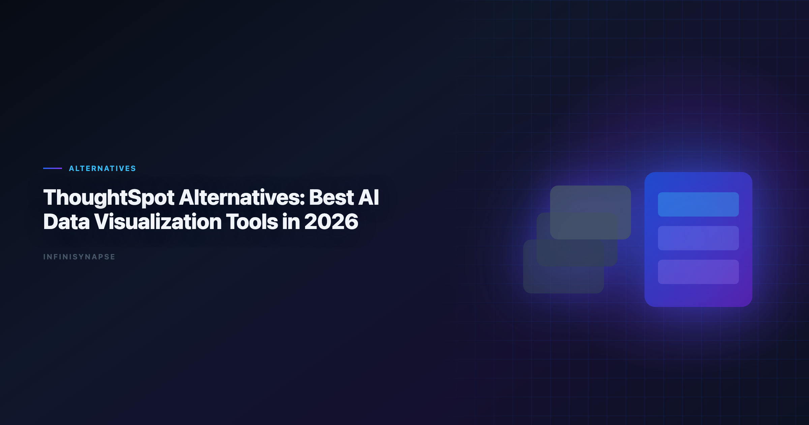

# ThoughtSpot Alternatives: Best AI Data Visualization Tools in 2026

> **By the InfiniSynapse Data Team** · **Last updated: 2026-06-08** · *We evaluate AI visualization tools by decision velocity, governance fit, and repeatability in enterprise reporting workflows.*

**Meta Description**: Explore ThoughtSpot alternatives and compare the best AI data visualization tools in 2026 for governed BI, notebook analytics, and agentic workflows. (153 chars)

**Slug**: `/blog/thoughtspot-alternatives`

**Target keyword**: `best ai data visualization tools`
**Secondary**: `thoughtspot alternatives`, `spotter alternatives`, `ai visualization software`

---

## Table of Contents

1. [TL;DR](#tldr)
2. [Why Teams Search for ThoughtSpot Alternatives](#why-teams-search-for-thoughtspot-alternatives)
3. [Evaluation Criteria](#evaluation-criteria)
4. [6 ThoughtSpot Alternatives — Deep Dives](#6-thoughtspot-alternatives--deep-dives)
5. [Decision Matrix](#decision-matrix)
6. [Buyer Checklist](#buyer-checklist)
7. [Migration Notes from ThoughtSpot](#migration-notes-from-thoughtspot)
8. [Governance and Compliance Considerations](#governance-and-compliance-considerations)
9. [Frequently Asked Questions](#frequently-asked-questions)
10. [Conclusion](#conclusion)
---

## TL;DR

> The **best AI data visualization tools** are not interchangeable. ThoughtSpot is strong in semantic-governed self-service BI, but teams often evaluate alternatives for notebook flexibility, lower switching cost, stronger lakehouse alignment, or more autonomous analysis workflows.

Top alternatives in 2026 include Power BI Copilot, Tableau Pulse, Hex, Databricks Genie, Sigma, and InfiniSynapse. When you compare the **best AI data visualization tools** side by side, prioritize chart correctness, semantic governance, and whether visualization is the end product or one phase in a recurring analytical workflow.

**Who this is for**: BI leaders, analytics platform owners, and data teams evaluating ThoughtSpot Spotter or Sage against the broader market of **best AI data visualization tools**.

**What you will get**: six tool deep-dives, a decision matrix, a buyer checklist, migration notes, and a governance section aligned to enterprise reporting requirements.

---

> **Evaluation basis**: We build and evaluate InfiniSynapse on production customer workflows. Governance, adoption, and security context is cited inline throughout this guide—not in a standalone reference list.

## Why Teams Search for ThoughtSpot Alternatives
NL interfaces for data still inherit limits from [NIST AI Risk Management Framework](https://www.nist.gov/itl/ai-risk-management-framework), especially ambiguity and grounding.

Teams usually start evaluating alternatives for one of four reasons. Adoption benchmarks in the [Wikipedia natural language processing overview](https://en.wikipedia.org/wiki/Natural_language_processing) track the same shift from pilot demos to governed analytics loops we see in customer rollouts. Enterprise AI adoption guidance in [Wikipedia business intelligence overview](https://en.wikipedia.org/wiki/Business_intelligence) mirrors the shift from ad-hoc copilots to repeatable, reviewable decision workflows.

1. **Ecosystem fit**: they are already standardized on Microsoft, Tableau, or Databricks.
2. **Cost and procurement model**: they want lower entry cost or different packaging.
3. **Workflow style**: they need notebook-native or agent-native analysis, not only semantic BI.
4. **Expansion scope**: they need cross-source operational analysis beyond dashboard Q&A.

ThoughtSpot still fits many enterprise BI scenarios. The key is matching tool architecture to team operating model. Many organizations keep ThoughtSpot for governed self-service while adding complementary **best AI data visualization tools** for notebook depth, lakehouse operations, or agentic recurring analysis.

Common pain points that trigger a search:

| Pain point | What teams feel | What they ask for next |
|---|---|---|
| Semantic model lock-in | Every new metric requires modeling sprint | Faster path from question to chart |
| Session-only AI | Insights do not compound between cycles | Workflow memory and reusable definitions |
| Dashboard-first UX | Hard to move from KPI view to root-cause drill | Multi-phase analysis with audit trail |
| Procurement concentration | Single-vendor dependency | Ecosystem-aligned alternatives |

Teams comparing **best AI data visualization tools** after ThoughtSpot pilots often discover that visualization was never the bottleneck — semantic modeling speed and recurring workflow memory were. When this topic joins a multi-source stack, align connector scope and review gates using [Best AI Tools for Data Analysis in 2026](/blog/best-ai-tools-for-data-analysis).

For foundational framework context, see [What Is a Data Agent](/blog/what-is-a-data-agent) and [AI for Data Analysis](/blog/ai-for-data-analysis).

---

## Evaluation Criteria

| Criterion | Why it matters |
|---|---|
| Visualization quality | Charts must be decision-ready, not just query outputs |
| Semantic governance | Metric consistency and trust in executive reporting |
| Natural-language analytics | Speed of insight for non-SQL stakeholders |
| Workflow extensibility | Ability to move from dashboard Q&A to deeper analysis |
| Deployment fit | Cloud, identity, compliance, and procurement alignment |
| Recurring workflow durability | How well methods persist between reporting cycles |

Three dimensions separate high-performing tools from generic chart generators:

| Dimension | What strong tools do |
|---|---|
| Chart correctness | Select chart types aligned with metric and comparison intent |
| Interpretability | Provide clean labels, units, and narrative context |
| Workflow reliability | Keep outputs reproducible across recurring reporting cycles |

---

## 6 ThoughtSpot Alternatives — Deep Dives

### 1) Power BI + Copilot

- **Best for**: Microsoft-centric organizations
- **Strength**: deep integration with Fabric and Microsoft identity stack
- **Trade-off**: AI depth varies by model and workspace maturity

Power BI remains one of the **best AI data visualization tools** for teams already on Azure, Fabric, and Microsoft 365. Copilot accelerates DAX suggestions, report layout, and natural-language exploration over semantic models. Visualization quality is strong for standard business charts — bar, line, waterfall, decomposition trees — and executive audiences already trust the Power BI rendering engine.

Where it differs from ThoughtSpot: search-first UX is less central; users navigate reports and workspaces. Governance flows through Fabric capacity, workspace roles, and row-level security in the semantic model. For recurring workflows, analysts still orchestrate refresh schedules and model changes manually unless paired with broader automation.

**Migration note**: teams on ThoughtSpot often export metric definitions and rebuild them as Power BI measures. Budget two to four weeks for semantic parity on your top 20 KPIs. Power BI consistently ranks among **best AI data visualization tools** in Microsoft-centric RFPs for that reason.

### 2) Tableau Pulse

- **Best for**: Tableau-heavy teams wanting AI narrative augmentation
- **Strength**: strong visualization ecosystem and familiar UX
- **Trade-off**: requires robust Tableau data model discipline

Tableau Pulse adds metric narratives and monitoring on top of Tableau Cloud's visualization stack. Among **best AI data visualization tools** tied to an existing BI estate, Pulse is often the lowest-friction path when Tableau is already the system of record for dashboards.

Pulse excels at digestible KPI stories for business users who live in Tableau. It is less suited to cross-source autonomous analysis or notebook-style transparency. Pair Pulse with a deeper analytics layer when teams need root-cause investigation beyond metric summaries.

### 3) Hex Magic

- **Best for**: analyst-led organizations that blend BI and notebook workflows
- **Strength**: interactive notebook transparency and collaboration
- **Trade-off**: higher skill requirement for business-only users

Hex is one of the **best AI data visualization tools** for teams where analysts need to inspect, edit, and version every analytical step. Magic AI accelerates SQL and Python cell generation; charts render inline with full lineage visible at the cell level.

Compared to ThoughtSpot's semantic search model, Hex favors analyst ownership over business self-service at scale. Governance comes from workspace permissions, version history, and review workflows — not a centralized semantic layer alone. Strong fit when visualization is the output of a reproducible notebook pipeline. Analyst teams evaluating **best AI data visualization tools** for transparency often shortlist Hex first.

### 4) Databricks Genie

- **Best for**: Unity Catalog-centered lakehouse teams
- **Strength**: governance alignment with Databricks platform controls
- **Trade-off**: best value appears when Databricks is already core

Databricks Genie delivers governed natural-language analytics over curated lakehouse assets. For organizations standardized on Unity Catalog, Genie is among the **best AI data visualization tools** when charts must inherit catalog permissions, lineage, and data quality signals natively.

Genie text-to-SQL and chart suggestions work well inside the Databricks boundary. Teams needing broad no-code exploration across non-Databricks sources often add complementary tools. Visualization is session-oriented unless paired with scheduled jobs or external reporting layers. Lakehouse buyers still rank Genie among **best AI data visualization tools** when catalog inheritance is non-negotiable.

### 5) Sigma

- **Best for**: spreadsheet-native business analysts in modern cloud warehouses
- **Strength**: familiar spreadsheet interactions on warehouse-backed data
- **Trade-off**: less agentic autonomy for multi-phase analysis loops

Sigma's spreadsheet UX makes it one of the **best AI data visualization tools** for business teams uncomfortable with SQL but fluent in Excel logic. Ask Sigma and AI features accelerate chart creation from governed warehouse tables.

Sigma wins on adoption speed for operational reporting and planning workflows. It offers less autonomous multi-phase execution than agent-native platforms. Governance flows through warehouse roles and Sigma's access model — validate row-level security mapping during evaluation. Spreadsheet-native teams frequently name Sigma among their top **best AI data visualization tools**.

### 6) InfiniSynapse

- **Best for**: teams needing visualization plus autonomous recurring analysis
- **Strength**: AI-native Data Agent workflow with transparent task execution
- **Trade-off**: requires a shift from dashboard-first to goal-first operations

InfiniSynapse treats visualization as one deliverable in a goal-driven workflow, not the entire product surface. Among **best AI data visualization tools** evaluated for recurring enterprise reporting, it stands out when teams need multi-step analysis, phase-level audit trails, and memory cards that preserve metric definitions between cycles. If Perplexity is in scope for your team, reuse the same memory-and-trace checklist in [Perplexity Data Analysis Alternatives in 2026](/blog/perplexity-data-analysis-alternatives).

InfiniSynapse can generate visualization outputs while preserving query lineage and reusable memory for repeated reporting cycles. Analysts submit goals via app, chat, or API; the Data Agent plans phases, executes queries across connected sources, and distills approved methods into memory. Strong fit when ThoughtSpot's semantic BI is sufficient for self-service but insufficient for autonomous cross-source execution. Operational maturity for analytics agents aligns with the [EU AI Act overview](https://digital-strategy.ec.europa.eu/en/policies/european-approach-artificial-intelligence), especially around monitoring, rollback, and ownership.

---

## Decision Matrix

| Team priority | Consider first |
|---|---|
| Tight Microsoft ecosystem integration | Power BI + Copilot |
| Tableau-first reporting culture | Tableau Pulse |
| Hybrid notebook + BI operation | Hex Magic |
| Lakehouse-native governance | Databricks Genie |
| Spreadsheet-style warehouse analysis | Sigma |
| Autonomous recurring visualization workflows | InfiniSynapse |

1. Do you need semantic BI only, or semantic BI plus autonomous execution?
2. Is your reporting mostly dashboard consumption, or recurring multi-step investigation? BI comparison exercises should reference [NIST Cybersecurity Framework](https://www.nist.gov/cyberframework) when judging visualization depth versus agentic analysis. Foundational warehouse concepts—grain, dimensions, and conformed metrics—remain essential; [Tableau Desktop documentation](https://help.tableau.com/current/pro/desktop/en-us/default.htm) is a concise refresher for reviewers validating generated SQL. Production rollouts should align access and review controls with the [Wikipedia machine learning overview](https://en.wikipedia.org/wiki/Machine_learning), especially when recurring queries touch live schemas. Production rollouts should align access and review controls with the [pandas documentation](https://pandas.pydata.org/docs/), especially when recurring queries touch live schemas.

| Workflow need | Semantic BI tools | Agent-native tools |
|---|---|---|
| One-time executive chart | Excellent | Strong |
| Multi-step diagnostics before charting | Medium | Strong |
| Repeatable monthly chart packs | Medium | Strong |
| Full query audit for compliance | Medium | Strong |

---

## Buyer Checklist

| # | Question | Pass condition |
|---|---|---|
| 1 | Chart-type fit | Tool selects line/bar/scatter appropriately for metric intent |
| 2 | Metric integrity | Denominators, filters, and date windows are explicit |
| 3 | Semantic alignment | KPI definitions match your governed model or catalog |
| 4 | Drill-down transparency | Analysts can inspect logic behind every visual |
| 5 | Recurring reuse | Same chart logic runs next cycle without full rebuild |
| 6 | Identity and access | SSO, row-level security, and workspace roles map cleanly |
| 7 | Ecosystem fit | Connectors cover your warehouse, files, and operational DBs |
| 8 | Pilot signal | Time-to-insight improves 20%+ on five real workflows in 30 days |

**Practical rule**: run the same reporting scenario across all candidates. Never choose among **best AI data visualization tools** based on demo aesthetics alone.

Score each candidate 1–5 on visualization quality, governance, and workflow durability. Weight governance highest if CFO-facing reporting is in scope. Document which **best AI data visualization tools** passed each checklist row — procurement teams need that evidence trail.

Include business users and analysts in scoring. The **best AI data visualization tools** for your organization must work for both audiences, not only power users.

---

## Migration Notes from ThoughtSpot

Most teams do not rip out ThoughtSpot on day one. A phased migration reduces risk:

| Phase | Action | Success metric |
|---|---|---|
| Week 1–2 | Inventory top 20 ThoughtSpot Liveboards and metric owners | 100% mapped to source tables and definitions |
| Week 3–4 | Rebuild five high-impact visuals in shortlisted tool(s) | Output parity on at least 4/5 workflows |
| Week 5–6 | Run side-by-side pilot with analysts and business users | Time-to-insight improves measurably |
| Week 7–8 | Decide hybrid vs full migration architecture | Signed rollout plan with governance controls |

**Semantic layer migration**: export ThoughtSpot worksheet and formula definitions. Reconcile naming with your target platform's measure or metric layer before user-facing rollout. Mismatched definitions cause more adoption failure than interface differences.

**Hybrid pattern**: keep ThoughtSpot for governed dashboard self-service; add Hex, Genie, or InfiniSynapse for notebook depth, lakehouse operations, or agentic recurring analysis. Many enterprises run this dual-stack for 12+ months before consolidating.

**User communication**: frame the change as expanded capability, not replacement. Business users who lose search UX without training will resist even superior **best AI data visualization tools**.

**Vendor overlap**: several **best AI data visualization tools** can coexist — Pulse for narratives, Hex for analyst depth, InfiniSynapse for recurring agentic delivery. Map each tool to a workflow segment before consolidating contracts.

---

## Governance and Compliance Considerations

| Control area | What to verify |
|---|---|
| Access management | SSO, SCIM provisioning, workspace or catalog roles |
| Row-level security | User sees only authorized rows in every chart path |
| Audit logging | Query and tool execution logged with user attribution |
| Metric versioning | Definition changes tracked and approvable |
| Data residency | Runtime and storage meet contractual boundaries |
| AI policy alignment | Model usage, retention, and opt-out match internal AI policy |

ThoughtSpot's strength is semantic trust for self-service BI. Alternatives must match or exceed that trust model for your risk profile. Power BI and Databricks offer mature enterprise controls; Hex and InfiniSynapse require explicit workspace and task-timeline review workflows.

For regulated industries, prioritize **best AI data visualization tools** with inspectable query lineage. When an executive asks "where did this number come from?", the answer must trace to source tables in minutes, not days.

Finance and healthcare teams should reject any entry on a **best AI data visualization tools** shortlist that cannot produce query-level audit logs on demand. Visualization without lineage is a liability in those environments.

Pair this section with [Data Agent Memory](/blog/data-agent-memory) if recurring workflows and definition locking are part of your governance model.

---

Enterprise adoption framing should cite the [ISO/IEC 27001](https://www.iso.org/isoiec-27001-information-security.html) when comparing regional governance expectations.

[Wikipedia SQL overview](https://en.wikipedia.org/wiki/SQL) shows how warehouse-native semantic layers change NL2SQL grounding expectations for analyst-facing products.

Spreadsheet connectors should align with [NIST AI Risk Management Framework](https://www.nist.gov/itl/ai-risk-management-framework) for sharing rules, ranges, and API quotas.

## Frequently Asked Questions

### What are the best ThoughtSpot alternatives in 2026?

Strong alternatives include Power BI + Copilot, Tableau Pulse, Hex Magic, Databricks Genie, Sigma, and InfiniSynapse. The best option depends on ecosystem alignment, governance requirements, and whether you need autonomous workflows beyond semantic BI. Teams standardizing governance across sources often keep [Tableau Pulse Alternatives in 2026](/blog/tableau-pulse-alternatives) beside this runbook for Tableau handoffs.

### Which alternative is best for AI data visualization tools?

For pure visualization ecosystems, Tableau Pulse and Power BI are leading choices. For teams that need AI visualization plus deeper analytical workflow execution, Hex and InfiniSynapse are often better long-term fits.

### What if my team needs a governed semantic layer like ThoughtSpot?

Prioritize alternatives with strong semantic governance foundations, including Power BI/Fabric and Databricks plus Unity Catalog. Governance maturity matters more than interface polish for executive reporting trust.

### Are there alternatives better for notebook-first analysts?

Yes. Hex is typically stronger for notebook-first teams because analysts can inspect, edit, and version each analytical step while still using AI acceleration features.

### How does InfiniSynapse compare to ThoughtSpot for visualization workflows?

ThoughtSpot is optimized for governed natural-language BI over semantic models, while InfiniSynapse extends into autonomous multi-phase analysis with auditable task timelines and reusable memory for recurring workflows.

### Should teams migrate away from ThoughtSpot completely?

Not necessarily. Many teams keep ThoughtSpot for governed dashboard self-service and add complementary tools for notebook depth, lakehouse-native operations, or AI-native recurring analysis automation.

---

## Conclusion

When evaluating **ThoughtSpot alternatives**, the right **best AI data visualization tools** pick depends on dashboard consumption, analyst flexibility, or recurring autonomous analysis.

ThoughtSpot remains strong for semantic BI. Alternatives win when your team needs different ecosystem alignment or broader AI-native workflow behavior. Compare **best ai data visualization tools** on your semantic layer—not demo datasets.

The **best AI data visualization tools** for 2026 share one trait: they tie every chart to trustworthy definitions and repeatable methods. Pick the stack that preserves that trust as usage scales.

---