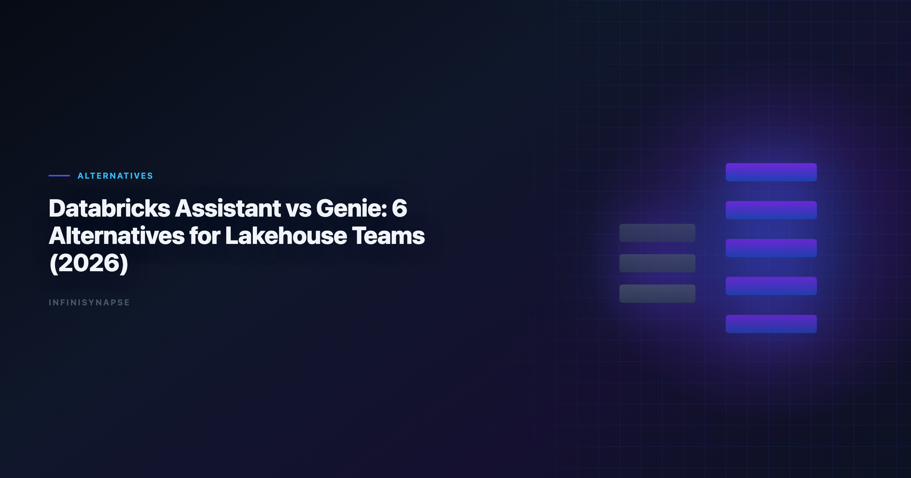

# Databricks Assistant vs Genie: 6 Alternatives for Lakehouse Teams (2026)

> **By the InfiniSynapse Data Team** · **Last updated: 2026-06-08** · *We evaluate lakehouse AI analytics tools for teams balancing catalog governance, analyst speed, and recurring operational workflows.*

**Meta Description**: Compare Databricks Assistant vs Genie and evaluate 6 Genie alternatives for lakehouse teams that need governance, autonomy, and recurring workflow control. (157 chars)

**Slug**: `/blog/databricks-genie-alternatives`

**Target keyword**: `databricks assistant vs genie`
**Secondary**: `databricks genie alternatives`, `lakehouse ai analytics tools`, `genie competitors`

---

## Table of Contents

1. [TL;DR](#tldr)
3. [Why Teams Evaluate Genie Alternatives](#why-teams-evaluate-genie-alternatives)
4. [6 Databricks Genie Alternatives — Deep Dives](#6-databricks-genie-alternatives-deep-dives)
5. [Selection Matrix](#selection-matrix)
6. [Buyer Checklist](#buyer-checklist)
7. [Migration Notes from Genie](#migration-notes-from-genie)
8. [Governance and Compliance Considerations](#governance-and-compliance-considerations)
9. [Security, Compliance, and Enterprise Deployment](#security-compliance-and-enterprise-deployment)
10. [Cost and Staffing Implications](#cost-and-staffing-implications)
11. [Common Mistakes in Stack Decisions](#common-mistakes-in-stack-decisions)
12. [When to Revisit the Decision](#when-to-revisit-the-decision)
13. [Operational Readiness Notes](#operational-readiness-notes)
14. [Frequently Asked Questions](#frequently-asked-questions)
15. [Conclusion](#conclusion)
---

## TL;DR

> The **databricks assistant vs genie** decision is internal to Databricks workflow style: Assistant helps build and edit artifacts, while Genie is optimized for governed natural-language analytics over curated data assets. Teams evaluate alternatives when they need stronger cross-platform coverage, different semantic workflows, or more autonomous recurring analysis.

Top alternatives in 2026 include ThoughtSpot Spotter, Hex Magic, Sigma, Power BI Copilot, Snowflake Cortex Analyst, and InfiniSynapse. Before comparing external tools, clarify your **databricks assistant vs genie** boundary — build-time productivity versus governed conversational Q&A — so procurement does not conflate two different jobs.

**Who this is for**: lakehouse platform owners, analytics leaders, and data engineers standardizing on Unity Catalog who need a clear **databricks assistant vs genie** operating model plus external options when platform-native features hit limits.

---

> **Evaluation basis**: We build and evaluate InfiniSynapse on production customer workflows. Governance, adoption, and security context is cited inline throughout this guide—not in a standalone reference list.

## Databricks Assistant vs Genie
API-backed connectors should account for [Wikipedia machine learning overview](https://en.wikipedia.org/wiki/Machine_learning) risks when agents call live production endpoints.

Semantic alignment work should reference [Wikipedia machine learning overview](https://en.wikipedia.org/wiki/Machine_learning) before agents encode business metrics.

Observability for agentic analytics should follow [Wikipedia machine learning overview](https://en.wikipedia.org/wiki/Machine_learning) so query chains remain traceable in production.

Although both are AI features in Databricks, they solve different jobs. The **databricks assistant vs genie** comparison starts with task type, not feature list:

| Product | Primary role | Best use case |
|---|---|---|
| Databricks Assistant | Build assistant for notebooks, SQL, and code workflows | Analyst/engineer productivity in development loops |
| Databricks Genie | Conversational analytics interface over governed datasets | Business and analyst Q&A in a curated lakehouse context |

In short:

- **Assistant** accelerates artifact creation.
- **Genie** accelerates question-to-answer over governed assets.

Many teams use both, then add external tools when requirements exceed platform-native boundaries. A common mistake in **databricks assistant vs genie** evaluations is expecting Genie to replace notebook development assistance — or expecting Assistant to deliver governed business self-service at scale.

### When Assistant wins

Use Assistant when engineers and analysts need inline help generating SQL, refactoring PySpark, explaining error traces, or drafting documentation inside notebooks. The **databricks assistant vs genie** split matters here: Assistant lives in the build loop, not the consumption loop.

### When Genie wins

Use Genie when business stakeholders and analysts ask natural-language questions over curated tables with Unity Catalog permissions enforced. Genie inherits catalog lineage and access controls — a core reason teams resolve **databricks assistant vs genie** in favor of Genie for CFO-facing KPI exploration.

### When neither is enough

Teams extend beyond the **databricks assistant vs genie** pair when workloads require cross-platform orchestration, durable workflow memory across months, or autonomous multi-phase execution that survives analyst turnover. That is when Genie alternatives enter the evaluation.

---

## Why Teams Evaluate Genie Alternatives

1. **Multi-platform analytics** across non-Databricks systems.
2. **Different consumption modes** (notebook-first, dashboard-first, or agent-first).
3. **Recurring workflow automation** beyond conversational sessions.
4. **Procurement strategy** that avoids single-platform concentration.

Alternatives are not always replacements; they are often complements by workflow segment. Even teams with a clear **databricks assistant vs genie** split add external tools when Genie sessions do not compound into reusable methods.

| Trigger | Platform-native gap | What teams add |
|---|---|---|
| Cross-source reporting | Genie scoped to curated lakehouse assets | Agent or BI layer with federated connectors |
| Recurring monthly close | Session Q&A restarts each cycle | Tools with workflow memory |
| Notebook transparency | Genie less suited to cell-level editing | Hex or Assistant-heavy notebook workflows |
| Microsoft estate alignment | Databricks not primary BI surface | Power BI Copilot |

---

## 6 Databricks Genie Alternatives — Deep Dives

### 1) ThoughtSpot Spotter

- **Best for**: semantic-layer governed BI at enterprise scale
- **Strength**: strong trust model for business self-service
- **Trade-off**: modeling and rollout overhead

ThoughtSpot Spotter delivers search-first natural-language analytics over governed semantic models. For teams comparing **databricks assistant vs genie** against external BI, Spotter is the semantic-layer counterpart to Genie's catalog-governed Q&A — but outside the Databricks UX.

Spotter excels when executive stakeholders need trusted KPI exploration without notebook exposure. Rollout requires semantic modeling discipline similar to Genie curation. Less ideal for cross-source agentic execution or notebook-native analyst workflows. The credential, preflight, and SQL-trace pattern above also applies to Excel—see [Best AI Tools for Excel Data Analysis in 2026](/blog/ai-excel-data-analysis-tools) for source-specific steps.

### 2) Hex Magic

- **Best for**: analyst-owned notebook workflows in warehouse environments
- **Strength**: editable transparency with AI acceleration
- **Trade-off**: requires analyst capability in SQL/Python contexts

Hex complements the **databricks assistant vs genie** pair on the analyst side: where Assistant accelerates cell authoring inside Databricks, Hex offers a collaborative notebook surface with Magic AI across warehouse-connected projects.

Strong fit when analysts need inspectable, versioned pipelines with inline charts. Business-only users may find Hex steeper than Genie. Governance flows through workspace permissions and review workflows.

### 3) Sigma

- **Best for**: spreadsheet-like analytics on cloud data platforms
- **Strength**: familiar UX for business teams
- **Trade-off**: less autonomous multi-phase execution

Sigma targets spreadsheet-native business analysts querying cloud warehouses with governed access. In **databricks assistant vs genie** evaluations, Sigma often wins the business-user cohort that prefers grid UX over conversational or notebook interfaces.

Ask Sigma and AI features accelerate chart creation from warehouse tables. Validate row-level security mapping when connecting to lakehouse exports or replicated datasets.

### 4) Power BI + Copilot

- **Best for**: Microsoft-centric data organizations
- **Strength**: integrated ecosystem and enterprise identity
- **Trade-off**: lakehouse parity depends on architecture choices

Power BI Copilot is a common Genie alternative for Microsoft-first estates. The **databricks assistant vs genie** question becomes a platform-boundary question: keep build loops in Databricks with Assistant, deliver executive visuals through Fabric and Power BI.

Semantic model quality determines Copilot output trust. Teams must reconcile Databricks metric definitions with Power BI measures during migration — similar discipline to Genie curation.

### 5) Snowflake Cortex Analyst

- **Best for**: Snowflake-native enterprises seeking NL analytics
- **Strength**: tight warehouse and governance coupling
- **Trade-off**: strongest value inside Snowflake-first estates

For organizations where Snowflake — not Databricks — is the analytics standard, Cortex Analyst mirrors Genie's governed NL Q&A pattern inside Snowflake's boundary. The **databricks assistant vs genie** framework still applies conceptually: build assistance versus governed consumption — but on Snowflake's platform.

Cross-platform teams running both Databricks and Snowflake may evaluate Cortex Analyst for the Snowflake cohort while keeping Genie for the lakehouse cohort.

### 6) InfiniSynapse

- **Best for**: cross-source recurring analysis with agentic execution
- **Strength**: Data Agent workflow with audit timeline and reusable memory
- **Trade-off**: requires operational shift from session Q&A to goal-first execution

InfiniSynapse addresses the gap left after **databricks assistant vs genie** planning: autonomous multi-phase analysis across connected sources with phase-level audit trails and memory cards for recurring workflows.

---

## Selection Matrix
Scripted analysis paths should follow [Wikipedia data quality overview](https://en.wikipedia.org/wiki/Data_quality) conventions for reproducibility and testable data utilities.

GCP deployments should follow the [Snowflake documentation](https://docs.snowflake.com/en/) for service boundaries and operational guardrails.

| Priority | First option to evaluate |
|---|---|
| Governed conversational BI | Databricks Genie, ThoughtSpot Spotter |
| Notebook + analyst workflow depth | Databricks Assistant, Hex Magic |
| Spreadsheet-style business analytics | Sigma |
| Microsoft ecosystem leverage | Power BI + Copilot |
| Snowflake-native NLP analytics | Snowflake Cortex Analyst |
| Autonomous recurring cross-source workflows | InfiniSynapse |

1. Is your requirement primarily conversational Q&A, or end-to-end recurring execution?
2. Is governance boundary platform-specific, or organization-wide across systems?

| Operating model | Platform-native choice | Typical complement |
|---|---|---|
| Build-heavy engineering | Assistant | Hex for external notebooks |
| Business KPI self-service | Genie | ThoughtSpot or Power BI |
| Recurring cross-source ops | Neither alone | InfiniSynapse |

---

## Buyer Checklist

| # | Question | Pass condition |
|---|---|---|
| 1 | Catalog alignment | Tool respects Unity Catalog or equivalent access model |
| 2 | NL query accuracy | Top 10 business questions return correct aggregates |
| 3 | Lineage visibility | Every answer traces to source tables |
| 4 | Cross-platform need | Federated sources covered without brittle ETL |
| 5 | Recurring reuse | Monthly workflows do not restart from zero |
| 6 | Identity integration | SSO and role mapping match enterprise IAM |
| 7 | Build vs consume split | **databricks assistant vs genie** roles documented per team |
| 8 | Pilot outcome | Measurable cycle-time reduction in 30 days |

Teams that skip the **databricks assistant vs genie** scoping step often buy Genie seats for engineers who needed Assistant — or deploy Assistant where business users needed governed Q&A.

Document which persona uses which surface before expanding to external **databricks genie alternatives**.

---

## Migration Notes from Genie

Phased migration reduces risk when adding or replacing Genie with external tools:

| Phase | Action | Success metric |
|---|---|---|
| Week 1–2 | Document top 20 Genie spaces, curated tables, and owners | 100% mapped to catalog assets |
| Week 3–4 | Rebuild five high-impact Q&A flows in shortlisted alternative | Answer parity on 4/5 workflows |
| Week 5–6 | Side-by-side pilot with business users and analysts | Time-to-insight improves measurably |
| Week 7–8 | Finalize hybrid architecture | Signed plan with **databricks assistant vs genie** roles intact |

**Hybrid pattern**: keep Genie for Databricks-governed conversational analytics; add Hex for notebook depth, ThoughtSpot for semantic BI, or InfiniSynapse for recurring cross-source automation. Most lakehouse teams run hybrid stacks for 12+ months.

**Assistant continuity**: do not migrate engineers off Assistant when changing Genie consumption tools. The **databricks assistant vs genie** split should survive any Genie alternative decision.

**Definition migration**: export approved metric definitions and sample questions from Genie spaces. Reconcile naming in the target platform before user-facing launch — definition drift causes more failure than interface change.

---

## Governance and Compliance Considerations

| Control area | What to verify |
|---|---|
| Unity Catalog inheritance | Alternative respects table- and column-level permissions |
| Query audit logs | NL queries logged with user attribution |
| Metric versioning | Definition changes tracked and approvable |
| AI model policy | Model usage and retention match internal AI governance |
| Cross-border data | Runtime meets residency requirements |
| Separation of duties | Build (Assistant) vs consume (Genie) roles enforce least privilege |

Genie's strength is governed Q&A inside catalog boundaries. External alternatives must match that trust model for your risk profile — or compensate with explicit audit timelines and approval workflows. Production rollouts should align access and review controls with the [Wikipedia SQL overview](https://en.wikipedia.org/wiki/SQL), especially when recurring queries touch live schemas. LLM-backed analytics should account for prompt-injection and data-exfiltration risks in the [EU AI Act overview](https://digital-strategy.ec.europa.eu/en/policies/european-approach-artificial-intelligence), especially when connectors expose production schemas. Spreadsheet-heavy preparation often mirrors [Google Vertex AI documentation](https://cloud.google.com/vertex-ai/docs) patterns for typing, joins, and reproducible transforms. EU-facing teams map control expectations using the [Google Research publications](https://research.google/pubs/) when scoping analytics agent governance. Scripted analysis paths should follow [Apache Kafka documentation](https://kafka.apache.org/documentation/) conventions for reproducibility and testable data utilities. Scripted analysis paths should follow [OWASP API Security Top 10](https://owasp.org/API-Security/) conventions for reproducibility and testable data utilities.

Regulated teams should reject alternatives that cannot reproduce Genie-level lineage on demand. The **databricks assistant vs genie** split also matters for compliance: Assistant-generated code requires review before production deployment; Genie answers require validation before executive distribution.

Pair governance planning with [Data Agent Memory](/blog/data-agent-memory) when recurring workflows and definition locking are in scope.

---

## Security, Compliance, and Enterprise Deployment

Evaluate data residency, access controls, and audit trails before standardizing on a tool category. Enterprise buyers should treat compliance evidence as a first-class selection criterion—not a late-stage checkbox.

**Cost and staffing implications.** Model license cost, analyst time saved, and platform engineering overhead together. The cheapest seat price rarely equals the lowest total cost when governance load is included.

## Common Mistakes in Stack Decisions

Teams often over-index on demo speed, under-specify recurring KPI ownership, or skip parallel-run validation. Document these failure modes before rollout.

## When to Revisit the Decision

Re-evaluate the stack when data sources, compliance scope, or recurring KPI volume shifts materially—typically every two quarters for growth-stage teams.

## Operating Databricks Genie alternatives in Production

Treat Databricks Genie alternatives as an operating capability, not a one-off task: confirm owners, metric definitions, and review gates for the first workflow before widening scope, because teams that log exceptions weekly compound accuracy faster than teams chasing new features. Capture the first reliable run as a reusable template — assumptions, checks, and reviewer sign-off in one playbook — so quality holds when data, schemas, or priorities change. Ground these controls in [Python documentation](https://docs.python.org/3/) and [Wikipedia machine learning overview](https://en.wikipedia.org/wiki/Machine_learning).

**What to review on a regular cadence.** Audit Databricks Genie alternatives monthly: compare rerun consistency, validation pass rate, and time-to-first-insight against baseline, retire stale definitions, and re-confirm access scopes so silent drift is caught before it reaches a stakeholder report.

## Communicating Results to Stakeholders

## Frequently Asked Questions

### What is the difference between Databricks Assistant and Genie?

Databricks Assistant is primarily a build-time helper for notebook, SQL, and development tasks, while Databricks Genie is a governed conversational analytics interface for asking business questions over curated data assets. Analysts wiring Sql into production reviews can follow the parallel walkthrough in [SQL Data Analysis Tools](/blog/sql-data-analysis-tools).

### What are the best Databricks Genie alternatives for lakehouse teams?

Top alternatives include ThoughtSpot Spotter, Hex Magic, Sigma, Power BI + Copilot, Snowflake Cortex Analyst, and InfiniSynapse. The best fit depends on governance model, platform stack, and desired workflow autonomy.

### Which alternatives work best outside Databricks environments?

ThoughtSpot, Hex, Sigma, Power BI, Snowflake Cortex Analyst, and InfiniSynapse can all work in non-Databricks contexts, but each has strongest fit in specific ecosystem assumptions and operating models.

### Can teams use Genie and another analytics tool together?

Yes. Many teams keep Genie for Databricks-governed conversational analytics and add complementary tools for notebook depth, cross-platform reporting, or recurring workflow automation.

### How does InfiniSynapse compare for cross-source lakehouse analysis?

InfiniSynapse emphasizes autonomous multi-phase analysis across connected sources with auditable timelines and reusable memory, making it well-suited for recurring workflows that span lakehouse and non-lakehouse systems. If this topic is in scope for your team, reuse the same memory-and-trace checklist in [Best AI Tools for Data Analysis in 2026](/blog/best-ai-tools-for-data-analysis).

**When should a team move beyond Genie?.** Consider extending beyond Genie when workloads require cross-platform orchestration, stronger recurring workflow memory, or operating models where analysts need end-to-end autonomous execution rather than session-based Q&A.

---

## Conclusion

For **databricks assistant vs genie** decisions, start by clarifying task type: build assistance, governed Q&A, or recurring autonomous analysis. The **databricks assistant vs genie** boundary should be documented before any Genie alternative procurement.

Genie is strong inside a Databricks-governed context. Alternatives become important when teams need broader ecosystem coverage, different operating styles, or durable recurring workflows. Use the buyer checklist, migration notes, and governance criteria to move from platform-native defaults to a deliberate multi-tool architecture.

---