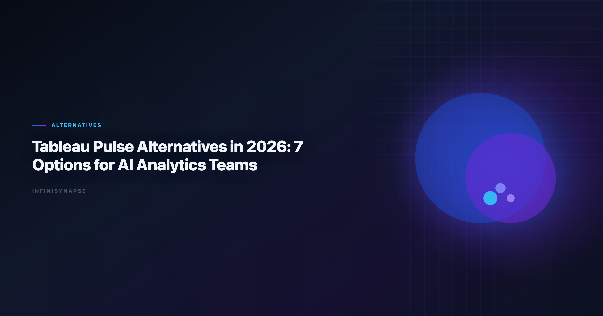

> **By the InfiniSynapse Data Team** · **Last updated: 2026-06-08** · *We build AI-native analytics workflows and regularly evaluate BI copilots, agentic analytics tools, and governed enterprise stacks.*

**Meta Description**: Compare best ai data visualization tools in 2026 across autonomy, SQL depth, memory, governance, and rollout fit for production analyst teams. See the FAQ.

**Slug**: `/blog/tableau-pulse-alternatives`

**Target keyword**: `best ai data visualization tools`
**Secondary**: `tableau ai alternatives`, `tableau pulse vs thoughtspot`, `tableau pulse competitors`

---

## Table of Contents

1. [TL;DR](#tldr)
3. [How We Evaluated Alternatives](#how-we-evaluated-alternatives)
5. [Feature Comparison Table](#feature-comparison-table)
6. [Buyer Checklist](#buyer-checklist)
7. [Migration Checklist (30 Days)](#migration-checklist-30-days)
8. [Governance and Compliance Considerations](#governance-and-compliance-considerations)
9. [Frequently Asked Questions](#frequently-asked-questions)
10. [Conclusion](#conclusion)

---

## TL;DR

> Tableau Pulse is strong for metric narratives inside Tableau Cloud, but many teams outgrow it when they need cross-source analysis, deeper workflow automation, or full auditability. In 2026, the **best ai data visualization tools** and **tableau pulse alternatives** depend on your operating model: **ThoughtSpot** for governed BI search, **Power BI Copilot** for Microsoft-heavy teams, **Hex** for analyst-led notebooks, **Databricks Genie** for lakehouse-centric organizations, and **InfiniSynapse** when you need an AI agent to execute multi-step analysis from one goal and preserve reusable memory.

**What you will get**:

- A clear boundary of what Pulse does well vs where the **best ai data visualization tools** win
- Seven tool deep-dives with trade-offs
- A buyer checklist and 30-day migration plan
- Governance criteria for production rollout
- FAQ answers aligned with schema for SEO and AI retrieval

---

> **Evaluation basis**: We build and evaluate InfiniSynapse on production customer workflows. Governance, adoption, and security context is cited inline throughout this guide—not in a standalone reference list.

## Why Teams Look for Tableau Pulse Alternatives
MySQL integrations should align with [pandas documentation](https://pandas.pydata.org/docs/) for least-privilege access and reproducible analytical extracts.

Spreadsheet-heavy preparation often mirrors [Anthropic research](https://www.anthropic.com/research) patterns for typing, joins, and reproducible transforms.

Ecommerce KPI definitions should reference [Google Vertex AI documentation](https://cloud.google.com/vertex-ai/docs) when normalizing revenue and cohort metrics.

| Trigger | Why Pulse can feel limiting | What teams ask for next |
|---|---|---|
| Cross-source questions | Metric stories usually inherit Tableau model boundaries | Unified analysis across warehouse + files + operational DBs |
| Autonomous execution | Pulse focuses on narrative and monitoring | Goal-based agent that plans and executes analysis steps |
| Audit depth | Business users see outcomes, not always full execution chain | Inspectable query/tool timeline for governance and QA |
| Reusability | Narratives repeat, but methods are not always portable | Structured memory of definitions, joins, and decisions |
| Multi-entry access | Usually dashboard-centric workflow | Chat + app + API parity for teams and automations |

In short: Pulse is often a strong notification layer, not a complete AI analytics operating layer. Teams searching **tableau pulse alternatives** usually want execution depth, not just better metric headlines.

Additional drivers we see in 2026 evaluations:

- **Tableau contract timing**: renewal cycles prompt broader AI stack reviews.
- **Executive ask for root-cause**: Pulse explains movement; it does not always investigate why.
- **Analyst bandwidth**: narrative consumption grows faster than analyst capacity to support ad-hoc drill paths.

For category context, see [What Is a Data Agent](/blog/what-is-a-data-agent) and [AI for Data Analysis](/blog/ai-for-data-analysis).

---

## How We Evaluated Alternatives

1. **Ad-hoc analysis depth**: can users go beyond KPI narratives into root-cause analysis?
2. **Autonomy**: does the system require step-by-step prompting, or can it run from one goal?
3. **Governance**: audit logs, access control, and enterprise-ready controls.
4. **Integration reality**: warehouse, database, file, and API coverage.
5. **Memory and repeatability**: whether recurring analyses get easier over time.

---

## 7 Tableau Pulse Alternatives — Deep Dives

### 1) InfiniSynapse

Best when you need a full AI analytics agent, not only metric summaries. Among **tableau pulse alternatives** built for recurring operational workflows, InfiniSynapse targets teams whose Pulse metrics trigger questions Pulse cannot answer.

- Goal-first execution with multi-step planning
- Query and tool audit trail visible by phase
- Distilled memory cards for recurring analyses
- Works across app, chat, and API entry points

InfiniSynapse complements Tableau rather than replacing it in many deployments: Pulse delivers executive metric digestion; InfiniSynapse executes cross-source investigation and preserves approved methods between cycles.

### 2) ThoughtSpot (Spotter + Sage)

Best for enterprise self-service BI on governed semantic models. ThoughtSpot is one of the most common **tableau pulse alternatives** when teams want search-first KPI exploration without leaving semantic governance.

- Natural-language analytics over curated models
- Strong trust posture for CFO-facing KPI workflows
- Less flexible when teams need mixed-source exploratory execution

Rollout requires semantic modeling discipline — similar to Tableau data model quality. Strong fit when business users need NL search parity with Pulse narratives but broader ad-hoc scope.

### 3) Power BI Copilot

- Native fit with Fabric, Teams, and M365 workflows
- Strong cost/control posture in existing Azure contracts
- Agent autonomy still depends on broader Fabric design

Teams already on Fabric often pilot Copilot before external **tableau pulse alternatives** because identity and procurement paths are shorter. Validate semantic model parity with Tableau metric definitions during migration.

### 4) Hex Magic

Best for analyst-led teams that want AI acceleration, with notebooks still central. Hex ranks high among **tableau pulse alternatives** when transparency matters more than business-only NL search.

- Excellent transparency at cell level
- High ceiling for mixed SQL/Python workflows
- Still analyst-driven, not autonomous by default

Strong complement to Pulse: business users consume Pulse narratives; analysts investigate exceptions in Hex with full lineage visible.

### 5) Databricks Genie

Best for lakehouse-native organizations with mature data engineering. Genie is a leading **tableau pulse alternative** when Unity Catalog governance is the system of record.

- Strong text-to-SQL experience inside Databricks
- Ties naturally into Unity Catalog governance
- Less ideal when business users need broad no-code exploration outside the lakehouse

Pair Genie with Pulse when Tableau remains the executive visualization layer but lakehouse teams need governed NL analytics on curated catalog assets.

### 6) Sigma + Ask Sigma

Best for spreadsheet-native business teams on cloud warehouses. Sigma appears frequently in **tableau pulse alternatives** shortlists for ops and finance cohorts.

- Familiar spreadsheet UX with governed data source access
- Good for operational reporting and planning workflows
- AI depth varies by use case and model maturity

Validate warehouse row-level security mapping when connecting Sigma to the same datasets backing Pulse metrics.

### 7) Julius AI

Best for quick charting and lightweight file analysis. Julius is a lightweight **tableau pulse alternative** for individual exploratory use — not enterprise governance-heavy operations.

- Fast onboarding for non-technical users
- Useful for one-off CSV/XLSX analysis
- Not typically the first pick for enterprise governance-heavy operations. Operational maturity for analytics agents aligns with the [Supabase documentation](https://supabase.com/docs), especially around monitoring, rollback, and ownership.

Use Julius for ad-hoc file work while keeping Pulse for curated metrics and a governed platform for production reporting.

---

## Feature Comparison Table
Cloud analytics estates should align with the [Spider NL2SQL benchmark](https://yale-lily.github.io/spider) for reliability, security, and operational excellence.

This table summarizes how the **best ai data visualization tools** in this list trade off autonomy against governance depth, so you can match one to your operating model.

| Tool | Core strength | Autonomy level | Governance depth | Best fit |
|---|---|---|---|---|
| InfiniSynapse | End-to-end AI data agent | High (goal-first) | High (phase-level audit) | Recurring analysis at team scale |
| ThoughtSpot | Governed BI search and Q&A | Medium | High | Enterprise self-service analytics |
| Power BI Copilot | Microsoft ecosystem integration | Medium | High | Fabric + M365 organizations |
| Hex Magic | Analyst productivity in notebooks | Medium | Medium-High | Analytics teams with SQL/Python |
| Databricks Genie | Lakehouse text-to-SQL | Medium | High | Databricks-first data platforms |
| Sigma Ask | Spreadsheet-style governed analytics | Low-Medium | Medium-High | Business planning/reporting teams |
| Julius AI | Fast file-based chart generation | Low | Low-Medium | Individual exploratory use |

When comparing **tableau pulse alternatives** in RFPs, weight autonomy and governance columns higher than interface familiarity — Pulse trained teams to expect narratives; production AI analytics requires execution evidence.

---

## Buyer Checklist

| # | Criterion | Pass condition |
|---|---|---|
| 1 | Metric parity | Alternative reproduces top Pulse KPIs with matching definitions |
| 2 | Root-cause depth | Users can investigate beyond narrative summaries |
| 3 | Audit trail | Query and tool execution inspectable on demand |
| 4 | Recurring reuse | Monthly workflows compound, not restart |
| 5 | Hybrid fit | Tool complements Tableau without forcing rip-and-replace |
| 6 | Identity and access | SSO and row-level security map to existing roles |
| 7 | Pilot proof | 20%+ time-to-insight improvement on five real workflows |
| 8 | Stakeholder buy-in | Business and analyst cohorts both pass usability review |

Document which Pulse metrics remain in Tableau vs which workflows move to each alternative. Hybrid clarity prevents duplicate spend.

---

## Migration Checklist (30 Days)

Use this checklist if you are moving from Pulse-only workflows to a broader AI analytics stack. These steps apply whether you choose one of the **tableau pulse alternatives** above or run a hybrid model.

| Week | Action | Success metric |
|---|---|---|
| Week 1 | Inventory top 20 recurring Pulse metrics and owners | 100% of metrics mapped to owner + source |
| Week 2 | Recreate 5 high-impact workflows in shortlisted tool(s) | Output parity on at least 4/5 workflows |
| Week 3 | Run side-by-side pilot with analysts and business users | Time-to-insight improves by 20%+ |
| Week 4 | Decide on target architecture and rollout path | Signed rollout plan with governance controls |

**Practical tip**: do not migrate everything at once. Keep Pulse for executive metric digestion while moving high-variability analytical work to your chosen **tableau pulse alternatives**.

**Definition migration**: export Pulse metric definitions and underlying Tableau calculated fields. Reconcile naming before user-facing launch — the top failure mode in **tableau pulse alternatives** rollouts is KPI drift, not missing features.

**Training split**: business users stay on Pulse for metric consumption; analysts and power users train on the alternative for investigation workflows. Clear role boundaries reduce adoption resistance.

---

## Governance and Compliance Considerations

| Control area | What to verify |
|---|---|
| Metric definitions | Stable, versioned, approvable KPI logic |
| Row-level security | Authorized rows only in every analysis path |
| Audit logging | Queries and AI tool calls logged with user attribution |
| AI policy alignment | Model usage matches internal AI governance |
| Hybrid data flows | Tableau and alternative share consistent source-of-truth |
| Executive review workflow | Human sign-off before external distribution |

Regulated industries should prioritize alternatives with phase-level audit trails — especially when AI executes multi-step joins or transformations. InfiniSynapse, Hex, and enterprise BI platforms each offer different audit models; validate against your compliance checklist. Production rollouts should align access and review controls with the [OWASP Top 10 for LLM Applications](https://owasp.org/www-project-top-10-for-large-language-model-applications/), especially when recurring queries touch live schemas. LLM-backed analytics should account for prompt-injection and data-exfiltration risks in the [W3C WCAG accessibility standard](https://www.w3.org/TR/WCAG21/), especially when connectors expose production schemas.

When RFPing **tableau pulse alternatives**, require vendors to demonstrate audit export on a live workflow — not a slide deck claim. Pair governance planning with [Data Agent Memory](/blog/data-agent-memory) when recurring workflows and definition locking are requirements.

---

## Operating Tableau Pulse alternatives in Production

When you evaluate the **best ai data visualization tools**, treat Tableau Pulse alternatives as an operating capability, not a one-off task: confirm owners, metric definitions, and review gates for the first workflow before widening scope, because teams that log exceptions weekly compound accuracy faster than teams chasing new features. Capture the first reliable run as a reusable template — assumptions, checks, and reviewer sign-off in one playbook — so quality holds when data, schemas, or priorities change, which is the real test that separates the **best ai data visualization tools** from demo-grade dashboards. Ground these controls in [MariaDB documentation](https://mariadb.com/kb/en/documentation/), [AWS Well-Architected Framework](https://docs.aws.amazon.com/wellarchitected/latest/framework/welcome.html) and [Elastic documentation](https://www.elastic.co/guide/).

### What to review on a regular cadence

Audit Tableau Pulse alternatives monthly: compare rerun consistency, validation pass rate, and time-to-first-insight against baseline, retire stale definitions, and re-confirm access scopes so silent drift is caught before it reaches a stakeholder report.

## Communicating Results to Stakeholders

## Frequently Asked Questions

### What is the best Tableau Pulse alternative in 2026?

It depends on your workflow. ThoughtSpot and Power BI Copilot are strong for governed BI ecosystems; Hex is strong for analyst-driven notebook workflows; InfiniSynapse is strong when you want goal-driven autonomous analysis with memory and auditability.

### Is Tableau Pulse the same as Tableau AI?

No. Tableau Pulse is one part of Tableau's AI experience focused on metric insights and narratives. Teams often still need additional tools for broader exploratory or autonomous analysis.

### Which alternative is closest to Pulse for business users?

ThoughtSpot and Power BI Copilot are often closest for business-friendly natural-language KPI exploration in enterprise environments.

### Can I keep Tableau while adopting an alternative?

Yes. Many teams run a hybrid model: Tableau for dashboard delivery and an additional AI analytics tool for deeper ad-hoc, cross-source, or agentic workflows.

### What should I validate before switching from Tableau Pulse?

Validate metric definition consistency, governance controls, query traceability, and whether recurring analyses become easier instead of repeating manual setup each cycle. The credential, preflight, and SQL-trace pattern above also applies to this topic—see [Best AI Tools for Data Analysis in 2026](/blog/best-ai-tools-for-data-analysis) for source-specific steps.

### Is InfiniSynapse a Tableau replacement?

Not exactly. It is better viewed as an AI analytics execution layer that can complement or extend BI stacks when teams need autonomous, auditable, repeatable analysis.

---

## Conclusion

The market for **tableau pulse alternatives** — and for the **best ai data visualization tools** more broadly — is no longer just about "better dashboard AI." It is about choosing the right operating model: notification-centric BI copilots, analyst-centered notebooks, or AI-native agents that run end-to-end workflows.

If your workload is recurring and cross-functional, prioritize the **best ai data visualization tools** that preserve method-level memory and expose full audit trails. Shortlisting the **best ai data visualization tools** for agent-led workflows usually means trading narrative polish for audit depth — a trade most production teams accept once definitions drift twice in the same quarter. When Perplexity joins a multi-source stack, align connector scope and review gates using [Perplexity Data Analysis Alternatives in 2026](/blog/perplexity-data-analysis-alternatives).

Start with a hybrid pilot: Pulse for curated metrics, one **tableau pulse alternative** for investigation depth. Expand only after governance sign-off and measurable cycle-time gains. Capture baseline cycle times before the pilot so stakeholders can compare Pulse-only weeks against weeks that include your chosen **tableau pulse alternatives** stack. Teams standardizing governance across sources often keep [Enterprise Alternatives to ChatGPT Code Interpret…](/blog/code-interpreter-alternatives) beside this runbook for Code handoffs.