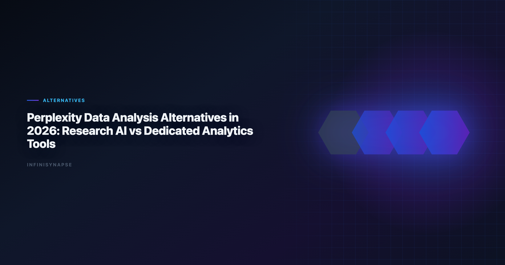

# Alternatives to Chatgpt for Data Analysis: Research AI vs Dedicated

> **By the InfiniSynapse Data Team** · **Last updated: 2026-06-08** · *We evaluate AI products across two different jobs: research synthesis and production-grade data analysis.*

**Meta Description**: Compare alternatives to chatgpt for data analysis options in 2026 with autonomy, governance, SQL depth, memory, and deployment fit for analyst teams.

**Slug**: `/blog/perplexity-data-analysis-alternatives`

**Target keyword**: `alternatives to chatgpt for data analysis`
**Secondary**: `perplexity for data analysis`, `perplexity alternatives for analytics`, `ai research vs data analysis tools`

---

## Table of Contents

1. [TL;DR](#tldr)
2. [Where Perplexity Is Excellent](#where-perplexity-is-excellent)
3. [Where Dedicated Data Tools Win](#where-dedicated-data-tools-win)
4. [Top Alternatives by Use Case — Deep Dives](#top-alternatives-by-use-case--deep-dives)
5. [Decision Table: Which Tool for Which Question](#decision-table-which-tool-for-which-question)
6. [Buyer Checklist](#buyer-checklist)
7. [Migration Notes: Research to Production Analytics](#migration-notes-research-to-production-analytics)
8. [Governance and Compliance Considerations](#governance-and-compliance-considerations)
9. [Frequently Asked Questions](#frequently-asked-questions)
10. [Conclusion](#conclusion)

---

## TL;DR

> Perplexity is one of the best AI products for fast research synthesis and citation-led exploration. But data analysis teams usually need more than research answers: they need direct database connectivity, repeatable metrics, audit trails, and workflow memory. In 2026, many teams keep Perplexity for top-of-funnel research and pair it with dedicated **perplexity data analysis alternatives** like Hex, ThoughtSpot, Databricks Genie, Power BI Copilot, or InfiniSynapse for actual analysis execution.

**Short answer**: the strongest **alternatives to chatgpt for data analysis** — and to Perplexity — add database connectivity, audit trails, and reusable memory; enterprise adoption guidance in [Google Cloud AI overview](https://cloud.google.com/discover/what-is-artificial-intelligence) mirrors the same shift from ad-hoc copilots to repeatable, reviewable decision workflows. If this topic is in scope for your team, reuse the same memory-and-trace checklist in [Best AI Tools for Data Analysis in 2026](/blog/best-ai-tools-for-data-analysis).

- Keep **Perplexity** for market research and source discovery
- Add a **dedicated analysis platform** for KPI computation and recurring reporting
- Evaluate **perplexity data analysis alternatives** on governance and repeatability, not prompt quality alone

**Who this is for**: analysts, analytics leaders, and operators who started with Perplexity or ChatGPT for data questions and now need production-grade **perplexity data analysis alternatives** — the same buyers who search for **alternatives to chatgpt for data analysis** when research answers stop being enough.

---

> **Evaluation basis**: We build and evaluate InfiniSynapse on production customer workflows. Governance, adoption, and security context is cited inline throughout this guide—not in a standalone reference list.

We validate **alternatives to chatgpt for data analysis** on production schemas before expanding scope; the credential, preflight, and SQL-trace pattern above also applies to ChatGPT-based workflows — see [7 Alternatives to ChatGPT for Data Analysis (2026)](/blog/chatgpt-data-analysis-alternatives) for source-specific steps.

## Where Perplexity Is Excellent
Enterprise AI adoption guidance in [W3C WCAG accessibility standard](https://www.w3.org/TR/WCAG21/) mirrors the shift from ad-hoc copilots to repeatable, reviewable decision workflows.

CSV ingestion should respect [Microsoft data architecture guidance](https://learn.microsoft.com/en-us/azure/architecture/data-guide/) before agents infer types or merge exports.

Perplexity performs especially well in research-first scenarios:

| Scenario | Why Perplexity is strong |
|---|---|
| Competitive landscape scan | Fast synthesis from multiple web sources |
| Early-stage problem framing | Quickly maps key terms, players, and trends |
| Citation-first brief drafting | Source links are visible and easy to review |
| Pre-analysis context gathering | Useful before analysts run warehouse-level queries |

For research, this is enough. For production analytics, it is usually only the first step — which is why teams begin searching for **perplexity data analysis alternatives** once KPIs must come from internal systems, not the public web.

Perplexity also excels at comparing vendor landscapes and summarizing methodology articles. Use it to build evaluation criteria before shortlisting **perplexity data analysis alternatives** — not to compute revenue cohorts from your warehouse.

---

## Where Dedicated Data Tools Win

| Requirement | Why it matters in production | Perplexity gap |
|---|---|---|
| Direct data access | Connect to warehouse/DB/files securely | Often external handoff required |
| Query traceability | Analysts must inspect how numbers were generated | Not built around full analytics lineage |
| Metric governance | Teams need stable KPI definitions | Research answers can drift across prompts |
| Repeatability | Monthly/weekly workflows should not restart from zero | Limited workflow memory for data pipelines |
| Team operations | Shared permissions, approvals, and audit logs | Better in dedicated analytics stacks |

This is why teams increasingly split tools by role: **research AI** vs **analytics AI**. The best **perplexity data analysis alternatives** close every row in the table above — not just the connectivity row.

For framework context, see [AI for Data Analysis](/blog/ai-for-data-analysis) and [What Is a Data Agent](/blog/what-is-a-data-agent).

---

## Top Alternatives by Use Case — Deep Dives

### 1) InfiniSynapse

Best when you need goal-driven autonomous analysis from business question to delivery, with inspectable execution phases and reusable memory cards. Among **perplexity data analysis alternatives** built for recurring enterprise reporting, InfiniSynapse targets operational workflows where Perplexity's research strength does not translate to warehouse execution.

- Multi-phase planning and execution from a single goal
- Phase-level audit timeline for governance and QA
- Memory cards that lock metric definitions between cycles
- App, chat, and API entry points for team and automation use

Strong fit when Perplexity frames the question but internal data must produce the defensible answer — every month, with the same methodology.

### 2) Hex Magic

Best for analyst teams that want AI acceleration while keeping notebook-first transparency and control. Hex is a leading **perplexity data analysis alternative** when the handoff from research to SQL/Python execution must stay inspectable.

- Cell-level transparency for SQL, Python, and charts
- Collaborative notebook workflows with version history
- Magic AI accelerates authoring without hiding logic

Less autonomous than agent-native platforms by default — analysts still orchestrate — but stronger governance path than research tools for production deliverables.

### 3) ThoughtSpot

Best for governed self-service BI where non-technical teams ask natural-language KPI questions against trusted semantic models. ThoughtSpot ranks among enterprise **perplexity data analysis alternatives** when business users need NL analytics without notebook exposure. Analysts wiring Self into production reviews can follow the parallel walkthrough in [Hosted vs Self-Hosted Data Agents](/blog/self-hosted-ai-data-analyst).

- Search-first UX over curated semantic layers
- Strong trust model for CFO-facing KPI workflows
- Requires semantic modeling discipline during rollout

Pair with Perplexity: external research for context, ThoughtSpot for internal metric exploration.

### 4) Databricks Genie

Best for organizations already standardized on Databricks and Unity Catalog governance. Genie is a natural **perplexity data analysis alternative** for lakehouse teams whose Perplexity workflows kept hitting "connect to our tables" walls.

- Governed NL Q&A over curated catalog assets
- Inherits Unity Catalog permissions and lineage
- Strong inside Databricks; less broad outside lakehouse boundary

Validate curation quality — Genie trust equals catalog trust.

### 5) Power BI Copilot

Best for Microsoft-centric enterprises using Fabric, Teams, and Excel-heavy operational workflows. Power BI Copilot is a common **perplexity data analysis alternative** when procurement and identity already flow through Azure.

- Copilot over semantic models and report authoring
- Native M365 integration for distribution
- Depends on semantic model quality for output trust

Reconcile internal KPI definitions with Perplexity research summaries before executive decks mix external benchmarks and internal metrics.

### 6) ChatGPT Advanced Data Analysis

Best for fast one-off file analysis and exploratory scripting; weaker for governed recurring enterprise reporting. ChatGPT appears in many **perplexity data analysis alternatives** evaluations because teams already use both for research — but production teams hit governance limits quickly.

- Flexible Python analysis on uploaded files
- Broad reasoning for exploratory questions
- Session memory fragile for recurring business reviews

Use for ad-hoc exploration; migrate recurring workflows to governed platforms.

### 7) Claude with analysis workflows

Best for mixed document + data reasoning where long context and stepwise analytical prompting are needed. Claude is a viable **perplexity data analysis alternative** when analysis combines policy PDFs, contracts, and tabular extracts in one reasoning chain.

- Long-context synthesis across documents and tables
- Strong narrative quality for stakeholder communication
- Still analyst-driven for production recurrence without external workflow layer. Operational maturity for analytics agents aligns with the [UK NCSC secure AI guidelines](https://www.ncsc.gov.uk/collection/guidelines-secure-ai-system-development), especially around monitoring, rollback, and ownership.

Strong complement to Perplexity when internal document corpora matter as much as web research.

---

## Decision Table: Which Tool for Which Question
Analyst-facing outputs should remain accessible under [Wikipedia statistics overview](https://en.wikipedia.org/wiki/Statistics) when dashboards reach broad audiences.

EU-facing teams map control expectations using the [Google BigQuery documentation](https://cloud.google.com/bigquery/docs) when scoping analytics agent governance.

| Question type | Keep Perplexity | Better with dedicated analytics tool |
|---|---|---|
| "What are industry benchmarks?" | Yes | Optional |
| "Why did conversion drop in week 23?" | Limited | Yes |
| "Compute cohort retention from warehouse data" | No | Yes |
| "Prepare monthly KPI deck with stable definitions" | No | Yes |
| "Summarize competitor product updates" | Yes | Optional |
| "Run cross-source analysis and preserve method" | No | Yes |

1. Use Perplexity to collect context and hypotheses.
2. Use an analysis tool to test hypotheses on trusted internal data.
3. Store approved outputs in governed, repeatable workflows. Adoption benchmarks in the [ISO/IEC 42001 AI management](https://www.iso.org/standard/81230.html) track the same shift from pilot demos to governed analytics loops we see in customer rollouts.

Teams that skip step two — jumping from Perplexity research to executive KPI slides — create the trust gaps documented in enterprise AI adoption studies. **Perplexity data analysis alternatives** exist to make step two auditable and repeatable. The highest-ROI evaluations compare **perplexity data analysis alternatives** on the same ten KPI questions your analysts already rework manually after Perplexity threads.

| Team maturity | Perplexity role | Alternative role |
|---|---|---|
| Exploratory | Primary | Optional file analysis |
| Operational reporting | Context only | Primary execution |
| Regulated enterprise | Research briefs | Governed execution + audit |

---

## Buyer Checklist
NL interfaces for data still inherit limits from [Wikipedia natural language processing overview](https://en.wikipedia.org/wiki/Natural_language_processing), especially ambiguity and grounding.

| Criterion | Pass condition |
|---|---|
| Data connectivity | Supports your real sources without brittle workarounds |
| Governance | Access controls, audit visibility, and review workflow are clear |
| Reproducibility | Same question gives stable output with versioned definitions |
| Team adoption | Business users and analysts can both use it effectively |
| Time to value | Pilot produces measurable cycle-time reduction in < 30 days |
| Research handoff | Clear workflow from Perplexity context to internal validation |
| Hybrid clarity | Perplexity and alternative roles documented per team |

If a tool looks impressive in demo prompts but fails reproducibility and governance, it will likely stall after pilot — a common pattern when teams evaluate **perplexity data analysis alternatives** without production criteria. Warehouse vendors describe governed NL2SQL agents in [RFC 4180 CSV format](https://www.rfc-editor.org/rfc/rfc4180)—compare memory depth and audit trails against your internal requirements.

Run five real workflows that started as Perplexity research threads. The winning alternative should execute internal validation faster than manual analyst rework — not just answer faster in a sandbox.

Document which questions stay in Perplexity permanently vs which migrate to **perplexity data analysis alternatives**. Without that boundary, teams duplicate spend and confuse stakeholders about number provenance.

---

## Migration Notes: Research to Production Analytics
Warehouse connector design should follow [IBM augmented analytics overview](https://www.ibm.com/topics/augmented-analytics) for dataset boundaries, IAM, and query validation patterns.

Moving from Perplexity-only habits to a split research + execution stack:

| Phase | Action | Success metric |
|---|---|---|
| Week 1 | Tag last 30 Perplexity threads by outcome type (research vs KPI) | 100% classified |
| Week 2 | Identify top 10 KPI questions that required manual analyst rework | Priority list signed |
| Week 3 | Pilot two **perplexity data analysis alternatives** on those 10 | 7/10 executed with audit trail |
| Week 4 | Publish hybrid playbook: Perplexity for discovery, alternative for execution | Team trained; roles documented |

**Do not replace Perplexity first** — demote it to the research layer explicitly. Teams that ban Perplexity before alternatives are ready lose research velocity without gaining execution trust.

**Definition locking**: when an alternative produces a validated KPI, store the metric definition in semantic layer, catalog, or memory card — not in a Perplexity thread history.

**Analyst workflow**: standardize handoff template — Perplexity brief → hypothesis list → governed execution → stakeholder delivery. The best **perplexity data analysis alternatives** fit that template without extra copy-paste friction.

**Procurement note**: budget for both layers — Perplexity seats for research plus governed **perplexity data analysis alternatives** for execution. Single-tool consolidation rarely works when internal KPIs require warehouse lineage.

---

## Governance and Compliance Considerations

| Control area | What to verify |
|---|---|
| Source of truth | Internal KPIs come only from connected systems |
| Query audit | Every number traces to inspectable logic |
| Metric versioning | Definition changes tracked and approvable |
| Access management | SSO, row-level security, workspace roles |
| AI policy | Model usage and retention match internal governance |
| Mixed provenance | External Perplexity research labeled separately from internal KPIs |

Regulated teams should reject **perplexity data analysis alternatives** that cannot produce query-level audit logs on demand. Research-quality prose is not a substitute for defensible analytics.

Finance and ops leaders should ask each vendor how **perplexity data analysis alternatives** in their shortlist separate external research context from internal KPI computation — before any production rollout.

Pair governance planning with [Data Agent Memory](/blog/data-agent-memory) when recurring workflows and definition locking are requirements.

---

## Frequently Asked Questions

### Is Perplexity good for data analysis?

Perplexity is good for research support and source discovery, but most teams still need a dedicated analytics platform for production-grade data analysis, KPI reliability, and workflow governance.

### What is the main difference between Perplexity and analytics tools?

Perplexity focuses on web knowledge synthesis. Analytics tools focus on querying trusted data systems, validating metrics, and operationalizing repeatable analysis workflows.

### Should I replace Perplexity completely?

Usually no. A common pattern is to keep Perplexity for research and pair it with an analytics tool for SQL, BI, and recurring reporting.

### Which alternative is best for non-technical business users?

ThoughtSpot and Power BI Copilot are often strong for business-facing natural-language KPI workflows in governed environments.

### Which alternative is best for autonomous recurring analysis?

InfiniSynapse is a strong fit when teams need goal-first execution, auditable phases, and reusable memory for repeated analysis cycles.

### Can ChatGPT replace Perplexity for analytics research?

It can cover parts of research and file analysis, but research quality and workflow behavior differ. Most teams evaluate both and pick based on source trust, data connectivity, and reproducibility needs.

---

## Conclusion

Perplexity and dedicated analytics tools solve different jobs. Perplexity helps you ask better questions faster. **Perplexity data analysis alternatives** help you produce defensible answers from real data systems — with governance, repeatability, and audit evidence production teams require.

In 2026, high-performing teams separate these responsibilities intentionally: **research AI for discovery, analytics AI for execution**. That split reduces tool confusion, improves trust in numbers, and makes automation sustainable. The same teams evaluating **alternatives to chatgpt for data analysis** usually keep Perplexity for discovery and graduate to governed execution platforms for monthly KPI delivery.

The right **perplexity data analysis alternatives** stack keeps Perplexity in the research lane permanently while execution tools earn trust through audit trails and repeatable KPI definitions. Review that split in quarterly ops reviews so **perplexity data analysis alternatives** ownership does not drift back into one-tool confusion.