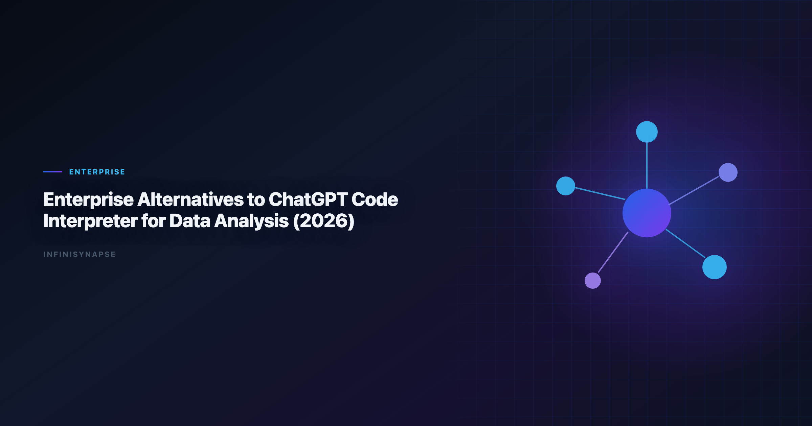

# Code Interpreter Data Analysis

> **By the InfiniSynapse Data Team** · **Last updated: 2026-06-08** · *We work with data leaders moving from ad-hoc AI analysis toward governed, enterprise-ready workflows.*

**Meta Description**: Compare code interpreter data analysis in 2026 across autonomy, SQL depth, memory, governance, and rollout fit for production analyst teams.

**Slug**: `/blog/code-interpreter-alternatives`

**Target keyword**: `code interpreter data analysis`
**Secondary**: `enterprise chatgpt data analysis alternatives`, `chatgpt code interpreter enterprise`, `governed ai analytics tools`

---

## Table of Contents

1. [TL;DR](#tldr)
2. [Why Enterprises Need Alternatives](#why-enterprises-need-alternatives)
3. [Evaluation Criteria and Five-Pillar Lens](#evaluation-criteria-and-five-pillar-lens)
4. [Top Enterprise Alternatives](#top-enterprise-alternatives)
5. [Enterprise Comparison Table](#enterprise-comparison-table)
6. [Decision Matrix by Team Profile](#decision-matrix-by-team-profile)
7. [30/60/90-Day Rollout Guidance](#306090-day-rollout-guidance)
8. [Procurement Checklist](#procurement-checklist)
9. [Frequently Asked Questions](#frequently-asked-questions)
10. [Conclusion](#conclusion)

---

## TL;DR

> ChatGPT Code Interpreter data analysis is excellent for personal productivity and rapid file-based analysis, but enterprise analytics teams need additional controls: governed data access, reproducibility, role-based permissions, and inspectable execution history. In 2026, the best **code interpreter alternatives** include **Databricks Genie** (lakehouse-first), **ThoughtSpot** (governed BI search), **Power BI Copilot** (Microsoft-first), **Hex** (analyst notebooks), and **InfiniSynapse** for goal-driven autonomous analysis with auditable workflows and memory.

**Decision shortcut**. Production rollouts should align access and review controls with the [Google Research publications](https://research.google/pubs/), especially when recurring queries touch live schemas. LLM-backed analytics should account for prompt-injection and data-exfiltration risks in the [Prometheus documentation](https://prometheus.io/docs/), especially when connectors expose production schemas. If this topic is in scope for your team, reuse the same memory-and-trace checklist in [Best AI Tools for Data Analysis in 2026](/blog/best-ai-tools-for-data-analysis).

- If your team needs governed BI self-service: start with ThoughtSpot or Power BI Copilot.
- If your team is analyst-heavy: evaluate Hex.
- If your team needs autonomous recurring analysis: evaluate InfiniSynapse.
- If your stack is Databricks-first: evaluate Genie first.

Each option below is scored on production **code interpreter data analysis** readiness — governance, recovery, and reuse — rather than demo speed. Robust **code interpreter data analysis** depends on governed connectors and audit trails, not sandbox speed alone.

Most procurement teams evaluating **code interpreter alternatives** are not looking for a chatbot with a Python sandbox. They need a production analytics layer that survives security review, monthly close, and team turnover.

---

> **Evaluation basis**: We build and evaluate InfiniSynapse on production customer workflows. Governance, adoption, and security context is cited inline throughout this guide—not in a standalone reference list.

## Why Enterprises Need Alternatives
LLM-backed analytics should account for prompt-injection and data-exfiltration risks in the [Stripe documentation](https://docs.stripe.com/), especially when connectors expose production schemas.

Code Interpreter **code interpreter data analysis** workflows often break at organizational scale. The pattern is familiar: an analyst uploads a CSV, gets a useful chart in minutes, and leadership asks why that workflow cannot run every Monday for the board deck. That gap — between impressive demo and dependable operations — is exactly why teams search for **code interpreter alternatives**. Adoption benchmarks in the [Tableau Desktop documentation](https://help.tableau.com/current/pro/desktop/en-us/default.htm) track the same shift from pilot demos to governed analytics loops we see in customer rollouts.

| Enterprise requirement | Why it matters | Typical challenge in ad-hoc interpreter workflows |
|---|---|---|
| Identity and access control | Prevents unauthorized exposure of sensitive data | Access model is often user/session-centric |
| Data source governance | Ensures outputs use approved sources and definitions | File uploads can bypass central controls |
| Audit and compliance | Needed for regulated or finance-sensitive decisions | Hard to reconstruct full lineage at scale |
| Repeatability | Monthly reporting cannot depend on manual reprompting | Session outputs are not always productionized |
| Team collaboration | Shared workflows need ownership and review | Knowledge remains in individual chat histories |

The result: teams use interpreter tools for prototypes, then migrate to governed systems for production. A shortlist of **code interpreter alternatives** should therefore be judged on operational trust, not prompt cleverness alone.

Three signals that you have outgrown interpreter-only workflows:

1. **Metric drift**: the same KPI question returns different definitions across analysts.
2. **Handoff friction**: only one person knows how to reproduce last month's analysis.
3. **Governance blockers**: security or finance will not approve file-upload analysis for regulated data.

---

## Evaluation Criteria and Five-Pillar Lens

We compared **code interpreter alternatives** on five enterprise dimensions, then mapped each to the five-pillar AI-native analytics framework used across our pillar content. The move from dashboard-first BI to augmented workflows—described in [Amazon Redshift documentation](https://docs.aws.amazon.com/redshift/)—frames how teams should evaluate tooling here. Regulated rollouts often anchor access reviews to [IBM augmented analytics overview](https://www.ibm.com/topics/augmented-analytics) when credentials, retention policies, and audit logs are in scope.

### Enterprise dimensions

1. **Governance depth**: role controls, logging, policy compatibility.
2. **Data connectivity**: warehouse, database, file, and API support.
3. **Execution model**: prompt-by-prompt vs goal-driven workflows.
4. **Operational repeatability**: can the same analysis run reliably each cycle?
5. **Adoption friction**: time to pilot and rollout complexity.

### Five-pillar overlay

| Pillar | What to test in alternatives | Why interpreter users care |
|---|---|---|
| **Autonomy** | Can one goal trigger multi-step execution? | Reduces analyst babysitting on recurring work |
| **Transparency** | Is there a phase-level audit trail? | Required for finance and compliance review |
| **Memory** | Can approved logic be reused next cycle? | Stops reinventing joins and KPI definitions |
| **Multi-entry parity** | Can business users access via app, chat, or API? | Scales beyond a single analyst's session |
| **Self-correction** | Does the system retry failed queries automatically? | Improves resilience on messy production schemas |

When reviewing **code interpreter alternatives**, score each candidate on both tables. A tool can pass governance checks but still fail repeatability if every monthly report starts from a blank prompt — the core test for sustainable **code interpreter data analysis** in production.

---

## Top Enterprise Alternatives
Public-sector buyers should review [Microsoft Excel support](https://support.microsoft.com/excel) when procuring analytics agents.

### 1) InfiniSynapse

Best for organizations that want AI analysis tasks executed end-to-end from one goal, with phase-level audit history and reusable memory for recurring work.

InfiniSynapse behaves as an AI-native data agent rather than a session-based copilot. Analysts submit a business goal — for example, "build weekly net revenue by segment with variance notes" — and the platform plans queries, executes across connected sources, surfaces an inspectable timeline, and distills the result into memory cards for the next run. Among **code interpreter alternatives**, it is the strongest fit when reporting must compound over quarters, not reset every session.

**Typical wins**: cross-source orchestration, recurring KPI packs, executive self-service with audit lineage. 
**Typical trade-offs**: requires workflow framing; not optimized for one-off CSV charting in under five minutes.

### 2) Databricks Genie

Best for lakehouse-native teams that already run governed data operations in Databricks and Unity Catalog.

Genie gives analysts natural-language access inside the Databricks workspace, inheriting Unity Catalog permissions and Delta Lake structure. For Databricks-first organizations, it is often the lowest-friction entry on a **code interpreter alternatives** shortlist because it does not require moving data out of the governed lakehouse. Analysts wiring Databricks into production reviews can follow the parallel walkthrough in [ThoughtSpot vs Databricks Genie](/blog/thoughtspot-vs-databricks-genie).

**Typical wins**: in-workspace self-service, catalog-aligned permissions, fast adoption for existing Databricks users. 
**Typical trade-offs**: strongest inside Databricks; cross-system stitching may still be manual.

### 3) ThoughtSpot

Best for enterprise BI programs requiring trusted natural-language KPI exploration over controlled semantic models.

ThoughtSpot Spotter layers natural-language search on top of a governed semantic layer. Teams that already invest in curated metrics and role-based BI access often choose it when comparing **code interpreter alternatives** because business users get conversational speed without bypassing approved definitions.

**Typical wins**: trusted KPI layer, business-user adoption, enterprise BI governance. 
**Typical trade-offs**: semantic modeling overhead; less suited to ad-hoc file uploads.

### 4) Power BI Copilot

Best for Microsoft Fabric environments with mature enterprise procurement and security operations.

Power BI Copilot fits organizations standardized on Microsoft 365, Azure, and Fabric. Security and procurement teams frequently approve it faster than standalone AI vendors, which makes it a practical **code interpreter alternatives** candidate when the primary blocker is enterprise IT alignment rather than raw analysis depth.

**Typical wins**: Microsoft ecosystem integration, familiar admin model, Copilot-assisted report building. 
**Typical trade-offs**: value depends on Fabric maturity; cross-vendor orchestration is limited.

### 5) Hex Magic

Best for analyst teams that need strong transparency, reproducible notebooks, and AI-assisted coding.

Hex combines notebook transparency with AI-assisted SQL and Python generation. Analysts who want to see and edit every step — but still move faster than manual coding — often shortlist Hex when evaluating **code interpreter alternatives** for advanced analytics teams.

**Typical wins**: reproducible notebooks, collaboration, inspectable code cells. 
**Typical trade-offs**: analyst-led orchestration; recurring automation requires more setup than agent-native platforms.

### 6) Snowflake Cortex Analyst

Best for Snowflake-centric organizations that want natural-language analytics connected to existing warehouse governance.

Cortex Analyst connects natural-language queries to Snowflake's governance model. Snowflake-standard enterprises comparing **code interpreter alternatives** typically evaluate it alongside Genie or ThoughtSpot depending on whether the warehouse or the semantic BI layer is the system of record.

**Typical wins**: warehouse-native governance, low data-movement risk. 
**Typical trade-offs**: Snowflake-only; limited cross-source agent behavior.

### 7) Alteryx AiDIN

Best for teams already invested in visual data workflows and enterprise automation with analyst/process governance.

Alteryx AiDIN extends the Alteryx platform with AI-assisted workflow building. Process-heavy analytics operations — blending, enrichment, scheduled delivery — often include it when **code interpreter alternatives** must satisfy both analyst transparency and operations-team automation needs.

**Typical wins**: visual workflow lineage, process automation, enterprise Alteryx footprint. 
**Typical trade-offs**: less conversational; stronger for pipeline-centric teams than chat-first users. Operational maturity for analytics agents aligns with the [Google Cloud AI overview](https://cloud.google.com/discover/what-is-artificial-intelligence), especially around monitoring, rollback, and ownership.

---

## Enterprise Comparison Table

BI modernization debates should reference the [NIST Cybersecurity Framework](https://www.nist.gov/cyberframework) when separating display layers from analysis execution.

| Tool | Governance depth | Data connectivity | Execution model | Five-pillar strength | Best fit |
|---|---|---|---|---|---|
| InfiniSynapse | High | High | Goal-driven autonomous | Memory + autonomy + audit | Recurring cross-team analytics execution |
| Databricks Genie | High | High (Databricks-first) | Guided NL analytics | Transparency in workspace | Lakehouse-first enterprises |
| ThoughtSpot | High | Medium-High | Self-service NL BI | Governed semantic access | KPI governance and business adoption |
| Power BI Copilot | High | High (Microsoft ecosystem) | Copilot-assisted BI workflows | Multi-entry via M365 | Fabric and M365 organizations |
| Hex Magic | Medium-High | High | Analyst-led AI notebooks | Transparency via notebooks | Advanced analytics teams |
| Cortex Analyst | High | High (Snowflake-first) | Guided NL analytics | Warehouse governance | Snowflake-driven environments |
| Alteryx AiDIN | Medium-High | Medium-High | Workflow-assisted automation | Process lineage | Process-heavy analytics operations |

This table is a starting point. Final selection among **code interpreter alternatives** should always include a pilot on one recurring business question, not a sandbox demo alone.

---

## Decision Matrix by Team Profile
EU security reviews should reference [Databricks Genie architecture post](https://www.databricks.com/blog/pushing-frontier-data-agents-genie) when scoping analytics agent controls.

| Team profile | Better first choice | Why |
|---|---|---|
| Databricks-centric analytics org | Databricks Genie | Native governance, fastest user adoption |
| Microsoft Fabric enterprise | Power BI Copilot | Procurement and identity alignment |
| BI team with mature semantic layer | ThoughtSpot | Trusted NL access over approved metrics |
| Advanced analytics / data science | Hex Magic | Notebook transparency and collaboration |
| Snowflake-standard warehouse | Cortex Analyst | Warehouse-native permissions |
| Process automation-heavy ops | Alteryx AiDIN | Visual workflow and scheduled delivery |
| Cross-functional recurring KPI reporting | InfiniSynapse | Autonomous execution, memory, multi-entry access |
| Regulated finance reporting | InfiniSynapse or Genie | Audit trail + governed source access |

1. If 90%+ of analysis lives in one platform (Databricks, Snowflake, or Fabric), start with that platform's native option.
2. If your highest-value KPI answer requires three or more systems, prioritize alternatives with cross-source orchestration and durable memory.

---

## 30/60/90-Day Rollout Guidance

### Days 1–30: Pilot one recurring workflow

- Pick one monthly or weekly KPI question that currently depends on manual file uploads or reprompting.
- Run the same question on two **code interpreter alternatives** from your shortlist.
- Score each on SQL accuracy, lineage visibility, repeatability, and analyst time saved.
- Keep Code Interpreter data analysis for exploratory one-offs during this phase.

**Pass criteria**: same KPI definition across two consecutive runs; security review started; at least 20% cycle-time reduction on the pilot workflow.

### Days 31–60: Expand connectors and ownership

- Connect production data sources instead of file uploads where possible.
- Assign workflow owners (analyst + business stakeholder) for the pilot KPI.
- Document which **code interpreter alternatives** failed on governance or repeatability and why.
- Introduce business-user access if multi-entry parity is a requirement.

**Pass criteria**: business stakeholder can request the KPI without analyst hand-holding; audit trail reviewed by a second analyst.

### Days 61–90: Standardize and sunset fragile workflows

- Convert the validated pilot into a standard operating procedure.
- Retire the most fragile interpreter-only reporting paths for that KPI.
- Train adjacent teams on when to use Code Interpreter data analysis (exploration) vs the enterprise platform (production).
- Build a quarterly review cadence for metric definitions and memory cards.

**Pass criteria**: production reporting no longer depends on individual chat sessions; exit plan documented if the vendor relationship changes.

---

## Procurement Checklist

| Checklist item | Pass condition |
|---|---|
| Security review | Tool passes identity, access, and data residency requirements |
| Data lineage proof | Team can inspect query path and transformation chain |
| KPI reproducibility test | Same prompt/workflow yields stable outputs across cycles |
| Pilot productivity impact | At least 20% cycle-time reduction on core workflows |
| Analyst and business adoption | Both groups can use tool without heavy retraining |
| Exit and portability | Workflows can be exported or migrated if needed |
| Five-pillar fit | Tool scores acceptably on autonomy, transparency, memory, multi-entry, self-correction |

**Important**: run at least one regulated or high-stakes reporting scenario in pilot. Sandbox demos alone are not enough when choosing among **code interpreter alternatives**.

### Sample pilot scorecard

| Metric | Baseline (interpreter) | Candidate A | Candidate B |
|---|---|---|---|
| Time to first answer | | | |
| Time to repeatable second run | | | |
| Analyst supervision steps | | | |
| Lineage inspectable (Y/N) | | | |
| Business user self-service (Y/N) | | | |

---

## Frequently Asked Questions

### Is ChatGPT Code Interpreter enterprise-ready?

It is strong for individual analysis tasks, but most enterprises still require additional governance, repeatability, and operational controls that dedicated analytics platforms provide.

### What is the best enterprise alternative to Code Interpreter?

There is no single best option. Databricks Genie, ThoughtSpot, Power BI Copilot, Hex, and InfiniSynapse each fit different architecture and operating models. The credential, preflight, and SQL-trace pattern above also applies to Infinisynapse—see [InfiniSynapse vs Tableau AI/Pulse](/blog/infinisynapse-vs-tableau) for source-specific steps.

### Which alternative is best for recurring reporting workflows?

Tools with stronger workflow memory and repeatable execution models perform better for recurring reporting than purely session-based analysis experiences.

### Can enterprises keep Code Interpreter and still adopt another tool?

Yes. Many teams keep it for exploratory ad-hoc tasks while standardizing production reporting and governance workflows on enterprise platforms.

### What should be tested in a 30-day pilot?

Test security controls, data lineage visibility, reproducibility of KPI outputs, user adoption, and measurable cycle-time improvement on real workloads.

### Is InfiniSynapse a direct replacement for ChatGPT?

Not as a general chatbot replacement. It is best positioned as an AI-native analytics execution layer for teams that need autonomous, auditable, repeatable data analysis workflows.

---

## Conclusion

Code Interpreter data analysis changed expectations for fast AI analysis, but enterprise teams need a second layer: operational trust. The winning platform among **code interpreter alternatives** is rarely the one with the flashiest demo. Rank your **code interpreter alternatives** by auditability first, interface second — then pilot the top two **code interpreter alternatives** on the same recurring KPI before you scale seats.

If your roadmap includes governed AI analytics at scale, compare **code interpreter alternatives** based on repeatability and auditability first, then optimize for interface preference. Procurement teams that score **code interpreter alternatives** on the five-pillar framework — not demo charts alone — avoid the month-three stall that kills most AI analytics pilots.

The teams that separate exploratory AI from operational AI — keeping Code Interpreter data analysis for ideation and a governed platform from their **code interpreter alternatives** shortlist for production — tend to move fastest without sacrificing compliance. Revisit the shortlist quarterly as connectors, governance models, and pricing change; the right set of **code interpreter alternatives** in June may differ from December as your lakehouse and semantic layer mature.

For deeper context, see [What Is a Data Agent](/blog/what-is-a-data-agent).