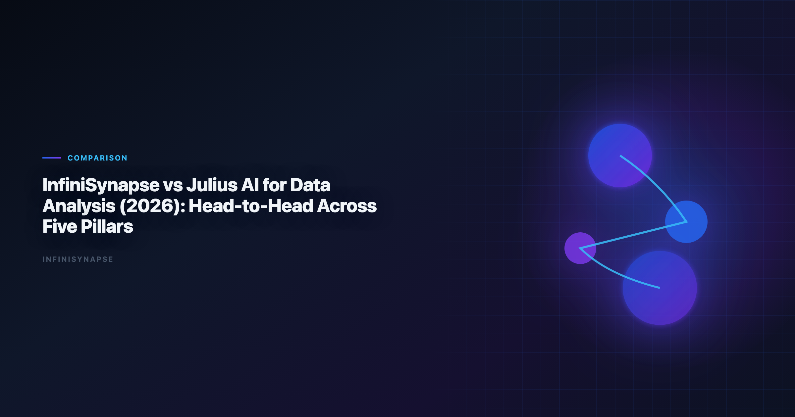

# InfiniSynapse vs Julius AI: Data Analysis Comparison for Teams (2026)

> **By the InfiniSynapse Data Team** · **Last updated: 2026-06-15** · *We build InfiniSynapse, an AI-native Data Agent platform referenced in this comparison. Findings reflect production customer rollouts, hands-on product use, and public documentation—not paid placement.*

**Meta Description**: Infinisynapse vs julius ai compared in 2026 across autonomy, SQL depth, memory, governance, and deployment fit for production analyst teams.

**Slug**: `/blog/infinisynapse-vs-julius-ai`

**Target keyword**: `infinisynapse vs julius ai`
**Secondary**: `julius ai data analysis`, `julius ai alternatives`, `ai data analysis platform comparison`

---

## Table of Contents

1. [TL;DR](#tldr)
2. [Product Positioning in One Minute](#product-positioning-in-one-minute)
3. [Five-Pillar Comparison Table](#five-pillar-comparison-table)
4. [Pillar-by-Pillar Deep Dive](#pillar-by-pillar-deep-dive)
5. [Scenario Benchmarks](#scenario-benchmarks)
6. [Decision Matrix](#decision-matrix)
7. [Procurement and Stakeholder Alignment](#procurement-and-stakeholder-alignment)
8. [Rollout Guidance for Mixed Teams](#rollout-guidance-for-mixed-teams)
9. [Security, Compliance, and Deployment](#security-compliance-and-deployment)
10. [Cost and Staffing Implications](#cost-and-staffing-implications)
11. [Frequently Asked Questions](#frequently-asked-questions)
12. [Conclusion](#conclusion)

---

## TL;DR

> **Infinisynapse vs julius ai** is a workflow-fit question, not a feature bake-off. Julius AI wins on upload-to-chart speed for one-off files. InfiniSynapse wins when teams need goal-driven agent execution, multi-source federation, audit trails, and memory that survives beyond a single chat session.

**Simple rule**

- Choose **Julius AI** for lightweight file analysis and presentation-grade quick charts.
- Choose **InfiniSynapse** for repeatable, governed, multi-source analytics execution.

Adoption benchmarks in the [Stanford HAI AI Index](https://hai.stanford.edu/ai-index) track the move from dashboard-first BI to governed, reviewable loops—and frame how teams should read an **infinisynapse vs julius ai** evaluation once the same KPI pack runs every month instead of once per quarter.

> **Key Definition**: An **infinisynapse vs julius ai** comparison measures operating-model fit—session-based chart copilot versus agentic execution with connectors, memory, and reviewable SQL lineage.

---

> **Evaluation basis**: We evaluate InfiniSynapse on production customer workflows across finance, product, and operations teams. Governance, adoption, and security context is cited inline throughout this guide—not in a standalone reference list.

For category context before you buy, start with [Best AI Tools for Data Analysis in 2026](/blog/best-ai-tools-for-data-analysis), which separates copilots from agentic platforms. If you are still shortlisting vendors, see [Julius AI Alternatives](/blog/julius-ai-alternatives) for a wider field view before locking in a head-to-head pilot.

## Product Positioning in One Minute

| Dimension | InfiniSynapse | Julius AI |
|---|---|---|
| Product archetype | AI-native Data Agent | AI-enabled chart-first copilot |
| Typical user | Data teams with recurring analytical workflows | Analysts, PMs, founders needing quick visual analysis |
| Best starting point | Goal-based task across connected sources | Upload a file and ask for charts |
| Strength profile | End-to-end execution, audit, memory | Fast onboarding, strong default visual output |
| Governance posture | Audit timeline, connector policies, reusable memory | Session-centric; lighter operational governance |

Both products are useful. The difference is **workflow horizon**: single session versus ongoing operations. Teams researching **infinisynapse vs julius ai** should name their most expensive recurring report—not their fastest ad-hoc chart.

Enterprise AI adoption guidance in [Google Cloud architecture framework](https://cloud.google.com/architecture/framework) mirrors the shift from ad-hoc copilots to repeatable, reviewable decision workflows—the same shift that makes **infinisynapse vs julius ai** a procurement conversation at month three, not day one.

## Five-Pillar Comparison Table

We score both products on five pillars that predict whether a pilot compounds or stalls after the demo.

| Pillar | InfiniSynapse | Julius AI | Practical impact |
|---|---|---|---|
| **Autonomy** | High: multi-step analysis from one goal | Low–Medium: user drives prompt-by-prompt | Determines analyst supervision load |
| **Transparency** | High: phase timeline with inspectable SQL | Medium: visible outputs, less workflow lineage | Determines trust and review speed |
| **Memory** | High: structured reuse across runs | Low: session history, limited operational memory | Determines recurring-report rework |
| **Multi-entry parity** | High: app, chat, and API patterns | Medium: strong app/chat; API parity varies | Determines team automation fit |
| **Self-correction** | High: reroutes and retries in-flow | Low–Medium: user usually reroutes manually | Determines resilience on messy schemas |

**Summary**: Julius optimizes interactive speed. InfiniSynapse optimizes operational continuity. In most **infinisynapse vs julius ai** reviews, memory, autonomy, and transparency separate pilot success from pilot stall.

Production rollouts should align access and review controls with [Microsoft's data architecture guidance](https://learn.microsoft.com/en-us/azure/architecture/data-guide/), especially when connectors expose live schemas.

## Pillar-by-Pillar Deep Dive

### Autonomy: one goal versus one prompt at a time

Julius excels when the analyst stays in the loop: upload, ask, adjust chart, ask again. That loop is fast for exploration. InfiniSynapse accepts a business goal—"explain Q2 churn drivers by segment and compare to support ticket themes"—and plans steps internally. The autonomy question in **infinisynapse vs julius ai** is simple: supervise every step, or delegate a multi-step workflow?

### Transparency: outputs versus process lineage

Julius shows generated code and charts clearly, which builds trust for individual sessions. InfiniSynapse adds a phase-level timeline: which sources were queried, which SQL ran, where the agent retried. Compliance-sensitive teams comparing **infinisynapse vs julius ai** weight transparency heavily because reviewers ask about process, not just final charts.

### Memory: session history versus operational reuse

Julius session history helps the same user continue a thread. InfiniSynapse distills completed work into reusable memory that other team members—and future runs—can apply. The memory gap shows up monthly when someone rebuilds joins, filters, and KPI definitions from scratch.

### Multi-entry parity: who can ask, from where

Julius is approachable for business users via app and chat. InfiniSynapse supports app, chat, and API entry with consistent execution—important when RevOps wants triggered reporting and analysts want the web console. Multi-entry parity often tips **infinisynapse vs julius ai** decisions for cross-functional teams.

### Self-correction: manual reroute versus automatic retry

Schema drift, timeouts, and ambiguous column names are normal in production data. Julius typically expects the user to rephrase. InfiniSynapse retries and reroutes within the execution flow. For **infinisynapse vs julius ai** evaluations on messy warehouse schemas, run the same question twice after a minor schema change and compare recovery behavior.

Operational maturity for analytics agents aligns with patterns in the [Elastic documentation](https://www.elastic.co/guide/), especially around monitoring, rollback, and ownership.

## Scenario Benchmarks

### Scenario 1: One-off CSV with executive chart request

| Requirement | Better fit |
|---|---|
| Upload-and-chart in minutes | Julius AI |
| Minimal setup for non-technical users | Julius AI |
| Visual polish on first pass | Julius AI |

A founder uploads a sales CSV and needs a board-ready chart before tomorrow's meeting. Julius wins on time-to-first-visual. **Infinisynapse vs julius ai** is not close here—and should not be. Use the right tool for the horizon.

### Scenario 2: Weekly KPI pack across warehouse and files

| Requirement | Better fit |
|---|---|
| Stable metric definitions over time | InfiniSynapse |
| Repeatable workflow without re-prompting | InfiniSynapse |
| Inspectable execution history for QA | InfiniSynapse |

A RevOps lead needs weekly pipeline coverage by region, blending warehouse tables with a supplemental CSV export. Week two should not require rebuilding logic. Here **infinisynapse vs julius ai** favors InfiniSynapse because memory and auditability reduce rework. Teams blending spreadsheets and SQL should cross-check connector patterns in [Best AI Tools for Excel Data Analysis in 2026](/blog/ai-excel-data-analysis-tools).

### Scenario 3: Team-wide analysis with governance

| Requirement | Better fit |
|---|---|
| Shared operational memory | InfiniSynapse |
| Multi-user workflow consistency | InfiniSynapse |
| Reduced analyst rework over cycles | InfiniSynapse |

When five analysts and three business partners touch the same KPI family, session-based tools fragment knowledge. **Infinisynapse vs julius ai** at team scale is an operating-model decision: shared execution layer versus individual chat sessions.

Foundational warehouse concepts—grain, dimensions, and conformed metrics—remain essential; [ClickHouse documentation](https://clickhouse.com/docs) is a concise refresher for reviewers validating generated SQL in either product.

## Decision Matrix

| If your priority is… | Choose |
|---|---|
| Fast individual charting on uploaded files | Julius AI |
| Analyst velocity on ad-hoc exploration | Julius AI (or hybrid) |
| Autonomous recurring analysis execution | InfiniSynapse |
| Team-level governance and audit readiness | InfiniSynapse |
| Long-term operational compounding | InfiniSynapse |
| Lowest learning curve for non-technical users | Julius AI |
| API-driven reporting automation | InfiniSynapse |
| Warehouse + file orchestration in one goal | InfiniSynapse |

**Hybrid pattern**: some teams use Julius for early exploration and InfiniSynapse for productionized recurring workflows—a common outcome once **infinisynapse vs julius ai** stops being either/or.

### Quick three-question test

1. Will the same analysis run next month without the original analyst? If yes → lean InfiniSynapse.
2. Is the primary input a single uploaded file with no connector setup? If yes → lean Julius AI.
3. Does compliance require inspectable query lineage? If yes → lean InfiniSynapse.

## Procurement and Stakeholder Alignment

Before a formal pilot, align three stakeholders: the analyst who owns data quality, the business partner who consumes KPIs, and security or IT who approves connectors. Julius pilots often start without IT tickets because file upload is the default path. InfiniSynapse pilots should budget one to two weeks for connector approval—upfront cost that frequently pays back on the second monthly run.

Present **infinisynapse vs julius ai** to leadership as a horizon choice. Julius optimizes today's answer; InfiniSynapse optimizes next quarter's operating rhythm. Executives who only see demo charts often pick Julius; executives who model analyst labor cost often fund the InfiniSynapse pilot.

## Rollout Guidance for Mixed Teams

### Phase 1 (weeks 1–2): Preserve exploration speed

Keep Julius for ad-hoc file uploads, brainstorming charts, and PM self-service on small datasets. Identify the top three recurring reports that currently depend on manual rework. Document metric definitions that drift between sessions.

### Phase 2 (weeks 3–6): Pilot one recurring workflow on InfiniSynapse

Connect production sources for one weekly or monthly KPI pack. Run the same business question twice; compare setup time and definition stability against Julius sessions. Review the audit timeline with a second analyst or finance partner. Try the [InfiniSynapse web app](https://app.infinisynapse.cn) on a read replica before widening connector scope.

### Phase 3 (weeks 7–12): Operationalize and clarify roles

Publish a routing guide: Julius for exploration, InfiniSynapse for production reporting. Convert validated InfiniSynapse runs into memory templates. Retire the most fragile manual rework paths for the pilot KPI family.

**Success signal**: stakeholders get repeatable answers without opening a prior chat to copy prompts. That is when **infinisynapse vs julius ai** becomes a workflow split, not a rivalry.

## Security, Compliance, and Deployment

LLM-backed analytics should account for prompt-injection and data-exfiltration risks, with responsible-AI controls described in the [Google Vertex AI documentation](https://cloud.google.com/vertex-ai/docs), especially when connectors expose production schemas.

Industry reporting practices such as [Shopify's ecommerce analytics](https://www.shopify.com/enterprise/blog/ecommerce-analytics) show why production rollouts still need explicit credentials, retention policies, and audit logs in scope. When comparing **infinisynapse vs julius ai** for production reporting, confirm:

- Whether uploads alone satisfy data-handling policy
- Role-based access for connectors versus file-only modes
- Private deployment options if SaaS multi-tenant models are excluded
- Export controls for generated SQL and intermediate datasets

Julius workflows often start with file uploads. InfiniSynapse workflows typically connect to governed sources. For regulated industries, ask whether production reporting can rely on upload-based analysis at all—connector-first design may be a hard requirement.

## Cost and Staffing Implications

**Infinisynapse vs julius ai** total cost of ownership looks different by horizon. Julius minimizes onboarding cost per user; InfiniSynapse minimizes rework cost per recurring cycle. If your team runs twelve monthly board metrics that each take four analyst hours to rebuild in Julius sessions, the math shifts toward memory-rich execution even when per-seat pricing differs.

Model license cost, analyst time saved, and platform engineering overhead together. The cheapest seat price rarely equals the lowest total cost when governance load is included. Warehouse-heavy teams should also review SQL depth expectations in [SQL Data Analysis Tools: Best AI Options for 2026 Teams](/blog/sql-data-analysis-tools) before signing a multi-year contract based on a file-upload demo alone.

## Frequently Asked Questions

### Is Julius AI better than InfiniSynapse for all use cases?

No. Julius is often better for lightweight, one-off, chart-first workflows. InfiniSynapse is typically better for recurring, operational, and governed analysis workflows where **infinisynapse vs julius ai** decisions hinge on memory and audit trails.

### What is the biggest difference between the two products?

Workflow model. InfiniSynapse emphasizes goal-driven autonomous execution with memory and audit trails. Julius emphasizes interactive session-based analysis and fast chart output.

### Which tool is easier for non-technical users?

Julius is often easier for immediate file upload and chart generation. InfiniSynapse may require more workflow framing but offers stronger long-term operational leverage for teams that outgrow sessions.

### Which one is better for recurring monthly reporting?

InfiniSynapse is usually better for recurring reporting because repeatability, memory, and auditable execution are central to that use case—not optional add-ons.

### Can teams use both Julius AI and InfiniSynapse?

Yes. A practical pattern is Julius for ideation and quick visual exploration, then InfiniSynapse for production-grade recurring execution. Many mature **infinisynapse vs julius ai** strategies keep both rather than forcing a single winner.

## Conclusion

**Infinisynapse vs julius ai** is best framed as **workflow fit**, not winner-takes-all. Julius is strong for immediate, low-friction charting. InfiniSynapse is strong for sustained, repeatable analytics where memory, federation, private deployment, and auditability matter.

For most teams, one question decides the pilot: are you optimizing for today's chart or next quarter's operating system? If today's chart, start with Julius. If next quarter's system, run a 30-day InfiniSynapse pilot on one recurring KPI and measure repeatability—not demo sparkle. For broader vendor context, revisit [Julius AI Alternatives](/blog/julius-ai-alternatives) and the hub guide [Best AI Tools for Data Analysis in 2026](/blog/best-ai-tools-for-data-analysis).
