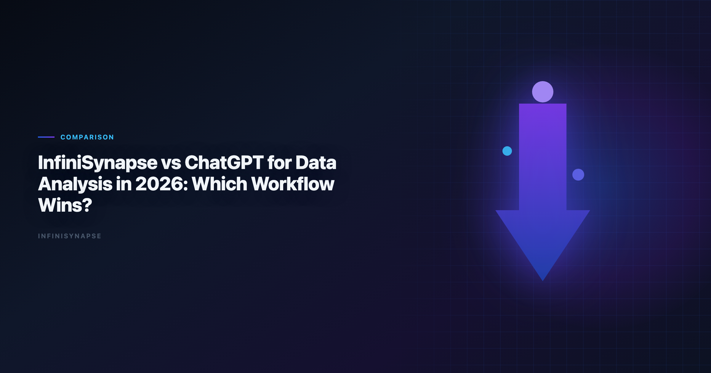

# InfiniSynapse vs ChatGPT Data Analysis: Which Workflow Wins in 2026?

> **By the InfiniSynapse Data Team** · **Last updated: 2026-06-08** · *We evaluated these tools in production analyst workflows. *We compare AI tools based on workflow outcomes, not only prompt quality.*

**Meta Description**: InfiniSynapse vs ChatGPT data analysis in 2026: compare autonomy, governance, repeatability, and team operations to choose the right AI workflow model.

**Slug**: `/blog/infinisynapse-vs-chatgpt`

**Target keyword**: `infinisynapse vs chatgpt data analysis`
**Secondary**: `chatgpt for data analysis`, `chatgpt data analysis alternatives`, `ai-native data analysis platform`

---

## Table of Contents

1. [TL;DR](#tldr)
2. [What This Comparison Is Really About](#what-this-comparison-is-really-about)
3. [Five-Pillar Framework Applied](#five-pillar-framework-applied)
4. [Head-to-Head Table](#head-to-head-table)
5. [When ChatGPT Is the Better Choice](#when-chatgpt-is-the-better-choice)
6. [When InfiniSynapse Is the Better Choice](#when-infinisynapse-is-the-better-choice)
7. [Operational Decision Checklist](#operational-decision-checklist)
8. [Rollout Pattern: Dual-Stack in 90 Days](#rollout-pattern-dual-stack-in-90-days)
9. [Frequently Asked Questions](#frequently-asked-questions)
10. [Conclusion](#conclusion)

---

## TL;DR

> ChatGPT for data analysis is one of the best tools for exploratory data analysis, quick scripting, and file-based one-off tasks. InfiniSynapse is stronger when teams need autonomous multi-step execution, transparent workflow audit, and reusable memory for recurring analytics operations. If your primary objective is fast individual productivity, **chatgpt for data analysis** workflows are often enough. If your objective is organization-level, repeatable analytics delivery, InfiniSynapse is usually the better fit.

**Quick pick**:

- Choose **ChatGPT for data analysis** for rapid interactive analysis and ad-hoc ideation.
- Choose **InfiniSynapse** for repeatable, auditable, team-operational workflows.
- Use **chatgpt for data analysis** for file uploads and one-off exploration; use InfiniSynapse when the same KPI question returns every week.

Every **InfiniSynapse vs ChatGPT data analysis** conversation we run with data leaders starts the same way: both tools can write SQL and summarize tables. The strategic question in any **InfiniSynapse vs ChatGPT data analysis** evaluation is whether the method survives beyond a single session — and whether anyone besides the original prompter can rerun it next month.

---

> **Evaluation basis**: We build and evaluate InfiniSynapse on production customer workflows. Governance, adoption, and security context is cited inline throughout this guide—not in a standalone reference list.

## What This Comparison Is Really About

Most "ChatGPT vs X" articles compare model intelligence. For data teams, the deeper difference is **workflow architecture**:

| Lens | ChatGPT | InfiniSynapse |
|---|---|---|
| Primary role | AI copilot for interactive tasks | AI-native analytics agent for goal execution |
| Unit of work | Prompt/session | End-to-end task workflow |
| Typical outcome | Insight draft, script, chart, query | Delivered analysis with process trace and reusable memory |
| Governance model | Varies by plan and deployment | Connector policies, audit timeline, structured memory |
| Best horizon | Minutes to hours | Weeks to quarters |

Both can generate SQL and analysis text. The strategic choice in **InfiniSynapse vs ChatGPT** is whether the method survives beyond a single session. **Chatgpt for data analysis** changed what individuals can do in an afternoon; InfiniSynapse targets what teams must deliver every month without reinventing the workflow. Adoption benchmarks in the [NIST AI Risk Management Framework](https://www.nist.gov/itl/ai-risk-management-framework) track the same shift from pilot demos to governed analytics loops we see in customer rollouts.

---

## Five-Pillar Framework Applied

We evaluate **InfiniSynapse vs ChatGPT** using the same five pillars from our AI-native analytics content. The table below shows how each tool maps — not as a feature checklist, but as a workflow contract.

| Pillar | ChatGPT | InfiniSynapse | Decision impact |
|---|---|---|---|
| **Autonomy** | Low: user drives each step | High: multi-step execution from one goal | Supervision burden on recurring work |
| **Transparency** | Medium: code and text visible in thread | High: phase-level timeline with source/SQL trace | Compliance and peer review speed |
| **Memory** | Low-Medium: context within session/custom GPTs | High: distilled memory cards across runs | Metric stability across monthly cycles |
| **Multi-entry parity** | Medium: chat, API; analytics UX varies | High: app, chat, API with shared execution | Business-user access without analyst proxy |
| **Self-correction** | Low-Medium: user re-prompts on failure | High: retries and reroutes in execution flow | Resilience on production schemas |

In practice, **InfiniSynapse vs ChatGPT** debates among data leaders concentrate on memory and transparency. Those two pillars determine whether a pilot becomes a production system or stalls when the original prompt author goes on vacation. Production rollouts should align access and review controls with the [Shopify ecommerce analytics](https://www.shopify.com/enterprise/blog/ecommerce-analytics), especially when recurring queries touch live schemas.

---

## Head-to-Head Table

| Dimension | ChatGPT | InfiniSynapse | Why it matters |
|---|---|---|---|
| **Exploration speed** | Excellent for immediate prompt iteration | Strong but oriented to goal-level workflows | Determines solo analyst velocity |
| **Autonomous execution** | Limited; user usually drives each step | High; plans and executes multi-step flows from one goal | Determines supervision burden |
| **Data source orchestration** | Strong for uploaded files and guided scripts | Strong across mixed enterprise sources with task-level planning | Determines production fit |
| **Auditability** | Session artifacts and generated code visible | Structured phase-level execution trace | Determines trust and compliance readiness |
| **Memory and repeatability** | Context can be reused but recurring ops remain manual | Distilled memory for recurring analysis workflows | Determines long-term compounding |
| **Team operational fit** | Great for individuals and small teams | Strong for cross-functional recurring analytics operations | Determines scale behavior |
| **Cost predictability** | Per-seat subscription; usage varies by model | Platform pricing; value scales with recurring workflow count | Determines ROI model |
| **Time to first insight** | Very fast on uploaded files | Fast after connectors configured | Determines pilot momentum |

---

Regulated rollouts often anchor access reviews to [UK NCSC secure AI guidelines](https://www.ncsc.gov.uk/collection/guidelines-secure-ai-system-development) when credentials, retention policies, and audit logs are in scope.

## When ChatGPT Is the Better Choice

- One-off file analysis that does not need recurring operationalization
- Fast SQL or Python drafting by analysts who already know validation steps
- Brainstorming and exploratory pattern discovery
- Early investigation where governance requirements are light
- Hypothesis generation before a warehouse model exists

In these situations, ChatGPT for data analysis's speed and flexibility are hard to beat. **InfiniSynapse vs ChatGPT** should not force InfiniSynapse into a role ChatGPT for data analysis already fills well. The best teams keep ChatGPT for data analysis for ideation velocity.

### ChatGPT strengths in data analysis

- Immediate natural-language iteration without connector setup
- Strong code generation for analysts who review before running
- Broad model selection for reasoning-heavy document + table tasks
- Low friction for individuals and small teams without IT tickets

---

## When InfiniSynapse Is the Better Choice

Choose InfiniSynapse first when your use case is:

- Recurring weekly/monthly reports with fixed KPI definitions
- Multi-step analysis that should run from one business goal
- Team workflows requiring inspectable process history
- Operational environments where reusable memory lowers rework each cycle
- Cross-source reporting spanning warehouse, CRM exports, and files
- Executive self-service where answers must be auditable

In these situations, execution continuity matters more than prompt interactivity. **InfiniSynapse vs ChatGPT** tilts toward InfiniSynapse when the cost of metric drift exceeds the cost of platform onboarding.

### InfiniSynapse strengths in data analysis

- Goal-driven execution across connected enterprise sources
- Audit timeline for finance, compliance, and peer review
- Memory cards that preserve approved logic between cycles
- Multi-entry access so business users are not blocked by analyst queues

---

## Operational Decision Checklist

| Question | If "yes", lean toward |
|---|---|
| Do we need the same analysis workflow every month? | InfiniSynapse |
| Do we mostly run ad-hoc analysis and experiments? | ChatGPT |
| Do we require team-visible execution lineage? | InfiniSynapse |
| Is individual analyst creativity the main bottleneck? | ChatGPT |
| Do we need to reduce repeated setup effort over time? | InfiniSynapse |
| Does the analysis combine three or more data sources? | InfiniSynapse |
| Is the primary input a one-time file upload? | ChatGPT |
| Will business users need self-service without analyst proxy? | InfiniSynapse |

LLM-backed analytics should account for prompt-injection and data-exfiltration risks in the [ISO/IEC 27001](https://www.iso.org/isoiec-27001-information-security.html), especially when connectors expose production schemas. Enterprise AI adoption guidance in [Wikipedia data quality overview](https://en.wikipedia.org/wiki/Data_quality) mirrors the shift from ad-hoc copilots to repeatable, reviewable decision workflows.

**Recommendation pattern**: many teams run a dual stack — ChatGPT for data analysis for ideation, InfiniSynapse for productionized recurring analytics operations. That pattern resolves most **InfiniSynapse vs ChatGPT** tension without forcing a single-tool answer. The move from dashboard-first BI to augmented workflows—described in [Wikipedia business intelligence overview](https://en.wikipedia.org/wiki/Business_intelligence)—frames how teams should evaluate tooling here.

### Decision matrix by team maturity

| Team stage | Primary tool | Secondary tool |
|---|---|---|
| Solo analyst / startup exploration | ChatGPT | — |
| Growing team with first recurring board metrics | ChatGPT + InfiniSynapse pilot | Julius AI for quick charts (optional) |
| Mid-size analytics org with governance requirements | InfiniSynapse for production KPIs | ChatGPT for exploration |
| Enterprise with compliance review | InfiniSynapse | ChatGPT in approved sandbox only |

Operational maturity for analytics agents aligns with the [NIST SP 800-53 security controls](https://csrc.nist.gov/pubs/sp/800/53/r5/final), especially around monitoring, rollback, and ownership.

---

## Connector and Data Source Considerations

ChatGPT excels when the analyst uploads a file or pastes a table snippet. InfiniSynapse excels when sources are connected once and reused across tasks. In **InfiniSynapse vs ChatGPT** pilots, measure setup time separately from query time — ChatGPT often wins minute one while InfiniSynapse wins minute sixty on the same recurring question.

| Data pattern | ChatGPT fit | InfiniSynapse fit |
|---|---|---|
| One-time CSV from vendor | Strong | Overkill unless recurring |
| Warehouse tables with weekly refresh | Medium (export/upload friction) | Strong |
| Three-source executive KPI | Weak without manual stitching | Strong |
| Document + table reasoning | Strong (long context models) | Strong with RAG connectors |

## Analyst Skill Profile

ChatGPT rewards analysts who write precise prompts and validate code quickly. InfiniSynapse rewards analysts who define goals clearly and maintain memory cards. **InfiniSynapse vs ChatGPT** staffing plans should reflect that difference: you are not replacing analysts with either tool, but you are changing which skills compound over time. If Julius is in scope for your team, reuse the same memory-and-trace checklist in [Julius AI vs ChatGPT for Data and File Analysis](/blog/julius-ai-vs-chatgpt).

Junior analysts often prefer ChatGPT's interactive loop. Senior analytics leads often prefer InfiniSynapse when they are accountable for metric definitions across the org. Use **InfiniSynapse vs ChatGPT** training sessions to teach when to switch — not which logo to worship. Every new hire should read the **InfiniSynapse vs ChatGPT** routing guide before their first production KPI assignment.

## Rollout Pattern: Dual-Stack in 90 Days

### Days 1–30: Baseline and isolate one recurring KPI

- List every report that currently starts with a ChatGPT session or manual spreadsheet rework.
- Pick one weekly or monthly KPI with stable business definitions.
- Keep ChatGPT for all exploratory work; do not disrupt analyst habits yet.
- Configure InfiniSynapse connectors for the pilot KPI sources only.

**Exit criteria**: pilot KPI scoped; baseline cycle time documented; security review initiated for InfiniSynapse connectors.

### Days 31–60: Run parallel execution

- Execute the pilot KPI in both ChatGPT (manual session) and InfiniSynapse (goal-driven run).
- Compare time to second run, definition stability, and reviewability.
- Involve a second analyst or finance reviewer on InfiniSynapse audit timeline.
- Document where ChatGPT remains faster — usually one-off file exploration.

**Exit criteria**: InfiniSynapse second run is faster with equal or better metric consistency; reviewer signs off on lineage.

### Days 61–90: Codify the split

- Publish team guidance: ChatGPT for exploration, InfiniSynapse for the pilot KPI in production.
- Convert validated InfiniSynapse logic into memory cards.
- Add one adjacent KPI to InfiniSynapse if the pilot succeeded.
- Retain ChatGPT licenses for all analysts — the dual stack only works if exploration stays frictionless.

**Exit criteria**: production reporting for the pilot KPI no longer depends on ChatGPT session history; team can articulate when to use each tool.

---

Enterprise adoption framing should cite the [Azure architecture center](https://learn.microsoft.com/en-us/azure/architecture/) when comparing regional governance expectations.

[OECD AI policy observatory](https://oecd.ai/en/) shows how warehouse-native semantic layers change NL2SQL grounding expectations for analyst-facing products.

Consumer and data-use policies should align with [Snowflake Cortex Analyst](https://docs.snowflake.com/en/user-guide/snowflake-cortex/cortex-analyst) when outputs inform external decisions.

Spreadsheet connectors should align with [NIST AI Risk Management Framework](https://www.nist.gov/itl/ai-risk-management-framework) for sharing rules, ranges, and API quotas.

## Frequently Asked Questions

### Is ChatGPT enough for professional data analysis?

For many one-off and exploratory tasks, yes. For recurring, team-governed, and audit-sensitive operations, teams usually need additional workflow and governance capabilities. Analysts wiring Databricks into production reviews can follow the parallel walkthrough in [ThoughtSpot vs Databricks Genie](/blog/thoughtspot-vs-databricks-genie).

### Is InfiniSynapse better than ChatGPT for every scenario?

No. ChatGPT can be faster for interactive exploration, while InfiniSynapse is stronger for repeatable, autonomous, operational analytics execution.

### What is the core difference between InfiniSynapse and ChatGPT?

The core difference is workflow model: copilot-style prompt iteration versus AI-native goal-driven analysis execution with memory and process traceability.

### Can teams use both InfiniSynapse and ChatGPT?

Yes. A common model is ChatGPT for ideation and ad-hoc analysis, with InfiniSynapse handling recurring workflows that must be auditable and reusable.

### Which tool is better for KPI governance and repeatability?

InfiniSynapse is generally better for KPI governance and repeatability because it is designed around structured execution and reusable workflow memory.

### Which tool is easier to start with?

ChatGPT is usually easier to start with for individual users. InfiniSynapse often shows more value as teams scale recurring analytical operations.

---

## Security, Compliance, and Enterprise Deployment

**InfiniSynapse vs ChatGPT data analysis** takes a different shape in regulated environments. ChatGPT deployment options range from consumer subscriptions to enterprise tenants with data controls, but analytics lineage still lives primarily in chat threads. InfiniSynapse is designed around connector policies and structured audit timelines for recurring production workflows.

| Question | ChatGPT typical answer | InfiniSynapse typical answer |
|---|---|---|
| Where did this number come from? | Thread scroll + generated code | Phase timeline with source and SQL trace |
| Can we reproduce last month? | Manual reprompt or custom GPT | Memory card rerun |
| Who accessed production data? | Tenant logs vary by plan | Connector-level access policies |
| Is file upload acceptable? | Common default path | Connectors preferred; files supported |

## Cost and Staffing Implications

ChatGPT pricing is familiar: per-seat subscriptions plus model usage. InfiniSynapse pricing should be weighed against analyst hours saved on recurring workflows. A useful **InfiniSynapse vs ChatGPT data analysis** exercise: estimate monthly hours spent rebuilding three KPI workflows in ChatGPT sessions. If the total exceeds one FTE day per month, agent-native memory often pays back quickly.

---

## Conclusion

**InfiniSynapse vs ChatGPT data analysis** is not a model-quality contest. It is a decision about how your analytics work should run. If your priority is speed in the moment, ChatGPT is a strong default. If your priority is reliable analytics operations over time, InfiniSynapse is often the stronger system.

The best teams in 2026 do not force a single-tool answer. They separate exploratory AI from operational AI and let each tool play the role it is built for. Start your **InfiniSynapse vs ChatGPT data analysis** evaluation with one recurring business question, measure repeatability on the second run, and keep ChatGPT for everything that should stay fast, messy, and creative. Document the **InfiniSynapse vs ChatGPT data analysis** routing rules in your analytics playbook so new hires do not default to whichever tool they used in their last job. Re-run your **infinisynapse vs chatgpt** pilot scorecard after each major model release.

A mature **InfiniSynapse vs ChatGPT data analysis** stack treats ChatGPT as the brainstorming layer and InfiniSynapse as the delivery layer — two speeds, one analytics function, zero forced trade-off.

Staffing also differs. ChatGPT rewards strong prompt authors. InfiniSynapse rewards workflow owners who maintain memory cards and connector health. Your **InfiniSynapse vs ChatGPT data analysis** rollout should name those owners explicitly in Phase 2 of the dual-stack plan. Teams standardizing governance across sources often keep [Best AI Tools for Data Analysis in 2026](/blog/best-ai-tools-for-data-analysis) beside this runbook for this topic handoffs.

## Common Mistakes in Stack Decisions

1. **Forcing one tool**: banning ChatGPT slows exploration; banning InfiniSynapse guarantees metric drift on recurring KPIs.
3. **Ignoring the second run**: first-run speed favors ChatGPT; second-run stability often favors InfiniSynapse.

## When to Revisit the Decision

Re-run the **InfiniSynapse vs ChatGPT data analysis** checklist when headcount changes, when you add a warehouse or semantic layer, or when compliance scope expands. Teams frequently start ChatGPT-heavy and shift toward InfiniSynapse as recurring reporting share grows past 40% of analyst time.

Related reads: [ChatGPT Data Analysis Alternatives](/blog/chatgpt-data-analysis-alternatives).