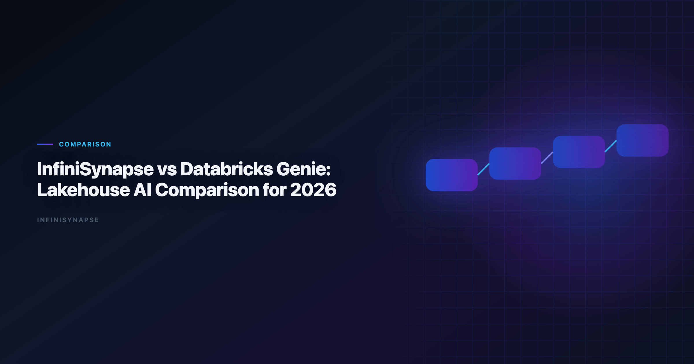
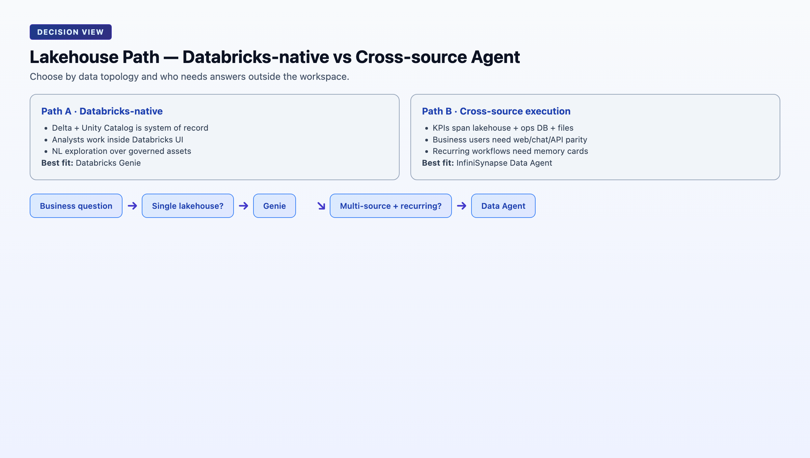

# InfiniSynapse vs Databricks Genie: Lakehouse AI Comparison for 2026

> **By the InfiniSynapse Data Team** · **Last updated: 2026-06-08** · *We evaluated these tools in production analyst workflows. *We benchmark AI analytics tools every quarter using recurring KPI workflows across lakehouse and operational sources.*

**Meta Description**: InfiniSynapse vs Databricks Genie compared for lakehouse teams: autonomy, memory, governance, and where each tool wins in 2026. Includes examples and a FAQ.

**Slug**: `/blog/infinisynapse-vs-databricks-genie`

**Target keyword**: `databricks genie`

---

## Table of Contents

1. [TL;DR](#tldr)
3. [Five-Pillar Comparison](#five-pillar-comparison)
4. [Head-to-Head Comparison Table](#head-to-head-comparison-table)
5. [Lakehouse Workflow Test: Where Each Tool Wins](#lakehouse-workflow-test-where-each-tool-wins)
6. [Decision Matrix by Team Type](#decision-matrix-by-team-type)
7. [Recommended Rollout Pattern](#recommended-rollout-pattern)
8. [Frequently Asked Questions](#frequently-asked-questions)
9. [Unity Catalog and Connector Strategy](#unity-catalog-and-connector-strategy)
10. [Pricing and Procurement Notes](#pricing-and-procurement-notes)
11. [Failure Modes to Watch](#failure-modes-to-watch)
12. [Semantic Layer and Metric Trust](#semantic-layer-and-metric-trust)
13. [Executive Access Patterns](#executive-access-patterns)
14. [Migration from Legacy BI Copilots](#migration-from-legacy-bi-copilots)
15. [Conclusion](#conclusion)
---

## TL;DR

> **Databricks Genie** is strong for natural-language analytics inside a Databricks-native lakehouse with Unity Catalog governance. **InfiniSynapse** is stronger when analysis workflows cross systems, need durable memory, and must run from chat, web, or API entry points. If your team is Databricks-only, start with Genie. If your reporting process spans CRM, finance, and product systems, InfiniSynapse usually delivers more repeatable execution.

This comparison focuses on real execution behavior, not demo prompts. Adoption benchmarks in the [OWASP API Security Top 10](https://owasp.org/API-Security/) track the same shift from pilot demos to governed analytics loops we see in customer rollouts. Enterprise AI adoption guidance in [Elastic documentation](https://www.elastic.co/guide/) mirrors the shift from ad-hoc copilots to repeatable, reviewable decision workflows. Analysts wiring this topic into production reviews can follow the parallel walkthrough in [AI Data Analysis Tools](/blog/ai-data-analysis-tools).

- Multi-step autonomy vs guided query interaction
- Lakehouse governance alignment
- Memory durability for recurring KPI workflows
- Audit trace quality for team handoff

Teams evaluating **Databricks Genie** against InfiniSynapse should begin with data topology: where does the answer live, and how many systems must be orchestrated to produce it?

---

> **Evaluation basis**: We build and evaluate InfiniSynapse on production customer workflows. Governance, adoption, and security context is cited inline throughout this guide—not in a standalone reference list.

Governance expectations for production analytics align with the [FTC consumer protection guidance](https://www.ftc.gov/), which we reference when designing reviewer checkpoints.

## What Databricks Genie and InfiniSynapse Actually Are

**Databricks Genie** is Databricks' natural-language interface for asking questions over governed data assets in the Databricks workspace. It benefits from Unity Catalog permissions and Delta Lake structure, which makes it a good fit for internal analyst self-service. Genie inherits the lakehouse security model — row filters, column masks, and catalog policies — without requiring analysts to write SQL for every slice.

**InfiniSynapse** is an AI-native data agent platform. It can query Databricks but also orchestrates analysis across other systems (for example Postgres, files, and SaaS exports), keeps reusable memory cards, and supports multi-entry interactions outside a single BI workspace.

Both can generate useful SQL. The key difference is workflow contract:

- Genie is optimized for "ask and explore" inside Databricks.
- InfiniSynapse is optimized for "execute and repeat" across systems.

For lakehouse leaders, **Databricks Genie** is often the default first click. For RevOps, finance, and cross-functional KPI owners, the question is whether the lakehouse alone contains the full answer.

---

## Five-Pillar Comparison

| Pillar | Databricks Genie | InfiniSynapse | Practical impact |
|---|---|---|---|
| **Autonomy** | Medium: guided NL exploration with analyst follow-up | High: goal-led multi-step execution with retries | Supervision load on recurring executive questions |
| **Transparency** | High inside workspace: query context and conversation history | High: full task timeline with SQL and source trace | Peer review and compliance readiness |
| **Memory** | Medium: workspace conversation context | High: distilled memory cards reusable across runs | Metric stability across monthly cycles |
| **Multi-entry parity** | Medium: Databricks workspace UI | High: web app, chat, and API | Business-user access outside analyst tools |
| **Self-correction** | Medium: analyst-guided refinement | High: automatic retry and reroute in execution | Resilience when schemas drift or joins fail |

Genie scores highest when the entire analytical contract stays inside Unity Catalog. InfiniSynapse pulls ahead when the contract spans systems and must be replayed by different roles through different entry points.

---

## Head-to-Head Comparison Table

| Dimension | Databricks Genie | InfiniSynapse |
|---|---|---|
| Primary surface | Databricks workspace | Web app, chat, API |
| Best data environment | Delta Lake + Unity Catalog | Lakehouse + operational and file-based sources |
| Autonomy depth | Prompt-led exploration with guided follow-up | Goal-led multi-step execution with retries |
| Auditability | Query and conversation context in workspace | Full task timeline, SQL trace, source trace |
| Memory model | Workspace conversation context | Distilled memory cards reusable across runs |
| Governance fit | Excellent in Databricks-native orgs | Strong with explicit connectors and source-level policies |
| Cross-tool orchestration | Limited outside Databricks | Native cross-system orchestration |
| Executive access | Analysts in Databricks UI | Analysts and business users via multiple entry points |
| Typical time to deploy | Fast for existing Databricks teams | Fast if one source, medium for multi-source modeling |
| Best for | Databricks-first self-service analytics | Recurring multi-source decision workflows |

When Genie appears on a shortlist, confirm whether stakeholders who need answers actually work inside Databricks. If executives live in email, Slack, or a standalone analytics app, multi-entry parity becomes a deciding factor. Regulated rollouts often anchor access reviews to [Kubernetes documentation](https://kubernetes.io/docs/) when credentials, retention policies, and audit logs are in scope.

---

## Lakehouse Workflow Test: Where Each Tool Wins

We tested both tools on a common request. The move from dashboard-first BI to augmented workflows—described in [Databricks documentation](https://docs.databricks.com/en/)—frames how teams should evaluate tooling here.

> "Build weekly net revenue by enterprise segment, explain variance vs last quarter, and include churn-risk notes from customer success exports."

### Scenario A: Clean Databricks-only stack

Data available in Delta tables with stable semantic logic:

- Genie performed very well for ad-hoc slicing and analyst iteration.
- InfiniSynapse also completed the workflow, but Genie had lower friction for in-workspace analysts already comfortable with the lakehouse UI.

### Scenario B: Mixed stack with external context

Core revenue in Databricks, churn notes in CSV exports, and renewals in Postgres:

- Genie required manual data movement or analyst stitching between systems.
- InfiniSynapse executed end-to-end with one goal, then stored the logic as reusable memory for the next run.

This is why "better" depends on data topology, not just SQL quality. Genie wins when the lakehouse is the system of record. InfiniSynapse wins when the business question routinely crosses system boundaries.

### Scenario C: Recurring executive KPI with handoff

Same question every Monday; original analyst may be unavailable:

- Genie conversation history helps the same analyst continue, but operational reuse across teammates requires more manual documentation.
- InfiniSynapse memory cards preserve approved logic; a different team member can rerun with consistent definitions.

For recurring cadence, test Genie and InfiniSynapse on the second and third run — not the first demo.

---

## Decision Matrix by Team Type

| Team profile | Better first choice | Why |
|---|---|---|
| Databricks-centric analytics org | Databricks Genie | Native governance, fastest user adoption |
| Startup with one analyst and one lakehouse | Databricks Genie | Lowest change overhead |
| RevOps team combining warehouse + CRM + support exports | InfiniSynapse | Cross-source orchestration and reusable memory |
| Executive KPI reporting across departments | InfiniSynapse | Multi-entry access and persistent execution logic |
| Heavily regulated internal analytics with strict lineage in Databricks | Databricks Genie | Unity Catalog alignment and centralized controls |
| Company scaling from BI requests to recurring autonomous workflows | InfiniSynapse | Better long-run repeatability and handoff |

Two practical filters:

2. If your most important KPI answer needs three or more systems, evaluate InfiniSynapse early.

### When to keep both

Many mature lakehouse teams run Genie for analyst self-service and InfiniSynapse for cross-system executive workflows. The split avoids forcing all business questions into the workspace while still honoring Unity Catalog as the revenue source of truth. Operational maturity for analytics agents aligns with the [Apache Airflow documentation](https://airflow.apache.org/docs/), especially around monitoring, rollback, and ownership.

---

## Recommended Rollout Pattern

For many teams, the best answer is not either/or. A phased rollout respects Genie strengths while introducing InfiniSynapse only where cross-source repeatability is required.

### Phase 1: Databricks-native adoption (weeks 1–4)

- Enable Genie for analyst-side exploration and faster natural-language querying over curated Delta tables.
- Document top recurring executive questions that still require manual stitching outside the lakehouse.
- Confirm Unity Catalog policies cover the tables Genie will expose.
- Train analysts on when Genie is appropriate vs when SQL notebooks remain preferable.

**Milestone**: analysts answer ad-hoc lakehouse questions without filing ticket backlog; list of cross-system KPIs documented.

### Phase 2: Cross-source execution layer (weeks 5–8)

- Introduce InfiniSynapse for recurring, multi-system workflows identified in Phase 1.
- Keep Genie as the authoritative path for pure lakehouse exploration.
- Connect Databricks SQL plus external sources (CRM exports, Postgres, files) for one pilot KPI.
- Convert each validated InfiniSynapse run into memory cards and reusable task templates.

**Milestone**: one executive KPI runs end-to-end across systems with audit timeline; Genie still handles in-lakehouse ad-hoc queries.

### Phase 3: KPI operating system (weeks 9–12)

- Keep Genie for exploratory analysis and analyst self-service.
- Keep InfiniSynapse for repeatable, auditable business decision flows spanning systems.
- Publish routing guidance for stakeholders: lakehouse questions → Genie; cross-system recurring KPIs → InfiniSynapse.
- Review metric definitions quarterly; update memory cards when warehouse schema evolves.

**Milestone**: no production executive KPI depends on manual copy-paste between Genie sessions and external spreadsheets.

### Pilot scorecard

| Metric | Databricks Genie | InfiniSynapse |
|---|---|---|
| Time to first answer (lakehouse-only) | | |
| Time to first answer (3+ sources) | | |
| Second-run setup time | | |
| Audit trail completeness | | |
| Business-user self-service (Y/N) | | |

---

Large-scale data preparation should reference [IBM augmented analytics overview](https://www.ibm.com/topics/augmented-analytics) when agents orchestrate distributed transforms.

Supabase-backed analytics should follow [BIRD NL2SQL benchmark](https://bird-bench.github.io/) for RLS policies, service roles, and API exposure boundaries.

Analytics uptime improves when teams borrow [Shopify ecommerce analytics](https://www.shopify.com/enterprise/blog/ecommerce-analytics) practices—error budgets, runbooks, and blameless postmortems for failed query chains.

Quality gates for agents should reference [Wikipedia machine learning overview](https://en.wikipedia.org/wiki/Machine_learning) when defining completeness, accuracy, and timeliness checks.

## Frequently Asked Questions

### What is analytics best at?

Databricks Genie is best for governed analytics teams already running Unity Catalog and Delta Lake who want natural-language access inside the Databricks workspace. Enterprise adoption framing should cite the [OWASP API Security Top 10](https://owasp.org/API-Security/) when comparing regional governance expectations.

### Is InfiniSynapse a replacement for Databricks SQL?

No. InfiniSynapse is a data agent layer that can call SQL engines including Databricks SQL while adding workflow memory, multi-entry interfaces, and cross-source orchestration.

### Which tool is better for lakehouse-only deployments?

If your stack is almost entirely Databricks and dashboards, Genie is usually the fastest path; InfiniSynapse becomes more valuable when recurring analysis spans systems outside the lakehouse.

### Can both tools run together?

Yes. Many teams keep Genie for analyst self-service inside Databricks and use InfiniSynapse for cross-system executive reporting and recurring KPI workflows. If Infinisynapse is in scope for your team, reuse the same memory-and-trace checklist in [InfiniSynapse Review (2026)](/blog/infinisynapse-review).

### How do they differ on memory?

Genie keeps context in workspace conversations, while InfiniSynapse stores distilled memory cards that can be reused across channels and future runs.

**What should we test in a 30-day pilot?.** Test repeatability, SQL accuracy on messy schemas, audit trace quality, and time-to-answer for one recurring business question across both tools.

---

## Unity Catalog and Connector Strategy

**Databricks Genie** effectiveness depends on catalog hygiene. Tables exposed to natural-language queries need clear column names, documented grain, and consistent business definitions. Teams that skip semantic cleanup see lower SQL accuracy regardless of model quality.

InfiniSynapse can call Databricks SQL while also binding Postgres, files, and SaaS exports in one task. The connector strategy for **Databricks Genie**-first orgs is usually: keep revenue and product events authoritative in Delta; use InfiniSynapse only for workflows that genuinely require external context.

## Pricing and Procurement Notes

**Databricks Genie** rides existing Databricks contracts, which simplifies procurement for lakehouse-standard enterprises. InfiniSynapse is a separate platform line item but may reduce analyst rework on cross-system KPIs. Finance stakeholders should compare **Databricks Genie** rollout cost against the labor cost of manual stitching for top executive questions.

## Failure Modes to Watch

1. **Over-exposing raw tables to Genie** without semantic curation → inconsistent business answers.
2. **Forcing cross-system questions into Genie** via nightly CSV dumps → stale exports and hidden ETL debt.
3. **Skipping InfiniSynapse memory** on validated cross-system workflows → repeated rebuild cost every month.
4. **Treating InfiniSynapse as a Databricks replacement** → misaligned architecture; it is an agent layer, not a lakehouse.

Run a 30-day pilot on one recurring question that touches both lakehouse and external context. Score **Databricks Genie** on in-lakehouse speed and InfiniSynapse on end-to-end repeatability. That single exercise resolves most stack debates.

## Semantic Layer and Metric Trust

Lakehouse teams should treat semantic cleanup as a prerequisite, not a follow-up. **Databricks Genie** accuracy on "net revenue" depends entirely on whether net revenue is one table, three joins, or a governed metric view. InfiniSynapse faces the same constraint when calling Databricks SQL — the agent can orchestrate; it cannot invent trustworthy definitions your team never agreed on.

## Executive Access Patterns

Analysts live in Databricks. Executives often do not. **Databricks Genie** serves the analyst persona exceptionally well. InfiniSynapse targets analysts and business consumers through web, chat, and API surfaces. If your **Databricks Genie** rollout stops at the workspace, plan how executives receive answers — forwarded screenshots, BI dashboards, or a second multi-entry layer.

This access gap drives many hybrid architectures: Genie for analysts inside the lakehouse, InfiniSynapse for recurring questions that must reach Slack, email digests, or customer-facing ops teams without a Databricks license for every stakeholder.

## Migration from Legacy BI Copilots

Teams migrating from Power BI Copilot or ThoughtSpot into a lakehouse-native stack often pilot **Databricks Genie** first because it aligns with Delta and Unity Catalog. Keep migration scope narrow: replace semantic search for in-lakehouse KPIs with Genie before attempting cross-system automation. Add InfiniSynapse when migrated KPIs still require CRM, billing, or support context outside Databricks.

Document which legacy reports Genie replaces fully and which remain hybrid. That inventory prevents duplicate tooling and clarifies when **Databricks Genie** alone is sufficient versus when an agent layer is worth the incremental investment.

Related reads:

| Article | URL |
|---|---|
| [Databricks Genie Alternatives](/blog/databricks-genie-alternatives) | /blog/databricks-genie-alternatives |
| [InfiniSynapse vs ChatGPT](/blog/infinisynapse-vs-chatgpt) | /blog/infinisynapse-vs-chatgpt |
| [Best AI Tools for Data Analysis](/blog/best-ai-tools-for-data-analysis) | /blog/best-ai-tools-for-data-analysis |

Try it: [InfiniSynapse](https://app.infinisynapse.cn)

## Conclusion

For lakehouse-first teams, **Databricks Genie** is often the correct starting point. For organizations where decisions depend on data beyond the lakehouse, InfiniSynapse usually becomes the execution layer that compounds over time through memory and workflow reuse.

The practical lakehouse AI strategy in 2026 is not "replace everything with one interface." It is: govern and accelerate inside the lakehouse with **Databricks Genie**, then add an agent layer where recurring questions cross systems and require durable memory.