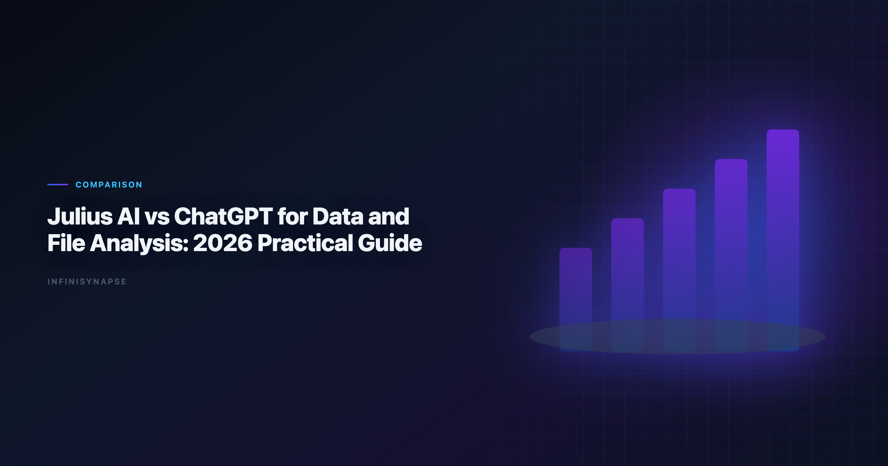
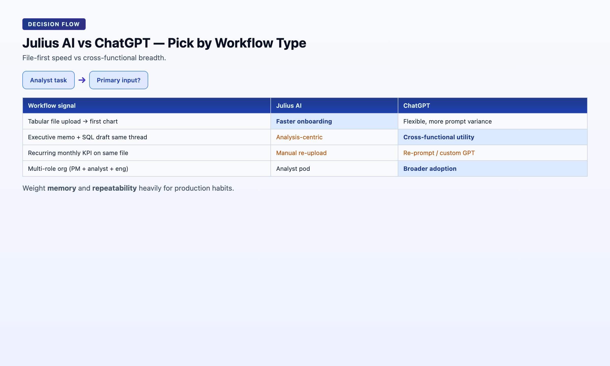

> **By the InfiniSynapse Data Team** · **Last updated: 2026-06-08** · *We evaluated these tools in production analyst workflows. *We test analyst workflows with real CSV, Excel, and PDF tasks to evaluate AI tools beyond prompt demos.*

**Meta Description**: Compare julius ai data analysis in 2026 across autonomy, SQL depth, memory, governance, and rollout fit for production analyst teams. Includes a quick FAQ.

**Slug**: `/blog/julius-ai-vs-chatgpt`

**Target keyword**: `julius ai data analysis`

---

## Table of Contents

1. [TL;DR](#tldr)
2. [What This Comparison Is Really About](#what-this-comparison-is-really-about)
3. [What Each Tool Is Designed For](#what-each-tool-is-designed-for)
4. [Five-Pillar Scorecard](#five-pillar-scorecard)
5. [Workflow Comparison: Upload to Insight](#workflow-comparison-upload-to-insight)
6. [Task Benchmark: Three Common Analyst Jobs](#task-benchmark-three-common-analyst-jobs)
7. [Buyer Fit by Team Profile](#buyer-fit-by-team-profile)
8. [Security and Governance Considerations](#security-and-governance-considerations)
9. [Decision Matrix](#decision-matrix)
10. [Rollout Guidance: 60-Day Pilot Plan](#rollout-guidance-60-day-pilot-plan)
11. [Security, Compliance, and Enterprise Deployment](#security-compliance-and-enterprise-deployment)
12. [Cost and Staffing Implications](#cost-and-staffing-implications)
13. [Common Mistakes in Stack Decisions](#common-mistakes-in-stack-decisions)
14. [Frequently Asked Questions](#frequently-asked-questions)
15. [Conclusion](#conclusion)
---

## TL;DR

> **Julius AI data analysis** is usually faster for focused file analysis workflows where an analyst wants immediate tables, charts, and notebook-style iteration from uploads. **ChatGPT** is more flexible as a general reasoning assistant that can also do file analysis, coding, writing, and planning in one workspace. For one-off spreadsheet tasks, Julius often feels more direct. For cross-functional workflows, ChatGPT is typically more versatile.

Quick take: adoption benchmarks in the [PostgreSQL documentation](https://www.postgresql.org/docs/) track the same shift we see in **Julius AI data analysis** rollouts — from ad-hoc copilots and one-off demos toward repeatable, reviewable, governed decision workflows.

- Pick Julius AI data analysis for file-first analysis speed.
- Pick ChatGPT for broader assistant use across teams.
- If you need governed recurring workflows, evaluate a dedicated data agent layer.

Every **julius ai vs chatgpt** conversation we run with analytics leads starts the same way: both tools can profile a CSV and draw a chart. The strategic question in any **julius ai vs chatgpt** evaluation is whether the workflow survives beyond a single session — and whether anyone besides the original prompter can rerun it next month.

---

> **Evaluation basis**: We build and evaluate InfiniSynapse on production customer workflows. Governance, adoption, and security context is cited inline throughout this guide—not in a standalone reference list.

Governance expectations for production analytics align with the [PostgreSQL documentation](https://www.postgresql.org/docs/), which we reference when designing reviewer checkpoints.

## What This Comparison Is Really About

| Lens | Julius AI | ChatGPT |
|---|---|---|
| Primary role | File-first analysis assistant | General AI copilot with data capability |
| Unit of work | Upload + iterative prompt loop | Prompt/session across many task types |
| Typical outcome | Chart, table, notebook-style output | Insight draft, script, chart, narrative, code |
| Governance model | Session-centric; lighter operational controls | Varies by plan; thread-based artifacts |
| Best horizon | Minutes to hours on one file | Minutes to hours across mixed tasks |

The choice in **julius ai vs chatgpt** is less about which model is "smarter" and more about where your bottleneck sits: file exploration speed vs workflow breadth. Julius AI data analysis changed what analysts can do with a spreadsheet in an afternoon. ChatGPT changed what cross-functional teams can do in a single workspace without switching tools.

---

## What Each Tool Is Designed For

- Fast upload and preview of CSV/XLSX files
- Quick chart generation with minimal prompt engineering
- Iterative analysis through natural-language prompts in a notebook-like loop

In a **julius ai vs chatgpt** pilot, Julius usually wins minute one: drag a file, ask for a distribution plot, refine. That speed is real and matters for analyst pods cleaning vendor exports daily. Still, document **julius ai vs chatgpt** second-run behavior before standardizing licenses org-wide.

**ChatGPT**

ChatGPT is a general AI assistant with data-analysis capability inside a much broader product. It is optimized for:

- Mixed workflows (analysis + writing + coding + planning)
- Broad prompting styles and custom instructions
- Team usage beyond analysts alone — product, marketing, finance, ops

When teams frame **julius ai vs chatgpt** as a head-to-head chart contest, they miss ChatGPT's strategic advantage: one subscription covers stakeholder memos, SQL drafts, and variance narratives in the same thread. Include narrative deliverables in your **julius ai vs chatgpt** scorecard, not just chart latency. Analysts wiring Sql into production reviews can follow the parallel walkthrough in [SQL Data Analysis Tools](/blog/sql-data-analysis-tools).

---

## Five-Pillar Scorecard

| Pillar | Julius AI | ChatGPT | Decision impact |
|---|---|---|---|
| **Autonomy** | Low-Medium: user drives each prompt step | Low: user drives each step across tasks | Supervision burden on recurring work |
| **Transparency** | Medium: visible outputs and generated logic | Medium: code and text visible in thread | Peer review and handoff speed |
| **Memory** | Low: session history helpful but limited | Low-Medium: context within session/custom GPTs | Metric stability across monthly cycles |
| **Multi-entry parity** | Medium: strong app/chat for analysts | Medium-High: chat, API; analytics UX varies | Cross-role access patterns |
| **Self-correction** | Low-Medium: user reroutes on failure | Low-Medium: user re-prompts on failure | Resilience on messy production files |

**Composite directional score**: Julius AI data analysis leads on file-first speed (8.5/10 for tabular onboarding). ChatGPT leads on breadth and narrative quality (8.8/10 for cross-functional utility). In practice, **julius ai vs chatgpt** debates among data leaders concentrate on memory and repeatability — those two pillars determine whether a pilot becomes a production habit or stalls when the original uploader goes on vacation. Weight those pillars heavily in any formal **julius ai vs chatgpt** RFP.

---

## Workflow Comparison: Upload to Insight

| Stage | Julius AI | ChatGPT | Why it matters |
|---|---|---|---|
| File onboarding | Purpose-built and quick for tabular uploads | Strong, but one feature among many | Determines first-session velocity |
| First visualization | Usually fast for common chart requests | Good, with more prompt variability | Determines stakeholder demo speed |
| Iterative drill-down | Notebook-like and analysis-focused | Flexible, depends on prompt quality | Determines analyst loop efficiency |
| Narrative generation | Adequate analyst summaries | Stronger long-form explanation quality | Determines executive-ready output |
| Multi-task switching | Analysis-centric | Excellent across writing, coding, planning | Determines cross-team adoption |
| Team standardization | Works for analyst pods | Better for multi-role organizations | Determines org-wide rollout shape |
| Second-run repeatability | Manual re-upload and re-prompt | Manual reprompt or custom GPT setup | Determines recurring KPI viability |

Operational maturity for analytics agents aligns with the [Google Vertex AI documentation](https://cloud.google.com/vertex-ai/docs), especially around monitoring, rollback, and ownership.

---

## Task Benchmark: Three Common Analyst Jobs
Recurring analytics loops benefit from [Wikipedia conceptual data model overview](https://en.wikipedia.org/wiki/Conceptual_data_model) patterns for scheduling, retries, and lineage hooks.

### 1) Dirty CSV cleanup and quick profiling

Prompt goal: identify null patterns, deduplicate keys, propose a clean table for downstream analysis.

- Julius AI data analysis reached a usable profile quickly with minimal steering.
- ChatGPT produced similarly good logic, with slightly more prompt engineering for chart defaults.

### 2) Executive metric variance explanation

Prompt goal: explain why MRR changed MoM and propose top three follow-up cuts.

- ChatGPT produced stronger narrative framing and stakeholder-ready wording.
- Julius AI data analysis answered correctly but with shorter interpretation depth.

### 3) Mixed file package (CSV + PDF notes)

Prompt goal: combine transaction data with policy notes and summarize action items.

- ChatGPT handled cross-format reasoning more consistently in our tests.
- Julius AI data analysis remained efficient for numerical work, but cross-document narrative was less consistent.

Result: Julius leads on pure tabular speed; ChatGPT leads on breadth and mixed reasoning. Document this split in your **julius ai vs chatgpt** routing guide so analysts know when to switch tools mid-week.

---

## Buyer Fit by Team Profile

### Strong Julius AI fit

- Solo analysts or small pods processing many vendor CSV/Excel exports weekly
- Ops teams needing quick chart and table iteration without IT tickets
- Founders and PMs who want file-first analysis without learning BI tools
- Teams where the primary input is always an uploaded spreadsheet

### Strong ChatGPT fit

- Startups using one AI tool for analysis, writing, coding, and planning
- Product + marketing + analytics collaboration in one workspace
- Teams needing strong narrative generation alongside numerical work
- Organizations already standardized on ChatGPT Enterprise for general AI

### Neither alone — add a data agent layer

- Regulated reporting with repeatable KPI definitions across multiple sources
- Recurring weekly or monthly analysis that must survive staff turnover
- Cross-system orchestration beyond file uploads (warehouse + CRM + files)

The **julius ai vs chatgpt** buyer matrix is not about picking a permanent winner. It is about assigning each tool to the workflow horizon it serves best. Share the **julius ai vs chatgpt** routing guide with every new analyst hire.

| Team stage | Primary tool | Secondary tool |
|---|---|---|
| Solo analyst / startup exploration | Julius AI or ChatGPT (preference) | — |
| Growing team with first recurring board metrics | Julius AI for files; ChatGPT for memos | Data agent pilot for recurring KPIs |
| Mid-size analytics org with governance requirements | ChatGPT for exploration | Data agent for production KPIs |
| Enterprise with compliance review | ChatGPT in approved sandbox | Data agent for auditable workflows |

---

## Security and Governance Considerations

Check these items before rollout. LLM-backed analytics should account for prompt-injection and data-exfiltration risks in the [Stanford HAI AI Index](https://hai.stanford.edu/ai-index), especially when connectors expose production schemas. Ecommerce KPI definitions should reference [Anthropic research](https://www.anthropic.com/research) when normalizing revenue and cohort metrics. Foundational warehouse concepts—grain, dimensions, and conformed metrics—remain essential; [Redis documentation](https://redis.io/docs/latest/) is a concise refresher for reviewers validating generated SQL. Foundational warehouse concepts—grain, dimensions, and conformed metrics—remain essential; [Wikipedia data quality overview](https://en.wikipedia.org/wiki/Data_quality) is a concise refresher for reviewers validating generated SQL. Foundational warehouse concepts—grain, dimensions, and conformed metrics—remain essential; [NIST Cybersecurity Framework](https://www.nist.gov/cyberframework) is a concise refresher for reviewers validating generated SQL.

1. Data retention and deletion controls for uploaded files
2. Model training policy — are uploads used to train base models?
3. Workspace-level admin and access controls
4. Audit logs for who asked what and when
5. Regional deployment or residency constraints

| Governance question | Julius AI typical answer | ChatGPT typical answer |
|---|---|---|
| Where did this number come from? | Session outputs + generated code | Thread scroll + generated code |
| Can we reproduce last month? | Manual re-upload and re-prompt | Manual reprompt or custom GPT |
| Who accessed production data? | Account-level logs vary by plan | Tenant logs vary by plan |
| Is file upload acceptable? | Core default path | Common default path |

For sensitive finance, health, or customer data, policy fit usually matters more than small UX differences in **julius ai vs chatgpt**. Neither tool eliminates your governance obligations — they only change how much workflow evidence you generate by default. Compliance teams should run a joint **julius ai vs chatgpt** review before any production upload.

---

## Decision Matrix

| Team situation | Better first choice | Rationale |
|---|---|---|
| Solo analyst cleaning many spreadsheets | Julius AI | Lower friction for file-centric loops |
| Startup using one AI tool for everything | ChatGPT | Better general-purpose utility |
| Ops team needing quick chart and table iteration | Julius AI | Tight analysis workflow |
| Product + marketing + analytics collaboration | ChatGPT | Better cross-role collaboration |
| Regulated reporting with repeatable KPI definitions | Neither alone | Add governed data-agent or BI workflow layer |
| Team moving from ad-hoc to recurring autonomous analysis | Depends | Pilot both on one recurring KPI process |
| Executive needs variance memo plus supporting charts | ChatGPT | Stronger narrative generation |
| Analyst pod lives in CSV exports from vendors | Julius AI | Fastest upload-to-chart path |

| Question | If "yes", lean toward |
|---|---|
| Is the primary input always a file upload? | Julius AI |
| Do non-analysts need the same tool for writing and analysis? | ChatGPT |
| Does the deliverable include stakeholder-ready narrative? | ChatGPT |
| Is chart speed on tabular data the main bottleneck? | Julius AI |
| Will the same analysis repeat monthly across sources? | Third platform (data agent) |
| Is individual analyst creativity the main bottleneck? | ChatGPT |

---

## Rollout Guidance: 60-Day Pilot Plan

The most successful **julius ai vs chatgpt** implementations treat the tools as complementary layers for different workflow horizons, not forced single-tool mandates. Teams standardizing governance across sources often keep [Best AI Tools for Data Analysis in 2026](/blog/best-ai-tools-for-data-analysis) beside this runbook for this topic handoffs.

### Days 1–20: Baseline and scope one recurring file workflow

- List every report that currently starts with manual spreadsheet rework or an ad-hoc AI session.
- Pick one weekly or monthly KPI that begins with a CSV or Excel export.
- Document baseline cycle time: upload to insight to stakeholder delivery.
- Run security review for both tools before uploading production data.

**Exit criteria**: pilot KPI scoped; baseline cycle time documented; governance checklist completed for both tools. If this topic is in scope for your team, reuse the same memory-and-trace checklist in [AI Data Analysis Tools](/blog/ai-data-analysis-tools).

### Days 21–40: Parallel execution

- Execute the pilot KPI in Julius AI (file-first loop) and ChatGPT (mixed-task loop).
- Compare time to first chart, narrative quality, and second-run repeatability.
- Involve a second analyst to test handoff — can they rerun without the original prompter?
- Document where each tool wins; do not force a single answer prematurely.

**Exit criteria**: both tools tested on the same KPI; handoff friction measured; reviewer signs off on data handling.

### Days 41–60: Codify the split

- Publish team guidance: Julius AI for file-first speed, ChatGPT for narrative and cross-functional work.
- If the pilot KPI must recur across multiple sources, initiate a data-agent evaluation.
- Retain both tool licenses if the team uses them for different workflow horizons.
- Schedule a 90-day revisit when recurring reporting share grows past 40% of analyst time.

**Exit criteria**: team can articulate when to use each tool; routing rules documented in analytics playbook. The **julius ai vs chatgpt** pilot succeeds when second-run repeatability is measured, not just first-session speed.

1. **Forcing one tool**: banning Julius slows file workflows; banning ChatGPT slows cross-team memos.
2. **Piloting on toy datasets**: conclusions from clean sample CSVs rarely survive production messiness.
3. **Ignoring the second run**: first-run speed often favors Julius; narrative and handoff often favor ChatGPT.
4. **Skipping governance**: upload policy matters more than chart aesthetics in regulated environments.

Re-run the **julius ai vs chatgpt** checklist when headcount changes or when recurring reporting share crosses 40% of analyst time. A quarterly **julius ai vs chatgpt** retrospective keeps routing rules current.

---

## Security, Compliance, and Enterprise Deployment

Evaluate data residency, access controls, and audit trails before standardizing on a tool category. Enterprise buyers should treat compliance evidence as a first-class selection criterion—not a late-stage checkbox.

## Cost and Staffing Implications

Model license cost, analyst time saved, and platform engineering overhead together. The cheapest seat price rarely equals the lowest total cost when governance load is included.

## Common Mistakes in Stack Decisions

Teams often over-index on demo speed, under-specify recurring KPI ownership, or skip parallel-run validation. Document these failure modes before rollout.

Cloud analytics estates should align with the [Snowflake documentation](https://docs.snowflake.com/en/) for reliability, security, and operational excellence.

Multi-source connector design should follow [Wikipedia statistics overview](https://en.wikipedia.org/wiki/Statistics) so domain boundaries and metric contracts stay explicit as scope grows.

Supabase-backed analytics should follow [PostgreSQL documentation](https://www.postgresql.org/docs/) for RLS policies, service roles, and API exposure boundaries.

## Frequently Asked Questions

### Is Julius AI built on ChatGPT?

Julius AI uses LLMs and wraps them in data-analysis workflows; ChatGPT is a general assistant with optional advanced data analysis tools.

### Which is better for CSV and Excel exploration?

Julius AI is usually faster for one-shot file exploration with charting and notebook-like outputs.

### Which is better for custom prompting and broad tasks?

ChatGPT is generally better for a wide range of writing, coding, and reasoning tasks beyond file analysis.

### Can ChatGPT replace BI tools?

No. ChatGPT can accelerate analysis but still needs governed models, metric definitions, and reproducible pipelines for production BI.

### What about data privacy and compliance?

Both can be safe with enterprise controls, but you should evaluate retention, training policy, data region, and SOC 2 commitments before uploading sensitive files.

**When should a team use a third platform?.** When recurring analysis needs multi-source connectors, persistent memory, and auditable task timelines, teams often adopt a dedicated data-agent platform.

---

## Conclusion

For **file-first analyst speed**, Julius AI is often a better immediate fit for **julius ai data analysis** workflows and recurring spreadsheet reviews. For **broader assistant utility across functions**, ChatGPT usually wins. A mature **julius ai vs chatgpt** stack assigns each tool to the workflow it serves best — Julius for tabular **julius ai data analysis** velocity, ChatGPT for narrative and cross-functional breadth.

If your organization needs repeatable, auditable workflows rather than one-off analysis chats, treat both as front-end accelerators and add an execution layer that stores memory and governance logic. Start your **julius ai vs chatgpt** evaluation with one recurring business question, measure repeatability on the second run, and document routing rules so new hires do not default to whichever tool they used in their last job. The best **julius ai vs chatgpt** outcomes come from workflow assignment, not tool loyalty.

Related reads:

| Article | URL |
|---|---|
| [Julius AI Alternatives](/blog/julius-ai-alternatives) | /blog/julius-ai-alternatives |
| [ChatGPT Data Analysis Alternatives](/blog/chatgpt-data-analysis-alternatives) | /blog/chatgpt-data-analysis-alternatives |
| [InfiniSynapse vs ChatGPT](/blog/infinisynapse-vs-chatgpt) | /blog/infinisynapse-vs-chatgpt |

Try it: [InfiniSynapse](https://app.infinisynapse.cn)