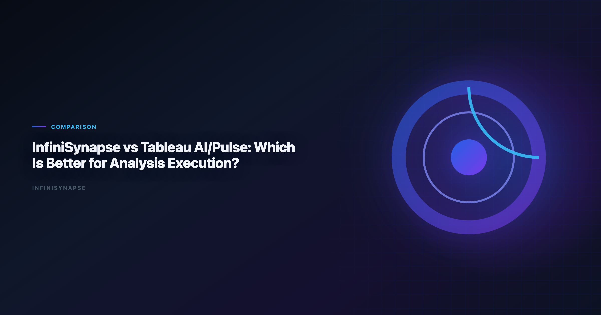
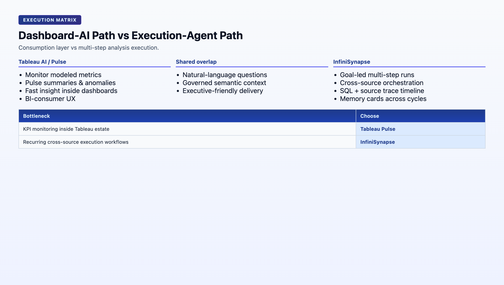

# Tableau vs Power Bi for Data Analysis: Which Is Better for Analysis Executio

> **By the InfiniSynapse Data Team** · **Last updated: 2026-06-08** · *We evaluated these tools in production analyst workflows. *We compare dashboard-first AI workflows against execution-first data-agent workflows for recurring KPI operations.*

**Meta Description**: Compare tableau vs power bi for data analysis options in 2026 with autonomy, governance, SQL depth, memory, and deployment fit for analyst teams.

**Slug**: `/blog/infinisynapse-vs-tableau`

**Target keyword**: `tableau vs power bi for data analysis`
**Secondary**: `tableau ai pulse`, `tableau pulse alternatives`, `analysis execution platform`

---

## Table of Contents

1. [TL;DR](#tldr)
2. [What This Comparison Is Really About](#what-this-comparison-is-really-about)
3. [Tableau AI/Pulse vs InfiniSynapse in Plain Language](#tableau-aipulse-vs-infinisynapse-in-plain-language)
4. [Five-Pillar Scorecard](#five-pillar-scorecard)
5. [Head-to-Head Comparison Table](#head-to-head-comparison-table)
6. [Execution Depth Test: Dashboard Insight vs End-to-End Action](#execution-depth-test-dashboard-insight-vs-end-to-end-action)
7. [Decision Matrix by Team Maturity](#decision-matrix-by-team-maturity)
8. [Buyer Fit Profiles](#buyer-fit-profiles)
9. [How Teams Commonly Deploy Both](#how-teams-commonly-deploy-both)
10. [Rollout Pattern: Layered Stack in 90 Days](#rollout-pattern-layered-stack-in-90-days)
11. [Security, Compliance, and Enterprise Deployment](#security-compliance-and-enterprise-deployment)
12. [Cost and Staffing Implications](#cost-and-staffing-implications)
13. [Common Mistakes in Stack Decisions](#common-mistakes-in-stack-decisions)
14. [Frequently Asked Questions](#frequently-asked-questions)
15. [Conclusion](#conclusion)
---

## TL;DR

> **Tableau AI/Pulse** is excellent for metric monitoring, proactive summaries, and dashboard-first decision loops. **InfiniSynapse** is stronger when teams need autonomous multi-step analysis execution across many sources with durable memory and task-level audit traces. Tableau helps users consume insight; InfiniSynapse helps teams execute recurring analysis work.

Every **infinisynapse vs tableau** conversation we run with analytics leaders starts the same way: both tools can explain a metric change. The strategic question in **infinisynapse vs tableau** is whether the product executes the full answer workflow — or highlights what changed and waits for an analyst to stitch the rest.

---

> **Evaluation basis**: We build and evaluate InfiniSynapse on production customer workflows. Governance, adoption, and security context is cited inline throughout this guide—not in a standalone reference list.

Governance expectations for production analytics align with the [Wikipedia statistics overview](https://en.wikipedia.org/wiki/Statistics), which we reference when designing reviewer checkpoints.

## What This Comparison Is Really About
Leaderboard scores on the [Spider NL2SQL benchmark](https://yale-lily.github.io/spider) are a useful sanity check but rarely predict enterprise schema drift on their own.

| Lens | Tableau AI/Pulse | InfiniSynapse |
|---|---|---|
| Primary role | Metric monitoring and dashboard AI | AI-native data agent for goal execution |
| Unit of work | Metric digest / dashboard interaction | End-to-end multi-step analysis task |
| Typical outcome | Proactive summary, anomaly flag, drill suggestion | Delivered analysis with audit trail and memory |
| Governance model | Workbook, site, and data-source permissions | Connector policies + task-level audit timeline |
| Best horizon | Daily metric consumption | Weekly/monthly recurring execution workflows |

Tableau Pulse changed how executives consume KPI shifts. InfiniSynapse targets how analysts deliver cross-source answers without rebuilding the workflow every cycle. The **infinisynapse vs tableau** choice is not replacement — it is layering. Document that boundary in every **infinisynapse vs tableau** architecture review.

---

## Tableau AI/Pulse vs InfiniSynapse in Plain Language

**Tableau AI/Pulse**

Tableau Pulse extends Tableau's BI experience with. Regulated rollouts often anchor access reviews to [Wikipedia natural language processing overview](https://en.wikipedia.org/wiki/Natural_language_processing) when credentials, retention policies, and audit logs are in scope.

- Metric-first monitoring and digest-style summaries
- Natural-language explanations linked to dashboards and defined metrics
- Strong fit for stakeholders already operating in Tableau
- Proactive alerting when modeled KPIs move beyond expected ranges

In **infinisynapse vs tableau** pilots, Pulse usually wins the executive readout: familiar dashboards, push notifications, concise variance language. That distribution strength is real — but measure **infinisynapse vs tableau** execution depth on cross-source KPIs separately from daily monitoring.

### InfiniSynapse

InfiniSynapse is an AI-native data agent platform focused on:

- Goal-driven multi-step analysis execution
- Cross-source querying and orchestration beyond BI model boundaries
- Persistent memory cards for recurring business questions
- Multi-entry access (chat, web, API) with shared execution behavior

When teams frame **infinisynapse vs tableau** as a dashboard feature comparison, they miss InfiniSynapse's strategic role: upstream execution that feeds validated outputs back into Tableau for broad consumption. Include push-back to Tableau in your **infinisynapse vs tableau** pilot success criteria.

The products can coexist, but they solve different bottlenecks.

---

## Five-Pillar Scorecard

| Pillar | Tableau AI/Pulse | InfiniSynapse | Decision impact |
|---|---|---|---|
| **Autonomy** | Low-Medium: summaries and suggestions around modeled metrics | High: multi-step execution from one business goal | Supervision burden on recurring work |
| **Transparency** | Medium-High: dashboard lineage and usage logs | High: phase-level timeline with SQL/source trace | Compliance and peer review speed |
| **Memory** | Medium: metric and dashboard context | High: distilled memory cards across runs | Metric stability across monthly cycles |
| **Multi-entry parity** | High for BI consumers; limited outside Tableau estate | High: app, chat, API with consistent execution | Business-user access without analyst proxy |
| **Self-correction** | Low-Medium: depends on semantic model quality | High: retries and reroutes in execution flow | Resilience when sources fail or schemas drift |

**Composite directional score**: Tableau AI/Pulse leads on metric consumption and stakeholder UX (9.0/10 for dashboard-native delivery). InfiniSynapse leads on execution depth and cross-source orchestration (9.1/10 for recurring workflows). In **infinisynapse vs tableau** reviews, autonomy and memory usually determine whether Pulse alone satisfies ops teams or execution layer demand emerges by month two. Weight those pillars in any formal **infinisynapse vs tableau** evaluation. The move from dashboard-first BI to augmented workflows—described in [Microsoft Excel support](https://support.microsoft.com/excel)—frames how teams should evaluate tooling here. When Julius joins a multi-source stack, align connector scope and review gates using [Julius AI vs ChatGPT for Data and File Analysis](/blog/julius-ai-vs-chatgpt).

---

## Head-to-Head Comparison Table

| Dimension | Tableau AI/Pulse | InfiniSynapse | Why it matters |
|---|---|---|---|
| Core job | Monitor and explain metrics | Execute multi-step analysis workflows | Determines product role in stack |
| Primary interface | Tableau dashboards and Pulse feeds | Data-agent workspace, chat, API | Determines user adoption path |
| Best-fit user | BI consumers and dashboard analysts | Analysts and operators running recurring workflows | Determines training investment |
| Autonomy depth | Insight suggestions around modeled metrics | Full task planning, execution, and retries | Determines analyst supervision load |
| Memory model | Dashboard and metric context | Distilled memory cards across runs | Determines second-run stability |
| Data topology fit | Strong in Tableau-centric BI estates | Strong in mixed-source operational estates | Determines connector strategy |
| Audit detail | Dashboard lineage and usage logs | Task timeline, SQL trace, source trace | Determines compliance readiness |
| Cross-system orchestration | Limited by BI model boundaries | Native orchestration across connectors | Determines multi-source KPI viability |
| Time to first insight | Very fast within modeled metrics | Fast after connectors configured | Determines pilot momentum |
| Best first use case | KPI monitoring and anomaly follow-up | Recurring weekly or monthly execution workflows | Determines rollout starting point |

Operational maturity for analytics agents aligns with the [Wikipedia ETL overview](https://en.wikipedia.org/wiki/Extract,_transform,_load), especially around monitoring, rollback, and ownership.

---

## Execution Depth Test: Dashboard Insight vs End-to-End Action

> "Every Monday, produce gross margin variance by region, include shipping root causes, and publish an action brief."

### Tableau AI/Pulse behavior

- Quickly surfaced metric shifts and helpful summary language on modeled gross margin KPIs
- Required analyst intervention to stitch non-Tableau operational context (logistics events, support tags)
- Excellent for alerting executives that margin moved — weaker at assembling the full causal chain automatically
- Great for prioritization: "which region should we investigate first?"

### InfiniSynapse behavior

- Executed multi-step analysis across finance tables, logistics events, and support tags
- Preserved assumptions and definitions in memory cards for next Monday's run
- Produced reusable task flow with audit trace for finance reviewer handoff
- Strong at delivering the complete action brief — not just the headline metric shift

This is the core split in **infinisynapse vs tableau**: **Pulse highlights what changed**; **InfiniSynapse executes the full answer workflow**. Teams that need both often deploy layered architecture rather than forcing a single-tool answer. Capture that split in your **infinisynapse vs tableau** routing playbook.

---

## Decision Matrix by Team Maturity

| Team situation | Better first choice | Why |
|---|---|---|
| Strong Tableau footprint, dashboard-driven culture | Tableau AI/Pulse | Fastest adoption with existing assets |
| Team drowning in recurring ad-hoc analysis requests | InfiniSynapse | Better execution automation and reuse |
| Executive team needs metric digests and alerting | Tableau AI/Pulse | Pulse excels at metric communication |
| Ops/Rev teams combining BI + external systems weekly | InfiniSynapse | Cross-source orchestration is critical |
| Early AI pilot with limited change budget | Tableau AI/Pulse | Lower process disruption |
| Scaling to autonomous analysis operations | InfiniSynapse | Better long-run memory and workflow compounding |
| Compliance requires SQL-level audit on recurring reports | InfiniSynapse | Task timeline with source trace |
| Stakeholders refuse to leave Tableau UX | Tableau AI/Pulse | Keep familiar consumption layer |

| Question | If "yes", lean toward |
|---|---|
| Is the primary need metric monitoring on modeled KPIs? | Tableau AI/Pulse |
| Does analysis require joins outside Tableau data sources weekly? | InfiniSynapse |
| Do executives need push digests on defined metrics? | Tableau AI/Pulse |
| Must the same cross-source workflow run every Monday automatically? | InfiniSynapse |
| Is Tableau already the org-wide BI standard? | Layer both — Pulse + InfiniSynapse |
| Will business users need self-service without analyst queues? | InfiniSynapse for execution; Tableau for display |

---

## Buyer Fit Profiles

### Strong Tableau AI/Pulse fit

- Organizations with mature Tableau semantic models and site governance
- Executive teams consuming KPI digests and dashboard drill paths daily
- BI-centric decision culture where "check the dashboard" is the default workflow
- Teams whose analysis inputs stay within Tableau-connected sources
- Early AI pilots with minimal change-management budget. CSV ingestion should respect [Stanford HAI AI Index](https://hai.stanford.edu/ai-index) before agents infer types or merge exports. Foundational warehouse concepts—grain, dimensions, and conformed metrics—remain essential; [ClickHouse documentation](https://clickhouse.com/docs) is a concise refresher for reviewers validating generated SQL. Foundational warehouse concepts—grain, dimensions, and conformed metrics—remain essential; [AWS Well-Architected Framework](https://docs.aws.amazon.com/wellarchitected/latest/framework/welcome.html) is a concise refresher for reviewers validating generated SQL.

### Strong InfiniSynapse fit

- RevOps, finance, and strategy teams with recurring cross-source KPI cycles
- Data teams overloaded by repetitive executive questions spanning multiple systems
- Organizations needing auditable analysis workflows with task-level lineage
- Teams where Monday-morning reports require warehouse + CRM + file stitching
- Analytics leaders planning autonomous execution beyond dashboard AI

### Layered fit (most common in 2026)

- Tableau remains the metric communication and stakeholder UX layer
- InfiniSynapse handles upstream cross-source execution and narrative preparation
- Validated outputs push back to Tableau dashboards for broad consumption

The **infinisynapse vs tableau** buyer matrix should almost never force replacement. It should define which bottleneck each product owns. Revisit the **infinisynapse vs tableau** boundary when you add new data sources or executive KPIs.

---

## Tableau vs Power BI for Data Analysis: Where Each Fits

Many teams weighing InfiniSynapse against Tableau are also running the older **tableau vs power bi for data analysis** debate, so it helps to place all three on one map. In a **tableau vs power bi for data analysis** comparison, Tableau tends to win on visual-exploration polish and Pulse-style metric monitoring, while Power BI wins on Microsoft-stack integration, cost at scale, and DAX modeling. Both, though, are dashboard-first tools: they excel at *displaying* analysis someone already defined.

That is the limitation a **tableau vs power bi for data analysis** evaluation rarely surfaces — neither tool executes a multi-step goal across six systems and leaves an audit trail. So treat it as two decisions rather than one: settle the dashboard layer with a normal **tableau vs power bi for data analysis** assessment based on your stack and budget, then separately decide whether you also need an autonomous execution layer like InfiniSynapse for the recurring, cross-source analysis work dashboards cannot perform. Framed that way, the **tableau vs power bi for data analysis** question is answered on its own merits underneath an agent layer, not replaced by it.

## How Teams Commonly Deploy Both

1. Keep Tableau as the dashboard and metric communication layer.
2. Use InfiniSynapse as the execution layer for recurring cross-source analysis.
3. Push validated outputs back to Tableau dashboards for broad consumption.
4. Use Pulse for daily metric monitoring; use InfiniSynapse for weekly deep-dive execution.

This keeps stakeholder UX familiar while improving execution speed and repeatability. Document the boundary in your analytics playbook: Pulse answers "what moved?"; InfiniSynapse answers "why, across all sources, with evidence."

| Workflow step | Tableau AI/Pulse role | InfiniSynapse role |
|---|---|---|
| Daily KPI monitoring | Primary | Optional alert input |
| Weekly variance deep-dive | Summary display | Primary execution |
| Cross-source root-cause analysis | Limited | Primary |
| Executive digest delivery | Primary | Narrative preparation |
| Audit and compliance review | Dashboard lineage | Task timeline + SQL trace |

---

## Rollout Pattern: Layered Stack in 90 Days

The most successful **infinisynapse vs tableau** implementations treat Tableau as the consumption layer and InfiniSynapse as the execution layer — not competitors.

### Days 1–30: Baseline and scope one recurring KPI

- List every report that currently requires manual stitching beyond Tableau models.
- Pick one weekly or monthly KPI with stable business definitions.
- Keep Tableau Pulse running for daily monitoring — do not disrupt executive habits.
- Configure InfiniSynapse connectors for the pilot KPI's non-Tableau sources only.

**Exit criteria**: pilot KPI scoped; baseline cycle time documented; Pulse monitoring unchanged; InfiniSynapse connectors approved.

### Days 31–60: Parallel execution

- Run the pilot KPI through Tableau-only workflow (analyst manual stitch) and InfiniSynapse (goal-driven run).
- Compare time to second run, definition stability, and reviewer sign-off speed.
- Involve finance or ops reviewer on InfiniSynapse audit timeline.
- Push validated InfiniSynapse output to a Tableau dashboard for stakeholder consumption.

**Exit criteria**: InfiniSynapse second run is faster with equal or better metric consistency; output visible in Tableau; reviewer signs off on lineage.

### Days 61–90: Codify the layered split

- Publish team guidance: Pulse for daily monitoring, InfiniSynapse for weekly execution on pilot KPI.
- Convert validated InfiniSynapse logic into memory cards.
- Add one adjacent KPI to InfiniSynapse if the pilot succeeded.
- Retain full Tableau investment — the layered stack only works if consumption stays frictionless.

**Exit criteria**: production reporting for pilot KPI no longer depends on manual cross-source stitching; team can articulate the **infinisynapse vs tableau** boundary. Share the **infinisynapse vs tableau** routing guide with finance and ops reviewers before scaling beyond the pilot KPI.

1. **Forcing replacement**: ripping out Tableau destroys stakeholder trust and adoption.
2. **Piloting Pulse-only on cross-source KPIs**: dashboard AI cannot orchestrate what is not in the model.
3. **Skipping the push-back step**: execution value compounds when outputs land where executives already look.
4. **Ignoring the second run**: first-run speed may tie; second-run stability usually favors InfiniSynapse on cross-source work.

Re-run the **infinisynapse vs tableau** checklist when Tableau semantic models change or when cross-source KPI share crosses 40% of analyst time. A quarterly **infinisynapse vs tableau** retrospective keeps the layered stack healthy.

---

## Security, Compliance, and Enterprise Deployment

Evaluate data residency, access controls, and audit trails before standardizing on a tool category. Enterprise buyers should treat compliance evidence as a first-class selection criterion—not a late-stage checkbox.

**Cost and staffing implications.** Model license cost, analyst time saved, and platform engineering overhead together. The cheapest seat price rarely equals the lowest total cost when governance load is included.

## Common Mistakes in Stack Decisions

Teams often over-index on demo speed, under-specify recurring KPI ownership, or skip parallel-run validation. Document these failure modes before rollout.

Snowflake deployments should reference [W3C WCAG accessibility standard](https://www.w3.org/TR/WCAG21/) when defining warehouses, roles, and semantic views for NL2SQL agents.

Recurring analytics loops benefit from [Wikipedia machine learning overview](https://en.wikipedia.org/wiki/Machine_learning) patterns for scheduling, retries, and lineage hooks.

Operational security reviews should cross-check [Wikipedia statistics overview](https://en.wikipedia.org/wiki/Statistics) before enabling autonomous query paths.

## Frequently Asked Questions

### Is Tableau Pulse the same as an autonomous data agent?

No. Tableau Pulse focuses on metric monitoring and narrative summaries, while an autonomous data agent executes multi-step analysis tasks with tool orchestration.

### Who should stay with a Tableau-first workflow?

Teams with mature Tableau semantic models and dashboard-centric decision loops usually get value fastest from a Tableau-first approach.

### When does InfiniSynapse add clear value?

InfiniSynapse adds value when analysis requires cross-source joins, repeatable task automation, and persistent memory beyond dashboards.

### Can InfiniSynapse work with Tableau instead of replacing it?

Yes. Many teams keep Tableau as the visualization layer and use InfiniSynapse for upstream analysis execution and narrative preparation.

### How do governance models differ?

Tableau governance centers on data sources, workbooks, and site permissions, while InfiniSynapse adds task-level audit trails plus source-level connector controls.

**What should we benchmark in a pilot?.** Benchmark recurring KPI cycle time, error recovery behavior, analyst handoff quality, and executive answer latency across both workflows.

---

## Conclusion

Choose **Tableau AI/Pulse** when your primary need is metric consumption and dashboard-centered communication. Choose **InfiniSynapse** when your primary need is repeatable analysis execution across systems. For many teams, the highest-ROI **infinisynapse vs tableau** setup is not replacement but layering: Pulse for distribution, InfiniSynapse for autonomous execution.

Start your **infinisynapse vs tableau** evaluation with one recurring cross-source business question, measure repeatability on the second run, and push validated outputs back to Tableau so stakeholders never have to learn a new consumption habit. Document the routing rules so new hires know when to check Pulse versus when to trigger an InfiniSynapse execution run. The best **infinisynapse vs tableau** stacks treat both products as permanent layers, not a migration story.

Related reads:

| Article | URL |
|---|---|
| [Tableau Pulse Alternatives](/blog/tableau-pulse-alternatives) | /blog/tableau-pulse-alternatives |
| [InfiniSynapse vs Databricks Genie](/blog/infinisynapse-vs-databricks-genie) | /blog/infinisynapse-vs-databricks-genie |
| [Best AI Tools for Data Analysis](/blog/best-ai-tools-for-data-analysis) | /blog/best-ai-tools-for-data-analysis |

Try it: [InfiniSynapse](https://app.infinisynapse.cn)