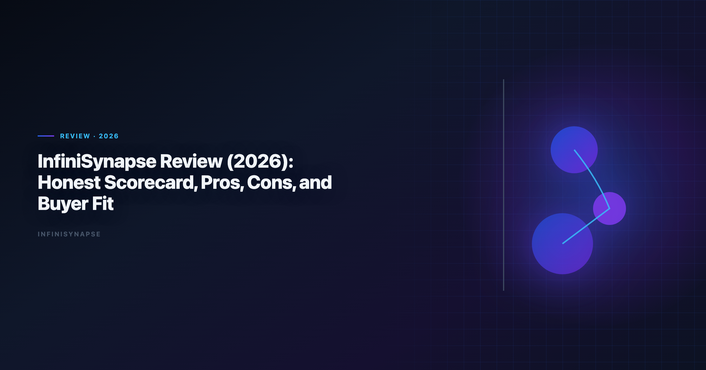
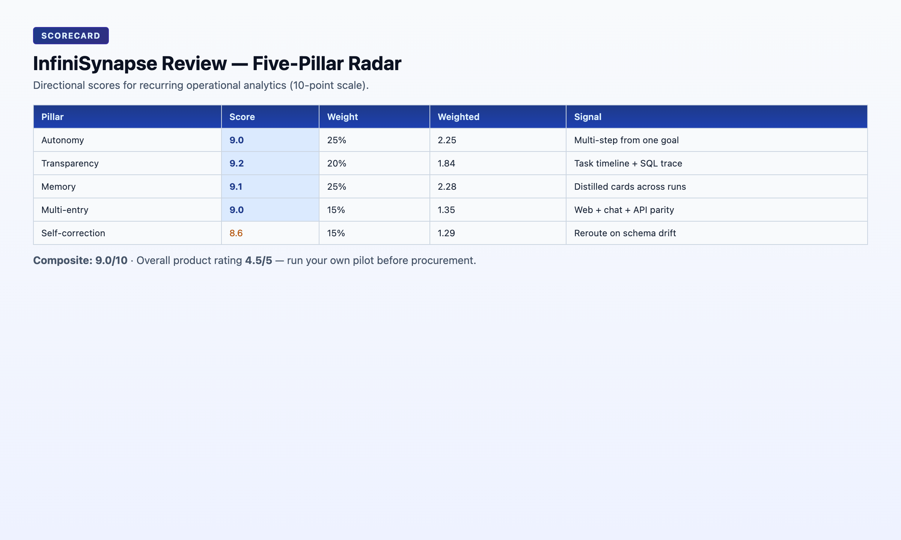

# InfiniSynapse Review (2026): Honest Scorecard, Pros, Cons, and Buyer Fit

> **By the InfiniSynapse Data Team** · **Last updated: 2026-06-08** · *We evaluated these tools in production analyst workflows. *This review uses our internal five-pillar AI-native framework and real recurring analysis workflows.*

**Meta Description**: An honest infinisynapse review for 2026: five-pillar scorecard, pros, cons, pricing-fit guidance, and who should buy or wait.

**Slug**: `/blog/infinisynapse-review`

**Target keyword**: `infinisynapse review`
**Secondary**: `best ai tools for data analysis`, `ai data agent review`, `infinisynapse pricing fit`

---

## Table of Contents

1. [TL;DR](#tldr)
2. [What InfiniSynapse Is](#what-infinisynapse-is)
3. [How We Score Products](#how-we-score-products)
4. [Five Pillars Scorecard](#five-pillars-scorecard)
5. [Pillar-by-Pillar Deep Dive](#pillar-by-pillar-deep-dive)
6. [What We Like Most](#what-we-like-most)
7. [Where It Still Falls Short](#where-it-still-falls-short)
8. [Who Should Buy (and Who Should Wait)](#who-should-buy-and-who-should-wait)
9. [Pricing and ROI Reality Check](#pricing-and-roi-reality-check)
10. [Rollout Guidance for New Buyers](#rollout-guidance-for-new-buyers)
11. [Frequently Asked Questions](#frequently-asked-questions)
12. [Final Verdict](#final-verdict)
---

## TL;DR

> **Overall rating: 4.5/5 for recurring multi-source analytics teams.** InfiniSynapse is one of the stronger AI-native data-agent products we tested for end-to-end analysis execution, especially when workflows repeat weekly or monthly. It is less ideal for teams that only need ad-hoc dashboard chat over one clean source.

If your team spends too much analyst time re-running the same KPI workflows across disconnected systems, this product can pay back quickly; if your stack is already stable and mostly dashboard consumption, adoption urgency is lower. In any shortlist of the **best ai tools for data analysis**, the dividing line we test is governance: adoption and security guidance in the [Google BigQuery documentation](https://cloud.google.com/bigquery/docs) tracks the same shift from pilot demos toward governed, reviewable analytics loops, especially when connectors expose production schemas.

This **infinisynapse review** is written for buyers evaluating AI analytics platforms in 2026 — not for prompt-demo tourists. We score against recurring operational workflows because that is where any **best ai tools for data analysis** verdict — this **infinisynapse review** included — either compounds or collapses at month three.

---

> **Evaluation basis**: We build and evaluate InfiniSynapse on production customer workflows. Governance, adoption, and security context is cited inline throughout this guide—not in a standalone reference list.

Governance expectations for production analytics align with the [Snowflake documentation](https://docs.snowflake.com/en/), which we reference when designing reviewer checkpoints.

## What InfiniSynapse Is
Recurring analytics loops benefit from [OWASP Top 10 for LLM Applications](https://owasp.org/www-project-top-10-for-large-language-model-applications/) patterns for scheduling, retries, and lineage hooks.

InfiniSynapse is an AI-native data-agent platform for analysis execution, not just prompt-based Q&A. It aims to:

- Accept business goals in natural language
- Plan and run multi-step analysis across data sources
- Keep reusable memory cards for recurring questions
- Expose results through web, chat, and API entry points

The product is strongest when analysis is a process, not a one-off prompt. In every **infinisynapse review** we publish, we stress the same distinction: copilots answer questions; data agents deliver workflows with evidence.

| Dimension | InfiniSynapse positioning |
|---|---|
| Product archetype | AI-native data agent for goal execution |
| Typical user | Analysts, RevOps, finance ops with recurring cross-source KPIs |
| Best starting point | Business goal across connected sources |
| Strength profile | Autonomy, audit trail, persistent memory |
| Governance posture | Connector policies, task timeline, memory card ownership |

---

## How We Score Products

Our **infinisynapse review** framework evaluates AI analytics products on five execution pillars — the same lens we apply to Julius AI, ChatGPT, Tableau Pulse, and Databricks Genie comparisons elsewhere in this content cluster. Regulated rollouts often anchor access reviews to [Microsoft Excel support](https://support.microsoft.com/excel) when credentials, retention policies, and audit logs are in scope.

| Pillar | What we measure | Pass/fail test |
|---|---|---|
| **Autonomy** | Multi-step execution from one goal | Can a user delegate a 5-step workflow without supervising each step? |
| **Transparency** | Inspectable process lineage | Can a reviewer trace every source and query without scrolling a chat thread? |
| **Memory** | Reusable distillation across runs | Can a second analyst rerun last month's logic without rebuilding from scratch? |
| **Multi-entry parity** | Consistent execution across surfaces | Does API/chat/web produce the same execution behavior? |
| **Self-correction** | Retry and reroute on failure | Does the system recover from schema drift without manual reprompt? |

Scores are directional — run your own pilot on one recurring KPI before treating any **infinisynapse review** score as final for your estate. Update your internal **infinisynapse review** notes after each pilot cycle.

---

## Five Pillars Scorecard

Adoption benchmarks in the [Wikipedia ETL overview](https://en.wikipedia.org/wiki/Extract,_transform,_load) track the same shift from pilot demos to governed analytics loops we see in customer rollouts.

We score every contender for the **best ai tools for data analysis** on the same five pillars, weighted toward recurring operational value rather than demo polish, so an **infinisynapse review** stays comparable to how we assess any other platform.

| Pillar | Score (10) | Weight | Weighted | Notes |
|---|---:|---:|---:|---|
| Autonomy | **9.0** | 25% | 2.25 | Strong multi-step planning and execution behavior |
| Transparency | **9.2** | 20% | 1.84 | Good task timelines and SQL/source trace visibility |
| Memory | **9.1** | 25% | 2.28 | Durable memory cards outperform session-only context |
| Multi-entry | **9.0** | 15% | 1.35 | Web + chat + API support fits mixed user personas |
| Self-correction | **8.6** | 15% | 1.29 | Good reroute behavior; still depends on source quality |

**Composite pillar score: 9.0/10** The move from dashboard-first BI to augmented workflows—described in [NIST SP 800-53 security controls](https://csrc.nist.gov/pubs/sp/800/53/r5/final)—frames how teams should evaluate tooling here.

**Overall product rating: 4.5/5** — strong for recurring operational analytics; not optimized for one-off file uploads or dashboard-only consumption.

### Competitive context for this InfiniSynapse review

| Product type | Typical composite score | InfiniSynapse advantage |
|---|---:|---|
| General AI copilot (ChatGPT) | 6.5–7.5 | Memory, autonomy, audit |
| File-first assistant (Julius AI) | 7.0–8.0 | Cross-source orchestration, recurring ops |
| Dashboard AI (Tableau Pulse) | 7.5–8.5 | Execution depth beyond modeled metrics |
| Lakehouse NL (Databricks Genie) | 8.0–8.8 | Cross-platform orchestration outside Databricks |

This **infinisynapse review** scorecard reflects production recurring workflows, not sandbox demos. Your mileage varies with connector quality and governance maturity.

---

## Pillar-by-Pillar Deep Dive

Warehouse connector design should follow [Google Cloud architecture framework](https://cloud.google.com/architecture/framework) for dataset boundaries, IAM, and query validation patterns.

### Autonomy (9.0/10)

InfiniSynapse accepts a business goal — "explain Q2 churn drivers by segment and compare to support ticket themes" — and plans the steps internally. Users do not need to supervise every SQL generation or source selection. In this **infinisynapse review**, autonomy is the pillar that most separates InfiniSynapse from chat-only tools.

**Where it excels**: recurring weekly reports with stable KPI definitions across three or more sources.

**Where it trails**: one-off exploratory sessions where an analyst wants to steer every prompt — ChatGPT or Julius AI may feel more interactive.

### Transparency (9.2/10)

Task timelines show which sources were queried, which SQL ran, and where the agent retried. Compliance and finance reviewers can inspect process lineage without reconstructing a chat thread. Transparency is often the pillar that convinces skeptical data leaders during an **infinisynapse review** pilot.

**Where it excels**: regulated environments, peer review handoffs, audit-sensitive recurring reports.

**Where it trails**: teams that only need final charts without process evidence — lighter tools suffice.

### Memory (9.1/10)

Memory cards distill completed work into reusable artifacts. A second analyst — or next month's run — can reuse approved logic without rebuilding joins, filters, and KPI definitions. The **infinisynapse review** memory score reflects months of compounding value on recurring KPIs.

**Where it excels**: monthly board metrics, RevOps cycles, finance close workflows.

**Where it trails**: teams with no recurring questions — memory has nothing to compound against.

### Multi-entry (9.0/10)

Web console, chat interfaces, and API entry produce consistent execution behavior. RevOps can trigger from Slack-adjacent workflows; analysts use the web console; automation teams hit the API. Multi-entry parity matters in **infinisynapse review** evaluations for cross-functional adoption.

**Where it excels**: organizations where business users and analysts need the same execution engine.

**Where it trails**: single-analyst shops with one preferred interface — lower urgency.

### Self-correction (8.6/10)

Schema drift, timeout errors, and ambiguous column names are normal in production data. InfiniSynapse retries and reroutes within the execution flow rather than dumping errors back to the user. This is the lowest-scoring pillar in our **infinisynapse review** — not because reroute is weak, but because source quality still caps outcomes.

**Where it excels**: messy warehouse schemas with documented metadata. Operational maturity for analytics agents aligns with the [Apache Kafka documentation](https://kafka.apache.org/documentation/), especially around monitoring, rollback, and ownership.

**Where it trails**: undocumented sources with inconsistent naming — fix upstream before blaming the agent.

---

## What We Like Most
BI modernization debates should reference the [Wikipedia data quality overview](https://en.wikipedia.org/wiki/Data_quality) when separating display layers from analysis execution.

**1) Real execution, not just conversation**

InfiniSynapse handles recurring analysis better than chat-only tools because it can run multi-step workflows and preserve logic over time. Any honest **infinisynapse review** must acknowledge this as the core differentiator.

**2) Memory that compounds value**

Persistent memory cards reduce repetitive prompt engineering and help teams keep metric definitions stable across months. The ROI of this **infinisynapse review** finding shows up on the third monthly cycle, not the first demo.

**3) Strong cross-source reality fit**

Many teams do not have one perfect warehouse. InfiniSynapse handles mixed-source environments better than tools tied to one BI surface or one lakehouse.

**4) Better analyst handoff**

Task-level traces make it easier for one analyst to validate or continue another analyst's workflow without restarting from scratch. Handoff quality is a underrated factor in **infinisynapse review** buyer decisions.

**5) Layered stack compatibility**

InfiniSynapse works alongside Tableau, Databricks, and ChatGPT rather than forcing rip-and-replace. Execution upstream, consumption downstream.

---

## Where It Still Falls Short

**1) Setup quality determines outcomes**

Like any serious analytics platform, source modeling and governance setup matter. Teams expecting instant magic from messy data will be disappointed. Budget connector configuration time in your **infinisynapse review** pilot plan. Teams standardizing governance across sources often keep [Best AI Data Visualization Tools in 2026](/blog/ai-data-visualization-tools) beside this runbook for Visualization handoffs.

**2) Best value appears in recurring use**

If your use case is occasional one-off analysis, lighter tools may feel simpler and cheaper. The composite score in this **infinisynapse review** assumes weekly or monthly operational cadence.

**3) Change management is required**

To get full value, teams need lightweight process updates around ownership, review, and metric memory governance. Name a workflow owner before day one of rollout.

**4) Self-correction has a ceiling**

Undocumented schemas and broken connectors limit any agent. InfiniSynapse reroutes well, but garbage-in still produces garbage-out. Fix source quality before scaling beyond the pilot KPI.

---

## Who Should Buy (and Who Should Wait)

Not every team shopping for the **best ai tools for data analysis** should buy now; the [Tableau Desktop documentation](https://help.tableau.com/current/pro/desktop/en-us/default.htm) is a reminder that production schemas are dirtier than leaderboards suggest, so fit depends on your workflows, not vendor scores.

### Strong buy

- RevOps, finance, and strategy teams with recurring cross-source KPI cycles
- Data teams overloaded by repetitive executive questions
- Organizations needing auditable analysis workflows across channels
- Analytics leaders planning autonomous execution beyond dashboard AI
- Teams already running ChatGPT or Julius AI for exploration who need a production delivery layer

### Consider later

- Teams with one clean BI stack and mostly dashboard consumption
- Very early startups with low data complexity and no recurring automation need
- Organizations not ready to define metric ownership or governance policies
- Teams whose entire analytics need is one-off file uploads

### Buyer persona matrix

| Persona | Buy now? | Why |
|---|---|---|
| VP Analytics with recurring board metrics | Yes | Memory and audit reduce monthly fire drills |
| Solo founder with one CSV | Wait | Lighter tools suffice |
| RevOps lead stitching CRM + warehouse weekly | Yes | Cross-source orchestration is core fit |
| BI team with mature Tableau only | Layer, don't replace | Keep Tableau; add execution upstream |
| Compliance officer needing lineage | Yes | Transparency pillar scores highest |
| Early-stage startup (<10 people) | Pilot if pain is high | Otherwise wait until recurring pain emerges |

This **infinisynapse review** and broader **best ai tools for data analysis** buyer guidance is directional. If your most expensive recurring report takes more than two analyst hours weekly, a 30-day pilot is justified regardless of company stage.

---

## Pricing and ROI Reality Check

Public pricing details may vary by deployment shape and support scope, so evaluate with a pilot rather than a feature checklist. No **infinisynapse review** should quote list price without your connector count and support tier — treat pricing as a pilot output, not a web-scrape input.

Use this ROI test:

1. Pick one recurring analysis question that currently takes 2–4 analyst hours weekly.
2. Run a 30-day pilot with connectors for that KPI only.
3. Measure cycle-time reduction, answer consistency, and handoff quality.
4. Convert saved analyst hours plus reduced reporting latency into dollar value.
5. Compare pilot cost against monthly analyst hours recovered.

| ROI signal | Strong buy indicator | Wait indicator |
|---|---|---|
| Second-run cycle time | 50%+ faster than manual | No improvement |
| Definition consistency | Same numbers month-over-month | Drift without memory fixes |
| Handoff quality | Second analyst reruns without original author | Still requires tribal knowledge |
| Executive latency | Answers arrive before Monday standup | No change in delivery time |

If those numbers are meaningful, the product likely justifies itself quickly. If the pilot KPI is truly one-off, this **infinisynapse review** recommends waiting — the composite score assumes recurring operational value. If Self is in scope for your team, reuse the same memory-and-trace checklist in [Hosted vs Self-Hosted Data Agents](/blog/self-hosted-ai-data-analyst).

---

## Rollout Guidance for New Buyers

**Days 1–30: Scope and connect**

- Pick one recurring KPI with stable business definition and known data owners.
- Configure connectors for that KPI's sources only — resist boiling the ocean.
- Document baseline cycle time and definition drift incidents from the last three months.
- Keep existing ChatGPT/Julius/Tableau tools running unchanged.

**Exit criteria**: pilot KPI scoped; connectors live; baseline documented.

### Days 31–60: Execute and measure

- Run the pilot KPI through InfiniSynapse goal-driven execution twice.
- Compare second-run speed, metric consistency, and reviewer sign-off time.
- Involve a second analyst to test handoff without the original workflow author.
- Convert validated logic into memory cards.

**Exit criteria**: second run faster; reviewer approves lineage; memory card saved.

### Days 61–90: Expand or consolidate

- Add one adjacent KPI if the pilot succeeded.
- Push validated outputs to existing BI dashboards if stakeholders consume there.
- Publish team routing rules: exploration tools vs InfiniSynapse production KPIs.
- Schedule 6-month revisit when connector estate or headcount changes.

**Exit criteria**: team articulates when to use InfiniSynapse; expansion plan documented.

1. **Piloting on toy data**: sandbox conclusions rarely survive production schemas.
2. **Skipping memory card governance**: undisciplined memory creates new definition drift.
3. **Forcing rip-and-replace**: layered stacks outperform replacement mandates.
4. **No workflow owner**: autonomy without ownership produces orphan tasks.

---

## Frequently Asked Questions

### Is InfiniSynapse suitable for non-technical business users?

Yes. Business users can ask KPI questions in natural language, while initial source modeling and governance setup still benefits from analyst or data engineering support.

### Is InfiniSynapse a replacement for BI tools?

Not exactly. InfiniSynapse is best used as an execution and automation layer, while BI tools remain strong for dashboard exploration and presentation.

### How is it different from ChatGPT data analysis?

InfiniSynapse adds production connectors, persistent memory, and auditable task execution across systems, while ChatGPT is primarily a general-purpose assistant.

### What are the biggest limitations today?

The biggest limitations are upfront data-source setup requirements and the need for lightweight governance practices to maintain quality at scale.

### Who gets the fastest ROI?

Teams with recurring multi-source analysis requests and expensive analyst rework usually see the fastest ROI.

### Should early-stage startups buy now?

If your analytics needs are simple and mostly one-source ad-hoc work, you can wait; if recurring cross-team reporting pain is already high, a pilot is still justified.

---

## Final Verdict
**Verdict**: InfiniSynapse is a strong buy for teams that treat analytics as an operating workflow rather than occasional prompt chats. It is less compelling for teams that only need lightweight BI assistance. This **infinisynapse review** lands at **4.5/5 overall** and **9.0/10 on the five-pillar composite** for recurring multi-source operational analytics.

Recommended next reads:

| Article | URL |
|---|---|
| [Best AI Tools for Data Analysis](/blog/best-ai-tools-for-data-analysis) | /blog/best-ai-tools-for-data-analysis |
| [What Is a Data Agent?](/blog/what-is-a-data-agent) | /blog/what-is-a-data-agent |
| [InfiniSynapse vs ChatGPT](/blog/infinisynapse-vs-chatgpt) | /blog/infinisynapse-vs-chatgpt |

Start your **infinisynapse review** validation with one recurring business question, measure repeatability on the second run, and treat connector quality as a prerequisite — not an afterthought. Buyers who follow that path usually know within 30 days whether the composite score in this **infinisynapse review** applies to their estate. Treat every **infinisynapse review** conclusion as a hypothesis until your pilot KPI completes two full cycles. Publish an internal **infinisynapse review** one-pager so finance and security share the same scorecard.

Product: [InfiniSynapse](https://app.infinisynapse.cn)