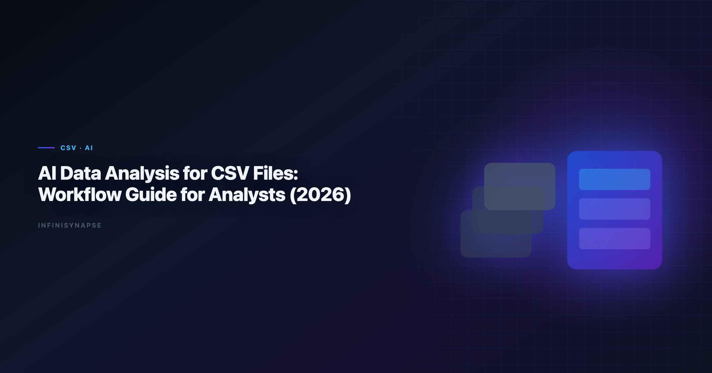

# AI Data Analysis for CSV Files: Connector Playbook (2026)

> **InfiniSynapse Data Team · Last updated: 2026-06-09 · We build InfiniSynapse connectors**



**Meta Description**: AI data analysis for CSV files in 2026: connector setup, governance controls, validation SQL, memory cards, and an FAQ for analyst teams. See real examples.

**Slug**: `/blog/ai-data-analysis-csv-files`

**Target keyword**: `ai data analysis for csv files`

---

## Table of Contents

1. [TL;DR](#tldr)
2. [Key Definition](#key-definition)
3. [Why this connector matters in 2026](#why-this-connector-matters-in-2026)
4. [Setup checklist](#setup-checklist)
5. [Step-by-step implementation](#step-by-step-implementation)
6. [Security and governance](#security-and-governance)
7. [Example queries and validation flow](#example-queries-and-validation-flow)
8. [Operating model inside InfiniSynapse](#operating-model-inside-infinisynapse)
9. [Troubleshooting Connector Rollouts](#troubleshooting-connector-rollouts)
10. [Operational Readiness Notes](#operational-readiness-notes)
11. [Implementation Lessons](#implementation-lessons)
12. [Stakeholder Communication Patterns](#stakeholder-communication-patterns)
13. [Review Cadence and Metrics](#review-cadence-and-metrics)
14. [Frequently Asked Questions](#frequently-asked-questions)
15. [Conclusion](#conclusion)
---

## TL;DR

> In 2026, successful teams running **ai data analysis for csv files** build around connector quality, memory-backed metric definitions, and inspectable SQL trace. This guide shows how to run **ai data analysis for csv files** with CSV files in InfiniSynapse, an AI-native Data Agent for multi-source connector workflows.

Many teams begin **ai data analysis for csv files** with a single prompt and a single chart. That approach looks fast but often fails in recurring operating reviews. InfiniSynapse keeps **ai data analysis for csv files** durable by linking connector setup, data quality checks, memory cards, and SQL trace into one execution timeline. The result is not only faster iteration but also better accountability when leaders ask why a number changed.

This article is optimized for database and file connector workflows. You will get a full setup checklist, governance controls, example SQL, and a repeatable execution pattern for **ai data analysis for csv files** that can survive cross-functional scrutiny.

---

## Key Definition

> **Key Definition**: **ai data analysis for csv files** is the practice of transforming business questions into governed analytical workflows using connectors, memory, and SQL trace evidence.

A practical definition of **ai data analysis for csv files** includes three properties. First, connector boundaries must be explicit so analysts know which sources are in scope. Second, memory has to preserve business definitions across recurring reporting cycles. Third, SQL trace needs to remain reviewable so assumptions and transformations are inspectable before executive distribution. The credential, preflight, and SQL-trace pattern above also applies to Bigquery—see [How to Connect BigQuery to an AI Data Analyst in…](/blog/connect-bigquery-to-ai-data-analyst) for source-specific steps.

InfiniSynapse is built around those properties. It treats **ai data analysis for csv files** as an operating capability rather than a one-time generation task. Teams using this model can move faster without losing governance posture, because each run preserves enough context to be repeated and audited.

---

## Why this connector matters in 2026

Enterprise adoption trends in the [AWS Well-Architected Framework](https://docs.aws.amazon.com/wellarchitected/latest/framework/welcome.html) and workflow guidance from [AWS Well-Architected Framework](https://docs.aws.amazon.com/wellarchitected/latest/framework/welcome.html) both point to the same shift: analytics value now comes from repeatable execution, not isolated demos. That is exactly where **ai data analysis for csv files** becomes strategic.

For CSV files, the core opportunity is to operationalize **ai data analysis for csv files** in a way that combines source-level reliability with business-level interpretation. Instead of rebuilding analysis context every week, teams can reuse connector profiles, memory cards, and quality checks. InfiniSynapse then carries these assets into each new run. We gate each CSV workflow on a 30-day readiness scorecard — correctness, recovery, governance, and rerun stability — before widening scope.

As organizations add more systems, **ai data analysis for csv files** also needs cross-source capability. InfiniSynapse supports multi-source connectors so teams can combine warehouse tables, file exports, and API payloads while preserving one decision timeline and one SQL trace narrative. Analysts wiring Snowflake into production reviews can follow the parallel walkthrough in [How to Connect Snowflake to an AI Data Analyst in…](/blog/connect-snowflake-to-ai-analyst).

---

## Setup checklist

| Checklist item | Why it matters | Owner |
|---|---|---|
| Connector credentials and rotation policy | Prevents access drift and stale secrets | Security + Data Ops |
| Read scopes and row-level constraints | Keeps **ai data analysis for csv files** aligned with least privilege | Data Platform |
| Canonical KPI dictionary in memory cards | Stabilizes meaning across recurring runs | Analytics Lead |
| SQL trace review checklist | Ensures **ai data analysis for csv files** outputs are explainable | Governance Lead |
| Data quality escalation path | Protects credibility when anomalies appear | Operations |

Focus validation on CSV files connector setup, schema sanity checks, and reusable query templates. Teams that skip this preparation often still publish dashboards, but they struggle to defend **ai data analysis for csv files** in audits, executive reviews, and incident postmortems.

---

## Step-by-step implementation

**Step 1: Register CSV files connector.** Add the connector in InfiniSynapse, test authentication, and document accepted scope. This creates the boundary for **ai data analysis for csv files**.

**Step 2: Load memory context.** Attach metric definitions, caveats, and business logic references. Memory continuity is critical for **ai data analysis for csv files** because recurring workflows depend on consistent interpretations.

**Step 3: Run quality preflight.** Execute null checks, duplicate checks, and freshness checks before narrative generation. Preflight gates reduce silent data failures in the workflow.

**Step 4: Publish reusable workflow.** Build a parameterized workflow template with time ranges and segment filters so teams can rerun this practice without rewriting prompts.

**Step 5: Establish review and rollback.** Assign owners, set pass/fail criteria, and define rollback paths. This final step keeps the analysis workflow resilient when schemas or business assumptions change.

---

## Security and governance

Security posture determines whether this approach remains pilot-only or becomes an institutional capability. Use controls aligned with the [FTC consumer protection guidance](https://www.ftc.gov/). LLM-backed analytics should account for prompt-injection and data-exfiltration risks in the [Wikipedia data warehouse overview](https://en.wikipedia.org/wiki/Data_warehouse), especially when connectors expose production schemas.

| Control area | Implementation detail | Benefit for **ai data analysis for csv files** |
|---|---|---|
| Identity and access | Service accounts with scoped privileges | Limits unauthorized source expansion |
| Data retention | Time-bound caches and export limits | Reduces persistence risk |
| Traceability | SQL trace + lineage metadata | Makes **ai data analysis for csv files** auditable |
| Change management | Versioned memory cards and templates | Prevents KPI drift |
| Incident response | Alerting and rollback workflow | Maintains trust during outages |

InfiniSynapse enforces this through connector-level policy controls and timeline-level evidence. When stakeholders question a KPI, teams can review how SQL-based analysis was executed rather than recreating logic from fragmented notebooks.

For enterprise teams, governance also means socializing review rituals. A recurring review cadence, paired with explicit ownership, is what makes the process sustainable over quarters rather than weeks.

---

## Example queries and validation flow

A strong implementation of this capability separates insight generation from quality validation. The SQL below is a reference pattern teams can adapt:

```sql
with source_base as (
  select *
  from connector_events
  where event_time >= date '2026-01-01'
),
quality as (
  select count(*) as rows_scanned,
         count(*) filter (where key_id is null) as null_key_rows,
         count(distinct key_id) as unique_keys
  from source_base
),
kpi as (
  select date_trunc('week', event_time) as week,
         sum(metric_value) as total_metric,
         avg(metric_value) as avg_metric,
         count(*) as records
  from source_base
  group by 1
)
select k.week, k.total_metric, k.avg_metric, k.records,
       q.rows_scanned, q.null_key_rows, q.unique_keys
from kpi k
cross join quality q
order by k.week;
```

| Validation layer | Check | Decision rule |
|---|---|---|
| Volume integrity | Week-over-week row count movement | Flag if variance exceeds agreed threshold |
| Key completeness | Null and duplicate identifier rate | Block publish when identifier quality fails |
| KPI continuity | Unexpected trend breaks | Trigger root-cause workflow |
| Narrative integrity | Match between narrative and SQL trace | Reject unsupported conclusions |

This pattern keeps the workflow practical: analysts move quickly, reviewers get evidence, and leadership receives decision-ready outputs with transparent assumptions.

---

## Operating model inside InfiniSynapse

A production operating model for this practice combines three loops:

1. **Connector loop** for source health, schema drift checks, and credential hygiene.
2. **Memory loop** for KPI definition updates and assumption governance.
3. **Decision loop** for trace review, caveat approval, and stakeholder communication.

InfiniSynapse makes these loops visible in one timeline. Teams can inspect how a workflow changed, which memory card influenced interpretation, and where each KPI came from. This is where the analysis workflow shifts from tactical reporting into a repeatable operating system.

Because InfiniSynapse supports multi-source connectors, teams can unify warehouse tables, operational systems, and files without splitting governance context across disconnected tools. That continuity is a direct accelerator for this approach at scale.

---

## Troubleshooting Connector Rollouts

We see the same three rollout failures across connector pilots. First, teams grant overly broad credentials and then wonder why reviewers hesitate—scope connectors to the schemas and views the workflow actually needs. Second, analysts skip a baseline reconciliation against a trusted SQL export; without that checkpoint, SQL-based analysis outputs look plausible but drift from finance numbers. Third, nobody owns memory hygiene, so renamed columns silently break joins two sprints later.

In our Supabase and Postgres pilots, we required a signed metric contract before enabling autonomous runs. That single document cut review arguments by more than half because stakeholders debated definitions once, not every Monday. Product documentation from [PostgreSQL documentation](https://www.postgresql.org/docs/) reinforces the same pattern: isolate domains, document contracts, then automate. If Supabase is in scope for your team, reuse the same memory-and-trace checklist in [How to Connect Supabase to an AI Data Analyst in…](/blog/connect-supabase-to-ai-data-analyst).

When the process questions spike after launch, check latency and freshness before retraining prompts. Most production issues we debug are connector timeouts or stale replicas, not model quality. Log each failure with the query fingerprint and affected KPI so the next iteration inherits the fix.

For security reviews, align access patterns with the [Spider NL2SQL benchmark](https://yale-lily.github.io/spider). Reviewers approve faster when they can see role mappings and export logs without reading raw SQL.

---

## Operating CSV Analysis at Scale

Treat a CSV rollout as an operating capability, not a one-time setup: confirm owners, metric contracts, and review gates for the first workflow before widening scope, because teams that log exceptions weekly compound accuracy faster than teams chasing new connectors. Capture the first successful query path as a template — assumptions, validation SQL, and reviewer sign-off in one playbook — and track connection uptime, validation pass rate, and time-to-first-insight against a monthly baseline, adjusting memory cards when definitions drift. Ground connector and review decisions in [Azure architecture center](https://learn.microsoft.com/en-us/azure/architecture/) and [OpenTelemetry documentation](https://opentelemetry.io/docs/).

### CSV review cadence and quality checks

Audit the CSV connector monthly: compare rerun consistency, validation pass rate, and time-to-first-insight against baseline, and re-confirm credential scopes and metric definitions so silent drift is caught before it reaches a stakeholder report.

## Communicating CSV Connector Health

Share weekly CSV connector health with platform and analytics leads in a one-page brief — sources connected, queries reviewed, and open schema questions — so adoption stays aligned with governance and stakeholders can open intermediate steps without waiting for a rebuild. When cycle time improves but reopen rates climb, pause net-new features and fix definitions first, since most accuracy problems trace to stale dimensions, not weak models. Ground connector and review decisions in [Google BigQuery documentation](https://cloud.google.com/bigquery/docs) and [NIST SP 800-53 security controls](https://csrc.nist.gov/pubs/sp/800/53/r5/final).

## Troubleshooting Connector Rollouts

Second, analysts skip a baseline reconciliation against a trusted SQL export; without that checkpoint, **ai data analysis for csv files** outputs look plausible but drift from finance numbers.

Product documentation from [Wikipedia machine learning overview](https://en.wikipedia.org/wiki/Machine_learning) reinforces the same pattern: isolate domains, document contracts, then automate.

When **ai data analysis for csv files** questions spike after launch, check latency and freshness before retraining prompts.

For security reviews, align access patterns with the [AWS Well-Architected Framework](https://docs.aws.amazon.com/wellarchitected/latest/framework/welcome.html).

---

## Frequently Asked Questions

### How long does rollout take?

Most teams deploy this capability in one to three days after connector tests, role checks, and one baseline analytical workflow are completed.

### Do we need a dedicated data engineer?

No dedicated engineer is required for daily execution. With standardized templates, the workflow can be run by analysts while platform owners manage connector hygiene.

### How does InfiniSynapse improve trust?

InfiniSynapse improves trust by retaining SQL trace, source references, and memory cards, so this practice outputs are transparent and reviewable by stakeholders.

### What security checks matter before scaling?

Validate credential rotation, least-privilege access, retention policy, and incident response playbooks before scaling the analysis workflow beyond pilot workloads.

### Can CSV Files combine with files and APIs?

Yes. Multi-source connectors allow this approach to merge CSV Files with files and APIs while keeping one execution timeline and one decision narrative.

---

In practice, teams that scale SQL-based analysis create a release calendar for analytical workflows. Each release documents connector changes, memory-card updates, expected KPI impact, and rollback plans. This operational hygiene keeps reporting trustworthy and makes onboarding much faster for new analysts.

Another proven pattern for the process is dual-track validation: automated checks for schema and freshness, plus human review for business interpretation. Automation catches structural defects; analyst review catches narrative mistakes. Together they reduce false confidence in decision meetings.

Leadership adoption improves when this capability outputs include confidence notes. Confidence notes identify data gaps, known caveats, and assumptions about attribution or lag. Executives do not need every technical detail, but they do need to see the boundary conditions of each conclusion.

For teams working across regions, the workflow should include timezone and currency normalization in the connector layer. Centralizing these transformations in reusable templates avoids repeated downstream fixes and keeps KPIs consistent across global reporting cadences.

A mature this practice practice also defines incident classes: source outage, schema drift, late arriving data, and metric-definition conflicts. Pairing each class with a predefined response reduces recovery time and preserves stakeholder trust.

When product and finance teams collaborate on the analysis workflow, shared terminology is essential. Memory cards in InfiniSynapse can encode approved definitions so each run uses the same semantics for conversion, retention, margin, and cohort windows.

Finally, teams should review this approach outcomes monthly against business impact metrics such as reduced analysis cycle time, fewer reconciliation escalations, and faster decision lead time. This closes the loop between technical execution and organizational value.

Teams should also maintain a lightweight operations journal that records connector incidents, schema updates, and stakeholder feedback after each reporting cycle. This journal helps future reviewers understand context, speeds up handoffs, and makes ongoing optimization far easier than relying on tribal memory alone.

## Conclusion

Teams that treat SQL-based analysis as a governed connector workflow outperform teams that treat it as ad hoc prompting. InfiniSynapse supports this shift with AI-native multi-source connectors, persistent memory, and end-to-end SQL trace visibility.

Start with one high-impact workflow, define review ownership, and require evidence for each conclusion. That process turns the process into a reliable capability that scales with the business.

---