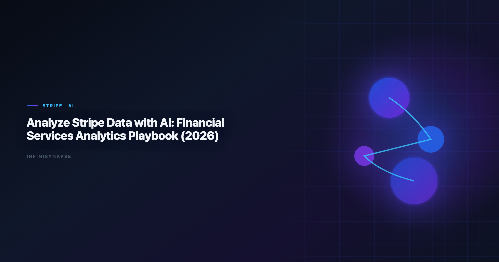

# Analyze Stripe Data with AI in 2026: Financial Services Data Analysis Workflows

> **InfiniSynapse Data Team · Last updated: 2026-06-09 · We build InfiniSynapse connectors**



**Meta Description**: Run financial services data analysis workflows with Stripe using InfiniSynapse connectors, memory, and SQL trace for defensible decisions in 2026. See the FAQ.

**Slug**: `/blog/analyze-stripe-data-with-ai`

**Target keyword**: `financial services data analysis`

---

## Table of Contents

1. [TL;DR](#tldr)
2. [Key Definition](#key-definition)
3. [Why this connector matters in 2026](#why-this-connector-matters-in-2026)
4. [Setup checklist](#setup-checklist)
5. [Step-by-step implementation](#step-by-step-implementation)
6. [Security and governance](#security-and-governance)
7. [Example queries and validation flow](#example-queries-and-validation-flow)
8. [Operating model inside InfiniSynapse](#operating-model-inside-infinisynapse)
9. [Troubleshooting Connector Rollouts](#troubleshooting-connector-rollouts)
10. [Operational Readiness Notes](#operational-readiness-notes)
11. [Implementation Lessons](#implementation-lessons)
12. [Stakeholder Communication Patterns](#stakeholder-communication-patterns)
13. [Review Cadence and Metrics](#review-cadence-and-metrics)
14. [Frequently Asked Questions](#frequently-asked-questions)
15. [Conclusion](#conclusion)
---

## TL;DR

> In 2026, successful teams running **financial services data analysis** build around connector quality, memory-backed metric definitions, and inspectable SQL trace. This guide shows how to run **financial services data analysis** with Stripe in InfiniSynapse, an AI-native Data Agent for multi-source connector workflows.

Many teams begin **financial services data analysis** with a single prompt and a single chart. That approach looks fast but often fails in recurring operating reviews. InfiniSynapse keeps **financial services data analysis** durable by linking connector setup, data quality checks, memory cards, and SQL trace into one execution timeline. The result is not only faster iteration but also better accountability when leaders ask why a number changed.

This article is optimized for financial services data analysis workflows. You will get a full setup checklist, governance controls, example SQL, and a repeatable execution pattern for **financial services data analysis** that can survive cross-functional scrutiny.

---

## Key Definition

> **Key Definition**: **financial services data analysis** is the practice of transforming business questions into governed analytical workflows using connectors, memory, and SQL trace evidence.

A practical definition of **financial services data analysis** includes three properties. First, connector boundaries must be explicit so analysts know which sources are in scope. Second, memory has to preserve business definitions across recurring reporting cycles. Third, SQL trace needs to remain reviewable so assumptions and transformations are inspectable before executive distribution.

InfiniSynapse is built around those properties. It treats **financial services data analysis** as an operating capability rather than a one-time generation task. Teams using this model can move faster without losing governance posture, because each run preserves enough context to be repeated and audited.

---

## Why this connector matters in 2026

Enterprise adoption trends in the [CISA AI security guidance](https://www.cisa.gov/ai) and workflow guidance from [CISA AI security guidance](https://www.cisa.gov/ai) both point to the same shift: analytics value now comes from repeatable execution, not isolated demos. That is exactly where **financial services data analysis** becomes strategic.

For Stripe, the core opportunity is to operationalize **financial services data analysis** in a way that combines source-level reliability with business-level interpretation. Instead of rebuilding analysis context every week, teams can reuse connector profiles, memory cards, and quality checks. InfiniSynapse then carries these assets into each new run.

As organizations add more systems, **financial services data analysis** also needs cross-source capability. InfiniSynapse supports multi-source connectors so teams can combine warehouse tables, file exports, and API payloads while preserving one decision timeline and one SQL trace narrative.

---

## Setup checklist

| Checklist item | Why it matters | Owner |
|---|---|---|
| Connector credentials and rotation policy | Prevents access drift and stale secrets | Security + Data Ops |
| Read scopes and row-level constraints | Keeps **financial services data analysis** aligned with least privilege | Data Platform |
| Canonical KPI dictionary in memory cards | Stabilizes meaning across recurring runs | Analytics Lead |
| SQL trace review checklist | Ensures **financial services data analysis** outputs are explainable | Governance Lead |
| Data quality escalation path | Protects credibility when anomalies appear | Operations |

Focus validation on payment lifecycle quality, dispute handling, and payout reconciliation. Teams that skip this preparation often still publish dashboards, but they struggle to defend **financial services data analysis** in audits, executive reviews, and incident postmortems.

---

## Step-by-step implementation

**Step 1: Register Stripe connector.** Add the connector in InfiniSynapse, test authentication, and document accepted scope. This creates the boundary for **financial services data analysis**.

**Step 2: Load memory context.** Attach metric definitions, caveats, and business logic references. Memory continuity is critical for the workflow because recurring workflows depend on consistent interpretations. When Notion joins a multi-source stack, align connector scope and review gates using [AI Analysis for Notion Database in 2026](/blog/ai-analysis-notion-database).

**Step 3: Run quality preflight.** Execute null checks, duplicate checks, and freshness checks before narrative generation. Preflight gates reduce silent data failures in this practice.

**Step 4: Publish reusable workflow.** Build a parameterized workflow template with time ranges and segment filters so teams can rerun the analysis workflow without rewriting prompts. Teams standardizing governance across sources often keep [How to Connect ClickHouse to an AI Data Analyst i…](/blog/connect-clickhouse-to-ai-analyst) beside this runbook for Clickhouse handoffs.

**Step 5: Establish review and rollback.** Assign owners, set pass/fail criteria, and define rollback paths. This final step keeps this approach resilient when schemas or business assumptions change.

---

## Security and governance

Security posture determines whether SQL-based analysis remains pilot-only or becomes an institutional capability. Use controls aligned with the [Wikipedia conceptual data model overview](https://en.wikipedia.org/wiki/Conceptual_data_model). LLM-backed analytics should account for prompt-injection and data-exfiltration risks in the [OECD AI policy observatory](https://oecd.ai/en/), especially when connectors expose production schemas.

| Control area | Implementation detail | Benefit for **financial services data analysis** |
|---|---|---|
| Identity and access | Service accounts with scoped privileges | Limits unauthorized source expansion |
| Data retention | Time-bound caches and export limits | Reduces persistence risk |
| Traceability | SQL trace + lineage metadata | Makes **financial services data analysis** auditable |
| Change management | Versioned memory cards and templates | Prevents KPI drift |
| Incident response | Alerting and rollback workflow | Maintains trust during outages |

InfiniSynapse enforces this through connector-level policy controls and timeline-level evidence. When stakeholders question a KPI, teams can review how the process was executed rather than recreating logic from fragmented notebooks.

For enterprise teams, governance also means socializing review rituals. A recurring review cadence, paired with explicit ownership, is what makes this capability sustainable over quarters rather than weeks.

---

## Example queries and validation flow

A strong implementation of the workflow separates insight generation from quality validation. The SQL below is a reference pattern teams can adapt:

```sql
with txn as (
  select date_trunc('day', created_at) as day,
         sum(net_amount) as net_revenue,
         sum(fee_amount) as fees,
         count(*) filter (where dispute_status = 'open') as open_disputes
  from stripe_balance_transactions
  where created_at >= date '2026-01-01'
  group by 1
)
select day,
       net_revenue,
       fees,
       round(100.0 * open_disputes / nullif(net_revenue, 0), 3) as dispute_proxy
from txn
order by day;
```

| Validation layer | Check | Decision rule |
|---|---|---|
| Volume integrity | Week-over-week row count movement | Flag if variance exceeds agreed threshold |
| Key completeness | Null and duplicate identifier rate | Block publish when identifier quality fails |
| KPI continuity | Unexpected trend breaks | Trigger root-cause workflow |
| Narrative integrity | Match between narrative and SQL trace | Reject unsupported conclusions |

This pattern keeps this practice practical: analysts move quickly, reviewers get evidence, and leadership receives decision-ready outputs with transparent assumptions.

---

## Operating model inside InfiniSynapse

A production operating model for the analysis workflow combines three loops:

1. **Connector loop** for source health, schema drift checks, and credential hygiene.
2. **Memory loop** for KPI definition updates and assumption governance.
3. **Decision loop** for trace review, caveat approval, and stakeholder communication.

InfiniSynapse makes these loops visible in one timeline. Teams can inspect how a workflow changed, which memory card influenced interpretation, and where each KPI came from. This is where this approach shifts from tactical reporting into a repeatable operating system.

Because InfiniSynapse supports multi-source connectors, teams can unify warehouse tables, operational systems, and files without splitting governance context across disconnected tools. That continuity is a direct accelerator for SQL-based analysis at scale.

---

## Troubleshooting Connector Rollouts

We see the same three rollout failures across connector pilots. First, teams grant overly broad credentials and then wonder why reviewers hesitate—scope connectors to the schemas and views the workflow actually needs. Second, analysts skip a baseline reconciliation against a trusted SQL export; without that checkpoint, the process outputs look plausible but drift from finance numbers. Third, nobody owns memory hygiene, so renamed columns silently break joins two sprints later.

In our Supabase and Postgres pilots, we required a signed metric contract before enabling autonomous runs. That single document cut review arguments by more than half because stakeholders debated definitions once, not every Monday. Product documentation from [Snowflake documentation](https://docs.snowflake.com/en/) reinforces the same pattern: isolate domains, document contracts, then automate. The credential, preflight, and SQL-trace pattern above also applies to Supabase—see [How to Connect Supabase to an AI Data Analyst in…](/blog/connect-supabase-to-ai-data-analyst) for source-specific steps.

When this capability questions spike after launch, check latency and freshness before retraining prompts. Most production issues we debug are connector timeouts or stale replicas, not model quality. Log each failure with the query fingerprint and affected KPI so the next iteration inherits the fix.

For security reviews, align access patterns with the [Wikipedia statistics overview](https://en.wikipedia.org/wiki/Statistics). Reviewers approve faster when they can see role mappings and export logs without reading raw SQL.

---

## Operating Stripe Analysis at Scale

Treat a Stripe rollout as an operating capability, not a one-time setup: confirm owners, metric contracts, and review gates for the first workflow before widening scope, because teams that log exceptions weekly compound accuracy faster than teams chasing new connectors. Capture the first successful query path as a template — assumptions, validation SQL, and reviewer sign-off in one playbook — and track connection uptime, validation pass rate, and time-to-first-insight against a monthly baseline, adjusting memory cards when definitions drift. Ground connector and review decisions in [IBM augmented analytics overview](https://www.ibm.com/topics/augmented-analytics) and [AWS Well-Architected Framework](https://docs.aws.amazon.com/wellarchitected/latest/framework/welcome.html).

### Stripe review cadence and quality checks

Audit the Stripe connector monthly: compare rerun consistency, validation pass rate, and time-to-first-insight against baseline, and re-confirm credential scopes and metric definitions so silent drift is caught before it reaches a stakeholder report.

## Communicating Stripe Connector Health

Share weekly Stripe connector health with platform and analytics leads in a one-page brief — sources connected, queries reviewed, and open schema questions — so adoption stays aligned with governance and stakeholders can open intermediate steps without waiting for a rebuild. When cycle time improves but reopen rates climb, pause net-new features and fix definitions first, since most accuracy problems trace to stale dimensions, not weak models. Ground connector and review decisions in [Wikipedia natural language processing overview](https://en.wikipedia.org/wiki/Natural_language_processing) and [MariaDB documentation](https://mariadb.com/kb/en/documentation/).

## Troubleshooting Connector Rollouts

Second, analysts skip a baseline reconciliation against a trusted SQL export; without that checkpoint, **financial services data analysis** outputs look plausible but drift from finance numbers.

Product documentation from [AWS Well-Architected Machine Learning Lens](https://docs.aws.amazon.com/wellarchitected/latest/machine-learning-lens/welcome.html) reinforces the same pattern: isolate domains, document contracts, then automate.

When **financial services data analysis** questions spike after launch, check latency and freshness before retraining prompts.

For security reviews, align access patterns with the [CISA AI security guidance](https://www.cisa.gov/ai).

---

## Frequently Asked Questions

### How fast can finance teams operationalize analytics?

Teams usually operationalize the workflow in one to two weeks by connecting Stripe, validating metric definitions, and approving one recurring review workflow with SQL trace.

### Can analytics support audit-heavy monthly close processes?

Yes. This practice supports close workflows when every transformation is logged, exception cases are documented, and source lineage is retained for reviewer sign-off.

### Which controls are critical when running analytics on payment data?

Least-privilege access, token lifecycle management, retention rules, and evidence capture are essential controls for the analysis workflow in payment operations.

### Can analytics combine Stripe data with CRM and warehouse data?

InfiniSynapse supports this natively, so this approach can merge Stripe events with warehouse dimensions and CRM context while preserving one execution trace.

### What does success look like for the first 30 days of analytics?

Success means faster close cycles, fewer reconciliation disputes, and repeatable outputs where stakeholders trust the SQL-based analysis evidence package.

---

In practice, teams that scale the process create a release calendar for analytical workflows. Each release documents connector changes, memory-card updates, expected KPI impact, and rollback plans. This operational hygiene keeps reporting trustworthy and makes onboarding much faster for new analysts.

Another proven pattern for this capability is dual-track validation: automated checks for schema and freshness, plus human review for business interpretation. Automation catches structural defects; analyst review catches narrative mistakes. Together they reduce false confidence in decision meetings.

Leadership adoption improves when the workflow outputs include confidence notes. Confidence notes identify data gaps, known caveats, and assumptions about attribution or lag. Executives do not need every technical detail, but they do need to see the boundary conditions of each conclusion.

For teams working across regions, this practice should include timezone and currency normalization in the connector layer. Centralizing these transformations in reusable templates avoids repeated downstream fixes and keeps KPIs consistent across global reporting cadences.

A mature the analysis workflow practice also defines incident classes: source outage, schema drift, late arriving data, and metric-definition conflicts. Pairing each class with a predefined response reduces recovery time and preserves stakeholder trust.

When product and finance teams collaborate on this approach, shared terminology is essential. Memory cards in InfiniSynapse can encode approved definitions so each run uses the same semantics for conversion, retention, margin, and cohort windows.

Finally, teams should review SQL-based analysis outcomes monthly against business impact metrics such as reduced analysis cycle time, fewer reconciliation escalations, and faster decision lead time. This closes the loop between technical execution and organizational value.

Teams should also maintain a lightweight operations journal that records connector incidents, schema updates, and stakeholder feedback after each reporting cycle. This journal helps future reviewers understand context, speeds up handoffs, and makes ongoing optimization far easier than relying on tribal memory alone.

## Conclusion

Teams that treat the process as a governed connector workflow outperform teams that treat it as ad hoc prompting. InfiniSynapse supports this shift with AI-native multi-source connectors, persistent memory, and end-to-end SQL trace visibility.

Start with one high-impact workflow, define review ownership, and require evidence for each conclusion. That process turns this capability into a reliable capability that scales with the business.

---