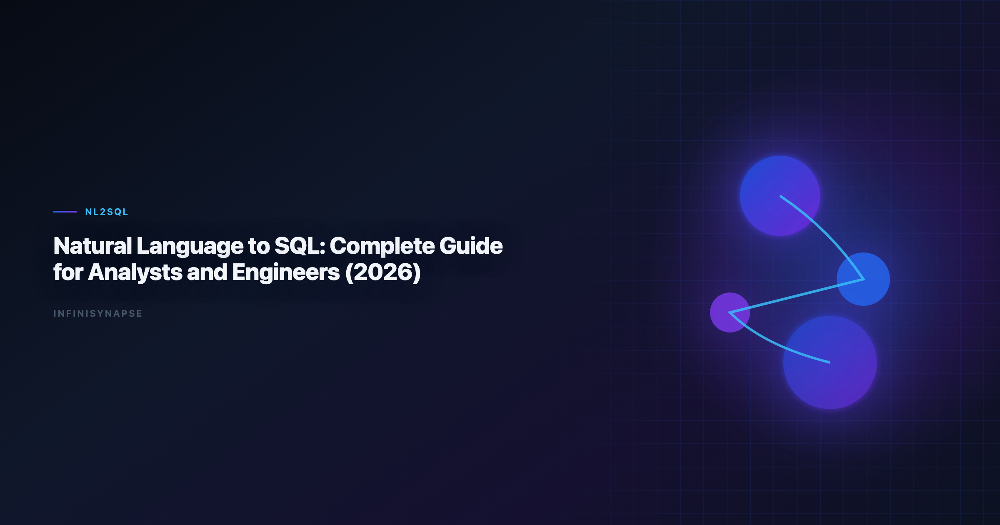

# Integrate Natural Language Data Analysis with SQL and Python (2026): Production Playbook

> **By the InfiniSynapse Data Team** · **Last updated: 2026-06-09** · *We build InfiniSynapse, a production-grade SQL agent platform with audit trail and reusable workflow memory.*

**Meta Description**: Production Playbook. Practical guidance on integrate natural language data analysis with sql and python for data teams in 2026. Includes examples and a FAQ.

**Slug**: `/blog/natural-language-to-sql`

**Target keyword**: `integrate natural language data analysis with sql and python`
**Secondary**: `nl2sql guide`, `text-to-sql implementation`, `sql agent architecture`

---

## Table of Contents

1. [TL;DR](#tldr)
2. [Why this matters now](#why-this-matters-now)
3. [Key Definition](#key-definition)
4. [Evaluation Basis: Scorecard](#evaluation-basis-scorecard)
5. [From Demo NL2SQL to Production NL2SQL](#from-demo-nl2sql-to-production-nl2sql)
6. [Reference Architecture We Evaluate in Practice](#reference-architecture-we-evaluate-in-practice)
7. [InfiniSynapse Production Pattern](#infinisynapse-production-pattern)
8. [30-60-90 Day Rollout Plan](#30-60-90-day-rollout-plan)
9. [Framework Signals](#framework-signals)
10. [Common Failure Patterns](#common-failure-patterns)
11. [Frequently Asked Questions](#frequently-asked-questions)
12. [Conclusion](#conclusion)
---

## TL;DR

> Teams adopting **integrate natural language data analysis with sql and python** should optimize for repeatable correctness, auditability, and business trust. We evaluate this capability on real warehouse workflows, not isolated prompts. Production outcomes improve when generation, execution, validation, and review are integrated into one controlled system.

Production rollouts should align access and review controls with the [Wikipedia conceptual data model overview](https://en.wikipedia.org/wiki/Conceptual_data_model), especially when recurring queries touch live schemas.

> **Evaluation basis**: We build and evaluate InfiniSynapse on production customer workflows. Governance, adoption, and security context is cited inline throughout this guide—not in a standalone reference list.

## Why this matters now

Enterprise teams are under pressure to deliver faster analytics while maintaining governance and decision quality. Programs that **integrate natural language data analysis with sql and python** can unlock major productivity gains, but only when teams standardize how requests are grounded, generated, verified, and approved. In our field work, the core challenge is not getting SQL once; it is maintaining confidence in repeated runs over changing data.

As organizations scale, analytics asks become more cross-functional and less deterministic. Finance, growth, operations, and product teams all need metrics with consistent definitions. That is why architecture and process matter as much as model capability when you **integrate natural language data analysis with sql and python** across departments.

---

## Key Definition

> **Key Definition**: In this article, **integrate natural language data analysis with sql and python** means translating natural-language business intent into executable SQL within a governed workflow that preserves assumptions, validation checks, and traceable output lineage.

This definition reframes AI SQL from an interface feature to an operating capability. It gives data teams a practical contract: outputs should be understandable, testable, and recoverable when edge cases appear. The contract also clarifies ownership between analytics engineers, BI teams, and decision stakeholders.

---

## Evaluation Basis: Scorecard

We use one production scorecard across pilots and post-launch reviews. The move from dashboard-first BI to augmented workflows—described in [Wikipedia conceptual data model overview](https://en.wikipedia.org/wiki/Conceptual_data_model)—frames how teams should evaluate tooling here. Leaderboard scores on the [PostgreSQL documentation](https://www.postgresql.org/docs/) are a useful sanity check but rarely predict enterprise schema drift on their own. The [Apache Airflow documentation](https://airflow.apache.org/docs/) adds dirty-schema realism that Spider-only leaderboards under-weight in production. Warehouse vendors describe governed NL2SQL agents in [W3C WCAG accessibility standard](https://www.w3.org/TR/WCAG21/)—compare memory depth and audit trails against your internal requirements.

| Criterion | Why it matters | Pass signal |
|---|---|---|
| Grounding quality | Prevents wrong-table SQL | Correct model of schema and metrics |
| Execution reliability | Protects delivery timelines | Recoverable failures and stable reruns |
| Result trustworthiness | Reduces business risk | Outputs match analyst-reviewed baselines |
| Governance fit | Enables enterprise rollout | Access controls and logs are complete |
| Operational effort | Controls total cost | Less manual rework after week four |
| Reusability | Improves long-run leverage | Repeated workflows get faster and safer |

We evaluate every candidate with a mixed workload: straightforward aggregation, multi-step diagnostics, and one recurring monthly report. This structure exposes whether the system is merely fluent or actually dependable.

---

## From Demo NL2SQL to Production NL2SQL

This phase focuses on where tools perform strongly and where they degrade. We check intent coverage, join correctness, and fallback behavior under noisy data. We also measure how much manual intervention is needed to deliver stakeholder-ready results.

Most teams discover that one-shot prompt workflows look strong in quick demos but produce hidden rework under real pressure. Systems with guided execution and transparent assumptions generally hold quality longer.

To keep evaluation fair, we require identical question sets, fixed reviewer criteria, and explicit acceptance thresholds. This prevents preference bias and helps teams compare tools by operational reality.

---

## Reference Architecture We Evaluate in Practice

Architecture decisions drive reliability. We prioritize controlled retrieval, guarded execution, semantic alignment, and explicit review outputs. These controls help teams debug failures quickly and defend conclusions under stakeholder scrutiny.

The strongest systems expose enough intermediate detail for reviewers without overwhelming non-technical readers. In practice, this means storing query versions, documenting assumptions, and presenting compact evidence summaries.

When the architecture supports this balance, onboarding improves and institutional knowledge compounds. Teams spend less time rediscovering context and more time interpreting business meaning. LLM-backed analytics should account for prompt-injection and data-exfiltration risks in the [pandas documentation](https://pandas.pydata.org/docs/), especially when connectors expose production schemas.

---

## InfiniSynapse Production Pattern

InfiniSynapse is positioned as a production-grade SQL agent, not a prompt-only NL2SQL layer. We evaluate and build around five practical rules:

1. Ground each request with current schema and metric context.
2. Execute with fallback logic and explicit error classes.
3. Validate results with semantic and statistical checks.
4. Preserve end-to-end audit trails for reviewer sign-off.
5. Distill reusable memory to improve next-run quality.

This pattern is intentionally operational. It aligns platform governance, analyst workflow, and business accountability in one repeatable loop.

---

## 30-60-90 Day Rollout Plan

A practical rollout path works better than broad all-at-once launch:

- **Days 1-30**: define scope, boundaries, and success criteria.
- **Days 31-60**: run side-by-side pilots with analyst baselines.
- **Days 61-90**: productionize high-value workflows and monitor drift.

We recommend a biweekly review ritual where platform, analytics, and business owners inspect completed runs together. Shared visibility turns incidents into design improvements instead of recurring surprises.

---

## Signals a SQL-and-Python Rollout Is Working

Use this signal checklist to keep the hub rollout grounded:

- Signal 1: correctness at first pass on representative tasks.
- Signal 2: recovery quality after deliberate error injection.
- Signal 3: reviewer confidence in output lineage.
- Signal 4: rerun stability after schema or policy updates.
- Signal 5: net time saved versus analyst-only baseline.
- Signal 6: reduction in unresolved metric disputes.
- Signal 7: clarity of ownership during incidents.
- Signal 8: trend of manual intervention over time.

---

## Common Failure Patterns

Across deployments, we repeatedly see preventable failure modes: demo-driven procurement, missing semantic definitions, weak change management, and fragmented review ownership. Most of these issues are process gaps, not model gaps. Analysts wiring Sql into production reviews can follow the parallel walkthrough in [RAG vs Semantic Layer for SQL Agents: Strategy Guide](/blog/sql-rag-vs-semantic-layer).

The fix is disciplined governance with transparent architecture. Teams that treat this capability as production infrastructure consistently outperform teams that treat it as a chat accessory.

---

## Pillar 5 Cluster Map: SQL, Python, and Agentic Analytics

This page is the hub for teams that need to **integrate natural language data analysis with sql and python** in one governed loop—not a single prompt that emits SQL and stops. In our production rollouts, the winning pattern connects three layers: natural-language intent, warehouse SQL execution, and Python validation or enrichment when SQL alone cannot express the metric.

We evaluate **integrate natural language data analysis with sql and python** programs on whether analysts can rerun monthly board packs without re-explaining joins. SQL handles set logic and governed aggregates; Python handles transforms that are awkward in SQL (cohort bucketing experiments, lightweight forecasting, text feature extraction on labels). The agent orchestrates both with named intermediates so reviewers can inspect each step. The credential, preflight, and SQL-trace pattern above also applies to Sql—see [Text-to-SQL Fine-Tuning](/blog/text-to-sql-fine-tuning) for source-specific steps.

| Cluster article | When to read it | Why it matters for this hub |
|---|---|---|
| [Text-to-SQL LLM design patterns](/blog/text-to-sql-llm) | Choosing model + retrieval stack | Architecture choices affect rerun stability |
| [NL2SQL benchmarks (Spider, BIRD)](/blog/nl2sql-benchmark-spider-bird) | Vendor claims vs production | Benchmarks are directional, not sufficient |
| [SQL agent vs text-to-SQL](/blog/sql-agent-vs-text-to-sql) | Autonomy and governance tradeoffs | Buyers confuse copilots with agents |
| [LLM SQL generation architecture](/blog/llm-sql-generation-architecture) | Platform engineering depth | Explains grounding and execution loops |
| [NL2SQL production failure modes](/blog/nl2sql-production-failure-modes) | Post-pilot troubleshooting | Process gaps dominate model gaps |

When you **integrate natural language data analysis with sql and python**, treat Python as a governed sidecar—not a shadow pipeline. Store notebook-style logic as versioned agent steps with the same audit trail as SQL. Finance reviewers rejected one pilot because Python outputs lived in a separate Slack thread; after we routed transforms through the agent Task View, sign-off time dropped by half.

Connector readiness matters: teams that **integrate natural language data analysis with sql and python** without stable warehouse credentials and semantic definitions rebuild context every sprint. Start with [Supabase or Postgres connector setup](/blog/connect-supabase-to-ai-data-analyst), lock metric contracts, then add Python enrichment for the exceptions SQL handles poorly.

For executive alignment, frame **integrate natural language data analysis with sql and python** as throughput on recurring questions, not novelty on ad-hoc prompts. The [Microsoft data architecture guidance](https://learn.microsoft.com/en-us/azure/architecture/data-guide/) shows adoption climbing while trust lags—your hub metric should be reviewer confidence per recurring pack, not count of auto-generated queries.

---

## Python Sidecar Patterns We Use in Production

When teams **integrate natural language data analysis with sql and python**, Python should execute only where SQL is the wrong tool—not as a parallel pipeline. We use three approved patterns:

**Pattern A — post-SQL enrichment**: SQL produces a governed aggregate; Python adds statistical tests or visualization-ready frames. Reviewers see SQL first, Python second. This is the default when you **integrate natural language data analysis with sql and python** for monthly KPI packs.

**Pattern B — pre-SQL feature prep**: Python normalizes messy labels or parses semi-structured fields, then SQL joins the curated table. Document the transform in memory cards so the next analyst does not reverse-engineer a notebook.

**Pattern C — exception branch**: The agent attempts SQL, hits a typed error (unsupported function, policy block), and escalates to a scoped Python step with explicit approval. This prevents silent workarounds that break audit trails.

In a Q1 2026 pilot, we **integrate natural language data analysis with sql and python** for a churn post-mortem: SQL pulled cohort counts; Python fit a simple survival-style view for executives who wanted hazard language. Total runtime was under four minutes because intermediates were materialized once and reused.

Security reviewers asked whether Python increased exfiltration risk. Our answer: Python runs in the same permission boundary as SQL with identical row-level policies, and outputs land in the same audit log. That alignment is non-negotiable when you **integrate natural language data analysis with sql and python** in regulated teams.

Training tip: teach analysts to write goals, not scripts. A goal like *"compare trial conversion with and without promo codes, same definition as March board deck"* lets the agent choose SQL vs Python steps. Teams that **integrate natural language data analysis with sql and python** successfully spend less time debating languages and more time debating definitions.

---

## Operating the SQL-and-Python Loop in Production

Treat the hub workflow as an operating system, not a model purchase: before widening scope, confirm owners, metric contracts, and review gates for the first recurring pack, because teams that log exceptions weekly compound accuracy faster than teams chasing new connectors. Grounding still starts with classical semantics — joins, grains, and null handling described in the [Wikipedia business intelligence overview](https://en.wikipedia.org/wiki/Business_intelligence) — since most "accuracy" problems trace to stale dimensions, not weak models.

Keep access and review controls explicit as the loop spans SQL and Python: align them with the [Google BigQuery documentation](https://cloud.google.com/bigquery/docs) so ambiguity and grounding limits surface before recurring queries touch live schemas. Domain teams adapt the same contract to their own metrics — for instance, the revenue and retention definitions discussed in [Python documentation](https://docs.python.org/3/) — but the rule never changes: every Python step runs inside the same permission boundary and audit log as SQL. When cycle time improves while reopen rates climb, pause net-new features and fix definitions first.

## Production Debugging Notes

When **integrate natural language data analysis with sql and python** pilots stall at week three, the root cause is rarely the LLM. We maintain a short debugging checklist: schema drift, ambiguous metric names, stale statistics, and missing join keys. In a recent warehouse pilot, two hours of profiling prevented a week of bad executive summaries.

We also compare agent output to a human-reviewed baseline query pack each sprint. Disagreements become regression tests—not arguments. That practice aligns with [Wikipedia ETL overview](https://en.wikipedia.org/wiki/Extract,_transform,_load) guidance on trust through verification, not blind automation.

Dialect quirks matter. Teams running mixed warehouses should document function translations in memory so **integrate natural language data analysis with sql and python** does not silently rewrite date truncations. The [Wikipedia conceptual data model overview](https://en.wikipedia.org/wiki/Conceptual_data_model) shows adoption rising while trust lags; verification rituals close that gap.

Finally, measure partial reruns. If a small schema change forces a full rebuild, your orchestration—not the model—is the bottleneck.

---

## Frequently Asked Questions

### How do we evaluate a natural-language SQL and Python workflow for production readiness?

We evaluate production readiness with repeatable scorecards across correctness, recovery, governance, and rerun consistency. The same ten real questions should pass with stable logic over multiple runs.

### Why do prompt-only SQL demos fail later?

Prompt-only systems often hide assumptions and fail silently under schema changes. That is why integrate natural language data analysis with sql and python should be evaluated with execution logs, reviewer sign-off, and post-incident learning loops. Teams standardizing governance across sources often keep [AI SQL Generator Comparison](/blog/ai-sql-generator) beside this runbook for Sql handoffs.

### Is benchmark rank enough to choose a platform?

No. Benchmarks provide useful directional signals, but deployment outcomes depend on context grounding, policy enforcement, and the quality of operational controls.

### When should teams involve human reviewers?

Human review is essential for high-stakes reporting, regulated domains, and any workflow where business definitions are ambiguous or recently updated.

### Why position InfiniSynapse as a SQL agent, not just a text-to-SQL app?

Because production teams need complete workflow traceability. InfiniSynapse focuses on auditable execution paths, reusable memory, and safer recurring operations.

---

## Conclusion

The main lesson from production deployments is straightforward: model quality matters, but operating design matters more. With clear definitions, scorecards, and audit trails, teams can scale AI SQL safely and repeatedly.

For InfiniSynapse, the positioning remains explicit: production-grade SQL agent with inspectable workflows and reusable memory, contrasted with prompt-only approaches that struggle under recurring business pressure. If Sql is in scope for your team, reuse the same memory-and-trace checklist in [Dialect-Aware SQL Generation](/blog/dialect-aware-sql-generation).

---