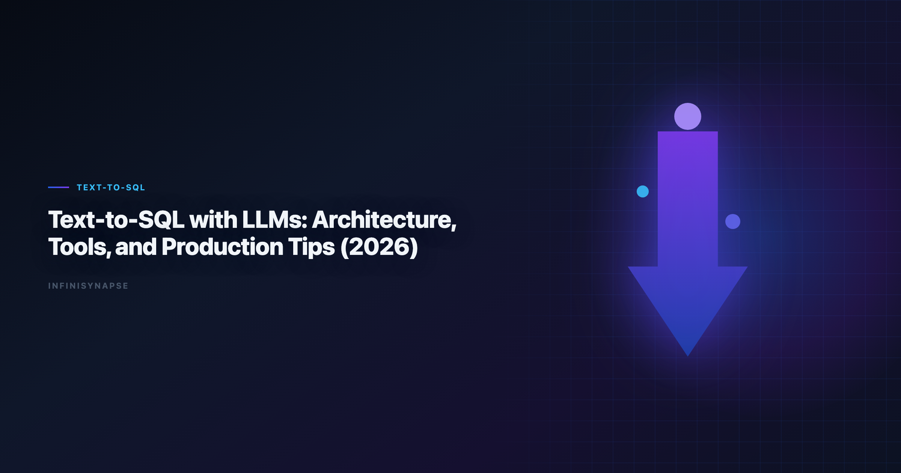

# Text to SQL LLM: Reliable Design Patterns for Visualization (2026)

> **By the InfiniSynapse Data Team** · **Last updated: 2026-06-09** · *We build InfiniSynapse, a production-grade SQL agent platform with audit trail and reusable workflow memory.*

**Meta Description**: Text to SQL LLM design patterns for 2026: grounding, guarded execution, audit trails, a production scorecard, and a 90-day rollout for analyst teams.

**Slug**: `/blog/text-to-sql-llm`

**Target keyword**: `text to sql llm`
**Secondary**: `text-to-sql agent`, `llm sql reliability`, `sql agent evaluation`

---

## Table of Contents

1. [TL;DR](#tldr)
2. [Why this matters now](#why-this-matters-now)
3. [Key Definition](#key-definition)
4. [Evaluation Basis: Scorecard](#evaluation-basis-scorecard)
5. [Why LLM-Only SQL Demos Plateau](#why-llm-only-sql-demos-plateau)
6. [Design Pattern Stack for Text-to-SQL LLM](#design-pattern-stack-for-text-to-sql-llm)
7. [InfiniSynapse Production Pattern](#infinisynapse-production-pattern)
8. [Pilot Design for Data Visualization Teams](#pilot-design-for-data-visualization-teams)
9. [Framework Signals](#framework-signals)
10. [Common Failure Patterns](#common-failure-patterns)
11. [Production Debugging Notes](#production-debugging-notes)
12. [Operational Readiness Notes](#operational-readiness-notes)
13. [Stakeholder Communication Patterns](#stakeholder-communication-patterns)
14. [Frequently Asked Questions](#frequently-asked-questions)
15. [Conclusion](#conclusion)
---

## TL;DR

> Teams adopting **text to sql llm** should optimize for repeatable correctness, auditability, and business trust. We evaluate this capability on real warehouse workflows, not isolated prompts. Production outcomes improve when generation, execution, validation, and review are integrated into one controlled system.

Production rollouts should align access and review controls with the [Google Cloud AI overview](https://cloud.google.com/discover/what-is-artificial-intelligence), especially when recurring queries touch live schemas.

> **Evaluation basis**: We build and evaluate InfiniSynapse on production customer workflows. Governance, adoption, and security context is cited inline throughout this guide—not in a standalone reference list.

## Why this matters now

Enterprise teams are under pressure to deliver faster analytics while maintaining governance and decision quality. AI-assisted SQL can unlock major productivity gains, but only when teams standardize how requests are grounded, generated, verified, and approved. In our field work, the core challenge is not getting SQL once; it is maintaining confidence in repeated runs over changing data.

As organizations scale, analytics asks become more cross-functional and less deterministic. Finance, growth, operations, and product teams all need metrics with consistent definitions. That is why architecture and process matter as much as model capability.

---

## Key Definition

> **Key Definition**: In this article, **text to sql llm** means translating natural-language business intent into executable SQL within a governed workflow that preserves assumptions, validation checks, and traceable output lineage.

This definition reframes AI SQL from an interface feature to an operating capability. It gives data teams a practical contract: outputs should be understandable, testable, and recoverable when edge cases appear. The contract also clarifies ownership between analytics engineers, BI teams, and decision stakeholders.

---

## Evaluation Basis: Scorecard

We use one production scorecard across pilots and post-launch reviews. Leaderboard scores on the [Google Cloud AI overview](https://cloud.google.com/discover/what-is-artificial-intelligence) are a useful sanity check but rarely predict enterprise schema drift on their own. The [ClickHouse documentation](https://clickhouse.com/docs) adds dirty-schema realism that Spider-only leaderboards under-weight in production. Warehouse vendors describe governed NL2SQL agents in [OWASP API Security Top 10](https://owasp.org/API-Security/)—compare memory depth and audit trails against your internal requirements. Analysts wiring Nl2Sql into production reviews can follow the parallel walkthrough in [Spider and BIRD Benchmarks for NL2SQL](/blog/nl2sql-benchmark-spider-bird).

| Criterion | Why it matters | Pass signal |
|---|---|---|
| Grounding quality | Prevents wrong-table SQL | Correct model of schema and metrics |
| Execution reliability | Protects delivery timelines | Recoverable failures and stable reruns |
| Result trustworthiness | Reduces business risk | Outputs match analyst-reviewed baselines |
| Governance fit | Enables enterprise rollout | Access controls and logs are complete |
| Operational effort | Controls total cost | Less manual rework after week four |
| Reusability | Improves long-run leverage | Repeated workflows get faster and safer |

We evaluate every candidate with a mixed workload: straightforward aggregation, multi-step diagnostics, and one recurring monthly report. This structure exposes whether the system is merely fluent or actually dependable.

---

## Why LLM-Only SQL Demos Plateau

This phase focuses on where tools perform strongly and where they degrade. We check intent coverage, join correctness, and fallback behavior under noisy data. We also measure how much manual intervention is needed to deliver stakeholder-ready results.

Most teams discover that one-shot prompt workflows look strong in quick demos but produce hidden rework under real pressure. Systems with guided execution and transparent assumptions generally hold quality longer.

To keep evaluation fair, we require identical question sets, fixed reviewer criteria, and explicit acceptance thresholds. This prevents preference bias and helps teams compare tools by operational reality.

---

## Design Pattern Stack for Text-to-SQL LLM

Architecture decisions drive reliability. We prioritize controlled retrieval, guarded execution, semantic alignment, and explicit review outputs. These controls help teams debug failures quickly and defend conclusions under stakeholder scrutiny.

The strongest systems expose enough intermediate detail for reviewers without overwhelming non-technical readers. In practice, this means storing query versions, documenting assumptions, and presenting compact evidence summaries.

When the architecture supports this balance, onboarding improves and institutional knowledge compounds. Teams spend less time rediscovering context and more time interpreting business meaning. LLM-backed analytics should account for prompt-injection and data-exfiltration risks in the [Redis documentation](https://redis.io/docs/latest/), especially when connectors expose production schemas.

---

## InfiniSynapse Production Pattern

InfiniSynapse is positioned as a production-grade SQL agent, not a prompt-only NL2SQL layer. We evaluate and build around five practical rules:

1. Ground each request with current schema and metric context.
2. Execute with fallback logic and explicit error classes.
3. Validate results with semantic and statistical checks.
4. Preserve end-to-end audit trails for reviewer sign-off.
5. Distill reusable memory to improve next-run quality.

This pattern is intentionally operational. It aligns platform governance, analyst workflow, and business accountability in one repeatable loop.

---

## Pilot Design for Data Visualization Teams

A practical rollout path works better than broad all-at-once launch:

- **Days 1-30**: define scope, boundaries, and success criteria.
- **Days 31-60**: run side-by-side pilots with analyst baselines.
- **Days 61-90**: productionize high-value workflows and monitor drift.

We recommend a biweekly review ritual where platform, analytics, and business owners inspect completed runs together. Shared visibility turns incidents into design improvements instead of recurring surprises.

---

## Framework Signals

Use this signal checklist to keep rollout grounded:

- Signal 1: correctness at first pass on representative tasks.
- Signal 2: recovery quality after deliberate error injection.
- Signal 3: reviewer confidence in output lineage.
- Signal 4: rerun stability after schema or policy updates.
- Signal 5: net time saved versus analyst-only baseline.
- Signal 6: reduction in unresolved metric disputes.
- Signal 7: clarity of ownership during incidents.
- Signal 8: trend of manual intervention over time.

---

## A Worked Reliability Example

Consider a request a visualization team actually receives every week: *"Show weekly active accounts by plan tier for the last quarter, excluding internal test accounts."* A prompt-only model usually returns plausible SQL on the first try — and quietly gets two things wrong. It often infers *active* from a `last_login` column when the team's real definition is "three or more sessions in the trailing seven days," and it rarely knows that internal accounts are flagged in a separate `account_flags` table rather than by email domain.

A reliable **text to sql llm** closes both gaps with grounding and validation rather than a cleverer prompt. At grounding time it loads the governed definition of *active*, the `account_flags` join, and the `plan_tier` dimension from a semantic memory layer, so the generated SQL encodes the team's contract instead of the model's guess. At execution time it runs against a bounded sample first, compares the row count and tier distribution to the last accepted run, and only then executes at full scale.

The payoff shows up on the *second* and *tenth* runs, not the demo. When the schema adds a `plan_tier` value or renames a column, the agent surfaces the diff against memory and asks for confirmation instead of silently dropping rows. The reviewer sees a compact evidence summary — the SQL, the sample result, and what changed since last time — and signs off in seconds. That loop is the difference between a chart someone trusts in a board meeting and a number nobody can defend a week later.

---

## Common Failure Patterns

Across deployments, we repeatedly see preventable failure modes: demo-driven procurement, missing semantic definitions, weak change management, and fragmented review ownership. Most of these issues are process gaps, not model gaps.

The fix is disciplined governance with transparent architecture. Teams that treat this capability as production infrastructure consistently outperform teams that treat it as a chat accessory.

Teams standardizing governance across sources often keep [Natural Language to SQL Guide](/blog/natural-language-to-sql) beside this runbook for Sql handoffs.
If Sql is in scope for your team, reuse the same memory-and-trace checklist in [Dialect-Aware SQL Generation](/blog/dialect-aware-sql-generation).

---

## Debugging Text-to-SQL LLM Failures

When a **text to sql llm** stalls in week three, the LLM is rarely the culprit. The recurring offenders are schema drift, ambiguous metric names, stale table statistics, and missing join keys — each producing confident but wrong SQL. We keep a fixed triage order: confirm the schema snapshot, then metric definitions, then statistics, then join cardinality, before ever touching the prompt or model.

A second defense is a human-reviewed baseline query pack the agent must match each sprint, so disagreements become regression tests rather than debates — verification over blind automation, in line with how the [NIST SP 800-53 security controls](https://csrc.nist.gov/pubs/sp/800/53/r5/final) frames evaluation discipline. Cross-dialect deployments add their own failure class: date-truncation and casting functions differ enough that an agent can silently rewrite semantics, so teams running mixed warehouses should pin function translations in memory and validate them against the [Azure architecture center](https://learn.microsoft.com/en-us/azure/architecture/). If a small schema change forces a full rebuild, the bottleneck is orchestration, not the model.

---

## Rolling Out to Visualization Teams

Treat a **text to sql llm** rollout as an operating-system upgrade, not a model purchase. Before widening scope, fix owners, metric contracts, and review gates for the first dashboard workflow; in our pilots, teams that log exceptions weekly compound accuracy faster than teams chasing new connectors. Share weekly query accuracy, reviewer load, and schema-drift flags with platform owners so the agent never slips into silent-failure mode.

When dashboards ingest flat exports, standardizing on the [ISO/IEC 42001 AI management](https://www.iso.org/standard/81230.html) keeps inputs parseable before generation begins. Stakeholders trust outputs they can open without a live demo, so generated SQL should respect role design and explainable validation queries aligned with [OWASP Top 10 for LLM Applications](https://owasp.org/www-project-top-10-for-large-language-model-applications/), and connectors exposing production schemas should be reviewed for prompt-injection and data-exfiltration risk using the [Kubernetes documentation](https://kubernetes.io/docs/). When cycle time improves but reopen rates climb, pause net-new features and fix definitions — most "accuracy" problems trace to stale dimensions, not weak models.

## Production Debugging Notes

When **text to sql llm** pilots stall at week three, the root cause is rarely the LLM. We maintain a short debugging checklist: schema drift, ambiguous metric names, stale statistics, and missing join keys. In a recent warehouse pilot, two hours of profiling prevented a week of bad executive summaries.

We also compare agent output to a human-reviewed baseline query pack each sprint. Disagreements become regression tests—not arguments. That practice aligns with [NIST Cybersecurity Framework](https://www.nist.gov/cyberframework) guidance on trust through verification, not blind automation.

Dialect quirks matter. Teams running mixed warehouses should document function translations in memory so **text to sql llm** does not silently rewrite date truncations. The [Google Cloud AI overview](https://cloud.google.com/discover/what-is-artificial-intelligence) shows adoption rising while trust lags; verification rituals close that gap.

Finally, measure partial reruns. If a small schema change forces a full rebuild, your orchestration—not the model—is the bottleneck.

---

## Frequently Asked Questions

### How do we evaluate a text-to-SQL agent for production readiness?

We evaluate production readiness with repeatable scorecards across correctness, recovery, governance, and rerun consistency. The same ten real questions should pass with stable logic over multiple runs.

### Why do prompt-only SQL demos fail later?

Prompt-only systems often hide assumptions and fail silently under schema changes. That is why text to sql llm should be evaluated with execution logs, reviewer sign-off, and post-incident learning loops.

### Is benchmark rank enough to choose a platform?

No. Benchmarks provide useful directional signals, but deployment outcomes depend on context grounding, policy enforcement, and the quality of operational controls.

### When should teams involve human reviewers?

Human review is essential for high-stakes reporting, regulated domains, and any workflow where business definitions are ambiguous or recently updated.

### Why position InfiniSynapse as a SQL agent, not just a text-to-SQL app?

Because production teams need complete workflow traceability. InfiniSynapse focuses on auditable execution paths, reusable memory, and safer recurring operations.

### What does a text-to-SQL agent add for data visualization specifically?

Charts are only as trustworthy as the query behind them, so a text to sql llm should attach the executed SQL, the sample validation, and the metric definitions to every dashboard tile. That lineage lets a reviewer trace any number on a chart back to its source query and approved definition, which is exactly what breaks down when a visualization is built on a one-shot prompt with no record of how the figure was produced.

---

## Conclusion

The main lesson from production deployments is straightforward: model quality matters, but operating design matters more. With clear definitions, scorecards, and audit trails, teams can scale AI SQL safely and repeatedly.

For InfiniSynapse, the positioning remains explicit: production-grade SQL agent with inspectable workflows and reusable memory, contrasted with prompt-only approaches that struggle under recurring business pressure.

---