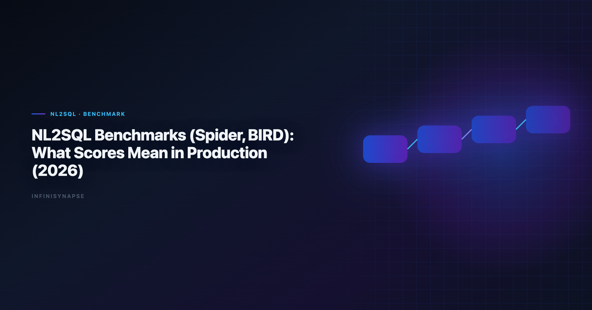

# NL2SQL Benchmark Spider BIRD: What Matters in Production (2026)

> **By the InfiniSynapse Data Team** · **Last updated: 2026-06-09** · *We build InfiniSynapse, a production-grade SQL agent platform with audit trail and reusable workflow memory.*

**Meta Description**: NL2SQL benchmark Spider BIRD explained for 2026: execution accuracy vs exact match, schema realism, and what actually predicts production reliability.

**Slug**: `/blog/nl2sql-benchmark-spider-bird`

**Target keyword**: `nl2sql benchmark spider bird`
**Secondary**: `spider benchmark`, `bird benchmark`, `nl2sql evaluation`

---

## Table of Contents

1. [TL;DR](#tldr)
2. [Why this matters now](#why-this-matters-now)
3. [Key Definition](#key-definition)
4. [Evaluation Basis: Scorecard](#evaluation-basis-scorecard)
5. [What Spider and BIRD Measure Well](#what-spider-and-bird-measure-well)
6. [What Benchmark Scores Miss in Production](#what-benchmark-scores-miss-in-production)
7. [InfiniSynapse Production Pattern](#infinisynapse-production-pattern)
8. [Benchmark-to-Production Translation Scorecard](#benchmark-to-production-translation-scorecard)
9. [Framework Signals](#framework-signals)
10. [Common Failure Patterns](#common-failure-patterns)
11. [Production Debugging Notes](#production-debugging-notes)
12. [Operational Readiness Notes](#operational-readiness-notes)
13. [Stakeholder Communication Patterns](#stakeholder-communication-patterns)
14. [Frequently Asked Questions](#frequently-asked-questions)
15. [Conclusion](#conclusion)
---

## TL;DR

> Teams adopting **nl2sql benchmark spider bird** should optimize for repeatable correctness, auditability, and business trust. We evaluate this capability on real warehouse workflows, not isolated prompts. Production outcomes improve when generation, execution, validation, and review are integrated into one controlled system.

Production rollouts should align access and review controls with the [Apache Spark documentation](https://spark.apache.org/docs/latest/), especially when recurring queries touch live schemas.

> **Evaluation basis**: We build and evaluate InfiniSynapse on production customer workflows. Governance, adoption, and security context is cited inline throughout this guide—not in a standalone reference list.

## Why this matters now

Reading an **nl2sql benchmark spider bird** scorecard correctly matters because enterprise teams are under pressure to deliver faster analytics while maintaining governance and decision quality. AI-assisted SQL can unlock major productivity gains, but only when teams standardize how requests are grounded, generated, verified, and approved. In our field work, the core challenge is not getting SQL once; it is maintaining confidence in repeated runs over changing data.

An **nl2sql benchmark spider bird** result is directional, not a production guarantee. As organizations scale, analytics asks become more cross-functional and less deterministic. Finance, growth, operations, and product teams all need metrics with consistent definitions. That is why architecture and process matter as much as model capability.

---

## Key Definition

> **Key Definition**: In this article, **nl2sql benchmark spider bird** means translating natural-language business intent into executable SQL within a governed workflow that preserves assumptions, validation checks, and traceable output lineage.

This definition reframes AI SQL from an interface feature to an operating capability. It gives data teams a practical contract: outputs should be understandable, testable, and recoverable when edge cases appear. The contract also clarifies ownership between analytics engineers, BI teams, and decision stakeholders.

---

## Evaluation Basis: Scorecard

We use one production scorecard across pilots and post-launch reviews. Warehouse vendors describe governed NL2SQL agents in [Apache Spark documentation](https://spark.apache.org/docs/latest/)—compare memory depth and audit trails against your internal requirements. If Sql is in scope for your team, reuse the same memory-and-trace checklist in [LLM SQL Generation Architecture](/blog/llm-sql-generation-architecture).

| Criterion | Why it matters | Pass signal |
|---|---|---|
| Grounding quality | Prevents wrong-table SQL | Correct model of schema and metrics |
| Execution reliability | Protects delivery timelines | Recoverable failures and stable reruns |
| Result trustworthiness | Reduces business risk | Outputs match analyst-reviewed baselines |
| Governance fit | Enables enterprise rollout | Access controls and logs are complete |
| Operational effort | Controls total cost | Less manual rework after week four |
| Reusability | Improves long-run leverage | Repeated workflows get faster and safer |

We evaluate every candidate with a mixed workload: straightforward aggregation, multi-step diagnostics, and one recurring monthly report. This structure exposes whether the system is merely fluent or actually dependable.

---

## What Spider and BIRD Measure Well

This phase focuses on where tools perform strongly and where they degrade. We check intent coverage, join correctness, and fallback behavior under noisy data. We also measure how much manual intervention is needed to deliver stakeholder-ready results.

Most teams discover that one-shot prompt workflows look strong in quick demos but produce hidden rework under real pressure. Systems with guided execution and transparent assumptions generally hold quality longer.

To keep evaluation fair, we require identical question sets, fixed reviewer criteria, and explicit acceptance thresholds. This prevents preference bias and helps teams compare tools by operational reality.

---

## What Benchmark Scores Miss in Production

Architecture decisions drive reliability. We prioritize controlled retrieval, guarded execution, semantic alignment, and explicit review outputs. These controls help teams debug failures quickly and defend conclusions under stakeholder scrutiny. Leaderboard scores on the [Google Research publications](https://research.google/pubs/) are a useful sanity check but rarely predict enterprise schema drift on their own. The [Shopify ecommerce analytics](https://www.shopify.com/enterprise/blog/ecommerce-analytics) adds dirty-schema realism that Spider-only leaderboards under-weight in production.

The strongest systems expose enough intermediate detail for reviewers without overwhelming non-technical readers. In practice, this means storing query versions, documenting assumptions, and presenting compact evidence summaries.

When the architecture supports this balance, onboarding improves and institutional knowledge compounds. Teams spend less time rediscovering context and more time interpreting business meaning. LLM-backed analytics should account for prompt-injection and data-exfiltration risks in the [NIST Cybersecurity Framework](https://www.nist.gov/cyberframework), especially when connectors expose production schemas.

---

## InfiniSynapse Production Pattern

InfiniSynapse is positioned as a production-grade SQL agent, not a prompt-only NL2SQL layer. We evaluate and build around five practical rules:

1. Ground each request with current schema and metric context.
2. Execute with fallback logic and explicit error classes.
3. Validate results with semantic and statistical checks.
4. Preserve end-to-end audit trails for reviewer sign-off.
5. Distill reusable memory to improve next-run quality.

This pattern is intentionally operational. It aligns platform governance, analyst workflow, and business accountability in one repeatable loop.

---

## Benchmark-to-Production Translation Scorecard

A practical rollout path works better than broad all-at-once launch:

- **Days 1-30**: define scope, boundaries, and success criteria.
- **Days 31-60**: run side-by-side pilots with analyst baselines.
- **Days 61-90**: productionize high-value workflows and monitor drift.

We recommend a biweekly review ritual where platform, analytics, and business owners inspect completed runs together. Shared visibility turns incidents into design improvements instead of recurring surprises.

---

## Signals a Benchmark Translates to Production

Use this signal checklist to keep a benchmark-driven rollout grounded:

- Signal 1: correctness at first pass on representative tasks.
- Signal 2: recovery quality after deliberate error injection.
- Signal 3: reviewer confidence in output lineage.
- Signal 4: rerun stability after schema or policy updates.
- Signal 5: net time saved versus analyst-only baseline.
- Signal 6: reduction in unresolved metric disputes.
- Signal 7: clarity of ownership during incidents.
- Signal 8: trend of manual intervention over time.

---

## A Benchmark Score That Misled Us

A concrete case shows why ranks deceive. A vendor we evaluated reported strong BIRD execution accuracy, and on the public schemas it was genuinely good. On our warehouse it produced a confident query for *"net revenue by region last quarter"* that silently summed gross line items, because our `net_revenue` is defined as gross minus refunds and platform fees held in a separate `adjustments` table the benchmark schema never contains. The SQL was syntactically perfect and the chart looked plausible; the number was nine percent too high.

The benchmark could not have caught this, and that is the point. Spider and BIRD measure whether a model maps a question to correct SQL *given a known schema*; they do not measure whether the model knows your organization's metric contracts, your refund logic, or which of three "revenue" columns is the source of truth. Those are grounding and governance properties, not model properties, so they live in the deployment, not the leaderboard.

What changed our evaluation was adding a private mini-benchmark: ten real questions from our own analysts, each with an analyst-reviewed gold query and the actual metric definitions attached. We run any candidate — including a **nl2sql benchmark spider bird** setup — against that set first, scoring execution accuracy *and* definition fidelity, and only then look at public benchmarks for directional context. Since then the public score has become a tiebreaker rather than a decision driver, and the private set has caught every silent-definition error before it reached a stakeholder.

---

## Common Failure Patterns

Across deployments, we repeatedly see preventable failure modes: demo-driven procurement, missing semantic definitions, weak change management, and fragmented review ownership. Most of these issues are process gaps, not model gaps. Analysts wiring Sql into production reviews can follow the parallel walkthrough in [RAG vs Semantic Layer for SQL Agents: Strategy Guide](/blog/sql-rag-vs-semantic-layer).

The fix is disciplined governance with transparent architecture. Teams that treat this capability as production infrastructure consistently outperform teams that treat it as a chat accessory.

---

## Reading Spider and BIRD Results Without Being Misled

Benchmark execution accuracy is a directional signal, not a deployment guarantee. When a **nl2sql benchmark spider bird** comparison cites a Spider or BIRD score, the first question is which split and metric: exact-match rewards syntactic similarity, while execution accuracy rewards a query that returns the right rows even with different SQL. Production teams should weight execution accuracy, then discount it for the gap between curated benchmark schemas and their own dirty, evolving warehouse. We keep a short audit for any benchmark claim — schema realism, value-grounding difficulty, and whether the harness allowed retries — practices consistent with the verification-first, reproducible checks described in the [ISO/IEC 27001](https://www.iso.org/isoiec-27001-information-security.html).

The recurring failure is treating a leaderboard rank as a procurement decision. A model that tops BIRD on academic schemas can still miss your `account_flags` join or a dialect-specific date truncation, because benchmarks rarely encode an organization's metric contracts. Teams running managed stacks should validate vendor claims against their own data before standardizing, documenting connector behavior the way the [OWASP API Security Top 10](https://owasp.org/API-Security/) describes least-privilege access and reproducible extracts.

---

## Governing Benchmark-Driven Rollouts

Turning a benchmark win into a trustworthy rollout is an operating problem, not a model problem. Share weekly query accuracy, reviewer load, and schema-drift flags with platform owners so the agent never slips into silent-failure mode, and confirm owners, metric contracts, and review gates before widening scope. Document-store and cross-region connectors should follow the read-scope and aggregation-safety expectations in the [Microsoft data architecture guidance](https://learn.microsoft.com/en-us/azure/architecture/data-guide/), while SLO tracking for analytics agents can borrow latency and error-budget patterns from the [Wikipedia ETL overview](https://en.wikipedia.org/wiki/Extract,_transform,_load).

Security reviews should still complement these controls with the [MongoDB documentation](https://www.mongodb.com/docs/) whenever credentials and data flows are in scope. The teams that benchmark well *and* deploy well are the ones that log exceptions weekly and fix definitions before chasing new connectors — most "accuracy" problems trace to stale dimensions, not a lower leaderboard rank.

## Production Debugging Notes

When **nl2sql benchmark spider bird** pilots stall at week three, the root cause is rarely the LLM. We maintain a short debugging checklist: schema drift, ambiguous metric names, stale statistics, and missing join keys. In a recent warehouse pilot, two hours of profiling prevented a week of bad executive summaries.

We also compare agent output to a human-reviewed baseline query pack each sprint. Disagreements become regression tests—not arguments. That practice aligns with [Kubernetes documentation](https://kubernetes.io/docs/) guidance on trust through verification, not blind automation.

Dialect quirks matter. Teams running mixed warehouses should document function translations in memory so **nl2sql benchmark spider bird** does not silently rewrite date truncations. The [Apache Spark documentation](https://spark.apache.org/docs/latest/) shows adoption rising while trust lags; verification rituals close that gap.

Finally, measure partial reruns. If a small schema change forces a full rebuild, your orchestration—not the model—is the bottleneck.

---

## Frequently Asked Questions

### How do we evaluate an NL2SQL system for production readiness?

We evaluate production readiness with repeatable scorecards across correctness, recovery, governance, and rerun consistency. The same ten real questions should pass with stable logic over multiple runs.

### Why do prompt-only SQL demos fail later?

Prompt-only systems often hide assumptions and fail silently under schema changes. That is why nl2sql benchmark spider bird should be evaluated with execution logs, reviewer sign-off, and post-incident learning loops. Teams standardizing governance across sources often keep [Natural Language to SQL Guide](/blog/natural-language-to-sql) beside this runbook for Sql handoffs.

### Is benchmark rank enough to choose a platform?

No. Benchmarks provide useful directional signals, but deployment outcomes depend on context grounding, policy enforcement, and the quality of operational controls.

### When should teams involve human reviewers?

Human review is essential for high-stakes reporting, regulated domains, and any workflow where business definitions are ambiguous or recently updated.

### Why position InfiniSynapse as a SQL agent, not just a text-to-SQL app?

Because production teams need complete workflow traceability. InfiniSynapse focuses on auditable execution paths, reusable memory, and safer recurring operations.

### What is the difference between Spider and BIRD?

Spider is the long-standing cross-domain text-to-SQL benchmark focused on schema generalization, while BIRD adds larger, dirtier databases, value grounding, and an emphasis on execution efficiency. BIRD is generally the harder, more production-like test, but neither encodes your organization's metric definitions — so treat both as directional and validate any candidate against your own analyst-reviewed questions before standardizing.

---

## Conclusion

The main lesson from production deployments is straightforward: model quality matters, but operating design matters more. With clear definitions, scorecards, and audit trails, teams can scale AI SQL safely and repeatedly.

For InfiniSynapse, the positioning remains explicit: production-grade SQL agent with inspectable workflows and reusable memory, contrasted with prompt-only approaches that struggle under recurring business pressure.

---